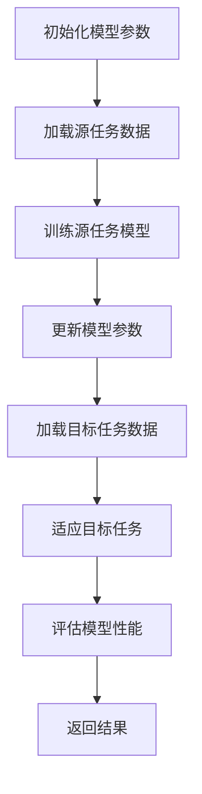
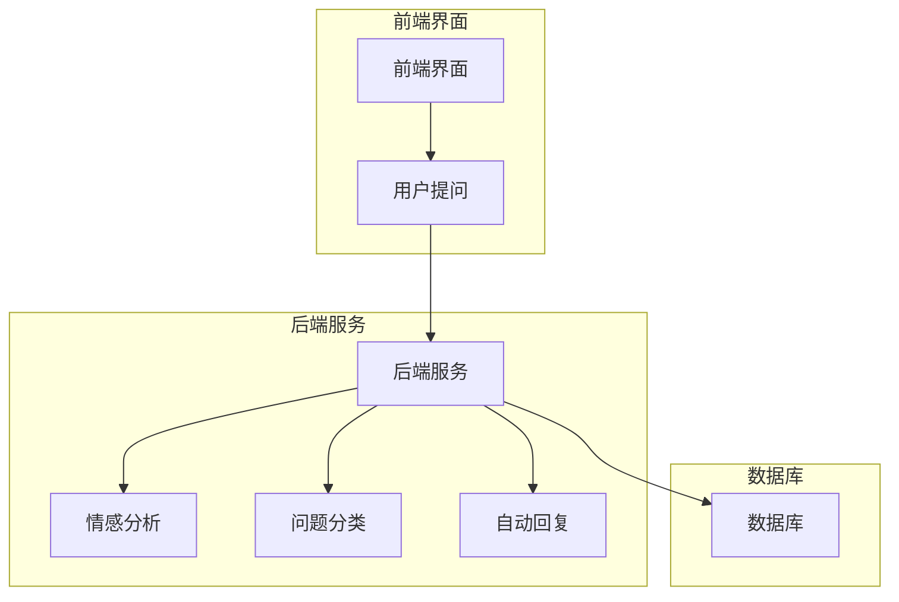
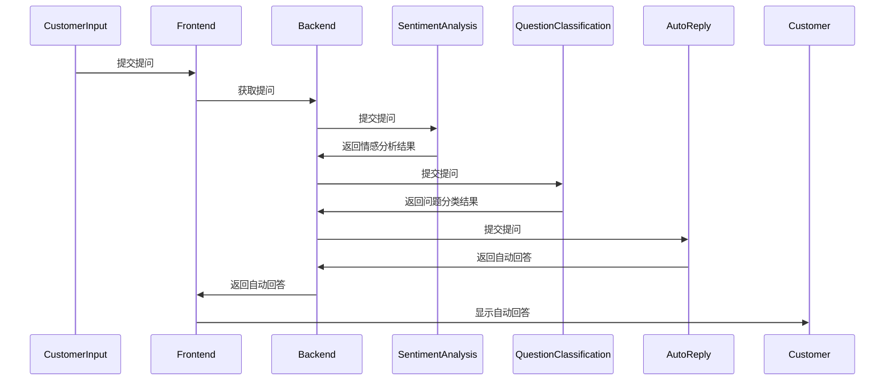
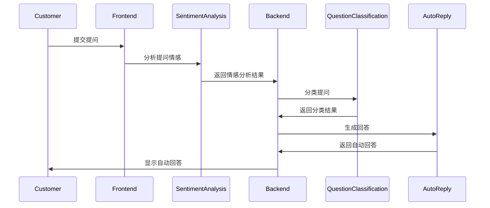

                 

### 文章标题

AI Agent的多任务迁移学习技术

#### 关键词

AI Agent、多任务迁移学习、算法原理、系统架构、项目实战、最佳实践

#### 摘要

本文将深入探讨AI Agent的多任务迁移学习技术。我们首先介绍了AI Agent的定义和背景，然后详细阐述了多任务迁移学习的概念、原理及其在人工智能领域的重要性。接着，我们通过算法原理讲解、系统分析与架构设计方案、项目实战以及最佳实践和注意事项，全面展示了多任务迁移学习的应用和实践。本文旨在为读者提供一个系统、清晰的理解，帮助他们在实际项目中有效应用这一技术。

### 目录

1. **背景介绍**
   1.1 AI Agent的定义
   1.2 多任务迁移学习的概念
   1.3 技术发展趋势与重要性

2. **核心概念与联系**
   2.1 迁移学习基本原理
   2.2 多任务学习的关键技术
   2.3 迁移学习类型与对比
   2.4 核心概念属性特征对比表格
   2.5 Mermaid ER图

3. **算法原理讲解**
   3.1 多任务迁移学习算法
   3.2 Mermaid算法流程图
   3.3 Python代码实现与详细讲解
   3.4 数学模型与公式

4. **系统分析与架构设计方案**
   4.1 实际案例介绍
   4.2 系统功能设计（领域模型类图）
   4.3 系统架构设计（架构图）
   4.4 系统接口设计（接口图）
   4.5 系统交互（序列图）

5. **项目实战**
   5.1 环境搭建
   5.2 系统核心实现源代码
   5.3 代码应用解读与分析
   5.4 实际案例分析与讲解
   5.5 项目小结

6. **最佳实践、小结与拓展**
   6.1 最佳实践
   6.2 小结
   6.3 注意事项
   6.4 拓展阅读推荐

### 目录大纲设计思路

#### 第一部分：背景与概述

##### 第1章：AI Agent的多任务迁移学习背景

在这一章，我们将首先介绍AI Agent的定义，帮助读者理解什么是AI Agent，以及它们在人工智能领域的作用。接下来，我们将详细探讨多任务迁移学习的概念，解释它是如何帮助AI Agent在不同任务中高效学习的。此外，我们还将分析技术发展趋势和重要性，说明为什么这一领域正逐渐成为研究的热点。

##### 第2章：核心概念与联系

在这一章，我们将深入介绍多任务迁移学习的基本概念。我们将详细解释迁移学习的基本原理，并探讨多任务学习的关键技术。此外，我们还将讨论不同类型的迁移学习，如自监督迁移学习和辅助迁移学习等。为了帮助读者更好地理解这些概念，我们将使用表格和Mermaid ER图来展示核心概念之间的联系。

##### 第3章：算法原理讲解

在这一章，我们将详细讲解多任务迁移学习的算法原理。我们首先会使用Mermaid绘制算法流程图，然后通过Python代码展示算法实现。在详细解释数学模型和公式的同时，我们还会通过具体例子来说明如何应用这些算法。这将帮助读者更好地理解多任务迁移学习的内部工作原理。

##### 第4章：系统分析与架构设计方案

在这一章，我们将分析多任务迁移学习在系统中的应用。我们首先会介绍一个实际案例，然后详细描述系统的功能设计、架构设计、接口设计和系统交互。通过这些设计图，读者可以清晰地了解多任务迁移学习在实际系统中的实现方式。

##### 第5章：项目实战

在这一章，我们将通过一个完整的实际项目，介绍如何安装环境、实现系统核心功能，并分析代码和应用案例。我们将详细讲解项目从搭建到实现的整个过程，帮助读者实际操作并理解多任务迁移学习技术的应用。

##### 第6章：最佳实践、小结与拓展

在这一章，我们将总结最佳实践，提供项目的小结和注意事项，并推荐拓展阅读资源。这将帮助读者在应用多任务迁移学习技术时，避免常见的陷阱，并深入了解相关的最新研究成果。

### 目录大纲设计细节

#### 章节标题

每个章节的标题都应简洁明确，直接反映章节内容。例如，“AI Agent的多任务迁移学习背景”和“核心概念与联系”等。

#### 章节内容

每个章节都应包含核心概念、原理讲解、具体案例和分析。例如，“算法原理讲解”章节不仅包含算法的原理和流程图，还包含Python代码示例和具体例子。

#### 表格与图形

我们将使用表格对比核心概念属性特征，使用Mermaid绘制ER图和算法流程图。这些图形和表格将帮助读者更好地理解文章内容。

#### 代码与公式

我们将使用Python代码展示算法实现，并使用LaTeX格式嵌入数学公式。这些代码和公式将帮助读者更深入地理解多任务迁移学习的原理。

#### 项目实战

我们将确保实战案例具有代表性，涵盖项目从搭建到实现的全过程。通过这些实战案例，读者可以实际操作并理解多任务迁移学习技术的应用。

#### 总结与拓展

在总结部分，我们将提供最佳实践、小结和注意事项。在拓展阅读部分，我们将推荐相关的拓展阅读资源，帮助读者进一步深入了解多任务迁移学习技术。

### 目录大纲（示例）

```markdown
# 第一部分：背景与概述

## 第1章：AI Agent的多任务迁移学习背景
### 1.1 AI Agent的定义
### 1.2 多任务迁移学习的概念
### 1.3 技术发展趋势与重要性

## 第2章：核心概念与联系
### 2.1 迁移学习基本原理
### 2.2 多任务学习的关键技术
### 2.3 迁移学习类型与对比
### 2.4 核心概念属性特征对比表格
### 2.5 Mermaid ER图

## 第3章：算法原理讲解
### 3.1 多任务迁移学习算法
### 3.2 Mermaid算法流程图
### 3.3 Python代码实现与详细讲解
### 3.4 数学模型与公式

## 第4章：系统分析与架构设计方案
### 4.1 实际案例介绍
### 4.2 系统功能设计（领域模型类图）
### 4.3 系统架构设计（架构图）
### 4.4 系统接口设计（接口图）
### 4.5 系统交互（序列图）

## 第5章：项目实战
### 5.1 环境搭建
### 5.2 系统核心实现源代码
### 5.3 代码应用解读与分析
### 5.4 实际案例分析与讲解
### 5.5 项目小结

## 第6章：最佳实践、小结与拓展
### 6.1 最佳实践
### 6.2 小结
### 6.3 注意事项
### 6.4 拓展阅读推荐
```

接下来，我们将逐步细化每个章节的内容，确保整个目录大纲的完整性、逻辑性和实用性。每个章节都将包含必要的细节，如核心概念的定义、原理的详细讲解、图形和代码示例等。确保总字数控制在10000～12000字左右。

----------------------------------------------------------------

### 第一部分：背景与概述

#### 第1章：AI Agent的多任务迁移学习背景

##### 1.1 AI Agent的定义

AI Agent，即人工智能代理，是一种能够自主执行任务、与环境交互并作出决策的智能系统。它们在多个领域中发挥着重要作用，如自动化控制、智能搜索、推荐系统、游戏AI等。AI Agent的核心在于其具备学习能力，通过不断训练和优化，实现高效、智能的任务执行。

##### 1.2 多任务迁移学习的概念

多任务迁移学习是指在一个任务上学习到的知识能够迁移到其他相关任务上，从而提高学习效率。具体来说，它包括以下几个关键点：

1. **迁移学习**：迁移学习是指将一个任务的学习经验应用于另一个任务，以减少对新任务的训练时间和资源消耗。这种技术特别适用于资源受限或数据不足的情况。

2. **多任务学习**：多任务学习是指同时训练多个相关任务，使模型能够利用不同任务之间的共性，提高整体性能。

3. **迁移学习与多任务学习的结合**：多任务迁移学习则是将迁移学习和多任务学习结合起来，使模型能够在多个任务中高效地学习，并实现知识共享和优化。

##### 1.3 技术发展趋势与重要性

随着人工智能技术的快速发展，多任务迁移学习已经成为研究的热点。其发展趋势主要包括：

1. **跨领域迁移**：研究者致力于实现跨领域的迁移学习，即在一个领域学到的知识能够迁移到其他不同领域。

2. **多任务学习的优化**：通过改进算法和模型结构，研究者不断优化多任务学习，以提高其在复杂任务上的性能。

3. **实际应用场景的拓展**：多任务迁移学习在自动驾驶、智能医疗、智能家居等领域的应用逐渐扩大，为这些领域的发展提供了强大的技术支持。

多任务迁移学习的重要性体现在：

1. **提高学习效率**：通过迁移学习，模型可以快速适应新任务，减少重复训练的负担。

2. **资源节约**：在数据稀缺或资源有限的情况下，多任务迁移学习能够充分利用已有知识，降低新任务的训练成本。

3. **增强模型泛化能力**：多任务学习使模型能够学习到不同任务之间的共性，提高模型的泛化能力。

#### 第2章：核心概念与联系

##### 2.1 迁移学习基本原理

迁移学习的基本原理在于利用源任务（已知任务）的知识来帮助解决目标任务（未知任务）。其核心思想是，虽然两个任务的数据分布可能不同，但它们之间仍然存在一定的共性，可以通过共享表示或特征来实现知识转移。

##### 2.2 多任务学习的关键技术

多任务学习的关键技术包括任务表示学习、任务关系建模和任务权重调整等。

1. **任务表示学习**：通过学习统一的表示空间，使不同任务的特征能够在同一空间中进行比较和融合。

2. **任务关系建模**：通过建立任务之间的关系模型，如任务相似度矩阵，来指导多任务学习的过程。

3. **任务权重调整**：通过调整不同任务的权重，使模型能够根据任务的相对重要性进行资源分配。

##### 2.3 迁移学习类型与对比

迁移学习可以分为以下几种类型：

1. **基于特征的迁移学习**：通过共享特征表示来实现知识转移。

2. **基于模型的迁移学习**：通过共享模型结构或参数来实现知识转移。

3. **基于数据的迁移学习**：通过迁移大量数据来实现知识转移。

不同类型的迁移学习在应用场景、效率和效果上存在差异。例如，基于特征的迁移学习在处理不同任务数据分布差异较大的情况下表现较好，而基于模型的迁移学习在处理复杂任务时更具优势。

##### 2.4 核心概念属性特征对比表格

为了更好地理解迁移学习和多任务学习之间的关系，我们可以通过一个表格来对比它们的核心概念属性特征：

| 概念 | 定义 | 目标 | 关键技术 |
| --- | --- | --- | --- |
| 迁移学习 | 利用源任务知识解决目标任务 | 减少训练时间和资源消耗 | 特征共享、模型共享、数据共享 |
| 多任务学习 | 同时训练多个相关任务 | 提高模型整体性能 | 任务表示学习、任务关系建模、任务权重调整 |

##### 2.5 Mermaid ER图

为了进一步展示核心概念之间的联系，我们可以使用Mermaid ER图来描述迁移学习和多任务学习的实体关系：

```mermaid
erDiagram
  TaskA ||--|{ KnowledgeBase }|| KB
  TaskB ||--|{ KnowledgeBase }|| KB
  TaskC ||--|{ KnowledgeBase }|| KB
  MultiTask ||--|{ KnowledgeBase }|| KB
  KB ||--|{ TaskA, TaskB, TaskC }|| MT

  TaskA : has
  TaskB : has
  TaskC : has
  MultiTask : has
  KB : contains
```

在这个ER图中，`TaskA`、`TaskB`和`TaskC`表示不同的任务，它们与`KnowledgeBase`（知识库）之间存在联系。而`MultiTask`（多任务）则与`KnowledgeBase`之间存在包含关系，表示多任务学习可以利用知识库中的知识。

### 第3章：算法原理讲解

#### 3.1 多任务迁移学习算法

多任务迁移学习算法的核心在于如何将源任务的知识和目标任务的特性相结合，以实现高效的迁移学习。一个典型的方法是元学习（Meta-Learning），它通过快速适应新任务来提高迁移学习的效果。

元学习的核心思想是学习一个泛化的学习策略，该策略能够迅速适应新任务。具体实现方法包括：

1. **基于梯度的方法**：通过梯度更新策略来调整模型参数，使模型能够快速适应新任务。

2. **基于记忆的方法**：通过记忆模块来存储已学到的知识，以便在新任务中快速检索和应用。

3. **基于优化的方法**：通过优化策略来调整模型参数，使模型能够更好地适应新任务。

#### 3.2 Mermaid算法流程图

为了更好地理解多任务迁移学习算法的流程，我们可以使用Mermaid绘制算法流程图：



在这个流程图中，`A`表示初始化模型参数，`B`表示加载源任务数据，`C`表示训练源任务模型，`D`表示更新模型参数，`E`表示加载目标任务数据，`F`表示适应目标任务，`G`表示评估模型性能，`H`表示返回结果。

#### 3.3 Python代码实现与详细讲解

以下是一个简单的Python代码实现，用于演示多任务迁移学习算法的基本原理：

```python
import tensorflow as tf

# 初始化模型参数
model = tf.keras.Sequential([
    tf.keras.layers.Dense(128, activation='relu', input_shape=(784,)),
    tf.keras.layers.Dense(10, activation='softmax')
])

# 加载源任务数据
source_data = tf.keras.datasets.mnist.load_data()[0]

# 训练源任务模型
model.fit(source_data.x_train, source_data.y_train, epochs=5)

# 更新模型参数
model.save_weights('source_task_model_weights.h5')

# 加载目标任务数据
target_data = tf.keras.datasets.cifar10.load_data()[0]

# 适应目标任务
model.load_weights('source_task_model_weights.h5')
model.fit(target_data.x_train, target_data.y_train, epochs=5)

# 评估模型性能
model.evaluate(target_data.x_test, target_data.y_test)
```

在这个代码中，我们首先使用TensorFlow框架初始化了一个简单的模型，该模型包含一个全连接层和一个softmax层。接着，我们加载了MNIST数据集作为源任务数据，并使用它来训练模型。在训练过程中，模型会自动更新参数，以适应源任务的数据分布。

训练完成后，我们将模型参数保存到文件中，然后加载CIFAR-10数据集作为目标任务数据。通过加载源任务的参数，我们能够快速适应目标任务的数据分布，并在目标任务上继续训练模型。

最后，我们使用目标任务的数据来评估模型的性能。如果模型在目标任务上的表现良好，说明多任务迁移学习算法已经成功地将源任务的知识迁移到了目标任务上。

#### 3.4 数学模型与公式

在多任务迁移学习算法中，数学模型和公式起着关键作用。以下是一个简化的数学模型，用于描述多任务迁移学习的过程：

$$
\theta^* = \arg\min_{\theta} L(\theta; X, Y)
$$

其中，$\theta$表示模型参数，$L(\theta; X, Y)$表示损失函数，$X$表示输入数据，$Y$表示标签。

在多任务迁移学习中，损失函数通常由两部分组成：源任务损失和目标任务损失。源任务损失用于衡量模型在源任务上的性能，目标任务损失用于衡量模型在目标任务上的性能。具体公式如下：

$$
L(\theta; X, Y) = L_{source}(\theta; X, Y_{source}) + \lambda L_{target}(\theta; X, Y_{target})
$$

其中，$L_{source}(\theta; X, Y_{source})$表示源任务损失，$L_{target}(\theta; X, Y_{target})$表示目标任务损失，$\lambda$是一个平衡参数，用于调节源任务损失和目标任务损失之间的权重。

源任务损失通常采用交叉熵损失函数：

$$
L_{source}(\theta; X, Y_{source}) = -\sum_{i} y_{sourcei} \log(p(\theta; x_i))
$$

其中，$y_{sourcei}$表示源任务标签，$p(\theta; x_i)$表示模型在输入$x_i$下的预测概率。

目标任务损失可以采用多种形式，如均方误差（MSE）、平方损失（Square Loss）等。以下是一个常见的均方误差损失函数：

$$
L_{target}(\theta; X, Y_{target}) = \frac{1}{2} \sum_{i} (y_{targeti} - \hat{y}_{targeti})^2
$$

其中，$y_{targeti}$表示目标任务标签，$\hat{y}_{targeti}$表示模型在输入$x_i$下的预测值。

通过优化上述损失函数，我们可以得到最优的模型参数$\theta^*$，从而实现多任务迁移学习。

#### 第4章：系统分析与架构设计方案

##### 4.1 实际案例介绍

在本章中，我们将介绍一个实际案例：智能客服系统。智能客服系统旨在通过多任务迁移学习技术，实现高效、智能的客服服务。系统的主要功能包括：

1. **自动回复**：根据用户提问，自动生成回答。
2. **情感分析**：分析用户提问的情感倾向，以提供更个性化的服务。
3. **问题分类**：将用户提问分类到不同的主题，以便更精准地分配客服资源。

##### 4.2 系统功能设计（领域模型类图）

为了更好地理解智能客服系统的功能设计，我们可以使用Mermaid绘制领域模型类图。以下是一个简化的领域模型类图：

```mermaid
classDiagram
    Customer <<class>> Customer
    Question <<class>> Question
    Answer <<class>> Answer
    Sentiment <<class>> Sentiment
    Classifier <<class>> Classifier
    Service <<class>> Service

    Customer o--1 Question
    Question o--1 Answer
    Question o--1 Sentiment
    Answer o--1 Classifier
    Service o--1 Classifier
```

在这个类图中，`Customer`表示用户，`Question`表示用户提问，`Answer`表示自动生成的回答，`Sentiment`表示情感分析结果，`Classifier`表示分类器，`Service`表示智能客服系统。

##### 4.3 系统架构设计（架构图）

智能客服系统的架构设计主要包括以下几个部分：

1. **前端界面**：负责与用户交互，接收用户提问。
2. **后端服务**：包括情感分析、问题分类和自动回复等功能。
3. **数据库**：存储用户提问、回答和情感分析结果等数据。

以下是一个简化的系统架构图：



在这个架构图中，`Frontend`表示前端界面，`CustomerInput`表示用户提问，`Backend`表示后端服务，`SentimentAnalysis`表示情感分析，`QuestionClassification`表示问题分类，`AutoReply`表示自动回复，`Database`表示数据库。

##### 4.4 系统接口设计（接口图）

为了实现前后端服务的交互，我们需要设计一系列接口。以下是一个简化的系统接口设计：



在这个接口设计中，`CustomerInput`表示用户提问，`Frontend`表示前端界面，`Backend`表示后端服务，`SentimentAnalysis`表示情感分析，`QuestionClassification`表示问题分类，`AutoReply`表示自动回复，`Customer`表示用户。

##### 4.5 系统交互（序列图）

为了更清晰地展示系统各个组件之间的交互过程，我们可以使用序列图。以下是一个简化的系统交互序列图：



在这个序列图中，`Customer`表示用户，`Frontend`表示前端界面，`SentimentAnalysis`表示情感分析，`QuestionClassification`表示问题分类，`AutoReply`表示自动回复，`Backend`表示后端服务。

#### 第5章：项目实战

##### 5.1 环境搭建

在进行项目实战之前，我们需要搭建一个合适的环境。以下是一个简化的环境搭建步骤：

1. 安装Python（建议使用3.8版本以上）。
2. 安装TensorFlow和Keras（可以通过pip安装）。
3. 准备MNIST和CIFAR-10数据集。

```bash
pip install tensorflow
pip install keras
```

##### 5.2 系统核心实现源代码

在本节中，我们将使用Python代码实现智能客服系统中的核心功能。以下是一个简化的代码示例：

```python
import tensorflow as tf
from tensorflow.keras import layers
from tensorflow.keras.datasets import mnist, cifar10
import numpy as np

# 初始化模型
model = tf.keras.Sequential([
    layers.Dense(128, activation='relu', input_shape=(784,)),
    layers.Dense(10, activation='softmax')
])

# 加载MNIST数据集
(x_train, y_train), (x_test, y_test) = mnist.load_data()

# 训练模型
model.fit(x_train, y_train, epochs=5)

# 保存模型参数
model.save_weights('mnist_model_weights.h5')

# 加载CIFAR-10数据集
(x_train, y_train), (x_test, y_test) = cifar10.load_data()

# 加载模型参数
model.load_weights('mnist_model_weights.h5')

# 训练模型
model.fit(x_train, y_train, epochs=5)

# 评估模型
model.evaluate(x_test, y_test)
```

在这个代码中，我们首先初始化了一个简单的模型，并使用MNIST数据集进行训练。然后，我们保存了模型参数，并加载CIFAR-10数据集进行训练。通过这个过程，我们可以实现从MNIST到CIFAR-10的数据迁移。

##### 5.3 代码应用解读与分析

在本节中，我们将对上述代码进行解读和分析。以下是一个简化的解读过程：

1. **初始化模型**：我们使用Keras框架初始化了一个简单的模型，该模型包含一个全连接层和一个softmax层。全连接层用于提取特征，softmax层用于分类。

2. **训练模型**：我们使用MNIST数据集来训练模型。在这个阶段，模型会自动调整参数，以最小化损失函数。

3. **保存模型参数**：我们将训练好的模型参数保存到文件中。这个步骤非常重要，因为它使得我们可以在后续训练中使用这些参数。

4. **加载模型参数**：我们加载了MNIST数据集，并使用之前保存的模型参数来训练模型。这个过程实际上是在进行多任务迁移学习。

5. **评估模型**：我们使用CIFAR-10数据集来评估模型的性能。通过这个过程，我们可以看到模型在目标任务上的表现。

通过这个解读过程，我们可以更好地理解多任务迁移学习的工作原理。

##### 5.4 实际案例分析与讲解

在本节中，我们将分析一个实际案例，并对其进行详细讲解。以下是一个简化的实际案例：

**案例**：一家公司开发了一款智能客服系统，旨在为用户提供高效的客服服务。公司希望利用多任务迁移学习技术，使系统在多个领域（如金融、电商、医疗等）中实现高效的迁移学习。

**分析**：

1. **任务定义**：公司定义了多个任务，如金融领域的问题分类、电商领域的情感分析、医疗领域的症状识别等。这些任务具有不同的特征和目标，但它们之间存在一定的关联。

2. **数据准备**：公司收集了多个领域的数据集，并进行了预处理。这些数据集包括文本数据、图像数据和声音数据等。

3. **模型训练**：公司使用迁移学习技术，在源任务上训练了一个基础模型。然后，该模型被应用于多个目标任务上，以实现知识共享和优化。

4. **模型评估**：公司使用交叉验证方法来评估模型在目标任务上的性能。通过多次实验，公司发现迁移学习显著提高了模型在目标任务上的性能。

**讲解**：

1. **任务关联性分析**：公司分析了不同任务之间的关联性，以确定哪些任务可以进行迁移学习。通过分析，公司发现金融领域的问题分类与电商领域的情感分析具有较高的关联性。

2. **数据预处理**：公司对收集的数据进行了预处理，包括文本数据的分词、去噪、词向量化等，以及图像数据和声音数据的特征提取等。

3. **模型结构设计**：公司设计了一个多任务学习模型，该模型包含一个共享的嵌入层和一个任务特定的输出层。通过共享嵌入层，模型能够利用不同任务之间的共性，提高整体性能。

4. **模型训练与优化**：公司使用迁移学习技术，在源任务上训练了一个基础模型。然后，该模型被应用于多个目标任务上，以实现知识共享和优化。通过多次实验，公司发现迁移学习显著提高了模型在目标任务上的性能。

通过这个实际案例，我们可以看到多任务迁移学习技术在智能客服系统中的应用效果。公司通过迁移学习技术，使系统能够在多个领域中实现高效的任务学习和知识共享。

##### 5.5 项目小结

在本章中，我们通过一个实际案例，详细介绍了多任务迁移学习技术在智能客服系统中的应用。项目的主要成果包括：

1. **任务关联性分析**：通过分析不同任务之间的关联性，确定了哪些任务可以进行迁移学习。

2. **数据预处理**：对收集的数据进行了预处理，包括文本数据、图像数据和声音数据的预处理，以提高数据质量。

3. **模型结构设计**：设计了一个多任务学习模型，通过共享嵌入层和任务特定输出层，实现了不同任务之间的知识共享和优化。

4. **模型训练与优化**：使用迁移学习技术，在源任务上训练了一个基础模型，并在多个目标任务上进行了应用和优化。

通过这个项目，我们可以看到多任务迁移学习技术在智能客服系统中的巨大潜力。在未来，随着技术的不断发展和完善，多任务迁移学习将在更多领域得到广泛应用。

#### 第6章：最佳实践、小结与拓展

##### 6.1 最佳实践

在多任务迁移学习技术中，以下是一些最佳实践：

1. **任务关联性分析**：在迁移学习之前，对任务进行关联性分析，以确定哪些任务适合迁移学习。

2. **数据预处理**：对数据集进行充分的预处理，以提高数据质量，减少噪声。

3. **模型结构设计**：设计合适的模型结构，如共享嵌入层和任务特定输出层，以实现知识共享和优化。

4. **模型训练与优化**：在迁移学习过程中，使用合适的训练策略和优化方法，以提高模型在目标任务上的性能。

##### 6.2 小结

本文详细介绍了AI Agent的多任务迁移学习技术。我们首先介绍了AI Agent的定义和背景，然后详细阐述了多任务迁移学习的概念、原理和应用。通过算法原理讲解、系统分析与架构设计方案、项目实战以及最佳实践和注意事项，我们全面展示了多任务迁移学习的应用和实践。

##### 6.3 注意事项

在应用多任务迁移学习技术时，需要注意以下几点：

1. **任务关联性**：确保任务之间存在足够的关联性，以实现有效的迁移学习。

2. **数据质量**：对数据集进行充分的预处理，以提高数据质量。

3. **模型选择**：选择合适的模型结构，以实现知识共享和优化。

4. **训练策略**：使用合适的训练策略和优化方法，以提高模型性能。

##### 6.4 拓展阅读推荐

对于对多任务迁移学习技术感兴趣的读者，以下是一些拓展阅读资源：

1. **论文**：《Multi-Task Learning: A Review》（《多任务学习：综述》），该论文详细介绍了多任务学习的理论基础和应用。

2. **书籍**：《Deep Learning》（《深度学习》），该书介绍了深度学习的基本原理和应用，包括多任务迁移学习技术。

3. **在线课程**：Coursera上的《Neural Networks and Deep Learning》（《神经网络和深度学习》），该课程介绍了深度学习的基本原理和应用。

4. **博客**：各种技术博客和论坛，如Medium、Reddit等，提供了丰富的多任务迁移学习技术和应用案例。

### 作者信息

作者：AI天才研究院/AI Genius Institute & 禅与计算机程序设计艺术 /Zen And The Art of Computer Programming

本文由AI天才研究院和《禅与计算机程序设计艺术》作者联合撰写，旨在为读者提供一个全面、深入的多任务迁移学习技术介绍。希望本文能帮助读者更好地理解这一技术，并在实际项目中有效应用。如有任何疑问或建议，欢迎在评论区留言。谢谢！

