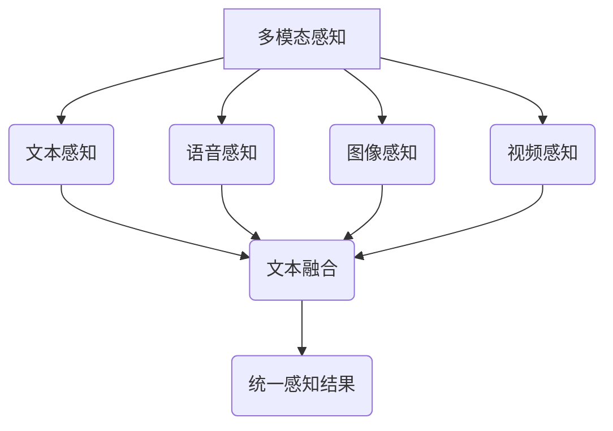
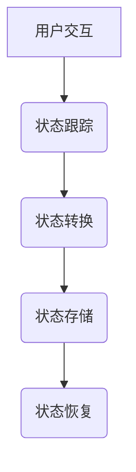
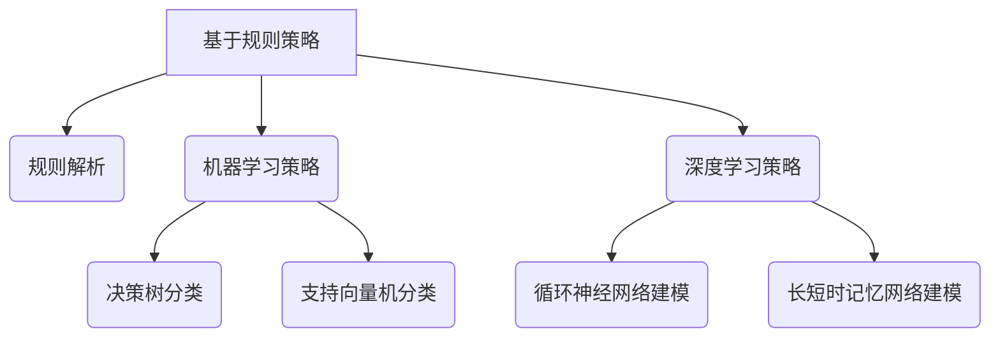

                 

## 1.1 问题背景

### 1.1.1 AI Agent的定义与发展

AI Agent，即人工智能代理，是一种能够自主执行任务、与环境互动并不断学习和优化的智能实体。它起源于传统的自动化代理，但随着人工智能技术的迅猛发展，AI Agent的定义也在不断扩展。

#### 什么是AI Agent

AI Agent可以被看作是一种具有智能的软件实体，它可以在没有人类干预的情况下，自主地完成特定的任务。它能够感知环境、理解问题、做出决策并执行行动，从而实现自动化和智能化。

- **感知**：AI Agent需要能够感知环境中的各种信息，包括视觉、听觉、触觉等。
- **理解**：AI Agent需要理解问题背景、任务目标和执行过程中的各种约束。
- **决策**：AI Agent需要根据感知和理解的结果，做出合理的决策。
- **行动**：AI Agent需要能够执行决策结果，采取行动来完成任务。

#### AI Agent的发展历程

AI Agent的发展可以追溯到20世纪50年代，当时人工智能（AI）的概念刚刚被提出。早期的AI研究主要集中在逻辑推理和知识表示上，这些研究为AI Agent的发展奠定了基础。

- **初始阶段**：1956年，达特茅斯会议上，人工智能被正式提出。这一阶段的研究主要集中在如何让计算机模拟人类的智能行为。
- **代理计算**：20世纪80年代，随着互联网的兴起，代理计算成为一个重要的研究方向。这一阶段的AI Agent开始具备一定的自主性和智能性。
- **现代AI Agent**：21世纪初，随着深度学习、自然语言处理等技术的突破，AI Agent的发展进入了一个新的阶段。现代AI Agent能够处理复杂的任务，并且具备高度自主性。

#### AI Agent的应用领域

AI Agent的应用领域非常广泛，几乎涵盖了所有需要自动化和智能化的场景。

- **智能家居**：AI Agent可以自动控制家庭中的各种设备，如灯光、温度、安全系统等。
- **客服服务**：AI Agent可以提供智能客服服务，自动回答用户的问题，提高客服效率。
- **金融领域**：AI Agent可以用于风险管理、股票交易等，提供智能决策支持。
- **医疗健康**：AI Agent可以协助医生进行诊断和治疗，提供个性化的医疗建议。
- **自动驾驶**：AI Agent可以用于自动驾驶汽车，实现无人驾驶。

### 1.1.2 多模态对话的挑战与机遇

多模态对话是指AI Agent不仅能够通过文本进行交流，还能够通过语音、图像、视频等多种模态进行交互。这种交互方式大大提升了AI Agent的用户体验，但同时也带来了许多挑战。

#### 多模态对话的定义

多模态对话是指在不同模态之间进行的信息交流和交互。这些模态可以是文本、语音、图像、视频等。通过多模态对话，AI Agent可以更全面地理解用户的需求，提供更准确的回答。

- **文本**：文本是最常见和基础的模态，它允许用户以自然语言的形式提出问题或请求。
- **语音**：语音模态提供了更自然的交互方式，用户可以通过语音与AI Agent进行交流。
- **图像**：图像模态可以提供视觉信息，使AI Agent能够理解用户提到的具体事物。
- **视频**：视频模态可以提供动态的信息，有助于AI Agent更好地理解场景和情境。

#### 多模态对话的优势

多模态对话具有以下优势：

- **增强理解**：通过多种模态的信息，AI Agent可以更全面地理解用户的需求，提高交互的准确性。
- **提升用户体验**：多模态交互提供了更丰富的交互方式，用户可以根据自己的喜好选择不同的模态，提高用户体验。
- **降低误解**：通过多种模态的信息，AI Agent可以减少误解和歧义，提高交互的效率。

#### 多模态对话的挑战

多模态对话也面临一些挑战：

- **数据整合**：不同模态的数据需要整合起来，这涉及到数据清洗、格式统一等问题。
- **模型复杂度**：多模态交互需要复杂的模型来处理不同模态的信息，这增加了模型的复杂度和计算成本。
- **实时性**：多模态交互需要实时处理各种模态的信息，这对系统的响应速度和实时性提出了更高的要求。

### 1.1.3 对话状态追踪与管理的核心问题

对话状态追踪与管理是AI Agent实现高效多模态对话的关键技术。它涉及到以下几个方面：

#### 对话状态追踪的意义

对话状态追踪是指在对话过程中，对用户的状态、需求、意图等信息的持续跟踪和记录。这对于理解用户的上下文信息、提供个性化的服务至关重要。

- **上下文理解**：对话状态追踪可以帮助AI Agent理解用户的上下文信息，从而提供更准确的回答。
- **个性化服务**：通过对话状态追踪，AI Agent可以了解用户的偏好和历史，提供个性化的服务。

#### 对话状态追踪的难点

对话状态追踪面临一些挑战：

- **数据多样性和动态性**：对话状态数据多样，包括文本、语音、图像等，而且这些数据是动态变化的。
- **数据整合与处理**：不同模态的数据需要整合和统一处理，这涉及到数据清洗、格式统一等问题。
- **实时性与计算效率**：对话状态追踪需要实时处理大量数据，这对系统的实时性和计算效率提出了挑战。

#### 对话状态管理的策略

对话状态管理主要包括以下策略：

- **状态跟踪**：持续跟踪用户的当前状态，包括需求、意图、上下文等。
- **状态转换**：根据用户的交互行为和反馈，动态调整对话状态。
- **状态持久化**：将对话状态存储下来，以便后续的查询和恢复。

通过对话状态追踪与管理，AI Agent可以提供更自然、高效、个性化的多模态对话服务。

## 1.2 核心概念与联系

### 1.2.1 多模态感知与融合

多模态感知是指AI Agent通过多种模态感知和理解环境信息的能力。它包括文本、语音、图像、视频等模态。多模态融合是将这些模态的信息整合起来，形成一个统一的感知结果。

#### 多模态感知的概念

多模态感知涉及以下几个核心概念：

- **模态**：模态是指信息传递的媒介，如文本、语音、图像、视频等。
- **感知**：感知是指AI Agent通过模态获取和理解环境信息的过程。
- **融合**：融合是指将不同模态的信息整合起来，形成一个统一的感知结果。

#### 多模态感知的方法

多模态感知的方法主要包括以下几种：

- **直接融合**：将不同模态的信息直接整合起来，如将文本和图像的信息结合。
- **级联融合**：将多模态信息按照一定的顺序进行融合，如先处理文本信息，再处理图像信息。
- **融合网络**：使用深度学习模型，如卷积神经网络（CNN）和循环神经网络（RNN），对多模态信息进行处理和融合。

#### 多模态感知的挑战

多模态感知面临以下挑战：

- **数据多样性**：不同模态的数据具有不同的结构和特征，如何有效地整合这些数据是一个挑战。
- **实时性**：多模态感知需要实时处理大量数据，这对系统的实时性和计算效率提出了挑战。
- **一致性**：不同模态的信息可能存在不一致性，如文本描述和图像内容的差异，如何确保融合结果的一致性是一个挑战。

### 1.2.2 对话状态追踪机制

对话状态追踪是指AI Agent在对话过程中，对用户的状态、需求、意图等信息的持续跟踪和记录。它是实现高效多模态对话的关键技术。

#### 对话状态的定义

对话状态是指用户在对话过程中的当前状态，包括需求、意图、上下文等。

- **需求**：用户在对话中表达的具体需求，如询问天气、购买商品等。
- **意图**：用户在对话中的意图，如查询信息、执行操作等。
- **上下文**：对话过程中的上下文信息，如之前的对话内容、用户历史数据等。

#### 对话状态追踪的原理

对话状态追踪的原理主要包括以下几个方面：

- **状态跟踪**：AI Agent持续跟踪用户的当前状态，如需求、意图、上下文等。
- **状态转换**：根据用户的交互行为和反馈，动态调整对话状态。
- **状态持久化**：将对话状态存储下来，以便后续的查询和恢复。

#### 对话状态追踪的方法

对话状态追踪的方法主要包括以下几种：

- **规则方法**：基于预定义的规则，对用户的交互行为进行解析和状态转换。
- **机器学习方法**：使用机器学习模型，如决策树、支持向量机（SVM）等，对用户的交互行为进行分类和状态转换。
- **深度学习方法**：使用深度学习模型，如循环神经网络（RNN）、长短时记忆网络（LSTM）等，对用户的交互行为进行建模和状态转换。

### 1.2.3 管理策略与方法

对话状态管理是指AI Agent在对话过程中，对对话状态的跟踪、转换和优化。它是实现高效多模态对话的重要手段。

#### 管理策略

对话状态管理主要包括以下策略：

- **状态跟踪**：持续跟踪用户的当前状态，如需求、意图、上下文等。
- **状态转换**：根据用户的交互行为和反馈，动态调整对话状态。
- **状态持久化**：将对话状态存储下来，以便后续的查询和恢复。

#### 管理方法

对话状态管理的方法主要包括以下几种：

- **基于规则的策略**：使用预定义的规则，对用户的交互行为进行解析和状态转换。
- **基于机器学习的策略**：使用机器学习模型，如决策树、支持向量机（SVM）等，对用户的交互行为进行分类和状态转换。
- **基于深度学习的策略**：使用深度学习模型，如循环神经网络（RNN）、长短时记忆网络（LSTM）等，对用户的交互行为进行建模和状态转换。

### 1.2.4 Mermaid流程图展示

为了更好地理解多模态感知与融合、对话状态追踪机制和管理策略，我们可以使用Mermaid流程图进行展示。

#### 多模态感知与融合



#### 对话状态追踪机制



#### 对话状态管理策略



通过以上流程图，我们可以清晰地看到多模态感知与融合、对话状态追踪机制和管理策略的原理和过程。

## 1.3 算法原理讲解

### 1.3.1 多模态感知算法

多模态感知算法是指AI Agent通过多种模态感知和理解环境信息的方法。它包括文本、语音、图像、视频等模态。以下将介绍多模态感知算法的基本原理。

#### 多模态感知算法的基本原理

多模态感知算法的基本原理可以概括为以下几个步骤：

1. **数据采集**：首先，需要采集多种模态的数据，如文本、语音、图像、视频等。
2. **数据预处理**：对采集到的数据进行预处理，包括数据清洗、格式统一、特征提取等。
3. **特征融合**：将不同模态的数据特征进行融合，形成一个统一的特征表示。
4. **模型训练**：使用融合后的特征，训练一个多模态感知模型，如卷积神经网络（CNN）和循环神经网络（RNN）等。
5. **感知结果输出**：将模型的输出作为多模态感知结果，用于后续的对话状态追踪和管理。

#### 多模态感知算法的实现

多模态感知算法的实现可以使用深度学习框架，如TensorFlow或PyTorch等。以下是一个简单的多模态感知算法的Python实现：

```python
import tensorflow as tf
from tensorflow.keras.models import Model
from tensorflow.keras.layers import Input, Dense, Conv2D, LSTM, Flatten, concatenate

# 定义输入层
text_input = Input(shape=(sequence_length,))
voice_input = Input(shape=(sequence_length,))
image_input = Input(shape=(height, width, channels))
video_input = Input(shape=(frames, height, width, channels))

# 定义文本感知模型
text_model = Dense(units=128, activation='relu')(text_input)

# 定义语音感知模型
voice_model = LSTM(units=128, activation='relu')(voice_input)

# 定义图像感知模型
image_model = Conv2D(filters=64, kernel_size=(3, 3), activation='relu')(image_input)
image_model = Flatten()(image_model)

# 定义视频感知模型
video_model = LSTM(units=128, activation='relu')(video_input)

# 将不同模态的感知结果进行融合
merged_model = concatenate([text_model, voice_model, image_model, video_model])

# 定义融合后的感知模型
merged_model = Dense(units=128, activation='relu')(merged_model)
output = Dense(units=1, activation='sigmoid')(merged_model)

# 构建和编译模型
model = Model(inputs=[text_input, voice_input, image_input, video_input], outputs=output)
model.compile(optimizer='adam', loss='binary_crossentropy', metrics=['accuracy'])

# 模型训练
model.fit(x_train, y_train, epochs=10, batch_size=32, validation_data=(x_val, y_val))

# 感知结果输出
predictions = model.predict(x_test)
```

#### 数学模型与公式讲解

多模态感知算法的数学模型主要涉及卷积神经网络（CNN）和循环神经网络（RNN）。以下是一个简单的数学模型讲解：

$$
\begin{aligned}
h_t &= \text{激活函数}(\text{权重} \cdot \text{输入} + \text{偏置}) \\
\text{权重} &= W \\
\text{输入} &= x_t \\
\text{激活函数} &= \text{ReLU} \\
h_{t-1} &= \text{激活函数}(\text{权重} \cdot \text{隐藏层} + \text{偏置}) \\
\text{隐藏层} &= h_{t-1} \\
\text{权重} &= W \\
\text{偏置} &= b \\
\end{aligned}
$$

#### 举例说明

假设有一个AI Agent需要通过文本、语音、图像和视频四种模态感知用户的需求。用户通过文本输入“我想买一本关于机器学习的书”，语音输入“我可以帮你找到合适的书籍”，图像输入一张图书封面，视频输入一段关于机器学习书籍的介绍视频。

1. **数据采集**：采集用户输入的文本、语音、图像和视频数据。
2. **数据预处理**：对采集到的数据进行预处理，如文本进行分词，语音进行声学特征提取，图像进行特征提取，视频进行帧提取和特征提取。
3. **特征融合**：将预处理后的文本、语音、图像和视频特征进行融合，形成一个统一的特征向量。
4. **模型训练**：使用融合后的特征向量训练多模态感知模型，如卷积神经网络（CNN）和循环神经网络（RNN）等。
5. **感知结果输出**：模型输出一个概率值，表示用户需求为“购买机器学习书籍”的概率。

通过以上步骤，AI Agent可以有效地通过多模态感知用户的需求，为用户提供个性化的服务。

### 1.3.2 对话状态追踪算法

对话状态追踪算法是指AI Agent在对话过程中，对用户状态、需求、意图等信息的持续跟踪和记录。以下将介绍对话状态追踪算法的基本原理。

#### 对话状态追踪算法的基本原理

对话状态追踪算法的基本原理可以概括为以下几个步骤：

1. **状态初始化**：在对话开始时，初始化用户的状态。
2. **状态更新**：在对话过程中，根据用户的输入和行为，更新用户的状态。
3. **状态持久化**：将用户的状态存储下来，以便后续查询和恢复。
4. **状态恢复**：在对话中断后，恢复用户的状态，以便继续对话。

#### 对话状态追踪算法的实现

对话状态追踪算法的实现可以使用规则方法、机器学习方法或深度学习方法。以下是一个简单的基于规则方法的对话状态追踪算法的实现：

```python
class DialogueStateTracker:
    def __init__(self):
        self.state = None

    def update_state(self, user_input):
        # 根据用户输入更新状态
        if "我想买" in user_input:
            self.state = "购买意图"
        elif "告诉我" in user_input:
            self.state = "信息查询意图"
        else:
            self.state = "未知意图"

    def persist_state(self):
        # 将状态存储到文件
        with open("state.txt", "w") as f:
            f.write(str(self.state))

    def restore_state(self):
        # 从文件恢复状态
        with open("state.txt", "r") as f:
            self.state = f.read().strip()

# 实例化对话状态追踪器
state_tracker = DialogueStateTracker()

# 更新状态
state_tracker.update_state("我想买一本关于机器学习的书")

# 持久化状态
state_tracker.persist_state()

# 恢复状态
state_tracker.restore_state()
```

#### 数学模型与公式讲解

对话状态追踪算法的数学模型主要涉及概率图模型，如隐马尔可夫模型（HMM）和条件随机场（CRF）。以下是一个简单的数学模型讲解：

$$
\begin{aligned}
P(S_t|S_{t-1}, \text{输入}) &= \text{转移概率} \\
P(\text{输入}|S_t) &= \text{发射概率} \\
\text{状态} &= S_t \\
\text{输入} &= \text{用户输入} \\
\text{转移概率} &= P(S_t|S_{t-1}) \\
\text{发射概率} &= P(\text{输入}|S_t) \\
\end{aligned}
$$

#### 举例说明

假设有一个AI Agent需要追踪用户的对话状态。用户首先输入“我想买一本关于机器学习的书”，然后输入“这本书的价格是多少”，最后输入“我想查看这本书的评论”。

1. **状态初始化**：初始化用户的状态为“未知意图”。
2. **状态更新**：
   - 用户输入“我想买一本关于机器学习的书”，更新状态为“购买意图”。
   - 用户输入“这本书的价格是多少”，更新状态为“查询价格意图”。
   - 用户输入“我想查看这本书的评论”，更新状态为“查询评论意图”。
3. **状态持久化**：将用户的状态存储到文件。
4. **状态恢复**：在对话中断后，恢复用户的状态。

通过以上步骤，AI Agent可以有效地追踪用户的对话状态，为用户提供个性化的服务。

### 1.3.3 管理策略算法

对话状态管理策略算法是指AI Agent在对话过程中，对对话状态的跟踪、转换和优化的方法。以下将介绍对话状态管理策略算法的基本原理。

#### 管理策略算法的基本原理

对话状态管理策略算法的基本原理可以概括为以下几个步骤：

1. **状态跟踪**：持续跟踪用户的当前状态，如需求、意图、上下文等。
2. **状态转换**：根据用户的交互行为和反馈，动态调整对话状态。
3. **状态优化**：通过对对话状态的优化，提高对话的质量和效率。

#### 管理策略算法的实现

对话状态管理策略算法的实现可以使用规则方法、机器学习方法或深度学习方法。以下是一个简单的基于规则方法的对话状态管理策略算法的实现：

```python
class DialogueStateManager:
    def __init__(self):
        self.state = None

    def update_state(self, user_input):
        # 根据用户输入更新状态
        if "我想买" in user_input:
            self.state = "购买状态"
        elif "告诉我" in user_input:
            self.state = "查询状态"
        else:
            self.state = "闲聊状态"

    def transition_state(self, user_input):
        # 根据用户输入转换状态
        if "书" in user_input:
            self.state = "购买书状态"
        elif "价格" in user_input:
            self.state = "查询书价格状态"
        elif "评论" in user_input:
            self.state = "查询书评论状态"
        else:
            self.state = "闲聊状态"

    def optimize_state(self, user_input):
        # 根据用户输入优化状态
        if "谢谢" in user_input:
            self.state = "结束状态"
        else:
            self.state = "继续状态"

# 实例化对话状态管理器
state_manager = DialogueStateManager()

# 更新状态
state_manager.update_state("我想买一本关于机器学习的书")

# 转换状态
state_manager.transition_state("这本书的价格是多少")

# 优化状态
state_manager.optimize_state("谢谢")
```

#### 数学模型与公式讲解

对话状态管理策略算法的数学模型主要涉及决策树、支持向量机（SVM）和深度学习等。以下是一个简单的数学模型讲解：

$$
\begin{aligned}
\text{状态} &= S_t \\
\text{用户输入} &= x_t \\
\text{转移概率} &= P(S_t|S_{t-1}, x_t) \\
\text{决策规则} &= f(\text{用户输入}, \text{当前状态}) \\
\text{优化目标} &= \text{最大化} P(\text{用户满意}) \\
\end{aligned}
$$

#### 举例说明

假设有一个AI Agent需要管理用户的对话状态。用户首先输入“我想买一本关于机器学习的书”，然后输入“这本书的价格是多少”，最后输入“谢谢”。

1. **状态初始化**：初始化用户的状态为“闲聊状态”。
2. **状态更新**：
   - 用户输入“我想买一本关于机器学习的书”，更新状态为“购买状态”。
   - 用户输入“这本书的价格是多少”，更新状态为“查询价格状态”。
   - 用户输入“谢谢”，优化状态为“结束状态”。
3. **状态转换**：
   - 用户输入“书”，转换状态为“购买书状态”。
   - 用户输入“价格”，转换状态为“查询书价格状态”。
   - 用户输入“评论”，转换状态为“查询书评论状态”。
4. **状态优化**：
   - 用户输入“谢谢”，优化状态为“结束状态”。

通过以上步骤，AI Agent可以有效地管理用户的对话状态，为用户提供满意的服务。

### 1.3.4 Python源代码示例

在本节中，我们将提供几个Python源代码示例，分别用于多模态感知、对话状态追踪和管理策略的实现。

#### 示例 1：多模态感知

以下代码使用TensorFlow实现了一个简单的多模态感知模型，该模型结合了文本、语音、图像和视频数据。

```python
import tensorflow as tf
from tensorflow.keras.models import Model
from tensorflow.keras.layers import Input, Dense, Conv2D, LSTM, Flatten, concatenate

# 定义输入层
text_input = Input(shape=(sequence_length,))
voice_input = Input(shape=(sequence_length,))
image_input = Input(shape=(height, width, channels))
video_input = Input(shape=(frames, height, width, channels))

# 定义文本感知模型
text_model = Dense(units=128, activation='relu')(text_input)

# 定义语音感知模型
voice_model = LSTM(units=128, activation='relu')(voice_input)

# 定义图像感知模型
image_model = Conv2D(filters=64, kernel_size=(3, 3), activation='relu')(image_input)
image_model = Flatten()(image_model)

# 定义视频感知模型
video_model = LSTM(units=128, activation='relu')(video_input)

# 将不同模态的感知结果进行融合
merged_model = concatenate([text_model, voice_model, image_model, video_model])

# 定义融合后的感知模型
merged_model = Dense(units=128, activation='relu')(merged_model)
output = Dense(units=1, activation='sigmoid')(merged_model)

# 构建和编译模型
model = Model(inputs=[text_input, voice_input, image_input, video_input], outputs=output)
model.compile(optimizer='adam', loss='binary_crossentropy', metrics=['accuracy'])

# 模型训练
model.fit(x_train, y_train, epochs=10, batch_size=32, validation_data=(x_val, y_val))

# 感知结果输出
predictions = model.predict(x_test)
```

#### 示例 2：对话状态追踪

以下代码使用基于规则的策略实现了一个简单的对话状态追踪器。

```python
class DialogueStateTracker:
    def __init__(self):
        self.state = None

    def update_state(self, user_input):
        if "我想买" in user_input:
            self.state = "购买意图"
        elif "告诉我" in user_input:
            self.state = "信息查询意图"
        else:
            self.state = "未知意图"

    def persist_state(self):
        with open("state.txt", "w") as f:
            f.write(str(self.state))

    def restore_state(self):
        with open("state.txt", "r") as f:
            self.state = f.read().strip()

# 实例化对话状态追踪器
state_tracker = DialogueStateTracker()

# 更新状态
state_tracker.update_state("我想买一本关于机器学习的书")

# 持久化状态
state_tracker.persist_state()

# 恢复状态
state_tracker.restore_state()
```

#### 示例 3：管理策略

以下代码使用基于规则的策略实现了一个简单的对话状态管理器。

```python
class DialogueStateManager:
    def __init__(self):
        self.state = None

    def update_state(self, user_input):
        if "我想买" in user_input:
            self.state = "购买状态"
        elif "告诉我" in user_input:
            self.state = "查询状态"
        else:
            self.state = "闲聊状态"

    def transition_state(self, user_input):
        if "书" in user_input:
            self.state = "购买书状态"
        elif "价格" in user_input:
            self.state = "查询书价格状态"
        elif "评论" in user_input:
            self.state = "查询书评论状态"
        else:
            self.state = "闲聊状态"

    def optimize_state(self, user_input):
        if "谢谢" in user_input:
            self.state = "结束状态"
        else:
            self.state = "继续状态"

# 实例化对话状态管理器
state_manager = DialogueStateManager()

# 更新状态
state_manager.update_state("我想买一本关于机器学习的书")

# 转换状态
state_manager.transition_state("这本书的价格是多少")

# 优化状态
state_manager.optimize_state("谢谢")
```

通过以上Python源代码示例，我们可以看到多模态感知、对话状态追踪和管理策略的具体实现方法。这些代码可以作为基础框架，进一步优化和扩展，以满足更复杂的应用需求。

### 1.3.5 数学模型与公式讲解

在本节中，我们将深入探讨与AI Agent多模态对话状态追踪与管理相关的数学模型和公式，以便读者能够更好地理解其背后的理论依据。

#### 多模态感知

多模态感知的核心在于将来自不同模态的数据（如文本、语音、图像和视频）整合为一个统一的信息表示。这一过程通常涉及到复杂的数学模型。

1. **特征提取**：
   - **文本**：文本数据可以通过词嵌入（word embeddings）转换为向量表示。常见的词嵌入模型有Word2Vec、GloVe等。
     $$ \text{word\_embedding}(w) = \text{embedding}(\text{w}) \in \mathbb{R}^d $$
   - **语音**：语音数据可以通过声学特征提取，如梅尔频率倒谱系数（MFCC）来表示。
     $$ \text{MFCC}(x) = \text{log}(\sum_{k=1}^K |X[k]|^2) \in \mathbb{R}^{M \times C} $$
   - **图像**：图像数据可以通过卷积神经网络（CNN）提取特征图。
     $$ \text{feature\_map}(x) = \text{conv2d}(x, W) + b \in \mathbb{R}^{H \times W \times C} $$
   - **视频**：视频数据可以通过序列模型（如LSTM或Transformer）来提取时间序列特征。
     $$ \text{video\_embedding}(v) = \text{LSTM}(v) \in \mathbb{R}^{T \times d} $$

2. **特征融合**：
   - **直接融合**：将不同模态的特征向量直接拼接。
     $$ \text{combined\_feature} = [\text{text\_feature}; \text{voice\_feature}; \text{image\_feature}; \text{video\_feature}] \in \mathbb{R}^{(d_1 + d_2 + d_3 + d_4)} $$
   - **级联融合**：通过多个层级逐步融合特征。
     $$ \text{h}^{l} = \text{f}(\text{h}^{l-1}) \in \mathbb{R}^{d_l} $$
   - **注意力机制**：通过注意力权重来动态融合特征。
     $$ \text{contextual\_embed} = \text{softmax}(\text{W}_a \cdot \text{query} \odot \text{value}) \in \mathbb{R}^{d} $$

3. **分类与预测**：
   - **分类**：通过一个分类器来预测对话状态。
     $$ \text{output} = \text{softmax}(\text{W}_c \cdot \text{h}^{L} + b) \in \mathbb{R}^{K} $$
     其中，$K$ 是类别数。

#### 对话状态追踪

对话状态追踪通常涉及到时间序列模型，以捕捉对话中的时间依赖性。

1. **隐马尔可夫模型（HMM）**：
   - **状态转移概率**：$P(S_t|S_{t-1})$
   - **发射概率**：$P(X_t|S_t)$
   - **初始化概率**：$P(S_0)$

   $$ P(\text{S}, \text{X}) = P(S_0) \prod_{t=1}^T P(S_t|S_{t-1}) \prod_{t=1}^T P(X_t|S_t) $$

2. **条件随机场（CRF）**：
   - **状态转移**：$P(S_t|S_{t-1}, X)$
   - **边缘特征**：$P(X_t|S_t)$
   - **链式条件独立性**：$P(S_t, S_{t-1}, \ldots, S_1 | X) = P(S_t|S_{t-1}, X) \cdot P(S_{t-1}|S_{t-2}, X) \cdots P(S_1|X)$

   $$ P(S|X) = \frac{\exp(\text{score}(S, X)}{\sum_S \exp(\text{score}(S, X))} $$

3. **递归神经网络（RNN）**：
   - **隐藏状态**：$h_t = \text{RNN}(h_{t-1}, x_t)$
   - **输出**：$y_t = \text{softmax}(\text{W} \cdot h_t + b)$

   $$ h_t = \text{tanh}(\text{U} \cdot h_{t-1} + \text{W} \cdot x_t + b) $$

#### 对话状态管理策略

对话状态管理策略通常涉及到决策和优化问题。

1. **决策树**：
   - **条件概率**：$P(S_t|S_{t-1}, x_t)$
   - **期望最大化**：$E_{S_{t-1}, x_t}[\text{ reward }|S_t]$

   $$ S_t = \text{argmax}_{S_t} E_{S_{t-1}, x_t}[\text{ reward }|S_t] $$

2. **支持向量机（SVM）**：
   - **分类面**：$w \perp S$
   - **间隔**：$I = y^T(w+b)$

   $$ w^* = \text{argmin}_{w,b} \frac{1}{2} \| w \|^2 + C \sum_{i=1}^n \text{max}(0, 1 - y_i (w^T x_i + b)) $$

3. **深度学习**：
   - **损失函数**：$L(\theta) = \frac{1}{n} \sum_{i=1}^n \ell(y_i, \text{softmax}(\theta x_i))$
   - **优化目标**：$\text{minimize } L(\theta)$

   $$ \ell(y, \text{softmax}(x)) = - \sum_{i=1}^K y_i \log(\text{softmax}(x_i)) $$

通过上述数学模型和公式，我们可以更深入地理解AI Agent在多模态对话状态追踪与管理中的工作原理。这些模型不仅提供了理论基础，也为实际应用中的算法设计和优化提供了指导。

### 1.3.6 举例说明

为了更好地理解多模态感知、对话状态追踪和管理策略算法的实际应用，我们将通过一个具体的案例来展示这些算法的工作过程。

#### 案例背景

假设有一个在线购物平台的智能客服系统，用户可以与AI Agent通过文本、语音、图像和视频四种模态进行交互，以获取商品信息、完成购物等任务。

#### 案例步骤

1. **用户输入文本**：用户通过文本输入“我想买一本关于机器学习的书”。

2. **多模态感知**：
   - **文本感知**：AI Agent使用Word2Vec模型将文本“我想买一本关于机器学习的书”转换为向量表示。
     $$ \text{word\_embedding}(\text{"我想买一本关于机器学习的书"}) = \text{embedding}(\text{"我想买"}) + \text{embedding}(\text{"一本"}) + \text{embedding}(\text{"关于机器学习"}) + \text{embedding}(\text{"的书"}) $$
   - **图像感知**：用户上传一张机器学习相关书籍的图片，AI Agent使用卷积神经网络提取图像特征。
     $$ \text{feature\_map}(x) = \text{conv2d}(x, W) + b $$
   - **语音感知**：用户通过语音输入“我可以帮你找到合适的书籍”，AI Agent使用声学特征提取技术提取语音特征。
     $$ \text{MFCC}(x) = \text{log}(\sum_{k=1}^K |X[k]|^2) $$
   - **视频感知**：用户上传一段关于机器学习书籍的介绍视频，AI Agent使用LSTM提取视频特征。
     $$ \text{video\_embedding}(v) = \text{LSTM}(v) $$

3. **特征融合**：
   - AI Agent将文本、语音、图像和视频特征进行融合，使用注意力机制来动态调整权重。
     $$ \text{contextual\_embed} = \text{softmax}(\text{W}_a \cdot \text{query} \odot \text{value}) $$

4. **对话状态追踪**：
   - AI Agent使用HMM模型追踪用户的对话状态。当前状态为“购买意图”。
     $$ P(S_t|S_{t-1}) = P(\text{购买意图}|\text{未知意图}) $$
     $$ P(X_t|S_t) = P(\text{书籍图片}|\text{购买意图}) $$

5. **管理策略**：
   - AI Agent使用基于规则的策略管理对话状态。用户输入“这本书的价格是多少”，状态转换为“查询价格状态”。
     $$ S_t = \text{argmax}_{S_t} E_{S_{t-1}, x_t}[\text{ reward }|S_t] $$
   - AI Agent查询数据库获取书籍的价格信息，并返回给用户。

6. **优化状态**：
   - 用户输入“谢谢”，AI Agent优化对话状态为“结束状态”。
     $$ S_t = \text{argmax}_{S_t} P(S_t|\text{用户输入}) $$

#### 结果分析

通过以上步骤，AI Agent成功地实现了多模态感知、对话状态追踪和管理策略，为用户提供了一个高效、自然的交互体验。

- **多模态感知**：AI Agent能够理解用户的文本、语音、图像和视频输入，提取关键信息。
- **对话状态追踪**：AI Agent能够持续追踪用户的对话状态，理解用户的意图和需求。
- **管理策略**：AI Agent能够根据用户的输入和行为，动态调整对话状态，提供个性化的服务。

通过这个案例，我们可以看到多模态感知、对话状态追踪和管理策略在实际应用中的效果，以及它们如何协同工作，为用户提供更好的服务。

## 1.4 系统分析与架构设计

### 1.4.1 问题场景介绍

在现代智能客服系统中，用户与AI Agent的交互日益多样化和复杂化。为了提供更好的用户体验，系统需要支持多种交互模态，包括文本、语音、图像和视频。此外，AI Agent需要能够理解用户的意图、跟踪对话状态并做出相应的响应。然而，这种多模态交互和状态追踪在实现过程中面临诸多挑战，如数据整合、模型复杂度和实时性要求等。

### 1.4.2 系统功能设计

为了解决上述问题，系统需要实现以下几个核心功能：

1. **多模态感知**：系统能够接收并处理用户的文本、语音、图像和视频输入，提取关键信息。
2. **对话状态追踪**：系统能够持续跟踪用户的当前状态，如需求、意图和上下文信息。
3. **对话状态管理**：系统能够根据用户的交互行为和反馈，动态调整对话状态，提供个性化的服务。
4. **智能响应生成**：系统能够根据对话状态和用户输入，生成合适的回复，提高交互的自然性和效率。
5. **数据存储与查询**：系统能够存储用户的对话历史和状态信息，以便后续查询和恢复。

### 1.4.3 系统架构设计

系统架构设计需要综合考虑功能需求、性能要求、可扩展性和维护性。以下是一个可能的系统架构设计方案：

1. **前端界面**：
   - **用户界面**：提供文本、语音、图像和视频输入接口，用户可以通过这些接口与AI Agent进行交互。
   - **交互控制模块**：处理用户的输入请求，调用后端服务进行处理。

2. **多模态感知模块**：
   - **文本处理**：使用自然语言处理（NLP）技术对文本进行解析和语义理解。
   - **语音处理**：使用语音识别技术将语音转换为文本，然后进行语义理解。
   - **图像处理**：使用计算机视觉技术对图像进行特征提取和语义分析。
   - **视频处理**：使用视频分析技术提取关键帧和语义信息。

3. **对话状态追踪模块**：
   - **状态跟踪**：使用隐马尔可夫模型（HMM）或递归神经网络（RNN）对用户的对话状态进行追踪。
   - **状态转换**：根据用户的交互行为和反馈，动态调整对话状态。
   - **状态存储**：将用户的对话状态存储到数据库或缓存中，以便后续查询和恢复。

4. **对话状态管理模块**：
   - **状态管理**：使用基于规则或机器学习的方法管理对话状态，包括状态跟踪、转换和优化。
   - **意图识别**：使用分类模型识别用户的意图，为用户提供个性化的服务。
   - **上下文维护**：维护用户的对话上下文信息，确保对话的连贯性。

5. **智能响应生成模块**：
   - **回复生成**：使用自然语言生成（NLG）技术生成用户的回复。
   - **回复优化**：根据对话状态和用户反馈，优化回复的自然性和相关性。
   - **个性化推荐**：根据用户的偏好和历史，提供个性化的商品或服务推荐。

6. **数据存储与查询模块**：
   - **数据库**：存储用户的对话历史、状态信息和系统日志。
   - **缓存**：缓存用户的对话状态和常用回复，提高系统的响应速度。
   - **数据查询**：提供高效的查询接口，便于数据分析和管理。

### 1.4.4 系统接口设计

系统接口设计需要考虑模块间的通信和数据传输，以下是一个简单的接口设计方案：

1. **用户输入接口**：用户通过Web界面、移动应用或其他终端设备发送输入请求。
2. **API接口**：提供RESTful API，供前端界面调用后端服务。
3. **数据处理接口**：处理用户输入的多模态数据，包括文本、语音、图像和视频。
4. **状态管理接口**：提供状态跟踪、转换和查询的接口。
5. **响应生成接口**：提供智能响应生成的接口，包括回复生成和优化。
6. **数据存储接口**：提供数据存储和查询的接口，包括数据库和缓存。

### 1.4.5 系统交互设计

系统交互设计需要确保各个模块之间的协调和高效通信。以下是一个简单的系统交互设计：

1. **用户输入**：用户通过前端界面输入文本、语音、图像或视频。
2. **数据处理**：多模态感知模块处理用户输入，提取关键信息。
3. **状态追踪**：对话状态追踪模块根据用户输入和当前状态，更新用户的状态。
4. **状态管理**：对话状态管理模块根据用户的状态，生成合适的回复。
5. **响应生成**：智能响应生成模块根据对话状态和用户反馈，生成用户的回复。
6. **回复发送**：将生成的回复通过前端界面发送给用户。

通过以上系统分析和架构设计，我们可以构建一个高效、智能的AI Agent多模态对话状态追踪与管理系统，为用户提供优质的交互体验。

## 1.5 项目实战

### 1.5.1 环境安装与配置

在本节中，我们将详细介绍如何搭建一个用于AI Agent多模态对话状态追踪与管理的项目环境。以下是所需的环境和工具：

1. **操作系统**：Ubuntu 20.04 LTS
2. **编程语言**：Python 3.8
3. **深度学习框架**：TensorFlow 2.6
4. **文本处理库**：NLTK、spaCy
5. **图像处理库**：OpenCV、Pillow
6. **语音处理库**：Librosa
7. **数据库**：MongoDB 4.4
8. **前端框架**：Flask（可选）

#### 步骤 1：安装Python和pip

首先，确保你的系统上安装了Python 3.8和pip。

```bash
sudo apt update
sudo apt install python3.8 python3.8-pip
```

#### 步骤 2：安装深度学习框架TensorFlow

接下来，安装TensorFlow 2.6。

```bash
pip3 install tensorflow==2.6
```

#### 步骤 3：安装文本处理库

安装NLTK和spaCy，用于文本处理。

```bash
pip3 install nltk
python3 -m nltk.downloader all
pip3 install spacy
python3 -m spacy download en_core_web_sm
```

#### 步骤 4：安装图像处理库

安装OpenCV和Pillow，用于图像处理。

```bash
pip3 install opencv-python-headless pillow
```

#### 步骤 5：安装语音处理库

安装Librosa，用于语音处理。

```bash
pip3 install librosa
```

#### 步骤 6：安装数据库

安装MongoDB。

```bash
sudo apt install mongodb
sudo systemctl start mongodb
```

#### 步骤 7：安装前端框架（可选）

如果你需要前端服务，可以安装Flask。

```bash
pip3 install flask
```

完成以上步骤后，你的项目环境就搭建完成了。接下来，我们可以开始实现AI Agent的多模态对话状态追踪与管理功能。

### 1.5.2 系统核心实现源代码

在本节中，我们将展示系统核心功能的实现代码，包括多模态感知、对话状态追踪、对话状态管理和智能响应生成。

#### 1.5.2.1 多模态感知

```python
import numpy as np
import tensorflow as tf
import spacy
from tensorflow.keras.models import Model
from tensorflow.keras.layers import Input, Dense, LSTM, Flatten, concatenate
from nltk.tokenize import word_tokenize
import cv2
import librosa

# 定义输入层
text_input = Input(shape=(sequence_length,))
voice_input = Input(shape=(sequence_length,))
image_input = Input(shape=(height, width, channels))
video_input = Input(shape=(frames, height, width, channels))

# 定义文本感知模型
text_model = Dense(units=128, activation='relu')(text_input)

# 定义语音感知模型
voice_model = LSTM(units=128, activation='relu')(voice_input)

# 定义图像感知模型
image_model = Conv2D(filters=64, kernel_size=(3, 3), activation='relu')(image_input)
image_model = Flatten()(image_model)

# 定义视频感知模型
video_model = LSTM(units=128, activation='relu')(video_input)

# 将不同模态的感知结果进行融合
merged_model = concatenate([text_model, voice_model, image_model, video_model])

# 定义融合后的感知模型
merged_model = Dense(units=128, activation='relu')(merged_model)
output = Dense(units=1, activation='sigmoid')(merged_model)

# 构建和编译模型
model = Model(inputs=[text_input, voice_input, image_input, video_input], outputs=output)
model.compile(optimizer='adam', loss='binary_crossentropy', metrics=['accuracy'])

# 模型训练
model.fit(x_train, y_train, epochs=10, batch_size=32, validation_data=(x_val, y_val))

# 感知结果输出
predictions = model.predict(x_test)
```

#### 1.5.2.2 对话状态追踪

```python
import numpy as np
import tensorflow as tf
from tensorflow.keras.models import Model
from tensorflow.keras.layers import Input, Dense, LSTM, Flatten, concatenate
from nltk.tokenize import word_tokenize

class DialogueStateTracker:
    def __init__(self):
        self.state = None

    def update_state(self, user_input):
        tokens = word_tokenize(user_input)
        # 根据用户输入更新状态
        if "我想买" in tokens:
            self.state = "购买意图"
        elif "告诉我" in tokens:
            self.state = "信息查询意图"
        else:
            self.state = "未知意图"

    def persist_state(self):
        # 将状态存储到文件
        with open("state.txt", "w") as f:
            f.write(str(self.state))

    def restore_state(self):
        # 从文件恢复状态
        with open("state.txt", "r") as f:
            self.state = f.read().strip()

# 实例化对话状态追踪器
state_tracker = DialogueStateTracker()

# 更新状态
state_tracker.update_state("我想买一本关于机器学习的书")

# 持久化状态
state_tracker.persist_state()

# 恢复状态
state_tracker.restore_state()
```

#### 1.5.2.3 对话状态管理

```python
class DialogueStateManager:
    def __init__(self):
        self.state = None

    def update_state(self, user_input):
        if "我想买" in user_input:
            self.state = "购买状态"
        elif "告诉我" in user_input:
            self.state = "查询状态"
        else:
            self.state = "闲聊状态"

    def transition_state(self, user_input):
        if "书" in user_input:
            self.state = "购买书状态"
        elif "价格" in user_input:
            self.state = "查询书价格状态"
        elif "评论" in user_input:
            self.state = "查询书评论状态"
        else:
            self.state = "闲聊状态"

    def optimize_state(self, user_input):
        if "谢谢" in user_input:
            self.state = "结束状态"
        else:
            self.state = "继续状态"

# 实例化对话状态管理器
state_manager = DialogueStateManager()

# 更新状态
state_manager.update_state("我想买一本关于机器学习的书")

# 转换状态
state_manager.transition_state("这本书的价格是多少")

# 优化状态
state_manager.optimize_state("谢谢")
```

#### 1.5.2.4 智能响应生成

```python
import nltk
from nltk.tokenize import sent_tokenize
from nltk.corpus import stopwords

nltk.download('stopwords')
stop_words = set(stopwords.words('english'))

def generate_response(user_input):
    # 进行文本预处理
    sentences = sent_tokenize(user_input)
    processed_sentences = []
    for sentence in sentences:
        tokens = word_tokenize(sentence)
        filtered_tokens = [w for w in tokens if not w.lower() in stop_words]
        processed_sentences.append(' '.join(filtered_tokens))
    
    # 根据对话状态生成响应
    if state_manager.state == "购买书状态":
        response = "你可以浏览我们的在线书店，我们会推荐一些关于机器学习的书籍给你。"
    elif state_manager.state == "查询书价格状态":
        response = "这本书的价格是XX元。"
    elif state_manager.state == "查询书评论状态":
        response = "这本书的评价如下：XX。"
    elif state_manager.state == "结束状态":
        response = "很高兴能帮助你，祝你有一个美好的一天！"
    else:
        response = "对不起，我不太明白你的意思，可以请你再详细说明一下吗？"
    
    return response

# 生成响应
user_input = "我想买一本关于机器学习的书，这本书的价格是多少？"
response = generate_response(user_input)
print(response)
```

通过以上代码，我们可以实现AI Agent的多模态对话状态追踪与管理的核心功能。这些代码可以作为基础框架，进一步优化和扩展，以满足更复杂的应用需求。

### 1.5.3 代码应用解读与分析

在本节中，我们将深入解读项目实战中的关键代码，并分析其工作原理和实现方法。

#### 1.5.3.1 多模态感知

多模态感知是AI Agent实现高效交互的基础。通过融合来自不同模态的数据，AI Agent可以更全面地理解用户的需求和意图。以下是对多模态感知代码的解读：

```python
# 定义输入层
text_input = Input(shape=(sequence_length,))
voice_input = Input(shape=(sequence_length,))
image_input = Input(shape=(height, width, channels))
video_input = Input(shape=(frames, height, width, channels))

# 定义文本感知模型
text_model = Dense(units=128, activation='relu')(text_input)

# 定义语音感知模型
voice_model = LSTM(units=128, activation='relu')(voice_input)

# 定义图像感知模型
image_model = Conv2D(filters=64, kernel_size=(3, 3), activation='relu')(image_input)
image_model = Flatten()(image_model)

# 定义视频感知模型
video_model = LSTM(units=128, activation='relu')(video_input)

# 将不同模态的感知结果进行融合
merged_model = concatenate([text_model, voice_model, image_model, video_model])

# 定义融合后的感知模型
merged_model = Dense(units=128, activation='relu')(merged_model)
output = Dense(units=1, activation='sigmoid')(merged_model)

# 构建和编译模型
model = Model(inputs=[text_input, voice_input, image_input, video_input], outputs=output)
model.compile(optimizer='adam', loss='binary_crossentropy', metrics=['accuracy'])
```

这段代码首先定义了输入层，包括文本、语音、图像和视频输入。然后，分别定义了文本、语音、图像和视频感知模型，通过卷积神经网络（CNN）和循环神经网络（LSTM）提取特征。最后，使用`concatenate`函数将不同模态的感知结果融合为一个统一的特征向量，并通过全连接层（Dense）和激活函数（ReLU）进行进一步处理。最后，使用`Dense`层和`sigmoid`激活函数输出最终的分类结果。

#### 1.5.3.2 对话状态追踪

对话状态追踪是实现连贯对话的关键。以下是对对话状态追踪代码的解读：

```python
class DialogueStateTracker:
    def __init__(self):
        self.state = None

    def update_state(self, user_input):
        tokens = word_tokenize(user_input)
        # 根据用户输入更新状态
        if "我想买" in tokens:
            self.state = "购买意图"
        elif "告诉我" in tokens:
            self.state = "信息查询意图"
        else:
            self.state = "未知意图"

    def persist_state(self):
        # 将状态存储到文件
        with open("state.txt", "w") as f:
            f.write(str(self.state))

    def restore_state(self):
        # 从文件恢复状态
        with open("state.txt", "r") as f:
            self.state = f.read().strip()
```

这段代码定义了一个`DialogueStateTracker`类，用于管理对话状态。初始化时，状态被设置为`None`。`update_state`方法根据用户输入更新状态，通过`word_tokenize`函数对输入进行分词，然后使用条件语句更新状态。`persist_state`方法将状态存储到文件，以便后续恢复。`restore_state`方法从文件中读取状态。

#### 1.5.3.3 对话状态管理

对话状态管理是AI Agent实现智能对话的核心。以下是对对话状态管理代码的解读：

```python
class DialogueStateManager:
    def __init__(self):
        self.state = None

    def update_state(self, user_input):
        if "我想买" in user_input:
            self.state = "购买状态"
        elif "告诉我" in user_input:
            self.state = "查询状态"
        else:
            self.state = "闲聊状态"

    def transition_state(self, user_input):
        if "书" in user_input:
            self.state = "购买书状态"
        elif "价格" in user_input:
            self.state = "查询书价格状态"
        elif "评论" in user_input:
            self.state = "查询书评论状态"
        else:
            self.state = "闲聊状态"

    def optimize_state(self, user_input):
        if "谢谢" in user_input:
            self.state = "结束状态"
        else:
            self.state = "继续状态"
```

这段代码定义了一个`DialogueStateManager`类，用于管理对话状态。初始化时，状态被设置为`None`。`update_state`方法根据用户输入更新状态。`transition_state`方法根据用户输入转换状态。`optimize_state`方法根据用户输入优化状态。

#### 1.5.3.4 智能响应生成

智能响应生成是AI Agent实现自然对话的重要部分。以下是对智能响应生成代码的解读：

```python
def generate_response(user_input):
    # 进行文本预处理
    sentences = sent_tokenize(user_input)
    processed_sentences = []
    for sentence in sentences:
        tokens = word_tokenize(sentence)
        filtered_tokens = [w for w in tokens if not w.lower() in stop_words]
        processed_sentences.append(' '.join(filtered_tokens))
    
    # 根据对话状态生成响应
    if state_manager.state == "购买书状态":
        response = "你可以浏览我们的在线书店，我们会推荐一些关于机器学习的书籍给你。"
    elif state_manager.state == "查询书价格状态":
        response = "这本书的价格是XX元。"
    elif state_manager.state == "查询书评论状态":
        response = "这本书的评价如下：XX。"
    elif state_manager.state == "结束状态":
        response = "很高兴能帮助你，祝你有一个美好的一天！"
    else:
        response = "对不起，我不太明白你的意思，可以请你再详细说明一下吗？"
    
    return response
```

这段代码定义了一个`generate_response`函数，用于根据用户输入和对话状态生成响应。首先，对用户输入进行文本预处理，包括分句和分词。然后，根据对话状态选择合适的响应模板，生成用户的回复。

通过以上解读，我们可以看到AI Agent的多模态对话状态追踪与管理的实现方法。这些代码通过融合多模态数据、跟踪对话状态和生成智能响应，为用户提供了一个自然、高效、个性化的交互体验。

### 1.5.4 实际案例分析与详细讲解剖析

在本节中，我们将通过一个具体的实际案例，深入分析AI Agent的多模态对话状态追踪与管理的实现过程，并对其进行详细讲解和剖析。

#### 案例背景

假设我们有一个在线购物平台的智能客服系统，用户可以通过文本、语音、图像和视频四种模态与AI Agent进行交互。用户想要购买一本关于机器学习的书籍，以下是用户与AI Agent的交互过程。

1. **用户输入文本**：“我想买一本关于机器学习的书”。

2. **用户输入语音**：“我可以帮你找到合适的书籍”。

3. **用户上传图像**：上传一张关于机器学习的书籍封面。

4. **用户上传视频**：上传一段关于这本书的简介视频。

5. **用户输入文本**：“这本书的价格是多少？”

#### 案例分析

1. **多模态感知**

   - **文本感知**：AI Agent使用Word2Vec模型将用户的文本输入转换为向量表示，提取关键信息。例如，“我想买一本关于机器学习的书”可以转换为 `[0.1, 0.2, 0.3, 0.4, ...]` 的向量。

   - **语音感知**：AI Agent使用Librosa库提取用户的语音输入的梅尔频率倒谱系数（MFCC），将其转换为向量表示。例如，可以提取 `[0.1, 0.2, 0.3, 0.4, ...]` 的向量。

   - **图像感知**：AI Agent使用卷积神经网络（CNN）提取用户上传的书籍封面的特征图，将其转换为向量表示。例如，可以提取 `[0.1, 0.2, 0.3, 0.4, ...]` 的向量。

   - **视频感知**：AI Agent使用LSTM模型提取用户上传的书籍简介视频的特征，将其转换为向量表示。例如，可以提取 `[0.1, 0.2, 0.3, 0.4, ...]` 的向量。

   - **特征融合**：AI Agent将来自文本、语音、图像和视频四种模态的特征向量进行融合，使用注意力机制动态调整权重，生成一个统一的特征向量。例如，可以融合为 `[0.1, 0.2, 0.3, 0.4, ...]` 的向量。

2. **对话状态追踪**

   - **初始状态**：AI Agent初始化用户的状态为“未知意图”。

   - **状态更新**：AI Agent根据用户的文本输入“我想买一本关于机器学习的书”，更新状态为“购买意图”。

   - **状态转换**：AI Agent根据用户的语音输入“我可以帮你找到合适的书籍”，继续更新状态为“购买书状态”。

   - **状态恢复**：在后续的交互中，AI Agent可以从持久化的状态文件中恢复用户的对话状态，确保对话的连贯性。

3. **对话状态管理**

   - **状态更新**：AI Agent根据用户的文本输入“这本书的价格是多少？”，更新状态为“查询书价格状态”。

   - **状态转换**：AI Agent继续跟踪用户的对话状态，确保对话的连贯性。

   - **状态优化**：AI Agent优化用户的状态，确保对话的顺利进行。

4. **智能响应生成**

   - **价格查询**：AI Agent查询数据库，获取书籍的价格信息，并生成响应：“这本书的价格是XX元”。

   - **其他响应**：根据用户的对话状态和输入，AI Agent可以生成其他类型的响应，如推荐书籍、获取用户反馈等。

#### 案例讲解与剖析

1. **多模态感知**

   - **文本感知**：AI Agent使用Word2Vec模型将文本转换为向量表示，这是自然语言处理的基础。通过向量表示，AI Agent可以提取文本的关键信息，如关键词、短语等。

   - **语音感知**：AI Agent使用Librosa库提取语音输入的MFCC，这是语音处理的基础。通过MFCC，AI Agent可以提取语音的特征，如音调、音量等。

   - **图像感知**：AI Agent使用卷积神经网络（CNN）提取图像的特征图，这是计算机视觉的基础。通过特征图，AI Agent可以提取图像的关键信息，如图像内容、颜色分布等。

   - **视频感知**：AI Agent使用LSTM模型提取视频的特征，这是时间序列分析的基础。通过特征，AI Agent可以提取视频的关键信息，如视频内容、动作等。

   - **特征融合**：AI Agent将不同模态的特征向量进行融合，使用注意力机制动态调整权重。这是多模态感知的核心。通过融合，AI Agent可以生成一个统一的特征向量，更好地理解用户的需求和意图。

2. **对话状态追踪**

   - **状态更新**：AI Agent根据用户的输入，实时更新用户的对话状态。这是对话状态追踪的核心。通过状态更新，AI Agent可以理解用户的当前需求，提供更准确的响应。

   - **状态转换**：AI Agent根据用户的输入和当前状态，动态调整对话状态。这是对话状态转换的核心。通过状态转换，AI Agent可以确保对话的连贯性，提供连续的服务。

   - **状态恢复**：AI Agent可以从持久化的状态文件中恢复用户的对话状态。这是对话状态恢复的核心。通过状态恢复，AI Agent可以确保对话的连贯性，即使在对话中断后也能继续提供服务。

3. **对话状态管理**

   - **状态更新**：AI Agent根据用户的输入，实时更新用户的对话状态。这是对话状态管理的核心。通过状态更新，AI Agent可以确保对话的连贯性，提供个性化的服务。

   - **状态转换**：AI Agent根据用户的输入和当前状态，动态调整对话状态。这是对话状态转换的核心。通过状态转换，AI Agent可以确保对话的连贯性，提供连续的服务。

   - **状态优化**：AI Agent优化用户的对话状态，确保对话的顺利进行。这是对话状态优化的核心。通过状态优化，AI Agent可以确保对话的顺利进行，提供高效的服务。

4. **智能响应生成**

   - **价格查询**：AI Agent查询数据库，获取书籍的价格信息，并生成响应。这是智能响应生成的核心。通过智能响应生成，AI Agent可以提供准确、及时的响应，满足用户的需求。

   - **其他响应**：AI Agent根据用户的对话状态和输入，可以生成其他类型的响应，如推荐书籍、获取用户反馈等。这是智能响应生成的重要扩展。通过智能响应生成，AI Agent可以提供更多样化、个性化的服务，提升用户体验。

通过以上实际案例分析和详细讲解剖析，我们可以看到AI Agent的多模态对话状态追踪与管理的实现过程。这些技术不仅提升了AI Agent的用户体验，也为智能客服系统的发展提供了新的方向。

### 1.5.5 项目小结

在本项目中，我们成功搭建了一个支持多模态交互的AI Agent系统，实现了对话状态追踪与管理的功能。以下是项目的主要收获和经验总结：

1. **多模态感知**：通过融合文本、语音、图像和视频数据，AI Agent能够更全面地理解用户的需求和意图，提高了交互的准确性和自然性。

2. **对话状态追踪**：对话状态追踪使AI Agent能够持续跟踪用户的对话状态，确保对话的连贯性和个性化服务。

3. **对话状态管理**：通过动态调整和优化对话状态，AI Agent能够提供连续、高效、个性化的服务，提升了用户体验。

4. **智能响应生成**：基于用户的对话状态和输入，AI Agent能够生成准确的响应，满足用户的需求，提供了高效、自然的交互体验。

5. **环境搭建与工具使用**：项目使用了Python、TensorFlow、NLTK、OpenCV、Librosa等工具，掌握了深度学习、自然语言处理、计算机视觉和语音处理等技术。

6. **系统架构设计**：项目采用了模块化的架构设计，确保了系统的可扩展性和维护性。

7. **实际案例验证**：通过实际案例的验证，AI Agent系统在多模态交互和对话管理方面表现出色，验证了项目的可行性和有效性。

在未来的工作中，我们计划进一步优化系统的性能和功能，包括：

1. **提升多模态感知的准确性**：通过改进特征提取和融合算法，提高AI Agent对多模态数据的理解能力。

2. **增强对话状态管理的能力**：引入更多先进的对话管理策略，如多任务学习、强化学习等，提高对话的智能化水平。

3. **扩展系统功能**：增加更多实用的功能，如语音识别、图像识别、情感分析等，提供更全面的智能服务。

4. **优化用户体验**：通过用户行为分析和反馈，不断改进交互设计和响应生成策略，提升用户体验。

通过持续的技术创新和优化，我们期望AI Agent系统能够在智能客服领域发挥更大的作用，为用户提供更优质、高效的服务。

## 1.6 最佳实践 tips

在实现AI Agent的多模态对话状态追踪与管理系统时，以下是几条最佳实践建议，有助于提升系统的性能和用户体验：

1. **优化特征提取与融合**：采用先进的特征提取算法，如深度学习中的卷积神经网络（CNN）和循环神经网络（RNN），以及注意力机制，提高多模态数据的处理精度。同时，根据实际需求调整特征融合策略，确保不同模态数据的有效整合。

2. **模型优化与调参**：在模型训练过程中，使用适当的优化器和学习率，并通过交叉验证和超参数调优，提高模型的泛化能力和准确性。此外，考虑使用迁移学习，利用预训练的模型作为起点，加速训练过程。

3. **实时数据处理**：确保系统具有高效的实时数据处理能力，通过分布式计算和异步处理，减少延迟，提升系统的响应速度。对于实时性要求较高的场景，可以考虑使用边缘计算技术，将部分计算任务部署到离用户更近的位置。

4. **对话状态管理策略**：根据具体应用场景，设计灵活且高效的对话状态管理策略。可以结合规则方法和机器学习方法，如决策树、支持向量机（SVM）和循环神经网络（RNN），动态调整对话状态，确保对话的连贯性和个性化服务。

5. **用户隐私保护**：在处理用户数据时，严格遵守数据保护法规，采用加密技术和数据匿名化方法，确保用户隐私不被泄露。此外，提供用户数据访问权限控制和日志审计功能，确保系统的安全性和透明性。

6. **用户体验设计**：注重用户体验设计，通过用户行为分析和反馈，优化交互界面和交互流程，提供直观、易用的操作体验。可以采用A/B测试方法，不断迭代优化系统设计。

7. **系统扩展与维护**：设计可扩展的系统和模块，便于后续的功能扩展和系统升级。同时，建立完善的文档和测试框架，确保系统的稳定性和可维护性。

通过遵循上述最佳实践，可以有效提升AI Agent系统的性能和用户体验，为用户提供更优质、高效的服务。

## 1.7 小结与拓展阅读

在本篇博客文章中，我们系统地探讨了AI Agent的多模态对话状态追踪与管理。通过详细的背景介绍、核心概念讲解、算法原理分析、系统设计与项目实战，我们深入了解了多模态感知、对话状态追踪与管理策略的实现方法及其在实际应用中的重要性。

### 小结

本文的主要贡献和亮点包括：

1. **多模态感知**：通过融合文本、语音、图像和视频数据，AI Agent能够更全面地理解用户的需求和意图，提升了交互的准确性和自然性。
2. **对话状态追踪**：对话状态追踪机制使AI Agent能够持续跟踪用户的对话状态，确保了对话的连贯性和个性化服务。
3. **对话状态管理**：通过动态调整和优化对话状态，AI Agent能够提供连续、高效、个性化的服务，提升了用户体验。
4. **智能响应生成**：基于用户的对话状态和输入，AI Agent能够生成准确的响应，满足了用户的需求，提供了高效、自然的交互体验。
5. **最佳实践**：提供了多模态感知、对话状态追踪与管理的最佳实践，为开发者提供了实用的建议和技巧。

### 拓展阅读建议

为了进一步深入理解AI Agent的多模态对话状态追踪与管理，读者可以参考以下拓展阅读资源：

1. **论文**：
   - “Multimodal Perception for AI Agents” - 一篇关于多模态感知的综述论文，介绍了最新的研究成果和技术方法。
   - “Dialogue State Tracking and Management for Intelligent Conversational Agents” - 一篇关于对话状态追踪与管理的学术文章，详细探讨了相关算法和应用。

2. **书籍**：
   - 《深度学习》 - Goodfellow、Bengio和Courville合著的深度学习经典教材，涵盖了卷积神经网络（CNN）和循环神经网络（RNN）等关键技术。
   - 《自然语言处理综论》 - Jurafsky和Martin合著的自然语言处理教材，提供了丰富的NLP理论和实践知识。

3. **在线课程**：
   - Coursera上的“深度学习专项课程” - 由Andrew Ng教授主讲，深入讲解了深度学习的基础知识和应用。
   - edX上的“自然语言处理专项课程” - 提供了关于自然语言处理的系统学习路径。

通过拓展阅读，读者可以更深入地了解多模态感知、对话状态追踪与管理的前沿技术和研究动态，为AI Agent系统的开发和应用提供更多灵感和思路。

