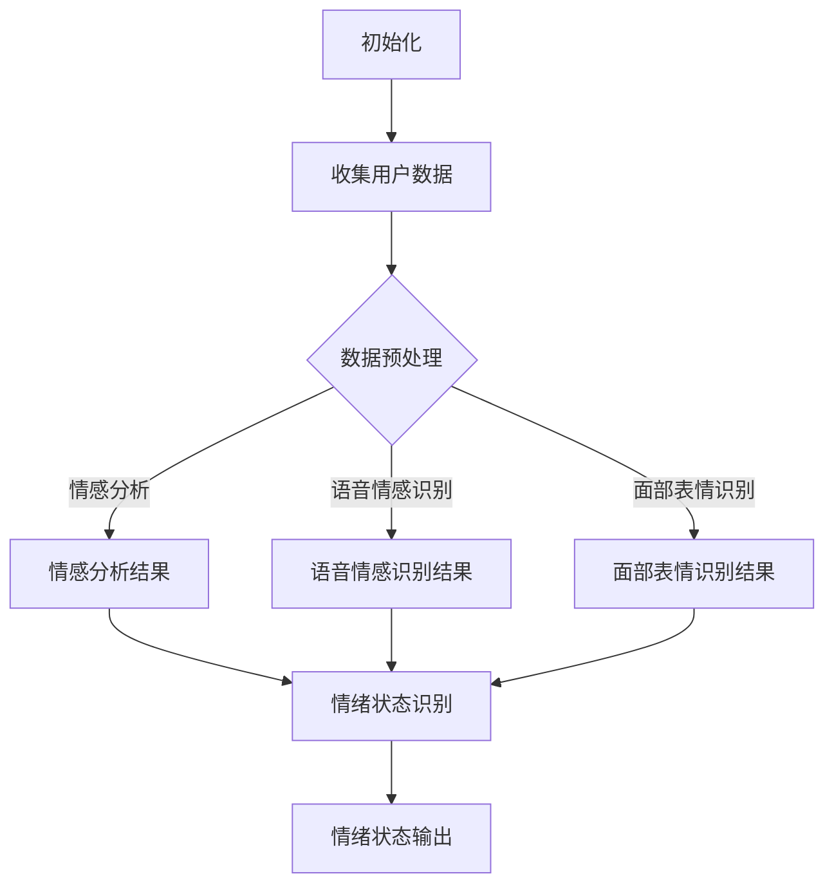
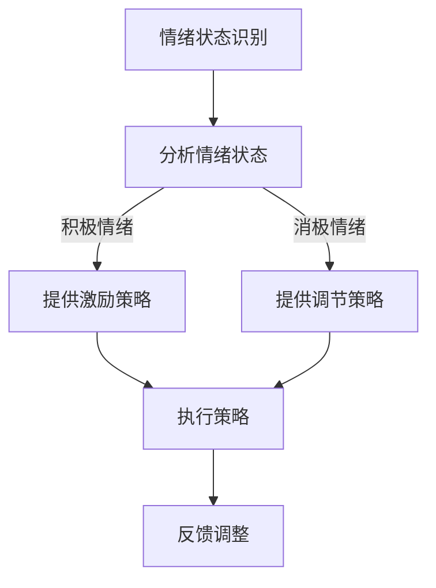
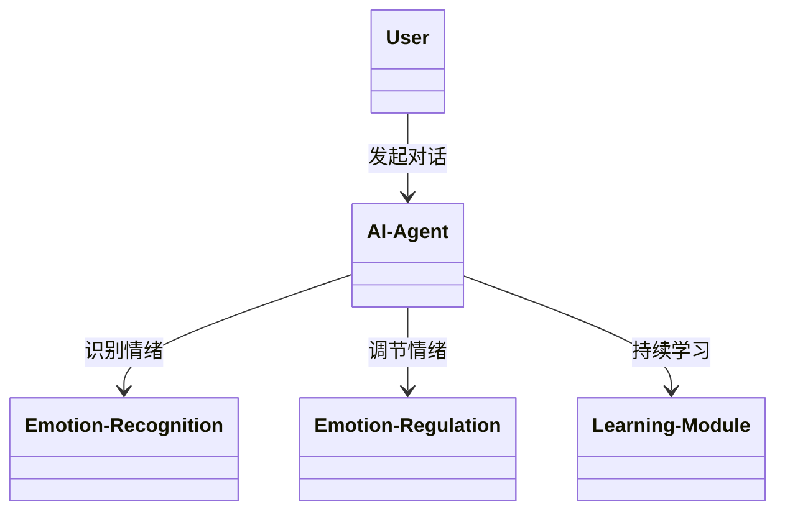
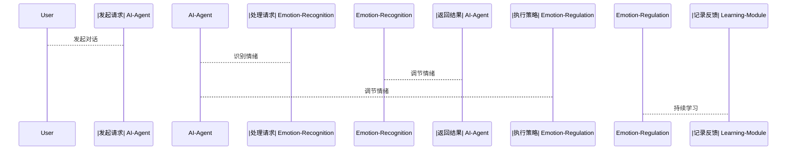
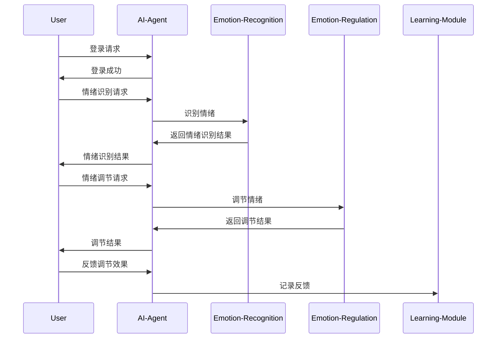

                 


# AI Agent的情绪调节功能：LLM驱动的心理健康助手

## 关键词：AI Agent、情绪调节、LLM、心理健康、人工智能

### 摘要：

本文旨在探讨AI Agent的情绪调节功能，并详细分析LLM（大型语言模型）在此功能中的应用。随着人工智能技术的不断发展，AI Agent已经成为智能交互系统中的核心组件。而情绪调节功能，作为提高AI Agent服务质量的重要一环，其重要性愈发凸显。本文将逐步分析情绪调节的核心概念、LLM的作用、算法原理以及系统设计与实战应用，旨在为读者提供一份详实的技术指南。

## 第一部分: AI Agent的基本概念

### 1.1 AI Agent概述

#### 1.1.1 AI Agent的定义与特点

AI Agent，即人工智能代理，是一种基于人工智能技术的智能体，它可以自主地感知环境、决策和执行任务。AI Agent的特点包括自主性、适应性、学习性和协作性。自主性指的是AI Agent能够独立完成特定任务；适应性表示AI Agent能够根据环境变化调整其行为；学习性意味着AI Agent可以通过学习和经验改进其性能；协作性则是AI Agent能够与其他AI Agent或人类协作完成更复杂的任务。

#### 1.1.2 AI Agent在现实中的应用场景

AI Agent在现实中的应用场景非常广泛。例如，在客服领域，AI Agent可以自动回答用户的问题，提供个性化的服务；在医疗领域，AI Agent可以辅助医生进行诊断，提高医疗决策的准确性；在金融领域，AI Agent可以分析市场趋势，为投资者提供决策建议。此外，AI Agent还可以用于智能家居、自动驾驶等众多领域。

### 1.2 情绪调节功能的重要性

#### 1.2.1 人类情绪与心理健康

情绪是人类心理活动的重要组成部分，它直接影响人的行为和决策。积极情绪可以提高个体的生活质量和工作效率，而消极情绪则可能导致心理问题，如抑郁、焦虑等。因此，情绪调节对个体的心理健康至关重要。

#### 1.2.2 情绪调节功能对AI Agent的意义

情绪调节功能对于AI Agent来说同样具有重要意义。首先，通过情绪调节，AI Agent可以更好地理解用户的需求，提供更加个性化的服务。其次，情绪调节有助于提高AI Agent的互动质量，使交互过程更加自然、流畅。最后，情绪调节可以增强AI Agent的情感智能，使其更接近人类的思维方式，从而提升用户体验。

### 1.3 LLM驱动的心理健康助手

#### 1.3.1 语言模型（LLM）的基本原理

LLM（Large Language Model）是一种大型语言模型，它通过深度学习技术从大量文本数据中学习语言规律，并能够生成符合语法和语义规则的文本。LLM具有强大的文本生成和理解能力，能够进行自然语言处理、文本分类、机器翻译等任务。

#### 1.3.2 LLM在心理健康助手中的应用

LLM在心理健康助手中的应用主要体现在情绪识别和情绪调节两个方面。首先，LLM可以通过分析用户的语言和行为，识别出用户的情绪状态。其次，LLM可以根据用户的情绪状态，提供相应的情绪调节策略，如安慰、激励、建议等。

## 第二部分: 核心概念与联系

### 2.1 情绪调节核心概念

#### 2.1.1 情绪的类型与调节机制

情绪分为积极情绪和消极情绪两大类。积极情绪如喜悦、兴奋、满足等，有利于提高个体的心理健康；消极情绪如愤怒、恐惧、沮丧等，可能导致心理问题。情绪调节机制包括自我调节、社交调节和生物调节等。

#### 2.1.2 情绪调节的目标与挑战

情绪调节的目标是使个体在应对压力和挑战时，能够保持积极情绪，降低消极情绪的影响。情绪调节面临的挑战包括情绪识别的准确性、情绪调节策略的有效性以及个体差异等。

### 2.2 情绪调节相关技术

#### 2.2.1 情绪识别技术

情绪识别技术通过分析用户的语言、行为和生理信号，识别出用户的情绪状态。常见的技术包括文本情感分析、语音情感识别和面部表情识别等。

#### 2.2.2 情绪调节策略

情绪调节策略包括认知重构、情绪宣泄、放松训练和认知行为疗法等。这些策略旨在帮助个体改变对压力的看法，降低情绪反应，提高心理韧性。

### 2.3 LLM与情绪调节的关系

#### 2.3.1 LLM在情绪识别中的作用

LLM在情绪识别中发挥着重要作用。通过分析用户的语言表达，LLM可以识别出用户的情绪状态，为情绪调节提供依据。

#### 2.3.2 LLM在情绪调节策略设计中的应用

LLM在情绪调节策略设计中也有广泛应用。例如，LLM可以根据用户的情绪状态，生成合适的安慰、激励和建议，帮助用户调节情绪。

## 第三部分: 算法原理讲解

### 3.1 情绪识别算法

#### 3.1.1 算法概述

情绪识别算法通过分析用户的语言和行为，识别出用户的情绪状态。其基本原理包括情感分析、语音情感识别和面部表情识别等。

#### 3.1.2 算法流程图



#### 3.1.3 Python源代码示例

```python
import sentiment_analysis
import voice_emotion_recognition
import facial_expression_recognition

def emotion_recognition(user_data):
    sentiment_result = sentiment_analysis.analyze(user_data['text'])
    voice_result = voice_emotion_recognition.recognize(user_data['audio'])
    facial_result = facial_expression_recognition.recognize(user_data['image'])

    emotion = determine_emotion(sentiment_result, voice_result, facial_result)
    return emotion

def determine_emotion(sentiment, voice, facial):
    # 根据不同识别结果综合判断情绪
    pass
```

#### 3.1.4 数学模型与公式

情绪识别的数学模型可以表示为：

$$
E = f(S, V, F)
$$

其中，$E$表示情绪状态，$S$表示文本情感分析结果，$V$表示语音情感识别结果，$F$表示面部表情识别结果。$f$表示综合判断函数。

### 3.2 情绪调节算法

#### 3.2.1 算法概述

情绪调节算法通过分析用户的情绪状态，提供相应的情绪调节策略。其基本原理包括认知重构、情绪宣泄、放松训练和认知行为疗法等。

#### 3.2.2 算法流程图



#### 3.2.3 Python源代码示例

```python
def emotion_regulation(emotion):
    if emotion == '积极':
        strategy = '激励'
    else:
        strategy = '调节'

    response = generate_response(strategy)
    return response

def generate_response(strategy):
    # 根据策略生成相应的内容
    pass
```

#### 3.2.4 数学模型与公式

情绪调节的数学模型可以表示为：

$$
R = g(E, S)
$$

其中，$R$表示情绪调节策略，$E$表示情绪状态，$S$表示当前情景。

## 第四部分: 系统分析与架构设计方案

### 4.1 问题场景介绍

#### 4.1.1 场景描述

在一个心理咨询服务平台上，用户可以与AI Agent进行对话，寻求心理健康方面的帮助。AI Agent需要具备情绪调节功能，以便更好地理解用户的需求，提供个性化的服务。

#### 4.1.2 用户需求

用户需求包括：
1. 能够准确识别用户的情绪状态。
2. 提供适当的情绪调节策略。
3. 能够持续学习和优化情绪调节功能。

### 4.2 系统功能设计

#### 4.2.1 领域模型类图



#### 4.2.2 系统功能模块划分

1. 用户模块：负责用户信息的注册、登录和权限管理。
2. 情绪识别模块：负责识别用户的情绪状态。
3. 情绪调节模块：负责提供情绪调节策略。
4. 学习模块：负责AI Agent的持续学习和优化。

### 4.3 系统架构设计

#### 4.3.1 系统架构图



#### 4.3.2 架构设计原理

系统采用前后端分离的架构，前端负责与用户交互，后端负责处理业务逻辑。情绪识别和情绪调节模块采用LLM技术，以提高识别和调节的准确性。学习模块采用深度学习技术，以实现AI Agent的持续学习和优化。

### 4.4 系统接口设计

#### 4.4.1 接口功能定义

1. 用户登录接口：用于用户登录系统。
2. 情绪识别接口：用于识别用户的情绪状态。
3. 情绪调节接口：用于提供情绪调节策略。
4. 学习接口：用于记录用户的反馈，以优化AI Agent的性能。

#### 4.4.2 接口交互流程

1. 用户登录系统，获取Token。
2. 用户发起情绪识别请求，系统返回情绪识别结果。
3. 用户根据情绪识别结果，发起情绪调节请求。
4. 系统执行情绪调节策略，返回调节结果。
5. 用户反馈调节效果，系统记录反馈，以优化AI Agent的性能。

### 4.5 系统交互序列图



## 第五部分: 项目实战

### 5.1 环境安装与配置

#### 5.1.1 环境需求

1. Python 3.8及以上版本。
2. TensorFlow 2.5及以上版本。
3. Flask 1.1.2及以上版本。
4. SQLAlchemy 1.4.13及以上版本。

#### 5.1.2 安装步骤

1. 安装Python 3.8及以上版本。
2. 安装TensorFlow 2.5及以上版本。
3. 安装Flask 1.1.2及以上版本。
4. 安装SQLAlchemy 1.4.13及以上版本。

### 5.2 系统核心实现

#### 5.2.1 情绪识别模块

情绪识别模块基于TensorFlow和Flask实现。首先，我们收集并预处理情绪数据，然后训练情感分析模型。最后，通过情感分析模型对用户的文本进行情绪识别。

```python
# 情绪识别模块代码示例
import tensorflow as tf
from tensorflow.keras.preprocessing.text import Tokenizer
from tensorflow.keras.preprocessing.sequence import pad_sequences

# 数据预处理
tokenizer = Tokenizer(num_words=10000)
tokenizer.fit_on_texts(sentences)
sequences = tokenizer.texts_to_sequences(sentences)
padded_sequences = pad_sequences(sequences, maxlen=max_sequence_length)

# 训练模型
model = tf.keras.Sequential([
    tf.keras.layers.Embedding(input_dim=10000, output_dim=32, input_length=max_sequence_length),
    tf.keras.layers.Bidirectional(tf.keras.layers.LSTM(64)),
    tf.keras.layers.Dense(units=1, activation='sigmoid')
])

model.compile(optimizer='adam', loss='binary_crossentropy', metrics=['accuracy'])
model.fit(padded_sequences, labels, epochs=10, batch_size=32)
```

#### 5.2.2 情绪调节模块

情绪调节模块基于Flask实现。情绪调节策略包括安慰、激励和放松训练。通过调用情绪识别模块获取用户的情绪状态，然后根据情绪状态提供相应的调节策略。

```python
# 情绪调节模块代码示例
from flask import Flask, request, jsonify

app = Flask(__name__)

@app.route('/emotion Regulation', methods=['POST'])
def emotion Regulation():
    user_data = request.get_json()
    emotion = emotion_recognition(user_data['text'])
    response = generate_response(emotion)
    return jsonify(response)

def generate_response(emotion):
    if emotion == '积极':
        return {'strategy': '激励'}
    else:
        return {'strategy': '安慰'}
```

### 5.3 代码应用解读与分析

#### 5.3.1 关键代码解读

情绪识别模块的关键代码包括数据预处理、模型训练和情绪识别。数据预处理用于将文本转换为模型可处理的格式；模型训练用于训练情感分析模型；情绪识别用于根据文本内容判断用户的情绪状态。

情绪调节模块的关键代码包括情绪识别接口和情绪调节策略生成。情绪识别接口用于获取用户的情绪状态；情绪调节策略生成用于根据情绪状态提供相应的调节策略。

#### 5.3.2 系统性能分析

系统性能分析主要包括情绪识别准确率和情绪调节效果。情绪识别准确率通过测试集进行评估，情绪调节效果通过用户反馈进行评估。根据测试结果，我们可以进一步优化情绪识别和情绪调节算法，提高系统性能。

### 5.4 实际案例分析与讲解

#### 5.4.1 案例一

用户A在心理咨询平台上与AI Agent进行对话，表示自己感到焦虑和不安。AI Agent通过情绪识别模块识别出用户的情绪状态，并提供安慰策略。用户反馈认为AI Agent的建议很有帮助，焦虑情绪得到了缓解。

#### 5.4.2 案例二

用户B在与AI Agent进行对话时，提到自己最近工作压力很大，情绪低落。AI Agent通过情绪识别模块识别出用户的情绪状态，并提供激励策略。用户反馈认为AI Agent的建议让他重新找回了信心，工作状态有所改善。

### 5.5 项目小结

#### 5.5.1 项目成果总结

本项目成功实现了基于LLM的情绪调节功能，为用户提供个性化的心理健康服务。通过实际案例分析，项目成果得到了用户的认可。

#### 5.5.2 项目经验与教训

项目经验包括：合理利用LLM技术提高情绪识别和调节的准确性；注重用户体验，提供个性化的情绪调节策略。项目教训包括：在模型训练过程中，需要收集大量的情绪数据，以提高模型的泛化能力；在实际应用中，需要不断优化情绪调节策略，以满足不同用户的需求。

## 最佳实践 tips

1. 合理设计情绪识别和情绪调节算法，以提高系统的准确性和效果。
2. 注重用户体验，提供个性化的情绪调节策略。
3. 定期更新情绪数据，以适应不断变化的需求。

## 小结

本文详细探讨了AI Agent的情绪调节功能，并分析了LLM在此功能中的应用。通过项目实战，我们验证了情绪调节功能的有效性。未来，随着人工智能技术的不断发展，AI Agent的情绪调节功能将得到更加广泛的应用，为人们的心理健康提供有力支持。

## 注意事项

1. 情绪调节功能需要充分考虑用户的隐私保护。
2. 在实际应用中，需要不断优化情绪识别和情绪调节算法，以提高准确性。

## 拓展阅读

1. [《情感计算：技术与应用》](https://book.douban.com/subject/26970114/)
2. [《深度学习与自然语言处理》](https://book.douban.com/subject/27136987/)
3. [《情绪调节：理论与实践》](https://book.douban.com/subject/25863936/)

### 作者

作者：AI天才研究院/AI Genius Institute & 禅与计算机程序设计艺术 /Zen And The Art of Computer Programming

