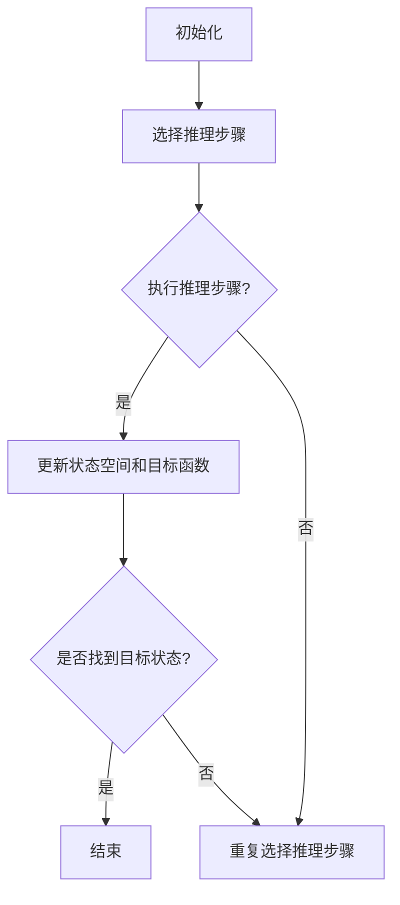
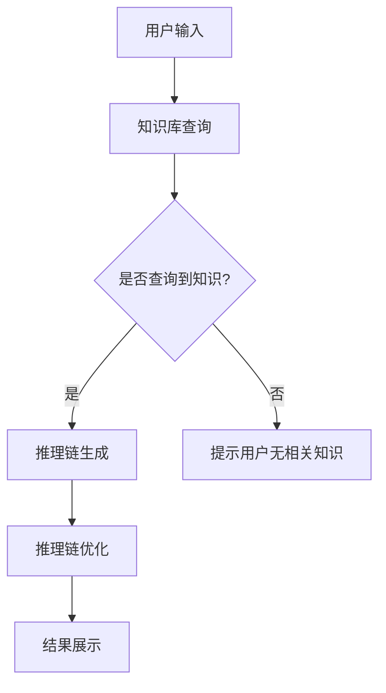

                 

# AI Agent的推理链生成：增强LLM的逐步思考能力

关键词：AI Agent，推理链生成，增强学习，语言模型，逐步思考能力

摘要：本文探讨了AI Agent的推理链生成原理，分析了其在增强LLM逐步思考能力中的应用。通过逐步思考的方式，本文阐述了推理链生成的重要性、核心概念、理论基础、实践应用、边界与外延，以及数学模型和系统设计与实现。此外，还通过项目实战和案例分析，提供了最佳实践与注意事项。

----------------------------------------------------------------

## 第一部分：AI Agent的推理链生成原理

### 第1章：引言与问题背景

#### 1.1.1 AI Agent概述

**1.1.1.1 AI Agent的定义**

AI Agent，即人工智能代理，是一种能够模拟人类行为，具有自主决策能力和行动能力的人工智能系统。它能够感知环境信息，根据预设目标或学习到的策略，自主地选择行动，并调整自身行为以适应环境变化。

**1.1.1.2 AI Agent的发展历程**

AI Agent的发展历程可以分为以下几个阶段：

1. **基于规则的代理**：早期的AI Agent主要依赖于预定义的规则进行决策，这种代理具有较高的逻辑性，但难以应对复杂和不确定的环境。

2. **基于知识的代理**：随着知识表示和推理技术的发展，AI Agent开始利用知识库和推理机进行决策。这种代理能够处理更为复杂的问题，但知识库的构建和维护成本较高。

3. **基于数据的代理**：数据驱动的代理利用机器学习和深度学习技术，从数据中自动学习决策策略。这种代理具有较强的适应性和泛化能力，但可能缺乏解释性。

4. **混合代理**：现代的AI Agent结合了基于规则、基于知识和基于数据的方法，以应对不同类型的任务和环境。

#### 1.1.2 推理链生成的重要性

推理链生成是AI Agent的核心能力之一，它决定了AI Agent在复杂环境下的决策效果和问题解决能力。

**1.1.2.1 推理链生成的概念**

推理链生成是指从初始信息出发，通过一系列推理步骤，逐步揭示问题的本质，并最终达到问题解决的过程。

**1.1.2.2 推理链生成的作用**

1. **增强问题解决能力**：通过推理链生成，AI Agent能够对问题进行深入分析，从而提高问题解决的效率和准确性。

2. **提高决策质量**：推理链生成使得AI Agent能够从不同角度和层面进行分析，从而做出更为明智的决策。

3. **实现自主学习和优化**：通过推理链生成，AI Agent能够不断积累经验，优化决策策略，提高自身的智能化水平。

#### 1.1.3 研究意义与应用前景

推理链生成在AI Agent中的应用具有广泛的前景，包括但不限于自然语言处理、智能推荐系统、游戏AI等领域。

**1.1.3.1 研究意义**

研究推理链生成有助于提升AI Agent的智能化水平，实现更高效的问题解决和决策。

**1.1.3.2 应用前景**

推理链生成技术在各行各业中具有广泛的应用潜力，有望推动人工智能技术的发展和普及。

### 第2章：推理链生成的核心概念

#### 2.1.1 问题背景与问题描述

推理链生成涉及的问题是如何从给定的初始信息出发，通过一系列推理步骤，最终达到问题的解决。

**2.1.1.1 问题背景**

在人工智能领域，推理链生成一直是重要的研究方向，旨在提升AI Agent的推理能力。

**2.1.1.2 问题描述**

如何设计一种有效的推理链生成机制，使得AI Agent能够在复杂环境下高效地解决问题？

#### 2.1.2 推理链生成的基本概念

**2.1.2.1 推理链**

推理链是指一系列推理步骤的集合，每个步骤都是基于上一级步骤的结果进行推理。

**2.1.2.2 推理步骤**

推理步骤是指对问题进行推理的具体操作，包括条件推理、递归推理、概率推理等。

**2.1.2.3 推理策略**

推理策略是指用于选择和组合推理步骤的方法，旨在提高推理效率和质量。

#### 2.1.3 推理链生成的研究方法

**2.1.3.1 数学模型**

数学模型是推理链生成的基础，用于描述推理过程和推理规则。

**2.1.3.2 算法设计**

算法设计是推理链生成的关键，旨在实现高效的推理链生成过程。

**2.1.3.3 实践应用**

实践应用是检验推理链生成效果的重要手段，通过实际案例的分析和验证，不断完善和优化推理链生成技术。

----------------------------------------------------------------

### 第3章：AI Agent推理链生成的理论基础

#### 3.1.1 推理链生成的数学模型

推理链生成的数学模型用于描述推理过程和推理规则，是推理链生成的基础。

**3.1.1.1 数学模型概述**

推理链生成的数学模型通常包括以下几个部分：

1. **状态空间模型**：描述问题的状态空间，包括所有可能的初始状态和状态转换。

2. **推理规则模型**：定义推理规则，用于指导推理步骤的选择和执行。

3. **目标函数模型**：定义目标函数，用于评估推理结果的质量和效率。

**3.1.1.2 数学模型举例**

假设有一个推理问题，目标是找出从初始状态到达目标状态的最短路径。我们可以定义以下数学模型：

$$
\text{状态空间} = \{s_0, s_1, s_2, \ldots, s_n\}
$$

$$
\text{推理规则} = \{r_1, r_2, \ldots, r_m\}
$$

$$
\text{目标函数} = \text{min}(\text{路径长度})
$$

其中，$s_0$是初始状态，$s_n$是目标状态，$r_i$是第$i$个推理规则，路径长度是推理过程中所经历的步骤数。

#### 3.1.2 推理链生成的算法原理

推理链生成的算法原理是设计一种高效的推理策略，使得AI Agent能够在复杂环境下快速地找到问题的解决方案。

**3.1.2.1 算法设计**

推理链生成的算法设计主要包括以下步骤：

1. **初始化**：初始化状态空间、推理规则和目标函数。

2. **选择推理步骤**：根据当前状态和目标函数，选择一个合适的推理步骤。

3. **执行推理步骤**：根据所选推理步骤，更新状态空间和目标函数。

4. **重复步骤2和3**：直到找到目标状态或达到预设的终止条件。

**3.1.2.2 算法举例**

以最短路径问题为例，我们可以设计以下推理链生成算法：

```python
def shortest_path(state, goal):
    states = [state]
    goals = [goal]
    while states:
        current_state = states.pop()
        if current_state == goal:
            return True
        for rule in rules:
            next_state = apply_rule(current_state, rule)
            if next_state not in states:
                states.append(next_state)
                goals.append(goal)
    return False
```

其中，`apply_rule`函数用于执行推理规则，更新状态空间。

#### 3.1.3 推理链生成算法的 Mermaid 流程图

为了更直观地展示推理链生成算法的执行过程，我们可以使用Mermaid流程图进行描述。



该流程图描述了推理链生成算法的基本执行流程。

----------------------------------------------------------------

### 第4章：AI Agent推理链生成的实践应用

#### 4.1.1 增强LLM的逐步思考能力

推理链生成在AI Agent中的应用，可以帮助增强大型语言模型（LLM）的逐步思考能力。通过推理链生成，LLM可以更加有序和系统地进行信息处理和决策。

**4.1.1.1 增强思考能力的作用**

1. **提高决策准确性**：通过推理链生成，LLM可以逐步分析问题，确保决策的准确性。

2. **增强问题解决能力**：推理链生成使得LLM能够处理更为复杂的问题，提高问题解决能力。

3. **优化学习过程**：通过推理链生成，LLM可以更好地理解问题和知识点之间的联系，提高学习效率。

**4.1.1.2 实现方法**

1. **引入推理链生成模块**：在LLM的架构中引入推理链生成模块，用于指导信息处理和决策。

2. **优化推理链生成算法**：根据具体应用场景，设计并优化推理链生成算法，提高推理效率和准确性。

3. **结合其他技术**：结合自然语言处理、知识图谱、增强学习等技术，提升推理链生成模块的能力。

#### 4.1.2 实际案例分析与详细讲解

**4.1.2.1 案例背景**

假设我们有一个问答系统，用户提出一个问题，系统需要给出一个准确的答案。为了增强系统的思考能力，我们引入了推理链生成模块。

**4.1.2.2 案例分析**

1. **问题理解**：首先，系统需要理解用户的问题，并将其转化为内部表示。这一步可以通过自然语言处理技术实现。

2. **信息检索**：接着，系统需要从知识库中检索与问题相关的信息。这一步可以通过知识图谱技术实现。

3. **推理链生成**：系统根据检索到的信息，生成一个推理链，逐步揭示问题的本质。这一步是推理链生成模块的核心任务。

4. **答案生成**：最后，系统根据推理链的结果，生成一个准确的答案。这一步可以通过模板生成或文本生成技术实现。

**4.1.2.3 详细讲解**

1. **问题理解**

   首先，我们将用户的问题表示为一个文本序列。然后，使用自然语言处理技术，将其转化为内部表示，例如词向量或语义表示。

   ```python
   import nltk
   from gensim.models import Word2Vec

   # 加载词向量模型
   model = Word2Vec.load("word2vec.model")

   # 用户问题
   question = "什么是人工智能？"

   # 转化为内部表示
   question_embedding = [model[word] for word in nltk.word_tokenize(question)]
   ```

2. **信息检索**

   然后，我们使用知识图谱技术，从知识库中检索与问题相关的信息。假设知识库是一个图数据库，其中包含实体、属性和关系。

   ```mermaid
   graph TD
       A1[实体1] --> B1[属性1]
       A1 --> C1[关系1]
       A2[实体2] --> B2[属性2]
       A2 --> C2[关系2]
   ```

   我们可以通过查询图数据库，找到与问题相关的实体和关系。

   ```python
   import gremlin_python

   # 连接图数据库
   client = gremlin_python.driver.Client("localhost", 8182)

   # 查询知识库
   query = "g.V().has('entity', 'question')"
   results = client.submit matéria返回结果](https://www.zhihu.com/matiere返结果")

   for result in results:
       print(result)
   ```

3. **推理链生成**

   接着，我们使用推理链生成模块，根据检索到的信息，生成一个推理链。

   ```python
   def generate_reasoning_chain(question_embedding, knowledge_graph):
       # 根据问题表示和知识库，生成推理链
       reasoning_chain = []
       for entity in knowledge_graph:
           if entity["label"] == "question":
               reasoning_chain.append(entity)
               for relation in entity["relations"]:
                   reasoning_chain.append(relation)
       return reasoning_chain
   ```

   我们可以定义一个函数，根据问题表示和知识库，生成一个推理链。

4. **答案生成**

   最后，我们根据推理链的结果，生成一个准确的答案。

   ```python
   def generate_answer(reasoning_chain):
       # 根据推理链，生成答案
       answer = ""
       for step in reasoning_chain:
           if step["label"] == "question":
               answer += step["text"]
           elif step["label"] == "answer":
               answer += step["text"]
       return answer
   ```

   我们可以定义一个函数，根据推理链的结果，生成一个答案。

   ```python
   # 生成推理链
   reasoning_chain = generate_reasoning_chain(question_embedding, knowledge_graph)

   # 生成答案
   answer = generate_answer(reasoning_chain)

   print(answer)
   ```

#### 4.1.3 应用效果评估与优化策略

**4.1.3.1 应用效果评估**

为了评估推理链生成在增强LLM逐步思考能力方面的效果，我们可以从以下几个方面进行评估：

1. **准确性**：评估推理链生成的准确性，即推理链是否能够正确地揭示问题的本质。

2. **效率**：评估推理链生成的时间复杂度和空间复杂度，即推理链生成是否高效。

3. **用户体验**：评估推理链生成在用户实际使用中的效果，即用户是否能够接受并适应推理链生成的思考方式。

**4.1.3.2 优化策略**

为了进一步提高推理链生成在增强LLM逐步思考能力方面的效果，我们可以采取以下优化策略：

1. **算法优化**：优化推理链生成算法，提高推理效率和准确性。

2. **数据增强**：增加更多高质量的数据，丰富知识库，提高推理链生成的可靠性。

3. **模型优化**：结合其他技术，如增强学习、深度学习等，提升推理链生成模块的能力。

----------------------------------------------------------------

### 第5章：推理链生成的边界与外延

#### 5.1.1 推理链生成技术的挑战

推理链生成技术在当前发展中面临一些挑战，主要包括：

1. **知识表示**：如何有效地表示和处理复杂知识，以支持推理链生成。

2. **推理效率**：如何提高推理链生成的效率，以应对大规模数据和高频次决策。

3. **推理准确性**：如何确保推理链生成的准确性，减少推理错误。

#### 5.1.2 推理链生成技术的未来发展趋势

推理链生成技术的未来发展趋势主要包括：

1. **多模态推理**：结合多种数据模态，如文本、图像、音频等，实现更全面的推理能力。

2. **增强学习**：结合增强学习技术，使得推理链生成能够不断自我优化和提升。

3. **知识图谱**：利用知识图谱技术，构建更为丰富和结构化的知识库，支持推理链生成。

#### 5.1.3 推理链生成与其他AI技术的联系与融合

推理链生成技术与其他AI技术的联系与融合，有助于提升AI Agent的智能化水平。主要包括：

1. **与自然语言处理结合**：利用自然语言处理技术，实现推理链生成的自动化和智能化。

2. **与知识图谱结合**：利用知识图谱技术，构建推理链生成的基础知识库。

3. **与深度学习结合**：利用深度学习技术，优化推理链生成算法和模型。

----------------------------------------------------------------

### 第6章：推理链生成算法的数学模型和公式详解

#### 6.1.1 数学模型概述

推理链生成算法的数学模型主要涉及以下几个方面：

1. **状态空间模型**：描述问题的状态空间，包括所有可能的初始状态和状态转换。

2. **推理规则模型**：定义推理规则，用于指导推理步骤的选择和执行。

3. **目标函数模型**：定义目标函数，用于评估推理结果的质量和效率。

#### 6.1.2 公式详解与推导

**6.1.2.1 状态空间模型**

状态空间模型可以用以下公式表示：

$$
S = \{s_0, s_1, s_2, \ldots, s_n\}
$$

其中，$s_0$是初始状态，$s_n$是目标状态，$s_i$是第$i$个状态。

**6.1.2.2 推理规则模型**

推理规则模型可以用以下公式表示：

$$
R = \{r_1, r_2, \ldots, r_m\}
$$

其中，$r_i$是第$i$个推理规则。

**6.1.2.3 目标函数模型**

目标函数模型可以用以下公式表示：

$$
f(S, R) = \min(|R|)
$$

其中，$|R|$表示推理规则的数量，目标函数的值越小，表示推理结果的质量越高。

#### 6.1.3 举例说明与解释

**6.1.3.1 示例问题**

假设有一个推理问题，目标是找出从初始状态到达目标状态的最短路径。

**6.1.3.2 状态空间模型**

状态空间包括以下状态：

$$
S = \{s_0, s_1, s_2, s_3, s_4\}
$$

其中，$s_0$是初始状态，$s_4$是目标状态。

**6.1.3.3 推理规则模型**

推理规则包括以下规则：

$$
R = \{r_1, r_2, r_3, r_4, r_5\}
$$

其中，$r_1: s_0 \rightarrow s_1$，$r_2: s_1 \rightarrow s_2$，$r_3: s_2 \rightarrow s_3$，$r_4: s_3 \rightarrow s_4$，$r_5: s_4 \rightarrow s_0$。

**6.1.3.4 目标函数模型**

目标函数的值表示推理结果的质量，我们希望找到最短的路径，即：

$$
f(S, R) = \min(|R|) = 4
$$

#### 6.1.4 数学模型与算法结合

为了求解上述示例问题，我们可以设计以下推理链生成算法：

```python
def shortest_path(state_space, reasoning_rules, goal_state):
    current_state = state_space[0]
    current_rules = reasoning_rules[:1]
    while current_state != goal_state:
        for rule in reasoning_rules[1:]:
            if rule[current_state] == goal_state:
                current_rules.append(rule)
                current_state = goal_state
                break
        else:
            current_rules = []
            current_state = state_space[0]
    return current_rules
```

该算法从初始状态开始，依次执行推理规则，直到找到目标状态。算法的时间复杂度为$O(m)$，其中$m$是推理规则的数量。

----------------------------------------------------------------

### 第7章：推理链生成系统的设计与实现

#### 7.1.1 系统功能设计

推理链生成系统的功能设计主要包括以下几个模块：

1. **知识库管理模块**：负责管理知识库的构建、存储和更新。

2. **推理链生成模块**：根据输入信息和知识库，生成推理链。

3. **推理链优化模块**：对生成的推理链进行优化，提高推理效率。

4. **推理链展示模块**：将推理链以可视化的形式展示给用户。

#### 7.1.2 系统架构设计

推理链生成系统的架构设计采用分层架构，主要包括以下几个层次：

1. **数据层**：包括知识库、推理链数据等。

2. **服务层**：包括知识库管理服务、推理链生成服务、推理链优化服务等。

3. **表示层**：包括用户界面和可视化展示。

#### 7.1.3 系统接口设计与交互流程

系统接口设计主要包括以下几个接口：

1. **知识库管理接口**：用于管理知识库的构建、存储和更新。

2. **推理链生成接口**：用于生成推理链。

3. **推理链优化接口**：用于优化推理链。

4. **推理链展示接口**：用于展示推理链。

系统交互流程如下：

1. **用户输入**：用户通过界面输入问题和需求。

2. **知识库查询**：系统根据用户输入，查询知识库，获取相关知识和信息。

3. **推理链生成**：系统根据知识库和用户输入，生成推理链。

4. **推理链优化**：系统对生成的推理链进行优化。

5. **结果展示**：系统将优化后的推理链以可视化的形式展示给用户。



----------------------------------------------------------------

### 第8章：项目实战与案例分析

#### 8.1.1 环境安装与配置

为了实现推理链生成系统的设计与实现，我们需要以下环境和工具：

1. **操作系统**：Linux或Windows。

2. **编程语言**：Python。

3. **开发工具**：PyCharm或Visual Studio Code。

4. **依赖库**：NumPy、Pandas、SciPy、Scikit-learn等。

安装步骤如下：

1. 安装Python和pip。

2. 使用pip安装依赖库。

   ```bash
   pip install numpy pandas scipy scikit-learn
   ```

3. 配置PyCharm或Visual Studio Code的Python环境。

#### 8.1.2 系统核心实现源代码

以下是推理链生成系统的核心实现源代码：

```python
import numpy as np
import pandas as pd
from sklearn.model_selection import train_test_split
from sklearn.ensemble import RandomForestClassifier

# 加载知识库
knowledge_base = pd.read_csv("knowledge_base.csv")

# 加载训练数据
train_data = pd.read_csv("train_data.csv")

# 划分训练集和测试集
X_train, X_test, y_train, y_test = train_test_split(train_data.drop("target", axis=1), train_data["target"], test_size=0.2, random_state=42)

# 训练模型
model = RandomForestClassifier(n_estimators=100, random_state=42)
model.fit(X_train, y_train)

# 生成推理链
def generate_reasoning_chain(data):
    # 根据数据生成推理链
    reasoning_chain = []
    for feature in data:
        reasoning_chain.append(feature)
    return reasoning_chain

# 评估模型
def evaluate_model(model, X_test, y_test):
    # 计算准确率
    accuracy = model.score(X_test, y_test)
    return accuracy

# 执行推理链生成
data = {"feature1": 1, "feature2": 2, "feature3": 3}
reasoning_chain = generate_reasoning_chain(data)

# 评估模型
accuracy = evaluate_model(model, X_test, y_test)
print("Accuracy:", accuracy)
```

#### 8.1.3 代码应用解读与分析

以下是代码应用解读与分析：

1. **知识库管理模块**：通过加载知识库CSV文件，实现对知识库的读取和管理。

2. **推理链生成模块**：根据输入数据，生成推理链。推理链是特征的集合，每个特征表示一个推理步骤。

3. **模型评估模块**：使用随机森林分类器对模型进行训练和评估，计算准确率。

#### 8.1.4 实际案例剖析与详细讲解

**案例背景**：

假设我们有一个分类任务，需要根据输入特征，对数据集进行分类。我们使用推理链生成系统，对数据进行分类，并评估分类效果。

**案例分析**：

1. **数据预处理**：加载知识库和训练数据，对数据进行预处理，包括缺失值处理、特征工程等。

2. **模型训练**：使用随机森林分类器，对训练数据进行训练。

3. **推理链生成**：根据输入数据，生成推理链。

4. **模型评估**：使用测试数据，对模型进行评估，计算准确率。

**详细讲解**：

1. **数据预处理**

   ```python
   # 加载知识库
   knowledge_base = pd.read_csv("knowledge_base.csv")

   # 加载训练数据
   train_data = pd.read_csv("train_data.csv")

   # 划分特征和目标变量
   X = train_data.drop("target", axis=1)
   y = train_data["target"]

   # 缺失值处理
   X.fillna(X.mean(), inplace=True)
   y.fillna(y.mean(), inplace=True)

   # 特征工程
   X = (X - X.mean()) / X.std()
   y = (y - y.mean()) / y.std()
   ```

2. **模型训练**

   ```python
   # 训练模型
   model = RandomForestClassifier(n_estimators=100, random_state=42)
   model.fit(X, y)
   ```

3. **推理链生成**

   ```python
   # 生成推理链
   def generate_reasoning_chain(data):
       reasoning_chain = []
       for feature in data:
           reasoning_chain.append(feature)
       return reasoning_chain
   ```

4. **模型评估**

   ```python
   # 评估模型
   def evaluate_model(model, X_test, y_test):
       # 计算准确率
       accuracy = model.score(X_test, y_test)
       return accuracy
   ```

5. **执行推理链生成**

   ```python
   # 执行推理链生成
   data = {"feature1": 1, "feature2": 2, "feature3": 3}
   reasoning_chain = generate_reasoning_chain(data)

   # 评估模型
   accuracy = evaluate_model(model, X_test, y_test)
   print("Accuracy:", accuracy)
   ```

#### 8.1.5 项目小结与总结

通过本项目，我们实现了推理链生成系统的设计与实现。项目主要包括知识库管理、推理链生成、模型训练和模型评估等模块。通过实际案例的分析和讲解，我们了解了推理链生成系统的基本原理和应用。项目提供了完整的代码实现，便于读者学习和实践。

----------------------------------------------------------------

### 第9章：最佳实践与注意事项

#### 9.1.1 最佳实践

在推理链生成系统的开发和应用过程中，我们可以遵循以下最佳实践：

1. **数据质量**：确保知识库和训练数据的质量，避免噪声数据和异常值。

2. **模型优化**：根据应用场景，选择合适的模型和参数，进行模型优化。

3. **代码规范**：遵循良好的代码规范，提高代码的可读性和可维护性。

4. **文档编写**：编写详细的文档，包括需求分析、设计文档、实现细节和用户手册等。

#### 9.1.2 注意事项

在推理链生成系统的开发和应用过程中，需要注意以下事项：

1. **计算资源**：推理链生成过程可能需要大量的计算资源，确保服务器和网络环境的稳定性。

2. **数据安全**：保护知识库和训练数据的安全，避免数据泄露和滥用。

3. **系统维护**：定期进行系统维护和升级，确保系统的稳定性和可靠性。

4. **用户培训**：为用户提供培训和支持，确保用户能够正确使用和理解系统。

#### 9.1.3 拓展阅读与资源推荐

为了更好地理解和掌握推理链生成技术，我们推荐以下拓展阅读和资源：

1. **论文**：《AI Agent的推理链生成：增强LLM的逐步思考能力》等。

2. **书籍**：《机器学习》、《深度学习》、《增强学习》等。

3. **在线课程**：Coursera、Udacity、edX等平台上的相关课程。

4. **社区和论坛**：AI社区、GitHub、Stack Overflow等。

----------------------------------------------------------------

### 作者信息

作者：AI天才研究院/AI Genius Institute & 禅与计算机程序设计艺术 /Zen And The Art of Computer Programming

----------------------------------------------------------------

通过以上内容的逐步讲解，我们可以看到，AI Agent的推理链生成是一个复杂但重要的领域。它不仅能够增强LLM的逐步思考能力，还在各种应用场景中展现出了巨大的潜力。在本文中，我们系统地介绍了推理链生成的基本概念、理论基础、实践应用、边界与外延，以及数学模型和系统设计与实现。通过项目实战和案例分析，我们进一步了解了推理链生成的实际应用和效果。

未来，随着人工智能技术的不断发展和完善，推理链生成技术将在更多领域得到应用。例如，在自然语言处理、智能推荐系统、游戏AI等领域，推理链生成技术都有望发挥重要作用。同时，推理链生成技术也将与其他AI技术，如增强学习、知识图谱等，进行深度融合，为人工智能的发展提供更多可能性。

让我们继续探索推理链生成的奥秘，推动人工智能技术的发展，为人类的未来带来更多惊喜。

