                 

# AI Agent的概念形成：模拟LLM的抽象思维过程

## 关键词

- AI Agent
- 概念形成
- 抽象思维
- 语言模型
- LLM

## 摘要

本文深入探讨了AI Agent的概念形成过程，重点分析了AI Agent的核心特征、抽象思维过程以及如何模拟语言模型（LLM）的抽象思维过程。通过对AI Agent在各个领域的应用场景的讨论，本文旨在为读者提供一个全面而清晰的视角，理解AI Agent的概念及其在智能系统中的重要性。

## 第一部分：引言

### 1.1 问题背景

随着人工智能技术的发展，AI Agent作为人工智能系统的重要组成部分，其在各个领域的应用日益广泛。AI Agent是一种具有自主决策能力的智能体，能够根据环境变化自主调整行为，实现自主学习和自主适应。然而，AI Agent的概念形成是一个复杂的思维过程，涉及到多个层面和领域的知识。

### 1.2 问题描述

AI Agent的概念形成涉及到多个核心问题，包括：

- AI Agent的定义及其核心特征；
- AI Agent在不同领域的应用场景；
- AI Agent的抽象思维过程及其实现方式；
- 模拟语言模型（LLM）的抽象思维过程。

### 1.3 问题解决

为了深入探讨AI Agent的概念形成，本文将从以下几个方面进行阐述：

- 第一部分：引言，介绍AI Agent的概念形成背景、问题描述、问题解决；
- 第二部分：核心概念，详细阐述AI Agent的定义、核心特征及其在不同领域的应用场景；
- 第三部分：抽象思维过程，深入探讨AI Agent的抽象思维过程及其实现方式；
- 第四部分：模拟LLM的抽象思维过程，详细阐述模拟语言模型（LLM）的抽象思维过程。

### 1.4 边界与外延

本文主要关注AI Agent的概念形成及其抽象思维过程，不涉及其他人工智能相关技术。同时，本文将结合实际案例，对AI Agent的应用进行深入分析。

### 1.5 概念结构与核心要素组成

AI Agent的概念形成涉及到以下几个核心要素：

- AI Agent的定义及其核心特征；
- AI Agent在不同领域的应用场景；
- AI Agent的抽象思维过程及其实现方式；
- 模拟语言模型（LLM）的抽象思维过程。

## 1.6 本章小结

本章对AI Agent的概念形成进行了背景介绍，明确了本文的研究方向和核心问题。下一章将详细介绍AI Agent的核心概念及其应用场景。

## 第二部分：AI Agent的核心概念

### 2.1 AI Agent的定义

AI Agent是指一种具有自主决策能力的智能体，它能够感知环境、分析环境信息、制定决策并执行相应的行为。AI Agent的核心特征包括自主性、自适应性和自主学习能力。

### 2.2 AI Agent的核心特征

#### 2.2.1 自主性

自主性是指AI Agent能够在没有外部干预的情况下，根据环境信息自主决策并执行相应行为。自主性是AI Agent的重要特征，它使得AI Agent能够在复杂环境中独立运作。

#### 2.2.2 自适应性

适应性是指AI Agent能够根据环境变化自主调整自身行为，以适应新的环境。适应性是AI Agent在动态环境中生存和发展的关键。

#### 2.2.3 自主学习能力

自主学习能力是指AI Agent能够通过自身经验和环境反馈，不断优化自身行为，提高决策效果。自主学习能力是AI Agent实现智能化的基础。

### 2.3 AI Agent的核心特征对比表格

| 特征 | 自主性 | 适应性 | 自主学习能力 |
| :--: | :----: | :----: | :----------: |
| 说明 | 自主决策 | 自适应 | 自主学习 |

### 2.4 AI Agent的ER实体关系图架构

```mermaid
erDiagram
  AI Agent ||--|{ 环境感知 } Environment
  AI Agent ||--|{ 行为决策 } Decision
  AI Agent ||--|{ 行为执行 } Execution
  AI Agent ||--|{ 自主学习 } Learning
```

### 2.5 AI Agent在不同领域的应用场景

AI Agent在各个领域的应用场景广泛，包括但不限于：

- 机器人：在工业制造、家庭服务、医疗护理等领域，AI Agent能够实现自主导航、任务规划和行为决策；
- 智能交通：在自动驾驶、交通信号控制、车辆调度等领域，AI Agent能够实现高效、安全的交通管理；
- 金融领域：在风险控制、交易策略、客户服务等领域，AI Agent能够实现智能化、自动化的金融决策。

## 2.6 本章小结

本章详细阐述了AI Agent的核心概念及其核心特征，并通过ER图结构清晰展示了AI Agent的实体关系。下一章将深入探讨AI Agent的抽象思维过程及其实现方式。

## 第三部分：AI Agent的抽象思维过程

### 3.1 AI Agent抽象思维过程概述

AI Agent的抽象思维过程是指其如何通过感知环境、分析信息、制定决策和执行行为的循环过程，实现对环境的理解和适应。这个过程包括以下几个关键环节：

- 环境感知：AI Agent通过传感器等手段获取环境信息；
- 信息分析：AI Agent对获取的环境信息进行预处理和分析；
- 决策制定：基于分析结果，AI Agent制定相应的决策；
- 行为执行：AI Agent根据决策执行相应的行为。

### 3.2 感知环境与信息分析

#### 3.2.1 感知环境

感知环境是AI Agent抽象思维过程的第一步。AI Agent通过传感器、摄像头、语音识别等技术获取环境信息。例如，在自动驾驶场景中，AI Agent可以通过摄像头和激光雷达获取道路信息。

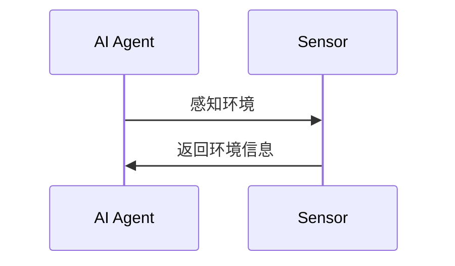

#### 3.2.2 信息分析

获取到环境信息后，AI Agent需要对信息进行预处理和分析。这一步骤包括噪声过滤、数据压缩、特征提取等。例如，在图像识别任务中，AI Agent需要对图像进行边缘检测、纹理分析等。

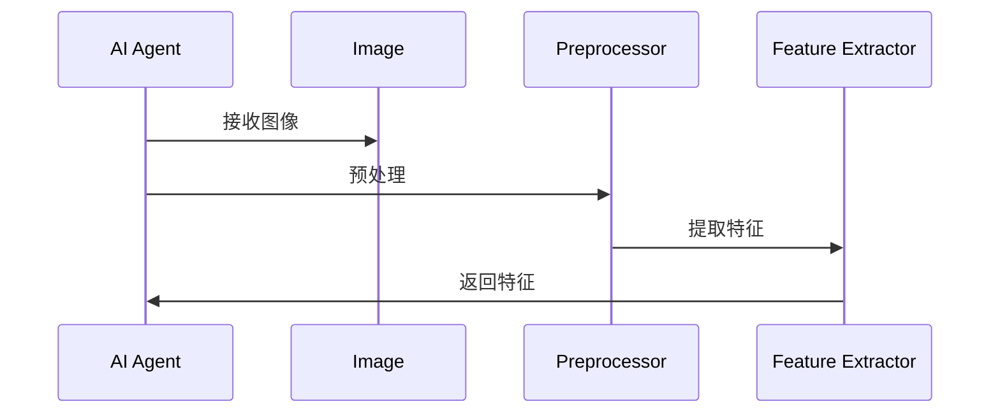

### 3.3 决策制定

在信息分析完成后，AI Agent需要根据分析结果制定相应的决策。决策制定过程通常涉及到策略学习、模型预测等。例如，在自动驾驶中，AI Agent需要根据道路信息和车辆状态，制定行驶路径和速度等。

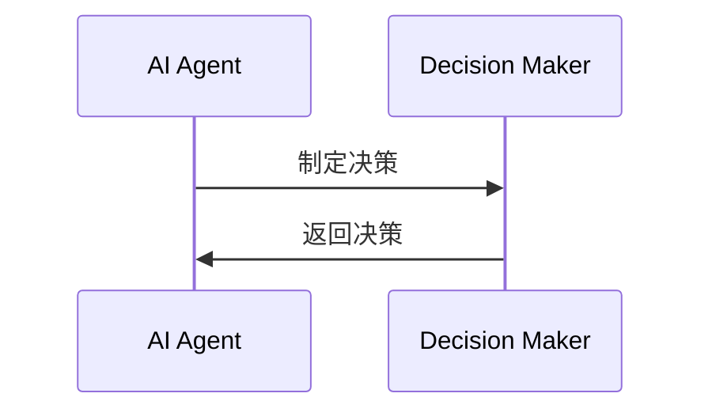

### 3.4 行为执行

制定决策后，AI Agent需要根据决策执行相应的行为。行为执行包括控制执行、反馈调整等。例如，在机器人领域中，AI Agent需要根据决策控制机器人的运动和动作。

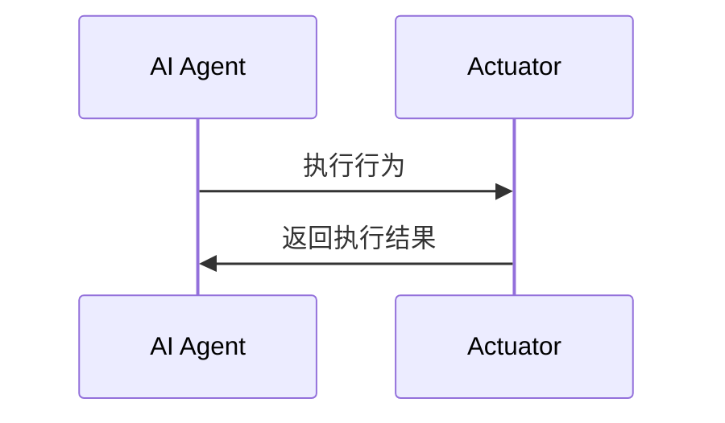

### 3.5 自主学习

在执行行为后，AI Agent会根据执行结果和环境反馈，进行自主学习。通过学习，AI Agent可以优化自身的决策模型和行为策略，提高系统的鲁棒性和适应性。

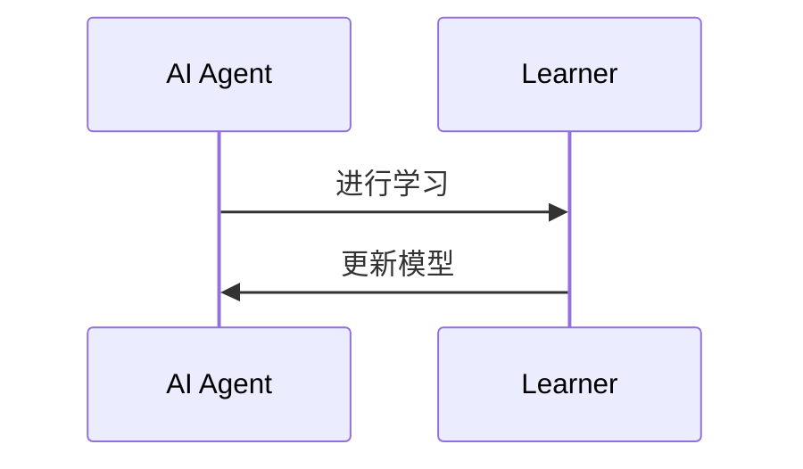

### 3.6 AI Agent抽象思维过程的Mermaid流程图

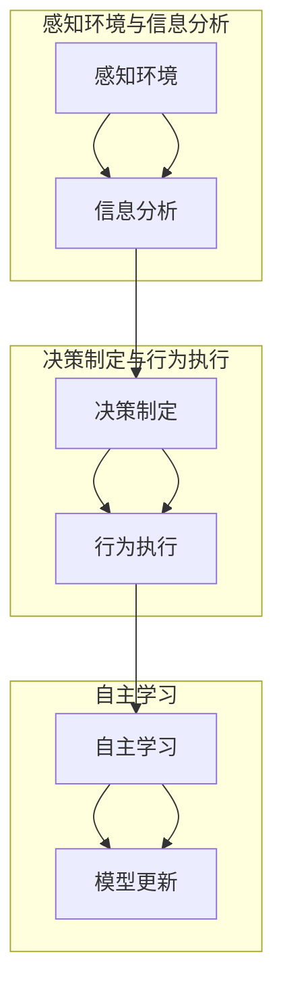

## 3.7 本章小结

本章详细阐述了AI Agent的抽象思维过程，包括感知环境、信息分析、决策制定、行为执行和自主学习等关键环节。通过Mermaid流程图，我们能够清晰地看到AI Agent如何通过这些环节实现对环境的理解和适应。下一章将探讨如何模拟语言模型（LLM）的抽象思维过程。

## 第四部分：模拟LLM的抽象思维过程

### 4.1 LLM的概念

语言模型（Language Model，LLM）是一种用于预测文本序列的概率分布的模型。LLM的核心任务是给定一个单词或一组单词，预测下一个单词或句子。LLM在自然语言处理（NLP）领域具有广泛的应用，如文本生成、机器翻译、问答系统等。

### 4.2 LLM的抽象思维过程

LLM的抽象思维过程可以看作是一种基于统计学习和概率推理的过程。以下是LLM的抽象思维过程的详细步骤：

#### 4.2.1 文本输入

首先，LLM接收到一个文本输入，这个输入可以是一个单词、一句话或者一段文本。

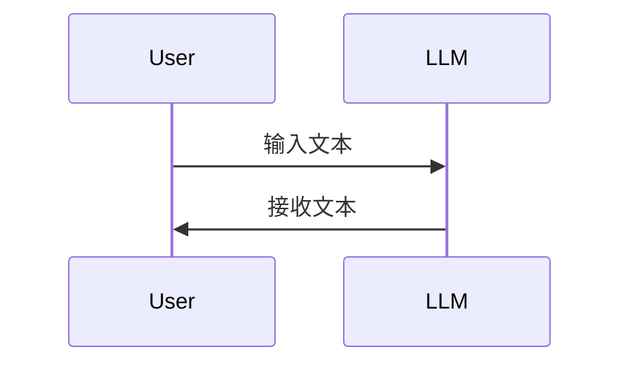

#### 4.2.2 特征提取

接下来，LLM对输入文本进行特征提取。特征提取是将文本转换为一组特征向量的过程。常见的特征提取方法包括词袋模型（Bag of Words）、词嵌入（Word Embedding）等。

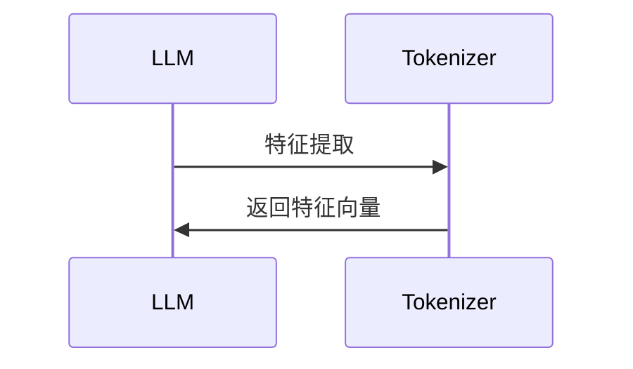

#### 4.2.3 概率预测

在特征提取完成后，LLM使用训练好的模型对特征向量进行概率预测。这个预测过程可以看作是一种概率推理，即根据历史数据和统计规律，预测下一个单词或句子的概率分布。

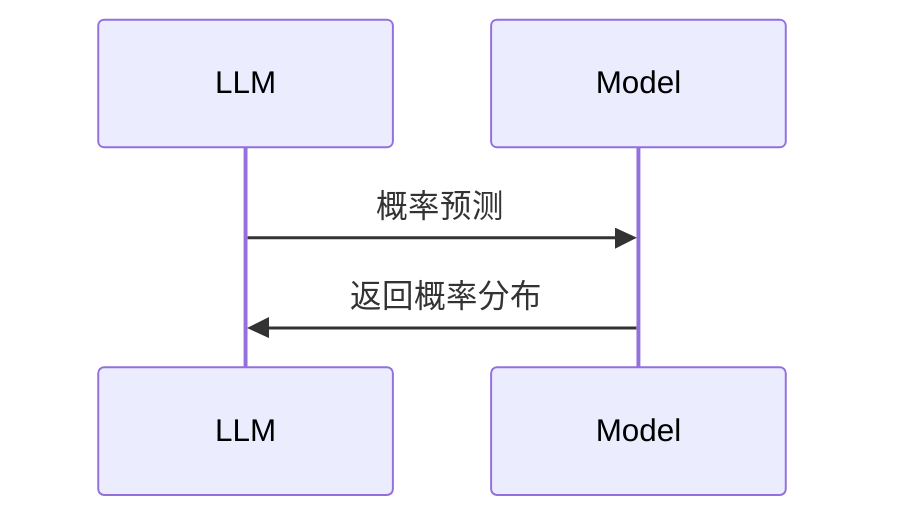

#### 4.2.4 文本生成

最后，LLM根据概率分布生成下一个单词或句子。这个过程可以看作是一种文本生成，即根据概率分布选择一个最可能的单词或句子。

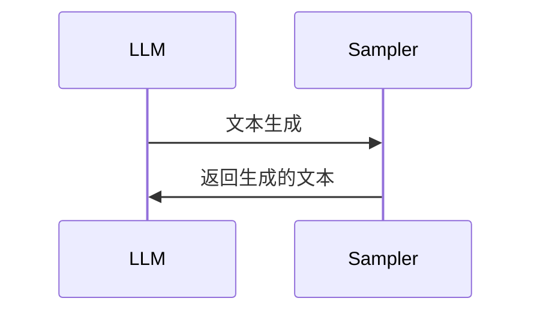

### 4.3 LLM抽象思维过程的Mermaid流程图


### 4.4 LLM与AI Agent的比较

LLM和AI Agent在抽象思维过程上有一些相似之处，但也有一些区别。以下是LLM与AI Agent在抽象思维过程中的比较：

| 步骤 | LLM | AI Agent |
| :--: | :--: | :----: |
| 文本输入 | 文本输入 | 环境感知 |
| 特征提取 | 特征提取 | 信息分析 |
| 概率预测 | 概率预测 | 决策制定 |
| 文本生成 | 文本生成 | 行为执行 |

### 4.5 本章小结

本章详细探讨了模拟LLM的抽象思维过程，包括文本输入、特征提取、概率预测和文本生成等步骤。通过比较LLM与AI Agent的抽象思维过程，我们能够更好地理解两者的异同。下一章将探讨如何在实际应用中实现AI Agent的抽象思维过程。

## 第五部分：AI Agent的应用实例

### 5.1 自动驾驶

自动驾驶是AI Agent应用的一个重要领域。自动驾驶系统通过感知环境、分析信息、制定决策和执行行为，实现车辆的安全驾驶。以下是自动驾驶系统的AI Agent抽象思维过程：

#### 5.1.1 感知环境

自动驾驶车辆通过摄像头、激光雷达和雷达等传感器获取道路信息，如道路标识、车辆位置和行人等。


#### 5.1.2 信息分析

AI Agent对获取的环境信息进行预处理和分析，提取关键特征，如道路标识、车辆和行人的位置和速度等。

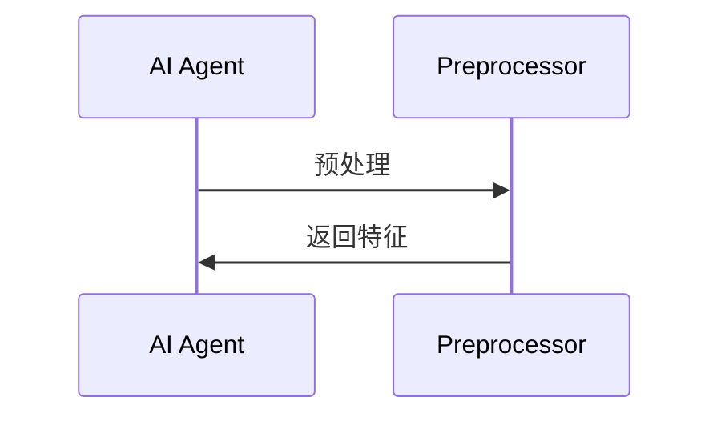

#### 5.1.3 决策制定

基于分析结果，AI Agent制定相应的驾驶决策，如保持车道、加速、减速或转向等。


#### 5.1.4 行为执行

AI Agent根据决策控制车辆执行相应的驾驶行为。


### 5.2 智能家居

智能家居是AI Agent应用的另一个重要领域。智能家居系统通过感知家庭环境、分析信息、制定决策和执行行为，实现家庭设备的智能控制。以下是智能家居系统的AI Agent抽象思维过程：

#### 5.2.1 感知环境

智能家居系统通过传感器感知家庭环境信息，如温度、湿度、光照等。


#### 5.2.2 信息分析

AI Agent对获取的环境信息进行预处理和分析，提取关键特征，如温度、湿度、光照等。


#### 5.2.3 决策制定

基于分析结果，AI Agent制定相应的家庭设备控制决策，如调节温度、湿度、光照等。


#### 5.2.4 行为执行

AI Agent根据决策控制家庭设备执行相应的行为。


### 5.3 金融风控

金融风控是AI Agent应用的另一个重要领域。金融风控系统通过感知金融市场、分析信息、制定决策和执行行为，实现金融风险的控制。以下是金融风控系统的AI Agent抽象思维过程：

#### 5.3.1 感知环境

金融风控系统通过获取市场数据、新闻资讯等，感知金融市场环境。

```mermaid
sequenceDiagram
  AI Agent->>Sensor: 感知环境
  Sensor->>AI Agent: 返回环境信息
```

#### 5.3.2 信息分析

AI Agent对获取的市场信息进行预处理和分析，提取关键特征，如市场走势、风险指标等。

```mermaid
sequenceDiagram
  AI Agent->>Preprocessor: 预处理
  Preprocessor->>AI Agent: 返回特征
```

#### 5.3.3 决策制定

基于分析结果，AI Agent制定相应的风控决策，如风险预警、交易策略调整等。

```mermaid
sequenceDiagram
  AI Agent->>Decision Maker: 制定决策
  Decision Maker->>AI Agent: 返回决策
```

#### 5.3.4 行为执行

AI Agent根据决策执行相应的风控行为。

```mermaid
sequenceDiagram
  AI Agent->>Actuator: 执行行为
  Actuator->>AI Agent: 返回执行结果
```

### 5.4 本章小结

本章通过自动驾驶、智能家居和金融风控等应用实例，详细阐述了AI Agent的抽象思维过程。通过感知环境、信息分析、决策制定和行为执行等步骤，AI Agent能够实现复杂任务的自动化和智能化。这些应用实例展示了AI Agent在各个领域的广泛应用和潜力。

## 第六部分：AI Agent的未来发展趋势

### 6.1 技术演进方向

随着人工智能技术的不断发展，AI Agent在未来将朝着更加智能、高效、自适应的方向演进。以下是几个可能的技术演进方向：

- 神经网络和深度学习技术的进一步发展，将使AI Agent在复杂环境中的感知和分析能力得到显著提升；
- 强化学习技术的应用，将使AI Agent在动态环境中实现更高效的决策和优化；
- 多模态感知技术的发展，将使AI Agent能够整合多种传感器信息，实现更全面的环境感知；
- 自然语言处理技术的进步，将使AI Agent在理解自然语言、生成自然语言方面更加出色。

### 6.2 应用的拓展领域

AI Agent的应用领域将不断拓展，不仅限于目前的机器人、智能交通、金融风控等，还可能涉及到以下领域：

- 医疗健康：AI Agent可以辅助医生进行诊断、治疗方案制定和患者管理；
- 教育培训：AI Agent可以作为智能教师，提供个性化教学和学习支持；
- 娱乐休闲：AI Agent可以参与游戏设计、虚拟现实体验等娱乐活动；
- 服务业：AI Agent可以提供智能客服、智能销售等服务。

### 6.3 面临的挑战和问题

尽管AI Agent具有广泛的应用前景，但在其发展过程中仍面临一些挑战和问题：

- 数据隐私和安全：AI Agent在处理海量数据时，如何保护用户隐私和数据安全是一个重要问题；
- 算法透明性和可解释性：随着AI Agent的智能化程度提高，如何解释其决策过程和算法逻辑成为一个挑战；
- 人机协作：如何在人机协作中实现高效互动，避免人类和AI Agent之间的冲突和误解；
- 道德和伦理问题：AI Agent在决策和行为中如何遵循道德和伦理规范，避免造成负面影响。

### 6.4 未来展望

尽管面临诸多挑战，但随着技术的不断进步和应用的深入，AI Agent有望在未来实现更加智能、自适应和自主的决策能力，成为人类社会的重要助手和伙伴。通过不断优化和改进，AI Agent将在更多领域发挥其价值，推动人工智能技术的全面进步。

## 第七部分：总结与展望

### 7.1 总结

本文通过对AI Agent的概念形成、抽象思维过程及其应用实例的深入探讨，详细阐述了AI Agent的核心特征、抽象思维过程以及如何模拟LLM的抽象思维过程。通过感知环境、信息分析、决策制定和行为执行等步骤，AI Agent能够在复杂环境中实现自主决策和自适应行为。同时，本文结合自动驾驶、智能家居和金融风控等实际应用场景，展示了AI Agent的广泛应用和潜力。

### 7.2 展望

在未来，随着人工智能技术的不断发展，AI Agent有望在更多领域发挥重要作用。随着神经网络、深度学习、强化学习等技术的进步，AI Agent的感知和分析能力将得到显著提升。同时，AI Agent的应用领域也将不断拓展，从目前的机器人、智能交通、金融风控等，扩展到医疗健康、教育培训、娱乐休闲和更多服务业领域。

然而，AI Agent的发展仍面临诸多挑战，如数据隐私和安全、算法透明性和可解释性、人机协作以及道德和伦理问题等。为了应对这些挑战，我们需要在技术、政策和伦理等方面进行深入研究，确保AI Agent的发展能够造福人类社会，推动人工智能技术的全面进步。

## 7.3 最佳实践与建议

在AI Agent的开发和应用过程中，以下是一些最佳实践和注意事项：

1. **数据质量和预处理**：确保使用高质量的数据进行训练和推理，对数据进行预处理，如去噪、清洗和标准化。
2. **模型选择和优化**：根据应用场景选择合适的模型架构，并通过超参数调整和优化模型性能。
3. **可解释性和透明性**：开发可解释的AI Agent，使得决策过程和算法逻辑更加清晰，提高系统的可信度和用户接受度。
4. **安全性**：加强AI Agent的安全防护措施，防止数据泄露和恶意攻击，确保系统的稳定性和安全性。
5. **人机协作**：设计合理的人机协作机制，确保AI Agent与人类用户之间的互动高效、自然和和谐。
6. **道德和伦理**：遵循道德和伦理规范，确保AI Agent的行为符合社会价值观和法律法规。

## 作者信息

作者：AI天才研究院/AI Genius Institute & 禅与计算机程序设计艺术 /Zen And The Art of Computer Programming

## 拓展阅读

1. Russell, S., & Norvig, P. (2016). 《人工智能：一种现代的方法》(第三版). 北京：机械工业出版社。
2. Goodfellow, I., Bengio, Y., & Courville, A. (2016). 《深度学习》（Deep Learning）. 北京：人民邮电出版社。
3.的人工智能伦理问题讨论》。中国社会科学出版社，2020年。

