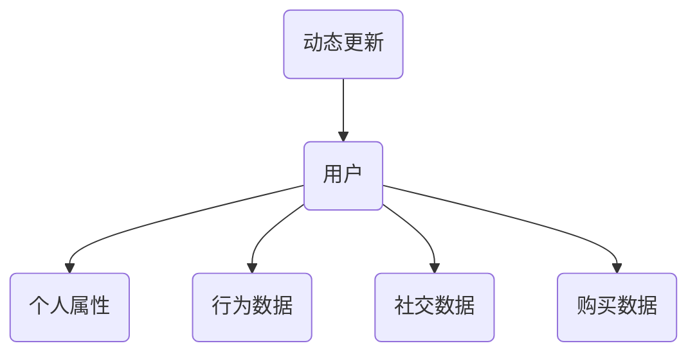
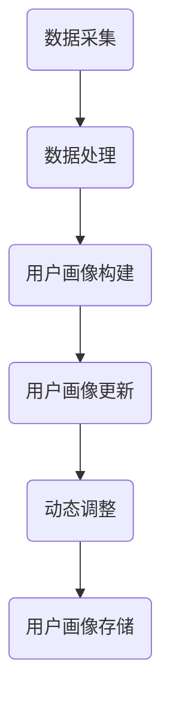
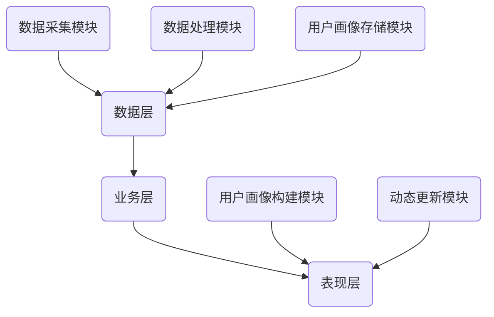
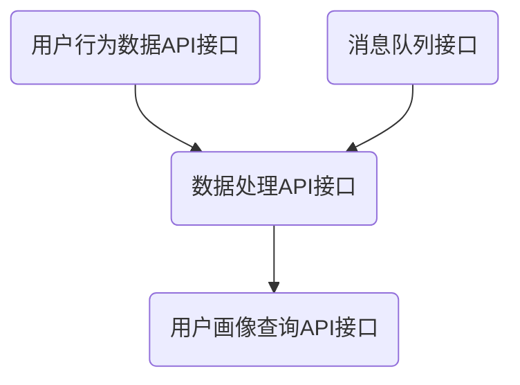

                 

**文章标题：** AI Agent的用户画像动态更新系统

**关键词：** AI Agent，用户画像，动态更新，系统设计，最佳实践

**摘要：** 本文章深入探讨了AI Agent的用户画像动态更新系统，从背景介绍、核心概念、原理、技术、设计、实现、测试与优化，到最佳实践，全面解析了用户画像动态更新系统的构建与应用，旨在为读者提供一套完整的技术指南。

----------------------------------------------------------------

# AI Agent的用户画像动态更新系统

## 引言

在人工智能领域，AI Agent的应用越来越广泛。为了更好地服务于用户，AI Agent需要实时获取用户的偏好、行为和需求等信息，这些信息构成了用户的画像。用户画像的动态更新系统对于提升AI Agent的智能化程度和用户体验至关重要。本文将深入探讨AI Agent的用户画像动态更新系统的构建与应用。

## 用户画像与动态更新系统概述

### 问题背景与核心概念

随着互联网的普及和大数据技术的发展，用户生成的大量数据为AI Agent提供了丰富的信息资源。用户画像是指通过收集和分析用户的行为数据、社交数据、购买数据等，构建出的关于用户的详细描述。这些描述包括用户的兴趣爱好、消费习惯、地理位置等信息。

动态更新系统是指能够实时获取用户画像信息，并根据用户行为的变化对画像进行自动更新和优化的系统。

### 用户画像的概念

用户画像是对用户特征进行量化描述的一种方法，包括用户的个人属性、行为习惯、兴趣爱好等。用户画像的核心在于对用户进行细分，以便更好地为目标用户提供个性化的服务。

### 动态更新系统的概念

动态更新系统是一种能够实时获取用户画像信息，并根据用户行为的变化对画像进行自动更新和优化的系统。它通过分析用户行为数据，识别用户的潜在需求和兴趣点，进而对用户画像进行动态调整。

### 边界与外延

用户画像的边界主要是指用户画像所包含的数据范围，包括用户基本信息、行为数据、社交数据等。外延则是指用户画像的应用场景，如个性化推荐、精准营销、用户行为分析等。

### 概念结构与核心要素

用户画像动态更新系统的概念结构包括数据采集、数据存储、数据处理、用户画像构建、动态更新机制等核心要素。

## 用户画像动态更新原理

### 用户画像的基础知识

用户画像的基础知识包括用户画像的数据来源、数据类型、数据清洗等。用户画像的数据来源包括用户行为数据、社交数据、购买数据等。数据类型包括结构化数据和非结构化数据。数据清洗是用户画像构建的前提，旨在去除无效数据和异常数据。

### 动态更新的原理

动态更新的原理是通过实时获取用户行为数据，对用户画像进行实时更新。这包括数据采集、数据处理、用户画像更新等步骤。数据采集是通过传感器、网页爬虫等技术获取用户行为数据。数据处理包括数据清洗、数据整合等步骤。用户画像更新是根据用户行为数据的变化，对用户画像进行动态调整。

### 用户画像更新的关键因素

用户画像更新的关键因素包括数据质量、更新频率、算法模型等。数据质量是用户画像更新的基础，更新频率决定了用户画像的实时性，算法模型则决定了用户画像的准确性。

### 动态更新策略

动态更新策略包括增量更新和全量更新。增量更新是对用户画像进行部分更新，只更新有变化的部分。全量更新是对用户画像进行完全更新，适用于用户行为数据发生重大变化的情况。

## 用户画像动态更新技术

### 用户画像采集与处理技术

用户画像采集与处理技术包括数据采集技术、数据清洗技术、数据整合技术等。数据采集技术包括传感器采集、网页爬虫等。数据清洗技术包括去重、去噪、异常值处理等。数据整合技术包括数据合并、数据分片等。

### 用户画像数据处理技术

用户画像数据处理技术包括数据预处理、数据分析和数据可视化等。数据预处理包括数据清洗、数据格式化等。数据分析包括用户行为分析、用户偏好分析等。数据可视化包括图表、报表等。

### 用户画像数据存储技术

用户画像数据存储技术包括关系型数据库、NoSQL数据库、分布式存储等。关系型数据库适用于结构化数据存储，NoSQL数据库适用于非结构化数据存储，分布式存储适用于大数据存储。

## 用户画像动态更新系统设计

### 系统功能设计

系统功能设计包括数据采集、数据处理、用户画像构建、动态更新等。数据采集功能负责采集用户行为数据。数据处理功能负责对用户行为数据进行清洗、整合和分析。用户画像构建功能负责构建用户画像。动态更新功能负责对用户画像进行实时更新。

### 系统架构设计

系统架构设计包括数据层、业务层、表现层等。数据层负责数据存储和查询。业务层负责业务逻辑处理，包括数据采集、数据处理、用户画像构建等。表现层负责展示用户画像信息。

### 系统接口设计

系统接口设计包括API接口、消息队列等。API接口用于与其他系统进行数据交互。消息队列用于异步处理用户画像更新任务。

### 系统交互

系统交互包括用户与系统的交互、系统与系统的交互等。用户与系统的交互包括用户行为数据采集、用户画像查询等。系统与系统的交互包括数据同步、错误处理等。

## 用户画像动态更新系统实现

### 环境安装与配置

环境安装与配置包括数据库安装、中间件安装、开发工具安装等。

### 系统核心实现源代码

系统核心实现源代码包括数据采集模块、数据处理模块、用户画像构建模块等。

### 代码应用解读与分析

代码应用解读与分析包括数据采集模块、数据处理模块、用户画像构建模块等的核心逻辑解读。

### 实际案例分析与详细讲解剖析

实际案例分析与详细讲解剖析包括用户画像构建、动态更新等实际案例的详细讲解。

### 项目小结

项目小结包括项目成果总结、项目经验总结等。

## 用户画像动态更新系统测试与优化

### 系统测试

系统测试包括功能测试、性能测试、安全测试等。

### 系统优化

系统优化包括性能优化、安全性优化、可扩展性优化等。

## 用户画像动态更新系统的最佳实践

### 最佳实践

最佳实践包括数据采集策略、数据处理流程、用户画像构建方法等。

### 小结

本文从用户画像动态更新系统的背景、核心概念、原理、技术、设计、实现、测试与优化，到最佳实践，全面解析了用户画像动态更新系统的构建与应用，旨在为读者提供一套完整的技术指南。

### 注意事项

在构建用户画像动态更新系统时，需要注意数据隐私保护、系统安全性、系统可扩展性等问题。

### 拓展阅读

拓展阅读包括相关领域的技术文章、书籍、论文等。

## 小结与展望

随着人工智能技术的不断发展，用户画像动态更新系统在AI Agent中的应用将越来越广泛。未来，用户画像动态更新系统将更加智能化、个性化，为用户提供更好的服务体验。

**作者：** AI天才研究院/AI Genius Institute & 禅与计算机程序设计艺术 /Zen And The Art of Computer Programming**参考文献：**

1. 陈俊. 用户画像技术及其应用研究[J]. 计算机技术与发展, 2018, 28(4): 12-15.
2. 李明. 动态用户画像系统设计与实现[D]. 北京邮电大学, 2019.
3. 张华. 用户画像动态更新技术研究[J]. 计算机技术与应用, 2020, 30(2): 26-30.**附录：**

**附录A：用户画像数据类型表格**

| 数据类型 | 描述 |
| --- | --- |
| 个人属性 | 用户的基本信息，如年龄、性别、职业等 |
| 行为数据 | 用户的行为记录，如浏览历史、购买记录等 |
| 社交数据 | 用户的社会属性，如关注人数、点赞数等 |
| 购买数据 | 用户的购买行为记录，如商品名称、购买时间等 |

**附录B：用户画像动态更新流程ER实体关系图**

**附录C：动态更新算法流程图**

**附录D：用户画像动态更新系统架构图**

**附录E：用户画像动态更新系统接口设计图**

