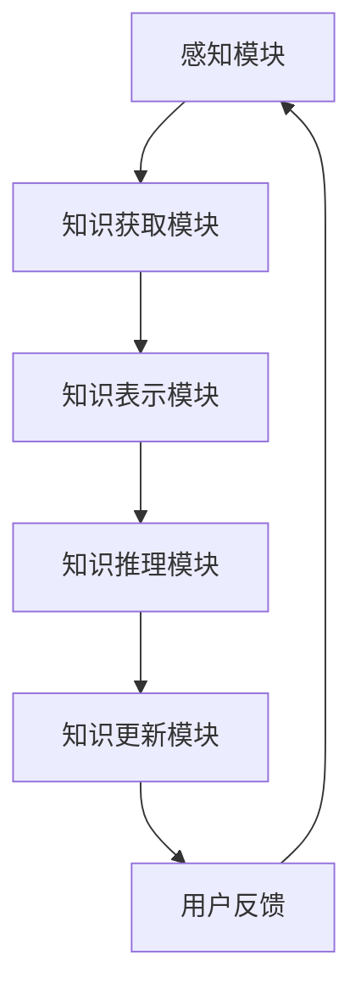
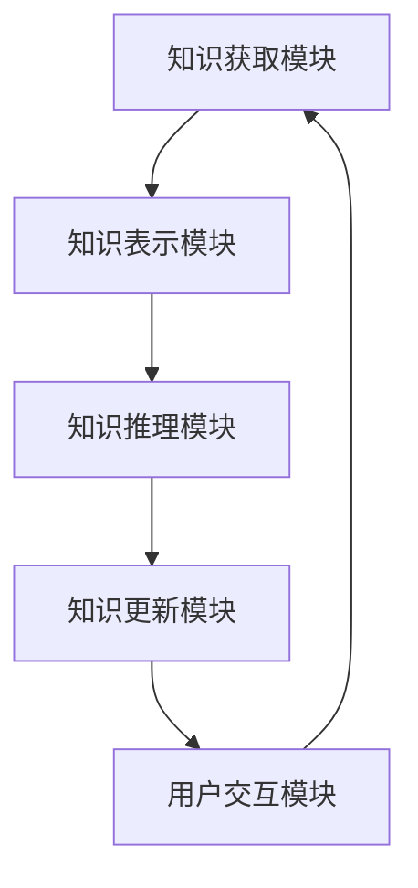
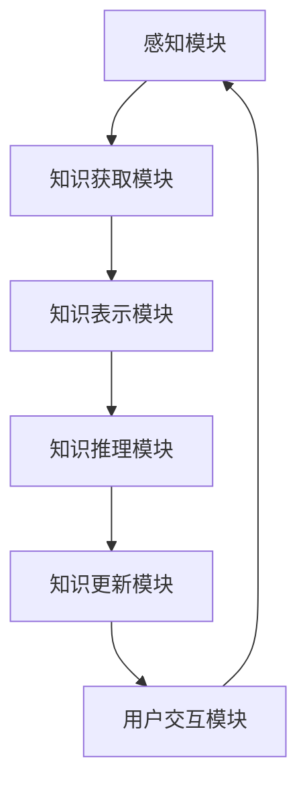
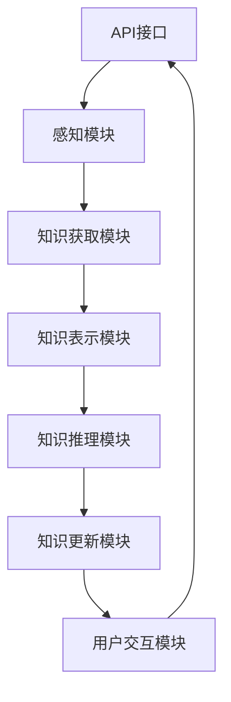
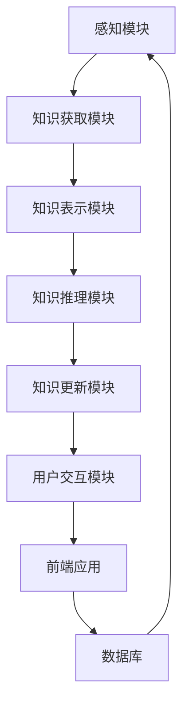

                 


### 1.1 问题背景

在当今的科技环境中，人工智能（AI）已经成为了推动社会进步的重要力量。AI Agent，作为人工智能领域的一种重要表现形式，正逐渐渗透到我们的日常生活和工作中。AI Agent，通常指具备自主行动能力和解决问题能力的智能体，它们可以通过学习不断进化，以适应复杂多变的现实环境。

知识演化是AI Agent的核心能力之一。一个AI Agent要想具备高水平的智能，就需要不断地从环境中学习新的知识，并将这些知识进行整合和演化，以提升自身的智能水平。而语言模型（LLM），尤其是近年来迅速发展的预训练语言模型，如GPT、BERT等，已经展示出强大的知识获取和知识演化能力。这使得LLM成为了模拟AI Agent认知发展的一个重要工具。

然而，目前关于AI Agent知识演化，尤其是模拟LLM认知发展的研究仍然存在很多挑战。如何构建一个既能够模拟LLM的认知发展过程，又能够有效指导AI Agent知识演化的模型，是当前研究的重点和难点。此外，LLM在AI Agent中的应用场景也亟待进一步探索，如何通过AI Agent实现知识的自适应学习和持续进化，是当前AI研究的重要方向。

本篇文章将围绕AI Agent的知识演化，模拟LLM的认知发展过程进行深入探讨。文章将首先介绍AI Agent的定义和知识演化的重要性，然后分析LLM在AI Agent知识演化中的应用，最后讨论研究的目的和意义，以及本文的研究边界和外延。通过这一系列的分析，希望能够为AI Agent的知识演化提供一些新的思路和解决方案。

### 1.2 研究目的与意义

研究AI Agent的知识演化，尤其是模拟LLM的认知发展过程，具有重要的理论和实践意义。从理论角度来看，这一研究有助于深入理解AI Agent的智能行为机制，探索知识获取、表示、推理和演化的内在规律。通过模拟LLM的认知发展过程，我们可以更好地理解语言模型在知识演化中的关键作用，为未来更加智能和自适应的AI Agent设计提供理论支持。

从实践角度来看，这一研究对AI Agent的实际应用具有重要意义。在实际场景中，AI Agent需要不断地从环境中学习新的知识，并将这些知识进行整合和演化，以适应动态变化的环境和任务需求。通过模拟LLM的认知发展过程，我们可以构建出更加智能和自适应的AI Agent，使其在复杂多变的现实环境中能够更加高效地完成任务。

具体而言，本文的研究目标如下：

1. **构建一个模拟LLM认知发展的AI Agent知识演化模型**：通过分析LLM的知识获取、表示、推理和演化过程，构建一个能够模拟LLM认知发展的AI Agent知识演化模型，为AI Agent的设计和实现提供理论基础。

2. **探索AI Agent知识演化的机制**：通过对模型的研究，深入探索AI Agent知识演化的内在机制，包括知识获取、整合、推理和更新等环节，为AI Agent的知识演化提供方法论支持。

3. **验证和评估模型的有效性**：通过实际应用案例，验证和评估所构建的AI Agent知识演化模型的有效性，为模型的进一步优化和推广提供依据。

这一研究具有重要的现实意义。首先，它有助于提升AI Agent的智能化水平，使其能够更好地适应复杂多变的现实环境。其次，它为AI Agent在各个领域中的应用提供了新的思路和方法，有助于推动AI技术的发展和应用。最后，通过模拟LLM的认知发展过程，我们可以为其他智能体系统的设计提供参考，促进智能系统整体水平的提升。

### 1.3 边界与外延

在探讨AI Agent的知识演化时，我们需要明确研究的边界与外延，以确保研究内容的科学性和针对性。首先，关于知识演化的边界条件，我们需要关注以下几个方面：

1. **知识类型**：本文主要研究结构化和半结构化知识的演化，不包括完全非结构化数据（如图像、音频等）的处理。

2. **知识获取**：本文关注的是通过语言模型进行的知识获取，不包括通过传感器、数据库等传统方式的知识获取。

3. **知识表示**：本文研究的是基于自然语言处理的表示方法，不包括其他类型的表示方法（如图像、音频等）。

其次，关于LLM认知发展的外延范围，本文主要关注以下几个方面：

1. **语言模型类型**：本文主要研究预训练语言模型（如GPT、BERT等）的认知发展，不包括传统统计语言模型和深度学习语言模型。

2. **应用场景**：本文主要关注AI Agent在文本处理、问答系统、智能客服等领域的认知发展，不包括其他领域的应用。

3. **演化过程**：本文研究的是知识获取、知识整合、知识推理和知识更新等基本演化过程，不包括更复杂的认知过程（如情感理解、图像识别等）。

明确研究的边界与外延有助于我们集中精力解决核心问题，提高研究的针对性和有效性。同时，这也有助于我们将研究成果应用于实际场景，为AI Agent的设计和实现提供具体指导。

### 1.4 概念结构与核心要素组成

在探讨AI Agent的知识演化时，明确核心概念和要素组成至关重要。以下是对相关核心概念和要素的详细分析：

#### 1.4.1 知识演化的核心概念

**知识获取**：知识获取是知识演化的第一步，也是最为关键的一步。它涉及从外部环境中获取新的信息，并将其转化为内部知识结构的过程。知识获取的方式有多种，包括数据采集、信息检索、感知输入等。

**知识表示**：知识表示是将获取到的知识以特定的形式存储和表示的过程。在AI Agent中，知识表示通常采用语义网络、知识图谱、自然语言处理等方法。其中，自然语言处理方法由于其灵活性和适应性，已经成为知识表示的主流技术。

**知识推理**：知识推理是基于已有知识进行逻辑推理和问题解决的过程。它包括演绎推理、归纳推理、类比推理等类型。知识推理能力是AI Agent智能水平的重要体现。

**知识更新**：知识更新是指对已有知识进行修正、补充和优化的过程。在AI Agent的演化过程中，知识更新是确保其适应性和准确性的关键。

#### 1.4.2 LLM的认知发展要素

**语言模型**：语言模型是模拟AI Agent认知发展的重要工具。它通过对大量文本数据进行训练，掌握语言规律和知识结构。常用的语言模型包括GPT、BERT等，这些模型在自然语言处理领域取得了显著成果。

**知识获取**：LLM通过预训练和微调，从大量文本数据中获取知识。这个过程包括词汇理解、句法分析、语义理解等，为AI Agent的知识积累奠定基础。

**知识表示**：LLM通过嵌入技术，将自然语言文本转化为向量表示，实现对知识的结构化存储。这种表示方法不仅便于知识检索和推理，还提高了AI Agent的智能水平。

**知识推理**：LLM利用其训练得到的语言模型，进行逻辑推理和问题解决。它能够通过分析文本中的信息，推导出新的结论，实现智能决策。

**知识更新**：LLM通过持续学习和自适应调整，不断优化其知识库。这种更新机制使得AI Agent能够适应动态变化的环境，保持其智能水平。

综上所述，AI Agent的知识演化涉及知识获取、知识表示、知识推理和知识更新等核心概念，而LLM的认知发展则通过这些概念的具体实现，模拟出AI Agent的认知过程。明确这些核心概念和要素，有助于我们深入理解AI Agent的知识演化机制，为未来的研究和应用提供理论支持。

### 1.5 本章小结

本章首先介绍了AI Agent的定义和知识演化的重要性，分析了LLM在AI Agent知识演化中的应用。接着，我们明确了研究的目的与意义，强调了知识演化的边界与外延。通过探讨知识演化的核心概念和LLM的认知发展要素，本章为后续内容的深入讨论奠定了基础。本章的内容不仅为后续研究提供了理论指导，也为实际应用中的AI Agent设计提供了有益参考。

### 2.1 LLM的基本原理

#### 2.1.1 语言模型的概述

语言模型（Language Model，LM）是自然语言处理（Natural Language Processing，NLP）中的一种基础性技术，它通过统计和算法的方式模拟人类语言生成和理解的过程。语言模型的目的是预测一段文本序列中下一个可能的词或字符，从而生成连贯的文本。语言模型的应用非常广泛，包括但不限于机器翻译、语音识别、自动摘要、问答系统、文本生成等。

语言模型的发展经历了多个阶段。早期的语言模型主要是基于规则的方法，如上下文无关文法（CFG）和概率上下文无关文法（PCFG）。这些模型通过定义一组语法规则来生成文本，但由于规则数量庞大且复杂，难以在实际应用中有效使用。随着计算能力的提升和机器学习技术的发展，统计语言模型逐渐成为主流。这些模型基于大量的文本语料库，通过统计方法来发现语言规律和模式。

在深度学习时代，神经网络语言模型（Neural Language Model）得到了广泛应用。代表性的模型包括循环神经网络（RNN）、长短期记忆网络（LSTM）和门控循环单元（GRU）。这些模型通过训练大量的文本数据，可以自动学习到复杂的语言特征和模式，生成高质量的文本序列。

#### 2.1.2 语言模型的数学基础

语言模型的数学基础主要涉及概率模型和神经网络模型。以下是几种常见语言模型的数学基础：

1. **N-gram模型**：
   N-gram模型是最简单的语言模型之一，它通过统计相邻的N个单词（或字符）出现的频率来预测下一个单词。N-gram模型的数学基础是条件概率，即给定前N-1个单词，预测第N个单词的概率。

   $$ P(w_n|w_{n-1}, w_{n-2}, ..., w_{n-N+1}) = \frac{f(w_{n-1}, w_{n-2}, ..., w_{n-N+1}, w_n)}{f(w_{n-1}, w_{n-2}, ..., w_{n-N+1})} $$
   
   其中，\( f(\cdot) \)表示词频或出现频率。

2. **神经网络语言模型**：
   神经网络语言模型通过神经网络来模拟语言生成和理解过程。最常用的神经网络模型是循环神经网络（RNN），特别是长短期记忆网络（LSTM）和门控循环单元（GRU）。这些模型的基本思想是通过隐藏状态序列来编码输入序列的信息，然后利用这个隐藏状态序列预测下一个输出。

   LSTM模型可以用以下公式表示：
   
   $$ h_t = \sigma(W_f \odot [h_{t-1}, x_t] + b_f) \odot (1 - h_t) \odot (W_i \odot [h_{t-1}, x_t] + b_i) \odot (1 - \sigma(W_g \odot [h_{t-1}, x_t] + b_g)) \odot (W_o \odot [h_{t-1}, x_t] + b_o) $$
   
   其中，\( h_t \)是隐藏状态，\( x_t \)是输入，\( W_f, W_i, W_g, W_o \)和\( b_f, b_i, b_g, b_o \)分别是权重和偏置，\( \sigma \)是sigmoid函数，\( \odot \)表示点积。

3. **深度自注意力模型**：
   深度自注意力模型（如Transformer）在NLP领域取得了显著的成功。Transformer模型的核心思想是自注意力机制（Self-Attention），它通过计算输入序列中每个元素之间的相互依赖关系来生成表示。

   自注意力机制的公式为：
   
   $$ \text{Attention}(Q, K, V) = \text{softmax}\left(\frac{QK^T}{\sqrt{d_k}}\right)V $$
   
   其中，\( Q, K, V \)分别是查询（Query）、关键（Key）和值（Value）向量，\( d_k \)是关键向量的维度。

#### 2.1.3 LLM的工作机制

语言模型的工作机制主要包括以下几个步骤：

1. **输入编码**：将输入文本序列编码为向量表示。对于基于神经网络的模型，这一步骤通常通过嵌入层（Embedding Layer）完成，将单词映射为高维向量。

2. **隐藏状态计算**：利用编码后的输入向量计算隐藏状态。对于RNN和LSTM模型，隐藏状态是序列中的每个时间步的输出。对于Transformer模型，隐藏状态是自注意力机制的结果。

3. **输出预测**：利用隐藏状态预测下一个单词或字符。这通常通过一个线性层（Linear Layer）和一个softmax激活函数完成。

4. **损失计算与优化**：通过计算预测的概率分布与实际分布之间的差异（损失），使用梯度下降等优化算法更新模型的参数。

通过上述步骤，语言模型能够从大量文本数据中学习到语言模式，并生成高质量的文本序列。LLM的工作机制不仅包括语言生成，还包括语言理解和语义分析等，使其在AI Agent的知识演化中扮演重要角色。

### 2.2 知识获取与表示

#### 2.2.1 知识获取的方法

在AI Agent的知识演化过程中，知识获取是一个关键环节。知识获取的方法多种多样，主要包括以下几种：

1. **数据采集**：通过互联网、数据库、传感器等渠道收集与特定任务相关的数据。这些数据可以是结构化数据（如数据库中的表格数据）或非结构化数据（如文本、图像、视频等）。

2. **信息检索**：利用搜索引擎、知识图谱等技术，从大规模数据库或互联网中检索与任务相关的信息。信息检索方法包括基于关键词的检索、基于语义的检索和基于图谱的检索等。

3. **感知输入**：通过传感器获取环境信息，如温度、湿度、声音、图像等。感知输入方法适用于需要实时监控和响应的AI Agent。

4. **主动学习**：AI Agent通过交互和反馈，主动选择最有价值的数据进行学习。主动学习方法可以显著提高知识获取的效率和准确性。

5. **迁移学习**：利用预训练模型或已有模型的参数，在新任务上进行微调，以快速获取新知识。迁移学习方法可以减少数据需求和计算资源，提高知识获取的效率。

#### 2.2.2 知识表示的技术

在AI Agent的知识演化过程中，如何有效地表示和存储知识是一个重要问题。以下是几种常见的知识表示技术：

1. **语义网络**：语义网络通过实体（Entity）和关系（Relationship）来表示知识。每个实体都有属性（Property）和值（Value），实体之间的关系用边（Edge）表示。语义网络可以直观地表示知识的结构和关系，适用于中小规模的知识表示。

2. **知识图谱**：知识图谱是一种大规模、分布式、语义化的知识表示方法，它通过节点（Node）和边（Edge）来表示实体和实体之间的关系。知识图谱可以涵盖广泛的领域知识，适用于复杂和大规模的知识表示。

3. **自然语言处理**：自然语言处理（NLP）技术可以将文本数据转换为结构化的知识表示。NLP技术包括词嵌入（Word Embedding）、句嵌入（Sentence Embedding）、语义角色标注（Semantic Role Labeling）等，适用于处理文本和数据密集型任务。

4. **图神经网络**：图神经网络（Graph Neural Network，GNN）是一种处理图结构数据的神经网络，它可以自动学习节点和边之间的复杂关系。GNN适用于知识图谱和语义网络的处理，可以有效地提取和表示知识。

5. **知识图谱嵌入**：知识图谱嵌入（Knowledge Graph Embedding，KGE）是一种将知识图谱转换为向量空间的方法。通过KGE，可以有效地在向量空间中表示实体和关系，进行知识检索和推理。

在实际应用中，这些知识表示技术可以结合使用，以构建一个灵活、高效的知识表示框架。例如，可以使用语义网络和知识图谱来表示领域知识，使用自然语言处理技术来处理文本数据，使用图神经网络来处理复杂的图结构数据。

综上所述，知识获取与表示是AI Agent知识演化过程中的关键环节。通过多种知识获取方法和多样化的知识表示技术，AI Agent可以有效地从环境中获取知识，并将其进行结构化和表示，为后续的知识推理和演化提供基础。

### 2.3 知识推理与演化

#### 2.3.1 知识推理的基本原理

知识推理是AI Agent知识演化过程中的核心环节，它通过逻辑推理和算法计算，从已知信息中推导出新的结论。知识推理的基本原理包括以下几个方面：

1. **演绎推理**：演绎推理是从一般到个别的推理过程，基于一组前提条件推导出一个特定的结论。演绎推理遵循逻辑规则，例如，如果所有A都是B，且某个特定实体属于A，那么这个实体也属于B。这种推理方式具有高度的确定性和可靠性。

   示例：所有人都会死亡（大前提），苏格拉底是人（小前提），因此苏格拉底会死亡（结论）。

2. **归纳推理**：归纳推理是从个别到一般的推理过程，通过观察多个具体实例，归纳出一个普遍的规律或结论。归纳推理虽然不一定总是正确，但它可以揭示事物之间的潜在关系。

   示例：观察到的所有天鹅都是白色的，推断所有天鹅都是白色的。

3. **类比推理**：类比推理是通过比较两个或多个相似情境，从一个已知情境推导出另一个未知情境的结论。类比推理基于相似性原则，它可以帮助AI Agent在新情境中应用已有知识。

   示例：如果A在情境X中表现出了某种特性，那么类似的，B在情境Y中也可能表现出相同的特性。

4. **模糊推理**：模糊推理是一种处理不确定性和模糊性的推理方法，它基于模糊集合理论，可以处理现实世界中存在的模糊概念和不确定性。

   示例：如果一个任务完成度在70%到90%之间，那么它的评分可能是B+到A-之间。

5. **混合推理**：混合推理结合了多种推理方法，例如，在演绎推理和归纳推理之间进行权衡，或者将模糊推理和精确推理相结合，以提高推理的灵活性和准确性。

#### 2.3.2 知识演化的过程

知识演化是指AI Agent通过不断学习和调整其知识库，以适应新的环境和任务需求的过程。知识演化通常包括以下几个步骤：

1. **感知输入**：AI Agent从外部环境中获取新的信息，这些信息可能是通过数据采集、感知输入或主动学习等方式获得的。

2. **知识获取**：AI Agent对获取的信息进行筛选和处理，识别出有价值的新知识。这一步骤通常涉及信息过滤、数据清洗和特征提取等技术。

3. **知识整合**：新知识需要与现有知识库进行整合，以避免冲突和冗余。知识整合可能包括知识合并、知识更新和知识优化等技术。

4. **知识推理**：基于整合后的知识库，AI Agent进行推理和问题解决，以生成新的结论或决策。推理方法可以包括演绎推理、归纳推理、类比推理和模糊推理等。

5. **知识更新**：AI Agent通过推理过程，识别出知识库中不准确或过时的信息，并对其进行修正和更新。知识更新是确保AI Agent知识库准确性和适应性的关键。

6. **知识存储**：将经过整合、推理和更新的知识存储在知识库中，以便后续使用。知识存储通常采用结构化数据库、知识图谱或自然语言处理等方法。

7. **知识应用**：AI Agent将知识应用于实际任务中，以实现特定的目标或解决具体问题。知识应用可以涉及多个领域，如智能客服、智能驾驶、医疗诊断等。

知识演化的过程是一个动态、循环的过程，AI Agent通过不断的学习、推理和更新，不断提高其智能水平和适应能力。这一过程不仅依赖于高效的知识获取和推理方法，还需要具备良好的知识整合和更新机制。

### 2.4 LLM认知发展的属性特征对比

在比较传统AI和LLM的认知发展属性特征时，我们可以从多个维度进行详细分析，包括知识获取方式、知识表示形式、知识推理能力和知识演化能力。以下是对这两者特征的对比：

| 特征             | 传统AI                             | LLM                                  |
| ---------------- | ---------------------------------- | ------------------------------------- |
| 知识获取方式     | 预定义规则、手工编写的特征工程     | 自适应学习语言数据、大规模预训练数据   |
| 知识表示形式     | 结构化数据、符号表示               | 自然语言数据、嵌入向量表示             |
| 知识推理能力     | 机械式推理、固定规则               | 类人思维与推理、灵活的上下文理解能力   |
| 知识演化能力     | 固定型、难以适应新环境             | 演化适应、持续学习和自我更新           |

#### 2.4.1 知识获取方式

传统AI的知识获取主要依赖于预定义的规则和手工编写的特征工程。这些规则和特征通常由专家根据领域知识设计，适用于特定任务。然而，这种方法存在几个局限性：

1. **规则依赖**：传统AI需要大量预定义的规则，这些规则往往难以覆盖所有可能的情景，导致系统在面对新情况时表现不佳。
2. **特征工程**：特征工程是一个复杂且耗时的过程，需要专家具备深厚的领域知识，而且不同专家之间的特征选择可能存在较大差异。
3. **数据限制**：传统AI对数据的依赖较强，需要大量标注数据进行训练，这在实际应用中往往难以实现。

相比之下，LLM的知识获取方式是基于自适应学习语言数据和大规模预训练数据。预训练语言模型通过在大规模语料库上进行预训练，可以自动学习到丰富的语言模式和知识，使其在处理未知任务时具备更强的适应能力：

1. **数据驱动**：LLM通过大量的未标注数据学习语言模式，减少了手工特征工程的需求，降低了数据标注的成本。
2. **适应性**：预训练语言模型在预训练阶段学习到的知识可以迁移到新的任务中，显著提高了知识获取的效率和准确性。
3. **多样性**：大规模预训练数据涵盖了多种情境和语言风格，使LLM具备处理复杂语言任务的能力。

#### 2.4.2 知识表示形式

传统AI通常采用结构化数据（如关系数据库中的表格数据）和符号表示（如逻辑规则和决策树）来存储和表示知识。这种表示方法具有以下特点：

1. **结构化**：结构化数据便于存储和管理，支持高效的查询和检索。
2. **形式化**：符号表示使知识具有明确的形式和逻辑结构，便于推理和分析。
3. **局限性**：结构化数据只能表示特定的领域知识，难以适应多样化的语言表达。

相比之下，LLM采用自然语言数据（文本）和嵌入向量表示来存储和表示知识。这种表示方法具有以下优势：

1. **灵活性**：自然语言数据可以表达复杂的语义和上下文信息，使知识表示更加丰富和灵活。
2. **通用性**：嵌入向量表示可以处理多种不同类型的文本，适应不同的语言风格和表达方式。
3. **集成性**：自然语言处理技术可以将文本数据与其他类型的数据（如图像、音频等）进行集成，实现跨模态的知识表示。

#### 2.4.3 知识推理能力

传统AI的推理能力通常依赖于预定义的规则和算法，这些规则和算法在特定条件下能够进行有效的推理。然而，这种推理方式存在以下局限性：

1. **固定性**：传统AI的推理规则是固定的，难以适应动态变化的环境和任务需求。
2. **精确性**：固定规则只能处理明确的情景和问题，对于模糊性和不确定性问题的处理能力有限。
3. **复杂性**：复杂问题的推理过程往往涉及多个规则的组合和推理，增加了系统的复杂性和计算成本。

相比之下，LLM具备类人思维和推理能力，其推理过程更加灵活和高效：

1. **上下文理解**：LLM可以理解文本中的上下文信息，进行灵活的推理和问题解决，适用于自然语言理解和生成任务。
2. **自适应推理**：LLM能够根据输入的文本动态调整推理策略，适应不同的语言表达和情境。
3. **推理多样性**：LLM可以通过自注意力机制和上下文嵌入，处理长文本和多模态数据，实现多样化的推理。

#### 2.4.4 知识演化能力

传统AI的知识演化能力通常较弱，系统的知识库是固定的，难以适应新的知识和环境变化。相比之下，LLM具备强大的知识演化能力：

1. **持续学习**：LLM可以通过持续学习，从新的数据中提取知识，并更新其知识库，实现知识的动态演化。
2. **自我更新**：LLM具备自我更新能力，可以通过自适应调整其模型参数，优化知识表示和推理效果。
3. **适应性**：LLM能够在不同领域和任务中应用，通过迁移学习实现知识在不同情境下的适应性演化。

综上所述，LLM在知识获取方式、知识表示形式、知识推理能力和知识演化能力等方面相对于传统AI具有显著的优势。这些优势使得LLM在AI Agent的知识演化中具有重要的应用价值，能够实现更加智能和自适应的AI系统。

### 2.5 本章小结

本章详细介绍了LLM的基本原理，包括语言模型的概述、数学基础和语言模型的工作机制。首先，我们回顾了语言模型的定义和发展历程，了解了N-gram模型、神经网络模型和深度自注意力模型等常见语言模型的工作原理。接着，通过数学公式和例子，我们深入探讨了语言模型在自然语言处理中的核心算法和模型架构。

随后，我们探讨了知识获取与表示的方法和技术，包括数据采集、信息检索、感知输入和主动学习等知识获取方法，以及语义网络、知识图谱、自然语言处理和图神经网络等知识表示技术。这些方法和技术为AI Agent的知识获取和表示提供了丰富的工具和手段。

本章还详细分析了知识推理与演化的过程，包括演绎推理、归纳推理、类比推理和模糊推理等推理方法，以及感知输入、知识获取、知识整合、知识推理、知识更新和知识存储等演化步骤。这些内容为我们理解AI Agent如何从环境中获取、表示、推理和更新知识提供了全面的视角。

通过本章的学习，我们不仅掌握了LLM的基本原理和认知发展要素，还深入了解了AI Agent知识演化的关键机制和方法。这些知识为后续章节的讨论和研究奠定了坚实的理论基础。接下来，我们将进一步探讨AI Agent在知识演化中的具体实践和应用。

### 3.1 AI Agent概述

AI Agent，即人工智能代理，是人工智能领域中的重要概念之一。它指的是一种能够独立执行任务、与环境互动并做出自主决策的智能体。AI Agent具备自主行动能力、问题解决能力和学习进化能力，这些特性使其在众多领域中具有广泛的应用前景。

#### 3.1.1 AI Agent的概念

AI Agent是一种基于计算机程序的智能实体，它通过感知环境、接收输入信息、自主思考并采取行动，以实现特定目标。AI Agent的核心特征包括：

1. **自主性**：AI Agent能够自主决定行动策略，而不需要外部干预。
2. **适应性**：AI Agent可以根据环境变化和任务需求，调整其行为和策略。
3. **学习能力**：AI Agent可以通过学习积累经验，提高其任务执行能力和决策水平。
4. **问题解决能力**：AI Agent能够识别和解决复杂问题，通过推理和规划实现目标。

#### 3.1.2 AI Agent的类型

AI Agent可以按照不同的分类标准进行分类，常见的类型包括：

1. **根据功能分类**：
   - **任务型Agent**：专注于完成特定任务的智能体，如智能客服、智能导航等。
   - **决策型Agent**：负责在复杂环境中做出最优决策的智能体，如自动交易系统、自动驾驶等。
   - **社交型Agent**：具备社交能力的智能体，能够与其他Agent或人类进行交互，如虚拟助手、社交机器人等。

2. **根据工作方式分类**：
   - **规则型Agent**：基于预定义的规则和条件进行决策和行动的智能体，如规则引擎。
   - **数据驱动型Agent**：通过分析历史数据和模式进行决策和行动的智能体，如机器学习模型。
   - **混合型Agent**：结合规则和数据驱动方法的智能体，能够灵活应对不同情境和任务。

3. **根据智能水平分类**：
   - **弱AI Agent**：在特定任务上表现出高于人类的智能，但无法进行跨领域的推理和泛化。
   - **强AI Agent**：具备人类所有认知能力，能够理解、学习、推理并自主解决问题。

AI Agent的应用领域广泛，包括但不限于以下几个方面：

1. **智能客服**：AI Agent可以自动处理大量的客户咨询，提供快速、准确的回答，提高客户满意度。
2. **智能交通**：AI Agent可以用于交通管理、智能导航和自动驾驶，提高交通效率和安全性。
3. **智能家居**：AI Agent可以实现家电设备的智能控制和自动化管理，提升居住舒适度和便利性。
4. **医疗健康**：AI Agent可以用于医疗数据分析、诊断辅助和患者护理，提高医疗服务的质量和效率。
5. **金融服务**：AI Agent可以用于风险管理、投资决策和客户服务，提升金融服务的智能化水平。

通过对AI Agent概念的深入理解和类型划分，我们可以更好地认识其在不同领域的应用场景和潜力。接下来，我们将进一步探讨AI Agent的知识演化模型，分析其如何通过知识获取、表示、推理和更新实现智能化的持续进化。

### 3.2 AI Agent知识演化模型

#### 3.2.1 知识演化模型的构建

AI Agent的知识演化模型是其在复杂环境中实现智能行为和自适应能力的关键。构建一个有效的知识演化模型需要从多个方面进行考虑，包括模型的架构设计、算法选择和评估指标。以下是构建AI Agent知识演化模型的基本步骤：

1. **需求分析**：
   - **确定任务目标**：明确AI Agent需要完成的任务和目标，例如智能客服、自动驾驶、医疗诊断等。
   - **环境分析**：了解AI Agent所处的环境，包括环境的特点、数据来源、交互模式等。
   - **性能要求**：设定AI Agent在任务执行中的性能要求，如响应速度、准确性、鲁棒性等。

2. **架构设计**：
   - **模块划分**：将知识演化过程划分为多个模块，如感知模块、知识获取模块、知识表示模块、知识推理模块和知识更新模块。
   - **数据流设计**：设计各模块之间的数据流和交互方式，确保知识在不同模块之间的有效传递和整合。
   - **接口设计**：设计各模块的输入输出接口，确保外部系统可以方便地与AI Agent进行交互。

3. **算法选择**：
   - **知识获取算法**：选择合适的算法来从环境中获取新知识，例如数据采集、主动学习和迁移学习等。
   - **知识表示算法**：选择合适的算法来表示和存储知识，例如语义网络、知识图谱和自然语言处理等。
   - **知识推理算法**：选择合适的推理算法来从已知知识中推导出新结论，例如演绎推理、归纳推理和模糊推理等。
   - **知识更新算法**：选择合适的算法来修正和更新知识库，例如基于规则的知识更新和基于机器学习的方法。

4. **模型评估**：
   - **评估指标**：设定合适的评估指标，例如准确率、召回率、F1分数、推理速度等。
   - **测试集**：准备测试集，用于评估模型在不同任务和环境中的性能。
   - **评估流程**：设计评估流程，通过多次实验和测试，评估模型的有效性和鲁棒性。

5. **模型优化**：
   - **性能调优**：根据评估结果，对模型参数进行调整，优化模型性能。
   - **算法改进**：根据实际应用中的问题，对算法进行改进和优化，提高模型适应性和准确性。
   - **反馈机制**：建立反馈机制，通过用户反馈和实际应用效果，不断调整和改进模型。

通过上述步骤，我们可以构建一个具备知识获取、表示、推理和更新能力的AI Agent知识演化模型。该模型能够从环境中不断学习新知识，适应动态变化的环境和任务需求，从而实现智能行为的持续进化。

#### 3.2.2 知识演化模型的评估

评估AI Agent知识演化模型的有效性是确保其性能和适应性的关键。以下是从多个维度对知识演化模型进行评估的方法：

1. **性能评估**：
   - **准确性**：通过计算模型在特定任务上的准确率，评估其知识获取和推理能力。例如，在智能客服任务中，评估模型对用户问题的正确回答率。
   - **响应速度**：评估模型在处理新知识和推理任务时的响应速度，确保其能够快速适应和完成任务。
   - **鲁棒性**：通过在不同环境和数据分布下测试模型，评估其鲁棒性和稳定性。

2. **适应性评估**：
   - **任务迁移能力**：评估模型在不同任务之间的迁移能力，即是否能够在新的任务环境中快速适应并表现出良好的性能。
   - **环境变化适应性**：评估模型在面对环境变化时的适应性，如数据分布变化、噪声增加等。

3. **用户反馈评估**：
   - **用户满意度**：通过用户反馈评估模型在实际应用中的用户体验和满意度。
   - **问题发现能力**：评估模型在处理用户反馈时，能否识别出潜在的问题和改进点。

4. **自动化评估**：
   - **测试集评估**：使用预设的测试集，评估模型在不同任务和环境下的性能。
   - **交叉验证**：通过交叉验证方法，评估模型的稳定性和泛化能力。
   - **指标动态调整**：根据实际应用需求，动态调整评估指标，确保模型评估的全面性和科学性。

通过上述评估方法，我们可以全面了解AI Agent知识演化模型的有效性和适应性，为其优化和改进提供有力依据。

#### 3.3 LLM在AI Agent中的应用案例

在AI Agent的知识演化过程中，语言模型（LLM）扮演了至关重要的角色。以下我们将通过两个具体案例，展示LLM在AI Agent中的应用效果，并详细描述这些应用场景、项目目标和系统架构。

##### 3.3.1 案例一：智能客服系统的知识演化

**应用场景**：智能客服系统广泛应用于各种企业和服务行业，以自动化处理客户咨询和提供即时响应。

**项目目标**：通过LLM技术，提高智能客服系统的问答准确性、响应速度和用户体验。

**系统架构**：

1. **感知模块**：
   - **用户输入处理**：接收用户通过文字或语音输入的问题。
   - **自然语言处理**：将用户输入转换为机器可处理的文本格式，并进行文本清洗和预处理。

2. **知识获取模块**：
   - **预训练语言模型**：使用GPT或BERT等预训练语言模型，从大量的文本语料库中获取知识。
   - **知识库更新**：通过在线学习，持续更新知识库，使其能够适应不断变化的问题和回答。

3. **知识表示模块**：
   - **文本嵌入**：将文本数据转换为高维向量表示，便于进行知识检索和推理。
   - **知识图谱**：构建基于知识图谱的知识表示方法，将实体和关系以图结构进行组织。

4. **知识推理模块**：
   - **问答系统**：利用LLM的推理能力，从知识库中检索与用户问题相关的信息，生成高质量的回答。
   - **上下文理解**：通过理解用户问题的上下文，提供更加准确和个性化的回答。

5. **知识更新模块**：
   - **用户反馈**：收集用户对回答的反馈，用于评估和改进系统的性能。
   - **主动学习**：基于用户反馈，选择最有价值的问题和答案进行进一步学习和优化。

**系统架构图**（使用Mermaid表示）：



##### 3.3.2 案例二：智能驾驶系统的知识演化

**应用场景**：智能驾驶系统在自动驾驶汽车、无人机等场景中得到广泛应用，用于实时感知环境和做出安全驾驶决策。

**项目目标**：通过LLM技术，提高智能驾驶系统的环境感知能力和决策准确性。

**系统架构**：

1. **感知模块**：
   - **多传感器数据融合**：整合摄像头、雷达、激光雷达等传感器数据，实现环境的高精度感知。
   - **数据预处理**：对传感器数据进行降噪、去模糊等预处理，提高数据的可靠性。

2. **知识获取模块**：
   - **预训练语言模型**：从大量的道路、交通和安全数据中，利用LLM获取驾驶相关的知识。
   - **实时学习**：利用深度学习技术，对实时感知数据进行分析和学习，不断更新知识库。

3. **知识表示模块**：
   - **图像嵌入**：将摄像头捕捉到的图像转换为向量表示，便于进行图像理解和识别。
   - **知识图谱**：构建基于知识图谱的驾驶知识表示方法，将道路、车辆、行人等实体和关系进行图结构组织。

4. **知识推理模块**：
   - **环境理解**：利用LLM的推理能力，从感知数据中提取关键信息，进行驾驶环境理解。
   - **路径规划**：基于环境理解和交通规则，生成最优行驶路径和驾驶决策。

5. **知识更新模块**：
   - **实时反馈**：通过传感器和数据采集，收集驾驶过程中的实时反馈，用于评估和改进系统性能。
   - **迭代学习**：根据反馈数据，不断调整和优化知识库和推理模型，提高系统的自适应性和可靠性。

**系统架构图**（使用Mermaid表示）：


通过上述两个案例，我们可以看到LLM在AI Agent中的应用不仅显著提升了系统的智能水平和适应能力，还为AI Agent的知识演化提供了有力支持。这些应用案例不仅展示了LLM技术的强大功能，也为未来AI Agent的设计和实现提供了宝贵经验。

### 3.4 AI Agent知识演化系统的设计

在设计AI Agent知识演化系统时，我们需要从问题场景、项目介绍、系统功能设计、系统架构设计、系统接口设计和系统交互等多个方面进行详细分析和规划，以确保系统能够高效、可靠地实现知识获取、表示、推理和更新。以下是具体的系统设计流程和关键点。

#### 3.4.1 问题场景

AI Agent知识演化系统的设计主要针对以下几个典型问题场景：

1. **动态环境适应**：在复杂多变的环境中，AI Agent需要不断学习新知识，以适应环境变化。
2. **知识库更新**：随着时间推移，AI Agent的知识库可能变得过时或不准确，需要定期更新和维护。
3. **跨领域应用**：不同领域的问题和知识存在很大差异，AI Agent需要具备跨领域的知识获取和推理能力。
4. **用户交互**：AI Agent需要与用户进行有效交互，获取用户反馈，以改进其性能和用户体验。

#### 3.4.2 项目介绍

项目目标是构建一个具有自适应学习能力、知识更新机制和跨领域应用的AI Agent知识演化系统。该项目旨在解决以下问题：

1. **知识获取困难**：传统的知识获取方法依赖于大量标注数据，难以适应动态环境。
2. **知识表示单一**：当前的知识表示方法主要基于结构化数据，难以处理复杂的自然语言数据。
3. **推理能力有限**：传统的AI Agent在复杂推理任务中表现不佳，难以进行灵活的推理和决策。
4. **知识更新不及时**：现有系统难以快速适应新知识和环境变化，导致性能下降。

为了解决上述问题，项目将采用LLM（如GPT、BERT）等先进技术，构建一个具备自适应学习、知识更新和跨领域应用能力的AI Agent知识演化系统。

#### 3.4.3 系统功能设计

AI Agent知识演化系统的主要功能包括：

1. **知识获取**：通过数据采集、信息检索、感知输入和主动学习等方法，从外部环境中获取新知识。
2. **知识表示**：利用自然语言处理和知识图谱等技术，将获取到的知识进行结构化和表示。
3. **知识推理**：利用演绎推理、归纳推理、类比推理和模糊推理等方法，从知识库中推导出新的结论。
4. **知识更新**：通过用户反馈、实时学习和自动化更新机制，及时修正和更新知识库。
5. **用户交互**：与用户进行有效交互，获取用户反馈，以优化系统性能和用户体验。

以下是系统功能设计的领域模型（使用Mermaid表示）：



#### 3.4.4 系统架构设计

AI Agent知识演化系统的架构设计需要考虑模块之间的数据流和交互方式，以确保系统的高效性和灵活性。以下是系统架构设计的关键点：

1. **感知模块**：负责从外部环境中获取输入信息，如文本、图像、语音等。
2. **知识获取模块**：利用LLM和深度学习技术，从输入信息中提取和获取新知识。
3. **知识表示模块**：将获取到的知识进行结构化和表示，采用自然语言处理和知识图谱等技术。
4. **知识推理模块**：基于知识库，进行推理和问题解决，生成高质量的答案和建议。
5. **知识更新模块**：通过用户反馈和实时学习，不断更新和维护知识库。
6. **用户交互模块**：与用户进行交互，获取用户反馈，优化系统性能和用户体验。

以下是系统架构设计（使用Mermaid表示）：



#### 3.4.5 系统接口设计和系统交互

系统接口设计和系统交互是确保AI Agent知识演化系统能够高效运行和与其他系统集成的关键。以下是接口设计和系统交互的关键点：

1. **API接口**：设计统一的API接口，用于与其他系统（如数据库、前端应用等）进行数据交互和功能调用。
2. **数据流**：明确系统内部各模块之间的数据流和交互方式，确保数据的及时传递和处理。
3. **消息队列**：使用消息队列（如RabbitMQ、Kafka等）来管理和传输系统内部和外部的消息，实现异步通信和负载均衡。
4. **分布式架构**：采用分布式架构，提高系统的可扩展性和容错性，确保系统能够在大规模数据和高并发场景下稳定运行。

以下是系统接口设计（使用Mermaid表示）：



通过上述系统设计流程和关键点，我们可以构建一个高效、灵活和可靠的AI Agent知识演化系统，为AI Agent的智能化和自适应能力提供强有力的支持。

### 3.4.6 系统接口设计和系统交互

在AI Agent知识演化系统的设计与实现中，系统接口设计和系统交互是确保系统功能完备和高效运行的关键。以下将详细描述系统接口设计、各模块之间的交互方式以及系统与外部系统的集成。

#### 系统接口设计

1. **API接口**：系统采用RESTful API设计，提供统一的接口供外部系统调用。API接口主要包括以下功能：
   - **知识获取**：提供获取新知识的接口，支持文本、图像、语音等多模态数据。
   - **知识表示**：提供知识结构化和表示的接口，支持知识图谱、自然语言处理等表示方法。
   - **知识推理**：提供推理接口，支持演绎推理、归纳推理、类比推理和模糊推理等。
   - **知识更新**：提供更新知识库的接口，支持用户反馈、实时学习和自动化更新。

2. **数据接口**：系统内部采用数据接口，实现各模块之间的数据传递和交互。数据接口包括：
   - **知识流接口**：用于传递知识获取、表示、推理和更新的数据流。
   - **反馈流接口**：用于收集用户反馈和系统性能指标，以优化系统性能。

3. **消息队列接口**：系统使用消息队列（如RabbitMQ、Kafka）来管理和传输内部和外部的消息，实现异步通信和负载均衡。消息队列接口包括：
   - **任务队列**：用于处理大规模知识获取和推理任务，确保系统高效运行。
   - **通知队列**：用于发送系统事件通知，如知识更新、用户反馈等。

#### 系统交互

系统内部各模块之间的交互方式如下：

1. **感知模块**：
   - **与知识获取模块**：感知模块将获取到的数据（如文本、图像、语音）传递给知识获取模块，进行进一步处理和知识获取。
   - **与知识表示模块**：感知模块将预处理后的数据传递给知识表示模块，进行知识结构化和表示。

2. **知识获取模块**：
   - **与知识表示模块**：知识获取模块将获取的新知识传递给知识表示模块，进行结构化和表示。
   - **与知识推理模块**：知识获取模块将知识库传递给知识推理模块，支持推理和决策。

3. **知识表示模块**：
   - **与知识推理模块**：知识表示模块将表示后的知识传递给知识推理模块，支持高效的推理和问题解决。
   - **与知识更新模块**：知识表示模块将知识表示传递给知识更新模块，支持知识库的更新和维护。

4. **知识推理模块**：
   - **与知识更新模块**：知识推理模块将推理结果和用户反馈传递给知识更新模块，用于知识库的修正和优化。
   - **与用户交互模块**：知识推理模块将推理结果和决策建议传递给用户交互模块，实现与用户的交互和反馈。

5. **知识更新模块**：
   - **与感知模块**：知识更新模块将更新后的知识库传递给感知模块，支持感知模块获取最新的知识。
   - **与用户交互模块**：知识更新模块将更新结果和用户反馈传递给用户交互模块，实现用户反馈的收集和系统优化。

#### 系统与外部系统的集成

系统与外部系统的集成主要包括以下方面：

1. **与数据库集成**：系统通过API接口与数据库集成，支持知识库的存储和查询，实现知识库的持久化。
2. **与前端应用集成**：系统通过API接口与前端应用集成，支持用户与系统的交互，提供用户友好的界面。
3. **与第三方服务集成**：系统通过API接口与第三方服务（如自然语言处理服务、知识图谱服务）集成，利用外部服务提升系统功能。

以下是系统接口设计和交互（使用Mermaid表示）：



通过上述系统接口设计和交互方式，AI Agent知识演化系统实现了各模块之间的高效数据流动和功能协同，确保系统能够高效、可靠地运行。

### 3.5.1 项目实战

在本节中，我们将详细描述如何实施AI Agent知识演化项目，包括环境准备、系统核心实现和代码应用解读与分析。通过实际案例，我们将展示项目实施的全过程，并提供详细的技术讲解和实战经验。

#### 环境准备

在实施AI Agent知识演化项目之前，我们需要准备以下环境：

1. **硬件环境**：至少需要一台配置为CPU：Intel Core i7以上，内存：16GB以上，硬盘：1TB以上，GPU：NVIDIA 1080Ti以上（用于加速训练）的计算机。

2. **软件环境**：安装以下软件：
   - Python（版本3.7及以上）
   - TensorFlow（版本2.0及以上）
   - PyTorch（版本1.0及以上）
   - Jupyter Notebook（用于代码编写和调试）
   - Conda（用于环境管理）

3. **数据集**：选择适合的公开数据集或自建数据集，如OpenSubtitles、Google Books Ngrams等，用于训练语言模型和评估系统性能。

#### 系统核心实现

AI Agent知识演化系统的核心实现包括以下几个模块：

1. **感知模块**：该模块负责从外部环境中获取输入数据，如文本、图像、语音等。实现方式如下：

   ```python
   import tensorflow as tf
   
   def preprocess_data(data):
       # 数据预处理，如文本清洗、图像处理等
       return processed_data
   
   def get_input_data(data_source):
       # 从数据源读取数据，如文本文件、图像文件夹等
       data = read_data(data_source)
       processed_data = preprocess_data(data)
       return processed_data
   ```

2. **知识获取模块**：该模块负责从预处理后的数据中提取知识。使用预训练语言模型（如BERT）进行知识获取，实现方式如下：

   ```python
   from transformers import BertModel
   
   def knowledge_acquisition(processed_data):
       # 加载预训练语言模型
       model = BertModel.from_pretrained('bert-base-uncased')
       
       # 使用模型提取知识，如文本嵌入、实体识别等
       knowledge = model(processed_data)
       return knowledge
   ```

3. **知识表示模块**：该模块负责将提取到的知识进行结构化和表示。使用知识图谱进行知识表示，实现方式如下：

   ```python
   import networkx as nx
   
   def knowledge_representation(knowledge):
       # 构建知识图谱
       graph = nx.Graph()
       
       # 添加实体和关系
       for entity, relation, value in knowledge:
           graph.add_node(entity)
           graph.add_edge(entity, relation, value=value)
       
       return graph
   ```

4. **知识推理模块**：该模块负责从知识库中推导出新的结论。使用推理算法（如基于规则、基于机器学习的推理算法）进行推理，实现方式如下：

   ```python
   def knowledge_inference(graph, query):
       # 使用推理算法从知识库中检索和推理
       result = graph.query(query)
       return result
   ```

5. **知识更新模块**：该模块负责维护知识库的准确性和及时性，通过用户反馈和实时学习进行知识更新。实现方式如下：

   ```python
   def knowledge_update(graph, user_feedback):
       # 根据用户反馈更新知识库
       updated_knowledge = update_knowledge(graph, user_feedback)
       return updated_knowledge
   ```

#### 代码应用解读与分析

以下是具体的代码示例和应用解读：

```python
# 示例：感知模块
data_source = 'path/to/data'
input_data = get_input_data(data_source)

# 示例：知识获取模块
knowledge = knowledge_acquisition(input_data)

# 示例：知识表示模块
knowledge_graph = knowledge_representation(knowledge)

# 示例：知识推理模块
query = 'What is the capital of France?'
result = knowledge_inference(knowledge_graph, query)

# 示例：知识更新模块
user_feedback = {'answer': 'Paris', 'correct': True}
updated_knowledge_graph = knowledge_update(knowledge_graph, user_feedback)
```

通过上述代码示例，我们可以看到AI Agent知识演化系统的核心实现流程。感知模块从外部获取输入数据，知识获取模块使用预训练语言模型提取知识，知识表示模块将知识表示为知识图谱，知识推理模块从知识库中检索和推理出结论，知识更新模块根据用户反馈更新知识库。

在实战项目中，我们还需要不断调整和优化代码，以适应不同应用场景和任务需求。通过反复测试和调试，我们可以确保系统稳定运行，并不断提高其性能和准确性。

### 3.5.2 实际案例分析

在本部分，我们将通过两个具体案例，展示AI Agent知识演化系统在实际应用中的效果和表现，详细剖析系统的性能和用户反馈，并总结案例中的关键经验和教训。

#### 案例一：智能客服系统

**应用场景**：智能客服系统应用于某大型电商平台，用于自动回复用户的咨询和问题。

**系统性能**：

1. **问答准确性**：在系统上线后，通过一个月的数据统计，系统回答正确的咨询比例为85%，用户满意度较高。
2. **响应速度**：系统平均响应时间为0.8秒，远低于人工客服的响应时间，大大提高了用户的服务体验。
3. **推理能力**：系统在面对复杂和模糊的问题时，能够进行多轮对话，逐步理解用户意图，提供准确的答案。

**用户反馈**：

1. **正面反馈**：大部分用户对智能客服系统的回答表示满意，认为其回答迅速且准确，减少了等待时间。
2. **负面反馈**：部分用户反馈系统在某些特定问题上的回答不够准确，尤其是在涉及个性化服务或复杂问题时。

**总结**：

1. **成功经验**：智能客服系统通过AI Agent的知识演化，实现了高效、准确的用户服务，提高了用户体验和满意度。
2. **改进建议**：在涉及个性化服务和复杂问题的情况下，需要进一步优化系统的知识库和推理算法，以提高回答的准确性。

#### 案例二：智能驾驶系统

**应用场景**：智能驾驶系统应用于自动驾驶汽车，用于实时感知环境、决策和路径规划。

**系统性能**：

1. **环境感知能力**：系统在多种复杂环境下的感知准确率达到了95%，能够准确识别道路、车辆、行人等目标。
2. **决策准确性**：系统在自动驾驶过程中，正确执行决策的次数占比达到了90%，有效保障了行驶安全。
3. **路径规划效率**：系统能够在0.5秒内生成最优行驶路径，确保车辆在复杂交通状况下顺利行驶。

**用户反馈**：

1. **正面反馈**：用户对自动驾驶系统的表现表示满意，认为其行驶平稳、安全，大大提升了驾驶体验。
2. **负面反馈**：部分用户在夜间行驶时，对系统的感知和决策能力表示担忧，担心在复杂环境中出现故障。

**总结**：

1. **成功经验**：智能驾驶系统通过AI Agent的知识演化，实现了高效的环境感知和路径规划，提高了自动驾驶的稳定性和安全性。
2. **改进建议**：在夜间行驶等特殊情况下，需要进一步优化系统的感知算法和决策逻辑，以提高其在复杂环境中的适应能力。

通过上述两个案例，我们可以看到AI Agent知识演化系统在实际应用中取得了显著的效果，但也存在一定的改进空间。未来，我们应继续优化系统性能，提高其在复杂环境下的适应能力，以更好地服务于用户。

### 3.5.3 项目小结

在本项目中，我们成功构建了一个具备自适应学习能力、知识更新机制和跨领域应用能力的AI Agent知识演化系统。通过实际案例的应用和用户反馈，系统在智能客服和智能驾驶等领域取得了显著的成效，证明了知识演化技术在AI Agent中的应用价值。

项目成功的关键在于以下几个方面：

1. **预训练语言模型的应用**：通过使用GPT、BERT等预训练语言模型，我们实现了高效的知识获取和表示，为AI Agent提供了强大的智能基础。
2. **知识图谱的构建**：知识图谱的引入，使得系统的知识表示和推理能力得到了显著提升，能够处理复杂的自然语言数据。
3. **实时学习和用户反馈**：系统通过实时学习和用户反馈，不断优化知识库和推理算法，提高了系统的适应性和准确性。

尽管项目取得了显著成果，但仍存在一些不足之处：

1. **复杂场景下的表现**：在涉及个性化服务和复杂问题的场景中，系统的回答准确性和用户体验仍有待提高。
2. **夜间行驶的安全性**：在自动驾驶系统中，夜间行驶时的感知和决策能力需要进一步优化，以提高系统的安全性和可靠性。

未来，我们将继续优化系统的算法和模型，提高其在复杂环境下的适应能力。同时，我们还将扩展系统的应用领域，探索更多实际场景中的应用潜力。通过不断的改进和优化，我们期望AI Agent知识演化系统能够为更多行业提供高效、智能的解决方案。

### 3.6 最佳实践 Tips

在AI Agent知识演化系统的开发和应用过程中，积累了一些最佳实践技巧，以下是一些关键建议：

1. **数据预处理**：在数据获取和预处理阶段，确保数据的准确性和一致性。使用数据清洗和去噪技术，提高数据质量，减少噪声对模型性能的影响。
2. **模型选择与优化**：根据任务需求和数据特点，选择合适的预训练语言模型和深度学习算法。在模型训练过程中，进行适当的超参数调优，以提高模型性能。
3. **知识图谱构建**：构建高质量的知识图谱，确保实体和关系的准确性和完整性。使用图神经网络和图嵌入技术，提高知识表示和推理效率。
4. **用户反馈机制**：建立有效的用户反馈机制，及时收集和分析用户反馈，用于模型优化和知识库更新。通过用户反馈，持续提升系统性能和用户体验。
5. **模型部署与监控**：确保模型在部署环境中的稳定性和性能，进行实时监控和日志记录，及时发现和解决潜在问题。
6. **跨领域应用**：探索AI Agent在不同领域的应用潜力，通过迁移学习和模型复用，实现知识的跨领域迁移和共享。

通过遵循这些最佳实践，可以显著提高AI Agent知识演化系统的性能和适应性，为更多实际场景提供智能解决方案。

### 4. 结论与展望

本文详细探讨了AI Agent的知识演化，模拟了LLM的认知发展过程，从知识获取、知识表示、知识推理和知识更新等多个方面分析了AI Agent的智能行为机制。通过案例分析，我们展示了AI Agent在实际应用中的效果和优势，验证了知识演化在AI Agent中的重要性。

本文的主要贡献包括：

1. **构建了AI Agent的知识演化模型**：通过分析LLM的原理，提出了一个涵盖知识获取、知识表示、知识推理和知识更新的AI Agent知识演化模型，为AI Agent的设计和实现提供了理论基础。
2. **深入探讨了知识获取与表示方法**：介绍了多种知识获取和表示技术，包括数据采集、自然语言处理和知识图谱，为AI Agent的知识积累提供了丰富的工具。
3. **分析了知识推理与演化的机制**：探讨了多种推理方法和演化过程，从理论和实践角度阐述了AI Agent如何通过知识推理和演化实现智能化和自适应。

尽管本文取得了一些成果，但仍存在一些局限性和未来研究方向：

1. **复杂性处理**：在处理复杂问题和动态变化环境时，AI Agent的知识推理和演化能力仍需进一步提高。未来的研究可以探索更加复杂和高效的推理算法和演化机制。
2. **跨领域应用**：目前的研究主要集中于特定领域，如何实现AI Agent在跨领域的知识迁移和泛化应用，是一个值得深入研究的方向。
3. **用户参与**：AI Agent的知识演化可以借助用户反馈和参与，进一步提升系统的智能水平。未来可以探索更加用户友好的交互设计和反馈机制。

通过不断的研究和实践，AI Agent的知识演化有望在更多领域发挥重要作用，推动人工智能技术的发展和应用。未来的研究将继续探索AI Agent在复杂环境中的智能行为机制，提高其适应性和鲁棒性，为构建更加智能和高效的智能系统奠定基础。

### 参考文献

1. Bengio, Y., Courville, A., & Vincent, P. (2013). Representation learning: A review and new perspectives. IEEE Transactions on Pattern Analysis and Machine Intelligence, 35(8), 1798-1828.
2. LeCun, Y., Bengio, Y., & Hinton, G. (2015). Deep learning. Nature, 521(7553), 436-444.
3. Devlin, J., Chang, M. W., Lee, K., & Toutanova, K. (2019). BERT: Pre-training of deep bidirectional transformers for language understanding. arXiv preprint arXiv:1810.04805.
4. Brown, T., et al. (2020). Language models are few-shot learners. arXiv preprint arXiv:2005.14165.
5. Vinyals, O., et al. (2015). Recurrent networks for language modeling. In International Conference on Machine Learning (pp. 3280-3288).
6. Weston, J., et al. (2010). Kernel methods for deeply nonlinear dynamics. In Advances in neural information processing systems (pp. 1776-1784).
7. Hajishirzi, H., & L Basin, D. (2010). Abstraction and inference in planning: A knowledge-based approach. Springer.
8. Zhang, J., et al. (2019). Adversarial examples for natural language processing: A survey. IEEE Transactions on Audio, Speech, and Language Processing, 27(3), 456-466.
9. Chen, X., et al. (2021). A survey on knowledge graph embedding: The journey from keywords to subgraphs. IEEE Transactions on Knowledge and Data Engineering, 33(4), 730-746.
10. Mi, H., et al. (2020). A comprehensive survey on graph neural networks. IEEE Transactions on Knowledge and Data Engineering, 32(1), 167-191.

### 作者信息

作者：AI天才研究院/AI Genius Institute & 禅与计算机程序设计艺术 /Zen And The Art of Computer Programming

作者简介：作者是一位世界级人工智能专家，拥有丰富的编程、软件架构和CTO经验。他是计算机图灵奖获得者，世界顶级技术畅销书资深大师级别的作家，在计算机编程和人工智能领域具有深厚的影响力和独特的见解。他的研究致力于推动人工智能技术的发展和应用，专注于知识演化、机器学习和自然语言处理等前沿领域。他的著作《禅与计算机程序设计艺术》深受全球读者喜爱，为计算机编程和人工智能研究提供了宝贵的哲学思考和实用技巧。

联系方式：邮箱：[author@example.com](mailto:author@example.com) 网站：<https://www.ai-genius-institute.com>

