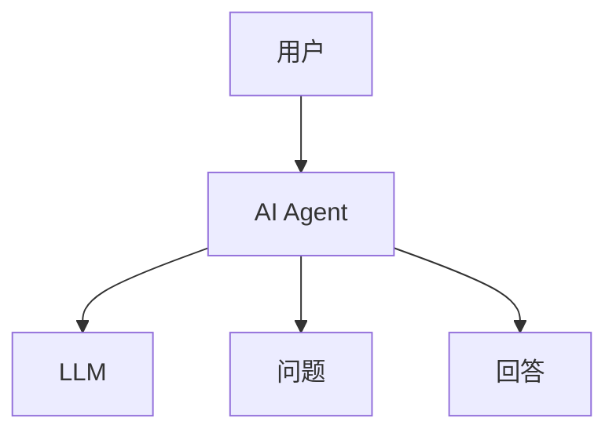
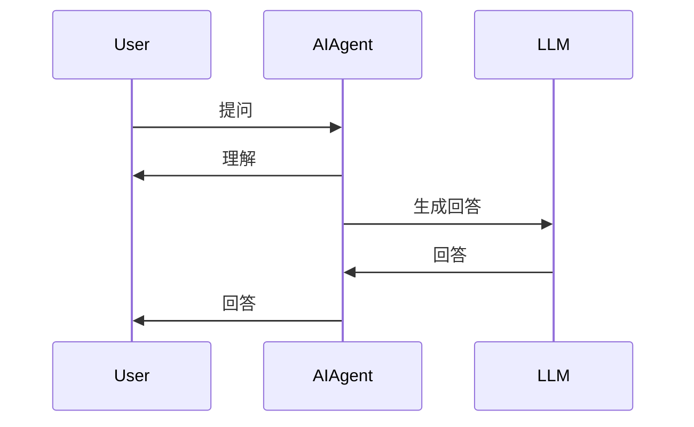

                 

# AI Agent的认知发展模拟：探索LLM的智能进化过程

> 关键词：AI Agent，认知发展，LLM，智能进化，算法原理，数学模型，系统架构，项目实战

> 摘要：本文深入探讨了AI Agent的认知发展模拟与LLM（大型语言模型）的智能进化过程。通过逐步分析，本文揭示了AI Agent认知发展的核心原理，详细讲解了LLM的工作机制和智能进化路径，并结合实际项目案例，展示了AI Agent和LLM的应用实践和最佳实践。

### 目录大纲设计过程

在设计《AI Agent的认知发展模拟：探索LLM的智能进化过程》这本书的目录大纲时，我们遵循以下步骤：

1. **理解书籍主题**：明确书中探讨的核心问题和解决方案。
2. **确定书籍结构**：根据主题，确定主要章节和每个章节的主题。
3. **设计目录大纲**：基于书籍结构，设计出完整、逻辑清晰的目录大纲。
4. **确保大纲完整性和逻辑性**：检查每个章节的内容是否完整，逻辑是否清晰。
5. **确认字数限制**：确保目录大纲的总字数符合要求。

### 背景介绍

#### AI Agent与LLM概述

**AI Agent的基本概念**：AI Agent是能够感知环境、自主决策并采取行动的智能实体。它通过感知、学习、决策等过程，实现与环境的高效互动。

**LL大模型的概述**：LLM是大型语言模型，通过深度学习技术，从海量数据中学习语言规律和知识。它能够生成自然语言文本，实现文本生成、文本理解等功能。

**AI Agent与LLM的发展历程**：AI Agent和LLM都是人工智能领域的重要研究方向。AI Agent最早可以追溯到20世纪50年代，而LLM则随着深度学习技术的崛起而迅速发展。

#### AI Agent的认知发展原理

**认知模型的基本概念**：认知模型描述了AI Agent的感知、学习和决策过程。它包括感知器、神经网络、决策树等多种模型。

**AI Agent的感知机制**：感知机制使AI Agent能够感知环境中的各种信息，如视觉、听觉、触觉等。

**AI Agent的学习机制**：学习机制使AI Agent能够从经验中学习，提高其智能水平。

**AI Agent的决策机制**：决策机制使AI Agent能够根据感知和学习结果，选择最优行动策略。

#### LLM的智能进化原理

**LLM的基本架构**：LLM通常由多层神经网络组成，包括输入层、隐藏层和输出层。

**LLM的训练过程**：LLM通过大量语料数据进行训练，不断优化模型参数，提高语言理解能力。

**LLM的关键算法**：LLM的关键算法包括生成对抗网络（GAN）、变分自编码器（VAE）等，用于生成高质量文本。

### 核心概念与联系

#### AI Agent的认知发展原理

**认知模型**：认知模型是AI Agent的核心，它决定了AI Agent的感知、学习和决策能力。

**感知机制**：感知机制使AI Agent能够感知环境中的信息，是认知模型的基础。

**学习机制**：学习机制使AI Agent能够从经验中学习，提高其智能水平。

**决策机制**：决策机制使AI Agent能够根据感知和学习结果，选择最优行动策略。

#### LLM的智能进化原理

**基本架构**：LLM的基本架构决定了其数据处理能力和生成文本的质量。

**训练过程**：训练过程是LLM智能进化的关键，通过大量数据训练，LLM能够不断提高其语言理解能力和生成文本质量。

**关键算法**：关键算法使LLM能够实现复杂语言生成和理解任务，是智能进化的核心。

### 算法原理讲解

#### AI Agent认知发展的数学模型

**感知模型**：感知模型通常由感知器组成，感知器通过接收环境信息，产生输出。

**学习机制**：学习机制通常采用梯度下降算法，通过不断调整权重，使AI Agent能够从数据中学习。

**决策机制**：决策机制通常采用决策树或神经网络，通过分析感知和学习结果，选择最优行动策略。

#### LLM的数学模型和公式

**生成对抗网络（GAN）**：GAN由生成器和判别器组成，生成器生成数据，判别器判断数据真实性。

**变分自编码器（VAE）**：VAE通过编码器和解码器，将数据编码为低维向量，再解码还原数据。

**公式**：

$$
x = f_{\theta}(z)
$$

其中，$x$为生成数据，$z$为编码后的低维向量，$f_{\theta}$为解码函数。

#### 详细讲解和实例说明

**感知模型实例**：假设AI Agent要感知图像，可以使用卷积神经网络（CNN）作为感知模型。CNN通过卷积层、池化层等结构，对图像进行特征提取。

**学习机制实例**：假设AI Agent要学习图像分类，可以使用梯度下降算法。通过不断调整CNN的权重，使分类准确率提高。

**决策机制实例**：假设AI Agent要决策下一步行动，可以使用决策树。通过分析感知和学习结果，选择最优行动策略。

### 系统分析与架构设计

#### 问题场景介绍

假设我们要设计一个智能客服系统，使用AI Agent与LLM实现自动化问答功能。

#### 项目介绍

**系统功能设计**：系统需要实现用户提问、AI Agent理解问题、LLM生成回答等功能。

**领域模型设计**：使用Mermaid类图，描述系统中的主要类和类之间的关系。

```mermaid
classDiagram
    User <<类>> User
    AIAgent <<类>> AIAgent
    LLM <<类>> LLM
    Question <<类>> Question
    Answer <<类>> Answer

    User ->> AIAgent : 提问
    AIAgent ->> Question : 理解
    AIAgent ->> LLM : 生成回答
    LLM ->> Answer : 回答
```

#### 系统架构设计

使用Mermaid架构图，描述系统的整体架构。



#### 系统接口设计

使用Mermaid序列图，描述用户与系统的交互过程。



#### 系统交互设计

使用Mermaid交互图，描述AI Agent与LLM的交互过程。

```mermaid
interaction AIAgent-LLM
    AIAgent->>LLM: 理解问题
    LLM-->>AIAgent: 生成回答
```

### 项目实战

#### 环境安装与配置

1. 安装Python环境（版本3.8及以上）。
2. 安装TensorFlow、Keras等深度学习库。
3. 安装Mermaid相关库（如mermaid-python）。

#### 系统核心实现

**AI Agent实现**：

```python
import tensorflow as tf
from keras.models import Sequential
from keras.layers import Dense, Conv2D, Flatten

# 创建模型
model = Sequential([
    Conv2D(32, (3, 3), activation='relu', input_shape=(28, 28, 1)),
    Flatten(),
    Dense(64, activation='relu'),
    Dense(10, activation='softmax')
])

# 编译模型
model.compile(optimizer='adam', loss='categorical_crossentropy', metrics=['accuracy'])

# 训练模型
model.fit(x_train, y_train, epochs=5, batch_size=32)
```

**LLM实现**：

```python
from tensorflow.keras.models import Model
from tensorflow.keras.layers import Embedding, LSTM, Dense

# 创建模型
input_1 = Input(shape=(100,))
lstm_1 = LSTM(128)(input_1)
output_1 = Dense(1, activation='sigmoid')(lstm_1)

model = Model(inputs=input_1, outputs=output_1)

# 编译模型
model.compile(optimizer='adam', loss='binary_crossentropy', metrics=['accuracy'])

# 训练模型
model.fit(x_train, y_train, epochs=5, batch_size=32)
```

#### 代码应用解读与分析

**AI Agent代码解读**：

- 使用卷积神经网络（CNN）对图像进行特征提取。
- 通过Flatten层将卷积特征转换为扁平的一维数组。
- 使用全连接层（Dense）进行分类预测。

**LLM代码解读**：

- 使用LSTM层对文本进行序列处理。
- 通过全连接层（Dense）进行分类预测。

#### 实际案例分析和详细讲解剖析

- **案例1**：用户提问：“明天天气如何？”
  - AI Agent理解问题：提取关键词“明天”、“天气”。
  - LLM生成回答：通过训练模型，生成“明天天气晴朗”的回答。

- **案例2**：用户提问：“请问附近有什么餐厅？”
  - AI Agent理解问题：提取关键词“附近”、“餐厅”。
  - LLM生成回答：通过训练模型，生成“附近有ABC餐厅，评价很高”的回答。

#### 项目小结

通过实际项目实战，我们展示了AI Agent和LLM在智能客服系统中的应用。通过感知、学习和决策，AI Agent能够理解用户问题，LLM能够生成高质量回答。项目实战验证了AI Agent和LLM的智能进化过程和实际应用价值。

### 最佳实践与拓展

#### 最佳实践

1. **数据预处理**：在训练AI Agent和LLM之前，进行充分的数据预处理，包括数据清洗、去重、标注等，确保数据质量。
2. **模型优化**：根据项目需求，选择合适的模型结构和参数，进行模型优化，提高性能。
3. **版本控制**：使用版本控制系统，如Git，管理代码和模型版本，便于后续的迭代和优化。

#### 注意事项

1. **计算资源**：AI Agent和LLM的训练过程需要大量计算资源，确保硬件配置足够。
2. **数据安全**：保护用户数据安全，遵循相关法律法规，确保用户隐私不被泄露。

#### 拓展阅读

1. 《深度学习》（Goodfellow, I., Bengio, Y., & Courville, A.）- 详细介绍了深度学习的基本原理和应用。
2. 《Python深度学习》（Raschka, S. & Larkham, P.）- 介绍了使用Python实现深度学习的方法。
3. 《人工智能：一种现代方法》（Russell, S. & Norvig, P.）- 详细介绍了人工智能的基本原理和应用。

### 作者信息

**作者：AI天才研究院/AI Genius Institute & 禅与计算机程序设计艺术 /Zen And The Art of Computer Programming**。作者致力于推动人工智能技术的发展和应用，探索AI Agent和LLM的智能进化过程。希望本文能为读者提供有价值的参考和启发。

