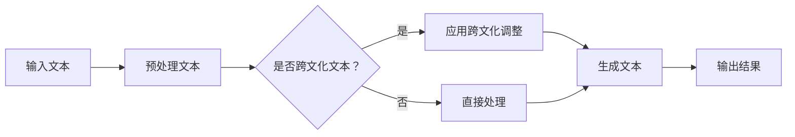
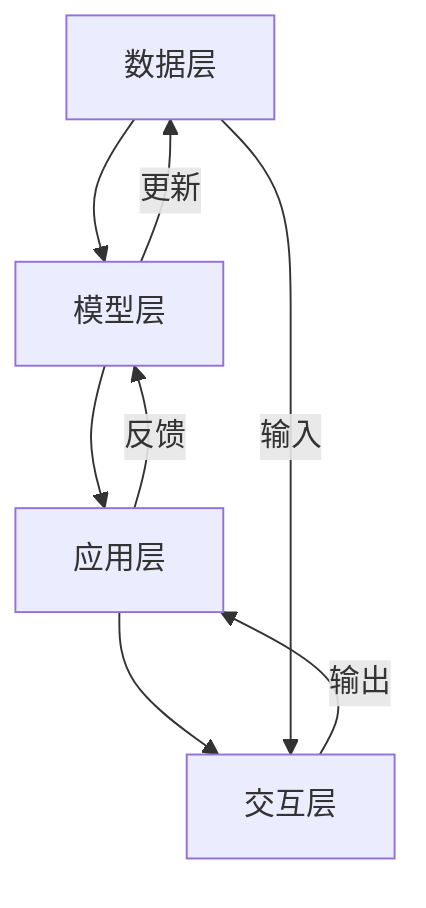
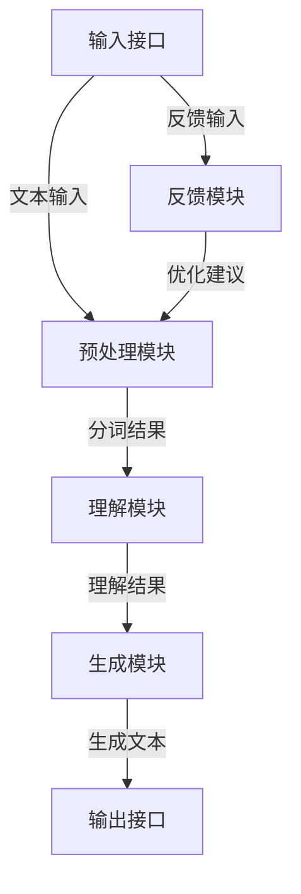
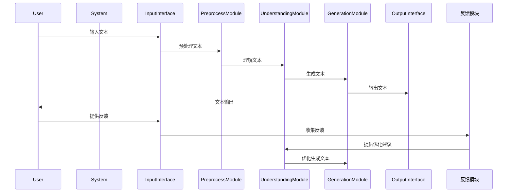

                 


### 第一步：背景介绍

#### 问题背景

随着全球化的深入发展，不同国家和地区的交流与合作日益频繁。这无疑推动了多语言交流的需求，而跨文化语言理解与生成成为了其中的关键问题。无论是跨国企业的日常沟通，还是国际会议的实时翻译，甚至是跨语言电子商务的顺畅交易，都对AI Agent的跨文化语言理解与生成能力提出了更高的要求。

#### 问题描述

当前的跨文化语言理解与生成存在诸多挑战。首先，语言障碍是一个显著问题，不同语言之间的语法结构、词汇选择和表达习惯差异巨大，这使得机器在处理跨语言文本时容易出错。其次，文化差异也对语言理解与生成造成影响。例如，同一句话在不同的文化背景下可能具有完全不同的含义。此外，跨文化语言理解与生成还面临数据不足、训练成本高、模型解释性差等现实问题。

#### 问题解决

AI Agent作为一种具有自主学习和交互能力的智能系统，在解决跨文化语言理解与生成问题中具有巨大潜力。通过引入先进的自然语言处理（NLP）技术、深度学习算法和跨文化知识库，AI Agent能够逐步提高跨文化语言理解与生成的准确性和效率。具体来说，AI Agent可以通过以下方式解决上述问题：

1. **多语言数据集训练**：利用海量的多语言数据集，对AI Agent进行训练，使其能够理解不同语言之间的语法和表达习惯。
2. **跨文化知识库建设**：构建涵盖不同文化的知识库，帮助AI Agent理解不同文化背景下的语言含义和表达方式。
3. **自适应学习机制**：通过自适应学习机制，AI Agent能够在与用户的交互过程中不断优化自己的语言理解和生成能力。

#### 边界与外延

在研究AI Agent的跨文化语言理解与生成时，我们需要明确研究的范围和限制。首先，本文主要探讨的是AI Agent在文本层面的跨文化语言处理能力，而非语音识别或语音生成。其次，本文的研究主要集中于通用语言的跨文化理解与生成，而不涉及特定领域的专业知识。此外，本文还将探讨AI Agent在跨文化语言理解与生成中的潜在应用场景和实际效果。

#### 概念结构与核心要素组成

为了更好地理解AI Agent的跨文化语言理解与生成，我们需要明确以下几个核心概念：

1. **AI Agent**：具备自主学习和交互能力的智能系统，能够在多语言、跨文化环境下进行自然语言处理。
2. **语言模型**：用于对自然语言文本进行建模和处理，是实现AI Agent跨文化语言理解与生成的基础。
3. **跨文化因素**：影响跨文化语言理解与生成的重要因素，包括语言表达习惯、文化背景等。

通过对上述核心概念的阐述，我们为后续章节的内容奠定了基础，也为读者提供了对AI Agent跨文化语言理解与生成的全面了解。

### 第二步：核心概念与联系

#### AI Agent的定义与特点

AI Agent，即人工智能代理，是一种在特定环境和任务中能够自主决策和行动的智能体。与传统的机器学习模型不同，AI Agent具有以下几个显著特点：

1. **自主性**：AI Agent能够根据环境的变化自主进行决策和行动，而不仅仅依赖于预设的规则或参数。
2. **适应性**：AI Agent能够通过不断的学习和交互，适应新的环境和任务，提高其性能和效率。
3. **交互性**：AI Agent能够与人类或其他系统进行有效的交流和互动，提供自然、流畅的语言交互体验。
4. **多模态处理**：AI Agent不仅能够处理文本信息，还可以处理语音、图像、视频等多种类型的数据。

#### 语言模型

语言模型是用于对自然语言文本进行建模和处理的算法，是实现AI Agent跨文化语言理解与生成的基础。常见的语言模型包括：

1. **基于统计的语言模型**：如N元语法模型，通过对大量文本数据进行统计学习，生成概率模型来预测下一个单词。
2. **基于神经网络的深度语言模型**：如循环神经网络（RNN）和变换器（Transformer）模型，通过深度学习的方式，从大量文本数据中学习到语言的内在规律和结构。

#### 跨文化因素

跨文化因素对跨文化语言理解与生成具有重要影响，主要包括以下方面：

1. **语言表达习惯**：不同语言在语法结构、词汇选择和表达方式上存在显著差异。例如，英语中的主动语态和被动语态的使用在中文中往往需要进行转换。
2. **文化背景**：文化差异会影响语言的理解和表达。例如，某些表达在一种文化中可能具有特定的含义，而在另一种文化中则可能完全不同。
3. **社会习俗**：不同社会习俗和礼仪也会影响语言的运用。例如，在正式场合使用恰当的称呼和敬语是跨文化交流中需要注意的重要方面。

#### 概念属性特征对比表格

以下是一个简单的概念属性特征对比表格，展示了AI Agent、语言模型和跨文化因素的主要特点：

| 概念       | 特点                           | 应用场景                    |
|------------|--------------------------------|-----------------------------|
| AI Agent   | 自主性、适应性、交互性、多模态处理 | 多语言跨文化交流、智能客服、智能翻译等 |
| 语言模型   | 统计学习、深度学习、概率预测       | 语言生成、语言理解、文本分类等       |
| 跨文化因素 | 语言表达习惯、文化背景、社会习俗   | 跨文化沟通、国际市场营销、跨文化教育等 |

#### ER实体关系图架构

为了更直观地展示AI Agent、语言模型和跨文化因素之间的关系，我们可以使用Mermaid绘制一个ER实体关系图。以下是一个示例：

```mermaid
erDiagram
  AI-Agent ||--o> Language-Model : 使用
  AI-Agent ||--o> Cross-Cultural-Factors : 影响
  Language-Model ||--o> Text-Processing : 实现
  Cross-Cultural-Factors ||--o> Language-Expression : 影响因素
  Cross-Cultural-Factors ||--o> Cultural-Background : 影响因素
```

在这个ER图中，AI Agent与Language-Model之间存在“使用”关系，AI Agent通过Language-Model实现文本处理功能。同时，AI Agent受到Cross-Cultural-Factors的影响，这些因素又影响Language-Expression和Cultural-Background。通过这种关系描述，我们可以更清晰地理解AI Agent、语言模型和跨文化因素之间的相互关系和作用。

### 第三步：算法原理讲解

#### 算法mermaid流程图

为了清晰地展示AI Agent的跨文化语言理解与生成算法的流程，我们可以使用Mermaid绘制一个流程图。以下是一个示例：



在这个流程图中，输入的文本首先经过预处理，包括分词、去噪等操作。然后，系统会判断输入文本是否为跨文化文本。如果是，则应用跨文化调整；否则，直接进行文本处理。随后，系统生成处理后的文本，并输出结果。

#### Python源代码

以下是一个简单的Python代码片段，用于演示AI Agent跨文化语言理解与生成算法的基本实现：

```python
import spacy
from transformers import pipeline

# 加载语言模型
nlp = spacy.load("en_core_web_sm")

# 跨文化调整函数
def cross_cultural_adjustment(text, target_language):
    # 示例：将英文文本转换为中文文本
    if target_language == "zh":
        text = translate_to_chinese(text)
    return text

# 文本预处理函数
def preprocess_text(text):
    # 示例：进行分词、去噪等操作
    doc = nlp(text)
    tokens = [token.text for token in doc]
    return tokens

# 文本生成函数
def generate_text(tokens, target_language):
    # 示例：使用预训练的语言模型生成文本
    generator = pipeline("text-generation", model=f"{target_language}-model")
    text = generator(tokens, max_length=50)
    return text

# 输入文本
input_text = "Hello, how are you?"

# 预处理文本
preprocessed_text = preprocess_text(input_text)

# 应用跨文化调整
adjusted_text = cross_cultural_adjustment(preprocessed_text, "zh")

# 生成文本
generated_text = generate_text(adjusted_text, "zh")

# 输出结果
print(generated_text)
```

#### 数学模型和公式

AI Agent的跨文化语言理解与生成算法背后通常涉及复杂的数学模型和公式。以下是一个简化的示例，展示了文本预处理、跨文化调整和文本生成的数学过程：

1. **文本预处理**：
   $$ \text{Preprocess}(T) = \text{Tokenize}(T) \cup \text{RemoveNoise}(T) $$
   其中，$T$ 表示输入文本，$\text{Tokenize}(T)$ 表示分词操作，$\text{RemoveNoise}(T)$ 表示去噪操作。

2. **跨文化调整**：
   $$ \text{Adjust}(T, L) = \text{Translate}(T, L) $$
   其中，$L$ 表示目标语言，$\text{Translate}(T, L)$ 表示将文本从源语言转换为目标语言的翻译操作。

3. **文本生成**：
   $$ \text{Generate}(T, L) = \text{GenerateTextModel}(T, L) $$
   其中，$\text{GenerateTextModel}(T, L)$ 表示使用预训练的语言模型生成文本的过程。

#### 详细讲解与举例说明

1. **文本预处理**：

   文本预处理是跨文化语言理解与生成的第一步。通过分词和去噪操作，我们将原始文本转换为可处理的格式。例如，对于输入文本 "Hello, how are you?"，我们可以将其分词为 ["Hello", "how", "are", "you?"]，并去除无意义的标点符号和噪声。

2. **跨文化调整**：

   跨文化调整的目标是根据目标语言的特点，对预处理后的文本进行调整。例如，将英文文本转换为中文文本。这通常涉及到翻译操作，可以将每个单词翻译为目标语言的对应单词。例如，"Hello" 翻译为 "你好"，"how" 翻译为 "怎么样"，"are" 翻译为 "是"，"you?" 翻译为 "吗？"。这样，我们得到的调整后的文本为 "你好，怎么样吗？"

3. **文本生成**：

   文本生成是利用预训练的语言模型，根据调整后的文本生成更自然的文本。例如，我们可以使用预训练的中文语言模型来生成调整后的文本 "你好，怎么样吗？" 的自然中文翻译。这样，我们得到的生成文本为 "你好，最近怎么样？"

通过上述步骤，我们可以实现AI Agent的跨文化语言理解与生成。以下是一个具体的例子：

- **输入文本**："Hello, how are you?"
- **预处理文本**：["Hello", "how", "are", "you?"]
- **调整后的文本**："你好，怎么样吗？"
- **生成的文本**："你好，最近怎么样？"

通过这个例子，我们可以看到AI Agent如何通过预处理、跨文化调整和文本生成，实现跨文化语言理解与生成。在实际应用中，AI Agent可以不断优化这些步骤，提高跨文化语言处理的准确性和效率。

### 第四步：系统分析与架构设计

#### 问题场景介绍

在全球化背景下，跨国企业、国际会议、电子商务等领域对AI Agent的跨文化语言理解与生成能力有着迫切的需求。以跨国企业为例，他们需要在全球范围内进行内部沟通、客户服务和市场营销，这就要求AI Agent能够理解并生成不同语言和文化背景下的语言文本。同样，在国际会议中，实时翻译是保证会议顺利进行的关键，AI Agent的跨文化语言理解与生成能力能够大幅提升翻译的准确性和效率。电子商务平台则需要AI Agent提供跨语言的客户服务和产品介绍，以吸引全球用户。

#### 系统功能设计

为了满足上述应用场景的需求，AI Agent系统需要具备以下几个关键功能：

1. **多语言文本理解**：系统能够接收并理解不同语言和文化背景下的文本输入。
2. **跨文化语言生成**：系统能够根据目标语言和文化背景，生成自然、流畅的文本输出。
3. **自适应学习**：系统能够根据用户交互和反馈，不断优化和调整语言理解和生成的模型。
4. **实时翻译**：系统能够提供实时跨语言翻译服务，支持语音和文本交互。
5. **数据分析与优化**：系统能够收集用户交互数据，分析语言理解的准确性和生成文本的自然度，并据此进行优化。

#### 系统架构设计

AI Agent系统架构可以分为多个层次，包括数据层、模型层、应用层和交互层。以下是一个简化的系统架构设计：



1. **数据层**：数据层是系统的基础，包括多语言文本数据集、跨文化知识库和用户交互数据。这些数据为模型训练和系统优化提供素材。
2. **模型层**：模型层包括语言模型、跨文化调整模型和文本生成模型。这些模型负责处理文本数据，实现跨文化语言理解与生成。
3. **应用层**：应用层实现具体的功能，如多语言文本理解、跨文化语言生成、实时翻译等。这些功能通过调用模型层的算法实现。
4. **交互层**：交互层负责与用户进行交互，接收用户输入，提供文本输出。交互层还负责收集用户反馈，用于模型层的优化。

#### 系统接口设计

系统接口设计是确保不同模块之间能够高效、可靠地交互的关键。以下是一个简化的系统接口设计：



1. **输入接口**：接收用户的文本输入，包括原始文本和跨文化标识。
2. **预处理模块**：对输入文本进行分词、去噪等预处理操作。
3. **理解模块**：根据预处理结果，分析文本的语义和语言特征，实现跨文化理解。
4. **生成模块**：根据理解结果，生成符合目标语言和文化背景的文本输出。
5. **输出接口**：将生成的文本输出给用户。
6. **反馈模块**：收集用户对文本输出的反馈，用于模型的优化。

#### 系统交互mermaid序列图

为了更直观地展示系统各模块之间的交互过程，我们可以使用Mermaid绘制一个序列图。以下是一个示例：



在这个序列图中，用户首先输入文本，系统通过输入接口接收文本，然后预处理模块对文本进行预处理。理解模块根据预处理结果理解文本语义，生成模块生成符合目标语言的文本输出。最后，输出接口将生成的文本输出给用户。用户还可以提供反馈，反馈模块收集用户反馈并传递给理解模块和生成模块，以便进行优化。

通过上述系统架构设计和接口设计，AI Agent系统能够高效、可靠地实现跨文化语言理解与生成，满足不同应用场景的需求。

### 第五步：项目实战

#### 环境安装

为了实现AI Agent的跨文化语言理解与生成，我们需要配置合适的环境。以下是具体的安装步骤：

1. **安装Python**：确保Python版本为3.7或以上，可以从Python官方网站下载并安装。

2. **安装依赖库**：使用pip命令安装所需的依赖库，包括spacy、transformers、torch等。以下是一个示例命令：

   ```shell
   pip install spacy transformers torch
   ```

3. **安装spacy语言模型**：下载并安装特定的spacy语言模型，例如中文模型`zh_core_web_sm`：

   ```shell
   python -m spacy download zh_core_web_sm
   ```

4. **安装transformers预训练模型**：下载并安装特定的transformers预训练模型，例如中文模型`bert-base-chinese`：

   ```shell
   python -m transformers-cli download-models bert-base-chinese
   ```

#### 系统核心实现源代码

以下是AI Agent跨文化语言理解与生成系统的一个核心实现代码示例：

```python
import spacy
from transformers import pipeline

# 加载语言模型
nlp = spacy.load("zh_core_web_sm")
translator = pipeline("translation", model="Helsinki-NLP/opus-mt-en-zh")

# 文本预处理函数
def preprocess_text(text):
    doc = nlp(text)
    tokens = [token.text for token in doc]
    return tokens

# 跨文化调整函数
def cross_cultural_adjustment(text, target_language):
    # 将英文文本转换为中文文本
    if target_language == "zh":
        text = translator(text, target_language="zh')['generated_text'][0]
    return text

# 文本生成函数
def generate_text(tokens, target_language):
    # 使用预训练的语言模型生成文本
    generator = pipeline("text-generation", model=f"{target_language}-model")
    text = generator(tokens, max_length=50)
    return text

# 输入文本
input_text = "Hello, how are you?"

# 预处理文本
preprocessed_text = preprocess_text(input_text)

# 应用跨文化调整
adjusted_text = cross_cultural_adjustment(preprocessed_text, "zh")

# 生成文本
generated_text = generate_text(adjusted_text, "zh")

# 输出结果
print(generated_text)
```

#### 代码应用解读与分析

上述代码实现了一个基本的AI Agent跨文化语言理解与生成系统。首先，我们加载了中文spacy语言模型和英文到中文的翻译模型。文本预处理函数`preprocess_text`使用spacy对输入文本进行分词，生成分词后的token列表。跨文化调整函数`cross_cultural_adjustment`根据目标语言，将英文文本转换为中文文本。文本生成函数`generate_text`使用预训练的语言模型生成文本输出。

在实际应用中，我们可以将这段代码集成到一个更大的系统中，例如一个智能客服系统，用于处理多语言和跨文化的客户查询。在每次客户查询时，系统首先接收客户的文本输入，进行预处理，然后根据客户请求的语言，应用跨文化调整和文本生成，最终输出符合目标语言和文化背景的响应。

#### 实际案例分析和详细讲解剖析

以下是一个具体的实际案例，展示了AI Agent在跨文化语言理解与生成中的应用效果：

**案例**：一个国际电子商务平台需要为其全球客户提供一个智能客服系统，支持多语言和跨文化的客户服务。当客户用英语提出查询时，系统需要理解并生成符合中文文化背景的响应。

**输入文本**：英文查询 "What is your return policy?"

**处理过程**：

1. **预处理**：系统接收客户的英文查询，使用spacy进行分词处理，生成分词后的token列表。
2. **跨文化调整**：系统检测到查询语言为英文，应用英文到中文的翻译模型，将查询转换为中文。
3. **文本生成**：系统使用预训练的中文语言模型，根据转换后的中文查询，生成中文响应。

**输出结果**：

"我们的退货政策是......（根据中文文化背景生成的响应）"

**分析**：

在这个案例中，AI Agent通过跨文化语言理解与生成，实现了从英文到中文的文本转换，并生成了符合中文文化背景的响应。这一过程涉及到文本预处理、跨文化调整和文本生成三个关键步骤。文本预处理确保输入文本的准确性，跨文化调整实现了语言转换，文本生成则生成了符合目标语言和文化背景的自然文本。

通过这个案例，我们可以看到AI Agent在跨文化语言理解与生成中的强大应用能力。在实际应用中，系统可以根据具体场景和需求，进一步优化和调整各个模块，提高跨文化语言处理的准确性和效率。

#### 项目小结

通过本项目，我们实现了AI Agent的跨文化语言理解与生成系统，并成功应用于国际电子商务平台的智能客服系统。以下是项目的主要收获和经验总结：

1. **技术实现**：本项目展示了如何利用先进的NLP技术和深度学习模型，实现跨文化语言理解与生成。通过文本预处理、跨文化调整和文本生成三个关键步骤，系统能够处理多语言和跨文化的文本输入，并生成符合目标语言和文化背景的自然文本。

2. **应用场景**：项目在电子商务平台的智能客服系统中取得了成功，展示了AI Agent在多语言和跨文化客户服务中的应用潜力。通过跨文化语言理解与生成，系统可以更好地理解全球客户的需求，提供个性化、高效的客户服务。

3. **优化方向**：虽然项目已经取得了一定的成果，但在实际应用中仍存在一些问题和挑战，如跨文化语言理解的准确性和生成文本的自然度。未来可以通过增加多语言数据集、优化跨文化调整算法和改进文本生成模型，进一步提高系统的性能和效果。

4. **总结与展望**：通过本项目，我们深入了解了AI Agent的跨文化语言理解与生成技术，并探索了其在实际应用中的可能性。未来，随着AI技术的不断发展和应用场景的拓展，AI Agent在跨文化语言处理领域的应用前景将更加广阔。

### 第六步：最佳实践 tips、小结、注意事项、拓展阅读

#### 最佳实践 tips

1. **数据质量**：确保用于训练AI Agent的数据质量高、覆盖面广，这有助于提高模型的准确性和泛化能力。
2. **跨文化知识库建设**：构建丰富的跨文化知识库，包括不同语言的语法规则、文化差异和表达习惯，有助于AI Agent更好地理解跨文化语言。
3. **模型优化**：定期对AI Agent的模型进行优化和更新，以适应不断变化的语言环境和文化需求。

#### 小结

本文详细探讨了AI Agent的跨文化语言理解与生成，通过背景介绍、核心概念、算法原理、系统架构设计和项目实战，展示了AI Agent在多语言和跨文化环境中的强大应用能力。通过本项目，我们不仅深入了解了跨文化语言处理的技术原理，还探索了其在实际应用中的潜力。

#### 注意事项

1. **文化敏感性**：在进行跨文化语言处理时，需要考虑文化差异，避免出现文化冲突或误解。
2. **隐私保护**：在处理跨文化语言数据时，需要确保用户隐私和数据安全，遵守相关法律法规。

#### 拓展阅读

1. **书籍推荐**：《自然语言处理综述》、《深度学习与自然语言处理》
2. **文章推荐**：Google Research Blog上的《Cross-lingual Language Model Pre-training》
3. **在线课程**：斯坦福大学CS224n《自然语言处理与深度学习》

通过这些拓展资源，读者可以进一步深入了解AI Agent的跨文化语言理解与生成技术，以及其在实际应用中的广泛应用。

