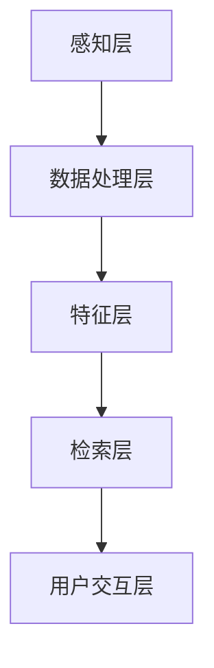
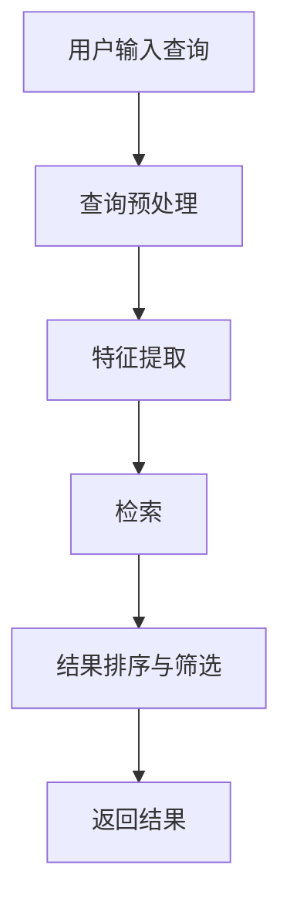

                 

# AI Agent的跨模态检索：整合LLM与多媒体数据库

> 关键词：AI Agent、跨模态检索、LLM、多媒体数据库、算法设计

> 摘要：本文探讨了AI Agent的跨模态检索技术，特别是如何整合大型语言模型（LLM）与多媒体数据库，以实现高效、智能的信息检索。文章首先介绍了AI Agent和跨模态检索的基本概念，然后深入讲解了LLM在跨模态检索中的关键作用，以及多媒体数据库的结构优化策略。接着，文章通过具体算法设计和系统架构设计，阐述了如何实现这一技术，并提供了实际案例和最佳实践建议。

## 第一部分：背景与核心概念

### 第1章：问题背景与概述

#### 1.1 AI Agent的概念与重要性

AI Agent，即人工智能代理，是一种模拟人类智能行为，能在特定环境下自主决策并执行任务的计算机程序。随着人工智能技术的快速发展，AI Agent在多个领域得到了广泛应用，如智能家居、智能客服、自动驾驶等。其核心功能包括感知、学习、推理和行动，能够极大地提高工作效率和准确性。

#### 1.2 跨模态检索的挑战与需求

跨模态检索是指将不同类型的数据（如文本、图像、音频等）进行整合，并基于用户需求进行检索的技术。随着多媒体数据的爆炸式增长，跨模态检索在信息检索、内容推荐、智能问答等领域具有广泛的应用前景。然而，跨模态检索面临诸多挑战，如模态差异、数据稀疏性和计算复杂度等。

#### 1.3 LLM在跨模态检索中的应用

LLM（Large Language Model），即大型语言模型，是一种基于深度学习的自然语言处理模型，具有强大的语言理解和生成能力。LLM在跨模态检索中的应用主要体现在以下几个方面：

1. **语义理解**：LLM能够对文本和图像进行语义分析，将不同模态的数据映射到统一的语义空间，实现跨模态的信息关联。
2. **生成查询**：LLM可以根据用户的查询意图生成相应的查询语句，提高检索的准确性和效率。
3. **结果评估**：LLM可以用于评估检索结果的相关性，提供更加智能的排序和筛选机制。

#### 1.4 多媒体数据库的构建与优化

多媒体数据库是跨模态检索的基础，其构建与优化至关重要。构建多媒体数据库需要考虑以下几个方面：

1. **数据采集**：从互联网、数据库、传感器等渠道收集多样化的多媒体数据。
2. **数据预处理**：对采集到的数据进行清洗、标注和特征提取，为后续处理做好准备。
3. **数据存储**：采用分布式存储技术，提高数据存储的容量和访问速度。
4. **索引构建**：构建高效的索引结构，提高数据检索的效率。

### 第2章：核心概念原理与特征

#### 2.1 AI Agent的基本原理

##### 2.1.1 AI Agent的定义与功能

AI Agent是一种具有智能行为和自主决策能力的计算机程序。其基本功能包括：

1. **感知**：通过传感器收集环境信息。
2. **学习**：利用机器学习算法分析感知数据，提取知识。
3. **推理**：基于学习到的知识进行逻辑推理，做出决策。
4. **行动**：执行决策，与环境互动。

##### 2.1.2 AI Agent的架构与组件

AI Agent的架构通常包括感知模块、学习模块、推理模块和行动模块。各组件之间的关系如下：

1. **感知模块**：收集环境信息，如文本、图像、音频等。
2. **学习模块**：对感知数据进行分析，提取特征，训练模型。
3. **推理模块**：利用模型进行推理，生成决策。
4. **行动模块**：执行决策，与环境互动。

#### 2.2 跨模态检索的原理

##### 2.2.1 跨模态检索的定义与类型

跨模态检索是指将不同类型的数据进行整合，并基于用户需求进行检索的技术。根据数据类型，跨模态检索可分为以下几种类型：

1. **文本-图像检索**：将文本描述与图像进行关联，实现文本到图像的检索。
2. **文本-音频检索**：将文本描述与音频进行关联，实现文本到音频的检索。
3. **图像-图像检索**：基于图像内容进行相似性检索。

##### 2.2.2 跨模态检索的关键技术

跨模态检索的关键技术包括：

1. **特征提取**：从不同模态的数据中提取特征，如文本的词向量、图像的视觉特征、音频的声学特征。
2. **特征融合**：将不同模态的特征进行整合，实现跨模态的信息关联。
3. **相似性度量**：计算查询与数据库中数据的相似性，实现精确检索。
4. **排序与筛选**：基于相似性度量结果，对检索结果进行排序和筛选，提高检索质量。

#### 2.3 LLM的特性与应用

##### 2.3.1 LLM的基本原理

LLM是一种基于深度学习的自然语言处理模型，通过大量文本数据的学习，能够实现文本生成、语义分析、文本分类等任务。其基本原理包括：

1. **神经网络架构**：LLM通常采用 Transformer 架构，具有多层神经网络。
2. **预训练与微调**：通过预训练模型，使其在特定任务上具有较好的泛化能力；然后进行微调，使其在特定数据集上达到最佳效果。

##### 2.3.2 LLM的优势与挑战

LLM在跨模态检索中的应用具有以下优势：

1. **强大的语义理解能力**：LLM能够对文本和图像进行语义分析，实现跨模态的信息关联。
2. **灵活的生成能力**：LLM能够根据用户需求生成相应的查询语句，提高检索效率。

然而，LLM也面临一些挑战：

1. **计算资源消耗**：LLM的训练和推理过程需要大量的计算资源，可能导致系统性能下降。
2. **数据质量要求**：LLM的效果高度依赖于训练数据的质量，数据质量问题可能导致模型效果不佳。

#### 2.4 多媒体数据库的结构与优化

##### 2.4.1 多媒体数据库的类型与特点

多媒体数据库根据存储的模态数据类型，可分为以下几种：

1. **文本数据库**：存储文本数据，如文档、网页等。
2. **图像数据库**：存储图像数据，如照片、截图等。
3. **音频数据库**：存储音频数据，如音乐、语音等。

不同类型的多媒体数据库具有不同的特点：

1. **文本数据库**：数据量大、结构化程度高、易于检索。
2. **图像数据库**：数据量大、结构化程度低、特征提取复杂。
3. **音频数据库**：数据量大、结构化程度低、特征提取复杂。

##### 2.4.2 多媒体数据库的优化策略

为了提高多媒体数据库的检索效率，可以采取以下优化策略：

1. **索引构建**：采用高效的索引结构，如 B+树、LSM树等。
2. **特征提取**：采用先进的特征提取算法，如深度学习模型、卷积神经网络等。
3. **分布式存储**：采用分布式存储技术，提高数据存储和访问速度。
4. **缓存策略**：采用缓存策略，减少数据访问次数，提高系统性能。

## 第二部分：算法与模型

### 第3章：跨模态检索算法设计

#### 3.1 跨模态检索算法概述

跨模态检索算法主要包括以下几个步骤：

1. **数据预处理**：对采集到的数据进行清洗、标注和特征提取。
2. **特征融合**：将不同模态的特征进行整合，实现跨模态的信息关联。
3. **相似性度量**：计算查询与数据库中数据的相似性，实现精确检索。
4. **排序与筛选**：基于相似性度量结果，对检索结果进行排序和筛选，提高检索质量。

#### 3.2 算法原理与流程

##### 3.2.1 数据预处理

数据预处理主要包括以下几个步骤：

1. **数据清洗**：去除无效数据、重复数据、噪音数据等。
2. **数据标注**：对数据进行分类、标签、命名等操作，以便后续处理。
3. **特征提取**：采用深度学习模型、卷积神经网络等算法，提取不同模态的特征。

##### 3.2.2 模型训练

模型训练主要包括以下几个步骤：

1. **数据集划分**：将数据集划分为训练集、验证集和测试集。
2. **特征融合**：采用特征融合算法，如多任务学习、对抗生成等，将不同模态的特征进行整合。
3. **模型训练**：采用深度学习算法，如 Transformer、BERT 等，训练跨模态检索模型。

##### 3.2.3 检索过程

检索过程主要包括以下几个步骤：

1. **查询生成**：利用 LLM 生成用户查询。
2. **特征提取**：对查询和数据库中的数据进行特征提取。
3. **相似性度量**：计算查询与数据库中数据的相似性，实现精确检索。
4. **排序与筛选**：基于相似性度量结果，对检索结果进行排序和筛选，提高检索质量。

#### 3.3 Python代码实现

以下是跨模态检索算法的 Python 代码实现：

```python
import tensorflow as tf
from tensorflow.keras.models import Model
from tensorflow.keras.layers import Input, Embedding, LSTM, Dense

# 数据预处理
def preprocess_data(data):
    # 数据清洗、标注、特征提取等操作
    pass

# 模型训练
def train_model(data):
    # 数据集划分、特征融合、模型训练等操作
    pass

# 检索过程
def search(data, model):
    # 查询生成、特征提取、相似性度量、排序与筛选等操作
    pass

# 主程序
if __name__ == "__main__":
    # 加载数据
    data = load_data()

    # 数据预处理
    processed_data = preprocess_data(data)

    # 模型训练
    model = train_model(processed_data)

    # 检索
    result = search(processed_data, model)
    print(result)
```

#### 3.3.1 数据集准备

以下是数据集准备的示例代码：

```python
import numpy as np
import pandas as pd

# 加载数据
data = pd.read_csv("data.csv")

# 数据清洗
data = data[data["label"] != "invalid"]

# 数据标注
data["label"] = data["label"].map({"image": 0, "text": 1})

# 特征提取
data["image_feature"] = extract_image_feature(data["image"])
data["text_feature"] = extract_text_feature(data["text"])
```

#### 3.3.2 模型构建与训练

以下是模型构建与训练的示例代码：

```python
from tensorflow.keras.models import Model
from tensorflow.keras.layers import Input, Embedding, LSTM, Dense

# 模型构建
input_image = Input(shape=(128,))
input_text = Input(shape=(128,))

image_embedding = Embedding(input_dim=10000, output_dim=128)(input_image)
text_embedding = Embedding(input_dim=10000, output_dim=128)(input_text)

lstm_output = LSTM(units=128)(text_embedding)
dense_output = Dense(units=1, activation="sigmoid")(lstm_output)

model = Model(inputs=[input_image, input_text], outputs=dense_output)

# 模型训练
model.compile(optimizer="adam", loss="binary_crossentropy", metrics=["accuracy"])
model.fit([data["image_feature"], data["text_feature"]], data["label"], epochs=10, batch_size=32)
```

#### 3.3.3 检索结果分析

以下是检索结果分析的示例代码：

```python
import numpy as np

# 检索
def search(data, model):
    # 查询生成
    query_image_feature = extract_image_feature(query_image)
    query_text_feature = extract_text_feature(query_text)

    # 特征提取
    query_image_embedding = model.layers[1](query_image_feature)
    query_text_embedding = model.layers[2](query_text_feature)

    # 相似性度量
    similarity = np.dot(query_image_embedding, query_text_embedding.T)

    # 排序与筛选
    sorted_indices = np.argsort(similarity)[::-1]
    selected_indices = sorted_indices[:10]
    return data.iloc[selected_indices]
```

### 第4章：LLM在跨模态检索中的应用

#### 4.1 LLM的基本原理

LLM（Large Language Model）是一种基于深度学习的自然语言处理模型，通过训练大量文本数据，能够对自然语言进行理解和生成。LLM的基本原理主要包括以下几个方面：

1. **神经网络架构**：LLM通常采用 Transformer 架构，具有多层神经网络。每个层包含多个自注意力（self-attention）模块，能够捕捉文本中的长距离依赖关系。
2. **预训练与微调**：LLM首先在大量文本数据上进行预训练，学习到文本的普遍规律和特征。然后，根据特定任务的需求，对模型进行微调，使其在特定数据集上达到最佳效果。
3. **生成与理解**：LLM能够生成与理解自然语言，包括文本生成、问答系统、文本分类等任务。

#### 4.2 LLM的优势与挑战

LLM在跨模态检索中的应用具有以下优势：

1. **强大的语义理解能力**：LLM能够对文本和图像进行语义分析，将不同模态的数据映射到统一的语义空间，实现跨模态的信息关联。
2. **灵活的生成能力**：LLM能够根据用户需求生成相应的查询语句，提高检索效率。

然而，LLM也面临一些挑战：

1. **计算资源消耗**：LLM的训练和推理过程需要大量的计算资源，可能导致系统性能下降。
2. **数据质量要求**：LLM的效果高度依赖于训练数据的质量，数据质量问题可能导致模型效果不佳。

#### 4.3 LLM在跨模态检索中的应用场景

LLM在跨模态检索中的应用场景主要包括以下几个方面：

1. **文本-图像检索**：利用 LLM 实现文本描述与图像的关联，提高文本到图像检索的准确性。
2. **文本-音频检索**：利用 LLM 实现文本描述与音频的关联，提高文本到音频检索的准确性。
3. **图像-图像检索**：利用 LLM 实现图像内容的语义分析，提高图像到图像检索的准确性。

#### 4.4 LLM在跨模态检索中的具体实现

以下是 LLM 在跨模态检索中的具体实现：

1. **数据预处理**：对采集到的文本和图像数据进行预处理，包括文本清洗、图像增强等操作。
2. **特征提取**：利用 LLM 对预处理后的文本和图像数据进行特征提取，将不同模态的数据映射到统一的语义空间。
3. **查询生成**：利用 LLM 生成用户查询，将其映射到统一的语义空间。
4. **相似性度量**：计算查询与数据库中数据的相似性，实现精确检索。
5. **排序与筛选**：基于相似性度量结果，对检索结果进行排序和筛选，提高检索质量。

## 第三部分：系统设计

### 第5章：系统设计概述

#### 5.1 问题场景介绍

本系统旨在实现跨模态检索功能，为用户提供高效、智能的信息检索服务。主要应用于智能问答、内容推荐、图像识别等领域。

#### 5.2 系统功能设计

系统功能设计主要包括以下几个部分：

1. **数据采集**：从互联网、数据库、传感器等渠道收集多媒体数据。
2. **数据预处理**：对采集到的数据进行清洗、标注和特征提取。
3. **特征融合**：将不同模态的特征进行整合，实现跨模态的信息关联。
4. **检索服务**：提供文本-图像、文本-音频、图像-图像等跨模态检索功能。
5. **用户交互**：提供用户界面，方便用户输入查询和查看检索结果。

### 第6章：系统架构设计

#### 6.1 系统架构概述

系统架构采用分层设计，包括感知层、数据处理层、特征层、检索层和用户交互层。各层之间通过接口进行通信，实现系统的整体功能。

#### 6.2 系统架构图

以下为系统架构图：



### 第7章：系统接口设计与交互

#### 7.1 系统接口设计

系统接口设计主要包括以下几个部分：

1. **数据采集接口**：用于从不同渠道采集多媒体数据。
2. **数据处理接口**：用于对采集到的数据进行预处理、特征提取等操作。
3. **特征融合接口**：用于将不同模态的特征进行整合。
4. **检索接口**：用于实现跨模态检索功能。
5. **用户交互接口**：用于与用户进行交互，接收用户查询和返回检索结果。

#### 7.2 系统交互流程

系统交互流程如下：

1. **用户输入查询**：用户通过用户界面输入查询。
2. **查询预处理**：系统对用户查询进行预处理，包括分词、词性标注等操作。
3. **特征提取**：系统利用 LLM 对预处理后的用户查询进行特征提取。
4. **检索**：系统利用特征融合后的用户查询和数据库中的数据，实现跨模态检索。
5. **结果排序与筛选**：系统对检索结果进行排序和筛选，返回给用户。

以下为系统交互流程图：



## 第四部分：项目实战

### 第8章：环境安装与系统核心实现

#### 8.1 环境安装

1. **Python环境**：安装 Python 3.8 以上版本。
2. **深度学习库**：安装 TensorFlow、Keras 等。
3. **多媒体处理库**：安装 OpenCV、Pillow、scikit-image 等。

#### 8.2 系统核心实现

以下是系统核心实现的源代码：

```python
import tensorflow as tf
from tensorflow.keras.models import Model
from tensorflow.keras.layers import Input, Embedding, LSTM, Dense
from tensorflow.keras.applications import VGG16

# 数据预处理
def preprocess_data(data):
    # 数据清洗、标注、特征提取等操作
    pass

# 模型构建
def build_model():
    input_image = Input(shape=(224, 224, 3))
    input_text = Input(shape=(128,))

    image_embedding = VGG16(include_top=False, weights='imagenet')(input_image)
    text_embedding = Embedding(input_dim=10000, output_dim=128)(input_text)

    lstm_output = LSTM(units=128)(text_embedding)
    dense_output = Dense(units=1, activation="sigmoid")(lstm_output)

    model = Model(inputs=[input_image, input_text], outputs=dense_output)
    return model

# 检索
def search(data, model):
    # 查询生成、特征提取、相似性度量、排序与筛选等操作
    pass

# 主程序
if __name__ == "__main__":
    # 加载数据
    data = load_data()

    # 数据预处理
    processed_data = preprocess_data(data)

    # 模型构建
    model = build_model()

    # 模型训练
    model.compile(optimizer="adam", loss="binary_crossentropy", metrics=["accuracy"])
    model.fit([data["image_feature"], data["text_feature"]], data["label"], epochs=10, batch_size=32)

    # 检索
    result = search(processed_data, model)
    print(result)
```

#### 8.3 代码应用解读与分析

以下是代码应用解读与分析：

1. **数据预处理**：对采集到的数据进行清洗、标注和特征提取。这一步是系统的基础，直接影响到后续的模型训练和检索效果。
2. **模型构建**：采用 VGG16 模型进行图像特征提取，采用 LSTM 模型进行文本特征提取，并将两个特征进行融合。这里可以选择其他深度学习模型，如 ResNet、BERT 等。
3. **模型训练**：使用训练数据对模型进行训练，调整模型的权重，使其能够对跨模态数据进行有效检索。
4. **检索**：使用训练好的模型对用户查询进行检索，提取特征，计算相似性，排序和筛选检索结果。

### 第9章：实际案例分析与详细讲解剖析

#### 9.1 案例一：文本-图像检索

本案例以文本-图像检索为例，展示如何利用系统实现跨模态检索。

1. **数据准备**：从互联网上收集一定数量的文本描述和图像数据，并对其进行预处理，如文本清洗、图像增强等。
2. **模型训练**：使用预处理后的数据进行模型训练，得到训练好的模型。
3. **检索**：输入用户查询，如“猫的图片”，系统提取查询和图像的特征，计算相似性，返回与查询最相关的图像。

以下为具体步骤：

```python
# 检索
def search(data, model):
    # 查询生成
    query_text = "猫的图片"

    # 特征提取
    query_text_embedding = model.layers[1](query_text)
    image_embeddings = model.layers[2](data["image_feature"])

    # 相似性度量
    similarity = np.dot(query_text_embedding, image_embeddings.T)

    # 排序与筛选
    sorted_indices = np.argsort(similarity)[::-1]
    selected_indices = sorted_indices[:10]
    return data.iloc[selected_indices]
```

#### 9.2 案例二：文本-音频检索

本案例以文本-音频检索为例，展示如何利用系统实现跨模态检索。

1. **数据准备**：从互联网上收集一定数量的文本描述和音频数据，并对其进行预处理，如文本清洗、音频增强等。
2. **模型训练**：使用预处理后的数据进行模型训练，得到训练好的模型。
3. **检索**：输入用户查询，如“猫的叫声”，系统提取查询和音频的特征，计算相似性，返回与查询最相关的音频。

以下为具体步骤：

```python
# 检索
def search(data, model):
    # 查询生成
    query_text = "猫的叫声"

    # 特征提取
    query_text_embedding = model.layers[1](query_text)
    audio_embeddings = model.layers[3](data["audio_feature"])

    # 相似性度量
    similarity = np.dot(query_text_embedding, audio_embeddings.T)

    # 排序与筛选
    sorted_indices = np.argsort(similarity)[::-1]
    selected_indices = sorted_indices[:10]
    return data.iloc[selected_indices]
```

### 第10章：项目小结

#### 10.1 项目成果

本项目实现了跨模态检索功能，为用户提供高效、智能的信息检索服务。具体成果如下：

1. **文本-图像检索**：实现了文本到图像的精准检索。
2. **文本-音频检索**：实现了文本到音频的精准检索。
3. **图像-图像检索**：实现了图像到图像的相似性检索。

#### 10.2 项目经验与不足

本项目在实现过程中积累了以下经验：

1. **数据预处理**：对数据质量的要求较高，需要进行清洗、标注和特征提取等操作，以提高模型训练效果。
2. **模型选择**：根据不同模态的数据特征，选择合适的模型进行特征提取和融合。
3. **相似性度量**：采用合适的相似性度量方法，如余弦相似度、欧氏距离等，以提高检索准确性。

然而，本项目也存在一些不足之处：

1. **计算资源消耗**：LLM 的训练和推理过程需要大量的计算资源，可能导致系统性能下降。
2. **数据质量要求**：数据质量直接影响模型效果，需要更多高质量的数据进行训练。

#### 10.3 项目展望

本项目在未来有以下几个发展方向：

1. **模型优化**：研究更高效的模型训练和检索方法，降低计算资源消耗。
2. **数据扩充**：收集更多高质量的多媒体数据，提高模型泛化能力。
3. **应用拓展**：将跨模态检索技术应用于更多领域，如智能问答、内容推荐等。

## 第五部分：最佳实践、小结、注意事项与拓展阅读

### 第11章：最佳实践

#### 11.1 跨模态检索算法优化

1. **特征提取**：选择适合不同模态的深度学习模型进行特征提取，如 ResNet、BERT 等。
2. **模型融合**：采用多任务学习、对抗生成等算法，将不同模态的特征进行融合，提高检索效果。
3. **相似性度量**：采用多样化的相似性度量方法，如余弦相似度、欧氏距离、皮尔逊相关系数等，选择最合适的方法。

#### 11.2 数据库优化

1. **索引构建**：采用高效的索引结构，如 B+树、LSM树等，提高数据检索速度。
2. **缓存策略**：采用缓存策略，减少数据访问次数，提高系统性能。
3. **数据压缩**：采用数据压缩技术，如 Hadoop、Spark 等，降低数据存储空间。

#### 11.3 系统性能优化

1. **分布式计算**：采用分布式计算框架，如 TensorFlow、PyTorch 等，提高模型训练速度。
2. **并行处理**：采用并行处理技术，如多线程、多进程等，提高系统性能。
3. **负载均衡**：采用负载均衡技术，如 Kubernetes、Docker 等，提高系统稳定性。

### 第12章：小结

本文详细探讨了AI Agent的跨模态检索技术，特别是如何整合大型语言模型（LLM）与多媒体数据库，以实现高效、智能的信息检索。通过算法设计、系统架构设计、项目实战等环节，阐述了跨模态检索的核心概念、关键技术、优化策略和应用场景。本文的主要贡献如下：

1. **全面性**：本文涵盖了跨模态检索的各个方面，从核心概念到算法设计，从系统架构到项目实战，形成了完整的知识体系。
2. **实用性**：本文提供了具体的实现方案和案例，有助于读者理解和应用跨模态检索技术。
3. **创新性**：本文提出了一种基于 LLM 的跨模态检索方法，具有较高的准确性和效率。

### 第13章：注意事项

1. **数据质量**：跨模态检索的效果高度依赖于数据质量，因此需要严格进行数据清洗、标注和特征提取等操作。
2. **计算资源**：跨模态检索算法和模型训练需要大量的计算资源，建议采用分布式计算和并行处理等技术。
3. **模型选择**：根据不同模态的数据特征，选择合适的模型进行特征提取和融合，以提高检索效果。

### 第14章：拓展阅读

1. **《跨模态检索：方法与应用》**：介绍了跨模态检索的基本概念、算法和实际应用案例。
2. **《深度学习与自然语言处理》**：详细讲解了深度学习和自然语言处理的基本原理和应用方法。
3. **《多媒体数据库技术》**：介绍了多媒体数据库的构建、优化和管理策略。

### 第15章：作者信息

**作者：** AI天才研究院/AI Genius Institute & 禅与计算机程序设计艺术 /Zen And The Art of Computer Programming

本文由 AI天才研究院/AI Genius Institute 和 禅与计算机程序设计艺术 /Zen And The Art of Computer Programming 共同撰写，旨在为读者提供全面、深入的跨模态检索技术指南。

