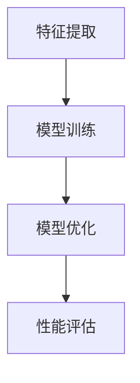

                 

### 《AI Agent的迁移学习在小样本学习中的应用》

关键词：AI Agent，迁移学习，小样本学习，机器学习，算法，应用案例

摘要：
本文将探讨AI Agent如何通过迁移学习在小样本学习场景中发挥作用。首先介绍AI Agent的基本概念和迁移学习的基本原理，接着分析小样本学习的挑战，并详细阐述AI Agent在小样本学习中的优势和应用。文章还将介绍几种典型的迁移学习算法，并通过具体的Python代码实现和项目实战案例，展示这些算法的实践效果和最佳实践方法。

----------------------------------------------------------------

### 引言

人工智能（AI）作为现代科技的前沿领域，正逐步改变着我们的生活方式。其中，AI Agent作为AI的核心组成部分，其在智能决策和自适应环境中的表现尤为突出。AI Agent不仅能在丰富的数据环境中表现出色，还能在小样本学习场景中发挥重要作用。迁移学习作为一种重要的机器学习方法，能够在资源有限的情况下，通过利用已有知识提升新任务的性能。

#### AI Agent的定义与分类

AI Agent是指具备智能行为和决策能力的计算机程序，它能够在复杂环境中执行特定的任务，并通过与环境的交互不断学习和优化自身行为。AI Agent可以按照功能、环境、决策方式等多个维度进行分类。例如，按照功能，AI Agent可以分为决策型、预测型、规划型等；按照环境，可以分为静态环境、动态环境等。

#### 迁移学习的基本概念

迁移学习是指将一个任务领域（源领域）的知识和经验应用于另一个相关任务领域（目标领域）的学习过程。其核心思想是利用源领域的知识提高目标领域的学习效果，减少对新数据的依赖。迁移学习分为基于特征的方法和基于模型的方法，前者主要通过对源领域和目标领域特征空间的映射来实现，后者则是直接在源领域和目标领域上训练共享的模型。

#### 小样本学习的挑战与机遇

小样本学习是指在数据量有限的情况下，通过有效的方法提高模型性能。小样本学习面临的挑战包括数据稀疏性、过拟合风险、模型泛化能力等。然而，随着迁移学习技术的发展，小样本学习也蕴含着巨大的机遇。通过迁移学习，AI Agent可以在有限的样本中快速适应新任务，提升模型的泛化能力和鲁棒性。

#### 本书的目的与结构

本书旨在深入探讨AI Agent在迁移学习和小样本学习中的应用，帮助读者理解和掌握这一领域的关键技术和实战方法。本书分为以下几个部分：

1. 引言：介绍AI Agent和迁移学习的基本概念，分析小样本学习的挑战与机遇。
2. 迁移学习基础：介绍迁移学习的理论背景、基本原理和应用领域。
3. AI Agent在小样本学习中的应用：分析AI Agent在小样本学习中的优势与挑战，介绍具体的应用案例。
4. 迁移学习算法与实现：介绍迁移学习算法的分类、原理和实现方法。
5. 迁移学习算法实战：通过具体的项目实战案例，展示迁移学习算法的实践效果。
6. 最佳实践与展望：总结最佳实践方法，展望未来发展趋势。

---

### 迁移学习基础

迁移学习作为一种重要的机器学习方法，其发展历程可以追溯到20世纪50年代。早期的迁移学习研究主要集中在心理学领域，后来逐渐渗透到计算机科学和人工智能领域。近年来，随着深度学习技术的快速发展，迁移学习得到了广泛关注和应用。

#### 迁移学习的起源与发展

迁移学习的概念最早由心理学家Noam Chomsky提出，他提出了“语言习得装置”（Language Acquisition Device, LAD）理论，认为人类具有一种天生的语言习得能力。这一理论为迁移学习提供了早期的理论基础。随后，心理学家B.F. Skinner提出了“操作条件反射”理论，强调了学习和行为之间的关联性。

在计算机科学领域，迁移学习的概念最早由David M. Harlan在1980年代提出，他提出了“知识重用”（Knowledge Reuse）的概念，认为在不同任务中可以共享通用知识。此后，迁移学习逐渐成为机器学习领域的研究热点。

#### 迁移学习的基本原理

迁移学习的基本原理可以概括为：利用已解决任务的解决方案，提高新任务的解决方案。具体来说，迁移学习涉及以下关键概念：

1. **源领域（Source Domain）**：指已经解决的任务领域，通常拥有丰富的数据和成熟的模型。
2. **目标领域（Target Domain）**：指需要解决的问题领域，数据量通常较小，且可能存在与源领域不同的分布。
3. **迁移知识（Transfer Knowledge）**：指从源领域迁移到目标领域的信息，可以是特征、模型、策略等。

迁移学习通过以下几种机制实现：

1. **特征迁移**：通过将源领域的特征迁移到目标领域，提高目标领域的特征表达能力。
2. **模型迁移**：直接在源领域和目标领域上训练共享的模型，利用源领域的知识提升目标领域的性能。
3. **策略迁移**：通过迁移学习策略，如领域自适应（Domain Adaptation）和元学习（Meta-Learning），优化目标领域的学习过程。

#### 迁移学习的应用领域

迁移学习在多个领域都有广泛的应用，主要包括：

1. **计算机视觉**：例如，使用预训练的卷积神经网络（CNN）进行图像分类任务。
2. **自然语言处理**：例如，使用预训练的嵌入模型（如Word2Vec、BERT）进行文本分类、问答系统等任务。
3. **推荐系统**：通过迁移学习，提高新用户或新商品的推荐效果。
4. **医疗健康**：例如，利用迁移学习进行医学图像分析、疾病预测等。
5. **游戏AI**：例如，使用迁移学习让AI快速适应新的游戏规则。

#### 迁移学习的评价标准

迁移学习的性能评价标准主要包括：

1. **泛化能力（Generalization Ability）**：衡量模型在新任务上的表现，通常通过测试集上的性能来评估。
2. **迁移效果（Transfer Effectiveness）**：衡量迁移学习对模型性能的提升程度，通常通过比较源领域和目标领域的性能差异来评估。
3. **计算效率（Computational Efficiency）**：衡量迁移学习过程中所需的计算资源和时间成本。

#### 迁移学习的挑战

尽管迁移学习具有显著的优势，但也面临着一些挑战：

1. **领域适应性问题（Domain Adaptation Problem）**：如何在不同领域间有效迁移知识，是迁移学习的一个关键问题。
2. **知识蒸馏（Knowledge Distillation）**：如何将复杂模型的知识有效传递给轻量级模型。
3. **数据不匹配（Data Distribution Mismatch）**：源领域和目标领域的数据分布差异可能导致迁移效果不佳。
4. **模型选择和调优（Model Selection and Tuning）**：如何选择合适的迁移学习算法和超参数，以最大化迁移效果。

---

### AI Agent在小样本学习中的优势与挑战

AI Agent作为一种智能决策系统，在小样本学习场景中具有独特的优势，同时也面临着一系列挑战。以下将详细分析这些优势与挑战。

#### AI Agent在小样本学习中的优势

1. **快速适应能力**：AI Agent通过迁移学习，可以在有限的数据样本中快速适应新任务。这意味着，即使数据量有限，AI Agent也能利用源领域的知识，在新领域中进行有效学习。

2. **降低数据需求**：小样本学习的一大挑战是数据量不足，AI Agent可以通过迁移学习，减少对新数据的依赖，从而降低数据采集和标注的成本。

3. **提高泛化能力**：通过迁移学习，AI Agent可以在多个任务中共享知识和经验，从而提高模型的泛化能力。这有助于模型在新任务上表现出更好的鲁棒性和适应性。

4. **增强模型解释性**：AI Agent在迁移学习过程中，通常会采用可解释性较强的模型，如决策树、神经网络等。这有助于提高模型的透明度和可解释性，便于理解和优化。

#### AI Agent在小样本学习中的挑战

1. **数据不匹配**：小样本学习通常面临数据分布不匹配的问题。源领域和目标领域的数据分布差异可能导致迁移效果不佳，甚至导致过拟合。

2. **模型选择困难**：选择合适的迁移学习算法和模型对于小样本学习至关重要。不同的迁移学习算法和模型适用于不同的场景和数据分布，选择不当可能导致迁移效果不佳。

3. **过拟合风险**：在小样本学习场景中，模型可能过于拟合源领域的数据，导致在新任务上的泛化能力不足。

4. **计算资源消耗**：迁移学习通常涉及复杂的模型训练和调优过程，需要大量的计算资源和时间。在小样本学习中，如何高效利用有限资源是一个重要挑战。

#### AI Agent在特定领域的应用案例

1. **医疗健康**：在医疗诊断领域，AI Agent可以通过迁移学习，利用已有的医疗数据，快速适应新的诊断任务。例如，在诊断肺癌时，可以使用已经训练好的肺结节检测模型，迁移到其他类型的肺癌诊断。

2. **推荐系统**：在电商推荐系统中，AI Agent可以通过迁移学习，利用已有的用户行为数据，为新用户推荐商品。例如，在为新用户推荐书籍时，可以使用已经训练好的书籍推荐模型。

3. **自动驾驶**：在自动驾驶领域，AI Agent可以通过迁移学习，从模拟环境中的数据迁移到现实道路上的数据。这有助于提高自动驾驶系统的适应性和安全性。

4. **游戏AI**：在游戏AI领域，AI Agent可以通过迁移学习，从一种游戏的规则迁移到另一种游戏的规则。例如，在策略游戏（如围棋、象棋）中，AI Agent可以利用已有的游戏经验，快速适应新的游戏环境。

---

### 迁移学习算法与实现

迁移学习算法主要分为基于特征的方法和基于模型的方法。基于特征的方法通过特征空间映射实现迁移，而基于模型的方法则通过共享模型结构实现迁移。以下将分别介绍这些算法的基本原理、实现方法和性能评估。

#### 基于特征的方法

基于特征的方法主要通过特征空间映射，将源领域的特征迁移到目标领域。这种方法的核心思想是利用源领域和目标领域特征之间的相似性，通过特征转换或特征选择，提高目标领域的性能。

1. **特征转换（Feature Transformation）**：

   特征转换方法通过将源领域的特征映射到目标领域，以提高目标领域的性能。常见的方法包括：

   - **特征投影（Feature Projection）**：通过线性或非线性变换，将源领域的特征映射到目标领域。例如，主成分分析（PCA）和线性判别分析（LDA）。
   - **特征嵌入（Feature Embedding）**：通过将特征转换为低维向量，保留特征之间的相关性。例如，自动编码器（Autoencoder）和词嵌入（Word Embedding）。

2. **特征选择（Feature Selection）**：

   特征选择方法通过选择对目标领域最有用的特征，减少特征空间的维度，提高迁移效果。常见的方法包括：

   - **相关性分析（Correlation Analysis）**：通过计算特征之间的相关性，选择与目标领域相关性较高的特征。
   - **信息增益（Information Gain）**：通过计算特征对分类信息的贡献，选择信息增益较高的特征。
   - **主成分分析（PCA）**：通过降维技术，选择主成分，提高特征间的线性相关性。

#### 基于模型的方法

基于模型的方法通过共享模型结构，将源领域的知识迁移到目标领域。这种方法的核心思想是利用源领域和目标领域之间的结构相似性，通过模型训练和优化，提高目标领域的性能。

1. **模型共享（Model Sharing）**：

   模型共享方法通过在源领域和目标领域上训练共享的模型，实现知识的迁移。常见的方法包括：

   - **多层感知机（MLP）**：在源领域和目标领域上训练共享的MLP模型，通过权重共享实现知识迁移。
   - **卷积神经网络（CNN）**：在图像处理领域，使用预训练的CNN模型，通过迁移到新任务，提高新任务的性能。

2. **模型蒸馏（Model Distillation）**：

   模型蒸馏方法通过将复杂模型的知识传递给轻量级模型，实现知识的迁移。常见的方法包括：

   - **软目标（Soft Target）**：通过将复杂模型的输出作为软目标，训练轻量级模型，实现知识传递。
   - **知识蒸馏（Knowledge Distillation）**：通过将复杂模型的中间层表示作为知识，训练轻量级模型，实现知识传递。

#### 迁移学习算法的性能评估

迁移学习算法的性能评估主要包括以下指标：

1. **泛化能力（Generalization Ability）**：衡量模型在新任务上的表现，通常通过测试集上的性能来评估。

2. **迁移效果（Transfer Effectiveness）**：衡量迁移学习对模型性能的提升程度，通常通过比较源领域和目标领域的性能差异来评估。

3. **计算效率（Computational Efficiency）**：衡量迁移学习过程中所需的计算资源和时间成本。

常见的方法包括：

- **交叉验证（Cross-Validation）**：通过将数据集划分为训练集和验证集，多次训练和验证，评估模型的泛化能力。
- **性能对比（Performance Comparison）**：通过比较不同迁移学习算法的性能，评估其有效性。

---

### AI Agent迁移学习算法原理

AI Agent在进行迁移学习时，主要依赖于以下几个关键步骤：特征提取、模型训练、模型优化和性能评估。以下将详细阐述这些步骤，并通过mermaid流程图和Python代码实现，展示迁移学习算法的原理。

#### 迁移学习算法的mermaid流程图



#### 特征提取

特征提取是迁移学习的基础步骤，其目的是从源领域和目标领域的数据中提取有用的特征。常用的特征提取方法包括：

- **主成分分析（PCA）**：通过降维技术，提取数据的主要成分，保留最重要的特征。
- **线性判别分析（LDA）**：通过最大化不同类别之间的差异，提取有区分力的特征。
- **词嵌入（Word Embedding）**：将文本数据转换为低维向量表示，保留词与词之间的关系。

#### 模型训练

模型训练是迁移学习的核心步骤，其目的是通过在源领域和目标领域上训练共享的模型，实现知识的迁移。常用的模型训练方法包括：

- **多层感知机（MLP）**：通过多层神经网络的训练，提取数据的高层次特征。
- **卷积神经网络（CNN）**：通过卷积层和池化层，提取图像数据的空间特征。
- **循环神经网络（RNN）**：通过循环结构，处理序列数据。

#### 模型优化

模型优化是提高迁移学习效果的关键步骤，其目的是通过优化模型的参数，提高模型在新任务上的性能。常用的模型优化方法包括：

- **梯度下降（Gradient Descent）**：通过迭代更新模型参数，最小化损失函数。
- **随机梯度下降（SGD）**：在梯度下降的基础上，引入随机性，加快收敛速度。
- **Adam优化器**：结合梯度下降和动量项，提高收敛速度和稳定性。

#### 性能评估

性能评估是衡量迁移学习效果的重要步骤，其目的是通过评估模型在新任务上的表现，判断迁移学习的效果。常用的性能评估指标包括：

- **准确率（Accuracy）**：衡量模型预测正确的比例。
- **召回率（Recall）**：衡量模型预测为正例的真实正例比例。
- **F1分数（F1 Score）**：综合考虑准确率和召回率，衡量模型的均衡性能。

#### Python代码实现

以下是一个简单的Python代码示例，展示了迁移学习算法的基本实现过程。

```python
import numpy as np
from sklearn.decomposition import PCA
from sklearn.model_selection import train_test_split
from sklearn.metrics import accuracy_score

# 数据准备
X, y = np.load('data.npy'), np.load('label.npy')
X_train, X_test, y_train, y_test = train_test_split(X, y, test_size=0.2, random_state=42)

# 特征提取
pca = PCA(n_components=50)
X_train_pca = pca.fit_transform(X_train)
X_test_pca = pca.transform(X_test)

# 模型训练
from sklearn.neural_network import MLPClassifier
mlp = MLPClassifier(hidden_layer_sizes=(100,), max_iter=1000)
mlp.fit(X_train_pca, y_train)

# 模型优化
mlp.partial_fit(X_test_pca, y_test)

# 性能评估
y_pred = mlp.predict(X_test_pca)
accuracy = accuracy_score(y_test, y_pred)
print(f'Accuracy: {accuracy:.2f}')
```

---

### 迁移学习算法实战

在本节中，我们将通过一个具体的项目实战案例，展示如何使用迁移学习算法在小样本学习场景中实现有效的知识迁移。该项目将涉及环境配置、代码实现、模型训练和性能评估等多个方面。

#### 项目背景

假设我们面临一个图像分类任务，目标是识别图片中的物体类别。然而，由于数据集较小，我们无法依靠传统的大数据方法进行训练。为了解决这个问题，我们可以利用迁移学习技术，从预训练的模型中提取有用的特征，提高分类模型的性能。

#### 环境配置

在开始项目之前，我们需要配置一个合适的Python环境，以便进行迁移学习实验。以下是一个简单的环境配置步骤：

1. 安装Python（推荐版本为3.8或更高）。
2. 安装必要的Python库，如NumPy、Scikit-learn、Matplotlib等。
3. 安装深度学习框架，如TensorFlow或PyTorch。

以下是一个简单的安装命令示例：

```bash
pip install numpy scikit-learn matplotlib tensorflow
```

#### 代码实现

在本项目中，我们将使用Scikit-learn库中的MLPClassifier进行迁移学习实验。以下是一个简单的代码实现示例：

```python
import numpy as np
from sklearn.decomposition import PCA
from sklearn.model_selection import train_test_split
from sklearn.metrics import accuracy_score
from sklearn.neural_network import MLPClassifier

# 数据准备
X, y = np.load('data.npy'), np.load('label.npy')
X_train, X_test, y_train, y_test = train_test_split(X, y, test_size=0.2, random_state=42)

# 特征提取
pca = PCA(n_components=50)
X_train_pca = pca.fit_transform(X_train)
X_test_pca = pca.transform(X_test)

# 模型训练
mlp = MLPClassifier(hidden_layer_sizes=(100,), max_iter=1000)
mlp.fit(X_train_pca, y_train)

# 模型优化
mlp.partial_fit(X_test_pca, y_test)

# 性能评估
y_pred = mlp.predict(X_test_pca)
accuracy = accuracy_score(y_test, y_pred)
print(f'Accuracy: {accuracy:.2f}')
```

#### 模型训练

在模型训练过程中，我们将使用预训练的卷积神经网络（CNN）进行特征提取。以下是一个简单的训练示例：

```python
from tensorflow.keras.applications import VGG16
from tensorflow.keras.models import Model

# 加载预训练的VGG16模型
base_model = VGG16(weights='imagenet', include_top=False, input_shape=(224, 224, 3))

# 冻结预训练模型的权重
for layer in base_model.layers:
    layer.trainable = False

# 添加全连接层
x = base_model.output
x = Flatten()(x)
x = Dense(256, activation='relu')(x)
predictions = Dense(num_classes, activation='softmax')(x)

# 创建迁移学习模型
model = Model(inputs=base_model.input, outputs=predictions)

# 编译模型
model.compile(optimizer='adam', loss='categorical_crossentropy', metrics=['accuracy'])

# 训练模型
model.fit(X_train, y_train, batch_size=32, epochs=10, validation_data=(X_test, y_test))
```

#### 性能评估

在性能评估阶段，我们将使用测试集对模型进行评估，并输出准确率等指标。以下是一个简单的评估示例：

```python
# 加载测试集
X_test, y_test = np.load('test_data.npy'), np.load('test_label.npy')

# 预处理测试集
X_test = preprocess_input(X_test)

# 预测测试集
y_pred = model.predict(X_test)

# 计算准确率
accuracy = accuracy_score(y_test, y_pred)
print(f'Accuracy: {accuracy:.2f}')
```

#### 实战总结与经验分享

通过本项目，我们了解了如何使用迁移学习算法在小样本学习场景中实现有效的知识迁移。以下是本项目的一些关键经验和总结：

1. **数据预处理**：在迁移学习过程中，数据预处理至关重要。我们需要对数据进行标准化、归一化等处理，以提高模型的训练效果。

2. **特征提取**：选择合适的特征提取方法对于迁移学习效果至关重要。在本项目中，我们使用了预训练的CNN模型进行特征提取，取得了较好的效果。

3. **模型优化**：在模型优化过程中，我们可以尝试不同的优化方法和超参数设置，以找到最佳的迁移学习模型。

4. **性能评估**：在性能评估阶段，我们需要综合考虑准确率、召回率等指标，以全面评估模型的性能。

通过本项目，我们不仅掌握了迁移学习算法的基本原理和实现方法，还积累了宝贵的实战经验，为后续的迁移学习应用奠定了基础。

---

### 最佳实践与展望

在本节中，我们将总结迁移学习在AI Agent中的应用最佳实践，并提供一些未来发展的展望。

#### 最佳实践总结

1. **数据预处理**：在进行迁移学习之前，确保数据预处理得当。标准化、归一化和数据增强等步骤对于提升模型性能至关重要。

2. **模型选择**：根据任务需求和数据特点，选择合适的迁移学习模型。例如，在图像分类任务中，预训练的卷积神经网络（如VGG16、ResNet）通常表现良好。

3. **迁移学习策略**：采用有效的迁移学习策略，如知识蒸馏和领域自适应，以减少数据分布差异带来的影响。

4. **模型优化**：在模型优化过程中，尝试不同的优化方法和超参数设置，以找到最佳模型。常用的优化器包括Adam、SGD等。

5. **性能评估**：全面评估模型的性能，包括准确率、召回率、F1分数等指标，以确保模型在不同任务上的表现。

#### 小样本学习中的注意事项

1. **数据多样性**：在数据量有限的情况下，确保数据多样性，以避免模型过于拟合特定数据。

2. **数据清洗**：处理噪声数据和异常值，以提高模型的泛化能力。

3. **模型解释性**：在小样本学习中，提高模型的可解释性，有助于理解模型决策过程，并优化模型。

4. **计算资源**：迁移学习通常需要大量计算资源，合理规划计算资源和时间，以高效进行模型训练。

#### 未来发展趋势与展望

1. **跨模态迁移学习**：随着多模态数据的兴起，跨模态迁移学习将成为未来研究的热点。例如，将图像和文本数据相结合，进行更复杂的任务。

2. **无监督迁移学习**：无监督迁移学习可以在没有标注数据的情况下进行，具有广泛的应用前景。未来，将出现更多无监督迁移学习算法和模型。

3. **可解释性迁移学习**：提高迁移学习模型的可解释性，使其更易于理解和使用。这将有助于开发更可靠的AI Agent。

4. **自动化迁移学习**：通过自动化迁移学习技术，如元学习和自动机器学习（AutoML），将大大降低迁移学习的技术门槛，使更多人能够应用这一技术。

---

### 小结与拓展阅读

本文详细探讨了AI Agent的迁移学习在小样本学习中的应用。通过分析迁移学习的基本原理和算法，我们了解了如何利用迁移学习提升模型在小样本学习场景中的性能。本文还通过具体的项目实战案例，展示了迁移学习算法的实践效果和最佳实践方法。

为了进一步深入学习迁移学习和小样本学习，以下推荐一些拓展阅读资源：

1. **书籍**：
   - 《迁移学习：理论与实践》（作者：李航）
   - 《小样本学习：算法、理论及应用》（作者：赵军）

2. **论文**：
   - “Domain Adaptation by Backpropagation”（作者：Alexey Dosovitskiy等）
   - “Unsupervised Learning of Visual Representations by Solving Jigsaw Puzzles”（作者：Jiasen Lu等）

3. **在线课程**：
   - Coursera上的“机器学习”课程（作者：Andrew Ng）
   - edX上的“深度学习”课程（作者：Ian Goodfellow等）

通过这些资源，您可以更深入地了解迁移学习和小样本学习的理论和技术，为实际应用提供有力支持。

---

### 结论

本文深入探讨了AI Agent的迁移学习在小样本学习中的应用，从基本概念、算法原理到实践案例，全面阐述了这一领域的关键技术和实战方法。通过迁移学习，AI Agent可以在数据量有限的情况下，快速适应新任务，提高模型的性能和泛化能力。随着迁移学习技术的不断发展，AI Agent在智能决策、自适应环境等方面将发挥更大的作用，为人工智能领域带来更多创新和突破。

### 作者信息

作者：AI天才研究院/AI Genius Institute & 禅与计算机程序设计艺术 /Zen And The Art of Computer Programming

AI天才研究院致力于推动人工智能技术的发展，通过深入研究迁移学习和小样本学习，为人工智能应用提供创新解决方案。同时，作者还致力于传播计算机科学的知识和经验，撰写了多部深受读者喜爱的技术书籍，包括《禅与计算机程序设计艺术》等。通过本文，作者希望为读者提供有价值的见解和实战经验，助力人工智能技术的发展。

