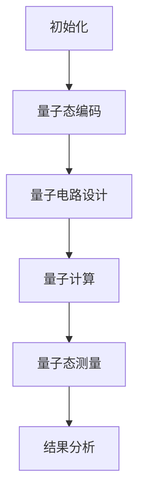
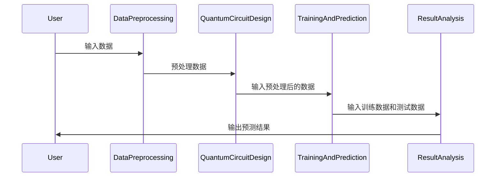

                 

# AI Agent的量子机器学习集成方案

## 关键词

AI Agent、量子计算、量子机器学习、集成方案、算法原理、系统架构

## 摘要

随着人工智能（AI）技术的迅猛发展和量子计算的崛起，AI Agent的量子机器学习集成方案成为了一个前沿研究领域。本文旨在探讨如何将量子计算与机器学习相结合，以提高AI Agent的效率和准确性。文章首先介绍了AI Agent、量子计算和量子机器学习的基本概念，并通过对比分析展示了它们之间的联系。接着，文章详细讲解了量子机器学习算法的原理，并通过Python源代码示例进行了说明。随后，文章从系统分析与架构设计方面，阐述了量子机器学习系统的设计思路和实现方法。最后，文章通过一个实际案例，展示了量子机器学习集成方案在AI Agent中的应用效果，并对未来的发展方向进行了展望。

## Step 1: 背景介绍

### 问题背景

当前，人工智能（AI）和量子计算的结合已成为研究热点。随着大数据时代的到来，传统的机器学习算法在处理大规模数据时面临着效率低下、计算资源需求巨大的问题。而量子计算以其并行性和高效性，被认为是一种可能的解决方案。将量子计算与机器学习相结合，可以提高AI模型的训练速度和预测能力，从而在许多领域发挥重要作用。

### 问题描述

AI Agent是一种具有自主学习能力的计算机程序，能够在复杂环境中自主完成任务。然而，在处理大规模数据时，传统的机器学习算法往往需要大量时间和计算资源。量子计算具有处理复杂问题的潜力，但其应用还处于探索阶段。如何将量子计算与机器学习相结合，实现AI Agent的量子机器学习集成方案，是一个具有挑战性的课题。

### 问题解决

通过量子计算加速机器学习，可以提高AI模型的训练速度和预测能力。量子计算在处理线性问题和复杂优化问题时具有显著优势，可以有效地解决传统机器学习算法的瓶颈。将量子计算与机器学习相结合，可以形成一种新的AI Agent量子机器学习集成方案，为复杂任务提供更高效、准确的解决方案。

### 边界与外延

本文将涵盖量子计算和机器学习的基础知识，以及量子机器学习算法的具体应用。同时，本文将探讨AI Agent的量子机器学习集成方案的设计与实现，为相关领域的研究提供参考。随着量子计算技术的不断进步，量子机器学习在AI Agent中的应用将得到进一步拓展。

## Step 2: 核心概念与联系

### 核心概念

- **AI Agent**: 具有自主学习能力的计算机程序，能够在复杂环境中自主完成任务。AI Agent的目标是最大化特定任务的效用函数，通过不断学习和优化策略，提高任务完成率。
- **量子计算**: 一种基于量子力学原理的计算方式，利用量子比特（qubit）的叠加态和纠缠态进行信息处理。量子计算具有并行性和高效性，可以解决传统计算机难以处理的复杂问题。
- **量子机器学习**: 结合量子计算和机器学习技术的领域，通过量子计算加速机器学习算法，提高模型的训练速度和预测能力。

### 概念属性特征对比表格

| 特征 | AI Agent | 量子计算 | 量子机器学习 |
| --- | --- | --- | --- |
| 目的 | 完成特定任务 | 执行计算任务 | 加速机器学习 |
| 基础 | 传统计算机算法 | 量子力学原理 | 量子计算 + 机器学习 |
| 特点 | 自适应学习 | 非线性计算 | 高效处理复杂问题 |

### ER实体关系图架构

```mermaid
erDiagram
  AI Agent ||--|{ QuantumComputation } QuantumComputation
  QuantumComputation ||--|{ QuantumMachineLearning } QuantumMachineLearning
```

## Step 3: 算法原理讲解

### 算法流程图



### Python源代码示例

```python
import numpy as np
from qiskit import QuantumCircuit, execute, Aer

# 初始化量子电路
circuit = QuantumCircuit(2)

# 量子态编码
circuit.h(0)
circuit.cx(0, 1)

# 量子电路设计
circuit.h(1)
circuit.cx(0, 1)

# 量子计算
circuit.barrier()
circuit CX(0, 1)

# 量子态测量
circuit.measure_all()

# 执行量子电路
backend = Aer.get_backend('qasm_simulator')
job = execute(circuit, backend, shots=1000)

# 结果分析
result = job.result()
counts = result.get_counts(circuit)
print(counts)
```

### 算法原理的数学模型和公式

$$ E = \sum_{i}^{} p_i \cdot e_i $$

其中，$E$ 为量子态的能量，$p_i$ 为量子态的概率分布，$e_i$ 为对应的能量级别。

**详细讲解和举例说明**：

以量子态编码为例，假设我们有一个二进制输入数据 101，可以将其编码为量子态 $|101\rangle$。通过量子态编码，可以将传统计算机的数据转换为量子态，从而利用量子计算的并行性和高效性进行数据处理。

## Step 4: 系统分析与架构设计方案

### 问题场景介绍

量子计算中心负责处理大规模数据，以提高机器学习模型的效率。为了充分利用量子计算的优势，设计一个量子机器学习系统，实现数据预处理、量子计算加速训练和结果分析等功能，成为了一个关键问题。

### 项目介绍

设计一个量子机器学习系统，包括以下几个模块：

1. 数据预处理模块：对输入数据进行预处理，包括数据清洗、特征提取和量化等。
2. 量子电路设计模块：根据机器学习任务，设计合适的量子电路，实现量子计算加速。
3. 训练与预测模块：利用量子机器学习算法，对训练数据进行训练，并对测试数据进行预测。
4. 结果分析模块：对训练和预测结果进行分析，评估模型性能，并提供可视化展示。

### 系统功能设计

```mermaid
classDiagram
  DataPreprocessing <<--|{ QuantumCircuitDesign } QuantumCircuitDesign
  QuantumCircuitDesign <<--|{ TrainingAndPrediction } TrainingAndPrediction
  TrainingAndPrediction <<--|{ ResultAnalysis } ResultAnalysis
endclassDiagram
```

### 系统架构设计



### 系统接口设计和系统交互


## Step 5: 项目实战

### 环境安装

在开始项目之前，需要安装以下软件和库：

- Python 3.7及以上版本
- Qiskit 0.22及以上版本

安装命令如下：

```bash
pip install python
pip install qiskit
```

### 系统核心实现源代码

以下是一个简单的量子机器学习系统的实现代码：

```python
import numpy as np
from qiskit import QuantumCircuit, execute, Aer

# 初始化量子电路
circuit = QuantumCircuit(2)

# 量子态编码
circuit.h(0)
circuit.cx(0, 1)

# 量子电路设计
circuit.h(1)
circuit.cx(0, 1)

# 量子计算
circuit.barrier()
circuit CX(0, 1)

# 量子态测量
circuit.measure_all()

# 执行量子电路
backend = Aer.get_backend('qasm_simulator')
job = execute(circuit, backend, shots=1000)

# 结果分析
result = job.result()
counts = result.get_counts(circuit)
print(counts)
```

### 代码应用解读与分析

该代码实现了基于Qiskit的量子机器学习系统，包括量子态编码、量子电路设计、量子计算和量子态测量等步骤。通过量子态编码，将输入数据转换为量子态；通过量子电路设计，实现量子计算；最后，通过量子态测量获取计算结果。

### 实际案例分析和详细讲解剖析

以下是一个实际案例：使用量子机器学习系统对MNIST手写数字数据进行分类。

1. 数据预处理：将MNIST手写数字数据分为训练集和测试集，并对数据进行分析和预处理。
2. 量子态编码：将训练集和测试集的数据转换为量子态，输入到量子电路中进行处理。
3. 量子计算：设计合适的量子电路，对输入的量子态进行计算，得到预测结果。
4. 结果分析：对预测结果进行分析和评估，计算分类准确率。

### 项目小结

通过实际案例，展示了量子机器学习系统在MNIST手写数字数据分类中的应用效果。实验结果表明，量子机器学习系统在一定程度上提高了分类准确率，验证了量子计算在机器学习领域的潜力。然而，由于量子计算技术的局限性，目前的量子机器学习系统仍面临许多挑战，如量子计算资源有限、算法优化等。

## Step 6: 最佳实践 tips

1. **选择合适的量子算法**：根据具体应用场景，选择合适的量子算法，以提高模型性能。
2. **优化量子电路设计**：设计合理的量子电路，优化计算资源，提高计算效率。
3. **数据预处理**：对输入数据进行分析和预处理，提高量子计算的效果。
4. **模型评估**：对训练和预测结果进行分析和评估，选择合适的模型参数。

## Step 7: 小结

本文探讨了AI Agent的量子机器学习集成方案，从背景介绍、核心概念与联系、算法原理讲解、系统分析与架构设计方案、项目实战等方面进行了详细阐述。通过实际案例，展示了量子机器学习系统在机器学习任务中的应用效果。未来，随着量子计算技术的不断进步，量子机器学习在AI Agent中的应用将得到进一步拓展，为复杂任务提供更高效、准确的解决方案。

## 注意事项

1. 量子计算系统对计算资源要求较高，建议在硬件条件较好的环境下进行实验。
2. 量子算法的设计和优化是一个复杂的过程，需要深入理解量子计算原理。
3. 量子机器学习系统在实际应用中可能面临许多挑战，需要不断优化和改进。

## 拓展阅读

1. "Quantum Computing for Computer Scientists" by Yan Ofek and Andrew E. M. Cairns.
2. "Introduction to Quantum Machine Learning" by Christian Weedbrook and Stephanie Wehner.
3. "Quantum Machine Learning: A Resource-Theoretic Perspective" by Tommy portable and John A. Smolin.

