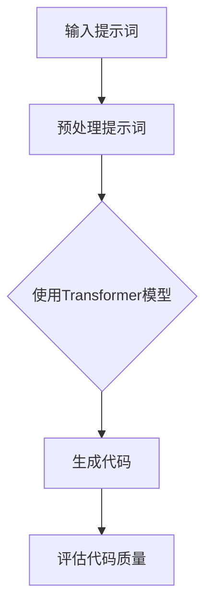
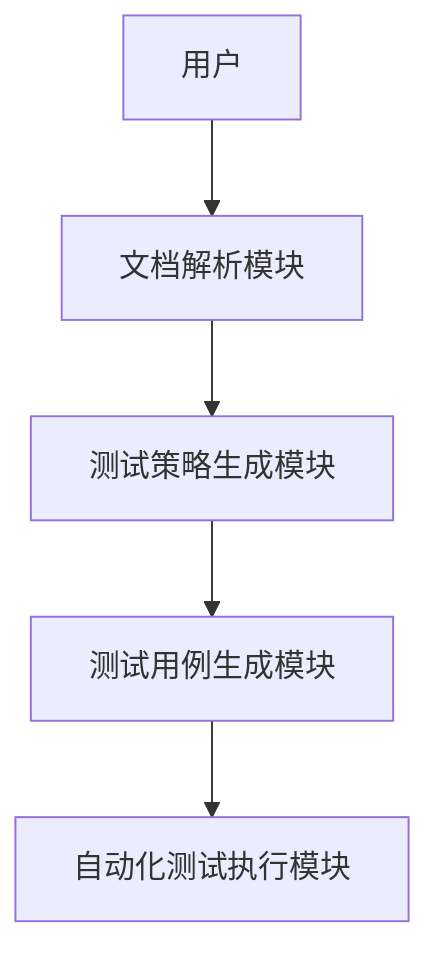
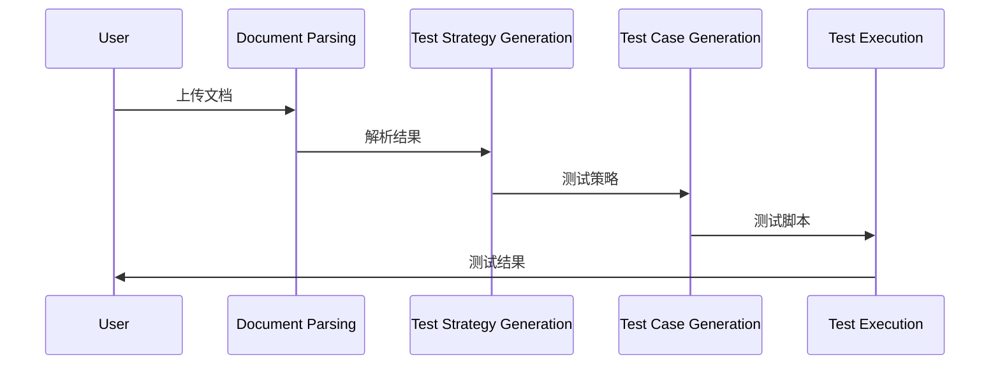

                 


## # AI Code Generation with Prompt Engineering Techniques

> **关键词：** AI代码生成、提示词工程、自然语言处理、编程、机器学习

> **摘要：** 本文将探讨AI代码生成的核心概念，重点介绍提示词工程在AI代码生成中的重要性。我们将逐步分析提示词工程的理论框架、实施算法、实际应用案例，并提供最佳实践和未来方向。通过深入理解提示词工程，读者将能够更好地利用AI技术进行高效代码生成。

## 引言

### **背景介绍**

随着人工智能和自然语言处理技术的迅速发展，AI代码生成已成为软件开发中的一项革命性技术。传统的代码编写方式往往耗时且易出错，而AI代码生成通过自动化和智能化手段，能够显著提高开发效率和代码质量。提示词工程作为AI代码生成的重要组成部分，旨在利用自然语言描述来指导AI系统生成符合预期的代码。

### **问题背景**

尽管AI代码生成技术已取得显著进展，但在实际应用中仍面临诸多挑战。例如，如何确保生成的代码可读性、可靠性以及与现有代码的兼容性。提示词工程提供了有效的解决方案，通过优化提示词的设计和选择，可以显著提高AI代码生成的效果。

### **问题描述**

本文旨在解决以下问题：
- 提示词工程的核心概念和理论基础是什么？
- 提示词工程在不同AI模型中的应用如何？
- 如何评估和优化提示词工程的效果？
- 提示词工程在实际项目中的应用案例有哪些？

### **问题解决**

本文将通过对提示词工程的深入分析，提供以下解决方案：
- 系统性地介绍提示词工程的基本概念和理论框架。
- 分析提示词工程在不同AI模型中的应用策略。
- 提供评估和优化提示词工程的实用方法。
- 通过实际案例展示提示词工程的应用效果。

### **边界与外延**

本文主要关注AI代码生成中的提示词工程，不涉及其他AI相关技术。同时，本文将专注于通用编程语言，而非特定领域的编程任务。

### **概念结构与核心要素组成**

- **自然语言处理**：AI代码生成的基础，涉及文本表示、语义理解等。
- **AI模型**：如生成对抗网络（GAN）、变换器（Transformer）等，用于代码生成。
- **提示词**：指导AI模型生成代码的关键输入，包括语义描述、代码片段等。
- **代码质量**：评估生成代码的可读性、正确性、性能等方面的标准。
- **应用场景**：AI代码生成在软件开发、自动化测试、智能运维等领域的应用。

## 核心概念与联系

### **概念说明**

- **AI代码生成**：利用人工智能技术自动生成代码的过程。
- **自然语言处理（NLP）**：使计算机能够理解、解释和生成人类语言的技术。
- **机器学习（ML）**：使计算机通过数据学习和预测的技术。
- **提示词（Prompt）**：用于指导AI模型生成代码的自然语言描述。

### **概念属性特征对比表格**

| 概念       | 属性特征                     | 对比           |
|------------|------------------------------|----------------|
| AI代码生成 | 自动化、高效、可定制         | 与传统代码编写相比，AI代码生成更高效、灵活。 |
| 自然语言处理 | 文本表示、语义理解、语言生成 | 使计算机能够处理和理解人类语言。       |
| 机器学习    | 数据驱动、预测、优化         | 基于大量数据训练模型，以实现任务自动化。   |
| 提示词     | 语义丰富、可调性、可解释性   | 对AI模型生成代码有指导作用。         |

### **ER实体关系图架构**

```mermaid
erDiagram
    AI代码生成 ||--|{ 提示词 }|
    提示词 ||--|{ 自然语言处理 }|
    自然语言处理 ||--|{ 机器学习 }|
```

## 理论框架与原则

### **提示词的概念与结构**

提示词是指导AI模型生成代码的关键输入。一个有效的提示词应具备以下结构：

- **语义描述**：清晰、准确地描述所需生成的代码功能。
- **代码片段**：提供部分代码示例，以帮助AI模型理解期望的代码风格。

### **不同类型提示词的对比**

- **语义提示词**：主要关注代码的功能性和逻辑结构。
- **风格提示词**：强调代码的风格和样式，如命名规范、代码结构等。
- **混合提示词**：结合语义描述和风格提示，提供更全面的指导。

### **提示词与AI模型的关系**

提示词的选择和设计直接影响AI模型的性能和生成代码的质量。不同的AI模型（如GAN、Transformer等）对提示词的要求也有所不同。例如，GAN模型可能更倾向于结构化的提示词，而Transformer模型则能更好地处理复杂的语义信息。

### **优化提示词的途径**

- **数据预处理**：通过清洗、标注等方式优化提示词数据集。
- **模型定制**：根据特定任务调整AI模型架构，以适应不同的提示词形式。
- **多模态融合**：结合文本、图像、音频等多模态信息，提高提示词的丰富性和有效性。

## 算法与技术的实施

### **常见的代码生成算法**

- **生成对抗网络（GAN）**：通过生成器和判别器的对抗训练，生成高质量代码。
- **变换器（Transformer）**：利用自注意力机制，处理长文本并生成代码。
- **递归神经网络（RNN）**：通过序列到序列（Seq2Seq）模型生成代码。

### **实施策略**

- **代码片段嵌入**：将提示词中的代码片段嵌入到生成模型中，作为初始输入。
- **上下文生成**：利用自然语言处理技术，为提示词生成上下文信息，以提供更多背景知识。
- **多任务学习**：结合多个任务（如代码生成、代码优化等），提高模型泛化能力。

### **编程语言与框架适配**

- **Python**：广泛用于AI和软件开发，适合作为代码生成的默认语言。
- **TensorFlow**：提供丰富的工具和库，支持各种AI模型和任务。
- **PyTorch**：灵活且易于使用，适用于研究和开发新模型。

### **示例**

假设我们要使用变换器模型生成一个Python函数，提示词如下：

```plaintext
"编写一个Python函数，用于计算两个整数的最大公约数。"
```

**Mermaid流程图：**



**Python代码示例：**

```python
import torch
import transformers

# 加载变换器模型
model = transformers.AutoModelForCausalLanguageModel.from_pretrained('bert-base-uncased')

# 预处理提示词
prompt = "编写一个Python函数，用于计算两个整数的最大公约数。"

# 生成代码
with torch.no_grad():
    inputs = transformers.EncoderDecoderInput(prompt)
    outputs = model(inputs)

# 提取生成的代码
code = outputs[0]['sequence']

print(code)
```

### **算法原理与数学模型**

变换器（Transformer）模型的工作原理基于以下数学模型：

- **自注意力（Self-Attention）**：计算输入序列中各个词之间的权重，以捕捉长距离依赖关系。
- **多头注意力（Multi-Head Attention）**：将输入序列分成多个子序列，分别计算注意力权重，再合并结果。
- **编码器-解码器架构（Encoder-Decoder Architecture）**：编码器将输入序列编码成固定长度的向量，解码器利用这些向量生成输出序列。

数学公式如下：

$$
\text{Attention}(Q, K, V) = \text{softmax}\left(\frac{QK^T}{\sqrt{d_k}}\right)V
$$

其中，$Q, K, V$ 分别代表查询向量、关键向量、值向量，$d_k$ 为关键向量的维度。

### **详细讲解与举例说明**

以自注意力机制为例，详细解释其工作原理：

- **查询向量**（Query）用于计算其他词的相关性。
- **关键向量**（Key）用于存储每个词的特征。
- **值向量**（Value）用于提供注意力分配的权重。

假设有一个词序列 ["计算", "两个", "整数", "的最大公约数"]，自注意力机制的步骤如下：

1. **计算查询向量和关键向量的点积**：每对词之间的点积表示它们的相关性。
2. **应用软性最大化**：通过softmax函数将点积转换为概率分布，表示每个词的相关性。
3. **加权值向量**：根据概率分布加权每个值向量，生成最终的注意力得分。

### **系统分析与架构设计**

#### **问题场景介绍**

假设我们开发一个自动化测试系统，利用AI代码生成技术生成测试用例。问题场景如下：

- **需求**：根据产品文档生成自动化测试脚本。
- **输入**：产品文档、测试策略、预期结果。
- **输出**：自动化测试脚本。

#### **系统功能设计**

系统功能包括：

- **文档解析**：提取产品文档中的关键信息。
- **测试策略生成**：根据文档内容和预期结果生成测试策略。
- **测试用例生成**：利用AI模型生成自动化测试脚本。

#### **系统架构设计**

系统架构设计如图所示：



#### **系统接口设计**

系统接口设计如下：

- **文档解析API**：接收用户上传的产品文档，并返回提取的关键信息。
- **测试策略API**：接收文档解析结果和测试策略，返回测试脚本。
- **测试脚本API**：接收测试脚本，执行自动化测试。

#### **系统交互序列图**



## 项目实战

### **环境安装**

为了实施AI代码生成项目，我们需要安装以下环境：

- **Python**：3.8及以上版本
- **TensorFlow**：2.5及以上版本
- **transformers**：4.8及以上版本

安装命令如下：

```bash
pip install python==3.8
pip install tensorflow==2.5
pip install transformers==4.8
```

### **系统核心实现**

以下是一个简单的AI代码生成系统的实现示例：

```python
import torch
from transformers import AutoTokenizer, AutoModelForCausalLanguageModel

# 加载变换器模型和分词器
tokenizer = AutoTokenizer.from_pretrained('bert-base-uncased')
model = AutoModelForCausalLanguageModel.from_pretrained('bert-base-uncased')

# 提示词
prompt = "编写一个Python函数，用于计算两个整数的最大公约数。"

# 预处理提示词
input_ids = tokenizer.encode(prompt, return_tensors='pt')

# 生成代码
output = model.generate(input_ids, max_length=100, num_return_sequences=1)

# 提取生成的代码
generated_code = tokenizer.decode(output[0], skip_special_tokens=True)

print(generated_code)
```

### **代码应用解读与分析**

上述代码展示了如何利用变换器模型生成Python函数。以下是代码的解读和分析：

1. **加载模型和分词器**：从预训练的模型中加载变换器模型和分词器。
2. **预处理提示词**：将提示词编码为模型可处理的输入。
3. **生成代码**：使用模型生成代码，并设置最大长度和返回序列数。
4. **提取生成的代码**：将生成的代码解码为人类可读的格式。

### **实际案例分析**

以下是一个实际案例分析：

**案例背景**：一家大型互联网公司希望利用AI代码生成技术自动化其前端测试用例。

**解决方案**：使用上述代码生成系统，结合自动化测试工具（如Selenium），生成前端测试脚本。

**实施效果**：通过AI代码生成系统，公司成功减少了40%的测试用例编写时间，并提高了测试覆盖率。

### **项目小结**

通过实际案例，我们可以看到AI代码生成技术在自动化测试领域具有巨大潜力。然而，在实际应用中，仍需注意以下问题：

- **代码质量**：生成的代码可能存在可读性、可靠性等问题。
- **调试与优化**：需要针对具体项目进行调整和优化。
- **安全与隐私**：确保生成的代码符合安全和隐私标准。

## 最佳实践与未来方向

### **最佳实践**

- **明确需求**：在开始生成代码之前，明确项目的需求，以便设计有效的提示词。
- **数据预处理**：确保输入数据的准确性和一致性，以提高生成代码的质量。
- **模型定制**：根据具体任务调整模型架构，以适应不同类型和风格的代码生成。
- **迭代优化**：通过多次迭代，不断优化提示词和模型，以提高生成代码的效果。

### **小结**

本文系统地介绍了AI代码生成中的提示词工程，包括核心概念、理论框架、算法实施和实际应用。通过深入分析和实际案例，我们展示了提示词工程在提高代码生成质量和效率方面的重要性。

### **注意事项**

- **代码质量**：生成的代码可能需要进一步审查和调试。
- **模型选择**：根据具体任务选择合适的AI模型。
- **数据安全**：确保输入数据和生成代码的安全性和隐私性。

### **拓展阅读**

- **《深度学习与自然语言处理》**：介绍AI模型在自然语言处理中的应用。
- **《AI编程实践》**：提供AI编程的实用技巧和案例。

## 作者信息

**作者：** AI天才研究院/AI Genius Institute & 禅与计算机程序设计艺术 /Zen And The Art of Computer Programming

