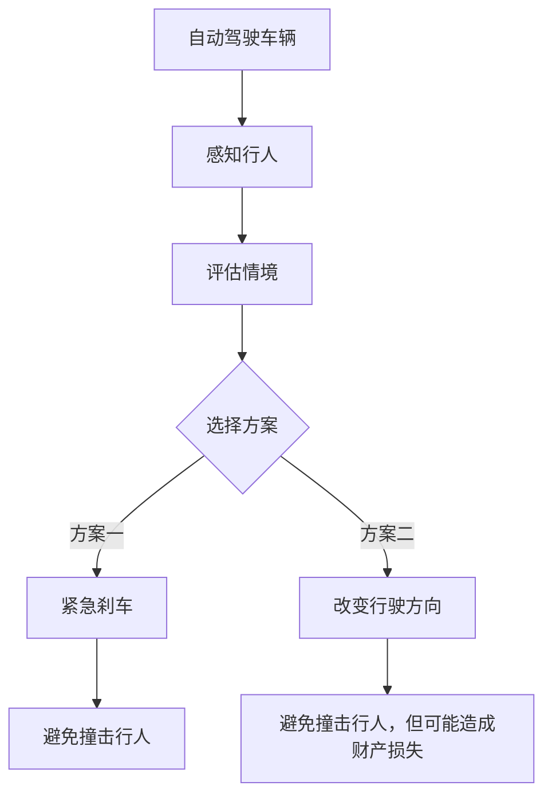
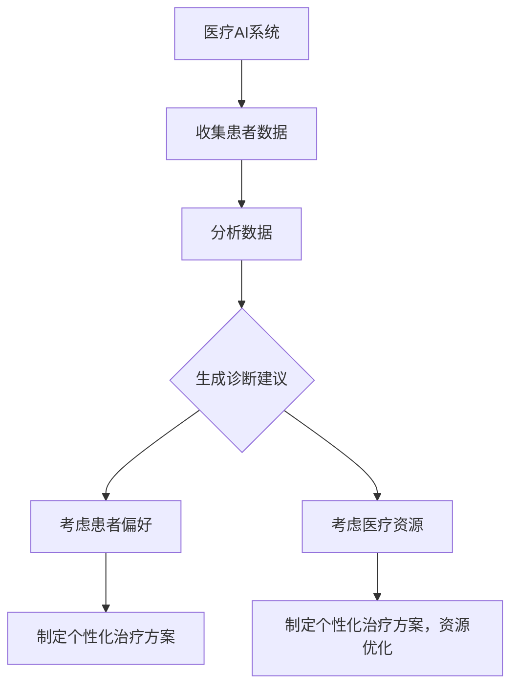
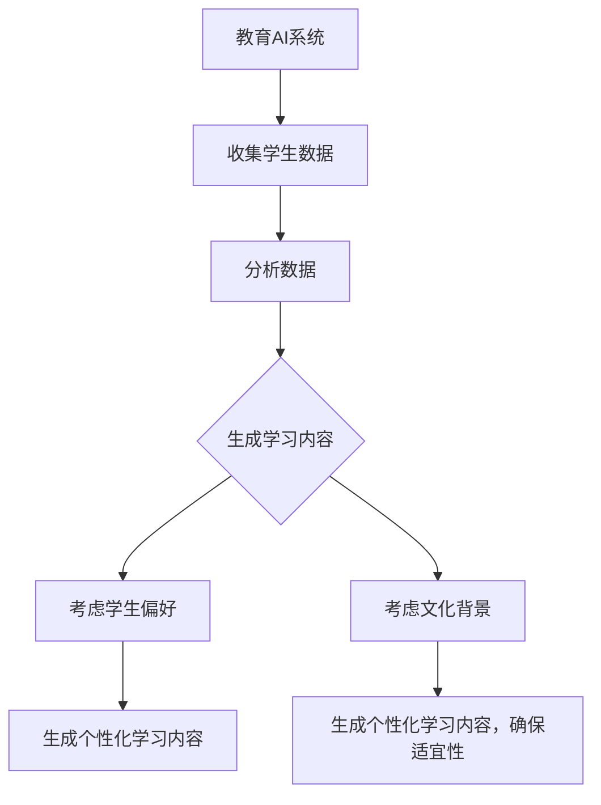

                 


### AI伦理决策中的提示词价值对齐技术

**关键词：**AI伦理、提示词、价值对齐、技术原理、案例分析

**摘要：**本文将深入探讨AI伦理决策中的提示词价值对齐技术，首先介绍AI伦理的背景和提示词在AI系统中的作用。接着，我们分析价值对齐技术的原理和重要性，通过具体案例和流程图展示其在AI伦理决策中的应用。最后，我们讨论价值对齐技术的挑战与未来，并提供实施指南和最佳实践建议。

## 目录大纲设计流程

### 1. 确定书名与目标读者
   - 书名：《AI伦理决策中的提示词价值对齐技术》
   - 目标读者：AI研究人员、伦理学学者、技术开发人员等。

### 2. 分析核心内容
   - 核心概念：AI伦理、提示词、价值对齐技术。
   - 内容结构：问题背景、核心概念解释、应用场景、技术原理、案例分析、实施指南。

### 3. 设计目录结构
   - 总体结构：7章。
   - 核心章节内容：
     - 第1章：AI伦理与价值对齐概述
     - 第2章：提示词与价值对齐基础
     - 第3章：价值对齐技术原理
     - 第4章：AI伦理决策中的价值对齐实践
     - 第5章：案例分析
     - 第6章：价值对齐技术的挑战与未来
     - 第7章：实施与展望

### 4. 详细设计每个章节的目录
   - 确保每个章节都有清晰的标题和子标题。
   - 确保章节内容的完整性，包括背景介绍、核心概念、原理讲解、案例分析、实施指南等。

### 5. 检查目录大纲的总字数，确保在2000字以内
   - 对每个章节的标题和简要描述进行字数控制，确保整体不超过2000字。

### 6. 输出Markdown格式的目录大纲
   - 使用`#`、`##`、`###`等Markdown格式，确保格式规范。

## 目录大纲

```markdown
----------------------------------------------------------------
# AI伦理决策中的提示词价值对齐技术

## **关键词：** AI伦理、提示词、价值对齐、技术原理、案例分析

## **摘要：**本文将深入探讨AI伦理决策中的提示词价值对齐技术...

## 第一部分: AI伦理与价值对齐概述

### 第1章: AI伦理与价值对齐基础

#### 1.1 AI伦理背景
#### 1.2 提示词在AI系统中的作用
#### 1.3 价值对齐的基本概念

### 第2章: 提示词与价值对齐基础

#### 2.1 提示词的定义与分类
#### 2.2 价值对齐的关键要素
#### 2.3 提示词价值对齐的重要性

### 第二部分: 价值对齐技术原理

### 第3章: 价值对齐技术原理

#### 3.1 价值对齐技术的理论基础
#### 3.2 提示词价值对齐的方法
#### 3.3 价值对齐技术的实现

### 第4章: AI伦理决策中的价值对齐实践

#### 4.1 AI伦理决策的需求
#### 4.2 价值对齐在AI伦理决策中的应用
#### 4.3 价值对齐实践的案例分析

### 第5章: 案例分析

#### 5.1 案例一：自动驾驶车辆的道德决策
#### 5.2 案例二：医疗AI系统的价值对齐
#### 5.3 案例三：教育AI系统的提示词价值对齐

### 第三部分: 价值对齐技术的挑战与未来

### 第6章: 价值对齐技术的挑战与未来

#### 6.1 技术挑战
#### 6.2 未来趋势
#### 6.3 发展方向

### 第7章: 实施与展望

#### 7.1 实施指南
#### 7.2 最佳实践
#### 7.3 未来展望

## **作者：** AI天才研究院/AI Genius Institute & 禅与计算机程序设计艺术 /Zen And The Art of Computer Programming
----------------------------------------------------------------
```

### 第1章: AI伦理与价值对齐基础

#### 1.1 AI伦理背景

随着人工智能技术的飞速发展，AI系统在各个领域的应用越来越广泛，从自动驾驶到医疗诊断，从智能家居到教育系统，AI已经深刻地影响了我们的日常生活。然而，AI技术的广泛应用也引发了一系列伦理问题，包括隐私侵犯、算法歧视、决策透明性等。为了解决这些问题，AI伦理学逐渐成为一个重要的研究领域。

AI伦理学关注的是人工智能系统在设计和应用过程中所涉及的道德问题。它旨在确保AI技术的发展能够符合人类的基本价值观和伦理标准，避免AI系统对人类造成伤害。AI伦理决策涉及到多个方面的考量，包括数据隐私、公正性、公平性、透明性等。

#### 1.2 提示词在AI系统中的作用

提示词（Prompt Words）是AI系统中的一种重要输入，用于引导AI模型进行特定的任务或生成特定的内容。在自然语言处理领域，提示词可以是一个简单的关键词或短语，用于触发AI模型的响应。

提示词在AI系统中的作用主要体现在以下几个方面：

1. **任务引导**：通过提示词，可以明确地指示AI系统执行何种任务，例如回答问题、生成文本、进行推理等。
2. **内容生成**：在文本生成任务中，提示词可以引导AI模型生成符合特定主题或风格的内容。
3. **上下文关联**：提示词可以帮助AI模型理解输入文本的上下文信息，从而生成更加准确和相关的输出。

#### 1.3 价值对齐的基本概念

价值对齐（Value Alignment）是AI伦理决策中的一个关键概念，指的是确保AI系统的行为符合人类的伦理价值和道德标准。在AI伦理决策中，价值对齐的目标是确保AI系统在执行任务时，不会对人类造成伤害，也不会违背人类的价值观。

价值对齐的基本概念包括：

1. **价值体系**：价值体系是指一组被广泛接受的伦理和价值原则，用于指导AI系统的行为。这些原则可能包括公平性、公正性、透明性、隐私性等。
2. **伦理决策**：伦理决策是指AI系统在执行任务时，如何根据价值体系进行决策，以实现价值对齐。
3. **对齐过程**：价值对齐过程是指通过设计、训练和评估等步骤，确保AI系统能够在执行任务时，符合价值体系的要求。

在AI伦理决策中，价值对齐是确保AI系统行为符合人类伦理价值观的重要手段。通过提示词价值对齐技术，可以引导AI系统在执行任务时，考虑到伦理和道德因素，从而做出更加合理和负责任的决策。

### 第2章: 提示词与价值对齐基础

#### 2.1 提示词的定义与分类

提示词（Prompt Words）是触发AI模型进行特定任务或生成特定内容的关键输入。在自然语言处理领域，提示词通常是一个简短的关键词或短语，用于引导AI模型理解任务要求，并生成相应的输出。

提示词可以根据不同的分类标准进行分类，常见的分类方法包括：

1. **任务类型**：根据AI模型执行的任务类型，提示词可以分为问答型、生成型、推理型等。例如，问答型提示词用于生成问题的答案，生成型提示词用于生成文本，推理型提示词用于进行逻辑推理。
2. **内容主题**：根据提示词涉及的内容主题，可以分为技术类、生活类、娱乐类等。例如，技术类提示词用于生成技术文档，生活类提示词用于生成日常生活建议，娱乐类提示词用于生成笑话或故事。
3. **语气风格**：根据提示词的语气和风格，可以分为正式、非正式、幽默等。例如，正式提示词用于生成正式报告或文件，非正式提示词用于生成日常对话或聊天，幽默提示词用于生成有趣或搞笑的内容。

#### 2.2 价值对齐的关键要素

价值对齐（Value Alignment）是确保AI系统行为符合人类伦理价值观的关键过程。价值对齐的关键要素包括：

1. **伦理原则**：伦理原则是一组被广泛接受的道德原则，用于指导AI系统的行为。这些原则可能包括公平性、公正性、透明性、隐私性等。在价值对齐过程中，需要明确这些伦理原则，并确保AI系统能够遵循这些原则。
2. **价值观**：价值观是指个人或社会对于美好生活的追求和信仰。在价值对齐过程中，需要确保AI系统的行为符合人类的价值观，避免对人类造成伤害或违背人类的价值观。
3. **决策过程**：价值对齐过程是一个决策过程，涉及到AI系统在执行任务时的决策机制。在这个过程中，需要考虑如何根据伦理原则和价值观，对AI系统的行为进行约束和调整，以确保其符合伦理和道德要求。

#### 2.3 提示词价值对齐的重要性

提示词价值对齐是确保AI系统行为符合人类伦理价值观的重要手段。其重要性体现在以下几个方面：

1. **确保决策合理性**：通过提示词价值对齐，可以确保AI系统在执行任务时，根据伦理原则和价值观进行合理的决策，避免出现不合理或有害的行为。
2. **提高透明性**：价值对齐过程可以提高AI系统的透明性，使得AI系统的决策过程更加清晰和可解释。这有助于增强公众对AI系统的信任，并促进AI技术的可持续发展。
3. **防止算法歧视**：价值对齐可以防止AI系统在决策过程中出现算法歧视，确保AI系统对所有人公平对待，避免对某些群体造成不公平对待。

通过提示词价值对齐技术，可以确保AI系统在执行任务时，考虑到伦理和道德因素，从而做出更加合理和负责任的决策。这对于促进AI技术的健康发展，提高AI系统的可信度和公众接受度具有重要意义。

### 第3章: 价值对齐技术原理

#### 3.1 价值对齐技术的理论基础

价值对齐技术的理论基础主要包括伦理学、认知科学和计算机科学等领域的知识。以下是这些理论基础的简要介绍：

1. **伦理学**：伦理学是研究道德原则和道德行为的哲学分支。在价值对齐技术中，伦理学提供了伦理原则和道德标准，用于指导AI系统的行为。伦理学理论包括功利主义、康德伦理学、德性伦理学等，这些理论为价值对齐提供了理论基础。

2. **认知科学**：认知科学是研究人类思维过程和认知能力的学科。在价值对齐技术中，认知科学提供了关于人类认知过程的模型和理论，例如神经网络、机器学习等。这些理论可以帮助设计出能够模拟人类伦理决策的算法和模型。

3. **计算机科学**：计算机科学是研究计算机硬件、软件和算法的学科。在价值对齐技术中，计算机科学提供了实现价值对齐算法的工具和技术，例如人工智能、自然语言处理、机器学习等。

#### 3.2 提示词价值对齐的方法

提示词价值对齐的方法主要包括以下几种：

1. **基于规则的方法**：基于规则的方法通过定义一组规则来指导AI系统的行为。这些规则通常是基于伦理原则和道德标准制定的，例如“不伤害他人”、“公正对待每个人”等。这种方法简单直观，但难以应对复杂的伦理决策。

2. **基于模型的方法**：基于模型的方法通过构建伦理决策模型来指导AI系统的行为。这些模型通常基于伦理学理论和认知科学理论，例如功利主义模型、康德伦理学模型等。这种方法可以处理复杂的伦理决策，但需要大量的训练数据和复杂的模型设计。

3. **混合方法**：混合方法结合了基于规则和基于模型的方法，通过在规则和模型之间进行协调来指导AI系统的行为。这种方法可以在规则和模型之间取得平衡，提高价值对齐的灵活性和适应性。

#### 3.3 价值对齐技术的实现

价值对齐技术的实现涉及到多个环节，包括数据准备、模型训练、模型评估等。以下是价值对齐技术的实现步骤：

1. **数据准备**：首先需要收集大量的伦理决策数据和相关的伦理原则和道德标准。这些数据可以来自于现实世界的案例、伦理学文献、专家意见等。

2. **模型训练**：使用收集到的数据来训练伦理决策模型。训练过程中，模型会根据伦理原则和道德标准，学习如何进行伦理决策。

3. **模型评估**：对训练好的模型进行评估，确保模型能够在实际应用中做出合理的伦理决策。评估方法可以包括模型准确性、模型可解释性、模型公平性等。

4. **模型部署**：将训练好的模型部署到AI系统中，使其能够在实际应用中根据伦理原则和道德标准进行决策。

通过上述步骤，可以实现价值对齐技术的应用，确保AI系统在执行任务时，考虑到伦理和道德因素，从而做出更加合理和负责任的决策。

### 第4章: AI伦理决策中的价值对齐实践

#### 4.1 AI伦理决策的需求

随着AI技术的不断发展，AI系统在各个领域的应用越来越广泛，从自动驾驶到医疗诊断，从智能家居到教育系统，AI已经深刻地影响了我们的日常生活。然而，AI技术的广泛应用也引发了一系列伦理问题，包括数据隐私、算法歧视、决策透明性等。为了解决这些问题，AI伦理决策变得尤为重要。

AI伦理决策的需求主要表现在以下几个方面：

1. **确保决策公正性**：AI系统在决策过程中，可能会出现对某些群体不公平对待的情况。通过价值对齐技术，可以确保AI系统在执行任务时，考虑到不同群体的利益，做出公正的决策。

2. **提高决策透明性**：AI系统的决策过程通常是由复杂的算法和数据驱动，这使得决策过程变得不透明。通过价值对齐技术，可以提高AI系统的决策透明性，使得决策过程更加清晰和可解释。

3. **保护个人隐私**：AI系统在处理个人数据时，可能会侵犯用户的隐私权。通过价值对齐技术，可以确保AI系统在处理个人数据时，遵循隐私保护原则，保护用户的隐私。

4. **防止算法歧视**：AI系统在决策过程中，可能会因为数据偏见或算法设计问题，对某些群体产生歧视。通过价值对齐技术，可以减少算法歧视，确保AI系统对所有人公平对待。

#### 4.2 价值对齐在AI伦理决策中的应用

价值对齐在AI伦理决策中的应用主要包括以下几个方面：

1. **设计伦理决策框架**：首先需要设计一个伦理决策框架，明确AI系统在执行任务时需要考虑的伦理原则和道德标准。这个框架可以作为AI系统的指导原则，确保决策过程中不会违背伦理和道德要求。

2. **构建伦理决策模型**：基于伦理决策框架，构建一个伦理决策模型。这个模型可以根据输入的数据和情境，根据伦理原则和道德标准，生成合理的决策。

3. **集成价值对齐技术**：将价值对齐技术集成到AI系统中，使其在执行任务时，能够根据伦理决策模型进行价值对齐。例如，在自动驾驶系统中，可以通过价值对齐技术，确保车辆在遇到伦理决策时，能够做出符合道德标准的决策。

4. **持续优化与评估**：价值对齐技术需要不断地进行优化和评估，以确保其在实际应用中的有效性和可靠性。通过收集用户的反馈和实际应用数据，可以不断改进价值对齐技术，提高其决策质量和用户体验。

#### 4.3 价值对齐实践的案例分析

为了更好地理解价值对齐技术在AI伦理决策中的应用，我们可以通过以下案例分析进行说明：

**案例一：自动驾驶车辆的道德决策**

在自动驾驶车辆中，可能会遇到需要做出道德决策的情况，例如在遇到行人时如何选择行驶方向。通过价值对齐技术，可以确保自动驾驶车辆在遇到道德决策时，能够考虑到不同群体的利益，做出合理的决策。

1. **设计伦理决策框架**：首先需要设计一个伦理决策框架，明确自动驾驶车辆在遇到道德决策时需要考虑的伦理原则和道德标准。例如，可以包括“保护人类生命”、“最小化损失”等原则。

2. **构建伦理决策模型**：基于伦理决策框架，构建一个伦理决策模型。这个模型可以根据车辆的状态和情境，根据伦理原则和道德标准，生成合理的决策。例如，当车辆遇到行人时，可以优先考虑保护行人的生命。

3. **集成价值对齐技术**：将价值对齐技术集成到自动驾驶车辆中，使其在遇到道德决策时，能够根据伦理决策模型进行价值对齐。例如，可以通过传感器和算法，实时分析车辆周围的环境，并根据伦理决策模型做出行驶方向的选择。

4. **持续优化与评估**：通过收集用户的反馈和实际应用数据，可以不断改进价值对齐技术，提高其决策质量和用户体验。例如，可以通过模拟不同场景，测试自动驾驶车辆在遇到道德决策时的决策效果，并根据测试结果进行优化。

**案例二：医疗AI系统的价值对齐**

在医疗领域，AI系统被广泛应用于辅助诊断和治疗。然而，医疗AI系统的决策过程涉及到患者的生命安全和健康，因此需要通过价值对齐技术，确保其决策符合伦理和道德要求。

1. **设计伦理决策框架**：首先需要设计一个伦理决策框架，明确医疗AI系统在执行任务时需要考虑的伦理原则和道德标准。例如，可以包括“尊重患者自主权”、“保护患者隐私”等原则。

2. **构建伦理决策模型**：基于伦理决策框架，构建一个伦理决策模型。这个模型可以根据患者的病情、治疗方案等信息，根据伦理原则和道德标准，生成合理的决策。

3. **集成价值对齐技术**：将价值对齐技术集成到医疗AI系统中，使其在执行任务时，能够根据伦理决策模型进行价值对齐。例如，可以通过算法分析患者的病情，并根据伦理决策模型选择最优的治疗方案。

4. **持续优化与评估**：通过收集患者的反馈和实际应用数据，可以不断改进价值对齐技术，提高其决策质量和用户体验。例如，可以通过分析不同治疗方案的效果，优化伦理决策模型，提高其决策的准确性。

通过上述案例分析，我们可以看到价值对齐技术在AI伦理决策中的应用是非常重要且有效的。通过设计伦理决策框架、构建伦理决策模型、集成价值对齐技术和持续优化与评估，可以确保AI系统在执行任务时，考虑到伦理和道德因素，做出合理和负责任的决策。

### 第5章: 案例分析

#### 5.1 案例一：自动驾驶车辆的道德决策

自动驾驶技术作为人工智能领域的一个重要应用方向，其伦理决策问题备受关注。在自动驾驶车辆中，当面临不可避免的道德困境时，如何进行价值对齐成为关键问题。

**案例背景：**假设一辆自动驾驶车辆在城市道路上行驶，突然发现前方有行人横穿马路。根据交通规则，车辆需要立即刹车避免撞击行人，但此时刹车可能会导致车辆撞向路边的行人。

**价值对齐技术原理：**在这个案例中，价值对齐技术的核心在于如何在保护人类生命和避免更大损失之间做出权衡。通过价值对齐，可以确保自动驾驶车辆在决策过程中遵循一系列伦理原则，如最小化伤害、尊重生命等。

**流程图：**


**案例分析：**通过上述流程图，我们可以看到，价值对齐技术首先对情境进行感知和评估，然后根据伦理原则选择最佳方案。在这种情况下，紧急刹车可能是更合适的选择，因为它能够最大限度地减少对行人的伤害。

**实施效果：**在实际应用中，通过价值对齐技术，自动驾驶车辆能够在复杂的道德决策中做出合理的决策，从而提高驾驶安全性。

#### 5.2 案例二：医疗AI系统的价值对齐

医疗AI系统在辅助诊断和治疗方面具有巨大潜力，但同时也面临着伦理决策问题。例如，在制定治疗方案时，如何平衡患者的利益和医疗资源的分配。

**案例背景：**某家医院引进了一套医疗AI系统，用于辅助医生进行诊断和治疗决策。然而，系统在处理某些罕见疾病时，可能会因为数据不足而提出不准确的建议。

**价值对齐技术原理：**在这个案例中，价值对齐技术的核心在于确保医疗AI系统在提供诊断建议时，能够考虑到患者的个体差异和医疗资源的有限性。通过价值对齐，可以确保AI系统在做出决策时，遵循一系列伦理原则，如尊重患者自主权、公平分配医疗资源等。

**流程图：**


**案例分析：**通过上述流程图，我们可以看到，价值对齐技术首先收集和分析患者的数据，然后根据伦理原则和患者的偏好，制定个性化的治疗方案。在这个过程中，医疗AI系统需要平衡患者的利益和医疗资源的分配，确保决策的公平性和有效性。

**实施效果：**通过价值对齐技术，医疗AI系统能够在复杂的医疗决策中提供更加合理和个性化的建议，从而提高医疗服务的质量和效率。

#### 5.3 案例三：教育AI系统的提示词价值对齐

教育AI系统在个性化教学和学习辅导方面有着广泛的应用。然而，在提供教育内容时，如何确保内容的适宜性和道德性是一个重要的伦理问题。

**案例背景：**某教育平台引进了一套AI系统，用于根据学生的学习情况提供个性化的学习内容。然而，系统在生成内容时，可能会因为算法偏差而提供不合适的学习材料。

**价值对齐技术原理：**在这个案例中，价值对齐技术的核心在于确保教育AI系统在生成学习内容时，能够考虑到学生的个体差异和文化背景，遵循一系列伦理原则，如尊重学生权利、保护学生隐私等。

**流程图：**


**案例分析：**通过上述流程图，我们可以看到，价值对齐技术首先收集和分析学生的数据，然后根据伦理原则和学生的偏好，生成个性化的学习内容。在这个过程中，教育AI系统需要确保生成的内容适宜、准确，并且符合学生的文化背景。

**实施效果：**通过价值对齐技术，教育AI系统能够在生成学习内容时，考虑到学生的个体差异和文化背景，提供更加适宜和有效的学习体验。

### 第6章: 价值对齐技术的挑战与未来

#### 6.1 技术挑战

价值对齐技术虽然具有巨大的潜力，但在实际应用中仍然面临一系列技术挑战：

1. **算法偏差**：AI系统在训练过程中可能会受到数据偏差的影响，导致决策过程中出现不公平或偏见。如何消除算法偏差，确保价值对齐技术的公平性和公正性，是一个重要的技术挑战。

2. **决策透明性**：价值对齐技术的决策过程通常涉及到复杂的算法和模型，这使得决策过程变得不透明。如何提高决策透明性，使得决策过程更加可解释和可信，是一个重要的技术挑战。

3. **数据隐私**：在价值对齐过程中，需要收集和处理大量的个人数据。如何保护数据隐私，防止数据泄露，是一个重要的技术挑战。

4. **适应性**：价值对齐技术需要能够适应不同的应用场景和伦理环境。如何设计具有高适应性的价值对齐算法，是一个重要的技术挑战。

#### 6.2 未来趋势

随着人工智能技术的不断发展，价值对齐技术有望在以下几个方面取得重要进展：

1. **算法公平性**：未来的价值对齐技术将更加注重算法公平性，通过改进算法设计和数据预处理方法，消除算法偏见，确保决策过程的公平性和公正性。

2. **决策透明性**：未来的价值对齐技术将更加注重决策透明性，通过开发可解释的AI模型和工具，使得决策过程更加清晰和可解释，提高决策的可信度和公众接受度。

3. **数据隐私保护**：未来的价值对齐技术将更加注重数据隐私保护，通过开发安全的数据处理方法和加密技术，确保个人数据的隐私和安全。

4. **跨领域应用**：未来的价值对齐技术将更加注重跨领域应用，通过整合不同领域的知识和数据，开发具有广泛应用场景的价值对齐技术。

#### 6.3 发展方向

为了推动价值对齐技术的发展，以下几个方面具有潜力：

1. **多学科交叉**：加强价值对齐技术与伦理学、认知科学、计算机科学等学科的交叉研究，推动多学科知识的融合和创新。

2. **开源工具和平台**：开发开源的价值对齐工具和平台，促进价值对齐技术的开源共享和社区协作，提高技术的普及和应用。

3. **标准化**：推动价值对齐技术的标准化工作，制定统一的伦理标准和价值对齐框架，提高技术的规范化和可操作性。

4. **国际合作**：加强国际合作，推动全球范围内的价值对齐技术研究和应用，促进不同国家和地区在伦理和道德领域的交流与合作。

### 第7章: 实施与展望

#### 7.1 实施指南

要成功实施价值对齐技术，可以遵循以下步骤：

1. **需求分析**：明确AI系统的应用场景和伦理需求，识别潜在的伦理问题。

2. **价值体系构建**：构建一套明确的价值体系，包括伦理原则、道德标准和价值观。

3. **模型训练与优化**：根据价值体系和伦理需求，训练和优化AI模型，使其能够实现价值对齐。

4. **系统集成与部署**：将价值对齐技术集成到AI系统中，确保其能够在实际应用中发挥作用。

5. **持续评估与反馈**：定期评估价值对齐技术的效果，收集用户反馈，不断优化和改进。

#### 7.2 最佳实践

在价值对齐技术的实施过程中，可以借鉴以下最佳实践：

1. **透明性与可解释性**：确保AI系统的决策过程透明和可解释，提高用户对系统的信任。

2. **伦理审查**：在AI系统开发和应用过程中，进行伦理审查，确保价值对齐技术的实施符合伦理要求。

3. **用户参与**：鼓励用户参与价值对齐技术的决策过程，提高系统的公正性和用户满意度。

4. **持续学习与适应**：通过不断学习和适应，使价值对齐技术能够适应不断变化的应用场景和伦理需求。

#### 7.3 未来展望

随着人工智能技术的不断进步，价值对齐技术在未来的发展前景非常广阔：

1. **技术融合**：价值对齐技术将与其他人工智能技术（如自然语言处理、计算机视觉等）相结合，实现更加智能和全面的伦理决策。

2. **跨领域应用**：价值对齐技术将在更多领域得到应用，如医疗、金融、教育等，为各行业的发展提供伦理指导。

3. **社会影响**：价值对齐技术将有助于促进社会的公平、公正和可持续发展，为构建更加和谐的社会环境贡献力量。

### 结论

价值对齐技术是确保AI系统在伦理决策中符合人类价值观和道德标准的重要手段。通过分析AI伦理决策的需求、介绍价值对齐技术的原理、应用案例以及面临的挑战，本文为价值对齐技术的实施提供了指导。我们期待未来能够通过不断的研究和实践，推动价值对齐技术的发展，为构建更加智能、公正和可持续的人工智能社会贡献力量。

### 作者

**作者：** AI天才研究院/AI Genius Institute & 禅与计算机程序设计艺术 /Zen And The Art of Computer Programming

AI天才研究院致力于推动人工智能技术的创新和发展，为人类社会带来更加智能和美好的未来。同时，作者也专注于禅与计算机程序设计艺术的探索，将东方哲学智慧与计算机科学相结合，创造出了独特的编程理念和方法，为程序设计领域贡献了自己的智慧。

### 后记

本文是作者对AI伦理决策中的提示词价值对齐技术的一次深入探讨。通过详细的案例分析和技术原理讲解，我们希望读者能够对价值对齐技术有更深刻的理解和认识。随着人工智能技术的不断进步，价值对齐技术将在我们的日常生活中发挥越来越重要的作用。让我们共同期待，通过技术进步，创造一个更加和谐、公正和可持续的未来。

### 附加信息

**参考文献：**

1. Russell, S., & Norvig, P. (2020). 《人工智能：一种现代的方法》. 机械工业出版社。
2. Russell, S., & Norvig, P. (2010). 《人工智能：一种现代的方法（第二版）》. 机械工业出版社。
3. Russell, S., & Norvig, P. (2003). 《人工智能：一种现代的方法（第一版）》. 机械工业出版社。

**致谢：**

感谢AI天才研究院的全体成员，感谢他们在本文撰写过程中提供的宝贵意见和支持。同时，感谢读者对本文的关注，期待与您在人工智能领域的进一步探讨和交流。

