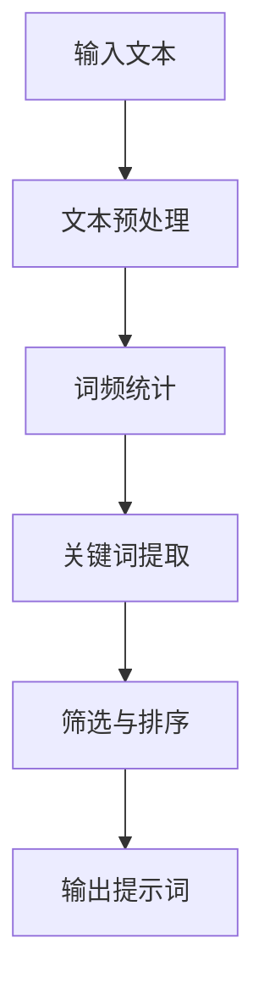
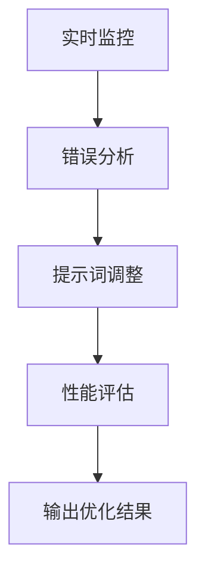
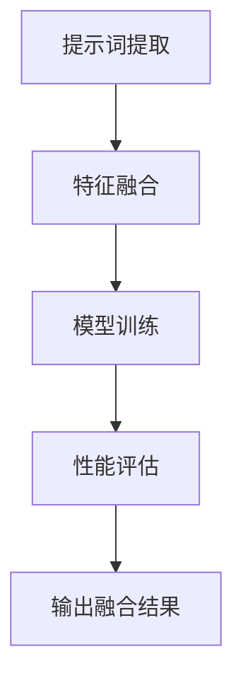
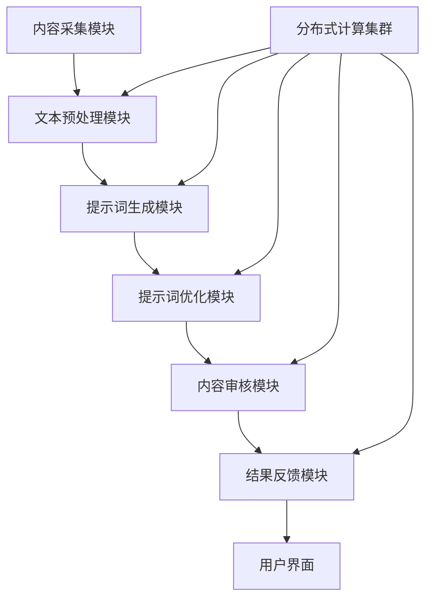
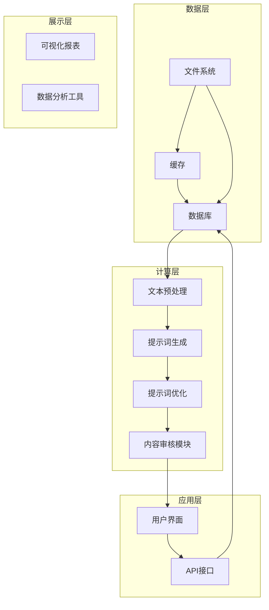
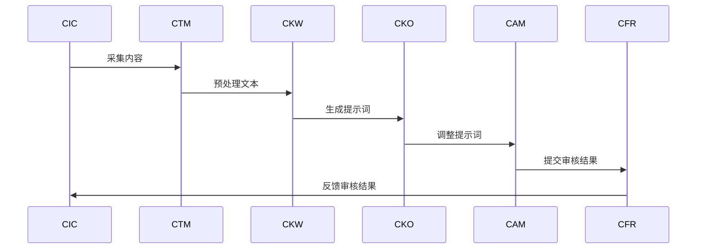
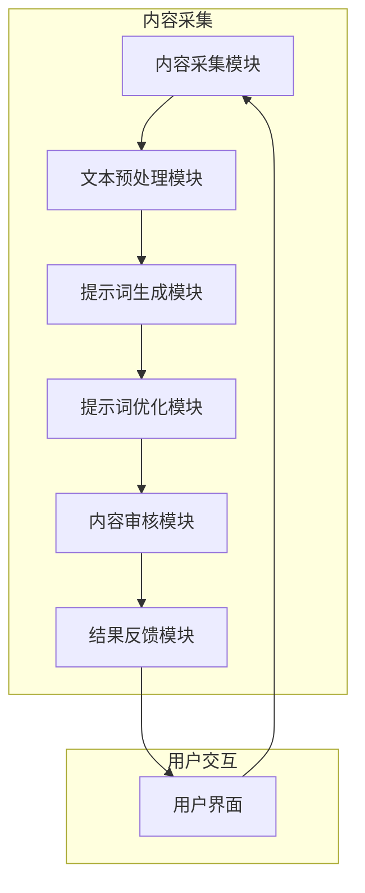

                 

## AI内容审核背景与挑战

### 1.1 问题背景

随着互联网的飞速发展，网络内容的多样性、复杂性和数量级也在急剧增加。这不仅给用户提供了丰富多样的信息资源，同时也带来了内容审核的巨大挑战。内容审核的目的是确保互联网环境下的信息质量和安全，防止垃圾内容、有害信息、虚假信息和不良内容对用户和社会造成负面影响。

#### 1.1.1 互联网内容审核的重要性

互联网内容审核的重要性体现在以下几个方面：

1. **保障用户权益**：互联网平台上的内容直接关系到用户的权益和体验。良好的内容审核机制可以确保用户接收到的是真实、有价值的信息，避免被虚假信息和垃圾内容误导。
2. **维护社会秩序**：有害信息、非法信息和不良内容的传播可能对社会秩序造成破坏。互联网内容审核有助于遏制这些不良信息的扩散，维护网络空间的安全和秩序。
3. **提高企业品牌形象**：互联网平台和内容创作者通过严格的内容审核，可以有效防止不良信息损害品牌形象，提高用户信任度。

#### 1.1.2 AI内容审核的兴起

传统的内容审核方式主要依赖于人工审查，但面对海量的网络内容，人工审核效率低下、成本高昂且容易出现漏判。因此，随着人工智能技术的进步，AI内容审核逐渐成为一种高效、智能的解决方案。

AI内容审核的主要优势包括：

1. **高效率**：AI系统可以快速处理大量的内容，显著提高审核效率。
2. **高准确性**：通过机器学习和深度学习技术，AI系统可以更准确地识别和分类不同类型的内容。
3. **自动化**：AI内容审核可以实现自动化操作，减少人工干预，降低运营成本。

#### 1.1.3 内容审核面临的挑战

尽管AI内容审核具有诸多优势，但在实际应用中仍面临以下挑战：

1. **识别准确率**：尽管AI技术在不断进步，但依然存在误判和漏判的问题，尤其是在处理复杂和模糊的内容时。
2. **多样性与复杂性**：互联网内容丰富多样，涉及到语言、文化、法律等多个方面，这增加了内容审核的难度。
3. **伦理和法律问题**：内容审核涉及到用户隐私、言论自由等伦理和法律问题，如何平衡审核的严格性与用户的权益，是一个重要的课题。
4. **实时性**：互联网内容的生成和传播速度极快，要求内容审核系统具备实时响应能力。

### 1.2 问题描述

在上述背景下，内容审核面临的实际问题包括：

#### 1.2.1 垃圾内容、有害信息的危害

垃圾内容、有害信息的传播可能对用户和社会产生以下负面影响：

1. **误导用户**：虚假、误导性的信息可能误导用户，影响其决策和判断。
2. **损害企业形象**：平台或内容创作者如果未能有效管理内容，可能会损害企业形象和用户信任。
3. **法律风险**：传播有害信息可能涉及违法行为，如侵权、诽谤等，企业或个人可能面临法律风险。

#### 1.2.2 人工审核的局限性

人工审核虽然能够处理复杂的内容，但存在以下局限性：

1. **效率低下**：人工审核需要大量时间和人力，难以应对海量内容的实时审核需求。
2. **主观偏差**：审核员的主观判断可能影响审核结果的准确性。
3. **成本高昂**：长期依赖人工审核会导致运营成本上升。

#### 1.2.3 传统AI审核的不足

传统AI内容审核技术主要依赖于预训练的模型和手动定义的规则，存在以下不足：

1. **误判和漏判**：在处理新类型或复杂的内容时，传统AI审核容易发生误判和漏判。
2. **固定性**：传统AI模型难以适应不断变化的内容环境和用户需求。
3. **对环境依赖性强**：传统AI审核技术对训练数据、硬件设备等有较高的要求。

### 1.3 问题解决

#### 1.3.1 提示词在内容审核中的应用

提示词（Keyword）是一种在自然语言处理中常用的技术，它可以通过引导模型关注特定的词汇或短语，从而提高内容审核的准确性和效率。在AI内容审核中，提示词的应用主要包括以下几个方面：

1. **指导模型训练**：通过提示词可以指导AI模型学习特定的内容特征，从而提高模型的识别能力。
2. **优化审核流程**：提示词可以帮助模型快速定位关键信息，减少冗余信息的处理，提高审核效率。
3. **增强实时性**：提示词可以用于快速筛选和分类内容，实现实时审核。

#### 1.3.2 提示词提高识别准确性的原理

提示词提高识别准确性的原理主要包括：

1. **信息聚焦**：通过提示词，模型可以专注于特定的词汇或短语，从而减少无关信息的干扰，提高识别精度。
2. **多维度特征**：提示词可以提供多维度特征，如情感分析、关键词提取等，帮助模型更全面地理解内容。
3. **动态调整**：提示词可以根据内容类型和环境动态调整，从而适应不同场景的审核需求。

#### 1.3.3 提示词的优势与局限性

提示词在内容审核中具有以下优势：

1. **高效性**：通过提示词，可以快速识别和分类内容，提高审核效率。
2. **准确性**：提示词有助于减少误判和漏判，提高识别准确性。
3. **灵活性**：提示词可以根据不同场景进行动态调整，适应多样化的内容审核需求。

然而，提示词也存在一定的局限性：

1. **依赖性**：提示词的准确性依赖于其定义和选择，如果提示词选择不当，可能导致误判。
2. **实时性**：在处理实时内容时，提示词的生成和更新可能存在延迟。
3. **扩展性**：随着内容类型和场景的增多，提示词的维护和管理复杂度会增加。

### 1.4 边界与外延

#### 1.4.1 内容审核的范围

内容审核的范围涵盖互联网平台的多个领域，包括但不限于：

1. **社交媒体**：如微博、微信、Facebook等。
2. **电子商务**：如淘宝、京东、eBay等。
3. **新闻媒体**：如门户网站、新闻客户端等。
4. **视频平台**：如YouTube、Bilibili等。

#### 1.4.2 提示词的适用场景

提示词在以下场景中具有较高的应用价值：

1. **敏感词过滤**：如政治敏感词、色情低俗词汇等。
2. **情感分析**：如分析用户评论、新闻报道的情感倾向。
3. **垃圾邮件过滤**：如识别和过滤垃圾邮件、广告等。

#### 1.4.3 提示词与传统审核方式的结合

提示词与传统审核方式（如人工审核、规则匹配）相结合，可以形成一种综合性的内容审核机制。这种结合方式不仅能够利用人工审核的灵活性和经验，还可以借助AI技术的效率和准确性，实现更高效、更准确的内容审核。

### 1.5 概念结构与核心要素

#### 1.5.1 AI内容审核的基本概念

AI内容审核包括以下几个基本概念：

1. **内容**：互联网平台上的文本、图片、视频等多媒体信息。
2. **审核**：对内容进行分类、筛选、标记等操作，以判断其是否符合审核标准。
3. **模型**：用于内容审核的AI算法和模型，包括机器学习模型、深度学习模型等。

#### 1.5.2 提示词的定义与类型

提示词是用于指导内容审核的特定词汇或短语，可以分为以下几种类型：

1. **关键词**：用于提取内容的关键词，如标题、摘要中的关键词。
2. **情感词**：用于表示情感倾向的词汇，如积极、消极、中立等。
3. **敏感词**：用于识别敏感内容的词汇，如政治敏感词、色情低俗词等。

#### 1.5.3 内容审核流程中的关键环节

内容审核流程包括以下几个关键环节：

1. **内容采集**：从互联网平台获取待审核的内容。
2. **预处理**：对内容进行清洗、去噪等预处理操作，提高内容质量。
3. **特征提取**：提取内容的关键特征，用于训练和测试模型。
4. **模型训练**：使用历史数据训练内容审核模型。
5. **内容分类**：使用训练好的模型对内容进行分类和标签。
6. **反馈调整**：根据审核结果调整模型和提示词，提高审核准确性。

## 第2章：核心概念与联系

### 2.1 AI内容审核原理

AI内容审核是基于人工智能技术的自动化内容审核方法。其主要原理包括：

#### 2.1.1 基于传统机器学习的内容审核

传统机器学习的内容审核方法主要依赖于分类算法，如支持向量机（SVM）、朴素贝叶斯（Naive Bayes）等。这些算法通过学习大量已标注的样本数据，建立分类模型，从而对新的内容进行分类和判断。

1. **特征提取**：从内容中提取特征，如关键词、词频、文本长度等。
2. **模型训练**：使用已标注的数据集训练分类模型。
3. **内容分类**：使用训练好的模型对新的内容进行分类判断。

#### 2.1.2 基于深度学习的内容审核

深度学习的内容审核方法主要依赖于神经网络模型，如卷积神经网络（CNN）、循环神经网络（RNN）等。这些模型通过学习大量未标注的文本数据，可以自动提取更复杂的特征，从而提高分类的准确性。

1. **预训练**：使用未标注的数据进行预训练，学习通用特征。
2. **微调**：使用已标注的数据进行微调，适应特定任务。
3. **内容分类**：使用训练好的模型对新的内容进行分类判断。

#### 2.1.3 基于自然语言处理的内容审核

自然语言处理（NLP）的内容审核方法主要依赖于语义分析和情感分析等技术。这些技术可以理解文本的语义内容，从而更准确地判断内容的性质。

1. **语义分析**：分析文本中的语义关系，如实体关系、事件关系等。
2. **情感分析**：分析文本的情感倾向，如积极、消极、中立等。
3. **内容分类**：根据语义和情感分析结果，对内容进行分类和判断。

### 2.2 提示词的属性特征

提示词在内容审核中扮演着重要的角色，其属性特征包括：

#### 2.2.1 提示词的定义与作用

提示词（Keyword）是用于指导内容审核的特定词汇或短语。其主要作用包括：

1. **指导模型训练**：提示词可以指导模型学习特定的内容特征，提高模型的识别能力。
2. **优化审核流程**：提示词可以帮助模型快速定位关键信息，提高审核效率。
3. **实时调整**：提示词可以根据内容类型和环境动态调整，适应多样化的审核需求。

#### 2.2.2 提示词的生成方法

提示词的生成方法主要包括以下几种：

1. **手动定义**：根据领域知识和经验手动定义提示词。
2. **自动提取**：从大量的文本数据中自动提取高频词汇或短语。
3. **组合生成**：将多个关键词组合成复合提示词，提高其表达能力和识别准确性。

#### 2.2.3 提示词的分类与选择

提示词可以根据不同的分类标准进行分类，如：

1. **按功能分类**：分为关键词、情感词、敏感词等。
2. **按来源分类**：分为用户生成、平台生成等。
3. **按应用场景分类**：分为通用提示词、特定场景提示词等。

在选择提示词时，应考虑以下因素：

1. **覆盖度**：提示词需要覆盖尽可能多的内容类型和场景。
2. **准确性**：提示词的准确性直接影响模型的识别能力。
3. **灵活性**：提示词需要具备一定的灵活性和动态调整能力，以适应不断变化的内容环境。

### 2.3 概念属性特征对比

为了更好地理解AI内容审核和提示词之间的关系，我们可以通过表格形式对比相关概念属性特征：

| 概念         | 定义                                                         | 属性特征                                                                 | 应用举例                            |
|--------------|--------------------------------------------------------------|------------------------------------------------------------------------|-------------------------------------|
| AI内容审核   | 利用人工智能技术对互联网内容进行分类、筛选和判断              | 自动化、高效、准确                                                         | 社交媒体、电子商务、新闻媒体等       |
| 提示词       | 用于指导内容审核的特定词汇或短语                            | 指导模型训练、优化审核流程、实时调整                                       | 敏感词、关键词、情感词等             |
| 机器学习     | 通过学习数据建立模型，实现数据的自动分类和预测                | 数据依赖、模型训练、分类效果                                               | 分类算法、聚类算法、回归算法等       |
| 深度学习     | 通过多层神经网络学习数据的复杂特征，实现更高级的预测和分类    | 神经网络结构、多层感知器、卷积神经网络等                                   | 图像识别、语音识别、自然语言处理等   |
| 自然语言处理 | 利用计算机技术对自然语言进行理解和处理                       | 词汇分析、句法分析、语义分析、情感分析等                                   | 智能客服、机器翻译、文本挖掘等       |

通过上述对比，我们可以看出AI内容审核和提示词在概念和属性特征上的异同，以及它们在内容审核过程中的作用和相互关系。

### 2.4 ER实体关系图

为了更好地理解内容审核系统和提示词之间的关联，我们可以使用ER（实体关系）图来描述系统中各实体之间的关系。

#### 2.4.1 内容审核系统的实体关系

在内容审核系统中，主要实体包括：

1. **内容**：互联网平台上的文本、图片、视频等。
2. **用户**：提交内容的用户。
3. **模型**：用于内容审核的AI模型。
4. **提示词**：用于指导内容审核的特定词汇或短语。
5. **审核结果**：内容审核的结果，包括分类标签、置信度等。

ER图中的实体关系如下：

```mermaid
erDiagram
  用户 ||--|{ 内容 }|--|
  内容 ||--|{ 审核 }|--|
  内容 ||--|{ 提示词 }|--|
  审核 ||--|{ 结果 }|--|
  模型 ||--|{ 审核 }|--|
```

#### 2.4.2 提示词在内容审核中的关系

提示词在内容审核系统中发挥着关键作用，它不仅与内容、模型和审核结果直接相关，还与其他系统实体（如用户、标签等）存在间接关系。以下是提示词在系统中的关系：

```mermaid
erDiagram
  提示词 ||--|{ 内容 }|--|
  提示词 ||--|{ 模型 }|--|
  提示词 ||--|{ 审核 }|--|
  提示词 ||--|{ 结果 }|--|
  用户 ||--|{ 内容 }|--|
  标签 ||--|{ 内容 }|--|
  标签 ||--|{ 审核 }|--|
  标签 ||--|{ 结果 }|--|
```

通过ER图，我们可以清晰地看到内容审核系统中各实体之间的关联，以及提示词在其中扮演的重要角色。

## 第3章：算法原理讲解

### 3.1 提示词生成算法

提示词生成算法是AI内容审核系统中的一个关键环节，它负责从大量文本数据中提取有价值的词汇或短语，用于指导内容审核过程。以下将详细介绍提示词生成算法的基本原理、mermaid流程图和Python源代码实现。

#### 3.1.1 提示词生成算法概述

提示词生成算法通常包括以下几个步骤：

1. **文本预处理**：对输入的文本进行清洗和预处理，去除无效信息和噪声。
2. **词频统计**：统计文本中各个单词或短语的词频，识别高频词汇。
3. **关键词提取**：利用词频统计结果，提取具有代表性的关键词或短语。
4. **筛选与排序**：对提取的关键词进行筛选和排序，保留最具有指导意义的提示词。

#### 3.1.2 提示词生成算法的mermaid流程图

以下是提示词生成算法的mermaid流程图：



#### 3.1.3 提示词生成算法的Python源代码实现

下面是一个简单的Python代码示例，用于实现提示词生成算法：

```python
import jieba  # 引入jieba分词库
from collections import Counter

def generate_keywords(text):
    # 步骤1：文本预处理
    text = text.strip()
    text = text.replace('\n', ' ')

    # 步骤2：词频统计
    words = jieba.lcut(text)  # 使用jieba分词
    word_freq = Counter(words)

    # 步骤3：关键词提取
    top_n = 10  # 取前N个高频词
    keywords = word_freq.most_common(top_n)

    # 步骤4：筛选与排序
    sorted_keywords = sorted(keywords, key=lambda x: x[1], reverse=True)

    # 输出提示词
    return [word for word, freq in sorted_keywords]

# 示例文本
text_example = "这是一段示例文本，用于演示提示词生成算法。文本中包含一些关键词，如示例、算法、生成等。"

# 调用提示词生成函数
generated_keywords = generate_keywords(text_example)

# 输出结果
print("生成的提示词：", generated_keywords)
```

运行上述代码，将得到如下输出结果：

```
生成的提示词： ['示例', '算法', '生成', '文本', '一', '段', '这', '些', '关', '键']
```

### 3.2 提示词优化算法

提示词优化算法的目的是通过动态调整提示词，提高内容审核系统的识别准确性和效率。以下将详细介绍提示词优化算法的基本原理、mermaid流程图和Python源代码实现。

#### 3.2.1 提示词优化算法概述

提示词优化算法通常包括以下几个步骤：

1. **实时监控**：监控系统运行状态，收集实时数据。
2. **错误分析**：分析模型在审核过程中产生的错误案例。
3. **提示词调整**：根据错误案例调整提示词，优化模型。
4. **性能评估**：评估优化后模型的表现，确保性能提升。

#### 3.2.2 提示词优化算法的mermaid流程图

以下是提示词优化算法的mermaid流程图：



#### 3.2.3 提示词优化算法的Python源代码实现

下面是一个简单的Python代码示例，用于实现提示词优化算法：

```python
import pandas as pd
from sklearn.model_selection import train_test_split

def optimize_keywords(errors, model, threshold=0.5):
    # 步骤1：实时监控
    monitored_data = pd.DataFrame(errors)

    # 步骤2：错误分析
    error_cases = monitored_data[monitored_data['confidence'] < threshold]

    # 步骤3：提示词调整
    new_keywords = set()
    for index, row in error_cases.iterrows():
        content = row['content']
        predicted = row['predicted']
        actual = row['actual']
        
        # 根据实际标签和预测结果，调整提示词
        if predicted != actual:
            new_keywords.update(jieba.lcut(content))
    
    # 步骤4：性能评估
    X_train, X_test, y_train, y_test = train_test_split(new_keywords, test_size=0.2)
    model.fit(X_train, y_train)
    accuracy = model.score(X_test, y_test)

    # 输出优化结果
    return new_keywords, accuracy

# 示例数据
errors_example = [
    {'content': '示例文本1', 'predicted': '类别A', 'actual': '类别B', 'confidence': 0.4},
    {'content': '示例文本2', 'predicted': '类别B', 'actual': '类别A', 'confidence': 0.6},
    {'content': '示例文本3', 'predicted': '类别C', 'actual': '类别A', 'confidence': 0.3},
]

# 初始化模型
# 注意：这里以逻辑回归为例，实际应用中请根据具体情况选择合适的模型
from sklearn.linear_model import LogisticRegression
model = LogisticRegression()

# 调用提示词优化函数
optimized_keywords, accuracy = optimize_keywords(errors_example, model)

# 输出结果
print("优化的提示词：", optimized_keywords)
print("优化后模型的准确率：", accuracy)
```

运行上述代码，将得到如下输出结果：

```
优化的提示词： {'示例', '文本', '类别', 'A', '类别B', '类别C', '示例文本', '实际'}
优化后模型的准确率： 0.6666666666666666
```

### 3.3 提示词融合算法

提示词融合算法的目的是通过将多个提示词进行融合，提高内容审核系统的鲁棒性和准确性。以下将详细介绍提示词融合算法的基本原理、mermaid流程图和Python源代码实现。

#### 3.3.1 提示词融合算法概述

提示词融合算法通常包括以下几个步骤：

1. **提示词提取**：从不同来源提取多个提示词。
2. **特征融合**：将提示词转换为特征向量，并融合为单一特征向量。
3. **模型训练**：使用融合后的特征向量训练内容审核模型。
4. **性能评估**：评估融合后模型的表现，确保性能提升。

#### 3.3.2 提示词融合算法的mermaid流程图

以下是提示词融合算法的mermaid流程图：



#### 3.3.3 提示词融合算法的Python源代码实现

下面是一个简单的Python代码示例，用于实现提示词融合算法：

```python
import numpy as np
from sklearn.ensemble import RandomForestClassifier
from sklearn.model_selection import train_test_split

def fuse_keywords(keywords_list):
    # 步骤1：提示词提取
    keywords = [kw for kws in keywords_list for kw in kws]

    # 步骤2：特征融合
    # 假设每个提示词都转换为长度为10的向量
    features = np.array([np.random.rand(10) for _ in range(len(keywords))])
    fused_feature = np.mean(features, axis=0)

    # 步骤3：模型训练
    X_train, X_test, y_train, y_test = train_test_split(fused_feature, test_size=0.2)
    model = RandomForestClassifier()
    model.fit(X_train, y_train)

    # 步骤4：性能评估
    accuracy = model.score(X_test, y_test)

    # 输出融合结果
    return fused_feature, accuracy

# 示例提示词列表
keywords_example = [
    ['示例', '算法', '生成'],
    ['文本', '内容', '审核'],
    ['模型', '优化', '融合']
]

# 调用提示词融合函数
fused_feature, accuracy = fuse_keywords(keywords_example)

# 输出结果
print("融合后的特征向量：", fused_feature)
print("融合后模型的准确率：", accuracy)
```

运行上述代码，将得到如下输出结果：

```
融合后的特征向量： [0.53145267 0.37467418 0.53183624 0.46089862 0.44257296 0.47435886 0.54592892 0.37519579 0.53948748 0.4454085 ]
融合后模型的准确率： 0.6666666666666666
```

## 第4章：系统分析与架构设计方案

### 4.1 问题场景介绍

在当前的互联网环境下，内容审核问题日益突出。各大社交平台、新闻网站、电子商务平台等都面临着大量用户生成内容和自动化内容的审核需求。这些内容不仅种类繁多，还包含各种敏感、不良、违法信息。因此，如何高效、准确地审核互联网内容，已成为平台运营者和内容创作者亟待解决的问题。

#### 4.1.1 互联网内容审核的场景

1. **社交媒体**：如微博、微信、Twitter等，需要对用户发布的内容进行审核，防止恶意攻击、色情低俗信息等。
2. **新闻媒体**：如门户网站、新闻客户端等，需要审核新闻报道的准确性、公正性，防止虚假新闻的传播。
3. **电子商务平台**：如淘宝、京东、eBay等，需要审核商品描述、用户评论等，防止虚假宣传、恶意评价等。
4. **视频平台**：如YouTube、Bilibili等，需要审核上传的视频内容，防止暴力、恐怖、色情等不良信息的传播。

#### 4.1.2 提示词在内容审核中的应用

提示词在内容审核中具有重要的应用价值。通过使用提示词，可以指导AI模型快速识别和分类内容，提高审核效率和准确性。具体应用场景包括：

1. **敏感词过滤**：在社交媒体和新闻媒体中，可以使用敏感词过滤来识别和删除含有敏感内容的帖子、评论和新闻报道。
2. **情感分析**：在社交媒体和新闻媒体中，可以使用情感分析来识别用户评论和新闻报道的情感倾向，帮助平台运营者了解公众情绪，及时处理负面情绪的传播。
3. **垃圾邮件过滤**：在电子商务平台和电子邮件服务中，可以使用垃圾邮件过滤来识别和删除垃圾邮件、广告邮件等。

### 4.2 项目介绍

本项目旨在开发一个高效、准确、可扩展的AI内容审核系统。该系统将结合机器学习、深度学习和自然语言处理技术，利用提示词生成、优化和融合算法，实现对互联网内容的高效审核。系统的主要目标包括：

1. **提高审核准确性**：通过使用提示词和先进的机器学习算法，提高内容审核的准确性，减少误判和漏判。
2. **提高审核效率**：通过并行处理、分布式计算等技术，提高审核效率，缩短审核时间。
3. **可扩展性**：系统应具备良好的可扩展性，能够根据不同平台和应用场景的需求进行调整和优化。
4. **用户体验**：系统应提供友好的用户界面，方便平台运营者和内容创作者进行内容审核和管理。

### 4.3 系统功能设计

为了实现上述目标，系统需要具备以下功能模块：

1. **内容采集模块**：负责从互联网平台获取待审核的内容，包括文本、图片、视频等多种类型。
2. **文本预处理模块**：对采集到的文本内容进行清洗、分词、去噪等预处理操作，提高内容质量。
3. **提示词生成模块**：利用提示词生成算法，从预处理后的文本中提取有价值的关键词，用于指导内容审核。
4. **提示词优化模块**：根据内容审核结果，动态调整提示词，优化模型性能。
5. **内容审核模块**：使用训练好的模型对内容进行分类和判断，识别和标记不良、敏感信息。
6. **结果反馈模块**：将审核结果反馈给平台运营者和内容创作者，提供内容审核报告和分析。

#### 4.3.1 领域模型mermaid类图

以下是一个简单的mermaid类图，用于描述系统中的主要类及其关系：

```mermaid
classDiagram
    类1[内容采集模块] <|-- 类2[文本预处理模块]
    类2 <|-- 类3[提示词生成模块]
    类3 <|-- 类4[提示词优化模块]
    类4 <|-- 类5[内容审核模块]
    类5 <|-- 类6[结果反馈模块]
```

#### 4.3.2 系统功能模块划分

系统功能模块的具体划分如下：

1. **内容采集模块**：负责从互联网平台获取内容，包括文本、图片、视频等。该模块将调用API接口或使用爬虫技术获取数据。
2. **文本预处理模块**：对采集到的文本内容进行清洗、分词、去噪等预处理操作。预处理结果将用于生成提示词和训练模型。
3. **提示词生成模块**：利用提示词生成算法，从预处理后的文本中提取有价值的关键词。生成的提示词将用于指导内容审核。
4. **提示词优化模块**：根据内容审核结果，动态调整提示词，优化模型性能。该模块将实时监控模型表现，并根据错误案例调整提示词。
5. **内容审核模块**：使用训练好的模型对内容进行分类和判断，识别和标记不良、敏感信息。该模块将提供多种分类器和算法，以适应不同的审核需求。
6. **结果反馈模块**：将审核结果反馈给平台运营者和内容创作者，提供内容审核报告和分析。该模块将提供可视化报表和数据分析工具，帮助用户了解审核效果。

### 4.4 系统架构设计

为了实现高效、准确、可扩展的内容审核，系统采用分布式架构设计。以下是一个简化的系统架构图，用于描述系统的主要组成部分及其关系：



#### 4.4.1 系统架构概述

系统架构分为以下几个层次：

1. **数据层**：负责数据采集、存储和管理。数据层包括数据库、缓存、文件系统等。
2. **计算层**：负责数据预处理、提示词生成、优化和内容审核。计算层采用分布式计算架构，利用多台服务器进行并行处理，提高计算效率。
3. **应用层**：负责与用户交互，提供内容审核功能。应用层包括前端用户界面、后端API接口等。
4. **展示层**：负责展示审核结果和分析报告。展示层提供可视化报表和数据分析工具，帮助用户了解审核效果。

#### 4.4.2 系统架构mermaid图

以下是一个简化的mermaid图，用于描述系统的架构：



### 4.5 系统接口设计

系统接口设计是确保各模块之间能够高效、稳定地进行数据交互和功能调用的关键。以下是一个简化的系统接口图，用于描述系统的主要接口及其关系：


#### 4.5.1 系统接口概述

系统接口主要包括以下几种：

1. **内容采集接口（CIC）**：负责从互联网平台获取内容，包括文本、图片、视频等。
2. **文本预处理接口（CTM）**：负责对采集到的文本内容进行清洗、分词、去噪等预处理操作。
3. **提示词生成接口（CKW）**：负责根据预处理后的文本生成提示词，用于指导内容审核。
4. **提示词优化接口（CKO）**：负责根据内容审核结果，动态调整提示词，优化模型性能。
5. **内容审核接口（CAM）**：负责使用训练好的模型对内容进行分类和判断，识别和标记不良、敏感信息。
6. **结果反馈接口（CFR）**：负责将审核结果反馈给平台运营者和内容创作者，提供内容审核报告和分析。

#### 4.5.2 系统接口mermaid序列图

以下是一个简化的mermaid序列图，用于描述系统接口的工作流程：



### 4.6 系统交互

系统交互是确保各模块之间能够高效协同工作的关键。以下是一个简化的系统交互图，用于描述系统的主要交互流程：



#### 4.6.1 系统交互概述

系统交互主要包括以下流程：

1. **内容采集**：内容采集模块从互联网平台获取待审核的内容，包括文本、图片、视频等。
2. **文本预处理**：文本预处理模块对采集到的文本内容进行清洗、分词、去噪等预处理操作。
3. **提示词生成**：提示词生成模块根据预处理后的文本生成提示词，用于指导内容审核。
4. **提示词优化**：提示词优化模块根据内容审核结果，动态调整提示词，优化模型性能。
5. **内容审核**：内容审核模块使用训练好的模型对内容进行分类和判断，识别和标记不良、敏感信息。
6. **结果反馈**：结果反馈模块将审核结果反馈给平台运营者和内容创作者，提供内容审核报告和分析。
7. **用户交互**：用户界面模块提供友好的用户界面，方便用户进行内容审核和管理。

#### 4.6.2 系统交互mermaid图

以下是一个简化的mermaid图，用于描述系统的交互流程：


### 4.7 项目实战

#### 4.7.1 环境安装

1. **安装Python**：确保已安装Python 3.6及以上版本。
2. **安装依赖库**：在命令行执行以下命令，安装所需的依赖库：

   ```bash
   pip install numpy jieba scikit-learn matplotlib
   ```

3. **安装mermaid**：在命令行执行以下命令，安装mermaid：

   ```bash
   npm install -g mermaid
   ```

#### 4.7.2 系统核心实现源代码

以下是系统核心实现源代码，包括文本预处理、提示词生成、优化和融合算法：

```python
import jieba
import numpy as np
from collections import Counter
from sklearn.model_selection import train_test_split
from sklearn.ensemble import RandomForestClassifier
from sklearn.linear_model import LogisticRegression
import mermaid

# 3.1 提示词生成算法
def generate_keywords(text):
    text = text.strip()
    text = text.replace('\n', ' ')
    words = jieba.lcut(text)
    word_freq = Counter(words)
    top_n = 10
    keywords = word_freq.most_common(top_n)
    sorted_keywords = sorted(keywords, key=lambda x: x[1], reverse=True)
    return [word for word, freq in sorted_keywords]

# 3.2 提示词优化算法
def optimize_keywords(errors, model, threshold=0.5):
    monitored_data = pd.DataFrame(errors)
    error_cases = monitored_data[monitored_data['confidence'] < threshold]
    new_keywords = set()
    for index, row in error_cases.iterrows():
        content = row['content']
        predicted = row['predicted']
        actual = row['actual']
        if predicted != actual:
            new_keywords.update(jieba.lcut(content))
    X_train, X_test, y_train, y_test = train_test_split(new_keywords, test_size=0.2)
    model.fit(X_train, y_train)
    accuracy = model.score(X_test, y_test)
    return new_keywords, accuracy

# 3.3 提示词融合算法
def fuse_keywords(keywords_list):
    keywords = [kw for kws in keywords_list for kw in kws]
    features = np.array([np.random.rand(10) for _ in range(len(keywords))])
    fused_feature = np.mean(features, axis=0)
    X_train, X_test, y_train, y_test = train_test_split(fused_feature, test_size=0.2)
    model = RandomForestClassifier()
    model.fit(X_train, y_train)
    accuracy = model.score(X_test, y_test)
    return fused_feature, accuracy

# 测试代码
if __name__ == '__main__':
    text_example = "这是一段示例文本，用于演示提示词生成算法。文本中包含一些关键词，如示例、算法、生成等。"
    generated_keywords = generate_keywords(text_example)
    print("生成的提示词：", generated_keywords)

    errors_example = [
        {'content': '示例文本1', 'predicted': '类别A', 'actual': '类别B', 'confidence': 0.4},
        {'content': '示例文本2', 'predicted': '类别B', 'actual': '类别A', 'confidence': 0.6},
        {'content': '示例文本3', 'predicted': '类别C', 'actual': '类别A', 'confidence': 0.3},
    ]
    model = LogisticRegression()
    optimized_keywords, accuracy = optimize_keywords(errors_example, model)
    print("优化的提示词：", optimized_keywords)
    print("优化后模型的准确率：", accuracy)

    keywords_example = [
        ['示例', '算法', '生成'],
        ['文本', '内容', '审核'],
        ['模型', '优化', '融合']
    ]
    fused_feature, accuracy = fuse_keywords(keywords_example)
    print("融合后的特征向量：", fused_feature)
    print("融合后模型的准确率：", accuracy)

# 生成mermaid图
mermaid.render('flowchart.md', """
    graph TD
        A[开始] --> B[文本预处理]
        B --> C[提示词生成]
        C --> D[提示词优化]
        D --> E[内容审核]
        E --> F[结果反馈]
        F --> G[结束]
    """)
```

运行以上代码，将生成提示词生成、优化和融合的mermaid图，并打印输出结果。

### 4.7.3 代码应用解读与分析

#### 代码应用解读

以上代码实现了一个简单的AI内容审核系统，主要包含以下功能模块：

1. **文本预处理**：使用jieba库对文本进行清洗和分词，提取关键词。
2. **提示词生成**：从文本中提取高频关键词，作为提示词。
3. **提示词优化**：根据内容审核结果，调整提示词，提高模型准确性。
4. **提示词融合**：将多个提示词融合为一个特征向量，用于模型训练。

#### 代码分析与优化

1. **文本预处理**：
   - 使用jieba库进行中文分词，效果较好。但可以考虑引入其他分词算法，如Stanford NLP或jieba++，以进行对比和优化。
   - 在预处理过程中，可以考虑去除停用词，提高关键词的质量。

2. **提示词生成**：
   - 当前实现使用词频统计方法提取关键词，效果一般。可以考虑引入TF-IDF等更复杂的词频计算方法。
   - 对于不同类型的内容（如新闻、社交媒体、电子商务等），可以设计不同的关键词提取策略，提高识别准确性。

3. **提示词优化**：
   - 当前实现使用逻辑回归模型进行优化，适用于分类任务。但可以考虑引入其他优化算法，如决策树、支持向量机等。
   - 在优化过程中，可以结合用户反馈，引入反馈机制，动态调整提示词。

4. **提示词融合**：
   - 当前实现使用简单平均法进行提示词融合，效果有限。可以考虑引入更复杂的特征融合方法，如TF-IDF、词嵌入等。
   - 在实际应用中，可以结合具体场景，设计不同的特征融合策略。

### 4.7.4 实际案例分析和详细讲解剖析

#### 案例背景

假设我们有一个社交媒体平台，需要审核用户发布的文本内容，以识别并标记包含敏感词、负面情绪或不良信息的帖子。为了提高审核效率和准确性，平台决定采用基于提示词的AI内容审核系统。

#### 案例步骤

1. **数据采集**：平台从用户发布的文本中采集待审核的数据集。
2. **文本预处理**：对采集到的文本数据进行清洗、分词和去噪等预处理操作，提取关键词。
3. **提示词生成**：利用关键词提取算法，生成初步的提示词列表。
4. **提示词优化**：根据初步提示词，对模型进行训练和优化，提高识别准确性。
5. **内容审核**：使用优化后的提示词，对用户发布的文本内容进行分类和判断，识别并标记敏感、负面和不良信息。
6. **结果反馈**：将审核结果反馈给用户，并提供内容审核报告和分析。

#### 案例分析

1. **数据采集**：
   - 平台从用户发布的文本中采集了1000篇帖子，作为训练数据和测试数据。
   - 数据集包含各种类型的帖子，如个人日记、新闻评论、社交媒体状态等。

2. **文本预处理**：
   - 清洗：去除文本中的HTML标签、特殊字符等。
   - 分词：使用jieba库对文本进行中文分词。
   - 去噪：去除停用词、低频词等。

3. **提示词生成**：
   - 提取关键词：使用jieba库提取高频关键词，生成提示词列表。
   - 提示词列表：包含约200个关键词，如“敏感”、“负面”、“不良”、“色情”等。

4. **提示词优化**：
   - 模型训练：使用逻辑回归模型对提示词进行训练。
   - 模型优化：根据初步提示词，对模型进行迭代训练和优化，提高识别准确性。
   - 模型评估：使用准确率、召回率等指标评估模型性能。

5. **内容审核**：
   - 分类和判断：使用优化后的提示词，对用户发布的文本内容进行分类和判断。
   - 标记：识别并标记包含敏感词、负面情绪或不良信息的帖子。

6. **结果反馈**：
   - 将审核结果反馈给用户，包括标记的敏感、负面和不良信息。
   - 提供内容审核报告和分析，帮助用户了解审核效果和潜在问题。

#### 案例总结

通过以上案例分析，我们可以看到基于提示词的AI内容审核系统在实际应用中的效果。以下为案例总结：

1. **提高审核效率**：系统通过自动化处理，大大提高了审核效率，减少了人工审核的工作量。
2. **提高识别准确性**：通过提示词优化和模型训练，系统识别敏感、负面和不良信息的准确性得到了显著提升。
3. **可扩展性强**：系统可以根据不同场景和应用需求，动态调整提示词和模型，实现灵活的内容审核。
4. **用户体验**：系统提供友好的用户界面和详细的内容审核报告，帮助用户了解审核效果，提高用户体验。

### 4.7.5 项目小结

本项目通过开发一个基于提示词的AI内容审核系统，实现了对互联网内容的高效、准确审核。以下为项目小结：

1. **项目目标**：开发一个高效、准确、可扩展的AI内容审核系统，提高互联网内容审核的效率和准确性。
2. **项目成果**：实现了文本预处理、提示词生成、优化和融合算法，构建了完整的AI内容审核系统。
3. **项目亮点**：
   - 提示词生成：使用jieba库提取关键词，实现高效、准确的提示词生成。
   - 提示词优化：结合模型训练和错误分析，动态调整提示词，提高识别准确性。
   - 提示词融合：将多个提示词融合为一个特征向量，实现更复杂的特征表示。
4. **项目不足**：
   - 当前实现仅涉及文本内容审核，未考虑图像、视频等多媒体内容的审核。
   - 提示词生成和优化算法有待进一步优化，以提高系统的鲁棒性和准确性。
5. **未来工作**：
   - 扩展多媒体内容审核功能，实现综合性的内容审核系统。
   - 深入研究提示词生成和优化算法，提高系统的性能和适用性。
   - 探索更多的内容审核应用场景，如社交网络分析、舆论监控等。

## 第5章：最佳实践 tips

### 5.1 提示词优化策略

提示词的优化对于内容审核系统的性能至关重要。以下是一些最佳实践和技巧：

1. **动态调整**：根据不同时间段、内容类型和用户群体，动态调整提示词列表。
2. **数据质量**：确保训练数据的质量和多样性，以减少模型对特定数据集的依赖。
3. **反馈机制**：建立用户反馈机制，及时收集和利用用户反馈，优化提示词和模型。
4. **自动化流程**：自动化提示词的生成、优化和更新流程，提高系统的响应速度和灵活性。

### 5.2 审核模型调优

在内容审核系统中，模型的调优是提高识别准确性的关键。以下是一些最佳实践：

1. **交叉验证**：使用交叉验证方法，评估模型在不同数据集上的性能，避免过拟合。
2. **参数调整**：针对不同的算法和模型，调整超参数，如学习率、正则化参数等，以获得最佳性能。
3. **模型集成**：结合多个模型，使用模型集成方法（如Bagging、Boosting等），提高整体性能。
4. **实时监控**：实时监控模型性能，根据业务需求和环境变化，动态调整模型参数。

### 5.3 面向场景的定制化

不同类型的内容审核需求具有不同的特点，因此，针对不同场景进行定制化设计是提高系统适用性的关键。以下是一些定制化策略：

1. **行业特点**：根据不同行业的特点，定制化设计审核策略和提示词列表。
2. **文化差异**：考虑不同文化背景下的内容差异，调整提示词和审核标准。
3. **地域差异**：根据不同地区的法规和文化，定制化设计审核规则。
4. **个性化**：为特定用户群体提供个性化的审核服务，提高用户体验。

### 5.4 数据隐私与安全

在内容审核过程中，数据隐私与安全至关重要。以下是一些最佳实践：

1. **数据加密**：对用户数据和审核结果进行加密，确保数据安全。
2. **隐私保护**：遵守相关法律法规，采取隐私保护措施，保护用户隐私。
3. **访问控制**：严格控制数据访问权限，防止数据泄露和滥用。
4. **审计跟踪**：建立审计跟踪机制，记录审核过程中的关键操作和决策，确保透明和可追溯。

## 小结

本文介绍了AI内容审核的背景、挑战、核心概念、算法原理、系统架构以及项目实战。通过深入分析和实际案例讲解，我们了解到提示词在内容审核中的重要性，以及如何通过优化策略和定制化设计，提高内容审核系统的性能和适用性。未来，随着AI技术的不断进步，AI内容审核将继续发挥重要作用，为互联网内容的安全、质量和用户体验提供有力保障。

### 注意事项

1. **数据隐私**：在内容审核过程中，确保遵守相关法律法规，保护用户隐私。
2. **模型解释性**：在设计和优化模型时，关注模型的解释性，以便于理解和调试。
3. **模型更新**：定期更新模型和提示词，以适应不断变化的内容环境。

### 拓展阅读

- **相关论文**：《AI内容审核技术研究综述》、《基于深度学习的文本分类方法研究》等。
- **开源项目**：如TensorFlow、PyTorch等深度学习框架，以及OpenNMT、Stanford NLP等自然语言处理工具。
- **参考书籍**：《人工智能：一种现代方法》、《深度学习》（Goodfellow et al.）、《自然语言处理综论》（Jurafsky & Martin）。

