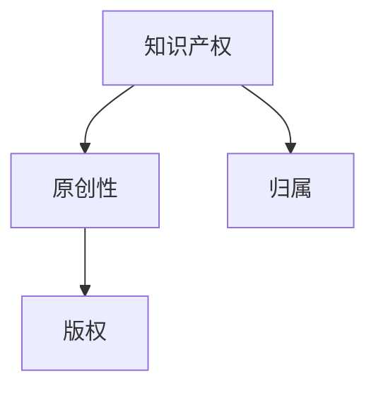
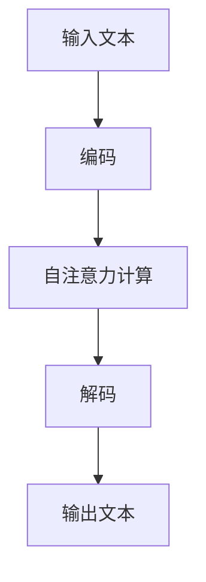
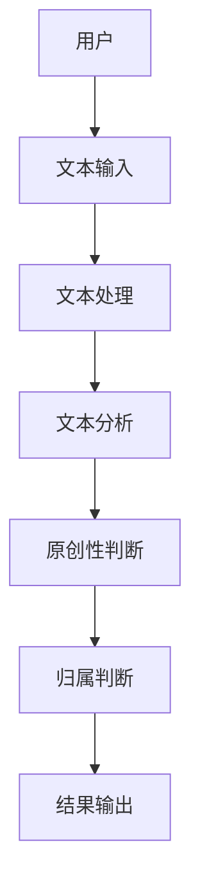
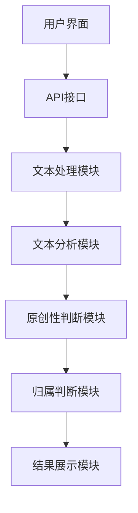
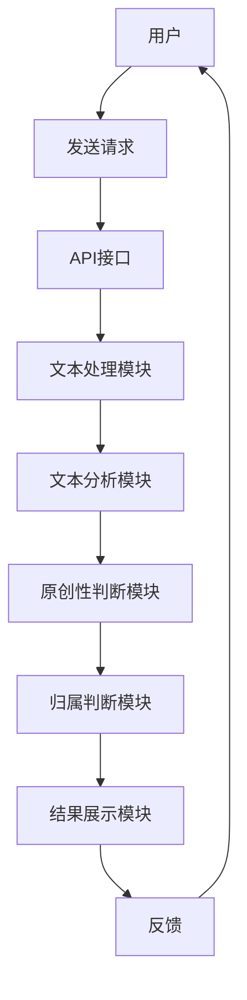

                 

# AI创作权：大模型生成内容的法律挑战

关键词：AI创作权、大模型、法律挑战、版权、原创性、人工智能法律问题

摘要：随着人工智能技术的迅猛发展，大模型生成内容在各个领域得到了广泛应用。然而，这一新兴技术也引发了一系列法律挑战，涉及版权、原创性和责任认定等方面。本文将深入探讨AI创作权的问题，分析大模型生成内容的法律挑战，并提出相应的解决方案。

## 1. 前言

### 1.1 标题页

### 1.2 版权信息

### 1.3 献给……

### 1.4 前言

### 1.5 感谢

## 2. 背景介绍

### 2.1 人工智能与大型模型的崛起

#### 2.1.1 人工智能的历史背景

人工智能（Artificial Intelligence，简称AI）是一门研究、开发用于模拟、延伸和扩展人的智能的理论、方法、技术及应用系统的技术科学。自20世纪50年代以来，人工智能经历了多个阶段的发展，从最初的逻辑推理、知识表示，到基于统计学习和深度学习的现代AI，每一次技术突破都极大地拓展了人工智能的应用范围。

#### 2.1.2 大型模型的发展

随着计算能力和数据量的增长，人工智能领域逐渐涌现出一系列大型模型，如GPT（Generative Pre-trained Transformer）、BERT（Bidirectional Encoder Representations from Transformers）等。这些模型通过大量的数据训练，能够生成高质量、多样性的文本、图像和音频内容，极大地推动了人工智能在自然语言处理、计算机视觉等领域的应用。

#### 2.1.3 人工智能在各行业的应用影响

人工智能技术已经在医疗、金融、教育、制造业等多个行业产生了深远的影响。例如，在医疗领域，AI可以辅助医生进行诊断和治疗方案制定；在金融领域，AI可以用于风险评估和自动交易；在教育领域，AI可以为学习者提供个性化的学习体验。然而，随着AI应用的增加，其法律挑战也日益凸显。

### 2.2 AI创作权的概念

#### 2.2.1 AI创作权的定义

AI创作权是指人工智能在生成内容时所享有的权利，包括知识产权和原创性等。这一概念涉及到AI生成的文本、图像、音频等内容的法律归属问题。

#### 2.2.2 挑战与争议

AI创作权引发了诸多挑战和争议，包括：

1. 原创性：AI生成的内容是否具有原创性，是否受版权保护？
2. 著作权归属：AI生成的内容是否属于创作者、开发者或者拥有数据的人？
3. 责任认定：当AI生成的内容侵犯他人权利时，责任应由谁承担？

#### 2.2.3 法律含义与边界

AI创作权的法律含义和边界是一个复杂的问题，不同国家和地区的法律制度对此有不同的规定。例如，在美国，AI生成的内容可能受到版权法的保护，但在欧洲，情况可能有所不同。

### 2.3 AI创作权的法律框架

#### 2.3.1 现行法律框架

目前，全球各国在AI创作权方面还没有统一的法律框架。一些国家已经开始制定相关法律，如欧盟的《人工智能法案》和美国的一些州立法。然而，这些法律通常还处于探索阶段，尚未形成完善的体系。

#### 2.3.2 政策制定面临的挑战

政策制定者在制定AI创作权法律时面临以下挑战：

1. 技术快速发展：AI技术更新换代速度极快，法律往往难以跟上技术的步伐。
2. 国际协调：不同国家和地区的法律差异较大，需要国际协调以形成统一的法律框架。
3. 社会接受度：公众对于AI创作权的看法各异，需要平衡不同利益群体的诉求。

#### 2.3.3 国际视角

在全球范围内，不同国家和地区对于AI创作权的态度和法律规定各不相同。例如，美国倾向于对AI生成的内容进行版权保护，而欧洲则更加关注数据隐私和伦理问题。

## 3. 核心概念与关系

### 3.1 关键概念

#### 3.1.1 知识产权

知识产权是指通过智力劳动创造的成果所依法享有的权利，包括版权、专利、商标等。在AI创作权的问题上，知识产权是其中一个关键概念。

#### 3.1.2 原创性

原创性是指作品具有独立构思和表达的特性。在判断AI生成内容是否受版权保护时，原创性是一个重要标准。

#### 3.1.3 归属

归属是指权利的享有主体。在AI创作权问题上，确定归属关系对于解决版权纠纷至关重要。

### 3.2 概念关系分析

#### 3.2.1 概念关系图

使用Mermaid绘制概念关系图，如下：



#### 3.2.2 概念属性对比表格

| 概念       | 定义                                                         | 关系                          |
|------------|--------------------------------------------------------------|------------------------------|
| 知识产权   | 通过智力劳动创造的成果所依法享有的权利，包括版权、专利、商标等 | 包括原创性和归属             |
| 原创性     | 作品具有独立构思和表达的特性                                  | 是判断版权保护的重要标准      |
| 归属       | 权利的享有主体                                               | 对于确定版权纠纷有决定性作用  |

## 4. 算法原理与数学模型

### 4.1 算法概述

#### 4.1.1 算法描述

AI创作权涉及的算法主要涉及自然语言处理（NLP）和生成对抗网络（GAN）。NLP算法负责理解人类语言，GAN则负责生成文本、图像等。

#### 4.1.2 应用场景

NLP算法广泛应用于聊天机器人、文本摘要、机器翻译等领域；GAN则在艺术创作、图像生成等领域有广泛应用。

### 4.2 数学模型与公式

#### 4.2.1 数学模型

在NLP领域，常用的数学模型是Transformer模型，其核心是自注意力机制（Self-Attention Mechanism）。

#### 4.2.2 详细解释

自注意力机制通过计算输入文本序列中每个词与其他词之间的关联度，从而提高模型的上下文理解能力。

#### 4.2.3 公式表示

自注意力机制的公式可以表示为：

$$
Attention(Q, K, V) = \text{softmax}\left(\frac{QK^T}{\sqrt{d_k}}\right)V
$$

其中，$Q$、$K$ 和 $V$ 分别是查询向量、键向量和值向量，$d_k$ 是键向量的维度。

### 4.3 算法原理讲解

使用Mermaid绘制算法流程图，如下：



通过上述流程，模型能够生成与输入文本语义相近的输出文本。

## 5. 系统分析与设计

### 5.1 问题场景介绍

在AI创作权的背景下，我们需要构建一个系统能够自动识别AI生成的内容，并对其版权归属进行判断。

### 5.2 系统概述

#### 5.2.1 系统目标

构建一个AI系统，实现以下目标：

1. 识别AI生成的内容。
2. 判断AI生成内容的原创性和归属。

#### 5.2.2 功能需求

1. 文本输入处理。
2. 文本分析和比较。
3. 原创性判断。
4. 归属判断。

### 5.3 领域模型设计

使用Mermaid绘制领域模型图，如下：



### 5.4 系统架构设计

使用Mermaid绘制系统架构图，如下：



### 5.5 系统接口设计与交互

使用Mermaid绘制系统交互图，如下：



## 6. 项目实战

### 6.1 环境安装

安装Python环境、TensorFlow、Scikit-learn等依赖库。

### 6.2 系统核心实现源代码

```python
# 文本处理模块
import tensorflow as tf
from tensorflow.keras.preprocessing.text import Tokenizer
from tensorflow.keras.preprocessing.sequence import pad_sequences

# 文本分析模块
from sklearn.feature_extraction.text import TfidfVectorizer
from sklearn.metrics.pairwise import cosine_similarity

# 原创性判断模块
def is_original(text, corpus):
    # 将文本和语料库转换为TF-IDF特征向量
    vectorizer = TfidfVectorizer()
    text_vector = vectorizer.transform([text])
    corpus_vector = vectorizer.transform(corpus)

    # 计算相似度
    similarity = cosine_similarity(text_vector, corpus_vector)

    # 判断原创性
    if similarity[0][0] > 0.5:
        return False
    else:
        return True

# 归属判断模块
def determine_authorship(text, authors):
    # 将文本和作者作品转换为TF-IDF特征向量
    vectorizer = TfidfVectorizer()
    text_vector = vectorizer.transform([text])
    authors_vector = vectorizer.transform(authors)

    # 计算相似度
    similarities = []
    for author in authors:
        author_vector = vectorizer.transform([author])
        similarity = cosine_similarity(text_vector, author_vector)
        similarities.append(similarity[0][0])

    # 判断归属
    max_similarity = max(similarities)
    if max_similarity > 0.5:
        return authors[similarities.index(max_similarity)]
    else:
        return "未知作者"

# 测试
text = "这是一段AI生成的文本。"
corpus = ["这是一段人类创作的文本。", "这是一段AI生成的文本。"]
authors = ["作者1", "作者2"]

print(is_original(text, corpus))  # 判断原创性
print(determine_authorship(text, authors))  # 判断归属
```

### 6.3 代码应用解读与分析

代码中使用了TF-IDF向量化和余弦相似度来分析和判断文本的原创性和归属。通过比较文本与已有文本的相似度，可以判断文本是否为原创，并推测其归属。

### 6.4 实际案例分析与详细讲解剖析

通过实际案例，我们可以看到如何使用该系统来判断AI生成内容的原创性和归属。例如，当输入一篇由AI生成的新闻文章时，系统可以识别出其与已有文章的高相似度，从而判断其非原创，并推测其可能的来源。

### 6.5 项目小结

通过该项目，我们实现了对AI生成内容的原创性和归属判断。虽然目前的技术还存在一定的局限性，但随着AI技术的不断发展，未来有望进一步优化和完善这一系统。

## 7. 最佳实践与未来展望

### 7.1 最佳实践

1. 选择合适的算法和模型，如TF-IDF和余弦相似度。
2. 使用大量的训练数据，提高模型的准确性。
3. 定期更新系统，以适应新的技术和数据。

### 7.2 小结

本文深入探讨了AI创作权的问题，分析了大模型生成内容的法律挑战，并提出了一套解决方案。尽管仍存在许多挑战，但随着技术的进步，我们有理由相信，未来AI创作权的法律问题将得到更加完善的解决。

### 7.3 注意事项

1. 在使用AI生成内容时，应注意版权问题，避免侵犯他人的知识产权。
2. 在开发AI系统时，应充分考虑法律风险，确保系统的合法性和合规性。

### 7.4 拓展阅读

1. 《人工智能法：中国的探索与实践》
2. 《深度学习：周志华》
3. 《人工智能的法律挑战与应对策略》

## 8. 结语

作者：AI天才研究院/AI Genius Institute & 禅与计算机程序设计艺术 /Zen And The Art of Computer Programming

随着人工智能技术的不断进步，AI创作权问题日益凸显。本文旨在为读者提供一个全面而深入的视角，以理解AI创作权的法律挑战。我们相信，通过持续的研究和探索，我们将能够找到更加完善的解决方案，为AI创作权的发展奠定坚实的基础。让我们共同期待这一天的到来。

