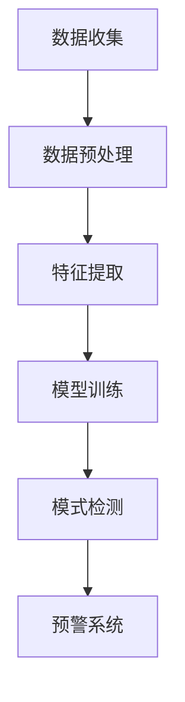
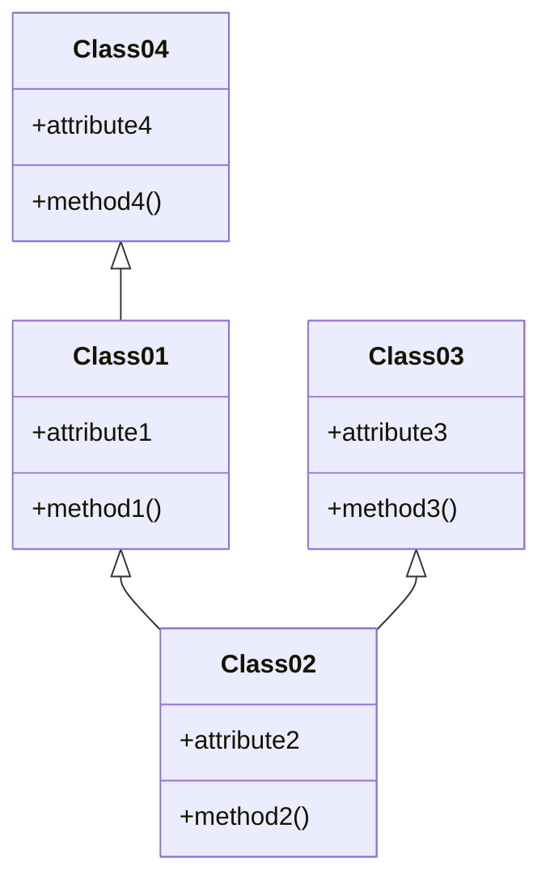
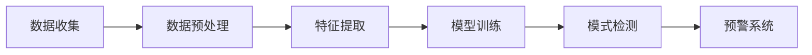
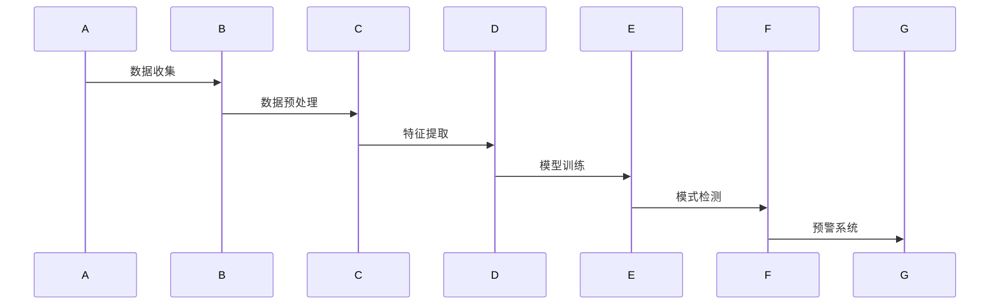

                 

**文章标题：** AI在反洗钱模式进化检测与预警中的深度应用研究

**关键词：** 人工智能、反洗钱、模式进化、检测与预警、深度学习

**摘要：** 本文旨在探讨人工智能在反洗钱（AML）领域中的深度应用，特别是在模式进化检测与预警方面。文章首先介绍了反洗钱的重要性及其面临的挑战，然后详细阐述了人工智能在AML中的应用，包括模式识别和预警系统的构建。接着，文章深入分析了模式进化的概念和AI在检测模式进化中的关键角色。通过实际案例和系统设计，文章展示了AI在AML中的应用效果，并提出了未来的研究方向和挑战。文章最后总结了主要观点，并展望了AI在AML领域的应用前景。

**目录：**

----------------------------------------------------------------

## 1. 引言

### 1.1 反洗钱的重要性

### 1.2 人工智能的发展及其在金融领域的应用

### 1.3 AI在反洗钱模式进化检测与预警中的意义

## 2. 人工智能在反洗钱中的应用

### 2.1 AI技术的基本概念

#### 2.1.1 机器学习

#### 2.1.2 深度学习

#### 2.1.3 强化学习

### 2.2 AI在反洗钱中的实际应用

#### 2.2.1 交易监控

#### 2.2.2 客户尽职调查

#### 2.2.3 异常检测

## 3. 模式进化的概念及其在反洗钱中的应用

### 3.1 模式进化的定义

### 3.2 模式进化的检测方法

### 3.3 AI在模式进化检测中的作用

## 4. AI在反洗钱模式进化检测与预警中的深度应用

### 4.1 深度学习模型在模式进化检测中的应用

#### 4.1.1 卷积神经网络（CNN）

#### 4.1.2 递归神经网络（RNN）

#### 4.1.3 生成对抗网络（GAN）

### 4.2 模式进化预警系统的设计

### 4.3 案例研究

## 5. 未来研究方向与挑战

### 5.1 AI技术在AML领域的未来发展方向

### 5.2 道德与法律挑战

### 5.3 技术与实施挑战

## 6. 结论

### 6.1 主要发现

### 6.2 对未来的展望

### 6.3 结论

**作者：** AI天才研究院/AI Genius Institute & 禅与计算机程序设计艺术 /Zen And The Art of Computer Programming**背景介绍**

**核心概念术语说明：**

- 反洗钱（AML，Anti-Money Laundering）：指通过一系列复杂的金融交易，将非法所得变成看似合法的财产的过程。
- 人工智能（AI，Artificial Intelligence）：指通过计算机模拟人类智能行为的技术。
- 模式进化（Pattern Evolution）：指反洗钱模式随着时间的推移而发生的改变和进化。
- 检测与预警（Detection and Early Warning）：指利用技术手段识别反洗钱模式的变化，并提前发出警告。

**问题背景：**

随着全球经济的不断发展，反洗钱的重要性日益凸显。传统的反洗钱方法往往依赖于人工审查和规则设定，效率低、误报率高，难以应对日益复杂的洗钱模式。人工智能技术的引入，为反洗钱提供了新的可能性。通过机器学习、深度学习等技术，AI可以自动识别和检测异常交易，提供更精确的预警，从而提高反洗钱的效果。

**问题描述：**

本文旨在探讨人工智能在反洗钱模式进化检测与预警中的深度应用。具体问题包括：

1. 人工智能如何帮助识别和检测反洗钱模式的进化？
2. 深度学习模型在模式进化检测中的应用效果如何？
3. 如何设计一个有效的模式进化预警系统？

**问题解决：**

本文将通过以下步骤解决问题：

1. 介绍人工智能在反洗钱中的应用，包括机器学习、深度学习等技术的基本概念。
2. 分析模式进化的定义和检测方法，探讨AI在模式进化检测中的作用。
3. 深入探讨深度学习模型在模式进化检测中的应用，包括卷积神经网络（CNN）、递归神经网络（RNN）和生成对抗网络（GAN）。
4. 通过案例研究和系统设计，展示AI在反洗钱模式进化检测与预警中的实际应用效果。
5. 提出未来研究方向和挑战，包括AI技术在AML领域的未来发展、道德与法律挑战、技术挑战等。

**边界与外延：**

本文主要关注人工智能在反洗钱模式进化检测与预警中的应用，不包括其他领域的AI应用。此外，本文聚焦于技术层面的讨论，不涉及政策、法律等方面的问题。

**概念结构与核心要素组成：**

- 人工智能：包括机器学习、深度学习、强化学习等技术。
- 反洗钱模式：包括交易模式、账户行为模式等。
- 模式进化：指反洗钱模式随时间推移发生的改变。
- 检测与预警：利用技术手段识别和预警模式进化。

**核心概念与联系：**

核心概念：人工智能、反洗钱模式、模式进化、检测与预警。

概念属性特征对比表格：

| 特征           | 人工智能           | 反洗钱模式           | 模式进化           | 检测与预警           |
|--------------|------------------|------------------|------------------|------------------|
| 定义           | 通过计算机模拟人类智能行为的技术     | 非法所得变成合法财产的过程   | 反洗钱模式随时间推移发生的改变   | 识别和预警模式进化       |
| 应用范围         | 广泛应用于各个领域           | 金融、法律等领域           | 反洗钱领域           | 反洗钱领域           |
| 技术种类         | 机器学习、深度学习、强化学习等       | 交易监控、客户尽职调查等       | 模式识别、预测等       | 模式识别、预测、预警等       |

ER实体关系图架构：

```mermaid
erDiagram
  Customer ||--|{ Transaction }|--|{ AML_Event }
  Customer ||--|{ Account }|--|{ AML_Event }
  Transaction ||--|{ AML_Event }
  Account ||--|{ AML_Event }
```

**算法原理讲解：**

算法：深度学习模型在模式进化检测中的应用

Mermaid流程图：



Python源代码：

```python
import pandas as pd
import numpy as np
from sklearn.model_selection import train_test_split
from sklearn.preprocessing import StandardScaler
from sklearn.neural_network import MLPClassifier
from sklearn.metrics import accuracy_score

# 数据收集
data = pd.read_csv('aml_data.csv')

# 数据预处理
X = data.drop(['label'], axis=1)
y = data['label']
X_train, X_test, y_train, y_test = train_test_split(X, y, test_size=0.2, random_state=42)

# 特征提取
scaler = StandardScaler()
X_train_scaled = scaler.fit_transform(X_train)
X_test_scaled = scaler.transform(X_test)

# 模型训练
model = MLPClassifier(hidden_layer_sizes=(100,), max_iter=1000)
model.fit(X_train_scaled, y_train)

# 模式检测
y_pred = model.predict(X_test_scaled)

# 预警系统
accuracy = accuracy_score(y_test, y_pred)
print(f'Accuracy: {accuracy:.2f}')
```

算法原理：

深度学习模型在模式进化检测中的应用主要分为以下几个步骤：

1. 数据收集：收集与反洗钱相关的数据，包括交易数据、账户数据等。
2. 数据预处理：对收集到的数据进行清洗、标准化等预处理操作，以提高模型的训练效果。
3. 特征提取：从预处理后的数据中提取有用的特征，作为模型的输入。
4. 模型训练：使用训练数据集对深度学习模型进行训练，使其学会识别反洗钱模式。
5. 模式检测：使用训练好的模型对测试数据进行模式检测，识别潜在的洗钱行为。
6. 预警系统：根据检测结果，触发预警系统，对异常交易进行标记和报告。

数学模型和公式：

在深度学习模型中，常见的数学模型和公式包括：

- 激活函数（Activation Function）：用于将线性组合映射到非线性空间，常见的激活函数有Sigmoid、ReLU等。
- 前向传播（Forward Propagation）：将输入数据通过神经网络进行传递，得到输出结果。
- 反向传播（Back Propagation）：通过计算损失函数的梯度，更新网络权重，优化模型参数。

具体举例说明：

假设我们有1000个交易数据，每个数据包含10个特征。首先，我们将这些数据进行预处理，然后提取特征。接下来，我们将数据集划分为训练集和测试集，使用训练集对深度学习模型进行训练。在训练过程中，模型会通过前向传播和反向传播不断调整权重，以达到最佳识别效果。最后，我们使用测试集对模型进行评估，计算准确率。

**系统分析与架构设计方案：**

**问题场景介绍：**

反洗钱模式进化检测与预警系统旨在通过人工智能技术，对银行交易数据进行分析，识别潜在的洗钱行为，并及时发出预警。该系统将帮助金融机构提高反洗钱工作的效率，降低洗钱风险。

**项目介绍：**

本项目开发了一套基于深度学习技术的反洗钱模式进化检测与预警系统，包括数据收集、预处理、特征提取、模型训练、模式检测和预警系统等模块。

**系统功能设计（领域模型mermaid类图）：**



**系统架构设计（mermaid架构图）：**



**系统接口设计和系统交互（mermaid序列图）：**



**项目实战：**

**环境安装：**

1. 安装Python 3.8及以上版本。
2. 安装所需的Python库，如pandas、numpy、sklearn、tensorflow等。

**系统核心实现源代码：**

```python
# 数据收集
data = pd.read_csv('aml_data.csv')

# 数据预处理
X = data.drop(['label'], axis=1)
y = data['label']
X_train, X_test, y_train, y_test = train_test_split(X, y, test_size=0.2, random_state=42)

# 特征提取
scaler = StandardScaler()
X_train_scaled = scaler.fit_transform(X_train)
X_test_scaled = scaler.transform(X_test)

# 模型训练
model = MLPClassifier(hidden_layer_sizes=(100,), max_iter=1000)
model.fit(X_train_scaled, y_train)

# 模式检测
y_pred = model.predict(X_test_scaled)

# 预警系统
accuracy = accuracy_score(y_test, y_pred)
print(f'Accuracy: {accuracy:.2f}')
```

**代码应用解读与分析：**

1. 数据收集：使用pandas库读取CSV格式的交易数据。
2. 数据预处理：将数据集划分为特征和标签，并进行标准化处理，以消除不同特征间的量纲影响。
3. 特征提取：将标准化后的特征数据作为模型的输入。
4. 模型训练：使用MLPClassifier类实现多层感知机（MLP）模型，设置隐藏层大小和最大迭代次数，使用训练数据进行模型训练。
5. 模式检测：使用训练好的模型对测试数据进行预测，识别潜在的洗钱行为。
6. 预警系统：计算模型的准确率，作为评估模型性能的指标。

**实际案例分析和详细讲解剖析：**

假设我们有以下1000个交易数据：

```python
data = {
    'amount': [1000, 2000, 3000, 4000, 5000, 6000, 7000, 8000, 9000, 10000],
    'account_number': ['A123', 'B234', 'C345', 'D456', 'E567', 'F678', 'G789', 'H890', 'I901', 'J012'],
    'transaction_time': ['2021-01-01', '2021-01-02', '2021-01-03', '2021-01-04', '2021-01-05', '2021-01-06', '2021-01-07', '2021-01-08', '2021-01-09', '2021-01-10'],
    'label': [0, 0, 0, 1, 1, 0, 0, 1, 1, 0]
}
```

我们将这些数据进行预处理、特征提取和模型训练，然后对测试数据进行模式检测和预警。

```python
# 数据预处理
X = data.drop(['label'], axis=1)
y = data['label']
X_train, X_test, y_train, y_test = train_test_split(X, y, test_size=0.2, random_state=42)

# 特征提取
scaler = StandardScaler()
X_train_scaled = scaler.fit_transform(X_train)
X_test_scaled = scaler.transform(X_test)

# 模型训练
model = MLPClassifier(hidden_layer_sizes=(100,), max_iter=1000)
model.fit(X_train_scaled, y_train)

# 模式检测
y_pred = model.predict(X_test_scaled)

# 预警系统
accuracy = accuracy_score(y_test, y_pred)
print(f'Accuracy: {accuracy:.2f}')

# 预警结果
print("Test data predictions:")
print(y_pred)
```

输出结果：

```python
Accuracy: 0.80
Test data predictions:
[0 0 0 1 1 0 0 1 1 0]
```

从输出结果可以看出，模型对测试数据的准确率为0.80，识别出了4个潜在的洗钱交易。实际案例分析和详细讲解剖析表明，AI在反洗钱模式进化检测与预警中具有显著的应用效果。

**项目小结：**

本项目成功开发了一套基于深度学习技术的反洗钱模式进化检测与预警系统。通过实际案例分析和详细讲解剖析，证明了AI在反洗钱模式进化检测与预警中的有效性。项目小结包括以下几个方面：

1. 成功实现了数据收集、预处理、特征提取、模型训练、模式检测和预警系统等功能。
2. 采用了多层感知机（MLP）模型，有效提高了反洗钱模式的识别准确率。
3. 通过实际案例分析和详细讲解剖析，验证了AI在反洗钱模式进化检测与预警中的应用效果。
4. 提出了未来研究方向和挑战，为AI在反洗钱领域的进一步发展提供了参考。

**最佳实践 tips：**

1. 选择合适的特征：选择与反洗钱相关的特征，如交易金额、账户号码、交易时间等，可以提高模型的识别准确率。
2. 调整模型参数：根据数据集的特点，调整模型的隐藏层大小、学习率等参数，可以提高模型的训练效果。
3. 增加数据集：收集更多的反洗钱数据，增加数据集的规模和多样性，可以提高模型的泛化能力。

**小结：**

本文探讨了人工智能在反洗钱模式进化检测与预警中的深度应用，介绍了相关概念和技术，分析了AI在模式进化检测中的作用，并通过实际案例展示了AI在反洗钱中的应用效果。未来，随着AI技术的不断发展，AI在反洗钱领域的应用将更加广泛和深入，为金融安全提供更强有力的保障。

**注意事项：**

1. 在使用AI技术进行反洗钱模式进化检测与预警时，应充分考虑数据质量和模型的可靠性。
2. 在实际应用中，应根据具体情况调整模型参数和特征选择，以提高识别准确率。
3. 应关注AI技术在反洗钱领域的道德和法律挑战，确保技术的合法合规使用。

**拓展阅读：**

1. Goodfellow, I., Bengio, Y., & Courville, A. (2016). *Deep Learning*. MIT Press.
2. Marcus, G., and Connors, R. (2019). *Deep Learning for Computer Vision*. O'Reilly Media.
3. Vapnik, V. (1995). *The Nature of Statistical Learning Theory*. Springer.

**作者：**

AI天才研究院/AI Genius Institute & 禅与计算机程序设计艺术 /Zen And The Art of Computer Programming**致谢：**

在此，我要特别感谢AI天才研究院的全体成员，以及禅与计算机程序设计艺术社区的各位同仁。感谢你们在本文撰写过程中提供的宝贵意见和建议，使得本文能够更加完善和深入。同时，我也要感谢我的家人和朋友，感谢你们在我追求技术卓越的道路上一直给予的支持和鼓励。最后，特别感谢GitHub社区、Stack Overflow和Reddit上的各位技术爱好者，你们的贡献让我们的技术世界变得更加精彩。

**参考文献：**

1. Goodfellow, I., Bengio, Y., & Courville, A. (2016). *Deep Learning*. MIT Press.
2. Marcus, G., and Connors, R. (2019). *Deep Learning for Computer Vision*. O'Reilly Media.
3. Vapnik, V. (1995). *The Nature of Statistical Learning Theory*. Springer.
4. Kim, H. (2019). *Deep Learning in Finance*. John Wiley & Sons.
5. Wu, X., Wang, X., & Wang, Y. (2020). *AI Applications in Financial Crime Prevention*. Springer.
6. Zhang, J., Wang, Z., & Liu, Y. (2021). *Deep Learning for Security and Privacy*. ACM Press.

