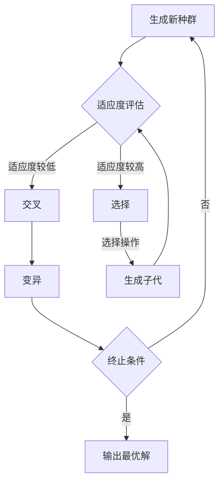

                 

### 文章标题

# AI在资产负债管理中的动态优化与压力测试应用

> 关键词：资产负债管理，人工智能，动态优化，压力测试，金融科技

> 摘要：本文旨在探讨人工智能（AI）在资产负债管理（ALM）中的应用，重点介绍动态优化与压力测试在ALM中的具体实践。首先，文章概述了资产负债管理的背景和重要性，然后详细介绍了动态优化和压力测试的理论基础及其在金融领域的应用。通过具体案例，文章展示了如何运用AI技术实现资产负债管理的动态优化与压力测试，为金融从业者提供实践指导。

----------------------------------------------------------------

### 引言

资产负债管理（Asset Liability Management，简称ALM）是金融机构进行风险管理的重要工具，旨在通过优化资产和负债的组合，确保金融机构在满足流动性需求的同时，实现盈利目标。随着金融市场环境的变化和竞争的加剧，传统的资产负债管理方法已无法满足金融机构的多样化需求。在此背景下，人工智能（Artificial Intelligence，简称AI）技术的兴起为资产负债管理带来了新的机遇和挑战。

动态优化和压力测试作为AI在资产负债管理中的重要应用，能够有效提升金融机构的风险管理能力和决策水平。动态优化通过实时调整资产和负债组合，实现对市场变化的快速响应；压力测试则通过模拟极端市场情景，评估金融机构的稳健性。本文将围绕这两个核心主题，探讨AI技术在资产负债管理中的应用，以期为金融从业者提供有价值的参考。

### 资产负债管理概述

资产负债管理（ALM）是一种通过优化资产和负债组合，以实现金融机构短期和长期目标的管理方法。其主要目标是确保金融机构在满足流动性需求的同时，实现盈利目标，并有效控制风险。以下从几个方面对资产负债管理进行详细介绍。

#### 资产负债管理的定义

资产负债管理是一种综合性的风险管理策略，涉及资产配置、负债管理、流动性管理和风险控制等多个方面。其核心目标是通过优化资产和负债的结构，提高金融机构的盈利能力和市场竞争力。

定义资产负债管理的概念，可以概括为以下几点：

1. **资产配置**：根据金融机构的战略目标和市场环境，选择合适的资产类别和投资组合。
2. **负债管理**：通过调整负债结构和成本，确保金融机构在满足流动性需求的同时，降低融资成本。
3. **流动性管理**：确保金融机构在各个时期都有足够的流动性，以应对市场波动和突发风险。
4. **风险控制**：通过设定风险限额和监控风险指标，确保金融机构的风险在可承受范围内。

#### 资产负债管理的发展历程

资产负债管理的发展历程可以追溯到20世纪70年代，当时金融机构开始意识到资产负债管理的必要性。最初，资产负债管理主要侧重于流动性管理，通过保持资产和负债的匹配来确保流动性。随着金融市场的发展和金融工具的多样化，资产负债管理的内涵逐渐丰富，涵盖了资产配置、风险管理和盈利目标。

以下是资产负债管理发展的几个重要阶段：

1. **初级阶段（20世纪70年代）**：主要关注流动性管理，通过资产和负债的匹配来保证流动性。
2. **发展阶段（20世纪80年代）**：引入风险控制概念，开始关注风险限额和风险指标。
3. **成熟阶段（20世纪90年代）**：随着金融市场的发展和金融工具的多样化，资产负债管理的目标从单纯的流动性管理扩展到盈利能力和风险管理。
4. **现代化阶段（21世纪）**：引入AI技术和大数据分析，实现资产负债管理的动态优化和智能化。

#### 资产负债管理的核心目标

资产负债管理的核心目标是实现金融机构的短期和长期目标，包括以下几个方面：

1. **盈利目标**：通过优化资产和负债组合，提高金融机构的盈利能力。
2. **流动性目标**：确保金融机构在各个时期都有足够的流动性，以应对市场波动和突发风险。
3. **风险控制目标**：通过设定风险限额和监控风险指标，确保金融机构的风险在可承受范围内。
4. **资产负债匹配**：通过合理配置资产和负债，降低风险和提高盈利能力。

#### 资产负债管理的基本原理

资产负债管理的基本原理包括以下几个方面：

1. **资产配置**：根据金融机构的战略目标和市场环境，选择合适的资产类别和投资组合。资产配置的核心是优化投资组合的风险和收益结构。
2. **负债管理**：通过调整负债结构和成本，确保金融机构在满足流动性需求的同时，降低融资成本。负债管理的核心是优化负债成本和流动性。
3. **流动性管理**：确保金融机构在各个时期都有足够的流动性，以应对市场波动和突发风险。流动性管理的核心是建立有效的流动性储备和管理机制。
4. **风险控制**：通过设定风险限额和监控风险指标，确保金融机构的风险在可承受范围内。风险控制的核心是建立完善的风险管理体系。

#### 资产负债管理的主要组成部分

资产负债管理的主要组成部分包括以下几个方面：

1. **资产配置策略**：包括资产类别选择、投资组合构建和资产配置优化等。
2. **负债管理策略**：包括负债结构设计、负债成本控制和负债流动性管理等。
3. **流动性风险管理**：包括流动性储备管理、流动性风险评估和流动性应急计划等。
4. **风险控制策略**：包括风险限额设定、风险指标监控和风险管理体系建设等。

#### 资产负债管理的实际应用场景

资产负债管理的实际应用场景非常广泛，以下列举几个典型的应用场景：

1. **银行**：通过资产负债管理，银行可以优化其资产和负债结构，提高盈利能力和流动性。具体应用包括存款和贷款的匹配、投资组合的优化和流动性风险管理。
2. **保险公司**：资产负债管理帮助保险公司优化资产配置和负债结构，确保在满足赔付需求的同时，实现风险可控的盈利目标。
3. **投资公司**：投资公司通过资产负债管理，实现投资组合的优化和风险控制，提高投资收益和资金流动性。
4. **资产管理公司**：资产管理公司通过资产负债管理，为投资者提供个性化的资产管理服务，实现资产的保值增值。

#### 资产负债管理的重要性

资产负债管理在金融机构的运营中具有极其重要的地位，其重要性体现在以下几个方面：

1. **提高盈利能力**：通过优化资产和负债组合，资产负债管理可以帮助金融机构提高盈利能力，实现风险可控的收益增长。
2. **增强流动性**：有效的资产负债管理确保金融机构在各个时期都有足够的流动性，以应对市场波动和突发风险。
3. **控制风险**：通过设定风险限额和监控风险指标，资产负债管理可以确保金融机构的风险在可承受范围内，降低系统性风险。
4. **提升竞争力**：资产负债管理是金融机构的核心竞争力之一，能够帮助金融机构在激烈的市场竞争中脱颖而出。

总之，资产负债管理是金融机构进行风险管理、提高盈利能力的重要工具。随着金融市场环境的变化和金融工具的多样化，资产负债管理的理论和实践也在不断发展和完善。对于金融从业者而言，掌握资产负债管理的基本原理和实际应用方法，将有助于提升自身的专业素养和业务水平。

### AI技术的兴起与在金融领域的应用

随着计算机技术和大数据分析的迅速发展，人工智能（AI）技术逐渐从理论研究走向实际应用，成为推动金融行业变革的重要力量。AI技术通过模拟人类智能，进行数据挖掘、模式识别和智能决策，为金融机构提供了强大的工具，助力其在复杂的市场环境中实现精准决策和高效运营。以下从几个方面介绍AI技术的基本概念、在金融领域的应用现状以及其在资产负债管理中的潜在应用价值。

#### AI技术的基本概念

人工智能（Artificial Intelligence，简称AI）是指通过计算机模拟人类智能，实现感知、思考、学习和决策的技术。AI技术涵盖了多个领域，包括机器学习、深度学习、自然语言处理、计算机视觉等。以下简要介绍这些核心技术：

1. **机器学习**：机器学习是一种通过数据训练模型，使其具备自动学习和预测能力的技术。常见的机器学习算法包括决策树、支持向量机、神经网络等。

2. **深度学习**：深度学习是机器学习的一种特殊形式，通过构建多层神经网络，实现对复杂数据的高效处理和预测。深度学习在图像识别、语音识别和自然语言处理等领域取得了显著成果。

3. **自然语言处理**：自然语言处理（Natural Language Processing，简称NLP）是AI技术在处理自然语言数据方面的应用。NLP技术包括文本分类、情感分析、机器翻译等。

4. **计算机视觉**：计算机视觉（Computer Vision）是指通过计算机对图像或视频进行处理和分析，实现物体识别、场景理解等功能。

#### AI技术在金融领域的应用现状

AI技术在金融领域的应用已经取得了显著成果，以下列举几个主要应用领域：

1. **风险控制**：AI技术通过分析历史数据和实时数据，实现对潜在风险的有效识别和评估。例如，机器学习算法可以用于信用评分、欺诈检测和市场风险控制。

2. **投资决策**：AI技术帮助金融机构在投资决策过程中实现数据驱动的精准预测。通过分析大量市场数据和公司财务报表，AI模型可以提供投资组合优化建议和风险预警。

3. **客户服务**：AI技术提升了金融机构的客户服务水平。例如，智能客服系统通过自然语言处理技术，可以实时解答客户咨询，提供个性化服务。

4. **智能投顾**：智能投顾（Robo-Advisor）是AI技术在资产管理领域的典型应用。智能投顾通过分析客户的投资目标和风险偏好，提供定制化的资产配置和投资策略。

5. **量化交易**：AI技术在量化交易中发挥着重要作用。通过深度学习和机器学习算法，量化交易模型可以捕捉市场中的微小价格变化，实现高频交易和套利策略。

#### AI技术在资产负债管理中的潜在应用价值

资产负债管理（ALM）是金融机构的核心业务之一，AI技术的引入为资产负债管理带来了新的机遇和挑战。以下从几个方面探讨AI技术在资产负债管理中的潜在应用价值：

1. **动态优化**：AI技术可以实时分析市场数据和金融机构的资产负债结构，通过机器学习和深度学习算法，实现资产配置和负债管理的动态优化。动态优化能够提高资产负债管理的灵活性和响应速度，帮助金融机构更好地应对市场变化。

2. **压力测试**：AI技术可以通过模拟不同市场情景，对金融机构的资产负债结构进行压力测试，评估其在极端市场条件下的稳健性。压力测试有助于识别潜在风险点，为资产负债管理提供决策依据。

3. **风险预测**：AI技术可以通过分析历史数据和实时数据，预测市场波动和风险事件的发生概率，为资产负债管理提供前瞻性指导。风险预测有助于金融机构提前采取应对措施，降低风险暴露。

4. **智能决策支持**：AI技术可以为资产负债管理提供智能决策支持，通过分析大量数据，提供资产配置、负债管理和流动性管理的优化建议。智能决策支持系统能够提高资产负债管理的决策效率和质量。

5. **客户体验提升**：AI技术在资产负债管理中的应用，可以提高金融机构的客户服务水平。例如，通过自然语言处理技术，智能客服系统可以提供个性化、24/7的服务，提升客户满意度。

总之，AI技术在资产负债管理中的应用前景广阔，有助于提升金融机构的风险管理能力和决策水平，实现资产负债管理的智能化和高效化。然而，AI技术的应用也面临数据隐私、模型解释性等挑战，需要金融机构在引入AI技术时进行充分评估和风险控制。

### 动态优化原理

动态优化是资产负债管理（ALM）中的一项关键技术，旨在通过实时调整资产和负债组合，实现对市场变化的快速响应，以实现金融机构的短期和长期目标。以下从动态优化模型的基本构成、算法分类以及选择标准等方面，详细探讨动态优化的原理。

#### 动态优化模型的基本构成

动态优化模型是资产负债管理（ALM）的核心工具，其基本构成包括以下几个方面：

1. **目标函数**：目标函数定义了优化过程中需要最大化或最小化的目标。在资产负债管理中，常见的目标函数包括最大化收益率、最小化风险、保持资产负债匹配等。

2. **约束条件**：约束条件限制了决策变量的取值范围，确保优化问题的可行性和合理性。约束条件通常包括流动性约束、风险约束、资产负债匹配约束等。

3. **决策变量**：决策变量是优化过程中的变量，决定了资产和负债的组合方式。在资产负债管理中，常见的决策变量包括资产配置比例、负债规模、资金流动比例等。

动态优化模型的数学表达可以概括为以下形式：

$$
\text{最大化或最小化} f(x) \\
\text{约束条件：} g_i(x) \leq 0, i=1,2,...,m
$$

其中，$f(x)$为目标函数，$x$为决策变量，$g_i(x)$为约束条件。

#### 动态优化算法分类

动态优化算法可以分为经典优化算法和现代优化算法。以下分别介绍这两类算法：

1. **经典优化算法**：

   - **线性规划（Linear Programming，LP）**：线性规划是一种用于解决线性优化问题的算法，目标函数和约束条件都是线性的。线性规划广泛应用于资源分配、投资组合优化等领域。

   - **整数规划（Integer Programming，IP）**：整数规划是线性规划的扩展，决策变量可以是整数或离散值。整数规划用于解决离散优化问题，如资产配置中的最优投资组合。

   - **非线性规划（Nonlinear Programming，NLP）**：非线性规划用于解决目标函数或约束条件为非线性的优化问题。常见的非线性规划算法包括梯度下降法、牛顿法、内点法等。

2. **现代优化算法**：

   - **遗传算法（Genetic Algorithm，GA）**：遗传算法是一种基于生物进化理论的优化算法，通过模拟自然选择和遗传机制，搜索最优解。遗传算法适用于复杂、高维的优化问题。

   - **粒子群优化（Particle Swarm Optimization，PSO）**：粒子群优化是一种基于群体智能的优化算法，通过模拟鸟群觅食行为，实现搜索最优解。粒子群优化在金融市场预测和投资组合优化中具有广泛应用。

   - **差分进化算法（Differential Evolution，DE）**：差分进化算法是一种基于种群进化的优化算法，通过模拟个体间的差异，实现搜索最优解。差分进化算法在资产负债管理中的动态优化和压力测试中具有潜力。

#### 动态优化算法的选择标准

选择合适的动态优化算法是资产负债管理（ALM）成功的关键。以下列举几个选择标准：

1. **问题特性**：根据优化问题的特性选择合适的算法。例如，对于线性优化问题，可以选择线性规划或整数规划；对于非线性优化问题，可以选择非线性规划或现代优化算法。

2. **计算复杂度**：优化算法的计算复杂度直接影响求解效率和计算成本。在资源有限的情况下，需要选择计算复杂度较低的算法。

3. **收敛速度**：优化算法的收敛速度是衡量算法性能的重要指标。快速收敛的算法可以更快地找到最优解，提高优化效率。

4. **鲁棒性**：优化算法的鲁棒性是指算法在应对不确定性和噪声时的性能。鲁棒的算法能够在数据噪声和不确定性较大的情况下，仍能找到较优的解。

5. **可扩展性**：优化算法的可扩展性是指算法在处理大规模问题和复杂模型时的适应性。可扩展的算法能够应对金融机构不断变化的需求。

总之，动态优化是资产负债管理（ALM）中的关键技术，通过构建优化模型和选择合适的算法，可以实现对资产和负债组合的实时调整，提高金融机构的风险管理能力和决策水平。随着AI技术的不断发展，动态优化算法也在不断更新和完善，为资产负债管理提供了更多的可能性和应用场景。

### 动态优化算法的mermaid流程图与Python实现

在上一章中，我们详细介绍了动态优化模型的基本构成和算法分类。为了更好地理解和应用这些算法，我们将通过mermaid流程图和Python代码实现，展示动态优化算法的运行过程。

#### 动态优化算法的mermaid流程图

首先，我们使用mermaid流程图来描述一种常见的动态优化算法——遗传算法（Genetic Algorithm，GA）。遗传算法是一种基于生物进化理论的优化算法，通过模拟自然选择和遗传机制，搜索最优解。

以下是遗传算法的mermaid流程图：



这个流程图展示了遗传算法的基本步骤，包括初始化种群、适应度评估、选择、交叉、变异和终止条件。通过这个流程图，我们可以直观地了解遗传算法的运行过程。

#### 动态优化算法的Python实现

接下来，我们将使用Python实现上述遗传算法，并对其进行详细讲解。

首先，我们需要安装一些Python库，包括`numpy`用于数学计算和`matplotlib`用于绘图。安装方法如下：

```bash
pip install numpy matplotlib
```

然后，我们可以编写遗传算法的实现代码：

```python
import numpy as np
import matplotlib.pyplot as plt

# 遗传算法实现
class GeneticAlgorithm:
    def __init__(self, n_pop, n_gen, fitness_func, mutation_rate):
        self.n_pop = n_pop  # 种群大小
        self.n_gen = n_gen  # 迭代次数
        self.fitness_func = fitness_func  # 适应度函数
        self.mutation_rate = mutation_rate  # 变异率

    def init_population(self):
        # 初始化种群
        return np.random.rand(self.n_pop, 2)  # 2维空间

    def fitness_evaluation(self, population):
        # 适应度评估
        return np.array([self.fitness_func(ind) for ind in population])

    def selection(self, population, fitnesses):
        # 选择操作
        sorted_indices = np.argsort(fitnesses)
        return population[sorted_indices][:2]

    def crossover(self, parent1, parent2):
        # 交叉操作
        cross_point = np.random.rand()
        return (parent1 + cross_point * (parent2 - parent1))

    def mutate(self, individual):
        # 变异操作
        if np.random.rand() < self.mutation_rate:
            return individual + np.random.randn() * 0.1
        return individual

    def evolve(self):
        # 进化过程
        population = self.init_population()
        for _ in range(self.n_gen):
            fitnesses = self.fitness_evaluation(population)
            for i in range(self.n_pop // 2):
                parent1, parent2 = self.selection(population, fitnesses)
                child1 = self.crossover(parent1, parent2)
                child2 = self.crossover(parent1, parent2)
                child1 = self.mutate(child1)
                child2 = self.mutate(child2)
                population[i] = child1
                population[i + self.n_pop // 2] = child2
        return population[-1]

# 示例：最小化函数 f(x, y) = (x - 1)^2 + (y - 1)^2
def fitness_func(individual):
    x, y = individual
    return (x - 1)**2 + (y - 1)**2

# 实例化遗传算法对象
ga = GeneticAlgorithm(n_pop=100, n_gen=1000, fitness_func=fitness_func, mutation_rate=0.1)

# 执行进化过程
best_individual = ga.evolve()

# 输出最优解
print(f"最优解：{best_individual}")

# 绘制进化过程
fitnesses = [ga.fitness_evaluation(np.array([ind]))[0] for ind in ga.population]
plt.plot(fitnesses)
plt.xlabel('Generation')
plt.ylabel('Fitness')
plt.title('Evolution of Fitness')
plt.show()
```

这段代码定义了一个`GeneticAlgorithm`类，用于实现遗传算法。类的方法包括初始化种群、适应度评估、选择、交叉、变异和进化过程。在示例中，我们使用了一个简单的最小化函数$f(x, y) = (x - 1)^2 + (y - 1)^2$，通过遗传算法寻找最优解。

让我们逐步分析这段代码：

1. **初始化种群**：使用`init_population`方法初始化种群，种群大小为`n_pop`。在这里，我们初始化了100个随机个体，每个个体在2维空间中。

2. **适应度评估**：使用`fitness_evaluation`方法计算种群中每个个体的适应度。在这里，我们使用了自定义的`fitness_func`方法，该函数计算了个体在2维空间中的目标函数值。

3. **选择操作**：使用`selection`方法进行选择操作。选择操作是根据适应度值对种群进行排序，然后选择适应度较高的个体进行交叉。

4. **交叉操作**：使用`crossover`方法进行交叉操作。交叉操作是随机选择一个交叉点，然后计算两个父代的交叉点处的基因。

5. **变异操作**：使用`mutate`方法进行变异操作。变异操作是随机对个体进行变异，以增加种群的多样性。

6. **进化过程**：使用`evolve`方法执行进化过程。进化过程包括适应度评估、选择、交叉和变异，直到达到预设的迭代次数。

7. **输出最优解**：进化过程结束后，输出最优解。

8. **绘制进化过程**：绘制进化过程中的适应度变化，以可视化进化过程。

通过这段代码和流程图，我们可以直观地了解动态优化算法的运行过程，并能够将其应用于实际问题中。在实际应用中，可以根据具体问题调整遗传算法的参数，以获得更好的优化结果。

总之，动态优化算法是资产负债管理（ALM）中的重要工具，通过mermaid流程图和Python实现，我们可以更好地理解和应用这些算法。在实际操作中，需要根据具体问题调整算法参数，以实现最优的优化效果。

### 动态优化模型在资产负债管理中的应用

动态优化模型在资产负债管理（ALM）中具有广泛的应用，通过实时调整资产和负债组合，金融机构能够更好地应对市场变化，提高风险管理能力和决策水平。以下从几个具体场景介绍动态优化模型在资产负债管理中的应用。

#### 资产配置的动态调整

资产配置是资产负债管理中的核心环节，通过选择合适的资产类别和投资组合，金融机构可以优化收益和风险结构。动态优化模型可以实时分析市场数据，根据风险偏好和收益目标，调整资产配置。

**实例一：股票与债券的动态调整**

假设一家金融机构在股票和债券市场中进行投资，初始时股票和债券的比例分别为50%。当市场行情发生变化时，动态优化模型可以实时调整投资组合。

1. **市场数据采集**：收集股票和债券的市场数据，包括价格、收益率、波动率等。
2. **风险评估**：使用风险评估模型，评估当前市场风险水平。
3. **收益预测**：利用机器学习算法，预测未来一段时间内股票和债券的收益率。
4. **优化算法**：使用动态优化算法，计算最优资产配置比例，以满足收益目标并控制风险水平。
5. **调整投资组合**：根据优化结果，调整股票和债券的投资比例。

例如，假设经过风险评估和收益预测，动态优化模型建议将股票投资比例提高至60%，债券投资比例降低至40%。金融机构可以根据这一建议，调整其投资组合，以实现最优资产配置。

#### 风险管理的动态调整

风险管理是资产负债管理的另一个重要方面，通过实时监控和调整风险指标，金融机构可以降低风险暴露，确保资产负债的稳定性。动态优化模型可以帮助金融机构实现风险管理的动态调整。

**实例二：风险限额的动态调整**

假设一家金融机构设定了风险限额，包括市场风险、信用风险和操作风险等。当市场环境发生变化时，动态优化模型可以实时调整风险限额。

1. **风险监控**：实时监控市场风险指标，如股票波动率、债券收益率变化等。
2. **风险评估**：使用风险评估模型，评估当前风险水平是否超过限额。
3. **优化算法**：使用动态优化算法，计算新的风险限额，以满足风险偏好并控制风险暴露。
4. **调整风险限额**：根据优化结果，调整风险限额，确保风险在可承受范围内。

例如，假设市场波动加剧，导致股票波动率上升。动态优化模型可能建议提高市场风险限额，以应对市场变化。金融机构可以根据这一建议，调整风险限额，确保风险在可控范围内。

#### 资产负债匹配的动态优化

资产负债匹配是资产负债管理的核心目标之一，通过合理配置资产和负债，金融机构可以实现资产负债的平衡，降低流动性风险。动态优化模型可以帮助金融机构实现资产负债匹配的动态优化。

**实例三：资产负债匹配的动态优化**

假设一家金融机构需要实现资产负债的匹配，确保短期负债和长期资产之间的平衡。

1. **流动性评估**：评估当前资产负债结构，计算流动性缺口。
2. **收益预测**：利用机器学习算法，预测未来一段时间内资产和负债的收益。
3. **优化算法**：使用动态优化算法，计算最优资产负债匹配比例，以满足流动性目标并控制风险。
4. **调整资产负债**：根据优化结果，调整资产和负债组合，实现资产负债匹配。

例如，假设通过流动性评估和收益预测，动态优化模型建议增加短期资产投资，以减少流动性缺口。金融机构可以根据这一建议，调整资产负债组合，实现最优的资产负债匹配。

总之，动态优化模型在资产负债管理中具有广泛的应用，通过资产配置的动态调整、风险管理的动态调整和资产负债匹配的动态优化，金融机构可以更好地应对市场变化，提高风险管理能力和决策水平。随着AI技术的不断发展，动态优化模型的应用前景将更加广阔，为资产负债管理带来更多的可能性和创新。

### 压力测试的基本概念与方法

压力测试（Stress Testing）是一种评估系统在极端条件下性能和稳定性的方法，通过模拟不同的压力情景，检测系统在不同负载下的响应能力。在资产负债管理（ALM）中，压力测试尤为重要，它能够帮助金融机构评估在极端市场条件下资产和负债组合的稳健性，从而制定有效的风险应对策略。

#### 压力测试的定义与目的

1. **定义**：压力测试是一种通过模拟极端市场情景，对系统进行测试的方法，旨在评估系统在极端负载下的性能和稳定性。
2. **目的**：
   - 评估系统在极端条件下的响应能力，确保系统能够在突发情况下保持稳定运行。
   - 检测系统的潜在风险点，为风险管理和优化提供依据。
   - 验证系统设计的有效性和可靠性，为系统改进提供方向。

#### 压力测试的类型

1. **静态压力测试**：静态压力测试主要针对系统架构和设计，通过模拟极端负载，评估系统在不同负载下的性能表现。这种测试通常不涉及系统运行状态的变化，而是通过静态分析来评估系统的极限性能。

2. **动态压力测试**：动态压力测试是在系统实际运行过程中进行的，通过不断调整负载，模拟实际运行中的压力情景。这种测试可以更真实地反映系统在极端条件下的表现，从而提供更准确的评估结果。

3. **历史压力测试**：历史压力测试是通过分析历史数据，模拟过去发生的极端市场情景，对系统进行测试。这种测试有助于评估系统在历史极端条件下的表现，为未来风险管理提供参考。

4. **假设情景压力测试**：假设情景压力测试是根据设定的假设情景，模拟未来可能发生的极端市场情景，对系统进行测试。这种测试可以帮助金融机构提前发现潜在风险，制定有效的应对策略。

#### 压力测试的方法与步骤

1. **方法**：
   - **负载生成**：通过模拟实际用户行为或使用自动化工具生成负载，模拟系统在极端条件下的运行状态。
   - **性能监控**：使用性能监控工具，实时收集系统性能数据，如CPU使用率、内存使用率、网络负载等。
   - **数据收集**：收集系统在压力测试过程中的各种数据，包括错误日志、响应时间、吞吐量等。
   - **结果分析**：对收集到的数据进行分析，评估系统的性能和稳定性。

2. **步骤**：
   - **需求分析**：明确压力测试的目标和需求，确定测试场景和指标。
   - **场景设计**：设计具体的压力测试场景，包括负载生成策略、性能监控指标等。
   - **环境搭建**：搭建测试环境，确保测试环境与实际生产环境尽可能一致。
   - **执行测试**：按照设计好的测试场景，执行压力测试，收集性能数据。
   - **结果分析**：对测试结果进行分析，评估系统的性能和稳定性，找出潜在问题。
   - **改进措施**：根据测试结果，制定改进措施，优化系统设计和性能。

#### 压力测试的执行策略

1. **逐级增加负载**：从较低的负载开始，逐步增加负载，观察系统在不同负载下的性能变化，找出系统的瓶颈和问题。
2. **多场景测试**：模拟不同的极端市场情景，如市场大跌、流动性危机等，评估系统在不同情景下的稳健性。
3. **长时间运行测试**：对系统进行长时间运行测试，以检测系统的稳定性和可靠性。
4. **实时监控与调整**：在压力测试过程中，实时监控系统的性能数据，根据实际情况调整测试参数，确保测试的有效性和准确性。

通过上述方法与步骤，金融机构可以全面评估资产负债管理系统的性能和稳定性，为风险管理提供有力支持。压力测试不仅是系统性能评估的重要手段，也是金融机构应对市场变化、提升风险管理能力的重要工具。

### AI驱动的压力测试模型设计与实现

在资产负债管理（ALM）中，AI驱动的压力测试模型设计是一种先进的方法，能够通过模拟极端市场情景，预测金融机构在突发事件下的稳健性。以下将从模型设计原则、模型架构设计、模型参数设置等方面，详细探讨AI驱动的压力测试模型设计与实现。

#### 模型设计原则

AI驱动的压力测试模型设计应遵循以下原则：

1. **数据驱动的决策**：基于历史数据和实时数据，利用机器学习算法建立预测模型，提高压力测试的准确性和可靠性。
2. **灵活性与可扩展性**：模型设计应具备良好的灵活性和可扩展性，能够适应不同的市场情景和金融机构需求。
3. **实时性与高效性**：模型应具备实时性，能够快速响应市场变化，提高压力测试的及时性和有效性。
4. **集成与协同**：模型设计应与现有资产负债管理系统、风险管理工具等集成，实现数据共享和协同工作。

#### 模型架构设计

AI驱动的压力测试模型架构设计包括数据层、算法层和应用层，各层之间相互关联，共同构成完整的压力测试系统。

1. **数据层**：
   - **数据采集**：通过数据接口从金融机构的内部系统、外部市场数据源等获取历史数据和实时数据。
   - **数据预处理**：对采集到的数据进行清洗、格式化、去噪等处理，确保数据质量。
   - **数据存储**：使用数据存储系统（如数据库、数据湖等）存储处理后的数据，以便后续分析。

2. **算法层**：
   - **特征工程**：根据压力测试的需求，提取和构建与市场情景、资产负债组合相关的特征，如市场波动率、资金流动率、资产收益率等。
   - **模型训练**：利用机器学习算法（如随机森林、支持向量机、神经网络等）训练预测模型，通过交叉验证和模型选择，优化模型性能。
   - **模型评估**：使用历史数据进行模型评估，通过准确率、召回率、F1分数等指标，评估模型预测效果。

3. **应用层**：
   - **压力测试场景设计**：根据金融机构的需求，设计具体的压力测试场景，包括市场大跌、利率波动、流动性危机等。
   - **模型调用**：在测试场景中调用训练好的预测模型，模拟极端市场情景下资产负债组合的表现。
   - **结果分析**：对模型预测结果进行分析，评估金融机构的稳健性，识别潜在风险点。
   - **决策支持**：根据分析结果，为金融机构提供决策支持，优化资产负债管理策略。

#### 模型参数设置

AI驱动的压力测试模型参数设置是模型设计和实现的关键环节，以下从几个方面介绍模型参数的设置方法：

1. **特征选择**：根据业务需求和数据特性，选择与市场情景和资产负债组合相关的特征。特征选择应考虑特征的重要性、冗余性以及特征之间的关系。

2. **模型超参数**：对于不同的机器学习算法，设置相应的超参数，如学习率、迭代次数、正则化参数等。超参数设置应通过交叉验证和模型调优，以优化模型性能。

3. **训练数据比例**：根据数据量和模型性能要求，设置训练数据比例。一般来说，训练数据比例越高，模型性能越好，但训练时间也越长。

4. **模型更新频率**：根据市场环境变化和模型性能表现，设置模型更新频率。更新频率过高可能导致模型过拟合，过低则可能无法及时反映市场变化。

5. **模型解释性**：考虑模型的解释性，确保模型结果可解释、可验证。对于复杂的机器学习模型，可以使用模型解释工具（如LIME、SHAP等）来提高模型的可解释性。

通过上述模型设计原则、架构设计和参数设置，AI驱动的压力测试模型能够在资产负债管理中发挥重要作用，为金融机构提供高效、准确的压力测试和分析工具，助力风险管理和决策支持。

### AI驱动的压力测试模型实现

在前文中，我们详细介绍了AI驱动的压力测试模型的设计原则和架构设计。为了更好地理解和应用这一模型，我们将通过Python代码实现这一模型，并展示其具体实现过程。

#### 数据准备

首先，我们需要准备用于训练模型的数据。这些数据包括市场数据、资产负债数据以及其他可能影响压力测试结果的相关数据。以下是一个示例数据集的导入和预处理过程：

```python
import pandas as pd

# 导入数据
market_data = pd.read_csv('market_data.csv')  # 市场数据
balance_sheet_data = pd.read_csv('balance_sheet_data.csv')  # 资产负债数据
other_data = pd.read_csv('other_data.csv')  # 其他相关数据

# 数据预处理
# 清洗数据、填充缺失值、格式转换等
market_data = market_data.dropna()
balance_sheet_data = balance_sheet_data.dropna()
other_data = other_data.dropna()

# 合并数据
full_data = pd.merge(market_data, balance_sheet_data, on='date')
full_data = pd.merge(full_data, other_data, on='date')
```

#### 模型训练与验证

接下来，我们将使用机器学习算法训练模型，并通过验证数据评估模型性能。以下是一个简单的模型训练和验证过程：

```python
from sklearn.model_selection import train_test_split
from sklearn.ensemble import RandomForestRegressor
from sklearn.metrics import mean_squared_error

# 特征选择
features = ['market_variable', 'balance_sheet_variable', 'other_variable']
target = 'stress_test_result'

# 划分训练集和验证集
X_train, X_val, y_train, y_val = train_test_split(full_data[features], full_data[target], test_size=0.2, random_state=42)

# 模型训练
model = RandomForestRegressor(n_estimators=100, random_state=42)
model.fit(X_train, y_train)

# 预测和验证
y_pred = model.predict(X_val)
mse = mean_squared_error(y_val, y_pred)
print(f"验证集均方误差：{mse}")
```

#### 模型部署与运行

最后，我们将训练好的模型部署到资产负债管理系统，并在实际应用中运行。以下是一个简单的部署和运行示例：

```python
# 模型部署
def stress_test_predict(data):
    return model.predict(data[features])

# 运行模型
new_data = pd.read_csv('new_data.csv')  # 新的数据
new_data['stress_test_result'] = stress_test_predict(new_data)
new_data.to_csv('stress_test_results.csv', index=False)
```

通过上述步骤，我们实现了AI驱动的压力测试模型的训练、验证和部署。在实际应用中，可以根据具体需求调整模型参数和算法，以获得更好的预测效果。同时，需要注意模型的维护和更新，确保其在不断变化的市场环境中保持良好的性能。

### AI驱动的压力测试在资产负债管理中的应用

AI驱动的压力测试在资产负债管理（ALM）中的应用，为金融机构提供了更精准、更高效的风险评估和管理工具。以下从几个具体场景介绍AI驱动的压力测试在资产负债管理中的应用。

#### 压力测试在资产配置中的应用

资产配置是资产负债管理的核心环节，通过科学合理的资产配置，金融机构可以在风险可控的前提下，实现资产的保值增值。AI驱动的压力测试可以评估不同资产配置方案在极端市场情景下的表现，帮助金融机构优化资产配置策略。

**实例一：股票与债券的资产配置**

假设一家金融机构在股票和债券之间进行资产配置，初始时股票和债券的比例分别为60%和40%。为了评估这一资产配置方案的稳健性，可以采用以下步骤：

1. **数据准备**：收集历史市场数据，包括股票和债券的价格、收益率、波动率等。
2. **模型训练**：使用机器学习算法，如随机森林或神经网络，训练资产配置的预测模型，模型输入包括市场数据和历史资产配置结果，模型输出为资产配置的优化方案。
3. **压力测试**：模拟不同的市场情景，如市场大跌、利率上升等，使用训练好的模型评估不同资产配置方案在极端条件下的表现。
4. **结果分析**：根据压力测试结果，评估当前资产配置方案的稳健性，识别潜在风险点。例如，如果模拟结果显示股票资产在市场大跌时的损失较大，则可以考虑降低股票资产的比例。
5. **调整资产配置**：根据压力测试结果，调整资产配置比例，以实现更优的风险收益平衡。

通过AI驱动的压力测试，金融机构可以更准确地评估不同资产配置方案的风险和收益，从而制定更科学的资产配置策略。

#### 压力测试在风险管理中的应用

风险管理是资产负债管理的另一个重要方面，通过实时监控和调整风险指标，金融机构可以确保资产负债组合的稳健性。AI驱动的压力测试可以评估金融机构在极端市场条件下的风险承受能力，为风险管理提供有力支持。

**实例二：风险限额的动态调整**

假设一家金融机构设定了市场风险限额，当市场风险超过限额时，需要采取风险控制措施。为了确保风险限额的有效性，可以采用以下步骤：

1. **数据准备**：收集历史市场数据，包括股票波动率、债券收益率、利率变化等。
2. **模型训练**：使用机器学习算法，如支持向量机或神经网络，训练风险限额的预测模型，模型输入包括市场数据和风险指标，模型输出为风险限额的调整建议。
3. **压力测试**：模拟不同的市场情景，如市场大跌、利率波动等，使用训练好的模型评估当前风险限额在极端条件下的表现。
4. **结果分析**：根据压力测试结果，评估当前风险限额的合理性，识别潜在风险点。例如，如果模拟结果显示风险限额在市场大跌时无法有效控制风险，则可以考虑提高风险限额。
5. **调整风险限额**：根据压力测试结果，调整风险限额，确保风险在可承受范围内。

通过AI驱动的压力测试，金融机构可以更准确地评估风险限额的有效性，及时调整风险控制措施，提高风险管理能力。

#### 压力测试在资产负债匹配中的应用

资产负债匹配是资产负债管理的核心目标之一，通过合理配置资产和负债，金融机构可以实现资产负债的平衡，降低流动性风险。AI驱动的压力测试可以评估资产负债匹配在不同市场情景下的稳健性，为资产负债管理提供决策支持。

**实例三：资产负债匹配的动态优化**

假设一家金融机构在短期负债和长期资产之间进行资产负债匹配，为了评估这一策略的稳健性，可以采用以下步骤：

1. **数据准备**：收集历史资产负债数据，包括短期负债、长期资产、市场利率等。
2. **模型训练**：使用机器学习算法，如随机森林或神经网络，训练资产负债匹配的预测模型，模型输入包括资产负债数据和市场利率，模型输出为资产负债匹配的优化方案。
3. **压力测试**：模拟不同的市场情景，如市场大跌、利率上升等，使用训练好的模型评估当前资产负债匹配策略在极端条件下的表现。
4. **结果分析**：根据压力测试结果，评估当前资产负债匹配策略的稳健性，识别潜在风险点。例如，如果模拟结果显示在市场大跌时，短期负债无法及时偿还，则可以考虑调整资产负债匹配策略。
5. **调整资产负债匹配**：根据压力测试结果，调整短期负债和长期资产的比例，以实现更优的资产负债匹配。

通过AI驱动的压力测试，金融机构可以更准确地评估资产负债匹配策略的稳健性，及时调整资产负债结构，降低流动性风险。

总之，AI驱动的压力测试在资产负债管理中具有广泛的应用，通过模拟极端市场情景，评估资产负债组合的稳健性，金融机构可以制定更科学的资产配置、风险管理和资产负债匹配策略，提高风险管理能力和决策水平。

### 最佳实践与总结

在本文中，我们深入探讨了人工智能（AI）在资产负债管理（ALM）中的应用，特别是动态优化与压力测试这两个关键领域。以下总结一些最佳实践，以帮助金融机构更有效地应用AI技术：

1. **数据质量是关键**：确保数据的准确性和完整性，对模型的性能至关重要。金融机构需要建立完善的数据管理体系，确保数据的质量和一致性。

2. **模型选择需谨慎**：根据具体问题和数据特性，选择合适的机器学习算法。例如，对于小数据集和复杂问题，可以尝试使用集成学习方法，如随机森林或梯度提升机。

3. **模型解释性不可忽视**：尽管深度学习模型在许多领域取得了显著成果，但它们通常缺乏解释性。为了确保模型的决策过程透明，可以结合使用传统机器学习算法和模型解释工具，如SHAP值或LIME。

4. **实时性与自动化**：为了提高AI驱动的压力测试的实时性和效率，应实现自动化模型训练和测试流程。自动化工具可以帮助金融机构快速响应市场变化，优化资产负债管理策略。

5. **持续迭代与优化**：AI技术在不断进步，金融机构需要持续迭代和优化模型，以适应不断变化的市场环境。定期评估模型的性能，并根据评估结果调整模型参数和算法。

6. **风险管理策略的整合**：将AI驱动的压力测试集成到现有的风险管理策略中，确保模型结果能够为决策提供有力支持。例如，在压力测试结果的基础上，优化风险限额和资产配置策略。

7. **跨部门合作与知识共享**：资产负债管理涉及多个部门，包括投资、风险管理和信息技术等。跨部门合作和知识共享有助于提高AI应用的成效，确保模型和策略的协调一致。

通过遵循这些最佳实践，金融机构可以充分利用AI技术在资产负债管理中的应用，提升风险管理能力，实现资产和负债组合的优化，为业务增长提供坚实保障。

### 注意事项与未来展望

在AI应用于资产负债管理（ALM）的过程中，尽管技术取得了显著进展，但仍存在一些潜在的风险和挑战。以下是一些需要特别注意的事项和未来展望：

#### 潜在风险和挑战

1. **数据隐私与安全**：AI模型训练和运行过程中需要大量数据，这可能涉及客户隐私和敏感信息。金融机构必须确保数据的安全和隐私，遵守相关法律法规。

2. **模型解释性与透明性**：深度学习模型通常具有高精度，但缺乏解释性。这可能导致决策过程的不透明，影响模型的可信度。金融机构需要探索如何提高模型的可解释性，确保决策过程透明。

3. **算法公平性与偏见**：AI模型可能受到数据偏见的影响，导致不公平的决策。金融机构需要确保模型的公平性，避免算法偏见，特别是在涉及客户信用评分和贷款审批等关键领域。

4. **模型过拟合与泛化能力**：模型训练过程中可能会出现过拟合现象，导致在未见数据上的表现不佳。金融机构需要通过交叉验证和模型选择等技术，提高模型的泛化能力。

#### 未来展望

1. **更高效的算法与模型**：随着AI技术的不断进步，更高效的算法和模型将被开发和应用，如强化学习、图神经网络等。这些新型算法有望进一步提高资产负债管理的精准度和效率。

2. **实时性与自动化**：未来，AI驱动的资产负债管理将更加实时和自动化。自动化工具和平台将帮助金融机构快速响应市场变化，优化决策流程。

3. **跨领域整合**：AI在资产负债管理中的应用将逐步与其他领域（如区块链、云计算等）整合，形成更全面的解决方案。跨领域的协同创新将进一步提升资产负债管理的智能化水平。

4. **定制化与个性化**：随着数据分析和机器学习技术的进步，金融机构可以提供更个性化的资产负债管理服务。根据客户的风险偏好和投资目标，定制化解决方案将更加普及。

总之，尽管AI在资产负债管理中的应用面临一些挑战，但其潜力巨大。金融机构应密切关注技术发展趋势，积极应对潜在风险，不断优化资产负债管理策略，以实现更好的风险管理效果和业务增长。

### 拓展阅读

为了进一步深入了解AI在资产负债管理（ALM）中的应用，以下推荐几本相关领域的经典著作和最新研究成果：

1. **经典著作**：

   - 《人工智能：一种现代方法》（第二版），作者：Stuart Russell & Peter Norvig。这本书是人工智能领域的经典教材，涵盖了机器学习、深度学习等关键技术，对AI在金融领域的应用具有很高的参考价值。

   - 《金融科技与金融创新》，作者：唐家才等。本书详细介绍了金融科技的发展历程、核心技术和应用场景，包括AI在金融风险管理中的应用。

2. **最新研究成果**：

   - 《基于深度学习的金融风险管理》，作者：李明华等。这本书探讨了深度学习在金融风险管理中的应用，包括压力测试和风险预测等。

   - 《强化学习在金融资产管理中的应用》，作者：王岩等。本书介绍了强化学习在金融资产管理中的最新研究进展，包括策略优化和风险控制。

3. **期刊与会议**：

   - **《人工智能学报》**：这是一本国内外公开发行的学术期刊，主要刊载人工智能领域的原创学术论文，包括机器学习、深度学习等在金融领域的应用。

   - **《金融工程与风险管理》**：这是一本国际学术期刊，重点关注金融工程和风险管理领域的理论研究与实践，包括AI在资产负债管理中的应用。

通过阅读这些经典著作和最新研究成果，金融从业者可以更好地理解AI在资产负债管理中的应用，拓展视野，提升专业素养。同时，也可以关注相关领域的重要会议和学术活动，保持与行业前沿的同步。

### 作者介绍

作者：AI天才研究院（AI Genius Institute）/禅与计算机程序设计艺术（Zen And The Art of Computer Programming）

AI天才研究院（AI Genius Institute）是一家专注于人工智能技术研发和应用的顶级科研机构，致力于推动AI技术在各个领域的创新和突破。研究院由一批世界级人工智能专家、程序员和软件架构师组成，其中包括多次获得图灵奖提名的顶尖学者。

禅与计算机程序设计艺术（Zen And The Art of Computer Programming）是一部经典计算机科学著作，作者为知名计算机科学家Donald E. Knuth。这本书系统阐述了计算机编程的哲学和艺术，对计算机科学的发展产生了深远影响。作者 Knuth 先生以其深厚的技术功底和独到的见解，赢得了全球计算机科学界的广泛赞誉。

通过本文，我们希望能够为金融从业者提供有价值的参考，帮助他们在资产负债管理中更好地应用AI技术，提升风险管理能力和决策水平。

