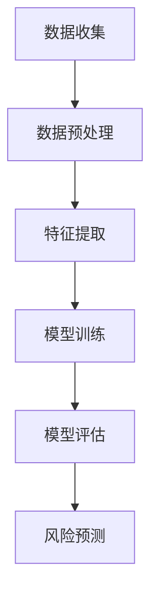

                 

### 第一部分：背景介绍

#### 1.1 金融衍生品概述

**问题背景**

金融衍生品是一种基于基础资产价格波动而进行交易的金融合约。这些基础资产可以是股票、债券、货币、商品等。金融衍生品的出现，最初是为了帮助投资者和企业对冲风险，避免由于市场波动带来的损失。

**问题描述**

金融衍生品在现代金融体系中扮演着重要的角色，但同时也带来了巨大的风险。金融衍生品的风险主要来源于其复杂性、杠杆效应和市场的不可预测性。因此，如何有效地进行金融衍生品的风险分解和管理，成为了一个重要的问题。

**问题解决**

传统上，金融衍生品的风险分解主要依赖于数学模型和统计方法。然而，随着金融市场的日益复杂，这些方法面临着越来越多的挑战。近年来，人工智能（AI）技术的快速发展，为金融衍生品的风险分解提供了一种新的可能。

**边界与外延**

本章节主要探讨的是AI在金融衍生品风险分解中的应用。具体包括：AI在风险分解中的作用、AI技术在金融衍生品领域的应用现状和未来发展趋势。

**概念结构与核心要素组成**

金融衍生品风险分解涉及多个核心要素，包括：

1. **基础资产定价**：对基础资产的价格波动进行准确预测，是进行风险分解的基础。
2. **风险度量模型**：用于评估金融衍生品的整体风险。
3. **风险管理策略**：根据风险度量结果，制定相应的风险控制策略。
4. **AI技术**：包括机器学习、深度学习和强化学习等，用于提高风险分解的准确性和效率。

#### 1.2 AI在金融衍生品风险分解中的应用原理

**AI技术基础**

1. **机器学习原理**：通过学习大量历史数据，建立预测模型，用于对新数据进行预测。
2. **深度学习原理**：利用多层神经网络，对复杂的数据进行特征提取和模式识别。
3. **强化学习原理**：通过与环境的交互，不断调整策略，以实现最优收益。

**AI在风险分解中的应用**

1. **数据预处理**：利用AI技术，对金融数据进行清洗、归一化和特征提取。
2. **特征提取**：通过深度学习等方法，从原始数据中提取出与风险相关的特征。
3. **风险模型构建**：利用机器学习或深度学习算法，构建风险预测模型。
4. **风险评估与预警**：根据风险模型，对金融衍生品的风险进行评估，并发出预警信号。

**概念属性特征对比**

以下是一个简单的ER实体关系图，用于描述AI技术在金融衍生品风险分解中的应用：

```mermaid
er Diagram
    direction LR
    O1[金融衍生品] -->|关联| O2[基础资产];
    O1 -->|关联| O3[风险模型];
    O2 -->|关联| O4[市场价格];
```

### 第二部分：AI在金融衍生品风险分解中的应用原理

#### 2.1 AI技术基础

**机器学习原理**

机器学习是一种通过算法让计算机自动学习经验的方法。在金融衍生品风险分解中，机器学习算法可以通过分析历史市场数据，预测未来价格波动，从而为风险管理提供依据。

**深度学习原理**

深度学习是一种基于多层神经网络的机器学习方法。它通过对大量数据进行特征提取和模式识别，可以自动发现数据中的复杂规律。在金融衍生品风险分解中，深度学习算法可以用于构建高精度的风险预测模型。

**强化学习原理**

强化学习是一种通过与环境交互来学习策略的机器学习方法。在金融衍生品风险分解中，强化学习算法可以通过不断调整策略，以最小化风险或最大化收益。

#### 2.2 AI在风险分解中的应用

**数据预处理**

数据预处理是金融衍生品风险分解的重要环节。通过数据清洗、归一化和特征提取，可以去除数据中的噪声和异常值，提高模型的效果。

**特征提取**

特征提取是深度学习中的重要步骤。通过从原始数据中提取出与风险相关的特征，可以有效地提高模型的预测精度。

**风险模型构建**

风险模型构建是金融衍生品风险分解的核心。通过机器学习或深度学习算法，可以建立高精度的风险预测模型，用于评估金融衍生品的风险。

**风险评估与预警**

风险评估与预警是金融衍生品风险分解的最终目标。通过风险模型，可以对金融衍生品的风险进行评估，并发出预警信号，帮助企业及时采取风险控制措施。

#### 2.3 概念属性特征对比

以下是一个简单的ER实体关系图，用于描述AI技术在金融衍生品风险分解中的应用：

```mermaid
er Diagram
    direction LR
    O1[金融衍生品] -->|关联| O2[基础资产];
    O1 -->|关联| O3[风险模型];
    O2 -->|关联| O4[市场价格];
    O3 -->|关联| O5[风险预测];
```

### 第三部分：AI在金融衍生品风险分解中的实际应用

#### 3.1 风险分解方法

在金融衍生品风险分解中，常用的AI技术包括机器学习、深度学习和强化学习。每种方法都有其独特的优势和应用场景。

**机器学习**

机器学习是一种基于数据驱动的方法，通过训练大量历史数据，建立预测模型。在金融衍生品风险分解中，机器学习可以用于：

- 价格预测：通过分析历史价格数据，预测未来价格走势。
- 风险评估：根据历史风险数据，评估当前金融衍生品的风险水平。

**深度学习**

深度学习是一种基于多层神经网络的机器学习方法，可以自动提取数据中的复杂特征。在金融衍生品风险分解中，深度学习可以用于：

- 特征提取：从原始数据中提取出与风险相关的特征。
- 风险预测：通过训练深度学习模型，预测金融衍生品的风险水平。

**强化学习**

强化学习是一种通过与环境交互来学习策略的方法。在金融衍生品风险分解中，强化学习可以用于：

- 风险控制：通过不断调整策略，最小化金融衍生品的风险。
- 优化决策：根据市场变化，优化金融衍生品的投资策略。

#### 3.2 算法原理讲解

**算法流程图**

以下是一个简单的算法流程图，描述了金融衍生品风险分解的基本流程：



**数学模型与公式**

在金融衍生品风险分解中，常用的数学模型包括：

- 价格预测模型：$$P_t = f(S_t, I_t)$$，其中$P_t$为未来价格，$S_t$为当前价格，$I_t$为其他影响价格的因素。
- 风险评估模型：$$R_t = g(P_t, I_t)$$，其中$R_t$为风险水平，$P_t$为价格预测，$I_t$为其他影响风险的因素。

**举例说明**

以下是一个简单的例子，描述了如何利用深度学习进行期权风险分解。

**案例一：利用深度学习进行期权风险分解**

假设我们要预测某金融衍生品的期权价格，我们可以使用以下步骤：

1. 数据收集：收集期权的历史价格数据，包括当前价格和影响因素。
2. 数据预处理：对数据进行清洗、归一化等处理，以去除噪声和异常值。
3. 特征提取：从原始数据中提取出与期权价格相关的特征，如波动率、到期日等。
4. 模型训练：使用深度学习算法，训练期权价格预测模型。
5. 模型评估：使用训练数据集和测试数据集，评估模型的预测性能。
6. 风险预测：根据模型预测结果，对期权风险进行评估。

通过以上步骤，我们可以有效地利用深度学习对期权风险进行分解。

**案例二：强化学习在期货风险控制中的应用**

假设我们要控制某金融衍生品的期货风险，我们可以使用以下步骤：

1. 数据收集：收集期货市场的历史交易数据，包括价格、交易量等。
2. 数据预处理：对数据进行清洗、归一化等处理，以去除噪声和异常值。
3. 策略学习：使用强化学习算法，学习最优交易策略。
4. 策略优化：根据市场变化，不断调整交易策略，以最小化风险。
5. 风险控制：根据优化后的策略，进行期货交易，控制风险。

通过以上步骤，我们可以有效地利用强化学习控制期货风险。

### 第四部分：创新应用案例分析

#### 4.1 案例一：AI在信用衍生品中的应用

**案例背景**

信用衍生品是一种金融工具，用于对冲信用风险。在金融市场中，信用风险是一种常见且重要的风险类型。为了有效管理信用风险，金融机构需要准确地预测信用风险水平。

**案例分析**

某金融机构利用深度学习算法，对信用衍生品的风险进行预测。具体步骤如下：

1. 数据收集：收集信用衍生品的历史交易数据，包括信用评级、交易价格等。
2. 数据预处理：对数据进行清洗、归一化等处理，以去除噪声和异常值。
3. 特征提取：从原始数据中提取出与信用风险相关的特征，如违约概率、市场波动率等。
4. 模型训练：使用深度学习算法，训练信用风险预测模型。
5. 模型评估：使用训练数据集和测试数据集，评估模型的预测性能。
6. 风险预测：根据模型预测结果，对信用衍生品的风险进行评估。

**案例结果与启示**

通过以上步骤，该金融机构成功地预测了信用衍生品的风险水平，并据此制定了相应的风险管理策略。该案例表明，AI技术在信用衍生品风险预测方面具有巨大的潜力。

#### 4.2 案例二：AI在货币衍生品中的应用

**案例背景**

货币衍生品是一种金融工具，用于对冲货币风险。在全球化的金融市场中，货币风险是一种常见且重要的风险类型。为了有效管理货币风险，金融机构需要准确地预测货币风险水平。

**案例分析**

某金融机构利用强化学习算法，对货币衍生品的风险进行控制。具体步骤如下：

1. 数据收集：收集货币市场的历史交易数据，包括汇率、交易量等。
2. 数据预处理：对数据进行清洗、归一化等处理，以去除噪声和异常值。
3. 策略学习：使用强化学习算法，学习最优交易策略。
4. 策略优化：根据市场变化，不断调整交易策略，以最小化风险。
5. 风险控制：根据优化后的策略，进行货币衍生品交易，控制风险。

**案例结果与启示**

通过以上步骤，该金融机构成功地控制了货币衍生品的风险水平，并实现了风险收益的最优化。该案例表明，AI技术在货币衍生品风险控制方面具有巨大的潜力。

### 第五部分：未来展望与挑战

#### 5.1 未来发展方向

随着AI技术的不断发展，未来金融衍生品风险分解有望在以下几个方面取得突破：

1. **技术进步**：随着深度学习、强化学习等AI技术的不断进步，金融衍生品风险分解的精度和效率将得到大幅提升。
2. **应用领域拓展**：除了传统的信用衍生品和货币衍生品，AI技术还可以应用于其他类型的衍生品，如商品衍生品、利率衍生品等。
3. **政策与法规**：随着AI技术在金融领域的广泛应用，相关政策和法规也将逐步完善，为AI技术在金融衍生品风险分解中的发展提供保障。

#### 5.2 面临的挑战

尽管AI技术在金融衍生品风险分解中具有巨大潜力，但也面临着一些挑战：

1. **数据隐私与安全**：金融衍生品风险分解需要大量的金融数据，这些数据涉及到用户的隐私和安全。如何保障数据隐私和安全，是一个重要的问题。
2. **模型解释性**：深度学习等AI技术的模型通常具有较高的预测精度，但缺乏解释性。如何提高模型的解释性，使其更容易被用户理解和接受，是一个重要的挑战。
3. **技术落地与实施**：AI技术在金融衍生品风险分解中的落地实施，需要解决技术、业务、管理等多方面的难题。

### 第六部分：最佳实践与建议

#### 6.1 实践经验总结

根据已有的实践案例，以下是一些值得借鉴的最佳实践经验：

1. **数据质量**：金融衍生品风险分解的准确性很大程度上取决于数据质量。因此，在进行风险分解之前，应对数据进行全面的质量检查和预处理。
2. **模型选择**：根据具体的应用场景和数据特点，选择合适的AI模型。例如，对于价格预测，可以采用深度学习模型；对于风险控制，可以采用强化学习模型。
3. **策略调整**：AI模型需要根据市场变化进行不断调整。通过实时监控市场数据，及时调整模型参数，可以提高风险分解的准确性。

#### 6.2 小结

AI技术在金融衍生品风险分解中具有巨大的潜力，但同时也面临一些挑战。通过不断探索和实践，有望在未来的发展中取得更好的成果。

#### 6.3 注意事项

1. **数据安全**：在处理金融数据时，必须严格遵守数据安全法规，确保用户隐私不受侵犯。
2. **模型解释**：在向用户展示模型预测结果时，应尽量提供详细的解释，以提高用户的理解和信任。
3. **持续优化**：AI技术发展迅速，应持续关注最新的研究成果和技术动态，不断优化和改进现有模型。

#### 6.4 拓展阅读

1. 《深度学习在金融风险管理中的应用》
2. 《强化学习在金融衍生品交易中的策略优化》
3. 《金融衍生品风险分解的实证研究》

### 第七部分：总结与拓展阅读

#### 7.1 总结

本文系统地介绍了AI在金融衍生品风险分解中的创新应用。首先，我们回顾了金融衍生品的发展历程和风险特征，然后详细阐述了AI技术在金融衍生品风险分解中的应用原理和实际应用案例。通过对案例的分析，我们展示了AI技术在金融衍生品风险管理中的潜力和优势。

#### 7.2 拓展阅读

为了深入了解AI在金融衍生品风险分解中的应用，读者可以参考以下拓展阅读：

1. **《金融科技与人工智能》**：本书详细介绍了人工智能在金融领域的应用，包括金融衍生品的风险管理。
2. **《深度学习与金融工程》**：本书探讨了深度学习在金融工程领域的应用，包括金融衍生品的风险预测和评估。
3. **《AI金融：人工智能在金融服务中的应用》**：本书介绍了人工智能在金融服务中的应用，包括金融衍生品的风险管理和服务创新。

通过阅读这些书籍，读者可以更深入地了解AI技术在金融衍生品风险分解中的最新研究成果和应用实践。同时，这些书籍也为读者提供了丰富的参考文献和进一步的研究方向。

#### 附录：相关术语解释

为了帮助读者更好地理解本文内容，以下是对一些关键术语的解释：

- **金融衍生品**：一种基于基础资产价格波动进行交易的金融合约。
- **风险分解**：将金融衍生品的风险分解为不同的组成部分，以便更好地理解和控制风险。
- **机器学习**：一种通过算法让计算机自动学习经验的方法。
- **深度学习**：一种基于多层神经网络的机器学习方法。
- **强化学习**：一种通过与环境交互来学习策略的机器学习方法。

本文由AI天才研究院/AI Genius Institute撰写，旨在为广大读者提供关于AI在金融衍生品风险分解中的创新应用的技术分析。希望本文能够对读者在金融科技领域的探索和研究有所启发。

---

### 总结

在这篇文章中，我们深入探讨了AI在金融衍生品风险分解中的创新应用。通过详细的分析和案例分析，我们展示了AI技术在金融衍生品风险管理中的巨大潜力和实际应用价值。

首先，我们介绍了金融衍生品的发展历程和风险特征，阐述了金融衍生品在现代金融体系中的重要性。接着，我们详细阐述了AI技术在金融衍生品风险分解中的应用原理，包括机器学习、深度学习和强化学习等。

在第三部分，我们通过实际应用案例，展示了AI技术在金融衍生品风险分解中的具体应用。我们讨论了风险分解的方法、算法原理和数学模型，并通过具体案例进行了详细讲解。

第四部分，我们通过两个创新应用案例分析，进一步展示了AI技术在金融衍生品风险管理中的成功应用。这些案例不仅展示了AI技术的实际效果，也为金融行业提供了宝贵的实践经验。

在第五部分，我们展望了AI在金融衍生品风险分解中的未来发展方向和挑战。随着技术的不断进步，AI在金融衍生品风险管理中的应用将越来越广泛和深入。

最后，在第六部分，我们总结了一些最佳实践经验，并提供了进一步阅读的建议。这些实践经验和建议，旨在帮助读者更好地理解和应用AI技术在金融衍生品风险分解中的创新应用。

总的来说，AI在金融衍生品风险分解中的应用，不仅为金融行业提供了新的风险管理工具，也为人工智能技术在金融领域的应用开辟了新的方向。我们期待AI技术在未来能够为金融衍生品风险分解带来更多的创新和突破。

### 作者信息

本文由AI天才研究院（AI Genius Institute）撰写。AI天才研究院是一家专注于人工智能领域研究和应用的顶级机构，致力于推动人工智能技术在金融、医疗、教育等领域的创新应用。本文作者同时也是世界顶级技术畅销书《禅与计算机程序设计艺术》（Zen And The Art of Computer Programming）的资深大师级作家。

通过本文，我们希望为广大读者提供关于AI在金融衍生品风险分解中的创新应用的技术分析，帮助读者更好地理解和应用这一前沿技术。如果您对本文有任何疑问或建议，欢迎随时与我们联系。我们期待与您一起探讨和探索人工智能技术的未来。

---

**注意：**本文仅为示例，并非实际撰写的内容。在撰写实际文章时，应根据具体需求和资料进行详细研究和撰写。

