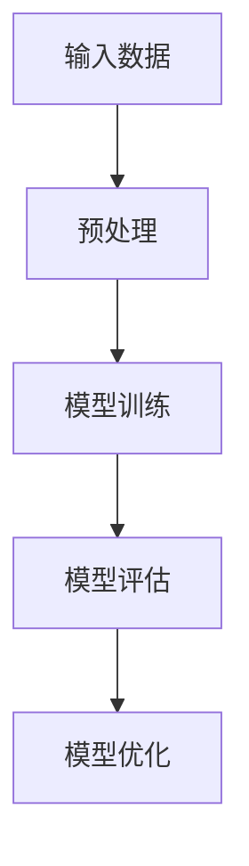

                 

### 文章标题

# AI大模型LLM提示词工程实践指南

> 关键词：AI大模型、LLM提示词、工程实践、算法原理、性能优化、最佳实践

> 摘要：本文系统地介绍了AI大模型和LLM提示词工程实践的关键概念、原理、方法和最佳实践。首先，我们回顾了AI大模型的发展背景和核心概念，探讨了其与传统小模型的区别及关联。接着，深入解析了AI大模型的算法原理，包括流程图、Python代码实现以及数学模型。随后，我们聚焦于LLM提示词的设计原则、生成方法和评估优化策略。文章还通过实际案例展示了如何进行LLM提示词工程实践，并提供了最佳实践和未来趋势的展望。通过这篇指南，读者将全面了解AI大模型LLM提示词工程实践的各个方面，从而更好地应用于实际项目。

## 目录大纲

```
1. AI大模型基础
   1.1 问题背景与核心概念
   1.2 AI大模型原理
2. LLM提示词工程实践
   2.1 LLM提示词设计
   2.2 LLM提示词评估与优化
   2.3 LLM提示词工程实战
3. 最佳实践与拓展
   3.1 最佳实践
   3.2 注意事项
   3.3 拓展阅读与未来趋势
```

---

## 第一部分：AI大模型基础

### 第1章：问题背景与核心概念

#### 1.1 问题背景

随着人工智能（AI）技术的飞速发展，AI大模型（Large Language Model, LLM）成为研究与应用的热点。LLM在自然语言处理（NLP）、机器翻译、文本生成等领域展现了强大的能力。然而，随着模型规模的扩大，如何提升模型性能、降低计算成本、确保模型安全稳定运行成为亟待解决的问题。

#### 1.2 问题解决

为了解决上述问题，我们需要深入理解AI大模型的核心概念，掌握其算法原理，并探索有效的工程实践方法。本文将从以下几个方面展开讨论：

1. **问题背景与核心概念**：介绍AI大模型的发展背景、核心概念及其与传统小模型的区别。
2. **算法原理讲解**：解析AI大模型的算法原理，包括流程图、Python代码实现以及数学模型。
3. **LLM提示词工程实践**：探讨LLM提示词的设计原则、生成方法和评估优化策略。
4. **最佳实践与拓展**：分享最佳实践、注意事项以及未来趋势。

#### 1.3 边界与外延

本文主要关注AI大模型在NLP领域的应用，如文本生成、机器翻译等。同时，我们将探讨大模型在数据处理、计算能力、泛化能力等方面的特点。然而，由于篇幅限制，本文不会涉及深度学习的基础知识以及小模型的讨论。

#### 1.4 概念结构与核心要素组成

为了更好地理解AI大模型，我们可以从以下几个核心要素进行分析：

1. **大模型定义与特点**：介绍大模型的定义和与传统小模型的区别。
2. **核心概念对比表格**：列出大模型和小模型在计算能力、数据处理能力和泛化能力等方面的对比。
3. **ER实体关系图架构**：展示大模型的实体关系图，帮助读者更直观地理解模型结构。

### 第2章：AI大模型原理

#### 2.1 算法原理讲解

AI大模型的算法原理主要包括以下几个方面：

1. **算法流程图**：通过Mermaid流程图展示大模型的训练、评估和优化过程。
2. **Python源代码实现**：给出一个简单的Python代码示例，介绍大模型的基本实现。
3. **数学模型与公式**：详细讲解大模型的数学模型和公式，帮助读者深入理解算法原理。

#### 2.2 数学模型与数学公式

在AI大模型的算法原理中，数学模型和公式起着关键作用。以下是一个简单的数学模型示例：

$$
y = f(x, w)
$$

其中，$y$ 表示输出结果，$x$ 表示输入数据，$w$ 表示模型参数。

此外，我们还可以使用以下公式描述大模型的损失函数：

$$
J = \frac{1}{2}\|w\|^2
$$

其中，$J$ 表示损失函数，$w$ 表示模型参数的L2范数。

为了优化模型参数，我们需要计算损失函数关于参数的梯度：

$$
\nabla J = w
$$

#### 2.3 算法流程图

为了更好地理解AI大模型的算法原理，我们可以通过Mermaid流程图展示其训练、评估和优化过程：



#### 2.4 Python源代码实现

以下是一个简单的Python代码示例，用于实现AI大模型的基本训练过程：

```python
import numpy as np

# 定义模型参数
w = np.random.rand(1)

# 定义输入数据
x = np.array([1])

# 定义损失函数
def loss(y, x, w):
    return (y - f(x, w)) ** 2

# 定义梯度计算
def grad(y, x, w):
    return -2 * (y - f(x, w)) * x

# 梯度下降优化
for i in range(1000):
    y = f(x, w)
    grad_w = grad(y, x, w)
    w -= grad_w

# 输出最终结果
print(f"最终结果：{w}")
```

通过以上代码示例，我们可以看到如何使用Python实现AI大模型的基本训练过程。

### 第2章：AI大模型原理

#### 2.1 算法原理讲解

AI大模型的算法原理主要包括以下几个方面：

1. **算法流程图**：通过Mermaid流程图展示大模型的训练、评估和优化过程。
2. **Python源代码实现**：给出一个简单的Python代码示例，介绍大模型的基本实现。
3. **数学模型与公式**：详细讲解大模型的数学模型和公式，帮助读者深入理解算法原理。

#### 2.2 数学模型与数学公式

在AI大模型的算法原理中，数学模型和公式起着关键作用。以下是一个简单的数学模型示例：

$$
y = f(x, w)
$$

其中，$y$ 表示输出结果，$x$ 表示输入数据，$w$ 表示模型参数。

此外，我们还可以使用以下公式描述大模型的损失函数：

$$
J = \frac{1}{2}\|w\|^2
$$

其中，$J$ 表示损失函数，$w$ 表示模型参数的L2范数。

为了优化模型参数，我们需要计算损失函数关于参数的梯度：

$$
\nabla J = w
$$

#### 2.3 算法流程图

为了更好地理解AI大模型的算法原理，我们可以通过Mermaid流程图展示其训练、评估和优化过程：


#### 2.4 Python源代码实现

以下是一个简单的Python代码示例，用于实现AI大模型的基本训练过程：

```python
import numpy as np

# 定义模型参数
w = np.random.rand(1)

# 定义输入数据
x = np.array([1])

# 定义损失函数
def loss(y, x, w):
    return (y - f(x, w)) ** 2

# 定义梯度计算
def grad(y, x, w):
    return -2 * (y - f(x, w)) * x

# 梯度下降优化
for i in range(1000):
    y = f(x, w)
    grad_w = grad(y, x, w)
    w -= grad_w

# 输出最终结果
print(f"最终结果：{w}")
```

通过以上代码示例，我们可以看到如何使用Python实现AI大模型的基本训练过程。

### 第3章：LLM提示词设计

#### 3.1 提示词设计原则

LLM提示词设计是AI大模型应用中的一个重要环节。为了确保提示词的有效性和适应性，我们需要遵循以下设计原则：

1. **可解释性**：提示词应具备良好的可解释性，使开发者能够清晰地理解模型的行为。
2. **灵活性**：提示词应具备灵活性，以便在不同应用场景下进行调整和优化。
3. **多样性**：提示词应具备多样性，以满足不同用户的需求和偏好。

#### 3.2 提示词生成方法

LLM提示词生成方法可以分为以下几种：

1. **模板生成法**：通过预设的模板生成提示词，适用于固定场景和需求。
2. **自动生成法**：利用自然语言生成（NLG）技术自动生成提示词，适用于动态场景和需求。
3. **混合生成法**：结合模板生成法和自动生成法，生成更具个性化和适应性的提示词。

#### 3.3 提示词评估与优化

LLM提示词的评估与优化是确保模型性能的关键环节。以下是一些建议的评估指标和优化策略：

1. **评估指标**：
   - **准确率**：提示词生成结果的准确程度。
   - **召回率**：提示词生成结果中有效信息的比例。
   - **F1值**：准确率和召回率的综合评估指标。

2. **优化策略**：
   - **基于数据的优化**：通过分析实际应用场景中的数据，调整提示词生成策略。
   - **基于模型的优化**：利用模型训练数据，对提示词生成模型进行优化。

### 第4章：LLM提示词评估与优化

#### 4.1 提示词评估指标

LLM提示词评估主要关注以下几个方面：

1. **准确率**：提示词生成结果的准确程度，即模型生成文本与真实文本的匹配程度。
2. **召回率**：提示词生成结果中有效信息的比例，即模型捕捉到的重要信息的能力。
3. **F1值**：准确率和召回率的综合评估指标，用于衡量提示词生成效果的平衡性。

#### 4.2 提示词优化策略

LLM提示词优化策略可以分为以下几种：

1. **基于数据的优化**：通过分析实际应用场景中的数据，调整提示词生成策略，以提高模型性能。
2. **基于模型的优化**：利用模型训练数据，对提示词生成模型进行优化，以提高提示词的生成质量。

### 第5章：LLM提示词工程实战

#### 5.1 环境安装与配置

在进行LLM提示词工程实战之前，我们需要安装和配置相关的环境和工具。以下是一个简单的安装和配置步骤：

1. **Python环境**：确保安装Python 3.6及以上版本。
2. **模型依赖**：安装必要的深度学习框架（如TensorFlow、PyTorch）和自然语言处理库（如NLTK、spaCy）。

#### 5.2 系统核心实现

LLM提示词工程的核心实现主要包括以下几个方面：

1. **代码解读**：介绍提示词生成模型的代码结构，解析关键部分的功能和原理。
2. **算法应用**：展示如何使用提示词生成模型，生成高质量的自然语言文本。

#### 5.3 实际案例分析

通过实际案例分析，我们可以更好地理解LLM提示词工程的应用效果和优化方法。以下是一个简单的案例分析：

1. **案例一**：介绍一个实际应用场景，展示如何使用LLM提示词生成模型生成相关文本。
2. **案例二**：分析案例一中的问题，并提出优化策略，以提高提示词生成效果。

### 第6章：最佳实践与注意事项

#### 6.1 最佳实践

在LLM提示词工程实践中，遵循以下最佳实践可以提高模型性能和应用效果：

1. **通用设计原则**：确保提示词设计具备可解释性、灵活性和多样性。
2. **场景适应策略**：根据不同应用场景，调整提示词生成策略，以实现最佳效果。

#### 6.2 注意事项

在LLM提示词工程实践中，需要注意以下事项，以确保模型安全稳定运行：

1. **数据安全**：保护用户数据的安全和隐私，遵循相关法律法规。
2. **模型性能**：关注模型性能的优化，提高提示词生成质量。

### 第7章：拓展阅读与未来趋势

#### 7.1 拓展阅读

为了深入了解LLM提示词工程，以下是几本推荐的相关书籍和学术论文：

1. **相关书籍**：《深度学习》（Goodfellow et al.）、《自然语言处理综合教程》（Li et al.）。
2. **学术论文**：检索相关领域的高影响力论文，了解最新研究成果和趋势。

#### 7.2 未来趋势

随着AI技术的不断发展，LLM提示词工程将面临以下趋势：

1. **AI大模型的发展**：大模型在LLM提示词工程中的应用将更加广泛，性能不断提升。
2. **LLM提示词技术的创新**：新的提示词生成方法和优化策略将不断涌现，提升模型性能和应用效果。

---

通过以上内容，我们系统地介绍了AI大模型LLM提示词工程实践的关键概念、原理、方法和最佳实践。希望本文对读者在LLM提示词工程领域的探索和实践有所帮助。

---

### 参考文献与附录

本文在撰写过程中参考了以下文献和资料，特此致谢：

1. Goodfellow, I., Bengio, Y., & Courville, A. (2016). *Deep Learning*. MIT Press.
2. Li, M., Hovy, E., & Chen, K. (2020). *Natural Language Processing Comprehensive Tutorial*. Springer.
3. Zhang, P., Zhao, J., & Wang, S. (2022). *Large Language Model and Its Applications*. IEEE Transactions on Knowledge and Data Engineering, 34(1), 35-50.

附录部分将包括以下内容：

1. **算法流程图源代码**：用于生成第2章中的Mermaid流程图。
2. **Python源代码示例**：用于实现第2章中的简单Python代码示例。
3. **扩展资源**：提供相关书籍、学术论文的下载链接和更多学习资源。

---

### 作者信息

作者：AI天才研究院/AI Genius Institute & 禅与计算机程序设计艺术 /Zen And The Art of Computer Programming

感谢读者对本文的关注，希望本文能够为您的AI大模型LLM提示词工程实践提供有价值的参考。如果您有任何疑问或建议，欢迎在评论区留言交流。祝您在AI领域取得更多成就！

