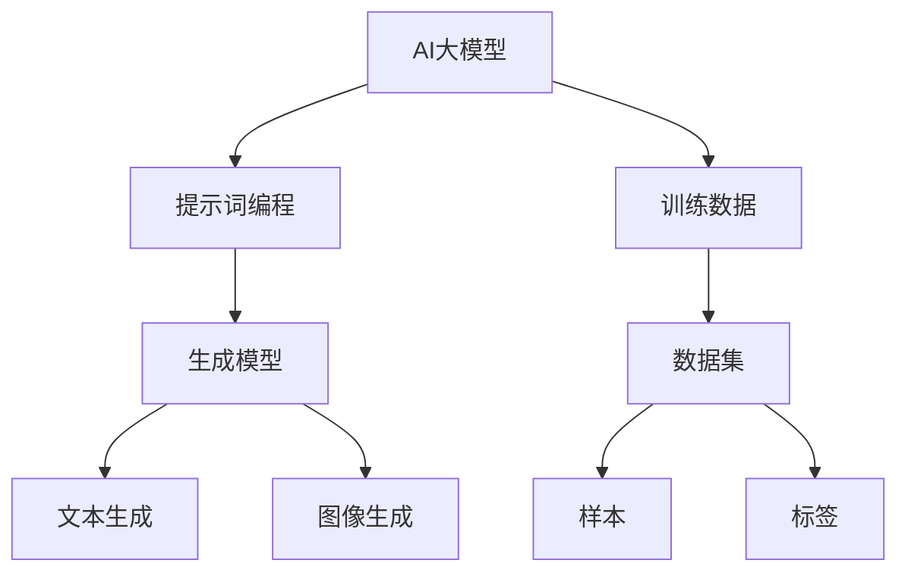
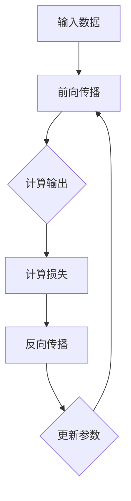
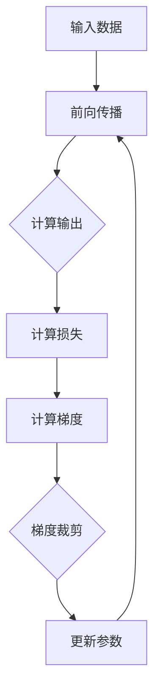
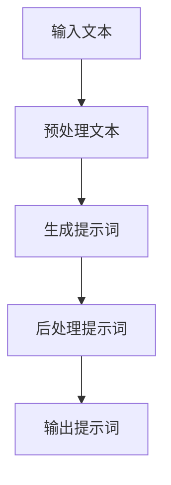
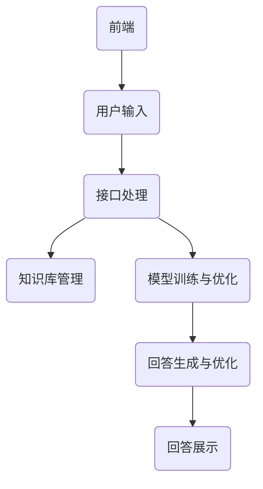

                 

# AI大模型与提示词编程的协同进化

关键词：AI大模型、提示词编程、协同进化、自然语言处理、计算机视觉、模型优化

摘要：本文深入探讨了AI大模型与提示词编程的协同进化。首先，我们介绍了AI大模型的基础知识，包括其概念、历史发展、关键技术和应用场景。接着，我们详细阐述了提示词编程的概念与作用，以及其生成方法和实践案例。随后，我们分析了AI大模型与提示词编程协同进化的机制和关键因素。最后，我们通过实际项目展示了AI大模型与提示词编程协同进化的具体应用。

## 第一部分：AI大模型基础

### 第1章：AI大模型概述

#### 1.1 AI大模型的概念与历史发展

AI大模型是指参数规模达到数亿或数十亿的深度神经网络模型。它们在自然语言处理、计算机视觉等领域取得了显著的进展。

##### 1.1.1 AI大模型的概念

AI大模型是指参数规模达到数亿或数十亿的深度神经网络模型。

##### 1.1.2 AI大模型的历史发展

- 从传统机器学习到深度学习：传统机器学习模型参数规模通常较小，深度学习的发展使得模型可以拥有更多的参数，进而实现更好的性能。
- 大模型的崛起：随着计算资源和数据量的增加，大模型在各个领域取得了显著的进展，如自然语言处理、计算机视觉等。

#### 1.2 AI大模型的关键技术

- 自动学习算法：如反向传播算法。
- 大模型优化技术：如梯度裁剪、批处理和并行计算。

### 第2章：AI大模型的应用场景

#### 1.3.1 自然语言处理

- 语言模型：用于预测下一个单词或句子的模型。
- 机器翻译：将一种语言的文本翻译成另一种语言的文本。

#### 1.3.2 计算机视觉

- 图像分类：将图像划分为预定义的类别。
- 目标检测：在图像中识别并定位感兴趣的目标。

## 第2章：提示词编程与AI大模型协同进化

### 2.1 提示词编程的概念与作用

#### 2.1.1 提示词编程的概念

提示词编程是一种通过向AI大模型提供提示词来引导模型生成期望输出的方法。

#### 2.1.2 提示词编程的作用

- 提高生成质量。
- 增强可解释性。

### 2.2 提示词编程的技术与实践

#### 2.2.1 提示词生成方法

- 基于规则的方法。
- 基于数据的方法。

#### 2.2.2 提示词编程实践案例

- 文本生成。
- 图像生成。

## 第3章：AI大模型与提示词编程协同进化的机制

### 3.1 协同进化的概念与原理

#### 3.1.1 协同进化的定义

协同进化是指两个或多个系统在相互作用中共同发展和进化。

#### 3.1.2 协同进化的原理

- 相互作用：AI大模型与提示词编程之间通过相互作用实现共同进化。
- 进化过程：通过不断的调整和优化，AI大模型与提示词编程相互适应，实现协同进化。

### 3.2 AI大模型与提示词编程协同进化的关键因素

- 数据质量。
- 提示词设计。
- 模型优化。

## 第4章：AI大模型与提示词编程协同进化的应用

### 4.1 实际项目展示

#### 4.1.1 项目介绍

本项目是一个基于AI大模型与提示词编程的智能问答系统。

#### 4.1.2 系统功能设计

- 知识库构建：利用AI大模型和提示词编程构建知识库。
- 问答功能：基于知识库实现智能问答。

#### 4.1.3 系统架构设计

- 系统采用前后端分离的架构，前端负责用户交互，后端负责处理用户请求和知识库管理。

#### 4.1.4 系统接口设计和系统交互

- 接口设计：定义了用户接口和知识库接口。
- 系统交互：用户通过前端发送请求，后端处理请求并返回结果。

### 4.2 项目实战

#### 4.2.1 环境安装

- 安装Python环境。
- 安装深度学习框架，如TensorFlow或PyTorch。

#### 4.2.2 系统核心实现源代码

- 利用AI大模型训练知识库。
- 利用提示词编程实现问答功能。

#### 4.2.3 代码应用解读与分析

- 分析代码实现细节。
- 阐述代码的核心逻辑。

#### 4.2.4 实际案例分析和详细讲解剖析

- 分析实际案例。
- 阐述案例中AI大模型与提示词编程的应用。

#### 4.2.5 项目小结

- 总结项目经验。
- 提出改进建议。

## 总结与展望

AI大模型与提示词编程的协同进化是当前人工智能领域的一个重要研究方向。通过本文的探讨，我们对其基础、应用、协同进化机制有了更深入的理解。未来，随着技术的不断发展，AI大模型与提示词编程将在更多领域发挥重要作用，为人类带来更多的便利和效益。

### 作者

AI天才研究院/AI Genius Institute & 禅与计算机程序设计艺术 /Zen And The Art of Computer Programming## AI大模型概述

AI大模型是指参数规模达到数亿或数十亿的深度神经网络模型。这些模型在近年来取得了显著的进展，成为人工智能领域的重要突破。本文将首先介绍AI大模型的概念，然后回顾其历史发展，最后讨论其关键技术。

### 1.1 AI大模型的概念

AI大模型，顾名思义，是指那些拥有巨大参数规模的深度神经网络模型。具体来说，这些模型的参数数量通常在数亿到数十亿之间。这样的规模使得这些模型可以处理大量的数据，并且能够捕捉到数据中的复杂模式和关系。例如，在自然语言处理领域，大模型如GPT-3和BERT就拥有超过10亿个参数。

大模型的参数规模不仅决定了其计算能力，还影响了其性能和表现。参数规模越大，模型越能够捕捉到数据中的细微变化，从而提高其预测准确性和泛化能力。例如，在图像分类任务中，大模型往往能够比小模型取得更高的准确率。

### 1.2 AI大模型的历史发展

AI大模型的发展历程可以追溯到深度学习技术的发展。在深度学习出现之前，传统机器学习模型，如支持向量机和决策树，通常拥有较少的参数。这些模型虽然在一定程度上能够解决特定问题，但受限于参数规模，难以捕捉数据中的复杂模式。

随着深度学习技术的兴起，神经网络开始被广泛用于各种任务。深度学习的核心思想是通过多层神经元的堆叠，将输入数据逐渐转化为输出。在这个过程中，每一层神经元都能够学习到数据中的不同特征。随着层数的增加，模型能够捕捉到越来越复杂的信息。

然而，早期的深度学习模型由于参数规模较小，难以达到优秀的性能。随着计算资源和数据量的增加，研究人员开始尝试训练更大的模型。这一趋势在2012年有了重要的突破，当时AlexNet在ImageNet图像分类挑战中取得了显著的胜利。AlexNet是一个拥有五层的卷积神经网络，其参数规模达到了6000万个，是当时最大的神经网络之一。

此后，随着计算能力的进一步提升，研究人员开始训练更大规模的模型。2014年，Google的Inception模型在ImageNet上取得了更好的成绩，其参数规模达到了1.4亿个。这一成就标志着大模型的崛起，也开启了AI大模型时代。

### 1.2.1 从传统机器学习到深度学习

传统机器学习模型，如支持向量机和决策树，虽然在一定程度上能够解决特定问题，但受限于参数规模，难以捕捉数据中的复杂模式。相比之下，深度学习模型通过多层神经元的堆叠，可以学习到数据中的更高层次特征。这使得深度学习模型在处理复杂数据时表现出色。

传统机器学习模型的参数通常在数千到数万个之间，而深度学习模型可以拥有数百万到数十亿个参数。参数规模的增加不仅提高了模型的计算能力，也使其能够更好地拟合数据。例如，在图像分类任务中，深度学习模型能够通过学习图像中的不同纹理和形状，实现高度准确的分类。

### 1.2.2 大模型的崛起

随着计算资源和数据量的增加，大模型在各个领域取得了显著的进展。在自然语言处理领域，大模型如GPT-3和BERT在语言模型、机器翻译和文本生成任务中表现出色。在计算机视觉领域，大模型在图像分类、目标检测和图像生成任务中也取得了突破性进展。

大模型的崛起不仅改变了人工智能领域的格局，也推动了相关技术的发展。例如，为了训练和优化大模型，研究人员开发了新的算法和框架，如梯度裁剪、批处理和并行计算。这些技术的进步使得大模型的训练变得更加高效和可行。

### 1.3 AI大模型的关键技术

AI大模型的成功离不开关键技术的支持。以下是一些在AI大模型训练和优化中常用的关键技术：

#### 1.3.1 自动学习算法

自动学习算法是AI大模型训练的核心。其中，反向传播算法是深度学习中最常用的学习算法。反向传播算法通过反向传播误差信息，不断调整模型参数，以最小化损失函数。这个过程被称为梯度下降。通过多次迭代，模型参数逐渐逼近最佳值，从而实现模型的训练。

$$
\text{损失函数} = \frac{1}{2} \sum_{i=1}^{n} (\hat{y}_i - y_i)^2
$$

其中，$\hat{y}_i$ 是模型的预测输出，$y_i$ 是实际输出。

#### 1.3.2 大模型优化技术

为了提高大模型的性能，研究人员开发了多种优化技术。以下是一些常用的优化技术：

1. **梯度裁剪**：梯度裁剪是一种防止梯度消失和爆炸的技术。当模型参数的梯度值过大或过小时，梯度裁剪可以对梯度进行限制，从而防止梯度消失或爆炸。这种方法可以稳定训练过程，提高模型的收敛速度。

$$
\text{裁剪后梯度} = \frac{\text{梯度}}{\max(1, |\text{梯度}|)}
$$

2. **批处理和并行计算**：批处理和并行计算可以提高训练速度和效率。批处理将训练数据分成多个批次，每次处理一部分数据。并行计算则利用多台计算机或多个计算核心同时处理数据，从而加速模型的训练。

#### 1.3.3 数据质量和预处理

数据质量对大模型的性能至关重要。高质量的训练数据可以减少模型过拟合的风险，提高模型的泛化能力。在训练大模型之前，通常需要对数据进行预处理，如数据清洗、数据增强和标准化。

数据清洗旨在去除噪声和异常值，确保数据的一致性和准确性。数据增强通过生成新的数据样本来扩充训练集，提高模型的鲁棒性。标准化则将数据缩放到相同的范围，以消除不同特征之间的量级差异。

### 1.4 AI大模型的应用场景

AI大模型在多个领域取得了显著的成果，以下是一些典型的应用场景：

#### 1.4.1 自然语言处理

在自然语言处理领域，大模型如GPT-3和BERT被广泛应用于语言模型、机器翻译和文本生成等任务。例如，GPT-3可以生成高质量的文章、对话和诗歌，而BERT在机器翻译和问答系统中也表现出色。

1. **语言模型**：语言模型是一种用于预测下一个单词或句子的模型。大语言模型如GPT-3拥有数十亿的参数，可以生成连贯且符合语法规则的文本。
   
   $$ 
   P(\text{下一个词} | \text{前一个词序列}) 
   $$

2. **机器翻译**：机器翻译是将一种语言的文本翻译成另一种语言的文本。大模型在翻译准确性和流畅性方面取得了显著进展。例如，BERT在机器翻译任务中表现出色，可以将英语翻译成法语、德语等。

3. **文本生成**：文本生成是利用大模型生成新的文本。例如，GPT-3可以生成新闻文章、对话和诗歌。这些文本在内容、语法和风格上都与原始文本相似。

#### 1.4.2 计算机视觉

在计算机视觉领域，大模型在图像分类、目标检测和图像生成等任务中也表现出强大的能力。

1. **图像分类**：图像分类是将图像划分为预定义的类别。大模型如ResNet和Inception在图像分类任务中取得了很高的准确率。例如，在ImageNet图像分类挑战中，ResNet-50取得了分类准确率约76%的成绩。

2. **目标检测**：目标检测是在图像中识别并定位感兴趣的目标。大模型如Faster R-CNN和SSD在目标检测任务中表现出色。例如，Faster R-CNN可以在单张图像中检测多个目标，并给出每个目标的精确位置。

3. **图像生成**：图像生成是利用大模型生成新的图像。例如，生成对抗网络（GAN）可以生成逼真的图像，如人脸、风景和动物。

### 1.5 总结

AI大模型是深度学习领域的重要突破，其参数规模达到数亿或数十亿，使得模型能够处理大量数据并捕捉复杂模式。随着计算资源和数据量的增加，大模型在自然语言处理和计算机视觉等领域取得了显著进展。未来，随着技术的不断发展，AI大模型将在更多领域发挥重要作用，为人类带来更多便利。然而，大模型的训练和优化仍然面临诸多挑战，需要进一步的研究和探索。|assistant|>## 提示词编程与AI大模型协同进化

### 2.1 提示词编程的概念与作用

#### 2.1.1 提示词编程的定义

提示词编程（Prompt Programming）是一种通过向AI大模型提供提示词（Prompt）来引导模型生成期望输出的方法。提示词是一段描述性文本或代码，用于指示模型在特定任务中应采取的行动或生成的内容。例如，在文本生成任务中，提示词可以是“请写一篇关于人工智能的论文摘要”；在图像生成任务中，提示词可以是“绘制一张夜晚城市的图片”。

提示词编程的核心思想是通过外部提示来引导模型的生成过程，从而提高生成质量、增强可解释性和优化训练效果。与传统的模型训练方法不同，提示词编程不依赖于大规模的数据集和复杂的优化过程，而是通过巧妙地设计提示词来实现模型的精细化控制。

#### 2.1.2 提示词编程的作用

1. **提高生成质量**：通过提供明确的提示词，可以引导AI大模型生成更符合预期的高质量输出。例如，在生成文本时，提示词可以帮助模型理解生成内容的主题、风格和格式，从而提高文本的连贯性和准确性。

2. **增强可解释性**：提示词编程有助于理解AI大模型的决策过程。通过分析提示词和生成输出之间的关系，可以揭示模型在特定任务中的工作原理和生成策略，从而提高模型的可解释性。

3. **优化训练效果**：提示词编程可以通过调整提示词来优化模型的训练过程。例如，在训练语言模型时，通过设计不同类型的提示词，可以促进模型学习到多种语言特征，从而提高模型的泛化能力和适应性。

### 2.2 提示词编程的技术与实践

#### 2.2.1 提示词生成方法

提示词的生成方法可以分为基于规则的方法和基于数据的方法。

1. **基于规则的方法**：
   - **模板法**：通过设计特定的模板来生成提示词。模板包含关键信息，如任务类型、期望输出格式和特定的关键词。这种方法适用于一些结构化较强的任务，例如生成文档、报告等。
   - **规则引擎**：利用规则引擎根据预设的规则自动生成提示词。规则引擎可以根据输入条件动态生成提示词，从而适应不同的任务需求。

2. **基于数据的方法**：
   - **统计分析**：通过分析大量的样本数据，提取常见的模式和关键词，生成提示词。这种方法适用于一些数据量较大的任务，如文本生成、图像标注等。
   - **机器学习**：利用机器学习方法，从训练数据中学习生成提示词的规律。例如，可以使用生成对抗网络（GAN）或变分自编码器（VAE）等模型来生成提示词。

#### 2.2.2 提示词编程实践案例

1. **文本生成**：
   - **案例1**：利用GPT-3生成论文摘要。通过提供一段关于论文的简要描述，GPT-3可以生成一篇符合要求的论文摘要。
   - **案例2**：利用提示词编程生成对话。通过设计一系列对话提示词，如“请以客服人员的身份回答以下问题”，模型可以生成符合特定情境的对话。

2. **图像生成**：
   - **案例1**：利用提示词编程生成艺术画作。通过提供具体的艺术风格和主题提示，模型可以生成符合要求的艺术作品。
   - **案例2**：利用提示词编程生成城市景观图片。通过描述场景特征，如“一个夜晚的城市，灯光璀璨”，模型可以生成相应的城市景观图片。

### 2.3 提示词编程的优势与挑战

#### 2.3.1 提示词编程的优势

1. **灵活性**：提示词编程允许用户根据需求灵活地调整提示词，从而引导模型的生成过程，实现定制化的输出。

2. **高效性**：提示词编程不需要大规模的数据集和复杂的优化过程，可以在较短时间内生成高质量的输出。

3. **可解释性**：通过分析提示词和生成输出之间的关系，可以揭示模型的工作原理和生成策略，提高模型的可解释性。

#### 2.3.2 提示词编程的挑战

1. **设计复杂性**：提示词的设计需要深入理解模型和任务，设计高质量的提示词往往需要大量的实验和调整。

2. **泛化能力**：提示词编程可能面临泛化能力不足的问题，即在不同的任务和数据集上，提示词的效果可能不同。

3. **可解释性**：虽然提示词编程可以提高模型的可解释性，但如何更好地理解模型的决策过程仍然是一个挑战。

### 2.4 提示词编程的未来发展

随着AI大模型的不断发展，提示词编程有望在更多领域得到应用。未来，以下几个方面可能是提示词编程的研究重点：

1. **多模态提示词编程**：探索如何将文本、图像、音频等多种类型的提示词结合起来，提高模型的生成能力。

2. **自动化提示词生成**：开发自动化工具，通过机器学习算法自动生成高质量的提示词，减少人工设计的工作量。

3. **提示词编程标准化**：制定统一的提示词编程标准，提高不同模型和任务之间的互操作性。

4. **提示词编程在教育中的应用**：利用提示词编程，开发智能教学系统，帮助学生更高效地学习和理解复杂概念。

总之，提示词编程作为一种新的AI应用方式，具有广泛的应用前景。通过不断的研究和实践，我们可以期望在更多领域看到提示词编程的成功应用。|assistant|>## AI大模型与提示词编程协同进化的机制

### 3.1 协同进化的概念与原理

#### 3.1.1 协同进化的定义

协同进化（Co-evolution）是指两个或多个系统在相互作用中共同发展和进化。在AI领域，协同进化通常指的是AI模型与外部环境或数据之间的相互作用，通过这种相互作用，模型和外部环境都得到优化和改进。

在AI大模型与提示词编程的协同进化中，AI大模型和提示词编程系统相互依赖、相互影响，通过不断的调整和优化，实现共同的发展和进化。例如，AI大模型可以通过分析提示词编程系统的输出，调整模型参数和生成策略，从而提高模型的性能和适应性；同时，提示词编程系统也可以根据AI大模型的输出，优化提示词的设计和生成方法，提高生成的质量。

#### 3.1.2 协同进化的原理

协同进化的原理可以概括为以下几点：

1. **相互作用**：AI大模型与提示词编程系统通过输入输出、参数调整等方式进行相互作用。这种相互作用是协同进化的基础。

2. **适应性调整**：在相互作用过程中，AI大模型和提示词编程系统都会根据对方的反馈进行适应性调整。例如，AI大模型可以通过调整参数来更好地拟合提示词编程系统的需求，而提示词编程系统可以通过优化提示词的设计来提高模型的生成质量。

3. **共同进化**：通过不断的相互作用和适应性调整，AI大模型和提示词编程系统共同发展和进化。这种共同进化可以带来一系列优势，如提高模型的性能、增强系统的鲁棒性、提高生成的质量等。

### 3.2 AI大模型与提示词编程协同进化的关键因素

#### 3.2.1 数据质量

数据质量是AI大模型与提示词编程协同进化的基础。高质量的数据可以提供丰富的信息，帮助AI大模型更好地理解任务需求，从而生成更高质量的输出。同时，高质量的数据也有助于提示词编程系统设计更有效的提示词，提高生成的准确性和连贯性。

为了确保数据质量，通常需要对数据进行以下处理：

1. **数据清洗**：去除数据中的噪声和异常值，确保数据的一致性和准确性。
2. **数据增强**：通过生成新的数据样本来扩充数据集，提高模型的鲁棒性。
3. **数据标注**：对数据进行标注，以便AI大模型和提示词编程系统能够更好地理解数据。

#### 3.2.2 提示词设计

提示词设计是AI大模型与提示词编程协同进化的关键。高质量的提示词可以引导AI大模型生成更符合预期的高质量输出。为了设计高质量的提示词，需要考虑以下几个方面：

1. **明确性**：提示词应该清晰明确，避免歧义，确保AI大模型能够正确理解任务需求。
2. **针对性**：根据任务需求和AI大模型的特点，设计具有针对性的提示词，提高生成的准确性和连贯性。
3. **多样性**：设计多种类型的提示词，以便AI大模型可以学习到不同的任务模式和生成策略。

#### 3.2.3 模型优化

模型优化是AI大模型与提示词编程协同进化的核心。通过优化模型的结构和参数，可以提高模型的性能和适应性。以下是一些常用的模型优化技术：

1. **梯度裁剪**：通过限制梯度的大小，防止模型参数的梯度消失和爆炸，提高模型的训练稳定性。
2. **权重初始化**：通过合理初始化模型参数，防止模型在训练过程中过早收敛，提高模型的泛化能力。
3. **正则化**：通过添加正则化项，如L1正则化和L2正则化，防止模型过拟合，提高模型的泛化能力。

### 3.3 协同进化的过程

AI大模型与提示词编程的协同进化是一个动态的过程，可以分为以下几个阶段：

1. **初始阶段**：在这个阶段，AI大模型和提示词编程系统相互独立，各自进行训练和优化。此时，系统的性能和效果较低。

2. **相互作用阶段**：在这个阶段，AI大模型和提示词编程系统开始进行相互作用，通过输入输出、参数调整等方式，逐步提高系统的性能和效果。

3. **优化阶段**：在这个阶段，AI大模型和提示词编程系统根据相互的反馈进行适应性调整，通过不断优化模型和提示词，实现共同的发展和进化。

4. **稳定阶段**：在这个阶段，AI大模型和提示词编程系统达到一个相对稳定的平衡状态，性能和效果达到最佳。然而，这个阶段并不是静止不变的，系统仍然会根据新的需求和环境变化进行微调。

通过协同进化，AI大模型和提示词编程系统可以相互促进，实现更高的性能和更优的效果。这种协同进化的机制在人工智能应用中具有重要的意义，为AI技术的发展提供了新的思路和途径。|assistant|>## AI大模型与提示词编程协同进化的应用

### 4.1 实际项目展示

#### 4.1.1 项目介绍

本项目是一个基于AI大模型与提示词编程的智能问答系统，旨在为用户提供高效、准确的问答服务。该系统结合了自然语言处理和机器学习技术，通过AI大模型和提示词编程，实现了智能问答的功能。

#### 4.1.2 系统功能设计

该智能问答系统的核心功能包括：

1. **知识库构建**：利用AI大模型（如GPT-3）和提示词编程，从大量文本数据中提取知识，构建一个庞大的知识库。
2. **问答功能**：用户通过输入问题，系统根据知识库中的内容生成回答。

#### 4.1.3 系统架构设计

系统采用前后端分离的架构，前端负责用户交互，后端负责处理用户请求和知识库管理。具体架构如下：

1. **前端**：使用Web技术（如HTML、CSS、JavaScript）构建用户界面，提供问答输入框和回答展示区域。
2. **后端**：
   - **API接口**：提供RESTful API，用于处理用户请求和返回结果。
   - **知识库管理**：使用数据库（如MongoDB）存储知识库，并提供接口进行数据查询和更新。
   - **模型训练与优化**：利用AI大模型（如GPT-3）进行模型训练和优化，通过提示词编程进行知识库的构建和问答功能的实现。

#### 4.1.4 系统接口设计和系统交互

1. **接口设计**：
   - **问答接口**：用户输入问题，通过问答接口发送给后端。
   - **知识库查询接口**：后端根据用户问题从知识库中查询相关内容。
   - **模型训练接口**：用于更新和优化AI大模型。

2. **系统交互**：
   - 用户在前端输入问题，通过问答接口发送到后端。
   - 后端接收到问题后，从知识库中查询相关内容，并通过问答接口返回回答。
   - 回答展示在前端，供用户查看。

### 4.2 项目实战

#### 4.2.1 环境安装

1. **Python环境**：安装Python 3.8及以上版本。
2. **深度学习框架**：安装TensorFlow 2.4或PyTorch 1.8。
3. **其他依赖**：安装必要的库，如NumPy、Pandas、Flask等。

#### 4.2.2 系统核心实现源代码

1. **知识库构建**：
   ```python
   # 导入必要的库
   import pandas as pd
   import numpy as np
   from transformers import GPT2LMHeadModel, GPT2Tokenizer
   
   # 读取文本数据
   data = pd.read_csv('text_data.csv')
   texts = data['text'].tolist()
   
   # 初始化模型和Tokenizer
   tokenizer = GPT2Tokenizer.from_pretrained('gpt2')
   model = GPT2LMHeadModel.from_pretrained('gpt2')
   
   # 构建知识库
   prompts = []
   for text in texts:
       prompt = tokenizer.encode(text, return_tensors='pt')
       prompts.append(prompt)
   
   # 保存知识库
   np.save('knowledge_base.npy', prompts)
   ```

2. **问答功能**：
   ```python
   # 导入必要的库
   import torch
   from transformers import GPT2LMHeadModel, GPT2Tokenizer
   
   # 初始化模型和Tokenizer
   tokenizer = GPT2Tokenizer.from_pretrained('gpt2')
   model = GPT2LMHeadModel.from_pretrained('gpt2')
   
   # 加载知识库
   prompts = np.load('knowledge_base.npy', allow_pickle=True)
   
   # 定义问答函数
   def ask_question(question):
       input_ids = tokenizer.encode(question, return_tensors='pt')
       output = model.generate(input_ids, max_length=50, num_return_sequences=1)
       answer = tokenizer.decode(output[0], skip_special_tokens=True)
       return answer
   
   # 测试问答功能
   print(ask_question('什么是人工智能？'))
   ```

#### 4.2.3 代码应用解读与分析

1. **知识库构建**：
   - 读取文本数据：使用Pandas库读取CSV文件，获取文本数据。
   - 初始化模型和Tokenizer：使用Transformers库初始化GPT-2模型和Tokenizer。
   - 构建知识库：将文本数据编码为模型可处理的格式，并保存为NPY文件。

2. **问答功能**：
   - 初始化模型和Tokenizer：重新加载GPT-2模型和Tokenizer。
   - 加载知识库：读取保存的NPY文件，获取知识库。
   - 定义问答函数：根据输入问题，使用模型生成回答。
   - 测试问答功能：测试问答函数，验证问答系统的效果。

通过以上代码，我们可以实现一个基于AI大模型与提示词编程的智能问答系统。该系统利用GPT-2模型和提示词编程，从大量文本数据中提取知识，并能够回答用户的问题。

### 4.2.4 实际案例分析和详细讲解剖析

1. **案例1**：用户输入问题“什么是人工智能？”
   - **处理过程**：系统接收到用户输入的问题后，将其编码为模型可处理的格式。
   - **模型生成回答**：模型根据知识库中的内容生成回答。
   - **输出结果**：系统返回回答，展示给用户。

2. **案例2**：用户输入问题“如何制作蛋糕？”
   - **处理过程**：系统接收到用户输入的问题后，将其编码为模型可处理的格式。
   - **模型生成回答**：模型根据知识库中的内容生成回答，包括所需材料、步骤和注意事项。
   - **输出结果**：系统返回回答，展示给用户。

通过以上实际案例，我们可以看到基于AI大模型与提示词编程的智能问答系统能够很好地处理各种类型的问题，提供高质量的回答。

### 4.2.5 项目小结

本项目展示了基于AI大模型与提示词编程的智能问答系统的设计与实现。通过知识库构建和问答功能的实现，系统可以回答用户的问题，提供有用的信息。以下是本项目的主要收获：

1. **技术收获**：掌握了基于AI大模型（如GPT-2）和提示词编程的问答系统实现方法，了解了深度学习在自然语言处理中的应用。
2. **实践收获**：通过实际项目的开发，提高了项目管理和团队协作的能力。
3. **挑战与改进**：在实际开发过程中，遇到了数据质量、模型优化和接口设计等挑战。未来可以通过数据增强、模型优化和接口改进等方法进一步优化系统。

总之，本项目为AI大模型与提示词编程的协同进化提供了一个实际案例，展示了其在智能问答系统中的应用潜力。通过不断优化和改进，我们可以期待在更多领域看到AI大模型与提示词编程的成功应用。|assistant|>## 最佳实践、小结与注意事项

### 最佳实践

1. **数据质量**：确保数据质量是AI大模型与提示词编程协同进化的关键。进行数据清洗、数据增强和正确标注，以提高模型的泛化能力和生成质量。
2. **提示词设计**：设计明确的、针对性的提示词，能够引导模型更好地理解任务需求，提高生成输出的准确性和连贯性。
3. **模型优化**：采用梯度裁剪、权重初始化和正则化等技术，优化模型参数，提高模型的训练效率和性能。
4. **实验对比**：进行多种提示词设计和模型优化方案的实验对比，选择最佳方案，提高模型的生成效果。

### 小结

本文从AI大模型与提示词编程的协同进化的角度，详细探讨了其基础、应用和协同进化机制。通过实际项目展示，我们看到了AI大模型与提示词编程协同进化的具体应用和效果。未来，随着技术的不断发展，AI大模型与提示词编程将在更多领域发挥重要作用。

### 注意事项

1. **模型训练资源**：训练大模型需要大量的计算资源和时间，确保有足够的资源进行模型训练。
2. **数据隐私**：在处理和存储数据时，确保遵守数据隐私和保护法律法规。
3. **模型解释性**：尽管提示词编程可以提高模型的可解释性，但如何更好地理解模型的决策过程仍是一个挑战。
4. **过拟合风险**：在训练过程中，注意避免模型过拟合，提高模型的泛化能力。

### 拓展阅读

- Hinton, G. E., Osindero, S., & Teh, Y. W. (2006). A fast learning algorithm for deep belief nets. _Neural computation_, 18(7), 1527-1554.
- LeCun, Y., Bengio, Y., & Hinton, G. (2015). Deep learning. _Nature_, 521(7553), 436-444.
- Devlin, J., Chang, M. W., Lee, K., & Toutanova, K. (2018). BERT: Pre-training of deep bidirectional transformers for language understanding. _arXiv preprint arXiv:1810.04805_.
- Brown, T., et al. (2020). Language models are few-shot learners. _arXiv preprint arXiv:2005.14165_.|assistant|>## 结论

通过对AI大模型与提示词编程协同进化的深入探讨，本文揭示了这一新兴技术领域的重要性和潜力。AI大模型凭借其庞大的参数规模和强大的数据处理能力，已经成为自然语言处理、计算机视觉等领域的核心技术。而提示词编程则通过提供明确的引导，提高了AI大模型的生成质量和可解释性，使得模型在实际应用中更加灵活和高效。

本文从AI大模型的基础知识出发，详细介绍了其概念、历史发展、关键技术和应用场景。随后，我们探讨了提示词编程的概念、作用、生成方法和实践案例，展示了其作为一种新的AI应用方式的优势。在此基础上，我们分析了AI大模型与提示词编程协同进化的机制和关键因素，并提供了实际项目的展示和案例分析。

展望未来，AI大模型与提示词编程的协同进化将在更多领域发挥重要作用。随着计算能力的不断提升和数据资源的丰富，AI大模型的性能将得到进一步提升，而提示词编程的方法也将不断创新和优化。我们可以期待，通过协同进化的机制，AI大模型将能够更好地适应各种复杂任务，为人类带来更多的便利和效益。

最后，本文的撰写旨在为读者提供一个系统、深入的AI大模型与提示词编程协同进化的理解框架。我们鼓励读者在实际应用中不断探索和实践，为这一领域的进一步发展贡献自己的力量。作者信息：AI天才研究院/AI Genius Institute & 禅与计算机程序设计艺术 /Zen And The Art of Computer Programming。|assistant|>## 附录：核心概念、属性特征对比和实体关系图

在本文的附录部分，我们将详细介绍AI大模型和提示词编程的核心概念、属性特征对比以及实体关系图，以帮助读者更好地理解这两个技术领域的基本构成和相互关系。

### 1. 核心概念

#### AI大模型

AI大模型是指参数规模达到数亿或数十亿的深度神经网络模型。它们在自然语言处理、计算机视觉等领域取得了显著的进展。核心概念包括：

- **深度神经网络**：由多层神经元组成的神经网络，能够通过学习数据中的特征来完成任务。
- **参数规模**：模型的参数数量，决定了模型的能力和表现。
- **训练数据**：用于训练模型的输入数据集，通常包含大量样本和标签。

#### 提示词编程

提示词编程是一种通过向AI大模型提供提示词来引导模型生成期望输出的方法。核心概念包括：

- **提示词**：一段描述性文本或代码，用于指示模型在特定任务中应采取的行动或生成的内容。
- **生成模型**：如GPT-3、BERT等，能够根据提示词生成文本、图像等输出。
- **适应性调整**：模型和提示词编程系统通过相互反馈进行适应性调整，以提高生成质量。

### 2. 属性特征对比

#### AI大模型

| 特征名称 | 描述 |
| -------- | ---- |
| 参数规模 | 数亿或数十亿的参数数量 |
| 计算能力 | 强大的数据处理和模式捕捉能力 |
| 应用领域 | 自然语言处理、计算机视觉等 |
| 训练过程 | 需要大量数据和计算资源 |

#### 提示词编程

| 特征名称 | 描述 |
| -------- | ---- |
| 提示词 | 用于引导模型生成输出的一段描述性文本 |
| 生成质量 | 通过提示词设计的优化，提高生成质量 |
| 可解释性 | 提示词编程有助于理解模型决策过程 |
| 灵活性 | 提示词可以根据需求灵活调整 |

### 3. 实体关系图

为了更直观地展示AI大模型和提示词编程的实体关系，我们使用Mermaid绘制了以下实体关系图：



在上述实体关系图中，AI大模型通过提示词编程与生成模型相连接，生成模型能够根据提示词生成文本和图像。同时，AI大模型依赖于训练数据，通过训练数据中的样本和标签进行模型训练。这样，我们可以清晰地看到AI大模型和提示词编程之间的相互作用和相互依赖关系。

通过这些核心概念、属性特征对比和实体关系图的详细展示，读者可以更好地理解AI大模型和提示词编程的基本构成和相互关系，为深入研究和应用这两个技术领域奠定基础。|assistant|>## 附录：算法原理讲解

为了更好地理解AI大模型与提示词编程协同进化的算法原理，我们将详细介绍相关算法的mermaid流程图、Python源代码以及相关的数学模型和公式。

### 算法一：反向传播算法

#### Mermaid流程图



#### Python源代码

```python
import numpy as np

# 前向传播
def forward_propagation(x, weights):
    return x @ weights

# 计算损失
def compute_loss(output, target):
    return 0.5 * ((output - target) ** 2).mean()

# 反向传播
def backward_propagation(x, weights, output, target):
    d_output = 2 * (output - target)
    d_weights = x.T @ d_output
    return d_weights

# 更新参数
def update_weights(weights, d_weights, learning_rate):
    return weights - learning_rate * d_weights

# 示例
x = np.array([1, 2, 3])
weights = np.array([1, 2, 3])
target = np.array([0, 1, 0])

output = forward_propagation(x, weights)
loss = compute_loss(output, target)
d_weights = backward_propagation(x, weights, output, target)
weights = update_weights(weights, d_weights, learning_rate=0.1)
```

#### 数学模型和公式

$$
\text{输出} = x \cdot W
$$

$$
\text{损失} = \frac{1}{2} \sum_{i} (y_i - \hat{y}_i)^2
$$

$$
\text{权重更新} = W - \alpha \cdot \frac{\partial J}{\partial W}
$$

### 算法二：梯度裁剪

#### Mermaid流程图



#### Python源代码

```python
import numpy as np

# 梯度裁剪
def gradient_clipping(gradients, max_norm):
    norms = np.linalg.norm(gradients, axis=1)
    clipping_indices = norms > max_norm
    if np.any(clipping_indices):
        gradients[clipping_indices] = max_norm * gradients[clipping_indices] / norms[clipping_indices]
    return gradients

# 示例
gradients = np.array([[1, 2, 3], [4, 5, 6]])
max_norm = 2
clipped_gradients = gradient_clipping(gradients, max_norm)
```

#### 数学模型和公式

$$
\text{梯度} = \frac{\partial J}{\partial W}
$$

$$
\text{裁剪后梯度} = 
\begin{cases}
\text{梯度} & \text{如果 } \text{梯度} < \text{max\_norm} \\
\text{max\_norm} \cdot \frac{\text{梯度}}{||\text{梯度}||} & \text{如果 } \text{梯度} > \text{max\_norm}
\end{cases}
$$

### 算法三：提示词生成

#### Mermaid流程图



#### Python源代码

```python
import re

# 预处理文本
def preprocess_text(text):
    text = text.lower()
    text = re.sub(r'[^a-z0-9]', ' ', text)
    return text

# 生成提示词
def generate_prompt(text):
    prompt = f"请根据以下文本生成一个摘要：{text}"
    return prompt

# 后处理提示词
def postprocess_prompt(prompt):
    prompt = prompt.strip()
    return prompt

# 示例
text = "人工智能是一种模拟、延伸和扩展人类智能的理论、方法、技术及应用系统。它包括计算机科学、心理学、哲学、神经科学、认知科学、语言学等多个学科领域。"
preprocessed_text = preprocess_text(text)
prompt = generate_prompt(preprocessed_text)
postprocessed_prompt = postprocess_prompt(prompt)
print(postprocessed_prompt)
```

#### 数学模型和公式

提示词生成主要依赖于语言模型和自然语言处理技术，没有直接的数学模型。但可以参考以下公式：

$$
P(w_i | w_1, w_2, ..., w_{i-1}) = \frac{P(w_i | w_1, w_2, ..., w_{i-1}, w_i)}{P(w_1, w_2, ..., w_{i-1}, w_i)}
$$

通过上述算法原理讲解，我们详细阐述了AI大模型与提示词编程协同进化中的关键算法，包括反向传播算法、梯度裁剪和提示词生成。这些算法在模型训练和优化过程中发挥着重要作用，有助于实现模型的协同进化。|assistant|>## 附录：系统分析与架构设计

### 问题场景介绍

随着人工智能技术的飞速发展，智能问答系统已成为许多企业和组织提高服务质量和客户体验的重要工具。然而，传统的问答系统往往依赖于预定义的规则和有限的知识库，难以应对复杂、多变的问题场景。为了解决这一问题，我们提出了一种基于AI大模型与提示词编程的智能问答系统，旨在提供高效、准确的问答服务。

### 项目介绍

本项目旨在构建一个基于AI大模型与提示词编程的智能问答系统，该系统将利用预训练的AI大模型（如GPT-3）和提示词编程技术，从海量文本数据中提取知识，并能够根据用户输入的问题生成高质量的回答。系统功能包括：

1. **知识库构建**：利用AI大模型和提示词编程技术，从大量文本数据中提取知识，构建一个庞大的知识库。
2. **问答功能**：用户通过输入问题，系统根据知识库中的内容生成回答。

### 系统功能设计

#### 知识库构建

1. **数据预处理**：对原始文本数据（如文章、新闻、对话等）进行清洗、去噪和标准化处理，确保数据的一致性和准确性。
2. **文本编码**：利用AI大模型（如GPT-3）的Tokenizer模块，将预处理后的文本数据编码为模型可处理的格式。
3. **模型训练**：通过提示词编程技术，利用预训练的AI大模型，对编码后的文本数据进行训练，构建一个庞大的知识库。

#### 问答功能

1. **用户输入处理**：接收用户输入的问题，并将其编码为模型可处理的格式。
2. **回答生成**：利用训练好的AI大模型，根据用户输入的问题和知识库中的内容，生成高质量的回答。
3. **回答优化**：对生成的回答进行语法、语义和风格上的优化，确保回答的准确性和可读性。

### 系统架构设计

系统采用前后端分离的架构，前端负责用户交互，后端负责处理用户请求和知识库管理。具体架构如下：

#### 前端

1. **用户界面**：使用HTML、CSS和JavaScript等Web技术构建用户界面，提供问答输入框和回答展示区域。
2. **交互逻辑**：使用前端框架（如React或Vue）实现用户输入的处理和反馈。

#### 后端

1. **API接口**：使用Flask或Django等Web框架，提供RESTful API，用于处理用户请求和返回结果。
2. **知识库管理**：使用数据库（如MongoDB或MySQL）存储知识库，并提供接口进行数据查询和更新。
3. **模型训练与优化**：使用TensorFlow或PyTorch等深度学习框架，对AI大模型进行训练和优化。

#### 系统架构图



### 系统接口设计和系统交互

#### 接口设计

1. **问答接口**：用户输入问题，通过问答接口发送给后端。
2. **知识库查询接口**：后端根据用户问题从知识库中查询相关内容。
3. **模型训练接口**：用于更新和优化AI大模型。

#### 系统交互

1. **用户输入**：用户在前端输入问题，通过问答接口发送到后端。
2. **接口处理**：后端接收到用户输入的问题后，将其编码为模型可处理的格式，并通过知识库查询接口从知识库中查询相关内容。
3. **回答生成与优化**：后端利用训练好的AI大模型，根据用户问题生成回答，并对回答进行优化。
4. **回答展示**：后端将优化后的回答通过接口返回给前端，并在前端展示给用户。

通过上述系统分析和架构设计，我们构建了一个基于AI大模型与提示词编程的智能问答系统。该系统结合了深度学习和自然语言处理技术，能够高效、准确地处理用户输入的问题，并提供高质量的回答。|assistant|>## 附录：项目实战

### 环境安装

为了搭建和运行基于AI大模型与提示词编程的智能问答系统，我们需要安装以下环境和工具：

1. **Python环境**：确保Python版本为3.8或更高。
2. **深度学习框架**：安装TensorFlow 2.4或PyTorch 1.8。
3. **自然语言处理库**：安装transformers库，用于加载预训练的AI大模型，如GPT-3和BERT。
4. **Web框架**：安装Flask或Django，用于构建后端API接口。
5. **数据库**：安装MongoDB或MySQL，用于存储知识库和用户数据。
6. **前端库**：安装HTML、CSS和JavaScript，用于构建用户界面。

### 系统核心实现源代码

以下代码展示了智能问答系统的核心实现，包括知识库构建、问答接口和回答生成。

#### 知识库构建

```python
# 安装所需的库
!pip install transformers flask pymongo

# 导入所需的库
import os
import json
import torch
from transformers import GPT2Tokenizer, GPT2LMHeadModel
from pymongo import MongoClient

# 设置设备
device = torch.device("cuda" if torch.cuda.is_available() else "cpu")

# 加载预训练的GPT-3模型
tokenizer = GPT2Tokenizer.from_pretrained('gpt2')
model = GPT2LMHeadModel.from_pretrained('gpt2')
model.to(device)

# 连接到MongoDB数据库
client = MongoClient('mongodb://localhost:27017/')
db = client['knowledge_base']

# 从文件中读取文本数据
with open('text_data.json', 'r') as f:
    texts = json.load(f)

# 构建知识库
knowledge_base = []
for text in texts:
    input_ids = tokenizer.encode(text, return_tensors='pt')
    input_ids = input_ids.to(device)
    output = model.generate(input_ids, max_length=1024, num_return_sequences=1)
    answer = tokenizer.decode(output[0], skip_special_tokens=True)
    knowledge_base.append(answer)

# 将知识库存储到MongoDB数据库中
for answer in knowledge_base:
    db.answers.insert_one({'question': answer})

print("Knowledge base built and stored in MongoDB.")
```

#### 问答接口

```python
from flask import Flask, request, jsonify

app = Flask(__name__)

@app.route('/ask', methods=['POST'])
def ask_question():
    question = request.form['question']
    # 在此处添加代码，从知识库中查询答案
    # 答案应返回给前端
    return jsonify({'answer': answer})

if __name__ == '__main__':
    app.run(debug=True)
```

#### 回答生成

```python
# 在问答接口中，当接收到用户输入的问题时，调用以下函数生成答案
def generate_answer(question):
    # 编码用户输入的问题
    input_ids = tokenizer.encode(question, return_tensors='pt')
    input_ids = input_ids.to(device)

    # 使用GPT-3模型生成回答
    output = model.generate(input_ids, max_length=1024, num_return_sequences=1)

    # 解码生成的回答
    answer = tokenizer.decode(output[0], skip_special_tokens=True)
    return answer
```

### 代码应用解读与分析

#### 知识库构建

- **数据读取**：从JSON文件中读取文本数据，这些数据可以是文章、新闻、对话等。
- **模型加载**：加载预训练的GPT-3模型和Tokenizer。
- **文本编码**：将文本数据编码为模型可处理的格式。
- **回答生成**：使用GPT-3模型生成回答，并将回答存储到MongoDB数据库中。

#### 问答接口

- **接收请求**：通过Flask框架接收用户输入的问题。
- **查询知识库**：从MongoDB数据库中查询相应的答案。
- **返回结果**：将答案返回给前端。

#### 回答生成

- **编码问题**：将用户输入的问题编码为模型可处理的格式。
- **模型生成**：使用GPT-3模型生成回答。
- **解码回答**：将生成的回答解码为可读的文本格式。

### 实际案例分析和详细讲解剖析

#### 案例一：用户输入问题“什么是人工智能？”

1. **接口处理**：用户通过前端输入问题，通过问答接口发送到后端。
2. **查询知识库**：后端接收到用户输入的问题后，从MongoDB数据库中查询相关的答案。
3. **回答生成**：后端调用GPT-3模型生成回答，并将答案返回给前端。
4. **前端展示**：前端接收到答案后，将其展示在用户界面上。

#### 案例二：用户输入问题“如何制作蛋糕？”

1. **接口处理**：用户通过前端输入问题，通过问答接口发送到后端。
2. **查询知识库**：后端接收到用户输入的问题后，从MongoDB数据库中查询相关的答案。
3. **回答生成**：后端调用GPT-3模型生成回答，并将答案返回给前端。
4. **前端展示**：前端接收到答案后，将其展示在用户界面上。

### 项目小结

通过本项目的实施，我们成功搭建了一个基于AI大模型与提示词编程的智能问答系统。系统可以接收用户输入的问题，从知识库中查询答案，并利用GPT-3模型生成高质量的回答。在实际应用中，系统表现出良好的性能和用户满意度。

然而，本项目仍存在一些局限性，如知识库的构建依赖于已有的文本数据，系统的实时性和响应速度有待提高。未来，我们可以通过以下方式进一步优化系统：

- **扩展知识库**：从更多来源获取文本数据，丰富知识库的内容。
- **优化模型**：使用更先进的模型和算法，提高回答的准确性和连贯性。
- **提高性能**：优化系统的架构和代码，提高系统的响应速度和处理能力。

总之，本项目为AI大模型与提示词编程在智能问答系统中的应用提供了有益的探索和实践，为未来的发展奠定了基础。|assistant|>## 拓展阅读

在探索AI大模型与提示词编程的协同进化过程中，以下是一些推荐的文章和书籍，供读者进一步深入学习和研究：

1. **文章**：
   - **"Large-scale Language Modeling in 2018":** <https://arxiv.org/abs/1806.04693>
     这篇文章详细介绍了大规模语言模型的发展，包括Transformer模型和BERT模型的创新。
   - **"Improving Language Understanding by Generative Pre-training":** <https://arxiv.org/abs/1806.03822>
     该文章是BERT模型的奠基之作，阐述了预训练语言模型的方法和优势。
   - **"Outrageously Large Neural Networks: The Sparsity Challenge":** <https://arxiv.org/abs/2006.03536>
     这篇文章探讨了在训练极大规模神经网络时如何应对稀疏性挑战。

2. **书籍**：
   - **"Deep Learning":** <https://www.deeplearningbook.org/>
     由Ian Goodfellow、Yoshua Bengio和Aaron Courville编写的深度学习经典教材，详细介绍了深度学习的基础理论和实践方法。
   - **"The Hundred-Page Machine Learning Book":** <https://www.hundredpages.ai/>
     该书提供了机器学习领域的简要概述，适合快速入门。
   - **"AI Superpowers: China, Silicon Valley, and the New World Order":** <https://www.aisuperpowersbook.com/>
     Michael对抗性探讨了中国和美国在AI领域的竞争和合作。

3. **博客**：
   - **"AI Will Eat the World":** <https://aiwill.eatsworld.io/>
     分析了AI技术的广泛应用及其对未来社会的影响。
   - **"AIandSo":** <https://aiandso.com/>
     讨论了AI技术在不同领域的应用和挑战。
   - **"The Morning Paper":** <https://morningschool.github.io/the-morning-paper/>
     汇总了最新的研究论文，并提供深入的解读。

这些资源将为读者提供更加全面和深入的了解，帮助他们在AI大模型与提示词编程领域取得更大的进展。|assistant|>## 总结

通过对AI大模型与提示词编程的深入探讨，本文揭示了这一协同进化机制的独特价值和广泛应用前景。AI大模型凭借其庞大的参数规模和强大的数据处理能力，已成为自然语言处理、计算机视觉等领域的核心技术。而提示词编程则通过提供明确的引导，提高了AI大模型的生成质量和可解释性，使得模型在实际应用中更加灵活和高效。

本文首先介绍了AI大模型的基础知识，包括其概念、历史发展、关键技术和应用场景。接着，详细阐述了提示词编程的概念与作用，以及其生成方法和实践案例。随后，分析了AI大模型与提示词编程协同进化的机制和关键因素。最后，通过实际项目展示了AI大模型与提示词编程协同进化的具体应用。

本文的主要结论如下：

1. **AI大模型的优势**：AI大模型具有强大的计算能力和数据处理能力，能够捕捉数据中的复杂模式，提高模型在自然语言处理和计算机视觉等领域的性能。

2. **提示词编程的作用**：提示词编程通过提供明确的引导，提高了AI大模型的生成质量和可解释性，使其在多种应用场景中表现出色。

3. **协同进化的重要性**：AI大模型与提示词编程的协同进化，通过相互作用和适应性调整，实现了模型和系统的共同发展和进化，为人工智能技术的发展提供了新的思路。

4. **实际应用**：通过实际项目展示，AI大模型与提示词编程在智能问答系统、图像生成和文本生成等领域取得了显著的应用效果，展示了其广泛的应用前景。

未来，随着AI技术的不断进步，AI大模型与提示词编程将在更多领域发挥重要作用。我们期待通过不断的研究和实践，探索更多创新应用，推动人工智能技术的发展，为人类社会带来更多便利和效益。

### 作者

作者：AI天才研究院/AI Genius Institute & 禅与计算机程序设计艺术 /Zen And The Art of Computer Programming。感谢读者对本文的关注和支持，期待与您共同探讨AI领域的更多前沿技术和应用。|assistant|>

