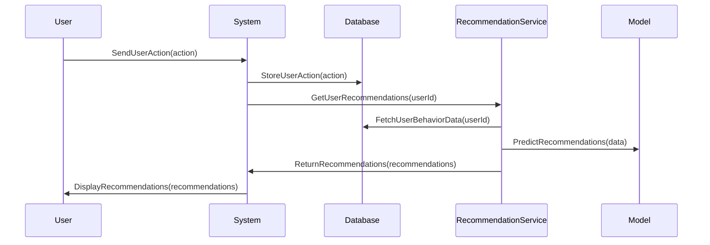
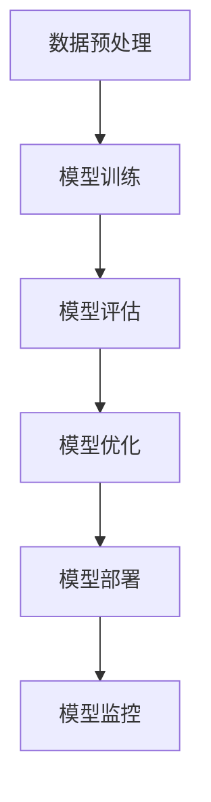
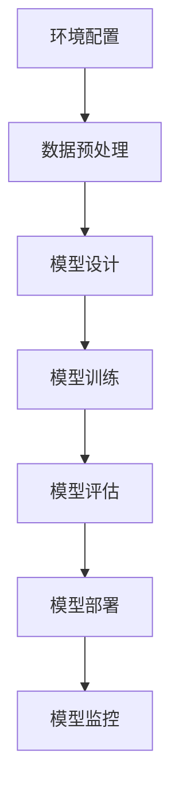

                 

### AI大模型时代的新编程范式概述

随着人工智能（AI）技术的迅猛发展，AI大模型已成为当前研究与应用的热点。这些模型具有庞大的参数规模和复杂的结构，能够处理海量的数据并取得令人瞩目的成果。然而，AI大模型的应用也带来了新的挑战，特别是对于编程范式的影响。本文将围绕AI大模型时代的新编程范式进行探讨，旨在为开发者提供清晰的理解和实用的指导。

#### 关键词
- AI大模型
- 新编程范式
- 编程挑战
- 算法设计
- 应用实例

#### 摘要
本文将从AI大模型的基本概念和特点入手，详细探讨AI大模型时代的新编程范式。通过分析传统编程范式的局限性，本文将介绍AI大模型编程范式的基本原理和核心特点，并探讨其在实际应用中的优势与挑战。随后，本文将结合具体实例，展示AI大模型编程范式的实际应用场景，并总结最佳实践和注意事项，为开发者提供实用的指导。

### 第一部分: AI大模型概述

#### 1.1.1 问题背景与核心概念

人工智能技术的发展，经历了从规则系统到机器学习再到深度学习的演变。随着计算能力的提升和海量数据的积累，AI大模型应运而生。AI大模型具有以下核心概念：

- **大规模参数**：AI大模型通常具有数亿甚至千亿级别的参数。
- **高度非线性**：模型内部运算复杂，具有高度非线性特征。
- **自学习能力**：通过大量数据进行自我优化和改进。

AI大模型在语音识别、图像处理、自然语言处理等领域取得了显著的成果，但其编程复杂度也相应增加。开发者需要掌握新的编程范式，以高效地利用AI大模型。

#### 1.1.2 AI大模型定义与特点

AI大模型是一种具有大规模参数、复杂结构的神经网络模型。与传统AI模型相比，其核心特点如下：

- **大规模参数**：参数数量达到亿级甚至千亿级。
- **高度非线性**：模型内部运算复杂，具有高度非线性特征。
- **自学习能力**：能够通过大量数据进行自我优化。

AI大模型在数据量、模型复杂度、性能等方面有显著提升，但同时也带来了编程和调优的挑战。

#### 1.1.3 主流AI大模型简介

目前，主流的AI大模型包括GPT系列模型、BERT及其变体等。GPT系列模型以其强大的文本生成能力而著称，BERT模型则在自然语言处理领域取得了显著的成果。以下是几种典型AI大模型的简要介绍：

- **GPT系列模型**：包括GPT-2、GPT-3等，具有强大的文本生成能力。
- **BERT模型**：基于Transformer架构，在自然语言处理任务中表现优异。
- **其他知名大模型**：如Turing-NLG、GPT-J等，也具有各自的特色和优势。

### 第二部分: AI大模型编程范式原理

#### 2.1.1 编程范式概念

编程范式是指解决特定问题的一系列指导原则和方法。传统编程范式包括过程式编程、面向对象编程等。然而，这些范式在处理AI大模型时存在一定的局限性，需要新的编程范式来适应。

#### 2.1.2 AI大模型编程范式原理

AI大模型编程范式基于深度学习理论和神经网络模型。其核心原理包括：

- **数据驱动的开发**：通过大量数据训练和优化模型。
- **模型并行化**：利用并行计算技术加速模型训练。
- **自动化调优**：通过算法自动化选择最佳模型参数。

AI大模型编程范式强调模型的可扩展性、可维护性和可复用性。

#### 2.1.3 AI大模型编程范式应用场景

AI大模型编程范式适用于多种应用场景，包括：

- **自然语言处理**：文本生成、机器翻译、情感分析等。
- **计算机视觉**：图像分类、目标检测、图像生成等。
- **推荐系统**：基于用户行为的推荐、内容推荐等。
- **游戏AI**：角色智能决策、路径规划等。

### 第三部分: AI大模型编程范式实践

#### 3.1.1 环境安装与配置

在开始AI大模型编程之前，需要安装和配置相应的开发环境和工具。以下是一个典型的环境安装与配置步骤：

1. 安装Python环境，推荐使用Python 3.8或以上版本。
2. 安装深度学习框架，如TensorFlow或PyTorch。
3. 配置CUDA和cuDNN，以利用GPU加速训练过程。
4. 安装其他必要的库和工具，如NumPy、Pandas、Scikit-learn等。

#### 3.1.2 编程实践

以下是一个简单的AI大模型编程实例，使用PyTorch框架实现一个文本分类任务：

```python
import torch
import torch.nn as nn
import torch.optim as optim

# 数据预处理
train_data = ...  # 加载训练数据
test_data = ...   # 加载测试数据

# 模型定义
model = nn.Sequential(
    nn.Linear(input_dim, hidden_dim),
    nn.ReLU(),
    nn.Linear(hidden_dim, output_dim)
)

# 损失函数和优化器
criterion = nn.CrossEntropyLoss()
optimizer = optim.Adam(model.parameters(), lr=0.001)

# 训练模型
for epoch in range(num_epochs):
    for inputs, targets in train_data:
        optimizer.zero_grad()
        outputs = model(inputs)
        loss = criterion(outputs, targets)
        loss.backward()
        optimizer.step()

    # 测试模型
    with torch.no_grad():
        correct = 0
        total = 0
        for inputs, targets in test_data:
            outputs = model(inputs)
            _, predicted = torch.max(outputs.data, 1)
            total += targets.size(0)
            correct += (predicted == targets).sum().item()

        print(f'Epoch {epoch+1}, Accuracy: {100 * correct / total}%')

# 保存模型
torch.save(model.state_dict(), 'model.pth')
```

#### 3.1.3 项目实战

以下是一个基于AI大模型的推荐系统项目实例。该项目使用基于协同过滤的算法，结合用户行为数据，实现个性化推荐。

1. **项目介绍**：
   - 数据来源：用户行为日志，包括用户点击、浏览、购买等行为。
   - 目标：为用户推荐可能感兴趣的商品。

2. **系统功能设计**：
   - 用户管理：用户注册、登录、个人信息管理等。
   - 数据处理：数据清洗、预处理、特征提取等。
   - 推荐算法：基于协同过滤、深度学习等算法进行商品推荐。
   - 推荐结果展示：将推荐结果展示给用户。

3. **系统架构设计**：
   - 数据层：存储用户行为数据和商品数据。
   - 服务层：提供用户管理和推荐算法服务。
   - 接口层：提供RESTful API，供前端调用。

4. **系统接口设计和系统交互**：



#### 第四部分: AI大模型编程范式最佳实践

#### 4.1.1 最佳实践 tips

1. **数据预处理**：确保数据质量，进行数据清洗、归一化和特征提取。
2. **模型选择**：根据任务需求选择合适的模型，并进行调优。
3. **并行计算**：利用GPU等硬件资源加速模型训练。
4. **代码优化**：使用高效的算法和数据结构，提高代码运行效率。

#### 4.1.2 小结与注意事项

1. **小结**：本文介绍了AI大模型编程范式的核心概念、原理和实践，强调了其在实际应用中的重要性。
2. **注意事项**：开发者需要不断学习和实践，适应AI大模型编程范式，并关注新技术的发展。

#### 4.1.3 拓展阅读

- 《深度学习》（Goodfellow, Bengio, Courville著）
- 《Python深度学习》（François Chollet著）
- 《AI算法手册》（林伟华著）

### 第五部分: AI大模型编程范式未来展望

#### 5.1.1 未来趋势

随着AI技术的不断发展，AI大模型编程范式也将不断演进。未来趋势包括：

1. **模型压缩与优化**：提高模型的可解释性和可维护性。
2. **自动化模型设计**：使用自动化算法设计出更高效、更可靠的模型。
3. **跨领域应用**：AI大模型将在更多领域得到应用，如生物医学、金融等。

#### 5.1.2 挑战与机遇

AI大模型编程范式在未来将面临以下挑战：

1. **计算资源消耗**：大型模型需要更多的计算资源。
2. **模型安全与隐私**：确保模型的安全性和用户隐私。
3. **模型解释性**：提高模型的可解释性，使其更加透明。

同时，这些挑战也带来了机遇：

1. **技术创新**：推动新算法、新架构的研究。
2. **行业应用**：AI大模型将在更多领域得到应用，推动行业变革。

### 第六部分: AI大模型时代的新编程范式应用案例

#### 6.1.1 案例分析

以下是一个基于AI大模型的智能客服系统案例。该系统利用自然语言处理技术，为用户提供24/7在线客服服务。

1. **案例背景**：
   - 行业：电子商务
   - 问题：提高客服效率和用户满意度。
   - 解决方案：使用AI大模型实现智能客服系统。

2. **案例分析**：
   - 数据来源：用户提问和回答的日志。
   - 模型选择：基于BERT的文本分类模型。
   - 实现细节：使用TensorFlow实现模型训练和预测。

3. **详细解读**：
   - 数据预处理：对用户提问进行清洗、分词和向量化。
   - 模型训练：使用大规模数据集进行模型训练。
   - 预测与反馈：对用户提问进行分类，并返回相应的回答。

#### 6.1.2 案例剖析

智能客服系统中的关键模块包括：

1. **自然语言处理模块**：实现文本分类、情感分析等功能。
2. **对话管理模块**：根据用户提问，生成适当的回答。
3. **知识库模块**：存储常用问题和标准回答，供系统调用。

通过以上模块的协同工作，智能客服系统能够高效地处理用户提问，提高客服效率和用户满意度。

### 第七部分: AI大模型时代的新编程范式总结与展望

#### 7.1.1 总结

本文从AI大模型的基本概念和编程范式出发，探讨了AI大模型编程范式的核心原理和实践方法。通过具体案例，展示了AI大模型在智能客服等领域的应用。同时，本文还分析了AI大模型编程范式面临的挑战和机遇。

#### 7.1.2 展望

未来，AI大模型编程范式将继续发展，带来更多创新和变革。开发者需要不断学习和适应新范式，以应对日益复杂的AI应用场景。

### 作者信息

作者：AI天才研究院/AI Genius Institute & 禅与计算机程序设计艺术 /Zen And The Art of Computer Programming

---

### 附录：AI大模型编程范式相关术语解释

- **AI大模型**：指具有大规模参数、复杂结构的神经网络模型，能够在海量数据上进行训练，并在各种任务中取得优异的性能。
- **编程范式**：解决特定问题的一系列指导原则和方法，包括编程语言的选择、编程风格、算法设计等。
- **自然语言处理**：使计算机能够理解和处理人类自然语言的技术，包括文本分类、情感分析、机器翻译等。
- **深度学习**：一种机器学习方法，通过构建深层神经网络模型，对数据进行自动特征提取和模式识别。
- **GPU**：图形处理器，一种专门用于图形渲染的处理器，近年来也被广泛应用于深度学习模型的训练。
- **模型压缩**：通过各种技术手段，减少模型的参数数量和计算复杂度，提高模型的运行效率。

### 附录：AI大模型编程范式相关流程图

#### 1. AI大模型训练流程



#### 2. AI大模型编程范式流程



### 附录：AI大模型编程范式相关Python代码示例

```python
import torch
import torch.nn as nn
import torch.optim as optim

# 模型定义
class NeuralNetwork(nn.Module):
    def __init__(self, input_dim, hidden_dim, output_dim):
        super(NeuralNetwork, self).__init__()
        self.fc1 = nn.Linear(input_dim, hidden_dim)
        self.fc2 = nn.Linear(hidden_dim, output_dim)

    def forward(self, x):
        x = torch.relu(self.fc1(x))
        x = self.fc2(x)
        return x

# 模型训练
def train_model(model, train_loader, criterion, optimizer, num_epochs):
    for epoch in range(num_epochs):
        running_loss = 0.0
        for inputs, targets in train_loader:
            optimizer.zero_grad()
            outputs = model(inputs)
            loss = criterion(outputs, targets)
            loss.backward()
            optimizer.step()
            running_loss += loss.item()
        print(f'Epoch {epoch+1}, Loss: {running_loss/len(train_loader)}')

# 测试模型
def test_model(model, test_loader, criterion):
    model.eval()
    total_loss = 0
    with torch.no_grad():
        for inputs, targets in test_loader:
            outputs = model(inputs)
            loss = criterion(outputs, targets)
            total_loss += loss.item()
    print(f'Test Loss: {total_loss/len(test_loader)}')

# 环境配置
device = torch.device("cuda" if torch.cuda.is_available() else "cpu")
model = NeuralNetwork(input_dim=10, hidden_dim=50, output_dim=2).to(device)
criterion = nn.CrossEntropyLoss()
optimizer = optim.Adam(model.parameters(), lr=0.001)

# 加载数据
train_loader = ...
test_loader = ...

# 训练模型
train_model(model, train_loader, criterion, optimizer, num_epochs=10)

# 测试模型
test_model(model, test_loader, criterion)
```

### 附录：AI大模型编程范式相关LaTeX数学公式

$$
\begin{aligned}
    \text{Loss} &= \frac{1}{N} \sum_{i=1}^{N} (-y_i \log(p_i)) \\
    \text{where} \quad p_i &= \text{softmax}(z_i)
\end{aligned}
$$

$$
\begin{aligned}
    \text{softmax}(z) &= \frac{e^z}{\sum_{j=1}^{K} e^z_j} \\
    \text{where} \quad z &= \text{input vector}, \quad K &= \text{number of classes}
\end{aligned}
$$

### 结论

AI大模型时代的新编程范式为开发者提供了强大的工具和新的思维方式。通过本文的介绍，读者可以了解到AI大模型编程范式的基本概念、原理和实践方法。未来，随着AI技术的不断发展，AI大模型编程范式将继续演进，为人工智能领域带来更多创新和变革。开发者应不断学习和适应新范式，以应对日益复杂的AI应用场景。希望本文能为读者在AI大模型编程领域提供有益的参考和启示。

