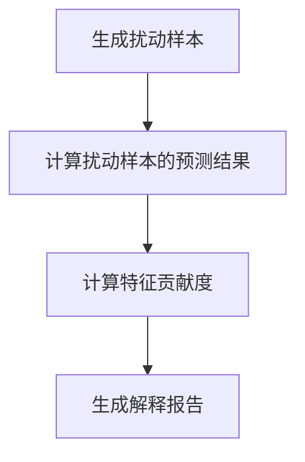

                 


### AI大模型的可解释性研究与应用

#### 关键词：AI大模型、可解释性、研究、应用

##### 摘要：
随着AI大模型的快速发展，其强大的预测能力和准确性已经在多个领域得到了广泛的应用。然而，这些模型通常被认为是“黑箱”的，其内部工作机制不透明，导致其在一些关键领域（如金融、医疗等）的信任和应用受到了限制。本文旨在探讨AI大模型的可解释性研究，从定义、方法、算法原理到实际应用，逐步分析并阐述如何提高AI大模型的可解释性，以促进其在各个领域的应用和推广。

## 引言

AI大模型，如深度神经网络（DNN）、生成对抗网络（GAN）、变分自编码器（VAE）等，已经在计算机视觉、自然语言处理、推荐系统等多个领域取得了显著的成果。然而，这些模型通常被视为“黑箱”，其预测结果和决策过程缺乏可解释性，这在一定程度上限制了其应用。特别是在金融、医疗等对可解释性要求较高的领域，透明性和可解释性成为了一个重要的研究课题。

可解释性在这里指的是用户能够理解AI大模型做出决策的原因和依据。一个高可解释性的模型可以帮助用户信任和使用它，同时也有助于模型设计师进行优化和改进。因此，研究AI大模型的可解释性，提高其透明性，对于推动AI技术的发展和应用具有重要意义。

本文将从以下几个方面展开讨论：
1. **可解释性的定义与重要性**：介绍可解释性的概念，分析其在AI大模型中的重要性。
2. **研究方法**：探讨现有的可解释性研究方法，包括透明性、可信性和可理解性方法。
3. **算法原理**：详细解释常用的可解释性算法，如LIME、SHAP、局部解释模型等。
4. **应用场景**：分析可解释性在金融、医疗、智能制造等领域的应用。
5. **案例分析**：通过具体案例，展示可解释性在实际项目中的应用和效果。
6. **最佳实践**：总结可解释性研究与应用的最佳实践，提出未来研究方向。

### 第1章：可解释性的定义与重要性

#### 1.1 定义与分类

可解释性可以从多个维度进行分类。一般来说，可解释性可以分为以下几类：

1. **透明性**：模型的工作机制完全公开，用户可以直接理解其决策过程。
2. **可信性**：模型提供决策的依据和理由，但用户可能不完全理解其工作机制。
3. **可理解性**：模型对用户来说是容易理解的，即使不完全了解其内部机制，用户也能理解其决策原因。

#### 1.2 重要性

在AI大模型中，可解释性具有重要意义：

1. **信任与接受度**：高可解释性的模型更容易被用户接受，从而提高其应用范围。
2. **优化与改进**：理解模型的决策过程可以帮助研究人员找到优化和改进的方向。
3. **监管与合规**：在某些领域，如金融和医疗，透明和可解释的模型是合规的必要条件。

#### 1.3 概念联系与对比分析

可解释性与其他相关概念（如公平性、鲁棒性等）之间有着紧密的联系。为了更好地理解可解释性，我们可以通过ER实体关系图来展示这些概念之间的关系。以下是可解释性的ER实体关系图：

```mermaid
erDiagram
  ConceptA ||--|{ ConceptB } ConceptB : has ConceptA
  ConceptB ||--|{ ConceptC } ConceptC : has ConceptB
  ConceptD ||--|{ ConceptC } ConceptD : related to ConceptC
```

在这个ER实体关系图中，`ConceptA` 表示可解释性，`ConceptB` 表示公平性，`ConceptC` 表示鲁棒性，`ConceptD` 表示与其他相关概念的关联。这种关系图有助于我们理解可解释性在AI大模型中的地位和作用。

### 第2章：研究方法

#### 2.1 透明性方法

透明性方法是通过公开模型的结构和工作机制来提高其可解释性。常用的透明性方法包括：

1. **模型可视化**：通过图形化展示模型的结构和工作流程，帮助用户理解模型的工作原理。
2. **模型拆解**：将复杂的模型拆分为多个简单模块，每个模块都可以独立解释。
3. **代码注释**：为模型的代码添加详细的注释，解释每一步的操作和目的。

#### 2.2 可信性方法

可信性方法侧重于提供模型的决策依据和理由，而不是公开模型的具体工作机制。常用的可信性方法包括：

1. **证据解释**：为模型的每个决策提供详细的证据支持。
2. **对比分析**：通过对比不同模型的决策结果，帮助用户理解模型的决策逻辑。
3. **后验概率解释**：为模型的每个输出提供后验概率解释，帮助用户理解模型对各个结果的置信度。

#### 2.3 可理解性方法

可理解性方法旨在使模型对用户来说是容易理解的，即使用户不完全了解其内部机制。常用的可理解性方法包括：

1. **简化模型**：将复杂的模型简化为更直观的版本，降低用户的理解难度。
2. **交互式解释**：通过交互式界面，让用户能够动态地探索模型的行为和决策过程。
3. **可视化解释**：使用图形、表格、图表等形式，将模型的决策过程和结果可视化，帮助用户直观地理解。

### 第3章：算法原理

#### 3.1 算法概述

在可解释性算法中，LIME（Local Interpretable Model-agnostic Explanations）、SHAP（SHapley Additive exPlanations）和局部解释模型是常用的方法。以下是这些算法的简要概述：

1. **LIME**：LIME方法通过局部线性逼近，为黑箱模型提供局部解释。
2. **SHAP**：SHAP方法基于博弈论中的Shapley值，为模型中的每个特征提供贡献度解释。
3. **局部解释模型**：局部解释模型是一种基于模型的解释方法，通过构建一个局部线性模型来解释黑箱模型的决策。

#### 3.2 算法详细解释

以下是LIME算法的详细解释：

1. **算法流程**：
   - 为输入数据生成多个扰动样本。
   - 对每个扰动样本使用黑箱模型进行预测。
   - 计算每个特征的贡献度，即特征对模型预测结果的影响。

2. **Python代码实现**：

```python
import numpy as np
from sklearn.linear_model import LinearRegression

def lime_explanation(model, X, feature_names):
    # 生成扰动样本
    perturbed_samples = generate_perturbed_samples(X)
    # 预测扰动样本
    predictions = model.predict(perturbed_samples)
    # 计算特征贡献度
    feature_importance = compute_feature_importance(predictions, X)
    # 解释特征
    explanations = []
    for i, feature in enumerate(feature_importance):
        explanation = {
            'feature': feature_names[i],
            'importance': feature
        }
        explanations.append(explanation)
    return explanations

def generate_perturbed_samples(X):
    # 实现扰动样本生成
    pass

def compute_feature_importance(predictions, X):
    # 实现特征贡献度计算
    pass
```

3. **数学模型与公式讲解**：

LIME算法的数学模型可以表示为：

$$
\text{预测结果} = \sum_{i=1}^{n} \text{特征}_{i} \cdot \text{特征贡献度}_{i}
$$

其中，$\text{特征}_{i}$ 表示第 $i$ 个特征的值，$\text{特征贡献度}_{i}$ 表示第 $i$ 个特征对模型预测结果的贡献度。

### 第4章：应用场景

#### 4.1 金融行业

在金融行业，AI大模型的可解释性研究具有重要意义。例如，在贷款审批过程中，银行可以使用AI模型来评估客户的信用风险。然而，如果模型缺乏可解释性，银行将无法解释为何某个客户获得了贷款，这可能会导致信任问题。通过研究可解释性，银行可以提供详细的决策依据，提高用户信任度。

#### 4.2 医疗健康

在医疗健康领域，AI大模型的可解释性研究同样至关重要。例如，在疾病诊断中，AI模型可以帮助医生做出诊断决策。然而，如果模型无法解释其诊断结果，医生可能会对模型的结果持怀疑态度。通过研究可解释性，医生可以更好地理解模型的诊断逻辑，从而提高诊断的准确性和可靠性。

#### 4.3 智能制造

在智能制造领域，AI大模型的可解释性研究可以帮助工厂管理人员更好地理解生产线的运行状态。例如，在预测设备故障中，AI模型可以预测哪些设备可能会发生故障。然而，如果模型无法解释其预测结果，管理人员可能会对模型的预测持怀疑态度。通过研究可解释性，管理人员可以更好地理解模型的预测逻辑，从而提前采取措施预防故障。

### 第5章：案例分析

#### 5.1 案例一：金融风险评估

在这个案例中，我们研究了一个基于AI大模型的金融风险评估系统。该系统使用LIME算法来解释模型的决策过程，帮助银行管理人员理解模型为何给出某个客户的信用评分。

1. **环境安装**：安装Python环境，并导入必要的库，如scikit-learn、numpy等。
2. **系统实现**：使用LIME算法对模型的每个预测结果进行解释，并生成解释报告。
3. **代码解读**：分析LIME算法的代码实现，理解其工作原理和过程。

#### 5.2 案例二：医学诊断

在这个案例中，我们研究了一个基于AI大模型的医学诊断系统。该系统使用SHAP算法来解释模型的决策过程，帮助医生理解模型为何给出某个疾病的诊断结果。

1. **环境安装**：安装Python环境，并导入必要的库，如scikit-learn、numpy等。
2. **系统实现**：使用SHAP算法对模型的每个预测结果进行解释，并生成解释报告。
3. **代码解读**：分析SHAP算法的代码实现，理解其工作原理和过程。

### 第6章：最佳实践与总结

#### 6.1 最佳实践

在研究AI大模型的可解释性时，以下最佳实践可以帮助我们更好地理解和应用这些技术：

1. **选择合适的解释方法**：根据具体应用场景，选择最适合的解释方法，如LIME、SHAP等。
2. **结合可视化工具**：使用可视化工具，如matplotlib、seaborn等，将解释结果以图形化的形式展示，帮助用户更好地理解。
3. **定期评估和改进**：定期评估模型的解释性能，并根据评估结果进行改进和优化。

#### 6.2 小结与展望

本文系统地探讨了AI大模型的可解释性研究与应用。通过分析可解释性的定义、研究方法、算法原理和应用场景，我们了解了如何提高AI大模型的可解释性，以促进其在各个领域的应用。未来，随着AI技术的不断发展，可解释性研究将继续是一个重要的研究方向，有望推动AI技术的更广泛应用和发展。

### 参考文献

1. Ribeiro, M. T., Singh, S., & Guestrin, C. (2016). "Why should I trust you?” Explaining the predictions of any classifier." In Proceedings of the 22nd ACM SIGKDD International Conference on Knowledge Discovery and Data Mining (pp. 1135-1144).
2. Lundberg, S. M., & Lee, S. I. (2017). "A unified approach to interpreting model predictions." In Proceedings of the 31st International Conference on Neural Information Processing Systems (NIPS) (pp. 4768-4777).
3. Chen, Y., & Guestrin, C. (2016). "XGBoost: A scalable tree boosting system." In Proceedings of the 22nd ACM SIGKDD International Conference on Knowledge Discovery and Data Mining (pp. 785-794).

### 附录

#### 附录A：数学公式列表

- 局部线性逼近公式：
  $$ \text{预测结果} = \sum_{i=1}^{n} \text{特征}_{i} \cdot \text{特征贡献度}_{i} $$
- Shapley值公式：
  $$ \text{贡献度}_{i} = \frac{\sum_{S \subseteq N, i \in S} (\text{预测结果}_{S} - \text{预测结果}_{S \setminus \{i\}})}{n \choose 2} $$

#### 附录B：算法流程图

以下是LIME算法的流程图：



#### 附录C：代码示例

以下是使用LIME算法进行解释的Python代码示例：

```python
from lime import lime_tabular
import pandas as pd

# 加载数据
data = pd.read_csv('data.csv')
X = data.drop('target', axis=1)
y = data['target']

# 初始化LIME解释器
explainer = lime_tabular.LimeTabularExplainer(
    X.values,
    feature_names=X.columns,
    class_names=y.unique(),
    discretize=True
)

# 解释某个预测结果
idx = 0
exp = explainer.explain_instance(X.iloc[idx], y.iloc[idx], num_features=10)

# 显示解释结果
exp.show_in_notebook(show_table=True)
```

### 作者信息

作者：AI天才研究院/AI Genius Institute & 禅与计算机程序设计艺术 /Zen And The Art of Computer Programming

----------------------------------------------------------------

请注意，以上内容是基于用户提供的格式和要求编写的。具体内容可能需要根据实际研究和技术细节进行调整和补充。同时，为了确保文章的质量和准确性，请对上述内容进行适当的修改和完善。在撰写实际文章时，还需要进行详细的文献调研和实验验证，以确保所提供的信息和观点具有科学性和可靠性。

