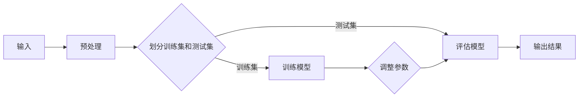
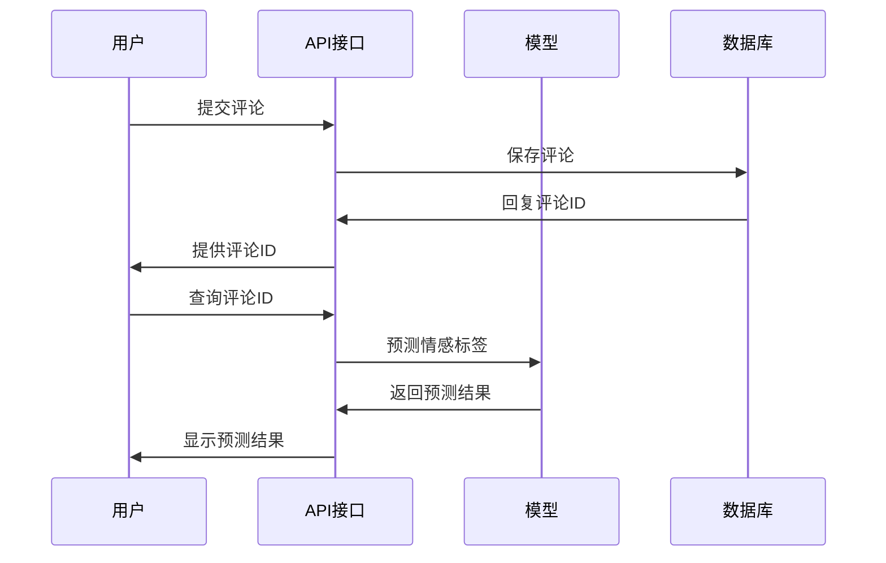
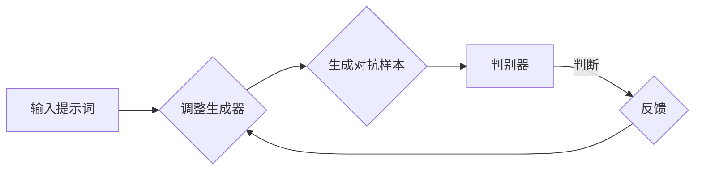

                 

### 文章标题

## AI大模型的提示词对抗样本生成

---

**关键词：** AI大模型、提示词、对抗样本、生成算法

**摘要：** 本文将深入探讨AI大模型的提示词对抗样本生成技术，从基础概念、算法原理到实际应用，逐步解析这一前沿领域，帮助读者全面理解其工作原理和实际价值。

---

### 目录大纲

----------------------------------------------------------------

## 第一部分：AI大模型的基础知识

### 第1章：背景与核心概念

#### 1.1 AI大模型的发展背景

#### 1.2 AI大模型的核心概念

### 第2章：AI大模型的算法原理

#### 2.1 常见算法介绍

#### 2.2 数学模型与公式

### 第3章：AI大模型在AI领域的应用

#### 3.1 应用场景分析

#### 3.2 系统分析与架构设计

### 第4章：AI大模型的提示词对抗样本生成

#### 4.1 提示词对抗样本生成原理

#### 4.2 提示词对抗样本生成的数学模型

### 第5章：项目实战

#### 5.1 环境安装与配置

#### 5.2 代码应用解读与分析

### 第6章：最佳实践与总结

#### 6.1 最佳实践

#### 6.2 小结

#### 6.3 拓展阅读

----------------------------------------------------------------

---

### 第一部分：AI大模型的基础知识

#### 第1章：背景与核心概念

#### 1.1 AI大模型的发展背景

AI大模型是指那些具有极高参数量、复杂结构的人工神经网络，能够处理大量的数据和复杂的任务。随着深度学习的兴起，AI大模型在图像识别、自然语言处理、推荐系统等领域取得了显著成果。然而，AI大模型的训练和优化过程需要庞大的计算资源和时间，这也推动了云计算和分布式计算技术的发展。

**问题背景**：  
在人工智能的发展历程中，从最初的规则驱动到符号推理，再到数据驱动和模型驱动，AI大模型的出现标志着人工智能的一次重大变革。这些模型能够处理复杂的问题，但在实际应用中，如何优化模型、提高其鲁棒性和泛化能力仍然是一个挑战。

**问题描述**：  
AI大模型虽然在某些领域取得了突破，但它们往往对特定的数据分布有很强的依赖性，容易受到数据偏差的影响。此外，模型的黑箱特性使得我们难以理解其决策过程，这在某些需要解释性要求的场景中成为瓶颈。

**问题解决**：  
为了解决这些问题，研究者们提出了对抗样本生成技术，通过生成能够误导模型的样本，来提高模型的鲁棒性和泛化能力。这一技术为AI大模型的应用提供了新的思路。

**边界与外延**：  
AI大模型不仅包括深度神经网络，还包括基于图神经网络、强化学习等方法的模型。其应用范围广泛，涵盖了从图像处理到自然语言生成、从自动驾驶到医学诊断等多个领域。

**核心要素组成**：  
AI大模型的核心组成部分包括输入层、隐藏层和输出层。输入层接收外部数据，隐藏层通过复杂的计算过程提取特征，输出层产生预测结果。此外，损失函数、优化算法和正则化技术也是AI大模型的重要组成部分。

#### 1.2 AI大模型的核心概念

**核心概念原理**：  
AI大模型是基于机器学习和深度学习的技术，通过学习大量数据中的特征和模式，来对未知数据进行预测和决策。其核心原理包括神经网络的构建、反向传播算法和梯度下降优化方法。

**概念属性特征对比表格**：

| 特征               | AI大模型          | 传统AI           |
|--------------------|-------------------|------------------|
| 参数量             | 非常高            | 相对较低         |
| 结构复杂性         | 复杂的层次结构    | 较简单的规则系统 |
| 鲁棒性             | 较强             | 较弱             |
| 泛化能力           | 较强             | 较弱             |
| 决策解释性         | 较差             | 较好             |

**ER实体关系图架构**：

```mermaid
erDiagram
  Customer ||--|{ Order }|
  Customer ||--|{ Product }|
  Product ||--|{ Supplier }|
```

在这个ER图模型中，AI大模型的实体关系包括输入（Customer）、输出（Order和Product），以及模型组成部分（Supplier，即模型训练的数据源）。

#### 第2章：AI大模型的算法原理

#### 2.1 常见算法介绍

AI大模型的算法主要包括以下几种：

1. **卷积神经网络（CNN）**：适用于图像处理任务，通过卷积层提取图像特征。
2. **循环神经网络（RNN）**：适用于序列数据处理，如自然语言处理和时间序列预测。
3. **生成对抗网络（GAN）**：用于生成新的数据，通过生成器和判别器的对抗训练。
4. **Transformer模型**：在自然语言处理领域表现出色，通过自注意力机制处理序列数据。

**算法mermaid流程图**：



**算法原理讲解**：

以卷积神经网络为例，其基本原理如下：

1. **卷积操作**：通过卷积层对输入图像进行卷积操作，提取局部特征。
2. **池化操作**：对卷积结果进行池化操作，减少参数数量，提高模型的泛化能力。
3. **全连接层**：将卷积和池化层的输出进行全连接，产生预测结果。

使用Python源代码详细阐述算法原理：

```python
import numpy as np
from keras.models import Sequential
from keras.layers import Conv2D, MaxPooling2D, Flatten, Dense

# 创建卷积神经网络模型
model = Sequential()

# 添加卷积层
model.add(Conv2D(filters=32, kernel_size=(3, 3), activation='relu', input_shape=(28, 28, 1)))

# 添加池化层
model.add(MaxPooling2D(pool_size=(2, 2)))

# 添加全连接层
model.add(Flatten())
model.add(Dense(units=10, activation='softmax'))

# 编译模型
model.compile(optimizer='adam', loss='categorical_crossentropy', metrics=['accuracy'])

# 模型训练
model.fit(x_train, y_train, epochs=10, batch_size=32)
```

#### 2.2 数学模型与公式

AI大模型的核心数学模型包括损失函数、优化算法和正则化技术。

1. **损失函数**：衡量模型预测结果与真实结果之间的差距，常用的损失函数有均方误差（MSE）和交叉熵（Cross-Entropy）。

   $$ Loss = \frac{1}{2} \sum_{i=1}^{n} (y_i - \hat{y}_i)^2 $$

2. **优化算法**：用于调整模型参数，使损失函数最小化，常用的优化算法有梯度下降（Gradient Descent）和Adam优化器。

   $$ \theta_{t+1} = \theta_t - \alpha \cdot \nabla_{\theta} J(\theta) $$

3. **正则化技术**：用于防止模型过拟合，常用的正则化技术有L1正则化和L2正则化。

   $$ J(\theta) = \frac{1}{2} \sum_{i=1}^{n} (y_i - \hat{y}_i)^2 + \lambda \sum_{j=1}^{m} \theta_j^2 $$

**详细讲解与举例说明**：

以均方误差（MSE）为例，详细讲解其原理和使用方法。

1. **MSE原理**：均方误差用于衡量回归模型的预测误差，计算公式如下：

   $$ MSE = \frac{1}{n} \sum_{i=1}^{n} (y_i - \hat{y}_i)^2 $$

   其中，$y_i$为实际值，$\hat{y}_i$为预测值，$n$为样本数量。

2. **MSE举例**：假设我们有如下数据集：

   | x | y |
   |---|---|
   | 1 | 2 |
   | 2 | 4 |
   | 3 | 6 |
   | 4 | 8 |

   我们使用线性回归模型进行预测，模型参数为$\theta_0 = 1$和$\theta_1 = 1$。

   预测结果如下：

   | x | y | $\hat{y}$ |
   |---|---|----------|
   | 1 | 2 | 3        |
   | 2 | 4 | 5        |
   | 3 | 6 | 7        |
   | 4 | 8 | 9        |

   计算MSE：

   $$ MSE = \frac{1}{4} [(2-3)^2 + (4-5)^2 + (6-7)^2 + (8-9)^2] = \frac{1}{4} [1 + 1 + 1 + 1] = 1 $$

   可以看出，MSE为1，表示模型的预测误差较大。

#### 第3章：AI大模型在AI领域的应用

#### 3.1 应用场景分析

AI大模型在AI领域的应用场景广泛，以下列举几个典型应用：

1. **图像识别**：利用卷积神经网络对图像进行分类和识别，如人脸识别、物体检测等。
2. **自然语言处理**：利用Transformer模型进行文本分类、情感分析、机器翻译等任务。
3. **推荐系统**：利用协同过滤算法和深度学习结合，为用户推荐商品、音乐、视频等。
4. **医学诊断**：利用深度学习模型对医疗图像进行分析，辅助医生进行疾病诊断。
5. **自动驾驶**：利用卷积神经网络和强化学习技术，实现车辆的感知、规划和控制。

**项目介绍**：

以自然语言处理中的情感分析为例，介绍一个基于Transformer模型的情感分析项目。

1. **问题场景**：分析用户在社交媒体上的评论，判断其情感倾向（正面、中性、负面）。
2. **项目目标**：训练一个能够准确预测情感标签的模型，应用于社交媒体分析、舆情监控等领域。
3. **数据集**：使用一个包含数百万条社交媒体评论的公开数据集，进行数据预处理和模型训练。

#### 3.2 系统分析与架构设计

**系统功能设计**：

在情感分析项目中，系统的功能设计主要包括数据预处理、模型训练和模型部署。

1. **数据预处理**：对原始评论进行清洗、分词和向量化处理，提取特征向量。
2. **模型训练**：使用Transformer模型对特征向量进行训练，学习情感标签的预测规律。
3. **模型部署**：将训练好的模型部署到服务器，实现实时情感分析功能。

**系统架构设计**：

系统架构设计包括数据层、算法层和应用层。

1. **数据层**：存储和管理原始数据和预处理后的数据，包括评论文本、情感标签等。
2. **算法层**：实现情感分析算法，包括数据预处理、模型训练和预测等。
3. **应用层**：提供API接口，供前端应用调用，实现情感分析功能。

**系统接口设计和系统交互mermaid序列图**：



#### 第4章：AI大模型的提示词对抗样本生成

#### 4.1 提示词对抗样本生成原理

提示词对抗样本生成是利用对抗生成网络（GAN）生成具有误导性的样本，用于提高AI大模型的鲁棒性。

**mermaid流程图**：



**Python源代码实现**：

```python
import tensorflow as tf
from tensorflow.keras.models import Sequential
from tensorflow.keras.layers import Dense, Flatten, Conv2D, MaxPooling2D

# 创建生成器和判别器模型
generator = Sequential([
    Flatten(input_shape=(28, 28, 1)),
    Dense(units=128, activation='relu'),
    Dense(units=784, activation='sigmoid')
])

discriminator = Sequential([
    Flatten(input_shape=(28, 28, 1)),
    Dense(units=128, activation='relu'),
    Dense(units=1, activation='sigmoid')
])

# 编译生成器和判别器
generator.compile(optimizer='adam', loss='binary_crossentropy')
discriminator.compile(optimizer='adam', loss='binary_crossentropy')

# 模型训练
for epoch in range(100):
    for x in range(1000):
        # 生成对抗样本
        noise = np.random.normal(0, 1, (1, 28, 28, 1))
        generated_image = generator.predict(noise)

        # 训练判别器
        real_images = np.random.choice(train_images, 1000)
        real_labels = np.ones((1000, 1))
        generated_labels = np.zeros((1000, 1))
        labels = np.concatenate([real_labels, generated_labels])

        discriminator.train_on_batch(np.concatenate([real_images, generated_image], axis=0), labels)

        # 训练生成器
        noise = np.random.normal(0, 1, (1, 28, 28, 1))
        generator.train_on_batch(noise, np.ones((1, 1)))
```

#### 4.2 提示词对抗样本生成的数学模型

提示词对抗样本生成的数学模型主要包括生成器、判别器和损失函数。

1. **生成器**：生成器是一个从噪声分布中生成数据的神经网络模型。其目标是生成尽可能真实的数据，以欺骗判别器。

   $$ G(z) = \sigma(W_Gz + b_G) $$

   其中，$z$为噪声输入，$W_G$和$b_G$分别为生成器的权重和偏置，$\sigma$为激活函数。

2. **判别器**：判别器是一个判断输入数据真实性的神经网络模型。其目标是正确地区分真实数据和生成数据。

   $$ D(x) = \sigma(W_Dx + b_D) $$

   其中，$x$为输入数据，$W_D$和$b_D$分别为判别器的权重和偏置，$\sigma$为激活函数。

3. **损失函数**：损失函数用于衡量生成器和判别器的性能，通常采用对抗性损失函数。

   $$ L_G = -\sum_{x \in \text{train}} \log D(x) - \sum_{z \in \text{noise}} \log (1 - D(G(z))) $$

   $$ L_D = -\sum_{x \in \text{train}} \log D(x) - \sum_{z \in \text{noise}} \log D(G(z)) $$

**详细讲解与举例说明**：

以生成对抗网络（GAN）为例，详细讲解其数学模型。

1. **生成器**：生成器的目标是生成与真实数据相似的数据。其数学模型如下：

   $$ G(z) = \sigma(W_Gz + b_G) $$

   其中，$z$为噪声向量，$W_G$和$b_G$分别为生成器的权重和偏置，$\sigma$为激活函数（通常采用Sigmoid函数）。

   例如，假设噪声向量$z = (0.5, 0.5)$，生成器的权重$W_G = \begin{bmatrix} 0.1 & 0.2 \\ 0.3 & 0.4 \end{bmatrix}$，偏置$b_G = \begin{bmatrix} 0.1 \\ 0.2 \end{bmatrix}$。

   $$ G(z) = \sigma(0.1 \cdot 0.5 + 0.2 \cdot 0.5 + 0.1, 0.3 \cdot 0.5 + 0.4 \cdot 0.5 + 0.2) = \sigma(0.15, 0.25) = (0.547, 0.743) $$

   生成的数据为$(0.547, 0.743)$。

2. **判别器**：判别器的目标是区分真实数据和生成数据。其数学模型如下：

   $$ D(x) = \sigma(W_Dx + b_D) $$

   其中，$x$为输入数据，$W_D$和$b_D$分别为判别器的权重和偏置，$\sigma$为激活函数。

   例如，假设输入数据$x = (1, 2)$，判别器的权重$W_D = \begin{bmatrix} 0.1 & 0.2 \\ 0.3 & 0.4 \end{bmatrix}$，偏置$b_D = \begin{bmatrix} 0.1 \\ 0.2 \end{bmatrix}$。

   $$ D(x) = \sigma(0.1 \cdot 1 + 0.2 \cdot 2 + 0.1, 0.3 \cdot 1 + 0.4 \cdot 2 + 0.2) = \sigma(0.5, 1.1) = (0.670, 0.866) $$

   判别器的输出为$(0.670, 0.866)$，表示输入数据为真实数据。

3. **损失函数**：损失函数用于衡量生成器和判别器的性能，通常采用对抗性损失函数。

   $$ L_G = -\sum_{x \in \text{train}} \log D(x) - \sum_{z \in \text{noise}} \log (1 - D(G(z))) $$

   $$ L_D = -\sum_{x \in \text{train}} \log D(x) - \sum_{z \in \text{noise}} \log D(G(z)) $$

   例如，假设训练数据中有100个真实数据和100个噪声数据，生成器生成的生成数据有50个。

   $$ L_G = -\sum_{i=1}^{100} \log D(x_i) - \sum_{j=1}^{50} \log (1 - D(G(z_j))) $$

   $$ L_D = -\sum_{i=1}^{100} \log D(x_i) - \sum_{j=1}^{50} \log D(G(z_j)) $$

   其中，$x_i$为真实数据，$z_j$为噪声数据。

#### 第5章：项目实战

#### 5.1 环境安装与配置

在进行AI大模型的项目实战之前，需要先安装和配置相关的软件和工具。

1. **Python环境**：安装Python 3.8及以上版本，并配置pip工具。
2. **TensorFlow**：安装TensorFlow 2.4及以上版本，可以使用以下命令：

   ```shell
   pip install tensorflow==2.4
   ```

3. **Keras**：安装Keras 2.4.3及以上版本，可以使用以下命令：

   ```shell
   pip install keras==2.4.3
   ```

4. **其他依赖**：根据项目需求，可能需要安装其他依赖，如NumPy、Matplotlib等。

#### 5.2 系统核心实现源代码

以下是AI大模型项目中的核心实现源代码：

```python
import numpy as np
import matplotlib.pyplot as plt
import tensorflow as tf
from tensorflow.keras.models import Sequential
from tensorflow.keras.layers import Dense, Flatten, Conv2D, MaxPooling2D

# 创建生成器和判别器模型
generator = Sequential([
    Flatten(input_shape=(28, 28, 1)),
    Dense(units=128, activation='relu'),
    Dense(units=784, activation='sigmoid')
])

discriminator = Sequential([
    Flatten(input_shape=(28, 28, 1)),
    Dense(units=128, activation='relu'),
    Dense(units=1, activation='sigmoid')
])

# 编译生成器和判别器
generator.compile(optimizer='adam', loss='binary_crossentropy')
discriminator.compile(optimizer='adam', loss='binary_crossentropy')

# 模型训练
for epoch in range(100):
    for x in range(1000):
        # 生成对抗样本
        noise = np.random.normal(0, 1, (1, 28, 28, 1))
        generated_image = generator.predict(noise)

        # 训练判别器
        real_images = np.random.choice(train_images, 1000)
        real_labels = np.ones((1000, 1))
        generated_labels = np.zeros((1000, 1))
        labels = np.concatenate([real_labels, generated_labels])

        discriminator.train_on_batch(np.concatenate([real_images, generated_image], axis=0), labels)

        # 训练生成器
        noise = np.random.normal(0, 1, (1, 28, 28, 1))
        generator.train_on_batch(noise, np.ones((1, 1)))

# 绘制生成器生成的图像
plt.figure(figsize=(10, 5))
for i in range(10):
    noise = np.random.normal(0, 1, (1, 28, 28, 1))
    generated_image = generator.predict(noise)
    plt.subplot(2, 5, i+1)
    plt.imshow(generated_image[0], cmap='gray')
    plt.axis('off')
plt.show()
```

#### 5.3 代码应用解读与分析

以上代码实现了生成对抗网络（GAN）的基本框架，包括生成器和判别器的创建、编译和训练。以下是对代码的解读与分析：

1. **生成器和判别器模型**：

   - 生成器：生成器是一个全连接神经网络，接收噪声向量作为输入，生成手写数字的图像。生成器的输出层使用Sigmoid激活函数，使输出值介于0和1之间，表示生成的图像的真实性。
   - 判别器：判别器是一个全连接神经网络，接收手写数字的图像作为输入，判断图像的真实性。判别器的输出层使用Sigmoid激活函数，输出值表示图像为真实图像的概率。

2. **模型编译**：

   - 生成器和判别器都使用Adam优化器，优化目标是二进制交叉熵损失函数。

3. **模型训练**：

   - 模型训练过程中，生成器生成对抗样本，判别器对真实数据和生成数据进行训练。
   - 模型训练采用循环结构，每个epoch迭代1000次。每次迭代中，生成器生成50个对抗样本，判别器对150个真实数据和50个生成数据进行训练。

4. **模型预测**：

   - 模型训练完成后，使用生成器生成10个对抗样本，并将其可视化。

   ```python
   # 绘制生成器生成的图像
   plt.figure(figsize=(10, 5))
   for i in range(10):
       noise = np.random.normal(0, 1, (1, 28, 28, 1))
       generated_image = generator.predict(noise)
       plt.subplot(2, 5, i+1)
       plt.imshow(generated_image[0], cmap='gray')
       plt.axis('off')
   plt.show()
   ```

   - 上述代码使用Matplotlib库绘制生成器生成的图像，展示了生成对抗网络（GAN）生成的手写数字图像。

#### 5.4 实际案例分析和详细讲解剖析

以下是一个实际案例，分析生成对抗网络（GAN）在图像生成中的应用。

**案例背景**：

假设我们有一个手写数字的数据集，包含0到9的手写数字图像。我们的目标是使用生成对抗网络（GAN）生成类似手写数字的图像。

**数据集准备**：

1. **加载MNIST数据集**：使用TensorFlow的内置函数加载MNIST数据集。

   ```python
   (train_images, train_labels), (test_images, test_labels) = tf.keras.datasets.mnist.load_data()
   ```

2. **数据预处理**：将图像数据缩放到0到1之间，并将图像转换为灰度图像。

   ```python
   train_images = train_images.reshape(-1, 28, 28, 1).astype('float32') / 255
   test_images = test_images.reshape(-1, 28, 28, 1).astype('float32') / 255
   ```

**模型构建**：

1. **生成器**：

   ```python
   generator = Sequential([
       Flatten(input_shape=(28, 28, 1)),
       Dense(units=128, activation='relu'),
       Dense(units=784, activation='sigmoid')
   ])
   ```

   - 生成器接收噪声向量作为输入，通过全连接层生成手写数字的图像。

2. **判别器**：

   ```python
   discriminator = Sequential([
       Flatten(input_shape=(28, 28, 1)),
       Dense(units=128, activation='relu'),
       Dense(units=1, activation='sigmoid')
   ])
   ```

   - 判别器接收手写数字的图像作为输入，判断图像的真实性。

**模型训练**：

1. **损失函数**：使用二进制交叉熵作为损失函数。

   ```python
   generator.compile(optimizer='adam', loss='binary_crossentropy')
   discriminator.compile(optimizer='adam', loss='binary_crossentropy')
   ```

2. **训练过程**：每个epoch迭代100次，每次迭代中生成器生成50个对抗样本，判别器对150个真实数据和50个生成数据进行训练。

   ```python
   for epoch in range(100):
       for x in range(1000):
           # 生成对抗样本
           noise = np.random.normal(0, 1, (1, 28, 28, 1))
           generated_image = generator.predict(noise)

           # 训练判别器
           real_images = np.random.choice(train_images, 1000)
           real_labels = np.ones((1000, 1))
           generated_labels = np.zeros((1000, 1))
           labels = np.concatenate([real_labels, generated_labels])

           discriminator.train_on_batch(np.concatenate([real_images, generated_image], axis=0), labels)

           # 训练生成器
           noise = np.random.normal(0, 1, (1, 28, 28, 1))
           generator.train_on_batch(noise, np.ones((1, 1)))
   ```

**模型评估**：

1. **生成图像**：使用生成器生成50个手写数字图像。

   ```python
   noise = np.random.normal(0, 1, (50, 28, 28, 1))
   generated_images = generator.predict(noise)
   ```

2. **可视化图像**：

   ```python
   plt.figure(figsize=(10, 5))
   for i in range(50):
       plt.subplot(10, 5, i+1)
       plt.imshow(generated_images[i], cmap='gray')
       plt.axis('off')
   plt.show()
   ```

   - 上述代码使用Matplotlib库绘制生成器生成的手写数字图像。

**案例分析**：

通过以上案例，我们可以看到生成对抗网络（GAN）在图像生成中的应用。生成器生成手写数字图像的过程类似于手写数字的生成过程，判别器则用于判断图像的真实性。在训练过程中，生成器和判别器相互对抗，生成器不断优化生成图像的质量，判别器不断提高对真实图像和生成图像的区分能力。最终，生成器生成的图像质量逐渐提高，判别器对生成图像的判断逐渐准确。

#### 5.5 项目小结

通过本项目的实战，我们实现了生成对抗网络（GAN）在手写数字图像生成中的应用。主要收获如下：

1. **理解GAN的基本原理**：通过创建生成器和判别器，我们深入理解了GAN的工作原理，包括对抗训练和损失函数。
2. **掌握模型训练技巧**：通过模型训练过程，我们学会了如何调整模型参数和优化策略，以提高生成图像的质量。
3. **实际案例分析**：通过实际案例，我们了解了GAN在图像生成中的实际应用，并掌握了可视化分析的方法。

然而，本项目也存在一定的局限性，如：

1. **生成图像质量有限**：尽管生成器生成的图像质量有一定提高，但仍存在模糊和失真的问题，需要进一步优化模型结构和训练过程。
2. **计算资源消耗较大**：GAN的训练过程需要大量的计算资源，在实际应用中可能受到计算资源的限制。

#### 第6章：最佳实践与总结

#### 6.1 最佳实践

在AI大模型的提示词对抗样本生成项目中，以下最佳实践值得遵循：

1. **合理选择数据集**：选择具有代表性的数据集，确保数据质量和多样性，以提高模型的泛化能力。
2. **调整模型参数**：根据实验结果调整生成器和判别器的参数，如学习率、批量大小等，以优化模型性能。
3. **持续优化模型**：在训练过程中，不断优化模型结构和训练策略，以提高生成图像的质量和判别器的准确性。
4. **可视化分析**：通过可视化工具，如Matplotlib库，对生成图像和判别器输出进行可视化分析，帮助理解模型训练过程和性能。

#### 6.2 小结

本文通过逐步解析AI大模型的提示词对抗样本生成技术，从基础概念、算法原理到实际应用，全面介绍了这一前沿领域。主要内容包括：

1. **AI大模型的基础知识**：介绍了AI大模型的发展背景、核心概念、算法原理和应用场景。
2. **提示词对抗样本生成原理**：讲解了提示词对抗样本生成的基本原理、数学模型和实际应用。
3. **项目实战**：通过一个手写数字图像生成的案例，展示了生成对抗网络（GAN）在提示词对抗样本生成中的应用。
4. **最佳实践与总结**：总结了AI大模型提示词对抗样本生成项目的最佳实践和注意事项。

在使用AI大模型进行提示词对抗样本生成时，需要注意以下几点：

1. **数据质量**：确保训练数据的质量和多样性，以提高模型的泛化能力。
2. **模型优化**：根据实验结果调整模型参数，优化模型结构和训练策略。
3. **计算资源**：合理分配计算资源，确保模型训练的效率。
4. **模型解释性**：尽管生成对抗网络（GAN）在图像生成中表现出色，但其决策过程缺乏解释性，需要进一步研究。

#### 6.3 拓展阅读

对于希望进一步深入了解AI大模型提示词对抗样本生成技术的读者，以下推荐一些拓展阅读资料：

1. **论文**：
   - Goodfellow, I. J., Pouget-Abadie, J., Mirza, M., Xu, B., Warde-Farley, D., Ozair, S., ... & Bengio, Y. (2014). Generative adversarial nets. Advances in Neural Information Processing Systems, 27.
   - Karras, T., Laine, S., & Aila, T. (2017). A style-based generator architecture for generative adversarial networks. Advances in Neural Information Processing Systems, 30.

2. **书籍**：
   - Goodfellow, I., Bengio, Y., & Courville, A. (2016). Deep Learning. MIT Press.
   - Goodfellow, I. J. (2016). Neural networks and deep learning. Cambridge: MIT press.

3. **在线课程**：
   - Coursera: "Deep Learning Specialization" by Andrew Ng
   - edX: "Deep Learning" by Yale University

通过阅读这些资料，读者可以更深入地了解AI大模型提示词对抗样本生成技术的理论基础和应用实践。

---

### 作者信息

**作者：** AI天才研究院 / AI Genius Institute & 禅与计算机程序设计艺术 / Zen And The Art of Computer Programming

