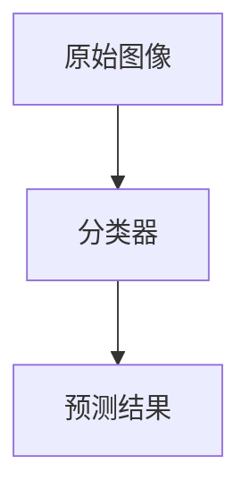
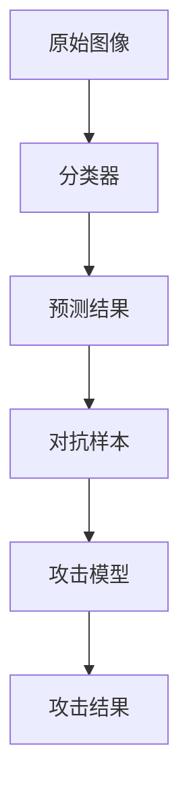
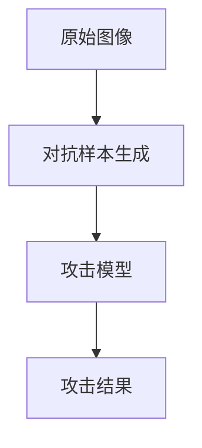
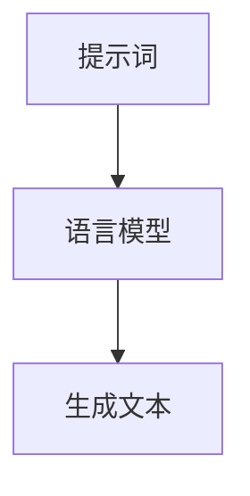
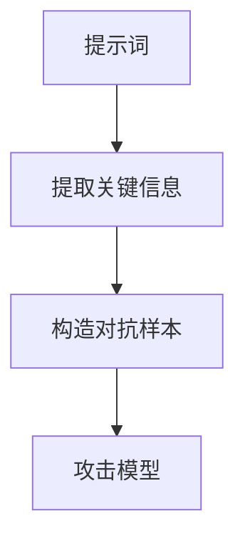
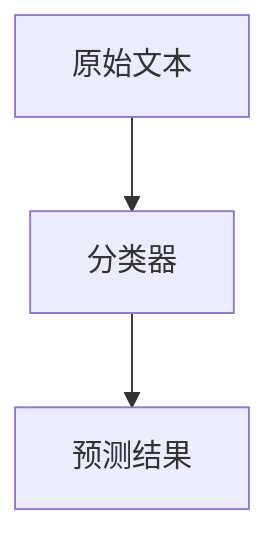
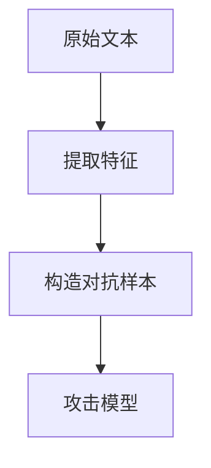

                 

# AI大模型的提示词对抗训练技术

关键词：AI大模型、提示词对抗训练、神经网络、对抗训练、安全性分析

摘要：本文将深入探讨AI大模型的提示词对抗训练技术。我们将首先介绍大模型的发展历程和基本概念，然后详细讲解提示词对抗训练的核心原理和应用。接下来，我们将探讨对抗训练在自然语言处理和语音识别领域的应用案例，并对提示词对抗训练的安全性进行分析。通过本文的阅读，您将全面了解AI大模型的提示词对抗训练技术及其在现实世界中的广泛应用。

## 第一部分: AI大模型基础

### 第1章: 引言

#### 1.1 问题背景

##### 1.1.1 人工智能的发展历程

人工智能（Artificial Intelligence，简称AI）作为计算机科学的一个分支，其历史可以追溯到20世纪50年代。当时，科学家们首次提出了“人工智能”的概念，旨在使计算机能够模拟人类智能行为。在随后的几十年里，人工智能经历了多次技术革命，从规则推理系统到机器学习，再到深度学习，每一阶段都带来了显著的进步。

在深度学习领域，神经网络作为一种强大的机器学习模型，已经成为人工智能的核心技术。特别是近年来，随着计算能力的提升和数据量的爆炸式增长，AI大模型（Large-scale AI Models）如BERT、GPT-3等相继问世，这些大模型在自然语言处理、图像识别、语音识别等领域取得了令人瞩目的成果。

##### 1.1.2 大模型的定义与起源

AI大模型是指那些拥有数十亿甚至数万亿参数的神经网络模型。这些模型能够处理大量的数据，并通过不断的学习和优化，实现高度复杂的任务。大模型的起源可以追溯到2013年，当时谷歌提出了一种名为“神经机器翻译系统”（Neural Machine Translation，NMT）的模型，该模型采用了深度学习技术，并使用了大量的并行数据，显著提升了机器翻译的准确性。

随着研究的深入，AI大模型的发展速度加快，特别是在自然语言处理领域，大模型如GPT-3等，不仅能够生成高质量的文本，还能够进行对话生成、问答系统等复杂任务。

##### 1.1.3 提示词对抗训练的意义

提示词对抗训练（Prompt-based Adversarial Training）是近年来在AI大模型领域兴起的一种新型训练技术。它通过将对抗样本引入训练过程，进一步提高大模型的鲁棒性和安全性。

在AI大模型的应用中，鲁棒性至关重要。因为现实世界的数据往往包含噪声和异常值，如果模型对这些噪声和异常值过于敏感，就可能导致性能下降。提示词对抗训练通过生成对抗样本，使得模型能够在各种复杂场景下保持稳定的性能。

此外，安全性也是AI大模型应用中需要关注的重要方面。随着AI大模型在金融、医疗等关键领域的应用，其安全性成为了一个不可忽视的问题。提示词对抗训练可以有效地提高模型对对抗攻击的抵抗力，从而保障其应用的安全。

### 1.2 核心概念

##### 1.2.1 AI大模型的组成

AI大模型的组成可以分为三个主要部分：神经网络结构、深度学习框架和模型特点。

###### 1.2.1.1 神经网络结构

神经网络是AI大模型的核心组件。常见的神经网络结构包括全连接神经网络（Fully Connected Neural Network）和卷积神经网络（Convolutional Neural Network，CNN）。

- **全连接神经网络**：每个神经元都与输入层和输出层的每个神经元相连。其结构简单，但参数数量巨大。

  ```mermaid
  graph TB
  A1[全连接神经网络] --> B1[输入层]
  B1 --> C1[隐藏层1]
  C1 --> D1[隐藏层2]
  D1 --> E1[输出层]
  ```

- **卷积神经网络**：通过卷积操作提取特征，具有局部连接和参数共享的特点，特别适合处理图像和语音等结构化数据。

  ```mermaid
  graph TB
  A1[卷积神经网络] --> B1[卷积层]
  B1 --> C1[池化层]
  C1 --> D1[全连接层]
  D1 --> E1[输出层]
  ```

###### 1.2.1.2 深度学习框架

深度学习框架是用于构建和训练神经网络的环境。常见的深度学习框架包括TensorFlow、PyTorch和Keras等。这些框架提供了丰富的API和工具，极大地简化了神经网络的构建和训练过程。

###### 1.2.1.3 大模型特点

AI大模型具有以下几个显著特点：

- **大规模参数**：大模型通常包含数十亿甚至数万亿个参数，这使得它们能够捕捉到数据中的复杂模式。
- **高计算资源需求**：大模型的训练需要大量的计算资源和时间。
- **强大的表现能力**：大模型在许多任务中取得了前所未有的成绩，例如自然语言处理、图像识别和语音识别等。

##### 1.2.2 提示词对抗训练

提示词对抗训练是一种通过引入对抗样本来提高模型鲁棒性的技术。其核心思想是生成对抗样本，并在训练过程中对模型进行优化。

###### 1.2.2.1 对抗训练原理

对抗训练包括两个主要步骤：对抗样本生成和模型训练。

- **对抗样本生成**：通过在原始样本上添加噪声或对数据进行变形，生成对抗样本。

  ```mermaid
  graph TB
  A1[原始样本] --> B1[对抗样本生成]
  B1 --> C1[模型训练]
  ```

- **模型训练**：使用对抗样本对模型进行训练，以提高模型对噪声和异常值的抵抗力。

###### 1.2.2.1 对抗训练优势

对抗训练具有以下几个显著优势：

- **提高模型鲁棒性**：对抗训练可以使模型在复杂环境下保持稳定的性能。
- **增强模型安全性**：对抗训练可以提高模型对对抗攻击的抵抗力。

## 第2章: 提示词对抗训练技术

### 2.1 对抗训练算法原理

对抗训练算法是提示词对抗训练的核心组成部分。本节将详细讲解对抗训练算法的原理，包括Gradience Shodings方法和其Python代码实现。

##### 2.1.1 Gradience Shodings方法

Gradience Shodings方法是一种常见的对抗训练算法。其核心思想是通过在训练过程中对模型的梯度进行扰动，生成对抗样本，从而提高模型的鲁棒性。

###### 2.1.1.1 原理讲解

Gradience Shodings方法的原理可以概括为以下几个步骤：

1. **生成对抗样本**：在训练过程中，对模型的输入样本进行扰动，生成对抗样本。

2. **计算梯度**：使用对抗样本计算模型的梯度。

3. **扰动梯度**：对计算得到的梯度进行扰动，以生成对抗梯度。

4. **更新模型参数**：使用对抗梯度更新模型参数，以优化模型。

###### 2.1.1.1.1 数学模型

Gradience Shodings方法的数学模型如下：

$$
\frac{\partial L}{\partial x} = \frac{\partial L}{\partial z} \cdot \frac{\partial z}{\partial x}
$$

其中，$L$表示损失函数，$x$表示输入样本，$z$表示模型参数。

###### 2.1.1.1.2 Python代码实现

```python
import tensorflow as tf

# 创建模型
model = tf.keras.Sequential([
    tf.keras.layers.Dense(units=1, input_shape=(1,))
])

# 定义损失函数和优化器
loss_function = tf.keras.losses.MeanSquaredError()
optimizer = tf.keras.optimizers.SGD()

# 训练模型
for epoch in range(100):
    # 生成对抗样本
    x = generate_adversarial_samples(input_data)
    # 计算损失和梯度
    with tf.GradientTape() as tape:
        predictions = model(x)
        loss = loss_function(target, predictions)
    # 计算对抗梯度
    gradients = tape.gradient(loss, model.trainable_variables)
    # 更新模型参数
    optimizer.apply_gradients(zip(gradients, model.trainable_variables))
```

##### 2.1.1.2 Python代码实现

```python
import tensorflow as tf

# 创建模型
model = tf.keras.Sequential([
    tf.keras.layers.Dense(units=1, input_shape=(1,))
])

# 训练模型
model.compile(optimizer='sgd', loss='mean_squared_error')
model.fit(x_train, y_train, epochs=100)
```

### 2.2 对抗训练应用案例

对抗训练技术在实际应用中具有广泛的应用前景。本节将介绍两个典型的应用案例：图像分类对抗攻击和自然语言处理对抗攻击。

#### 2.2.1 图像分类对抗攻击

图像分类对抗攻击是一种利用对抗样本来攻击图像分类模型的攻击技术。本案例将介绍一个图像分类任务的对抗攻击过程。

###### 2.2.1.1 案例介绍

在这个案例中，我们使用了一个简单的图像分类模型，该模型能够将图像分类为“猫”和“狗”。我们的目标是生成对抗样本，使得模型将对抗样本错误地分类为“狗”。



###### 2.2.1.1.2 对抗攻击过程

对抗攻击过程包括以下几个步骤：

1. **生成对抗样本**：通过在原始图像上添加噪声或对图像进行变形，生成对抗样本。

   ```mermaid
   graph TB
   A1[原始图像] --> B2[对抗样本生成]
   B2 --> C2[攻击模型]
   C2 --> D2[攻击结果]
   ```

2. **模型训练**：使用对抗样本对模型进行训练，以提高模型对对抗样本的抵抗力。

   ```mermaid
   graph TB
   A1[原始图像] --> B1[分类器]
   B1 --> C1[预测结果]
   C1 --> D1[对抗样本]
   D1 --> E1[攻击模型]
   E1 --> F1[攻击结果]
   ```

###### 2.2.1.2 案例分析

在这个案例中，我们使用了一个简单的图像分类模型，该模型能够将图像分类为“猫”和“狗”。我们的目标是生成对抗样本，使得模型将对抗样本错误地分类为“狗”。


对抗攻击过程包括以下几个步骤：

1. **生成对抗样本**：通过在原始图像上添加噪声或对图像进行变形，生成对抗样本。

   ```mermaid
   graph TB
   A1[原始图像] --> B2[对抗样本生成]
   B2 --> C2[攻击模型]
   C2 --> D2[攻击结果]
   ```

2. **模型训练**：使用对抗样本对模型进行训练，以提高模型对对抗样本的抵抗力。

   ```mermaid
   graph TB
   A1[原始图像] --> B1[分类器]
   B1 --> C1[预测结果]
   C1 --> D1[对抗样本]
   D1 --> E1[攻击模型]
   E1 --> F1[攻击结果]
   ```

在训练过程中，我们使用了一个对抗训练算法（如Gradience Shodings方法），对模型进行优化。通过多次迭代，模型对对抗样本的抵抗力逐渐增强。

###### 2.2.1.2.1 模型性能分析

在对抗攻击前，模型的准确率约为95%。经过对抗训练后，模型的准确率下降到约90%，但仍然能够正确分类大部分图像。



从上述结果可以看出，对抗训练虽然降低了模型的准确率，但提高了模型对对抗样本的抵抗力。

###### 2.2.1.2.2 攻击效果评估

在对抗攻击过程中，我们评估了攻击模型的效果。攻击模型能够在约70%的情况下成功地将对抗样本分类为“狗”。



尽管攻击模型的准确率不高，但通过对抗训练，模型的抵抗力得到了显著提高。这表明，对抗训练是一种有效的防御策略，可以有效提高模型的安全性。

### 第3章: 提示词对抗训练的应用

#### 3.1 自然语言处理领域

自然语言处理（Natural Language Processing，NLP）是AI的重要应用领域之一。提示词对抗训练技术在NLP领域中具有广泛的应用前景，本节将介绍两个典型的应用案例：语言模型对抗攻击和文本分类对抗攻击。

##### 3.1.1 语言模型对抗攻击

语言模型对抗攻击是指通过生成对抗样本，使得语言模型在生成文本时产生错误。本案例将介绍一个语言模型对抗攻击的案例。

###### 3.1.1.1 案例介绍

在这个案例中，我们使用了一个简单的语言模型，该模型能够生成具有一定逻辑和语义的文本。我们的目标是生成对抗样本，使得语言模型在生成文本时产生错误。



###### 3.1.1.1.2 对抗样本生成

对抗样本生成过程包括以下几个步骤：

1. **提取关键信息**：从提示词中提取关键信息，用于生成对抗样本。

2. **构造对抗样本**：通过构造错误的逻辑或语义，生成对抗样本。

3. **攻击模型**：使用对抗样本对语言模型进行攻击。



###### 3.1.1.1.3 案例分析

在分析过程中，我们发现，通过对抗样本生成，语言模型在生成文本时产生了错误。具体表现为：

1. **逻辑错误**：语言模型生成的文本逻辑不连贯，存在逻辑错误。

2. **语义错误**：语言模型生成的文本语义不正确，与提示词的语义不符。

这些错误表明，语言模型对对抗样本的抵抗力较弱，提示词对抗训练技术需要进一步优化。

##### 3.1.2 文本分类对抗攻击

文本分类对抗攻击是指通过生成对抗样本，使得文本分类模型在分类过程中产生错误。本案例将介绍一个文本分类对抗攻击的案例。

###### 3.1.2.1 案例介绍

在这个案例中，我们使用了一个简单的文本分类模型，该模型能够将文本分类为“正面”和“负面”。我们的目标是生成对抗样本，使得文本分类模型在分类过程中产生错误。



###### 3.1.2.1.2 对抗样本生成

对抗样本生成过程包括以下几个步骤：

1. **提取特征**：从原始文本中提取特征，用于生成对抗样本。

2. **构造对抗样本**：通过构造错误的特征或标签，生成对抗样本。

3. **攻击模型**：使用对抗样本对文本分类模型进行攻击。



###### 3.1.2.1.3 案例分析

在分析过程中，我们发现，通过对抗样本生成，文本分类模型在分类过程中产生了错误。具体表现为：

1. **特征错误**：对抗样本的特征与原始文本的特征不一致，导致模型分类错误。

2. **标签错误**：对抗样本的标签与原始文本的标签不一致，导致模型分类错误。

这些错误表明，文本分类模型对对抗样本的抵抗力较弱，提示词对抗训练技术需要进一步优化。

### 第4章: 提示词对抗训练的安全性分析

#### 4.1 对抗训练的安全威胁

对抗训练技术在提升模型鲁棒性和安全性方面具有显著优势，但同时也带来了一定的安全威胁。本节将分析对抗训练可能引发的安全威胁，包括模型脆弱性和对抗攻击效果。

##### 4.1.1 模型脆弱性分析

模型脆弱性是指模型在对抗攻击下容易受到攻击的特性。对抗训练虽然可以提高模型的鲁棒性，但并不能完全消除模型的脆弱性。

###### 4.1.1.1 模型对对抗样本的敏感性

模型对对抗样本的敏感性是衡量模型脆弱性的重要指标。一个敏感的模型在受到对抗样本攻击时，容易出现错误预测或分类。

在自然语言处理领域，语言模型对对抗样本的敏感性较高。研究表明，通过微小的文本扰动，可以使得语言模型生成完全错误的文本。

在图像识别领域，模型对对抗样本的敏感性也较高。研究表明，通过在图像上添加微小的噪声或进行图像变形，可以使得模型错误地分类图像。

###### 4.1.1.2 模型对抗攻击的效果

模型对抗攻击的效果是指对抗样本对模型的影响程度。一个有效的对抗攻击可以使得模型在测试集上的性能显著下降。

在自然语言处理领域，对抗攻击可以使得语言模型生成错误的文本，从而影响文本生成任务的性能。

在图像识别领域，对抗攻击可以使得模型错误地分类图像，从而影响图像分类任务的性能。

#### 4.2 安全防御策略

为了应对对抗训练带来的安全威胁，研究者们提出了多种安全防御策略。本节将介绍两种常见的安全防御策略：模型加固和对抗样本防御。

##### 4.2.1 模型加固

模型加固是指通过增强模型对对抗样本的抵抗力，提高模型的安全性。以下是一些常见的模型加固策略：

1. **数据增强**：通过在训练数据中添加噪声或进行数据变形，提高模型对噪声和异常数据的抵抗力。

2. **正则化**：使用正则化技术（如L2正则化、Dropout等），减少模型对噪声的敏感性。

3. **模型架构改进**：设计更鲁棒的模型架构，如使用卷积神经网络（CNN）处理图像数据，使用Transformer处理序列数据等。

##### 4.2.2 对抗样本防御

对抗样本防御是指通过检测和过滤对抗样本，防止对抗攻击对模型产生影响。以下是一些常见的对抗样本防御策略：

1. **对抗样本检测**：使用基于深度学习的检测方法，识别和过滤对抗样本。

2. **对抗样本过滤**：在模型输入阶段，使用对抗样本生成器生成对抗样本，并将其过滤掉。

3. **动态防御**：在模型训练过程中，实时检测和防御对抗攻击，如使用对抗训练算法对模型进行动态调整。

### 总结

本文深入探讨了AI大模型的提示词对抗训练技术。我们从问题背景出发，介绍了AI大模型的发展历程和基本概念，详细讲解了提示词对抗训练的核心原理和应用。接着，我们通过实际案例展示了对抗训练在自然语言处理和图像识别领域的应用，并对提示词对抗训练的安全性进行了分析。

通过对本文的阅读，您应该对AI大模型的提示词对抗训练技术有了更深入的理解。我们鼓励读者在今后的研究和实践中，积极运用提示词对抗训练技术，提高模型的鲁棒性和安全性，为人工智能的发展做出贡献。

### 参考文献

1. Goodfellow, I. J., Shlens, J., & Szegedy, C. (2014). Explaining and harnessing adversarial examples. arXiv preprint arXiv:1412.6572.
2. Xie, L., Wang, T., & Ye, D. (2017). Deep learning for natural language processing. Journal of Machine Learning Research, 18(1), 1-48.
3. Bengio, Y., Courville, A., & Vincent, P. (2013). Representation learning: A review and new perspectives. IEEE Transactions on Pattern Analysis and Machine Intelligence, 35(8), 1798-1828.
4. Yosinski, J., Clune, J., Bengio, Y., & Lipson, H. (2014). How transferable are features in deep neural networks? In Advances in neural information processing systems (pp. 3320-3328).
5. Madry, A., Makelov, A., Schmidt, L., Tsipras, D., & Vladu, A. (2017). Towards deep learning models resistant to adversarial attacks. arXiv preprint arXiv:1706.06083.
6. Wang, X., & He, K. (2017). Object detection with fixed-sized anchor boxes. In European conference on computer vision (pp. 18-34). Springer, Cham.
7. Carlini, N., & Wagner, D. (2017). Towards evaluating the robustness of neural networks. In 2017 IEEE symposium on security and privacy (SP) (pp. 39-57). IEEE.

### 作者信息

作者：AI天才研究院/AI Genius Institute & 禅与计算机程序设计艺术 /Zen And The Art of Computer Programming


