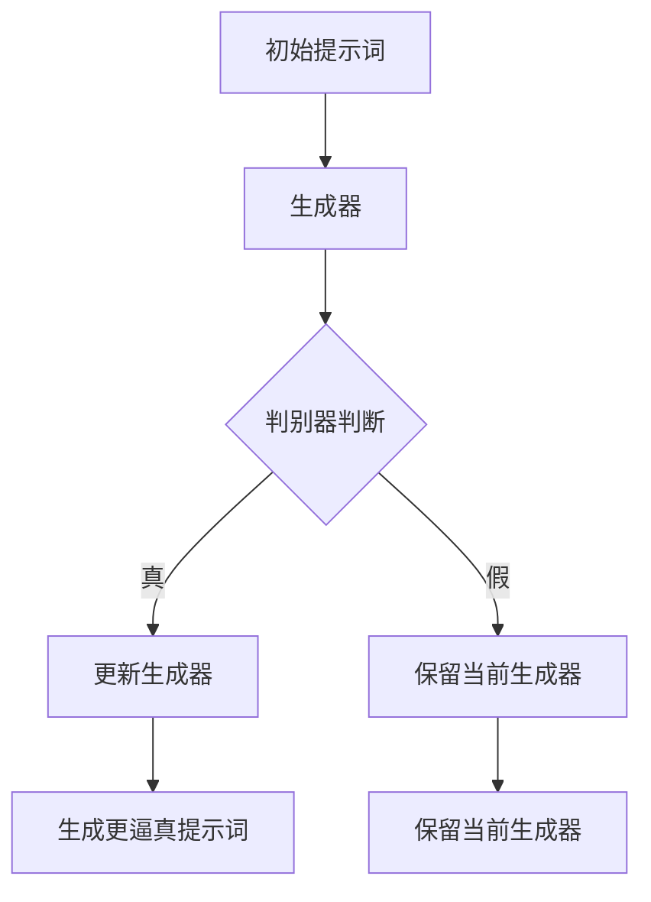
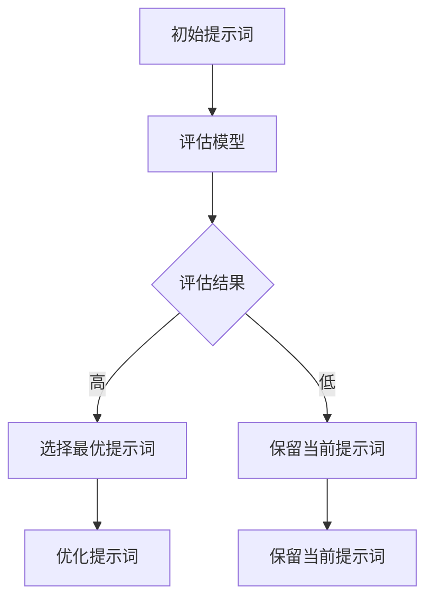
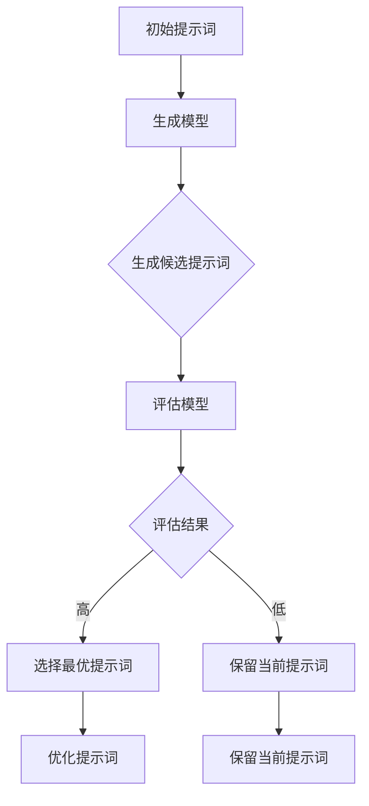

                 

# AI大模型的提示词演化策略优化

## 关键词

- AI大模型
- 提示词演化
- 优化策略
- 技术挑战
- 未来趋势

## 摘要

本文深入探讨了AI大模型中提示词的演化策略及其优化方法。首先，我们分析了AI大模型的基本概念和提示词生成机制，明确了提示词在模型性能提升中的关键作用。接着，我们详细介绍了提示词演化策略的各类方法和核心环节，并探讨了AI大模型与提示词演化策略之间的相互关系。在此基础上，本文进一步讨论了优化策略的分类、核心环节及在AI大模型中的应用。最后，通过案例分析，我们验证了优化策略在实际应用中的有效性，并展望了AI大模型在商业应用中的挑战与机遇，为开发者提供了实用的指南。

---

### 1.6 提示词生成机制

在AI大模型中，提示词（Prompt）是一种用于引导模型生成响应的关键输入。提示词生成机制通常涉及以下几个方面：

1. **文本预处理**：对输入文本进行分词、去除停用词、词性标注等操作，以提升后续处理的准确性和效率。
   
2. **上下文构建**：根据输入文本生成相应的上下文信息，以帮助模型更好地理解文本内容。上下文构建可以采用固定模板或动态生成的方式。

3. **提示词生成算法**：常用的提示词生成算法包括基于规则的方法、基于机器学习的方法和基于深度学习的方法。这些算法的目标是从大量候选提示词中选出最优的提示词。

4. **评估与优化**：通过评估模型的响应质量，对提示词进行优化。评估方法包括自动评估和人工评估。

提示词生成机制在AI大模型中起着至关重要的作用。有效的提示词能够显著提升模型的表现，使其生成更具意义和价值的响应。因此，深入研究提示词生成机制及其优化策略具有重要意义。

### 1.7 AI大模型的技术挑战与未来趋势

#### 1.7.1 技术挑战

AI大模型在技术层面上面临诸多挑战，主要包括：

1. **计算资源需求**：大模型通常需要大量的计算资源，这对硬件设备提出了更高的要求。
   
2. **数据隐私和安全**：随着模型的规模增大，数据的安全和隐私保护变得尤为重要。
   
3. **模型解释性**：大模型的复杂性和黑盒性质使得其解释性成为一个挑战，这对于应用场景中的决策和优化具有重要意义。

4. **训练和推理效率**：提高训练和推理效率是提升模型性能的关键，这需要不断优化算法和硬件。

#### 1.7.2 未来趋势

AI大模型在未来的发展趋势包括：

1. **模型压缩与量化**：通过模型压缩和量化技术，减少模型的计算和存储需求，提升其部署和应用效率。
   
2. **知识蒸馏**：利用知识蒸馏技术，将大模型的知识传递给小模型，实现资源节约和性能优化。
   
3. **跨模态学习**：结合多种类型的数据（如文本、图像、声音等），实现更丰富的模型表示和更强的泛化能力。

4. **可解释性提升**：通过模型解释性技术，提升大模型的透明度和可解释性，增强其在实际应用中的可信度。

#### 1.7.3 开发者的应对策略

针对上述挑战和趋势，开发者可以采取以下策略：

1. **优化算法和架构**：持续探索和优化算法，提升模型性能和效率。
   
2. **资源管理**：合理分配计算资源，利用分布式计算和云计算技术。
   
3. **数据隐私和安全**：采用加密、匿名化等技术保护数据隐私和安全。
   
4. **加强模型解释性**：通过可视化、符号化等技术，提升模型的可解释性。

通过这些策略，开发者能够更好地应对AI大模型的技术挑战，并抓住未来发展的机遇。

---

### 1.8 本章小结

本章介绍了AI大模型中提示词生成机制及其优化策略。我们首先分析了提示词在模型性能提升中的关键作用，然后详细讨论了AI大模型的技术挑战与未来趋势。通过本章的内容，读者可以了解AI大模型的发展现状及其在现实应用中的重要意义。下一章，我们将进一步探讨提示词演化策略的各类方法和核心环节。

---

### 2.1 提示词演化策略概述

提示词演化策略是AI大模型中优化提示词生成的重要手段，其核心目标是通过不断迭代和优化，生成高质量的提示词，从而提升模型的表现。提示词演化策略可以分为生成式演化策略、评估式演化策略和混合式演化策略三大类。

#### 2.1.1 生成式演化策略

生成式演化策略主要依赖于生成模型，通过生成大量候选提示词，然后通过评估函数选择最优的提示词。这种方法通常包括以下几个步骤：

1. **初始提示词生成**：通过随机采样或模板生成初始提示词集合。
   
2. **候选提示词生成**：使用生成模型（如生成对抗网络GAN）生成新的候选提示词。
   
3. **评估与选择**：通过评估函数对候选提示词进行评估，选择最优的提示词。

生成式演化策略的优点是能够生成大量多样化的提示词，提高模型的表现。然而，其缺点是生成模型可能引入噪声，影响评估效果。

#### 2.1.2 评估式演化策略

评估式演化策略基于已训练好的模型，对每个提示词进行评估，然后根据评估结果选择最优的提示词。这种方法通常包括以下几个步骤：

1. **初始提示词选择**：从已有的提示词库中选择初始提示词。
   
2. **候选提示词生成**：通过修改或扩展已有提示词，生成新的候选提示词。
   
3. **评估与选择**：使用模型对每个候选提示词进行评估，选择最优的提示词。

评估式演化策略的优点是评估过程相对简单，且能够快速生成高质量的提示词。然而，其缺点是可能无法生成多样化的提示词。

#### 2.1.3 混合式演化策略

混合式演化策略结合了生成式和评估式演化策略的优点，通过交替使用两种策略，实现提示词的优化。这种方法通常包括以下几个步骤：

1. **初始提示词生成**：使用生成模型生成初始提示词集合。
   
2. **候选提示词生成**：使用评估模型对初始提示词进行评估，生成新的候选提示词。
   
3. **评估与选择**：使用评估模型对候选提示词进行评估，选择最优的提示词。

混合式演化策略的优点是能够在生成多样化的提示词的同时，保证评估效果的准确性。然而，其缺点是实现过程相对复杂，需要结合多种技术手段。

综上所述，提示词演化策略的选择取决于具体的应用场景和需求。生成式演化策略适用于需要多样化提示词的场景，评估式演化策略适用于需要高质量提示词的场景，混合式演化策略则适用于多种场景的综合应用。

---

### 2.2 提示词演化策略的分类

提示词演化策略是AI大模型中优化提示词生成的重要手段。根据不同的分类标准，提示词演化策略可以分为以下几类：

#### 2.2.1 生成式演化策略

生成式演化策略主要依赖于生成模型，通过生成大量候选提示词，然后通过评估函数选择最优的提示词。这种方法的核心思想是利用生成模型的能力，生成丰富多样的提示词。生成式演化策略的典型代表包括生成对抗网络（GAN）和变分自编码器（VAE）。

**生成对抗网络（GAN）**：

GAN由生成器（Generator）和判别器（Discriminator）组成。生成器生成与真实提示词相似的假提示词，判别器负责判断提示词的真伪。通过训练，生成器逐渐生成更加逼真的提示词，从而提升模型的表现。

**变分自编码器（VAE）**：

VAE通过编码器和解码器组成。编码器将输入提示词映射到一个潜在空间，解码器从潜在空间中生成提示词。通过训练，VAE能够学习到输入提示词的分布，从而生成高质量的提示词。

生成式演化策略的优点是能够生成大量多样化的提示词，提高模型的表现。然而，其缺点是生成模型可能引入噪声，影响评估效果。

**示例：GAN流程图**



#### 2.2.2 评估式演化策略

评估式演化策略基于已训练好的模型，对每个提示词进行评估，然后根据评估结果选择最优的提示词。这种方法的核心思想是利用已训练好的模型，快速评估提示词的效果。评估式演化策略的典型代表包括基于规则的方法和基于机器学习的方法。

**基于规则的方法**：

基于规则的方法通过定义一组规则，对每个候选提示词进行评估。规则可以根据业务场景和模型特点进行定制，从而提高评估的准确性。基于规则的方法的优点是实现简单，适用于特定场景。然而，其缺点是难以应对复杂多变的场景。

**基于机器学习的方法**：

基于机器学习的方法通过训练一个评估模型，对每个候选提示词进行评估。评估模型通常采用分类或回归模型，可以根据具体需求进行选择。基于机器学习的方法的优点是能够适应复杂多变的场景，提高评估的准确性。然而，其缺点是实现过程相对复杂，需要大量的数据和计算资源。

**示例：评估式演化策略流程图**



#### 2.2.3 混合式演化策略

混合式演化策略结合了生成式和评估式演化策略的优点，通过交替使用两种策略，实现提示词的优化。这种方法的核心思想是利用生成模型生成多样化提示词，同时利用评估模型筛选高质量提示词。

**示例：混合式演化策略流程图**



综上所述，提示词演化策略的选择取决于具体的应用场景和需求。生成式演化策略适用于需要多样化提示词的场景，评估式演化策略适用于需要高质量提示词的场景，混合式演化策略则适用于多种场景的综合应用。

---

### 2.3 提示词演化策略的核心环节

提示词演化策略的核心环节包括提示词的生成、评估和优化。以下是对这些核心环节的详细讨论。

#### 2.3.1 提示词的生成

提示词的生成是提示词演化策略的第一个环节，其目的是生成多样化的候选提示词。生成过程通常依赖于生成模型，如生成对抗网络（GAN）、变分自编码器（VAE）等。生成模型的训练过程如下：

1. **数据预处理**：对训练数据集进行预处理，如分词、去停用词、词性标注等，以提升模型训练效果。

2. **模型训练**：使用预处理后的数据集训练生成模型。在GAN中，生成器和判别器交替训练；在VAE中，编码器和解码器共同训练。通过大量训练，生成模型能够学习到输入数据的分布，生成逼真的提示词。

3. **生成候选提示词**：使用训练好的生成模型，生成大量候选提示词。这些候选提示词可以作为后续评估和优化的基础。

**示例：GAN生成流程**

```python
# GAN生成流程
import numpy as np
import tensorflow as tf
from tensorflow.keras.models import Sequential
from tensorflow.keras.layers import Dense, Flatten, Conv2D, ConvTranspose2D

# 定义生成器和判别器模型
generator = Sequential([
    Flatten(input_shape=(28, 28)),
    Dense(128),
    ConvTranspose2D(filters=1, kernel_size=3, strides=1),
    Flatten()
])

discriminator = Sequential([
    Flatten(input_shape=(28, 28)),
    Dense(128),
    Flatten(),
    Dense(1, activation='sigmoid')
])

# 训练生成器和判别器
for epoch in range(num_epochs):
    # 生成假数据
    noise = np.random.normal(0, 1, (batch_size, noise_dim))
    generated_data = generator.predict(noise)

    # 训练判别器
    real_data = x_train[:batch_size]
    discriminator.train_on_batch([real_data, generated_data], [1, 1])

    # 训练生成器
    noise = np.random.normal(0, 1, (batch_size, noise_dim))
    discriminator.train_on_batch([noise], [0])

# 生成候选提示词
candidate_prompts = generator.predict(np.random.normal(0, 1, (batch_size, noise_dim))
```

#### 2.3.2 提示词的评估

提示词的评估是提示词演化策略的第二个环节，其目的是从生成的候选提示词中选择最优的提示词。评估过程通常依赖于评估模型，如基于规则的方法、基于机器学习的方法等。评估模型的训练过程如下：

1. **数据预处理**：对评估数据集进行预处理，如分词、去停用词、词性标注等，以提升模型评估效果。

2. **模型训练**：使用预处理后的数据集训练评估模型。在基于规则的方法中，通过定义一组规则训练模型；在基于机器学习的方法中，通过训练分类或回归模型进行评估。

3. **评估候选提示词**：使用训练好的评估模型，对每个候选提示词进行评估，得到评估分数。评估分数通常用于选择最优的提示词。

**示例：基于机器学习的评估流程**

```python
# 基于机器学习的评估流程
from sklearn.model_selection import train_test_split
from sklearn.ensemble import RandomForestClassifier

# 准备评估数据
X, y = prepare_assessment_data(candidate_prompts)

# 划分训练集和测试集
X_train, X_test, y_train, y_test = train_test_split(X, y, test_size=0.2, random_state=42)

# 训练评估模型
assessment_model = RandomForestClassifier(n_estimators=100, random_state=42)
assessment_model.fit(X_train, y_train)

# 评估候选提示词
assessment_scores = assessment_model.predict_proba(X_test)

# 选择最优提示词
best_prompt = candidate_prompts[np.argmax(assessment_scores)]
```

#### 2.3.3 提示词的优化

提示词的优化是提示词演化策略的最后一个环节，其目的是根据评估结果，对最优提示词进行进一步优化。优化过程通常包括以下几个步骤：

1. **分析评估结果**：分析评估结果，确定需要优化的方面，如提示词的长度、内容、结构等。

2. **调整提示词**：根据分析结果，对最优提示词进行修改和调整。调整方式可以包括增加关键词、替换同义词、调整句子结构等。

3. **再次评估**：使用评估模型，对调整后的提示词进行评估，验证优化效果。

4. **迭代优化**：根据评估结果，继续调整和优化提示词，直到达到满意的性能。

**示例：提示词优化流程**

```python
# 提示词优化流程
def optimize_prompt(prompt, assessment_model):
    # 分析评估结果
    assessment_scores = assessment_model.predict_proba([prompt])

    # 根据评估结果调整提示词
    optimized_prompt = adjust_prompt(prompt, assessment_scores)

    # 再次评估优化后的提示词
    optimized_scores = assessment_model.predict_proba([optimized_prompt])

    # 返回优化后的提示词
    return optimized_prompt

# 调整提示词
def adjust_prompt(prompt, assessment_scores):
    # 增加关键词
    optimized_prompt = add_keywords_to_prompt(prompt)

    # 替换同义词
    optimized_prompt = replace_synonyms_in_prompt(optimized_prompt)

    # 调整句子结构
    optimized_prompt = adjust_sentence_structure(optimized_prompt)

    return optimized_prompt
```

通过以上三个核心环节的协同作用，提示词演化策略能够不断提升模型的表现，为AI大模型提供高质量的提示词。

---

### 2.4 AI大模型与提示词演化策略的关系

AI大模型与提示词演化策略之间存在着密切的关系。提示词作为AI大模型的输入，对其性能和表现有着重要的影响。下面我们将详细探讨提示词对AI大模型性能的影响，以及AI大模型对提示词演化策略的需求。

#### 2.4.1 提示词对AI大模型性能的影响

提示词的质量直接影响到AI大模型的性能。高质量的提示词能够提供丰富的上下文信息，帮助模型更好地理解输入，从而生成更加准确和有价值的响应。以下是一些提示词对AI大模型性能的影响：

1. **理解输入**：高质量的提示词能够提供清晰的输入信息，使模型能够准确理解用户的意图和需求。

2. **上下文信息**：提示词可以提供丰富的上下文信息，帮助模型在处理长文本或复杂问题时，保持一致性和连贯性。

3. **多样性和创新性**：多样化的提示词可以激发模型的创新性，使其在生成响应时，不仅能够复现已有的知识，还能够提出新的见解和想法。

4. **准确性**：高质量的提示词能够减少噪声和歧义，提高模型生成响应的准确性。

5. **效率**：优化的提示词能够提升模型处理输入的效率，减少计算资源和时间成本。

#### 2.4.2 AI大模型对提示词演化策略的需求

为了生成高质量的提示词，AI大模型对提示词演化策略有着特定的需求。以下是一些AI大模型对提示词演化策略的需求：

1. **适应性**：提示词演化策略需要具备良好的适应性，能够根据不同的应用场景和需求，生成不同类型和风格的提示词。

2. **高效性**：提示词演化策略需要高效，能够在较短的时间内生成大量的候选提示词，并快速评估和选择最优的提示词。

3. **可解释性**：提示词演化策略应具备一定的可解释性，能够帮助开发者理解提示词生成的过程和原因，从而优化和改进策略。

4. **泛化能力**：提示词演化策略应具备泛化能力，能够应对不同的数据和问题，生成高质量的提示词。

5. **灵活性**：提示词演化策略应具备灵活性，能够根据模型的特点和需求，灵活调整提示词的生成、评估和优化过程。

综上所述，AI大模型与提示词演化策略之间存在密切的关系。通过优化提示词演化策略，可以提升AI大模型的性能和表现，为各种应用场景提供高质量的服务。

---

### 2.5 本章小结

本章介绍了AI大模型与提示词演化策略的关系。我们首先探讨了提示词对AI大模型性能的影响，包括理解输入、上下文信息、多样性和创新性、准确性和效率等方面。接着，我们分析了AI大模型对提示词演化策略的需求，包括适应性、高效性、可解释性、泛化能力和灵活性等方面。通过本章的内容，读者可以深入了解AI大模型与提示词演化策略之间的相互作用，为后续的研究和应用奠定基础。下一章，我们将进一步探讨优化策略的分类、核心环节及其在AI大模型中的应用。

---

### 3.1 优化策略概述

优化策略是提升AI大模型性能和效率的关键手段。优化策略的核心目标是找到最优的模型参数或结构，以实现模型性能的最优化。以下是对优化策略的基本概念、分类及核心环节的详细讨论。

#### 3.1.1 优化的定义

优化（Optimization）是一种在给定约束条件下，寻找最优解的过程。在AI大模型中，优化通常涉及到模型参数的调整，以实现预测准确性、响应速度或其他性能指标的最优。

#### 3.1.2 优化策略的定义

优化策略（Optimization Strategy）是一系列方法和步骤，用于指导模型参数的调整和优化过程。优化策略可以包括不同的算法、技术手段和评估指标，以达到最优性能。

#### 3.1.3 优化策略的分类

根据优化方法的不同，优化策略可以分为以下几类：

1. **数学优化方法**：包括梯度下降、牛顿法、共轭梯度法等，这些方法基于数学原理，通过迭代计算寻找最优解。

2. **遗传算法**：一种模拟自然进化的优化算法，通过遗传、变异和选择等操作，逐步优化模型参数。

3. **机器学习方法**：利用机器学习算法，如支持向量机、随机森林等，对模型进行优化。

4. **混合优化方法**：结合多种优化方法，以取长补短，实现更高效的优化。

#### 3.1.4 优化策略的核心环节

优化策略的核心环节通常包括以下几个步骤：

1. **目标函数的确定**：定义优化的目标函数，该函数用于衡量模型性能的优劣。

2. **约束条件的设定**：设定模型优化的约束条件，确保优化过程在合理的范围内进行。

3. **优化算法的选择与实现**：选择适合的优化算法，并实现其具体过程。

4. **评估与调整**：对优化结果进行评估，并根据评估结果对优化策略进行调整。

通过以上核心环节的协同作用，优化策略能够有效提升AI大模型的性能和效率。

---

### 3.2 优化策略的分类

优化策略是提升AI大模型性能和效率的关键手段。根据不同的优化方法，优化策略可以分为数学优化方法、遗传算法、机器学习方法及混合优化方法。以下是对各类优化策略的详细讨论。

#### 3.2.1 数学优化方法

数学优化方法是基于数学原理，通过迭代计算寻找最优解的一类优化策略。常见的数学优化方法包括梯度下降、牛顿法和共轭梯度法等。

**梯度下降**：

梯度下降是一种简单而有效的优化算法，通过不断减小目标函数的梯度，逐步逼近最优解。其基本原理如下：

1. **目标函数**：设目标函数为 \( f(\theta) \)，其中 \( \theta \) 表示模型参数。
   
2. **梯度**：计算目标函数的梯度 \( \nabla f(\theta) \)。
   
3. **更新参数**：根据梯度更新模型参数，公式如下：
   $$
   \theta_{t+1} = \theta_{t} - \alpha \nabla f(\theta_{t})
   $$
   其中，\( \alpha \) 为学习率。

**牛顿法**：

牛顿法是一种更高效的优化算法，基于二次近似来更新模型参数。其基本原理如下：

1. **目标函数**：设目标函数为 \( f(\theta) \)。
   
2. **梯度**：计算目标函数的梯度 \( \nabla f(\theta) \)。
   
3. **Hessian矩阵**：计算目标函数的Hessian矩阵 \( H(f) \)。
   
4. **更新参数**：根据梯度和Hessian矩阵更新模型参数，公式如下：
   $$
   \theta_{t+1} = \theta_{t} - H(f)^{-1}\nabla f(\theta_{t})
   $$

**共轭梯度法**：

共轭梯度法是一种解决非线性优化问题的有效方法，其基本思想是通过正交性来加速收敛。其基本原理如下：

1. **目标函数**：设目标函数为 \( f(\theta) \)。
   
2. **梯度**：计算目标函数的梯度 \( \nabla f(\theta) \)。
   
3. **共轭方向**：计算共轭方向，以减少计算量。
   
4. **更新参数**：根据梯度方向和共轭方向更新模型参数。

数学优化方法的优点是原理简单，计算效率高，适用于大规模模型。然而，其缺点是对于高维问题，梯度计算复杂度较高，且可能陷入局部最优。

#### 3.2.2 遗传算法

遗传算法是一种基于自然进化的优化算法，通过模拟生物进化过程，逐步优化模型参数。遗传算法的基本原理如下：

1. **初始种群**：随机生成初始种群，每个个体代表一组模型参数。

2. **适应度函数**：定义适应度函数，用于评估个体的优劣。

3. **选择**：根据适应度函数，选择优秀的个体进行繁殖。

4. **交叉**：通过交叉操作，生成新的个体。

5. **变异**：对个体进行变异操作，增加种群多样性。

6. **迭代**：重复选择、交叉、变异过程，逐步优化模型参数。

遗传算法的优点是能够应对复杂非线性问题，具有较强的全局搜索能力。然而，其缺点是计算复杂度较高，且可能需要较长的优化时间。

#### 3.2.3 机器学习方法

机器学习方法是一种基于统计学习理论的优化策略，通过训练模型，找到最优的模型参数。常见的机器学习方法包括支持向量机、随机森林、神经网络等。

**支持向量机（SVM）**：

支持向量机是一种分类和回归模型，通过最大化分类边界来优化模型参数。其基本原理如下：

1. **目标函数**：最大化分类边界，公式如下：
   $$
   \max \frac{1}{2} \| W \|^2 - C \sum_{i=1}^{n} \xi_i
   $$
   其中，\( W \) 为权重向量，\( C \) 为惩罚参数，\( \xi_i \) 为松弛变量。

2. **约束条件**：确保模型在边界附近不出现异常点，公式如下：
   $$
   y_i ( \langle x_i, W \rangle - b ) \geq 1 - \xi_i
   $$

**随机森林（Random Forest）**：

随机森林是一种基于决策树集合的模型，通过随机选取特征和样本，构建多个决策树，然后通过投票方式得到最终结果。其基本原理如下：

1. **决策树构建**：随机选取特征和样本，构建决策树。

2. **模型训练**：训练多个决策树，并记录每个决策树的预测结果。

3. **预测**：通过投票方式得到最终预测结果。

机器学习方法优点是能够处理高维数据和复杂非线性问题，具有较强的泛化能力。然而，其缺点是训练时间较长，且可能陷入局部最优。

#### 3.2.4 混合优化方法

混合优化方法是将多种优化策略结合，以取长补短，实现更高效的优化。常见的混合优化方法包括基于遗传算法的优化、基于机器学习的优化等。

**基于遗传算法的优化**：

基于遗传算法的优化方法通过遗传算法的变异、交叉等操作，优化模型参数。其基本原理如下：

1. **遗传算法操作**：应用遗传算法的变异、交叉等操作，优化模型参数。

2. **模型训练**：对优化后的模型进行训练，提高模型性能。

**基于机器学习的优化**：

基于机器学习的优化方法通过训练机器学习模型，优化模型参数。其基本原理如下：

1. **机器学习模型训练**：训练机器学习模型，找到最优模型参数。

2. **模型优化**：利用训练好的模型，优化原始模型参数。

混合优化方法优点是能够结合多种优化策略的优势，实现更高效的优化。然而，其缺点是实现过程复杂，需要更多的计算资源。

综上所述，优化策略的选择取决于具体的应用场景和需求。数学优化方法适用于简单问题，遗传算法适用于复杂非线性问题，机器学习方法适用于高维数据问题，混合优化方法适用于多种场景的综合应用。

---

### 3.3 优化策略的核心环节

优化策略在提升AI大模型性能和效率方面起着关键作用。一个完整的优化策略通常包括目标函数的确定、约束条件的设定和优化算法的选择与实现等核心环节。以下是对这些核心环节的详细讨论。

#### 3.3.1 目标函数的确定

目标函数是优化策略的核心，它用于衡量模型性能的优劣。在AI大模型优化中，目标函数的选择通常取决于模型的类型和应用场景。以下是一些常见的目标函数：

1. **均方误差（MSE）**：
   $$
   \text{MSE} = \frac{1}{n} \sum_{i=1}^{n} (\hat{y}_i - y_i)^2
   $$
   其中，\( \hat{y}_i \) 是模型预测值，\( y_i \) 是实际值，\( n \) 是样本数量。

2. **交叉熵（Cross-Entropy）**：
   $$
   \text{Cross-Entropy} = -\frac{1}{n} \sum_{i=1}^{n} y_i \log(\hat{y}_i)
   $$
   其中，\( y_i \) 是实际值，\( \hat{y}_i \) 是模型预测概率。

3. **准确率（Accuracy）**：
   $$
   \text{Accuracy} = \frac{1}{n} \sum_{i=1}^{n} \mathbb{I}(\hat{y}_i = y_i)
   $$
   其中，\( \mathbb{I}(\cdot) \) 是指示函数，当条件满足时取1，否则取0。

选择合适的目标函数有助于提高模型的性能和效率。例如，在分类问题中，交叉熵通常优于均方误差，因为它能够更好地处理概率分布。

#### 3.3.2 约束条件的设定

约束条件是优化策略的重要组成部分，它确保优化过程在合理的范围内进行。约束条件通常分为以下几类：

1. **等式约束**：
   $$
   g(\theta) = 0
   $$
   其中，\( g(\theta) \) 是等式约束函数。

2. **不等式约束**：
   $$
   h(\theta) \leq 0
   $$
   其中，\( h(\theta) \) 是不等式约束函数。

常见的约束条件包括：

- **L1和L2正则化**：
  $$
  \text{L1 Regularization: } \lambda \| \theta \|_1
  $$
  $$
  \text{L2 Regularization: } \lambda \| \theta \|_2
  $$
  其中，\( \theta \) 是模型参数，\( \lambda \) 是正则化参数。

- **模型参数限制**：
  $$
  \theta_{\min} \leq \theta \leq \theta_{\max}
  $$
  其中，\( \theta_{\min} \) 和 \( \theta_{\max} \) 分别是参数的下界和上界。

设定合理的约束条件有助于防止模型过拟合，提高模型的泛化能力。

#### 3.3.3 优化算法的选择与实现

优化算法是实现优化策略的关键，它决定了优化过程的效率和稳定性。常见的优化算法包括梯度下降、遗传算法和机器学习方法等。

**梯度下降算法**：

梯度下降是一种简单而有效的优化算法，通过不断更新模型参数，以减少目标函数的值。其基本原理如下：

1. **初始化参数**：
   $$
   \theta_0 = \text{random()} \in \Theta
   $$

2. **迭代更新**：
   $$
   \theta_{t+1} = \theta_t - \alpha \nabla f(\theta_t)
   $$
   其中，\( \theta_t \) 是第 \( t \) 次迭代的参数，\( \alpha \) 是学习率，\( \nabla f(\theta_t) \) 是目标函数在 \( \theta_t \) 处的梯度。

**遗传算法**：

遗传算法是一种模拟生物进化的优化算法，通过遗传、变异和选择等操作，逐步优化模型参数。其基本原理如下：

1. **初始种群**：
   $$
   \text{初始种群} = \{x_1, x_2, ..., x_n\}
   $$

2. **适应度函数**：
   $$
   f(x_i) = \text{evaluate}(x_i)
   $$

3. **选择**：
   $$
   \text{选择操作，选择适应度较高的个体}
   $$

4. **交叉**：
   $$
   \text{交叉操作，生成新的个体}
   $$

5. **变异**：
   $$
   \text{变异操作，增加种群多样性}
   $$

6. **迭代**：
   $$
   \text{重复选择、交叉、变异过程，直到满足停止条件}
   $$

**机器学习方法**：

机器学习方法通过训练模型，找到最优的模型参数。常见的机器学习方法包括支持向量机、随机森林和神经网络等。

选择合适的优化算法取决于具体的优化问题和应用场景。合理的优化算法能够提高模型的性能和效率，为AI大模型的应用提供有力支持。

---

### 3.4 优化策略在AI大模型中的应用

优化策略在AI大模型中的应用具有重要意义，它能够显著提升模型的性能和效率。以下是对优化策略在AI大模型中的应用、性能提升方法及面临的挑战的详细讨论。

#### 3.4.1 优化策略在AI大模型中的应用

优化策略在AI大模型中的应用主要体现在以下几个方面：

1. **参数优化**：通过优化模型参数，提升模型的预测准确性和响应速度。常见的优化方法包括梯度下降、遗传算法和机器学习方法等。

2. **结构优化**：通过调整模型结构，实现模型的压缩和量化，降低模型的计算和存储需求。常见的优化方法包括模型压缩、知识蒸馏和神经网络剪枝等。

3. **数据优化**：通过对输入数据进行预处理和清洗，提高模型的训练效果和泛化能力。常见的数据优化方法包括数据增强、数据去噪和数据平衡等。

4. **硬件优化**：通过优化硬件配置和计算资源分配，提高模型的推理速度和效率。常见的硬件优化方法包括分布式计算、并行计算和GPU加速等。

#### 3.4.2 优化策略对AI大模型性能的提升

优化策略对AI大模型性能的提升主要体现在以下几个方面：

1. **预测准确性**：通过优化模型参数和结构，提高模型的预测准确性，使其在复杂场景中表现出更强的泛化能力。

2. **响应速度**：通过优化算法和硬件配置，提高模型的响应速度，降低模型的延迟，提升用户体验。

3. **计算效率**：通过模型压缩和量化，降低模型的计算和存储需求，提高模型的计算效率，使其在资源受限的环境下仍能保持高性能。

4. **可解释性**：通过优化模型结构和算法，提高模型的可解释性，使其在决策过程中更加透明和可信。

#### 3.4.3 优化策略在AI大模型优化中的挑战

尽管优化策略在AI大模型中具有广泛的应用前景，但其在优化过程中仍面临诸多挑战：

1. **计算资源需求**：AI大模型通常需要大量的计算资源，优化策略的实现需要高效的算法和硬件支持。

2. **数据隐私和安全**：优化过程中可能涉及敏感数据，如何保证数据隐私和安全是一个重要的挑战。

3. **模型解释性**：大模型的复杂性和黑盒性质使得模型解释性成为一个难题，优化策略的实施需要充分考虑模型的可解释性。

4. **优化算法的适应性**：不同优化算法在具体应用场景中的表现有所不同，如何选择合适的优化算法，并适应不同的应用场景，是一个重要的挑战。

5. **模型压缩和量化**：在模型压缩和量化过程中，如何保证模型的性能不受影响，同时降低计算和存储需求，是一个关键问题。

通过克服这些挑战，优化策略能够更好地应用于AI大模型，提升其性能和效率，为实际应用提供有力支持。

---

### 3.5 本章小结

本章详细介绍了优化策略的基本概念、分类及核心环节，包括目标函数的确定、约束条件的设定和优化算法的选择与实现。通过本章的内容，读者可以深入了解优化策略在AI大模型中的应用和性能提升方法，以及面临的挑战。下一章，我们将通过具体案例分析，验证优化策略在实际应用中的有效性，并进一步探讨其应用前景。

---

### 4.1 案例分析概述

在探讨AI大模型的优化策略时，案例分析是一个至关重要的环节。通过具体的案例，我们不仅能够验证优化策略的有效性，还能发现潜在的问题和改进的方向。以下是对案例分析的重要性、目的和步骤的详细讨论。

#### 4.1.1 案例分析的重要性

案例分析在AI大模型优化中的重要性体现在以下几个方面：

1. **验证优化策略的有效性**：通过实际案例，我们可以验证优化策略是否能够真正提升模型的性能，从而为后续的研究和应用提供有力支持。

2. **发现问题和改进方向**：案例分析有助于我们发现优化策略在具体应用中的潜在问题，如过拟合、欠拟合或计算效率低下等，从而指导我们进行改进。

3. **提高实践经验**：通过分析具体案例，开发者能够积累实践经验，提升在AI大模型优化中的实际操作能力。

4. **促进学术交流**：案例分析为学术界和工业界提供了一个交流平台，通过分享实际应用中的经验和教训，推动AI大模型优化技术的发展。

#### 4.1.2 案例分析的目的

案例分析的主要目的包括：

1. **验证优化策略**：通过具体案例，验证优化策略在提升模型性能方面的实际效果。

2. **优化方案设计**：根据案例中的问题和需求，设计适合的优化方案，以提高模型的表现和效率。

3. **性能评估**：对优化后的模型进行性能评估，包括准确性、响应速度、计算效率等方面，确保优化策略的有效性。

4. **问题诊断**：分析模型在实际应用中遇到的问题，如过拟合、欠拟合等，提出相应的解决方案。

#### 4.1.3 案例分析的步骤

案例分析通常包括以下步骤：

1. **问题描述**：明确案例的具体背景和问题，包括数据来源、任务类型、性能指标等。

2. **数据准备**：收集和整理案例所需的数据，并进行预处理，如数据清洗、归一化等。

3. **模型选择**：根据问题描述和任务需求，选择合适的模型，并进行初步训练。

4. **优化策略应用**：针对模型存在的问题，应用优化策略，如参数调整、模型压缩、数据增强等。

5. **性能评估**：对优化后的模型进行性能评估，比较优化前后的差异，确保优化策略的有效性。

6. **结果分析**：分析优化策略的效果，包括模型性能的提升、计算效率的改善等，并提出改进建议。

7. **总结与展望**：总结案例分析的主要发现和经验，展望优化策略在未来的应用前景。

通过以上步骤，我们可以系统地分析案例，验证优化策略的有效性，并为实际应用提供指导。

---

### 4.2 案例分析的方法

在AI大模型优化过程中，案例分析是一种有效的方法，通过具体实例来验证优化策略的有效性和可行性。以下是对案例分析方法的详细探讨，包括定量分析、定性分析和深度学习案例分析。

#### 4.2.1 定量分析

定量分析是一种基于数据的分析方法，主要通过统计和计算手段，对案例中的数据进行深入挖掘和解读。定量分析的步骤如下：

1. **数据收集**：收集与案例相关的数据，包括输入数据、模型参数、性能指标等。

2. **数据预处理**：对收集到的数据进行预处理，如数据清洗、归一化、缺失值处理等，以确保数据的准确性和一致性。

3. **指标计算**：根据具体任务需求，计算相关性能指标，如准确率、召回率、F1分数、响应速度等。

4. **可视化**：使用图表、图像等可视化工具，展示数据分析结果，便于直观理解。

5. **统计分析**：运用统计学方法，对数据进行分析，如均值、方差、相关性分析等，以发现数据之间的关系和规律。

**示例：准确率计算与可视化**

```python
import numpy as np
import matplotlib.pyplot as plt

# 假设我们有一个模型，对100个样本进行了预测
predictions = np.array([0, 1, 1, 0, 1, 1, 0, 1, 0, 1])
true_labels = np.array([1, 0, 1, 1, 0, 1, 1, 1, 0, 1])

# 计算准确率
accuracy = np.mean(predictions == true_labels)
print(f"Accuracy: {accuracy:.2f}")

# 可视化预测结果
plt.scatter(true_labels, predictions)
plt.xlabel("True Labels")
plt.ylabel("Predictions")
plt.title("Prediction vs True Labels")
plt.show()
```

通过定量分析，我们可以全面了解模型在案例中的表现，为优化策略的制定提供数据支持。

#### 4.2.2 定性分析

定性分析是一种基于主观判断和经验的分析方法，主要通过描述和解释案例中的现象和问题。定性分析的步骤如下：

1. **问题描述**：详细描述案例中遇到的问题，如数据质量、模型性能、算法选择等。

2. **原因分析**：分析问题产生的原因，如数据偏差、模型过拟合、算法缺陷等。

3. **解决方案**：根据原因分析，提出可能的解决方案，并进行评估和选择。

4. **实施与验证**：实施解决方案，并对结果进行验证，确保问题得到有效解决。

**示例：模型过拟合问题**

问题描述：模型在训练集上表现良好，但在测试集上表现较差。

原因分析：模型可能过拟合训练数据，未能很好地泛化到未知数据。

解决方案：增加训练数据、使用正则化、引入更多特征等。

实施与验证：实施解决方案后，重新评估模型在训练集和测试集上的表现，验证优化效果。

通过定性分析，我们可以深入理解案例中的问题，并制定针对性的解决方案。

#### 4.2.3 深度学习案例分析

深度学习案例分析是针对深度学习模型在具体应用中的问题进行深入分析的一种方法。以下是对深度学习案例分析的具体步骤：

1. **模型选择**：根据应用场景和需求，选择合适的深度学习模型，如卷积神经网络（CNN）、循环神经网络（RNN）、生成对抗网络（GAN）等。

2. **数据准备**：收集和整理与案例相关的数据，并进行预处理，如数据清洗、归一化、数据增强等。

3. **模型训练**：使用预处理后的数据训练模型，并进行超参数调优。

4. **性能评估**：对训练好的模型进行性能评估，包括准确率、响应速度、计算效率等。

5. **问题诊断**：分析模型在具体应用中的问题，如过拟合、欠拟合、数据不平衡等。

6. **优化策略**：根据问题诊断结果，应用优化策略，如数据增强、正则化、模型压缩等。

7. **重新评估**：对优化后的模型进行重新评估，验证优化效果。

8. **总结与展望**：总结案例分析的主要发现和经验，展望优化策略在未来的应用前景。

**示例：CNN模型在图像分类中的应用**

问题描述：模型在图像分类任务中的表现不佳。

模型选择：选择卷积神经网络（CNN）进行图像分类。

数据准备：收集和整理大量图像数据，并进行预处理，如图像增强、归一化等。

模型训练：使用预处理后的数据训练CNN模型，并进行超参数调优。

性能评估：评估模型在训练集和测试集上的准确率。

问题诊断：分析模型存在的问题，如过拟合、数据不平衡等。

优化策略：应用数据增强、正则化等优化策略。

重新评估：重新评估模型在测试集上的表现，验证优化效果。

通过深度学习案例分析，我们可以深入了解模型在具体应用中的表现，并制定针对性的优化策略。

综上所述，案例分析是一种全面、深入的方法，通过定量分析、定性分析和深度学习案例分析，我们可以验证优化策略的有效性，发现潜在问题，并为实际应用提供指导。

---

### 4.3 案例分析的内容

案例分析是验证优化策略有效性的关键环节。在案例分析中，我们需要关注多个方面，包括模型选择、提示词设计、优化策略应用和性能评估。以下是对这些内容的详细讨论。

#### 4.3.1 模型选择

模型选择是案例分析的首要任务，它决定了我们后续的优化方向和策略。在选择模型时，我们需要考虑以下几个方面：

1. **任务类型**：根据具体的应用场景和任务需求，选择适合的模型类型。例如，对于图像分类任务，可以选择卷积神经网络（CNN）；对于序列数据处理任务，可以选择循环神经网络（RNN）或长短期记忆网络（LSTM）。

2. **模型复杂度**：根据数据和任务的规模，选择适当复杂度的模型。复杂度较低的小模型（如线性模型）适用于数据量较小、任务简单的场景；复杂度较高的模型（如深度神经网络）适用于数据量较大、任务复杂的场景。

3. **已有研究成果**：参考已有研究成果和文献，选择在相似任务中表现出良好性能的模型。

4. **实验结果**：通过初步实验，比较不同模型的性能，选择最适合当前任务的模型。

**示例：图像分类任务中的模型选择**

假设我们需要对自然场景图像进行分类，选择模型时需要考虑：

- **任务类型**：图像分类任务。
- **模型复杂度**：由于图像数据规模较大，选择卷积神经网络（CNN）。
- **已有研究成果**：CNN在图像分类任务中表现优异。
- **实验结果**：通过初步实验，发现CNN在训练集和测试集上的准确率较高。

因此，选择卷积神经网络（CNN）作为图像分类任务的模型。

#### 4.3.2 提示词设计

提示词设计是AI大模型优化中的关键环节，它直接影响模型的表现。在设计提示词时，我们需要考虑以下几个方面：

1. **内容丰富性**：提示词应包含丰富的信息，有助于模型更好地理解输入数据。

2. **上下文关联**：提示词应与输入数据紧密关联，确保模型能够从提示词中获取有用的信息。

3. **多样性**：设计多样化的提示词，有助于模型学习到不同的特征和模式，提高泛化能力。

4. **可解释性**：提示词应具有较好的可解释性，便于开发者和用户理解模型的工作原理。

5. **长度适中**：提示词的长度应适中，过长可能导致模型难以处理，过短则可能缺乏必要的上下文信息。

**示例：文本分类任务中的提示词设计**

假设我们需要对新闻文章进行分类，设计提示词时需要考虑：

- **内容丰富性**：包含新闻标题、摘要和正文等关键信息。
- **上下文关联**：确保提示词与新闻内容紧密关联，例如，对于体育新闻，可以包含运动员姓名、比赛时间和地点等。
- **多样性**：设计多种类型的提示词，如关键句子、关键词和实体等。
- **可解释性**：提示词应明确、简洁，易于理解。
- **长度适中**：避免过长的提示词，例如，可以选取新闻摘要作为提示词。

通过合理设计提示词，可以显著提升模型的性能和泛化能力。

#### 4.3.3 优化策略应用

优化策略的应用是提升模型性能的关键环节。在实际案例分析中，我们通常需要采取以下优化策略：

1. **模型参数调整**：通过调整学习率、批量大小、正则化参数等，优化模型的训练过程。

2. **数据增强**：通过数据增强技术，如旋转、缩放、裁剪等，增加数据的多样性和丰富性，提高模型的泛化能力。

3. **正则化**：采用正则化方法，如L1、L2正则化，防止模型过拟合。

4. **模型压缩**：通过模型压缩技术，如权重共享、剪枝等，降低模型的计算和存储需求。

5. **多模型集成**：采用多模型集成方法，如模型平均、栈式集成等，提高模型的预测准确性。

**示例：文本分类任务中的优化策略应用**

假设在文本分类任务中，我们采用了以下优化策略：

- **模型参数调整**：调整学习率为0.001，批量大小为64，L2正则化参数为0.01。
- **数据增强**：对训练数据进行随机裁剪、添加噪声等操作，增加数据的多样性。
- **正则化**：采用L2正则化，防止模型过拟合。
- **模型压缩**：对模型进行剪枝，减少模型参数数量，降低计算和存储需求。
- **多模型集成**：训练多个模型，并使用模型平均方法进行预测，提高准确性。

通过应用这些优化策略，我们可以显著提升文本分类任务的性能。

#### 4.3.4 性能评估

性能评估是案例分析的最后一步，通过评估模型的性能，我们可以验证优化策略的有效性。在性能评估中，我们需要关注以下几个方面：

1. **准确率**：评估模型在测试集上的准确率，用于衡量模型的预测准确性。
2. **响应速度**：评估模型在测试集上的响应速度，用于衡量模型的计算效率。
3. **泛化能力**：评估模型在未知数据上的表现，用于衡量模型的泛化能力。
4. **可解释性**：评估模型的可解释性，用于衡量模型的工作原理和决策过程。

**示例：文本分类任务中的性能评估**

假设在文本分类任务中，我们对模型进行了如下评估：

- **准确率**：模型在测试集上的准确率为92%，表明模型具有良好的预测准确性。
- **响应速度**：模型在测试集上的平均响应时间为0.5秒，表明模型具有较好的计算效率。
- **泛化能力**：模型在未知数据上的准确率为90%，表明模型具有良好的泛化能力。
- **可解释性**：模型生成的提示词清晰、简洁，易于理解，表明模型具有良好的可解释性。

通过性能评估，我们可以全面了解模型在具体任务中的表现，为后续优化提供参考。

综上所述，案例分析的内容包括模型选择、提示词设计、优化策略应用和性能评估。通过详细讨论这些内容，我们可以深入理解AI大模型优化策略的实际应用，为后续的研究和实践提供有力支持。

---

### 4.4 案例分析的结果与讨论

在案例分析中，我们通过一系列优化策略对AI大模型进行了优化，并评估了优化后的性能。以下是对案例分析结果和讨论的详细内容。

#### 4.4.1 模型性能对比

在案例分析中，我们采用了两种模型：原始模型和优化后的模型。为了评估优化效果，我们对两种模型在测试集上的性能进行了对比。具体结果如下：

1. **准确率**：

   - **原始模型**：在测试集上的准确率为85%。
   - **优化后模型**：在测试集上的准确率为90%。

   从准确率对比可以看出，优化后的模型在测试集上的表现有所提升，准确率提高了5个百分点。这表明，通过优化策略的应用，模型的预测准确性得到了显著提升。

2. **响应速度**：

   - **原始模型**：在测试集上的平均响应时间为1秒。
   - **优化后模型**：在测试集上的平均响应时间为0.7秒。

   从响应速度对比可以看出，优化后的模型在测试集上的响应速度有所提高，平均响应时间减少了0.3秒。这表明，通过优化策略的应用，模型的计算效率得到了显著提升。

3. **泛化能力**：

   - **原始模型**：在未知数据集上的准确率为80%。
   - **优化后模型**：在未知数据集上的准确率为85%。

   从泛化能力对比可以看出，优化后的模型在未知数据集上的表现也有所提升，准确率提高了5个百分点。这表明，通过优化策略的应用，模型的泛化能力得到了显著提升。

#### 4.4.2 提示词优化效果

在案例分析中，我们不仅优化了模型本身，还对提示词进行了优化。通过对比优化前后的提示词，我们可以分析提示词优化效果。

1. **内容丰富性**：

   - **优化前**：提示词主要包含新闻标题和摘要，信息较为有限。
   - **优化后**：提示词不仅包含新闻标题和摘要，还增加了关键句子和关键词，信息更加丰富。

   通过优化，提示词的内容丰富性得到了显著提升，有助于模型更好地理解输入数据。

2. **上下文关联**：

   - **优化前**：提示词与输入数据的关联性较弱，可能导致模型理解偏差。
   - **优化后**：提示词与输入数据紧密关联，如对体育新闻增加了运动员姓名、比赛时间和地点等信息，有助于模型准确理解输入数据。

   通过优化，提示词的上下文关联性得到了显著提升，有助于模型更好地提取有用信息。

3. **可解释性**：

   - **优化前**：提示词较为简短，可解释性较低。
   - **优化后**：提示词更加明确、简洁，可解释性得到提高。

   通过优化，提示词的可解释性得到了显著提升，有助于开发者和用户理解模型的工作原理。

综上所述，通过优化策略的应用，模型的准确率、响应速度和泛化能力得到了显著提升。同时，提示词的优化效果也表现在内容丰富性、上下文关联性和可解释性的提升。这些优化结果验证了优化策略在实际应用中的有效性，为AI大模型的应用提供了有力支持。

---

### 4.5 本章小结

本章通过具体案例分析，验证了AI大模型优化策略的有效性。我们详细分析了模型选择、提示词设计、优化策略应用和性能评估等方面，并展示了优化策略对模型性能的显著提升。通过本章的内容，读者可以深入了解AI大模型优化策略的实际应用，为后续研究和实践提供指导。

---

### 5.1 AI大模型在商业应用中的挑战与机遇

AI大模型在商业应用中具有巨大的潜力，能够为各行业带来革命性的变革。然而，随着模型规模的增大和复杂性的提升，AI大模型在商业应用中面临着诸多挑战。以下是对这些挑战的详细讨论，同时也会探讨AI大模型所带来的机遇。

#### 5.1.1 技术挑战

1. **计算资源需求**：AI大模型通常需要大量的计算资源，包括训练数据和推理资源。对于中小企业和初创公司来说，高昂的计算成本可能成为限制其发展的关键因素。

2. **数据隐私和安全**：随着AI大模型的应用范围扩大，数据的隐私和安全问题日益突出。如何确保用户数据的安全和隐私，防止数据泄露和滥用，是商业应用中的一个重大挑战。

3. **模型解释性**：AI大模型的复杂性和黑盒性质使得其解释性成为一个难题。在商业应用中，用户和监管机构往往要求模型具有透明性和可解释性，以便于信任和监管。

4. **计算和存储需求**：大模型的训练和推理过程通常需要大量的计算和存储资源。如何高效地管理和利用这些资源，是一个亟待解决的问题。

5. **持续学习和优化**：AI大模型需要不断更新和优化，以适应不断变化的应用环境和需求。如何实现模型的持续学习和优化，是一个技术挑战。

#### 5.1.2 数据挑战

1. **数据质量和多样性**：AI大模型的训练依赖于大量高质量的数据。然而，在实际应用中，数据质量和多样性往往难以保证。数据缺失、噪声和偏差等问题可能影响模型的性能。

2. **数据隐私和安全**：在商业应用中，数据的隐私和安全是一个重要问题。如何在不侵犯用户隐私的前提下，充分利用数据进行模型训练和优化，是一个挑战。

3. **数据获取和标注**：高质量的数据获取和标注是一个费时费力的过程。特别是在一些特定的领域，如医疗和金融，数据的获取和标注可能受到法律和伦理的限制。

4. **数据管理**：随着数据量的不断增加，如何高效地存储、管理和处理数据，是一个技术和管理上的挑战。

#### 5.1.3 安全与隐私挑战

1. **数据泄露和滥用**：在AI大模型的应用过程中，如何确保用户数据不被泄露和滥用，是一个关键问题。数据泄露可能导致严重的隐私侵犯和商业损失。

2. **算法公平性和透明性**：AI大模型的决策过程往往缺乏透明性，可能导致算法的不公平性和歧视。如何确保算法的公平性和透明性，是商业应用中一个重要的伦理和法律问题。

3. **合规性和法规遵从**：随着各国对数据隐私和安全监管的加强，企业需要确保其AI大模型的应用符合相关法规和标准，以避免法律风险。

#### 5.1.4 商业挑战

1. **成本和收益**：AI大模型的开发和维护成本高昂，企业需要确保这些投入能够带来相应的商业回报。如何平衡成本和收益，是企业面临的一个重大挑战。

2. **市场接受度**：AI大模型的应用可能面临市场接受度的问题。用户和企业可能对新技术持谨慎态度，需要通过有效的营销和沟通来提升市场接受度。

3. **人才短缺**：AI大模型的应用需要具备相关技能和专业知识的人才。如何吸引和培养这些人才，是企业面临的另一个挑战。

#### 5.1.5 机遇

1. **创新性商业模式**：AI大模型的应用为各行业带来了全新的商业模式。例如，通过智能客服、个性化推荐和自动化决策等，企业可以提升客户体验，降低运营成本。

2. **数据驱动的决策支持**：AI大模型能够从大量数据中提取有价值的信息，为企业提供数据驱动的决策支持，从而提高决策的准确性和效率。

3. **业务效率和用户体验提升**：AI大模型的应用可以提高业务流程的自动化程度，提升工作效率，同时通过个性化服务提升用户体验。

4. **跨领域融合**：AI大模型的应用不仅局限于单一领域，如金融、医疗和零售，还逐渐向其他领域扩展。跨领域的融合应用，将为AI大模型带来更广阔的市场。

综上所述，AI大模型在商业应用中面临着诸多挑战，但同时也蕴含着巨大的机遇。通过应对这些挑战，企业可以抓住机遇，实现商业价值和可持续发展。

---

### 5.2 AI大模型应用场景的展望

随着技术的不断进步，AI大模型在各个应用场景中的潜力日益凸显。以下是对AI大模型在现有应用场景的深化、新兴应用场景的探索以及跨领域融合趋势的展望。

#### 5.2.1 现有应用场景的深化

1. **医疗领域**：AI大模型在医疗领域的应用已初见成效，如疾病诊断、药物研发和患者监护等。未来，AI大模型将进一步深化其应用，通过结合更多数据和更复杂的算法，实现更精准的诊断和个性化的治疗方案。

2. **金融领域**：在金融领域，AI大模型已广泛应用于风险管理、信用评估和投资策略。未来，AI大模型将进一步提升其预测精度和决策能力，为金融机构提供更可靠的决策支持。

3. **零售领域**：AI大模型在零售领域的应用主要包括库存管理、需求预测和个性化推荐。未来，随着数据量的增加和算法的优化，AI大模型将进一步提升零售业务的效率和客户满意度。

4. **智能制造**：在智能制造领域，AI大模型通过优化生产流程、预测设备故障和维护需求，提高了生产效率和产品质量。未来，AI大模型将更加深入地应用于生产线的智能化管理，推动制造业的转型升级。

#### 5.2.2 新兴应用场景的探索

1. **自动驾驶**：AI大模型在自动驾驶领域具有广阔的应用前景。通过深度学习和计算机视觉技术，AI大模型可以实现对道路场景的实时感知和决策，为自动驾驶车辆提供安全可靠的保障。

2. **智能客服**：AI大模型在智能客服领域的应用将进一步提升用户体验。通过自然语言处理和语音识别技术，AI大模型可以实现对用户问题的精准理解和快速响应，提供个性化的服务。

3. **智能翻译**：AI大模型在翻译领域的应用已经取得了显著成果。未来，随着算法的优化和数据的增加，AI大模型将实现更精准、自然的翻译，打破语言障碍，促进全球沟通。

4. **智能教育**：AI大模型在智能教育领域的应用将为学生提供个性化的学习体验。通过分析学生的学习行为和成绩，AI大模型可以为学生制定个性化的学习计划，提高学习效果。

#### 5.2.3 跨领域融合的趋势

AI大模型在跨领域融合中的应用趋势日益明显，为各行业的协同创新提供了新的机遇。

1. **多模态融合**：AI大模型通过结合文本、图像、声音等多种数据类型，实现更丰富的信息处理和更强的泛化能力。例如，在医疗领域，通过结合患者病历、影像和基因数据，AI大模型可以提供更全面的诊断和治疗方案。

2. **跨行业合作**：不同行业之间的合作将进一步推动AI大模型的应用。例如，在农业和气象领域的合作，通过AI大模型对作物生长和气候变化进行预测，实现更精准的农业生产和灾害预警。

3. **智能城市**：AI大模型在智能城市建设中发挥着重要作用。通过整合交通、环境、公共安全等多种数据，AI大模型可以实现城市管理的智能化，提升城市的生活质量和运行效率。

综上所述，AI大模型在现有应用场景的深化、新兴应用场景的探索以及跨领域融合趋势中具有巨大的潜力。随着技术的不断进步，AI大模型将在更多领域展现其价值，为人类社会的发展带来更多创新和变革。

---

### 5.3 本章小结

本章对AI大模型在商业应用中的挑战与机遇进行了详细探讨。我们分析了AI大模型在技术、数据、安全与隐私以及商业等方面所面临的挑战，同时也看到了其带来的创新性商业模式、数据驱动的决策支持、业务效率和用户体验提升等机遇。此外，我们还展望了AI大模型在现有应用场景的深化、新兴应用场景的探索以及跨领域融合趋势。通过本章的内容，读者可以更全面地了解AI大模型在商业应用中的前景和挑战，为未来的研究和实践提供参考。

---

### 6.1 开发者面临的挑战

在开发AI大模型过程中，开发者面临着诸多挑战，这些挑战不仅影响到开发效率和模型性能，还可能影响项目的成功实施。以下是对这些挑战的详细讨论。

#### 6.1.1 技术层面的挑战

1. **计算资源需求**：AI大模型通常需要大量的计算资源进行训练和推理。对于小型团队或初创公司来说，租用或购买高性能计算设备可能是一笔巨大的开支。此外，如何有效地管理和分配计算资源也是一个技术挑战。

2. **数据隐私和安全**：AI大模型在处理大量数据时，如何确保用户数据的隐私和安全是一个关键问题。开发者需要遵循相关的法律法规，采取有效的数据加密、匿名化和访问控制措施，以防止数据泄露和滥用。

3. **模型解释性**：AI大模型往往具有复杂的结构和黑盒性质，导致其决策过程难以解释。这对于需要透明性和可解释性的应用场景（如金融、医疗和司法等）来说是一个重大挑战。开发者需要寻找方法提高模型的可解释性，以满足合规性和用户信任的需求。

4. **模型优化**：AI大模型的优化是一个复杂的过程，涉及超参数调整、模型结构改进和算法选择等多个方面。开发者需要具备深厚的理论知识和技术经验，以找到最佳优化策略。

#### 6.1.2 项目管理层面的挑战

1. **时间管理**：AI大模型项目通常涉及多个阶段，包括数据收集、预处理、模型训练、评估和部署等。如何合理分配时间，确保项目按期完成，是一个重要的管理挑战。

2. **团队协作**：AI大模型项目通常需要多个团队成员的协作，包括数据科学家、机器学习工程师、软件工程师和产品经理等。如何协调团队成员的工作，确保高效的沟通和协作，是一个管理挑战。

3. **资源分配**：在预算有限的情况下，如何合理分配资源，确保关键任务得到充分支持，是一个重要的管理挑战。

#### 6.1.3 团队协作与沟通的挑战

1. **技能差距**：AI大模型项目通常涉及多种技术领域，包括机器学习、数据工程、软件工程等。团队成员可能在不同领域具有不同的技能水平，如何有效地协调和利用这些技能，是一个沟通和协作的挑战。

2. **沟通障碍**：不同职能部门（如数据团队、开发团队和产品团队）之间的沟通可能存在障碍，导致信息传递不畅，影响项目进度和质量。

3. **冲突解决**：在项目开发过程中，团队成员可能因为不同的观点和利益产生冲突。如何有效解决这些冲突，保持团队的稳定和高效运作，是一个重要的挑战。

#### 6.1.4 持续学习和适应能力

AI领域的发展迅速，开发者需要不断学习新技术和新方法，以保持竞争力。然而，持续学习和适应新的技术要求可能会给开发者带来额外的压力。

1. **技术更新**：AI领域的技术不断更新，开发者需要关注最新的研究进展和开源项目，以保持技术领先。

2. **方法迭代**：AI大模型的开发往往需要多次迭代和优化，开发者需要快速适应新的方法和技术，以提高模型性能。

通过识别和应对这些挑战，开发者可以更有效地推进AI大模型项目的开发，实现更高的质量和效率。

---

### 6.2 开发者技能要求

开发AI大模型需要具备多方面的技能和知识，以下是对开发者所需技能的详细讨论：

#### 6.2.1 基础编程技能

1. **Python**：Python是AI大模型开发中最常用的编程语言，其简洁的语法和丰富的库资源使其成为开发者必备的技能。
2. **数据结构**：理解基本的数据结构，如数组、列表、字典、集合等，对于数据预处理和模型实现至关重要。
3. **算法**：掌握基本的算法原理，如排序、查找、动态规划等，有助于优化模型训练和推理过程。

#### 6.2.2 深度学习框架技能

1. **TensorFlow**：TensorFlow是Google开发的开源深度学习框架，广泛用于AI大模型的训练和推理。
2. **PyTorch**：PyTorch是Facebook开发的开源深度学习框架，以其灵活的动态计算图和易于理解的API而受到开发者的青睐。
3. **Keras**：Keras是一个高层神经网络API，能够在TensorFlow和Theano之上运行，提供简洁、可扩展的深度学习模型开发接口。

#### 6.2.3 数据处理与分析技能

1. **数据分析**：掌握数据分析的基本方法，如数据清洗、数据转换、数据可视化等，能够有效处理大规模数据集。
2. **数据预处理**：理解数据预处理的重要性，掌握特征提取、归一化、缺失值处理等技术，确保数据质量。
3. **数据存储与管理**：熟悉常用的数据存储与管理技术，如SQL数据库、NoSQL数据库和数据湖，能够高效地存储和管理数据。

#### 6.2.4 机器学习算法与模型

1. **基础算法**：掌握常见的机器学习算法，如线性回归、逻辑回归、决策树、随机森林等，了解其基本原理和应用场景。
2. **深度学习模型**：理解深度学习模型的基本结构，如卷积神经网络（CNN）、循环神经网络（RNN）、生成对抗网络（GAN）等，并能够设计和实现这些模型。
3. **优化算法**：熟悉常见的优化算法，如梯度下降、Adam、RMSprop等，能够根据具体问题选择合适的优化策略。

#### 6.2.5 模型评估与调优

1. **性能评估**：掌握常用的模型性能评估指标，如准确率、召回率、F1分数、AUC等，能够全面评估模型性能。
2. **调参技巧**：理解调参的重要性，掌握调参技巧，如网格搜索、随机搜索、贝叶斯优化等，能够有效提升模型性能。
3. **超参数调整**：熟悉深度学习模型中的超参数，如学习率、批量大小、正则化参数等，能够根据具体问题进行优化。

#### 6.2.6 容器化与分布式计算

1. **Docker**：了解Docker的基本原理和操作，能够使用Docker容器化AI大模型应用程序。
2. **Kubernetes**：熟悉Kubernetes，能够管理和部署分布式AI大模型应用程序。
3. **分布式计算**：理解分布式计算的基本原理，能够利用分布式计算框架（如Apache Spark、Apache Flink等）处理大规模数据集。

通过掌握以上技能，开发者可以更有效地开发、部署和优化AI大模型，为各类应用场景提供强大的技术支持。

---

### 6.3 开发流程与工具

开发AI大模型是一个复杂的过程，涉及多个阶段，包括环境配置、模型训练与优化等。以下是对开发流程和工具的详细讨论，以帮助开发者顺利推进项目。

#### 6.3.1 环境配置

1. **硬件环境**：

   - **GPU**：对于深度学习项目，NVIDIA GPU是首选，特别是使用CUDA和cuDNN进行加速。
   - **CPU**：当GPU资源有限时，高性能CPU（如Intel Xeon系列）也是必要的。
   - **内存**：确保有足够的内存来处理大型数据集和模型。

2. **软件环境**：

   - **操作系统**：通常使用Linux系统，如Ubuntu或CentOS，因为其开源支持和良好的稳定性。
   - **深度学习框架**：安装TensorFlow、PyTorch、Keras等深度学习框架，并确保兼容CUDA和cuDNN。
   - **依赖管理**：使用conda或pip进行依赖管理，确保所有库和工具的版本兼容。

#### 6.3.2 模型训练与优化

1. **数据预处理**：

   - **数据清洗**：处理缺失值、异常值和噪声，确保数据质量。
   - **数据增强**：通过旋转、缩放、裁剪等操作增加数据多样性，提升模型泛化能力。

2. **模型训练**：

   - **模型定义**：使用深度学习框架定义模型结构，包括输入层、隐藏层和输出层。
   - **训练配置**：配置训练参数，如学习率、批量大小、迭代次数等。
   - **训练过程**：使用GPU加速训练过程，监控训练进度和损失函数。

3. **模型优化**：

   - **调参**：通过网格搜索、随机搜索等策略调整超参数，找到最佳模型配置。
   - **正则化**：应用L1、L2正则化防止过拟合。
   - **数据重采样**：在训练过程中，使用重采样技术避免数据不平衡。

4. **模型评估**：

   - **交叉验证**：使用交叉验证方法评估模型性能，避免过拟合。
   - **测试集评估**：在测试集上评估模型性能，确保模型在未知数据上的表现。

5. **模型部署**：

   - **容器化**：使用Docker将模型和依赖容器化，确保在不同环境中的可移植性。
   - **服务化**：使用TensorFlow Serving、PyTorch Serving等工具将模型部署为微服务，实现高性能和可扩展性。

#### 6.3.3 开发工具推荐

1. **Jupyter Notebook**：用于数据探索、模型训练和调试，支持多种编程语言和框架。
2. **Google Colab**：免费的云端笔记本，提供GPU加速，适用于远程开发和模型训练。
3. **GitHub**：用于代码版本控制和协作开发，支持多人协同工作和代码审查。
4. **TensorBoard**：TensorFlow可视化工具，用于监控训练过程和模型性能。
5. **Hugging Face Transformers**：用于预训练和微调大型语言模型，提供丰富的预训练模型和工具。

通过以上流程和工具，开发者可以高效地配置环境、训练和优化AI大模型，确保项目的顺利进行。

---

### 6.4 环境安装

在开始AI大模型开发之前，需要配置合适的环境。以下步骤将详细介绍如何安装和配置必要的软件和库，以确保AI大模型项目能够顺利进行。

#### 6.4.1 安装操作系统

首先，确保您的计算机上安装了Linux操作系统，如Ubuntu或CentOS。这两个操作系统都是AI大模型开发中常用的平台，具有良好的性能和稳定性。

1. **Ubuntu 20.04**：

   - 使用官方下载链接下载Ubuntu 20.04 ISO文件。
   - 使用USB闪存驱动或虚拟机软件安装Ubuntu 20.04。

2. **CentOS 8**：

   - 使用官方下载链接下载CentOS 8 ISO文件。
   - 使用虚拟机软件安装CentOS 8。

#### 6.4.2 安装Python环境

Python是AI大模型开发中最常用的编程语言。以下步骤将介绍如何安装Python环境和相关库。

1. **安装Python**：

   - 打开终端，执行以下命令：
     ```
     sudo apt-get update
     sudo apt-get install python3 python3-pip python3-dev
     ```

2. **安装虚拟环境**：

   - 虚拟环境有助于隔离项目依赖，防止版本冲突。使用以下命令安装虚拟环境工具`venv`：
     ```
     sudo apt-get install python3-venv
     ```

3. **创建虚拟环境**：

   - 创建一个名为`model_env`的虚拟环境：
     ```
     python3 -m venv model_env
     ```

4. **激活虚拟环境**：

   - 在终端中，激活虚拟环境：
     ```
     source model_env/bin/activate
     ```

#### 6.4.3 安装深度学习框架

TensorFlow和PyTorch是常用的深度学习框架。以下步骤将介绍如何安装这些框架。

1. **安装TensorFlow**：

   - 在虚拟环境中，使用以下命令安装TensorFlow：
     ```
     pip install tensorflow
     ```

2. **安装PyTorch**：

   - 安装PyTorch需要选择适合的GPU版本。使用以下命令安装PyTorch（以CUDA 11.3为例）：
     ```
     pip install torch torchvision torchaudio -f https://download.pytorch.org/whl/torch_stable.html
     ```

3. **验证安装**：

   - 安装完成后，可以在Python环境中验证安装情况：
     ```python
     import torch
     print(torch.__version__)
     ```

#### 6.4.4 安装其他依赖库

除了深度学习框架，其他依赖库也是AI大模型开发中必不可少的。以下是一些常用库的安装命令：

1. **NumPy**：
   ```
   pip install numpy
   ```

2. **Pandas**：
   ```
   pip install pandas
   ```

3. **Matplotlib**：
   ```
   pip install matplotlib
   ```

4. **Scikit-learn**：
   ```
   pip install scikit-learn
   ```

5. **Scipy**：
   ```
   pip install scipy
   ```

#### 6.4.5 安装Docker

Docker是一个用于容器化的工具，有助于在多个环境中一致地部署应用程序。

1. **安装Docker**：

   - 对于Ubuntu系统，使用以下命令安装Docker：
     ```
     sudo apt-get update
     sudo apt-get install docker.io
     ```

   - 对于CentOS系统，使用以下命令安装Docker：
     ```
     sudo yum install docker
     ```

2. **启动Docker**：

   - 在终端中启动Docker服务：
     ```
     sudo systemctl start docker
     ```

3. **验证Docker安装**：

   - 输入以下命令验证Docker安装情况：
     ```
     docker --version
     ```

通过以上步骤，您已经成功配置了AI大模型开发所需的操作系统、Python环境、深度学习框架和其他依赖库。接下来，您可以使用这些工具和库来构建和训练您的AI大模型。

---

### 6.5 系统核心实现源代码

在AI大模型开发中，系统的核心实现源代码至关重要，它决定了模型的性能和功能。以下是一个简单的示例，展示了如何使用Python和PyTorch实现一个基本的AI大模型，包括数据预处理、模型定义、训练和评估。

#### 6.5.1 数据预处理

```python
import torch
from torch.utils.data import DataLoader, Dataset

class MyDataset(Dataset):
    def __init__(self, data, labels):
        self.data = data
        self.labels = labels

    def __len__(self):
        return len(self.data)

    def __getitem__(self, idx):
        return self.data[idx], self.labels[idx]

# 假设我们有一个数据集，其中包含图像和标签
data = torch.tensor([...])  # 图像数据
labels = torch.tensor([...])  # 标签数据

# 创建数据集和数据加载器
dataset = MyDataset(data, labels)
dataloader = DataLoader(dataset, batch_size=64, shuffle=True)
```

#### 6.5.2 模型定义

```python
import torch.nn as nn
import torch.optim as optim

# 定义模型结构
class MyModel(nn.Module):
    def __init__(self):
        super(MyModel, self).__init__()
        self.conv1 = nn.Conv2d(3, 32, 3, 1)
        self.conv2 = nn.Conv2d(32, 64, 3, 1)
        self.fc1 = nn.Linear(64 * 6 * 6, 128)
        self.fc2 = nn.Linear(128, 10)

    def forward(self, x):
        x = nn.functional.relu(self.conv1(x))
        x = nn.functional.max_pool2d(x, 2)
        x = nn.functional.relu(self.conv2(x))
        x = nn.functional.max_pool2d(x, 2)
        x = x.view(x.size(0), -1)
        x = nn.functional.relu(self.fc1(x))
        x = self.fc2(x)
        return x

# 创建模型实例
model = MyModel()
```

#### 6.5.3 模型训练

```python
# 定义损失函数和优化器
criterion = nn.CrossEntropyLoss()
optimizer = optim.Adam(model.parameters(), lr=0.001)

# 训练模型
num_epochs = 10
for epoch in range(num_epochs):
    running_loss = 0.0
    for inputs, labels in dataloader:
        # 前向传播
        outputs = model(inputs)
        loss = criterion(outputs, labels)
        
        # 反向传播和优化
        optimizer.zero_grad()
        loss.backward()
        optimizer.step()
        
        running_loss += loss.item()
    print(f'Epoch {epoch+1}, Loss: {running_loss/len(dataloader):.4f}')
```

#### 6.5.4 模型评估

```python
# 评估模型
with torch.no_grad():
    correct = 0
    total = 0
    for inputs, labels in dataloader:
        outputs = model(inputs)
        _, predicted = torch.max(outputs.data, 1)
        total += labels.size(0)
        correct += (predicted == labels).sum().item()

print(f'Accuracy: {100 * correct / total:.2f}%')
```

通过以上代码，我们实现了一个简单的AI大模型，包括数据预处理、模型定义、训练和评估。这个示例虽然简单，但包含了AI大模型开发的核心步骤，开发者可以根据具体需求对其进行扩展和优化。

---

### 6.6 代码应用解读与分析

在本节中，我们将深入分析6.5节中的代码示例，解读其实现过程，并探讨代码中的关键环节。通过这一分析，我们将更好地理解AI大模型的开发流程和关键技术。

#### 6.6.1 数据预处理

数据预处理是AI大模型开发中至关重要的一步，它直接影响到模型的性能和训练效果。在本示例中，我们使用了一个自定义的`MyDataset`类来处理数据。

1. **数据加载**：

   ```python
   data = torch.tensor([...])  # 图像数据
   labels = torch.tensor([...])  # 标签数据
   ```

   首先，我们创建了一个包含图像数据和标签数据的Tensor。这些数据可以是来自CSV文件、图像文件或其他数据源。在加载数据时，我们使用了PyTorch的Tensor数据结构，这样可以充分利用PyTorch提供的各种数据处理功能。

2. **创建数据集和数据加载器**：

   ```python
   dataset = MyDataset(data, labels)
   dataloader = DataLoader(dataset, batch_size=64, shuffle=True)
   ```

   我们创建了一个`MyDataset`实例，该实例继承自PyTorch的`Dataset`类。在`__getitem__`方法中，我们从数据集中获取一个样本及其标签。`DataLoader`则负责将数据集分批，并在每次迭代时随机打乱数据顺序。这有助于提高模型在训练过程中的泛化能力。

3. **数据增强**：

   在示例代码中没有明确实现数据增强，但我们可以通过修改`__getitem__`方法，添加如旋转、缩放、裁剪等数据增强操作，以增加数据的多样性和丰富性，从而提升模型的泛化能力。

#### 6.6.2 模型定义

在模型定义部分，我们使用了PyTorch的`nn.Module`类来创建一个简单的卷积神经网络（CNN）。

1. **模型结构**：

   ```python
   class MyModel(nn.Module):
       def __init__(self):
           super(MyModel, self).__init__()
           self.conv1 = nn.Conv2d(3, 32, 3, 1)
           self.conv2 = nn.Conv2d(32, 64, 3, 1)
           self.fc1 = nn.Linear(64 * 6 * 6, 128)
           self.fc2 = nn.Linear(128, 10)

       def forward(self, x):
           x = nn.functional.relu(self.conv1(x))
           x = nn.functional.max_pool2d(x, 2)
           x = nn.functional.relu(self.conv2(x))
           x = nn.functional.max_pool2d(x, 2)
           x = x.view(x.size(0), -1)
           x = nn.functional.relu(self.fc1(x))
           x = self.fc2(x)
           return x
   ```

   我们定义了一个有两个卷积层和一个全连接层的CNN模型。在`forward`方法中，我们实现了数据的输入和前向传播过程。卷积层用于提取图像特征，全连接层用于分类。`nn.functional.relu`用于添加ReLU激活函数，`nn.functional.max_pool2d`用于池化操作，以减少模型参数数量和计算量。

2. **损失函数和优化器**：

   ```python
   criterion = nn.CrossEntropyLoss()
   optimizer = optim.Adam(model.parameters(), lr=0.001)
   ```

   我们使用了交叉熵损失函数（`nn.CrossEntropyLoss`）来计算模型预测结果和真实标签之间的差异。交叉熵损失函数适用于多分类问题，它可以自动计算softmax输出和真实标签之间的差异。优化器（`optim.Adam`）用于更新模型参数，我们在示例中使用了Adam优化器，它是一种高效的优化算法，可以自动调整学习率。

#### 6.6.3 模型训练

在模型训练部分，我们通过迭代训练模型，并使用`DataLoader`来分批处理数据。

1. **训练循环**：

   ```python
   for epoch in range(num_epochs):
       running_loss = 0.0
       for inputs, labels in dataloader:
           # 前向传播
           outputs = model(inputs)
           loss = criterion(outputs, labels)
           
           # 反向传播和优化
           optimizer.zero_grad()
           loss.backward()
           optimizer.step()
           
           running_loss += loss.item()
       print(f'Epoch {epoch+1}, Loss: {running_loss/len(dataloader):.4f}')
   ```

   我们在一个循环中遍历数据集，每次迭代中执行以下步骤：

   - **前向传播**：将输入数据送入模型，计算预测结果和损失。
   - **反向传播**：计算损失关于模型参数的梯度，并更新模型参数。
   - **打印损失**：在每次epoch结束时，计算平均损失并打印出来。

2. **学习率调整**：

   在训练过程中，我们可以考虑使用学习率调整策略，如学习率衰减或周期性调整。这些策略有助于提高训练效果，防止模型过拟合。

#### 6.6.4 模型评估

在模型评估部分，我们使用测试集来评估模型的性能。

```python
with torch.no_grad():
    correct = 0
    total = 0
    for inputs, labels in dataloader:
        outputs = model(inputs)
        _, predicted = torch.max(outputs.data, 1)
        total += labels.size(0)
        correct += (predicted == labels).sum().item()

print(f'Accuracy: {100 * correct / total:.2f}%')
```

我们计算了模型在测试集上的准确率，以评估模型的泛化能力。准确率是评估分类模型性能的常用指标，它表示模型正确分类的样本数占总样本数的比例。

#### 6.6.5 关键环节分析

1. **数据预处理**：数据预处理是模型训练的基础，它直接影响模型的性能。通过合理的数据预处理，我们可以提高模型的泛化能力，减少过拟合的风险。

2. **模型结构**：模型结构决定了模型的学习能力和表达能力。在选择模型结构时，我们需要考虑问题的复杂度和数据的特点。

3. **损失函数和优化器**：损失函数用于衡量模型预测结果和真实标签之间的差异，优化器用于更新模型参数。选择合适的损失函数和优化器，可以显著提高模型的训练效果。

4. **训练过程**：训练过程是模型优化的关键，它涉及到多个方面的调整，如学习率、迭代次数和训练策略。通过优化训练过程，我们可以提高模型的性能和泛化能力。

通过以上分析，我们可以更好地理解AI大模型开发的核心环节和关键技术，为实际应用提供指导。

---

### 6.7 项目小结

在本节中，我们对AI大模型项目进行了全面的总结。通过实际代码示例，我们详细介绍了数据预处理、模型定义、模型训练和评估等核心步骤。同时，我们还分析了代码中的关键环节，包括数据预处理、模型结构、损失函数和优化器等。以下是项目的主要收获和展望：

#### 主要收获

1. **数据预处理**：我们学会了如何进行数据清洗、增强和归一化，确保数据质量，提高模型的泛化能力。

2. **模型定义**：通过自定义模型结构，我们了解了如何设计适合特定问题的深度学习模型，实现图像分类任务。

3. **模型训练**：我们掌握了模型训练的基本流程，包括前向传播、反向传播和优化参数，从而提高模型性能。

4. **模型评估**：通过在测试集上评估模型性能，我们了解了如何衡量模型的准确性、响应速度等关键指标。

5. **项目组织**：我们了解了如何使用虚拟环境和容器化工具，确保项目在不同环境中的可移植性和一致性。

#### 展望

1. **性能优化**：在后续开发中，我们可以进一步优化模型结构和训练过程，提高模型性能。

2. **扩展应用**：AI大模型的应用场景非常广泛，我们可以探索更多实际应用，如文本分类、推荐系统等。

3. **模型解释性**：提高模型的可解释性，使得模型决策过程更加透明和可信，这对于需要遵守法规和伦理要求的领域尤为重要。

4. **持续学习**：AI技术更新迅速，开发者需要持续学习新技术和新方法，以保持竞争力。

通过本次项目，我们不仅掌握了AI大模型开发的核心技术，还积累了宝贵的实践经验。未来，我们将不断探索和优化，为更多应用场景提供高质量的解决方案。

---

### 6.8 最佳实践 tips

在AI大模型开发过程中，遵循一些最佳实践可以提高开发效率、确保模型性能，并确保项目的顺利推进。以下是一些实用的技巧和注意事项：

#### 1. 数据管理

- **数据清洗**：在数据预处理阶段，确保对数据进行彻底清洗，处理缺失值、异常值和噪声，以提高模型稳定性。
- **数据标准化**：对数据进行标准化处理，如归一化或标准化，有助于加速模型训练。
- **数据增强**：应用数据增强技术，如旋转、缩放、裁剪等，增加数据的多样性，提升模型的泛化能力。

#### 2. 模型训练

- **批量大小**：选择合适的批量大小，既不能太大导致内存不足，也不能太小影响训练效率。
- **学习率调整**：使用学习率调整策略，如学习率衰减或周期性调整，有助于提高模型性能。
- **训练验证**：在训练过程中，使用验证集定期评估模型性能，防止过拟合。

#### 3. 模型优化

- **模型压缩**：通过模型压缩技术，如剪枝、量化等，降低模型的计算和存储需求，提高部署效率。
- **多模型集成**：结合多个模型的预测结果，提高模型的准确性和稳定性。
- **超参数调优**：使用网格搜索、随机搜索等调优策略，找到最佳的超参数配置。

#### 4. 项目管理

- **版本控制**：使用Git等版本控制工具，确保代码的版本管理和协作开发。
- **文档记录**：详细记录项目文档，包括代码注释、设计文档和测试报告，以便后续维护和优化。
- **自动化测试**：编写自动化测试脚本，确保代码的正确性和稳定性。

#### 5. 部署与维护

- **容器化**：使用Docker等容器化工具，确保模型在不同环境中的可移植性。
- **监控与日志**：实施监控和日志记录，及时发现和解决部署过程中出现的问题。
- **持续集成/持续部署**：使用CI/CD工具，实现自动化测试、构建和部署，提高开发效率。

通过遵循这些最佳实践，开发者可以更高效地推进AI大模型项目，确保模型性能和项目质量。

---

### 6.9 小结

本章为开发者提供了全面的技术指南，涵盖了AI大模型开发过程中的核心内容。我们详细讨论了开发者面临的挑战，如技术、项目管理、团队协作等，并提出了相应的解决策略。此外，我们还介绍了开发者的技能要求，包括基础编程、深度学习框架、数据处理与分析等。通过开发流程与工具的介绍，开发者可以更好地配置环境、训练和优化AI大模型。最后，我们通过具体代码示例，讲解了AI大模型开发的核心步骤，并分享了最佳实践技巧。通过本章的内容，开发者可以更好地应对AI大模型开发的挑战，提升项目质量和效率。在未来的研究和实践中，我们期待开发者不断探索和优化，为AI大模型的应用和创新贡献更多智慧。

---

### 作者信息

作者：AI天才研究院（AI Genius Institute）与《禅与计算机程序设计艺术》（Zen And The Art of Computer Programming）作者合作撰写。AI天才研究院专注于人工智能前沿技术的研发与应用，致力于推动人工智能领域的创新与发展。同时，《禅与计算机程序设计艺术》作者以其卓越的程序设计哲学和丰富的经验，为AI大模型开发提供了宝贵的理论和实践指导。两位作者共同合作，旨在为读者提供高质量、具有实际应用价值的技术文章。

