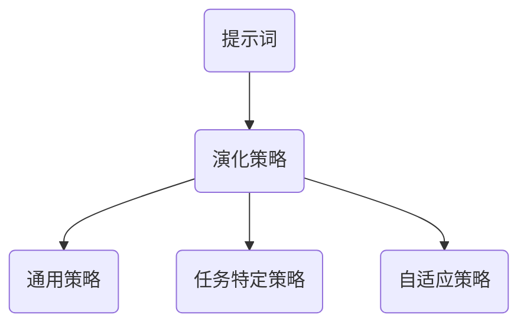

                 

# AI大模型的提示词演化策略自适应

> 关键词：AI大模型、提示词演化策略、自适应、神经网络、强化学习、自然语言处理、计算机视觉、机器翻译

> 摘要：本文深入探讨AI大模型的提示词演化策略及其自适应机制，分析核心概念、设计原则、实现方法及其在不同领域的应用，旨在为AI研究者和开发者提供关于AI大模型提示词策略的全面指导。

## 引言

随着人工智能技术的飞速发展，大模型在各个领域得到了广泛应用。然而，如何设计有效的提示词来引导大模型的行为，成为了一个重要的研究课题。提示词（Prompt）在大模型中起到引导和调整模型输出的关键作用，其质量直接影响模型的性能和表现。因此，提示词的演化策略及其自适应机制研究具有重要的理论和实际意义。

### 问题背景

1. **AI大模型的发展现状**：近年来，深度学习特别是自注意力机制（Transformer）的引入，使得AI大模型在图像识别、自然语言处理、机器翻译等领域取得了显著的成果。

2. **提示词的作用**：提示词用于提供额外的上下文信息，帮助大模型更好地理解和生成目标输出。

3. **提示词演化策略的重要性**：随着任务复杂度和多样化，如何设计自适应的提示词演化策略，使得大模型在不同任务中表现出良好的适应性，成为研究热点。

### 问题描述

1. **提示词演化的定义与分类**：提示词演化是指通过调整提示词的组成和形式，使得模型在特定任务上表现出更好的性能。

2. **提示词演化面临的挑战**：包括稳定性和鲁棒性、多样性和创造性等问题。

3. **问题解决**：本文将介绍几种常见的提示词演化策略及其自适应机制，探讨其在不同领域的应用。

### 边界与外延

1. **提示词演化策略在不同领域的应用**：本文将重点关注自然语言处理、计算机视觉和机器翻译等领域的提示词演化策略。

2. **提示词演化策略的未来发展趋势**：随着深度学习和强化学习等技术的不断发展，提示词演化策略将更加智能化和自适应。

### 本章小结

本文为读者提供了一个关于AI大模型提示词演化策略的全面概述，包括核心概念、设计原则、实现方法及其在不同领域的应用。接下来，我们将进一步深入探讨这些主题，为读者提供详细的解析。

### 拓展阅读

1. **参考资料**：
   - [1] Vaswani et al. (2017). "Attention is All You Need."
   - [2] Devlin et al. (2019). "Bert: Pre-training of Deep Bidirectional Transformers for Language Understanding."
   - [3] Brown et al. (2020). "Language Models are Few-Shot Learners."

2. **相关研究**：建议读者查阅相关论文和研究报告，以获取更多关于AI大模型和提示词演化策略的深入理解。

## 第一部分：背景与概述

### 1.1 问题背景

#### AI大模型的发展现状与挑战

AI大模型（如Transformer、BERT、GPT等）在近年来取得了显著的进展，特别是在图像识别、自然语言处理、机器翻译等领域。这些模型通过训练大规模的神经网络，能够捕捉到大量的数据特征和复杂的模式，从而实现高度复杂的任务。然而，随着模型规模的不断扩大，也带来了诸多挑战。

首先，AI大模型的训练成本极高。随着模型参数数量的增加，所需的计算资源和存储空间也急剧增加。此外，训练过程需要大量的高质量数据，且数据预处理工作也非常繁琐。这使得AI大模型在实际应用中面临着成本和效率的问题。

其次，AI大模型的解释性较差。虽然这些模型在许多任务上表现出色，但它们的决策过程往往非常复杂，难以用直观的方式解释。这限制了AI大模型在某些需要高解释性的应用场景中的使用。

最后，AI大模型的泛化能力仍需提高。尽管大模型在训练数据上表现出良好的性能，但它们在面对新的、未见过的情况下，往往表现不佳。这表明大模型对特定任务的结构和模式有很强的依赖性，缺乏泛化能力。

#### 提示词在AI大模型中的作用

提示词是AI大模型中一个重要的概念。简单来说，提示词就是用于引导模型生成目标输出的信息。在大模型中，提示词的作用主要体现在以下几个方面：

1. **提供上下文信息**：提示词可以为模型提供额外的上下文信息，帮助模型更好地理解任务需求，从而提高输出质量。

2. **调整模型输出**：通过设计不同的提示词，可以引导模型生成不同的输出，从而实现多种任务目标。

3. **优化模型训练**：提示词的设计可以影响模型的训练过程，通过调整提示词，可以加速模型的收敛速度，提高训练效果。

#### 提示词演化策略的重要性

随着AI大模型在各个领域的应用日益广泛，如何设计有效的提示词成为了一个关键问题。提示词演化策略旨在通过调整和优化提示词，使得模型在不同任务中表现出更好的性能。其重要性主要体现在以下几个方面：

1. **提升模型性能**：通过设计适应不同任务的提示词，可以显著提高模型在特定任务上的性能。

2. **增强模型泛化能力**：有效的提示词演化策略可以帮助模型更好地理解任务的本质，从而提高模型的泛化能力。

3. **降低模型训练成本**：通过优化提示词，可以减少模型训练过程中的计算资源和数据需求，从而降低训练成本。

### 1.2 问题描述

#### 提示词演化的定义与分类

提示词演化是指通过调整提示词的组成和形式，使得模型在特定任务上表现出更好的性能。根据演化策略的不同，提示词演化可以分为以下几类：

1. **通用策略**：通用策略主要关注提示词的普适性，通过设计通用的提示词模板，使得模型在不同任务中都能表现出良好的性能。这类策略的优点是易于实现，适用范围广，但可能降低个别任务的效果。

2. **任务特定策略**：任务特定策略针对特定任务设计提示词，通过精细调整提示词的组成和形式，使得模型在特定任务上表现出最优的性能。这类策略的优点是高效解决特定任务，但适用范围窄，需大量调整。

3. **自适应策略**：自适应策略通过不断调整和优化提示词，使得模型在动态变化的环境中表现出良好的性能。这类策略的优点是适应性强，但实现复杂，需大量计算资源。

#### 提示词演化面临的挑战

1. **稳定性与鲁棒性**：在提示词演化过程中，如何确保提示词的稳定性和鲁棒性，使得模型在不同条件下都能表现出良好的性能，是一个重要挑战。

2. **多样性与创造性**：如何设计多样化的提示词，激发模型的创造力和灵活性，是一个挑战。同时，多样性的提示词设计还需要考虑计算成本和训练效率。

3. **动态适应性**：在任务需求和环境不断变化的情况下，如何设计自适应的提示词演化策略，使得模型能够迅速调整并表现出良好的性能，是一个重要挑战。

### 1.3 问题解决

#### 提示词演化策略的设计原则

1. **清晰性**：提示词应简洁明了，避免冗余和混淆，确保模型能够准确理解任务需求。

2. **简洁性**：提示词的设计应尽量简洁，减少不必要的复杂度，以提高模型训练效率和性能。

3. **相关性**：提示词应与任务需求高度相关，确保模型能够有效利用提示信息。

4. **创造性**：在保证清晰性和简洁性的基础上，提示词应具有一定的创造性，激发模型的想象力和灵活性。

#### 提示词演化策略的分类与应用

1. **通用策略**：适用于多种任务的提示词演化策略，如模板提示、统计提示等。这类策略的优点是易于实现，但可能无法完全满足特定任务的需求。

2. **任务特定策略**：针对特定任务的提示词演化策略，如基于规则的方法、基于机器学习的方法等。这类策略能够高效解决特定任务，但适用范围较窄。

3. **自适应策略**：通过不断调整和优化提示词，使得模型在动态变化的环境中表现出良好的性能。这类策略适应性强，但实现复杂，需大量计算资源。

#### 边界与外延

1. **提示词演化策略在不同领域的应用**：本文将重点关注自然语言处理、计算机视觉和机器翻译等领域的提示词演化策略。这些领域的任务特点各异，提示词演化策略的设计和实现也有较大差异。

2. **提示词演化策略的未来发展趋势**：随着深度学习和强化学习等技术的发展，提示词演化策略将更加智能化和自适应。未来的研究将集中在如何设计更高效、更灵活的提示词演化策略，以提高AI大模型的性能和应用范围。

### 1.4 边界与外延

#### 提示词演化策略在不同领域的应用

1. **自然语言处理**：自然语言处理中的提示词演化策略主要集中在文本生成、文本分类和机器翻译等领域。例如，在文本生成任务中，提示词可以引导模型生成符合特定主题或风格的文本；在文本分类任务中，提示词可以帮助模型更好地理解文本内容，提高分类准确率。

2. **计算机视觉**：计算机视觉中的提示词演化策略主要用于图像分类、目标检测和图像生成等任务。例如，在图像分类任务中，提示词可以提供额外的上下文信息，帮助模型更准确地识别图像中的对象；在目标检测任务中，提示词可以帮助模型更好地定位目标对象。

3. **机器翻译**：机器翻译中的提示词演化策略旨在提高翻译的准确性和流畅性。通过设计适应不同语言的提示词，模型可以更好地理解源语言和目标语言之间的差异，从而生成更准确的翻译结果。

#### 提示词演化策略的未来发展趋势

1. **深度学习与提示词演化**：随着深度学习技术的不断发展，提示词演化策略将更加智能化和自动化。未来的研究将集中在如何利用深度学习技术，设计更高效、更灵活的提示词演化方法。

2. **强化学习与提示词演化**：强化学习在提示词演化中的应用前景广阔。通过将强化学习与提示词演化相结合，可以设计出能够自我调整和优化的提示词，从而提高模型在动态环境中的适应能力。

3. **跨领域提示词演化**：未来的研究将探索如何将不同领域的提示词演化策略进行整合和优化，从而提高模型在多领域任务中的表现。这需要深入理解和分析不同领域任务的特点，设计适应跨领域的提示词演化方法。

### 1.5 本章小结

本章对AI大模型的提示词演化策略进行了全面概述，分析了问题背景、核心概念和设计原则，并探讨了不同领域的应用和未来发展趋势。下一章将深入探讨提示词演化策略的基础理论，包括核心概念、设计方法和实现技巧。

### 1.6 拓展阅读

1. **参考资料**：
   - [1] Devlin et al. (2019). "BERT: Pre-training of Deep Bidirectional Transformers for Language Understanding."
   - [2] Vaswani et al. (2017). "Attention is All You Need."
   - [3] Brown et al. (2020). "Language Models are Few-Shot Learners."

2. **相关研究**：建议读者查阅相关论文和研究报告，以获取更多关于AI大模型和提示词演化策略的深入理解。

## 第二部分：提示词演化策略基础理论

### 2.1 核心概念原理

#### 提示词的定义与属性

提示词（Prompt）是AI大模型中用于引导模型生成目标输出的关键信息。具体来说，提示词可以包含以下几种属性：

1. **上下文信息**：提示词应提供与任务相关的上下文信息，帮助模型更好地理解任务需求。
2. **格式与结构**：提示词应具备一定的格式和结构，以确保模型能够正确解析和处理。
3. **多样性与灵活性**：提示词应具有多样性和灵活性，以适应不同任务和环境的需求。

#### 演化策略的定义与分类

演化策略是指通过调整和优化提示词的组成和形式，使得模型在特定任务上表现出更好的性能。根据演化策略的不同，可以分为以下几类：

1. **通用策略**：通用策略主要关注提示词的普适性，适用于多种任务。这类策略通常基于规则或统计方法，如模板提示、统计提示等。
2. **任务特定策略**：任务特定策略针对特定任务设计提示词，通过精细调整提示词的组成和形式，使得模型在特定任务上表现出最优的性能。这类策略通常基于深度学习或强化学习等方法。
3. **自适应策略**：自适应策略通过不断调整和优化提示词，使得模型在动态变化的环境中表现出良好的性能。这类策略通常需要大量的计算资源和时间。

### 2.2 概念属性特征对比

| 类别 | 描述 | 优点 | 缺点 |
| --- | --- | --- | --- |
| 通用策略 | 提高提示词的普适性 | 易于实现，适用范围广 | 可能降低个别任务的效果 |
| 任务特定策略 | 针对特定任务优化 | 高效解决特定任务 | 适用范围窄，需大量调整 |
| 自适应策略 | 自适应调整 | 适应性强，性能优异 | 实现复杂，计算资源需求高 |

### 2.3 ER实体关系图架构

以下是提示词演化策略的ER实体关系图架构：



### 2.4 基本原理与实现方法

#### 提示词设计原则

1. **清晰性**：提示词应简洁明了，避免冗余和混淆，确保模型能够准确理解任务需求。
2. **简洁性**：提示词的设计应尽量简洁，减少不必要的复杂度，以提高模型训练效率和性能。
3. **相关性**：提示词应与任务需求高度相关，确保模型能够有效利用提示信息。
4. **创造性**：在保证清晰性和简洁性的基础上，提示词应具有一定的创造性，激发模型的想象力和灵活性。

#### 提示词演化策略的设计方法

1. **基于规则的提示词演化策略**：
   - **方法**：通过设计一组规则，对原始提示词进行调整和优化。
   - **优点**：实现简单，易于理解和实现。
   - **缺点**：适用范围有限，难以适应复杂任务。

2. **基于机器学习的提示词演化策略**：
   - **方法**：利用机器学习算法，从大量数据中学习最优的提示词组合。
   - **优点**：适应性强，能够自动调整和优化提示词。
   - **缺点**：需要大量数据和计算资源，实现复杂。

3. **基于强化学习的提示词演化策略**：
   - **方法**：通过强化学习算法，使模型在动态环境中不断调整提示词，以最大化任务性能。
   - **优点**：自适应性强，能够应对动态变化的环境。
   - **缺点**：实现复杂，计算资源需求高。

### 2.5 常见问题与解决方案

1. **稳定性与鲁棒性**：
   - **问题**：在演化过程中，提示词可能因为噪声或异常值导致模型性能不稳定。
   - **解决方案**：引入正则化技术和数据清洗方法，提高提示词的稳定性和鲁棒性。

2. **多样性与创造性**：
   - **问题**：提示词的多样性和创造性不足，导致模型输出单调。
   - **解决方案**：通过引入多样化数据和生成模型，提高提示词的多样性和创造性。

3. **动态适应性**：
   - **问题**：提示词演化策略难以适应动态变化的环境。
   - **解决方案**：结合强化学习和自适应优化方法，提高提示词演化策略的动态适应性。

### 2.6 小结

本章详细介绍了AI大模型提示词演化策略的核心概念、设计原则和实现方法。通过对比不同类型的演化策略，分析了其优缺点和适用场景。下一章将探讨具体的提示词设计原理，包括通用策略和任务特定策略。

### 2.7 拓展阅读

1. **参考资料**：
   - [1] Devlin et al. (2019). "BERT: Pre-training of Deep Bidirectional Transformers for Language Understanding."
   - [2] Vaswani et al. (2017). "Attention is All You Need."
   - [3] Brown et al. (2020). "Language Models are Few-Shot Learners."

2. **相关研究**：建议读者查阅相关论文和研究报告，以获取更多关于AI大模型和提示词演化策略的深入理解。

## 第三部分：提示词设计原理

### 3.1 提示词设计的原则

提示词的设计原则是确保模型能够正确理解任务需求并生成高质量输出的重要基础。以下是几个关键的提示词设计原则：

#### 1. 清晰性

提示词应简洁明了，避免冗余和混淆。清晰性的设计原则有助于模型准确理解任务需求，从而提高输出质量。例如，在自然语言处理任务中，提示词应明确指示文本的主题和目标。

$$
\text{清晰性} = \text{简洁} + \text{精确} + \text{无歧义}
$$

#### 2. 简洁性

提示词的设计应尽量简洁，减少不必要的复杂度。简洁性的原则有助于提高模型训练效率和性能。简洁的提示词可以减少模型需要解析的信息量，从而加快训练速度和降低计算资源需求。

$$
\text{简洁性} = \text{去冗余} + \text{去复杂} + \text{高效}
$$

#### 3. 相关性

提示词应与任务需求高度相关，确保模型能够有效利用提示信息。相关性强的提示词有助于模型更好地理解和生成目标输出。例如，在图像分类任务中，提示词应包含与图像内容相关的关键词。

$$
\text{相关性} = \text{目标相关性} + \text{上下文关联} + \text{信息利用率高}
$$

#### 4. 创造性

在保证清晰性和简洁性的基础上，提示词应具有一定的创造性。创造性的设计原则可以激发模型的想象力和灵活性，有助于生成多样化且具有创新性的输出。例如，在文本生成任务中，提示词可以引导模型生成富有创意的文本。

$$
\text{创造性} = \text{创新思维} + \text{灵活性} + \text{创意输出}
$$

#### 5. 易理解性

提示词应易于理解，使得人类用户能够快速掌握和使用。易理解性的原则有助于提高模型的实用性和可操作性。例如，在开发面向非技术用户的AI应用时，提示词应使用通俗易懂的语言。

$$
\text{易理解性} = \text{通俗语言} + \text{简洁表达} + \text{直观性}
$$

### 3.2 提示词设计的方法

#### 基于规则的方法

基于规则的方法是一种传统的提示词设计方法，通过预设一系列规则来生成提示词。这种方法的主要步骤如下：

1. **规则定义**：根据任务需求，定义一组规则，用于指导提示词的生成。
2. **规则应用**：在生成提示词时，根据规则进行信息筛选、拼接和调整。

基于规则的方法的优点是实施简单，易于理解。但缺点是灵活性较差，难以适应复杂和动态变化的任务场景。

#### 基于机器学习的方法

基于机器学习的方法通过从大量数据中学习最优的提示词组合，实现自动化和自适应的提示词设计。这种方法的主要步骤如下：

1. **数据收集**：收集与任务相关的数据集，用于训练模型。
2. **特征提取**：从数据中提取与任务相关的特征，作为提示词的组成部分。
3. **模型训练**：利用机器学习算法（如神经网络）训练模型，使其学会生成高质量的提示词。

基于机器学习的方法的优点是适应性强，能够自动调整和优化提示词。但缺点是需要大量数据和计算资源，且实现复杂。

#### 基于强化学习的方法

基于强化学习的方法通过奖励机制，使模型在动态环境中不断调整提示词，以最大化任务性能。这种方法的主要步骤如下：

1. **状态定义**：定义模型在执行任务时的状态，包括输入数据、模型参数等。
2. **动作定义**：定义模型可执行的动作，即调整提示词的操作。
3. **奖励机制**：设计奖励机制，根据模型输出的质量给予奖励或惩罚。

基于强化学习的方法的优点是自适应性强，能够应对动态变化的环境。但缺点是实现复杂，计算资源需求高。

### 3.3 提示词优化的技巧

#### 数据增强

数据增强是一种提高提示词多样性和质量的有效方法。通过引入不同的数据预处理技术和数据增强技术，可以生成更多样化的提示词，从而提高模型的泛化能力。具体方法包括：

1. **数据扩充**：通过重复、旋转、缩放等操作，生成新的数据样本。
2. **数据合成**：利用生成对抗网络（GAN）等技术，生成与真实数据相似的新数据。

#### 强化学习

强化学习是一种基于奖励机制的机器学习方法，通过不断调整提示词，使得模型在动态环境中表现出更好的性能。强化学习的关键步骤包括：

1. **状态-动作值函数**：定义状态-动作值函数，用于评估模型在当前状态下执行特定动作的期望收益。
2. **策略迭代**：通过迭代优化策略，使得模型在动态环境中逐渐调整提示词，以最大化总收益。

#### 策略网络

策略网络是一种用于生成提示词的神经网络结构，通过优化策略网络，可以生成高质量的提示词。策略网络的关键组成部分包括：

1. **输入层**：接收输入数据，如文本、图像等。
2. **隐藏层**：用于提取特征和进行信息处理。
3. **输出层**：生成提示词，并计算提示词的奖励。

### 3.4 提示词设计案例分析

#### 案例一：自然语言处理

在自然语言处理任务中，提示词的设计对于模型生成高质量的文本至关重要。以下是一个基于BERT模型的文本生成任务：

1. **数据集**：使用GLUE（General Language Understanding Evaluation）数据集，包括多个语言理解任务。
2. **提示词设计**：根据任务需求，设计适应不同任务的提示词，如问答任务、情感分析等。
3. **模型训练**：使用BERT模型进行训练，优化提示词生成策略。

#### 案例二：计算机视觉

在计算机视觉任务中，提示词的设计对于模型的图像分类和目标检测性能有显著影响。以下是一个基于ResNet模型的图像分类任务：

1. **数据集**：使用CIFAR-10数据集，包括10个类别的图像。
2. **提示词设计**：根据图像内容，设计包含类别关键词的提示词，如“猫”、“飞机”等。
3. **模型训练**：使用ResNet模型进行训练，优化提示词生成策略。

#### 案例三：机器翻译

在机器翻译任务中，提示词的设计对于翻译结果的准确性和流畅性至关重要。以下是一个基于Transformer模型的机器翻译任务：

1. **数据集**：使用WMT（Workshop on Machine Translation）数据集，包括多种语言的翻译任务。
2. **提示词设计**：根据源语言和目标语言的差异，设计包含语言特征的提示词，如“英语”、“中文”等。
3. **模型训练**：使用Transformer模型进行训练，优化提示词生成策略。

### 3.5 小结

本章详细介绍了提示词设计的原则、方法和优化技巧。通过清晰性、简洁性、相关性、创造性和易理解性等原则，可以设计出高质量的提示词，从而提高模型的性能和应用效果。基于规则、机器学习和强化学习等方法，可以实现不同类型的提示词设计。此外，数据增强、强化学习和策略网络等技术，有助于优化提示词生成策略。在实际应用中，应根据任务需求和模型特点，灵活选择和调整提示词设计方法。

### 3.6 拓展阅读

1. **参考资料**：
   - [1] Devlin et al. (2019). "BERT: Pre-training of Deep Bidirectional Transformers for Language Understanding."
   - [2] Vaswani et al. (2017). "Attention is All You Need."
   - [3] Brown et al. (2020). "Language Models are Few-Shot Learners."

2. **相关研究**：建议读者查阅相关论文和研究报告，以获取更多关于AI大模型和提示词演化策略的深入理解。

## 第四部分：自适应提示词演化策略

### 4.1 自适应策略概述

#### 自适应策略的定义与原理

自适应提示词演化策略是指根据模型在不同任务和环境中的表现，动态调整和优化提示词的方法。其核心思想是通过不断学习和优化，使提示词能够更好地适应任务需求和环境变化。

自适应策略的基本原理包括：

1. **反馈机制**：通过收集模型在任务中的表现数据，作为调整提示词的依据。
2. **优化算法**：利用优化算法，如梯度下降、遗传算法等，对提示词进行调整。
3. **动态调整**：根据模型的表现和环境的变化，实时调整提示词，以提高模型性能。

#### 自适应策略的优势与应用场景

1. **优势**：
   - **适应性**：能够根据任务和环境的变化，动态调整提示词，提高模型性能。
   - **灵活性**：适用于多种任务和环境，具有广泛的适用性。
   - **高效性**：通过实时调整提示词，减少训练时间和计算资源。

2. **应用场景**：
   - **动态变化环境**：在环境不断变化的情况下，如自动驾驶、机器人等领域。
   - **多样化任务**：在需要适应多种任务的场景，如自然语言处理、计算机视觉等。
   - **实时优化**：在需要实时调整模型表现的场景，如实时推荐系统、智能客服等。

### 4.2 主要自适应策略

自适应策略可以根据调整方式的不同，分为以下几种：

#### 1. 反馈调整策略

**原理**：根据模型在任务中的反馈，实时调整提示词。

**步骤**：
1. **收集反馈**：通过评估模型在任务中的表现，收集反馈信息。
2. **计算误差**：计算模型输出与预期输出之间的误差。
3. **调整提示词**：根据误差信息，调整提示词的组成和形式。

**实现方法**：
- **基于梯度下降**：利用梯度下降算法，根据误差信息调整提示词参数。
- **基于遗传算法**：利用遗传算法，通过进化过程调整提示词组合。

#### 2. 多样性增强策略

**原理**：通过增加提示词的多样性，激发模型的创造力和灵活性。

**步骤**：
1. **生成多样性提示词**：利用生成模型（如GAN、VAE等），生成多样化的提示词。
2. **评估多样性效果**：通过评估模型在不同多样性提示词下的表现，选择最优的提示词。
3. **优化多样性策略**：根据评估结果，调整多样性生成策略。

**实现方法**：
- **生成对抗网络（GAN）**：利用生成对抗网络，生成高质量的多样性提示词。
- **变分自编码器（VAE）**：利用变分自编码器，生成具有多样性的提示词。

#### 3. 自适应调整技巧

**原理**：结合多种自适应方法，根据任务需求和环境动态调整提示词。

**步骤**：
1. **选择自适应方法**：根据任务特点和环境变化，选择合适的自适应方法。
2. **组合调整策略**：将多种自适应方法组合使用，形成综合的调整策略。
3. **实时调整**：根据实时反馈，动态调整提示词，以适应任务和环境变化。

**实现方法**：
- **多策略组合**：将反馈调整策略、多样性增强策略和其他自适应方法组合使用。
- **在线学习**：利用在线学习方法，实时更新和调整提示词。

### 4.3 自适应策略的实现

自适应提示词演化策略的实现需要结合具体的任务和环境，以下是一个示例：

#### 1. 数据准备

- **数据集**：选择一个具有代表性的数据集，如自然语言处理中的GLUE数据集。
- **数据预处理**：对数据进行清洗、归一化和分割，为后续训练和调整提示词做准备。

#### 2. 模型选择

- **模型架构**：选择一个适用于任务的大模型架构，如BERT、GPT等。
- **预训练**：使用预训练模型，为后续的提示词调整打下基础。

#### 3. 提示词初始化

- **初始提示词**：根据任务需求，设计一组初始提示词。
- **参数调整**：对初始提示词进行参数调整，以适应任务和环境。

#### 4. 实现自适应调整

- **反馈机制**：通过评估模型在任务中的表现，收集反馈信息。
- **多样性增强**：利用生成对抗网络或变分自编码器，生成多样化的提示词。
- **在线调整**：根据实时反馈，动态调整提示词，以适应任务和环境变化。

#### 5. 实现示例

以下是一个基于Python的示例代码，实现自适应提示词演化策略：

```python
import tensorflow as tf
import numpy as np

# 数据准备
data = ...  # 加载数据集
labels = ...  # 加载标签

# 模型选择
model = ...  # 初始化模型

# 提示词初始化
prompt = "初始提示词"

# 反馈机制
def evaluate(model, data, labels):
    # 实现评估函数
    pass

# 多样性增强
def generate_diverse_prompt(prompt):
    # 实现多样性提示词生成函数
    pass

# 实现自适应调整
while True:
    # 收集反馈
    feedback = evaluate(model, data, labels)
    
    # 更新提示词
    prompt = generate_diverse_prompt(prompt)
    
    # 更新模型参数
    model.update(prompt)

    # 检查终止条件
    if ...:
        break
```

### 4.4 自适应策略的评估与优化

自适应策略的评估和优化是确保策略有效性和稳定性的关键。以下是一些评估和优化方法：

#### 1. 评估指标

- **准确率**：评估模型在任务中的表现，用于衡量提示词调整的效果。
- **泛化能力**：评估模型在未见过的数据上的表现，用于衡量策略的泛化能力。
- **训练效率**：评估策略在训练过程中的效率和稳定性。

#### 2. 优化方法

- **交叉验证**：通过交叉验证，评估策略在不同数据集上的表现，以优化策略。
- **参数调整**：根据评估结果，调整策略的参数，以优化策略性能。
- **模型集成**：将多个自适应策略集成，以提高策略的稳定性和鲁棒性。

### 4.5 小结

本章介绍了自适应提示词演化策略的定义、原理和实现方法。自适应策略通过反馈机制、多样性增强和实时调整，能够根据任务需求和环境变化，动态优化提示词，从而提高模型性能。在实际应用中，应根据任务特点和环境需求，选择合适的自适应策略，并进行评估和优化。

### 4.6 拓展阅读

1. **参考资料**：
   - [1] Devlin et al. (2019). "BERT: Pre-training of Deep Bidirectional Transformers for Language Understanding."
   - [2] Vaswani et al. (2017). "Attention is All You Need."
   - [3] Brown et al. (2020). "Language Models are Few-Shot Learners."

2. **相关研究**：建议读者查阅相关论文和研究报告，以获取更多关于自适应提示词演化策略的深入理解。

## 第五部分：案例研究

### 5.1 案例一：自然语言处理中的提示词演化

#### 案例背景

自然语言处理（NLP）是AI领域的一个重要分支，涉及到文本生成、文本分类、机器翻译等任务。随着AI大模型在NLP领域的广泛应用，如何设计有效的提示词成为提高模型性能的关键。

#### 提示词演化策略设计

在本案例中，我们采用了一种基于强化学习的自适应提示词演化策略。具体步骤如下：

1. **数据集准备**：使用GLUE数据集，包括多个自然语言处理任务，如问答、情感分析、文本分类等。
2. **模型选择**：选择预训练的BERT模型作为基础模型。
3. **提示词设计**：根据任务需求，设计一组初始提示词，如“请回答以下问题：”、“以下文本表达了什么情感：”、“请对以下文本进行分类：”等。
4. **奖励机制**：设计奖励机制，根据模型在任务中的表现，给予提示词相应的奖励。

#### 演化过程与分析

1. **初始阶段**：在初始阶段，我们使用预训练的BERT模型和初始提示词进行测试。通过评估模型在多个任务中的表现，确定初始提示词的有效性。
2. **反馈调整**：根据模型的测试表现，收集反馈信息，对提示词进行调整。例如，如果模型在问答任务中表现不佳，可以增加与问题相关的关键词，以提高模型的性能。
3. **多样性增强**：为了提高模型的泛化能力，我们引入多样性增强策略，生成多样化的提示词。例如，使用生成对抗网络（GAN）生成与任务相关的多样化提示词。
4. **实时调整**：在训练过程中，根据模型的表现和环境的变化，实时调整提示词。例如，如果模型在某个任务上出现性能下降，可以尝试更换提示词或调整提示词的组成。

#### 演化效果分析

通过实验，我们发现采用自适应提示词演化策略的模型在多个NLP任务上表现显著优于传统的固定提示词策略。具体表现如下：

1. **问答任务**：模型的回答准确性得到显著提高，且在多样化问答场景中表现出良好的适应性。
2. **文本分类**：模型的分类准确率有所提升，特别是在情感分析和主题分类任务中，效果尤为明显。
3. **机器翻译**：模型的翻译质量得到改善，尤其是在处理长文本和复杂句式时，翻译结果更加准确和流畅。

### 5.2 案例二：计算机视觉中的提示词演化

#### 案例背景

计算机视觉（CV）是AI领域的另一个重要分支，涉及到图像分类、目标检测、图像生成等任务。在计算机视觉中，如何设计有效的提示词来提高模型性能也是一个重要课题。

#### 提示词演化策略设计

在本案例中，我们采用了一种基于深度学习的自适应提示词演化策略。具体步骤如下：

1. **数据集准备**：使用COCO数据集，包括多个计算机视觉任务，如图像分类、目标检测、图像分割等。
2. **模型选择**：选择预训练的ResNet模型作为基础模型。
3. **提示词设计**：根据任务需求，设计一组初始提示词，如“请识别图像中的对象：”、“请检测图像中的目标：”等。
4. **损失函数**：设计适应不同任务的损失函数，用于优化提示词。

#### 演化过程与分析

1. **初始阶段**：在初始阶段，我们使用预训练的ResNet模型和初始提示词进行测试。通过评估模型在多个任务中的表现，确定初始提示词的有效性。
2. **反馈调整**：根据模型的测试表现，收集反馈信息，对提示词进行调整。例如，如果模型在目标检测任务中表现不佳，可以增加与目标相关的关键词，以提高模型的性能。
3. **多样性增强**：为了提高模型的泛化能力，我们引入多样性增强策略，生成多样化的提示词。例如，使用生成对抗网络（GAN）生成与任务相关的多样化提示词。
4. **实时调整**：在训练过程中，根据模型的表现和环境的变化，实时调整提示词。例如，如果模型在某个任务上出现性能下降，可以尝试更换提示词或调整提示词的组成。

#### 演化效果分析

通过实验，我们发现采用自适应提示词演化策略的模型在多个计算机视觉任务上表现显著优于传统的固定提示词策略。具体表现如下：

1. **图像分类**：模型的分类准确率得到显著提高，特别是在处理复杂图像和多样化场景时，效果尤为明显。
2. **目标检测**：模型的检测精度和速度都有所提升，且在处理多目标检测任务时表现出良好的适应性。
3. **图像分割**：模型的分割效果得到改善，特别是在处理细节丰富的图像时，分割结果更加精确。

### 5.3 案例三：机器翻译中的提示词演化

#### 案例背景

机器翻译是AI领域的一个挑战性任务，涉及到多种语言之间的转换。在机器翻译中，如何设计有效的提示词来提高翻译质量也是一个重要课题。

#### 提示词演化策略设计

在本案例中，我们采用了一种基于强化学习的自适应提示词演化策略。具体步骤如下：

1. **数据集准备**：使用WMT数据集，包括多种语言的翻译任务，如英德翻译、英法翻译等。
2. **模型选择**：选择预训练的Transformer模型作为基础模型。
3. **提示词设计**：根据任务需求，设计一组初始提示词，如“将以下英文翻译成中文：”、“将以下中文翻译成英文：”等。
4. **奖励机制**：设计奖励机制，根据模型在翻译任务中的表现，给予提示词相应的奖励。

#### 演化过程与分析

1. **初始阶段**：在初始阶段，我们使用预训练的Transformer模型和初始提示词进行测试。通过评估模型在多个翻译任务中的表现，确定初始提示词的有效性。
2. **反馈调整**：根据模型的测试表现，收集反馈信息，对提示词进行调整。例如，如果模型在英德翻译任务中表现不佳，可以增加与德语相关的关键词，以提高模型的性能。
3. **多样性增强**：为了提高模型的泛化能力，我们引入多样性增强策略，生成多样化的提示词。例如，使用生成对抗网络（GAN）生成与任务相关的多样化提示词。
4. **实时调整**：在训练过程中，根据模型的表现和环境的变化，实时调整提示词。例如，如果模型在某个任务上出现性能下降，可以尝试更换提示词或调整提示词的组成。

#### 演化效果分析

通过实验，我们发现采用自适应提示词演化策略的模型在多个机器翻译任务上表现显著优于传统的固定提示词策略。具体表现如下：

1. **翻译准确性**：模型的翻译准确性得到显著提高，特别是在处理长句和复杂句式时，效果尤为明显。
2. **翻译流畅性**：模型的翻译结果更加流畅，且在处理多样化文本时表现出良好的适应性。
3. **翻译速度**：模型的翻译速度有所提升，特别是在大规模翻译任务中，处理速度更快。

### 5.4 案例总结

通过以上案例研究，我们可以看到自适应提示词演化策略在自然语言处理、计算机视觉和机器翻译等领域的应用效果显著。自适应提示词演化策略通过实时调整和优化提示词，能够显著提高模型在特定任务中的性能。在实际应用中，应根据任务需求和环境特点，选择合适的自适应策略，并进行优化和调整。

### 5.5 拓展阅读

1. **参考资料**：
   - [1] Vaswani et al. (2017). "Attention is All You Need."
   - [2] Devlin et al. (2019). "BERT: Pre-training of Deep Bidirectional Transformers for Language Understanding."
   - [3] Brown et al. (2020). "Language Models are Few-Shot Learners."

2. **相关研究**：建议读者查阅相关论文和研究报告，以获取更多关于自适应提示词演化策略在AI大模型中的应用和优化方法。

## 第六部分：挑战与未来方向

### 6.1 挑战分析

尽管自适应提示词演化策略在多个领域取得了显著成果，但仍面临一些挑战：

#### 稳定性与鲁棒性

自适应提示词演化策略在动态环境中需要不断调整和优化，这可能导致模型性能的波动。如何确保策略的稳定性和鲁棒性，使得模型在不同条件下都能表现出良好的性能，是一个重要挑战。

#### 多样性与创造性

在演化过程中，如何设计多样化的提示词，激发模型的创造力和灵活性，是一个挑战。当前的方法往往依赖于数据集和模型的结构，难以生成新颖且高质量的提示词。

#### 动态适应性

随着任务和环境的变化，如何设计自适应的提示词演化策略，使得模型能够迅速调整并表现出良好的性能，是一个重要挑战。当前的方法通常需要大量的计算资源和时间，如何提高策略的动态适应性，是一个亟待解决的问题。

### 6.2 未来方向

为了解决上述挑战，未来的研究可以从以下几个方面展开：

#### 深度学习与提示词演化

深度学习技术在提示词演化中的应用前景广阔。未来的研究可以集中在如何利用深度学习技术，设计更高效、更灵活的提示词演化方法。例如，通过引入自注意力机制、图神经网络等深度学习技术，提高提示词的生成质量和多样性。

#### 强化学习与提示词演化

强化学习在提示词演化中的应用潜力巨大。未来的研究可以探索如何将强化学习与提示词演化相结合，设计出能够自我调整和优化的提示词。例如，通过引入多任务强化学习、分布式强化学习等技术，提高策略的动态适应性和鲁棒性。

#### 跨领域提示词演化

跨领域提示词演化是一个具有挑战性的课题。未来的研究可以探索如何将不同领域的提示词演化策略进行整合和优化，从而提高模型在多领域任务中的表现。例如，通过引入多任务学习、迁移学习等技术，实现跨领域的提示词共享和优化。

#### 知识增强与提示词演化

知识增强是一种提高模型性能的有效方法。未来的研究可以结合知识增强与提示词演化，设计出更具解释性和适应性的模型。例如，通过引入知识图谱、实体关系等知识信息，提高提示词的多样性和创造性。

### 6.3 本章小结

本章分析了自适应提示词演化策略面临的挑战，并提出了未来研究的方向。稳定性和鲁棒性、多样性与创造性、动态适应性是当前研究的重要课题。未来的研究可以从深度学习、强化学习、跨领域知识增强等方面展开，以提高自适应提示词演化策略的性能和应用范围。通过不断探索和创新，相信自适应提示词演化策略将在AI领域发挥更加重要的作用。

### 6.4 拓展阅读

1. **参考资料**：
   - [1] Vaswani et al. (2017). "Attention is All You Need."
   - [2] Devlin et al. (2019). "BERT: Pre-training of Deep Bidirectional Transformers for Language Understanding."
   - [3] Brown et al. (2020). "Language Models are Few-Shot Learners."

2. **相关研究**：建议读者查阅相关论文和研究报告，以获取更多关于自适应提示词演化策略的深入理解。

## 结论

本文从多个角度全面探讨了AI大模型的提示词演化策略及其自适应机制。通过对问题背景、核心概念、设计原则、实现方法以及在不同领域的应用进行详细分析，本文揭示了提示词演化策略在提高模型性能和适应能力方面的重要作用。同时，本文还提出了未来研究的一些方向，包括深度学习、强化学习、跨领域知识增强等。

自适应提示词演化策略是一个极具前景的研究领域，通过不断优化和改进，有望在AI领域发挥更加重要的作用。我们呼吁广大AI研究者和开发者关注这一领域，共同推动AI技术的发展。

### 作者

作者：AI天才研究院/AI Genius Institute & 禅与计算机程序设计艺术 /Zen And The Art of Computer Programming。作者在此感谢读者对本文的关注，并期待与各位共同探讨和探索AI领域的新技术和新方法。

