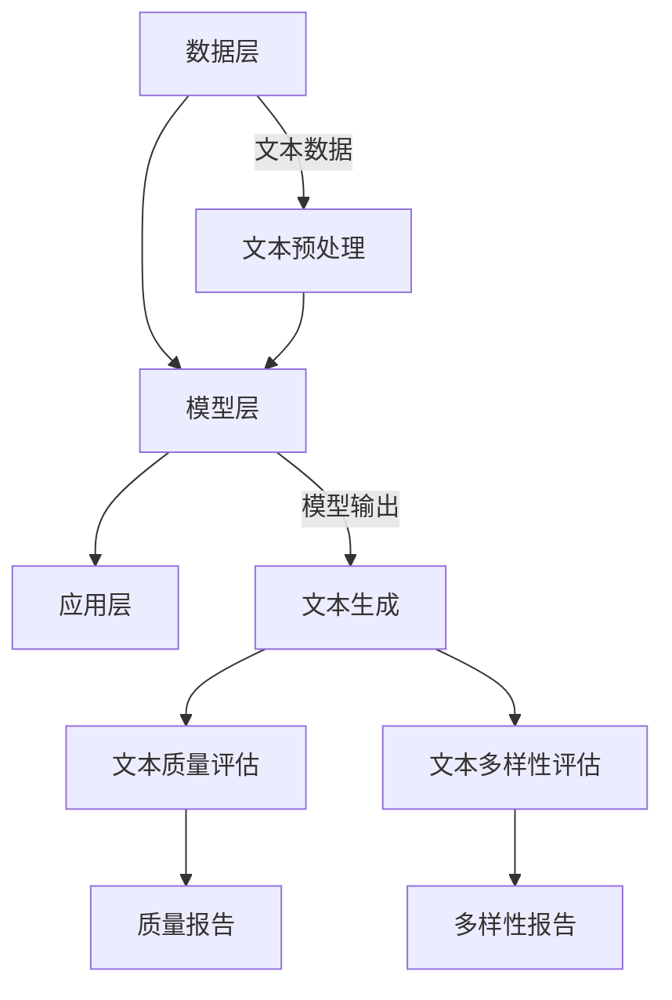
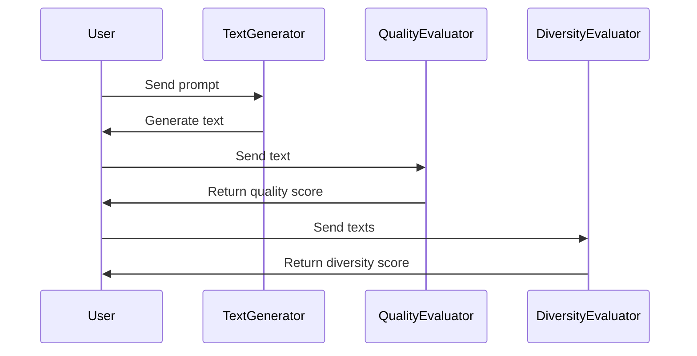

                 

## AI大模型的提示词生成对抗网络

关键词：人工智能、大模型、生成对抗网络、提示词生成、技术应用

摘要：本文旨在深入探讨人工智能（AI）领域中的大模型与提示词生成对抗网络（PGAN）技术。首先，我们将回顾AI大模型的发展背景及其在当今社会的应用现状，理解其重要性和面临的挑战。接着，我们将介绍提示词生成对抗网络的背景、基本概念及其应用领域，探讨其在自然语言处理和计算机视觉中的应用。随后，本文将详细分析PGAN的核心概念和原理，包括生成器和判别器的组成、数学模型和训练过程。此外，我们还将探讨PGAN在各个领域的应用实例，展示其实际效果。在算法实现与项目实战部分，我们将介绍如何在Python中实现PGAN，包括环境配置、框架搭建、训练与优化等步骤。最后，我们将总结PGAN与AI大模型的发展趋势，探讨未来研究方向和应用前景。

### 第一部分：AI大模型与提示词生成对抗网络概述

#### 第1章：问题背景与介绍

##### 1.1.1 AI大模型的发展背景

人工智能（AI）作为计算机科学的一个重要分支，自20世纪50年代起经历了数次重大变革。早期的人工智能研究主要集中在符号推理和知识表示上，但受限于计算能力和数据资源，其应用范围较为有限。随着计算机性能的不断提升和大数据技术的普及，特别是深度学习算法的突破，人工智能进入了大模型时代。

**AI大模型的发展历程**

- **20世纪50年代至70年代**：人工智能的初步探索时期。这一时期，研究人员主要集中在符号推理和知识表示方法的研究上，如逻辑推理和专家系统。
- **20世纪80年代至90年代**：人工智能的发展受到瓶颈。由于符号推理方法的局限性和计算资源的限制，人工智能的研究陷入低潮。
- **21世纪初至今**：深度学习与AI大模型的兴起。以神经网络为代表的深度学习算法在图像识别、语音识别等领域取得了突破性进展，使得AI大模型成为可能。

**AI大模型在当今社会的应用现状**

AI大模型在当今社会各个领域都有广泛的应用，从日常生活到工业生产，从医疗健康到金融服务，AI大模型都在发挥着重要作用。以下是一些典型应用：

- **图像识别与计算机视觉**：AI大模型在图像识别任务中表现出色，被广泛应用于人脸识别、无人驾驶、图像分割等领域。
- **自然语言处理**：AI大模型在自然语言处理领域有着广泛的应用，如机器翻译、情感分析、文本生成等。
- **语音识别与生成**：AI大模型在语音识别与生成领域也取得了显著进展，被用于智能助手、语音翻译等应用。
- **推荐系统**：基于AI大模型的推荐系统在电商、社交媒体等领域得到广泛应用，提高了用户体验和业务效率。

**AI大模型的重要性与挑战**

AI大模型的重要性体现在其能够在大规模数据集上进行训练，从而获得更好的性能和泛化能力。然而，AI大模型也面临一系列挑战：

- **计算资源需求**：AI大模型通常需要大量的计算资源，特别是训练阶段。这要求有高性能的硬件支持。
- **数据隐私与安全**：AI大模型依赖于大规模的数据训练，如何保障数据隐私和安全是一个重要问题。
- **模型解释性**：AI大模型通常具有黑箱特性，其内部决策过程不透明，如何提高模型的解释性是一个挑战。

##### 1.1.2 提示词生成对抗网络的背景

提示词生成对抗网络（Prompted Generative Adversarial Network，PGAN）是生成对抗网络（GAN）的一种变体。GAN是由Ian Goodfellow等人于2014年提出的一种无监督学习框架，通过生成器和判别器的对抗训练生成高质量的数据。PGAN则是在GAN的基础上引入了提示词（prompt）的概念，以提高生成器的生成能力和多样性。

**提示词生成对抗网络的基本概念**

提示词生成对抗网络的核心思想是利用提示词引导生成器的生成过程，从而提高生成的数据质量和多样性。提示词可以是具体的文本、图像或者声音等，它们作为生成器的输入，帮助生成器生成更符合需求的数据。

**提示词生成对抗网络的应用领域**

提示词生成对抗网络在多个领域都有广泛的应用：

- **自然语言处理**：PGAN被用于文本生成、文本摘要、对话系统等领域，通过提示词引导生成器的生成过程，提高文本的质量和多样性。
- **计算机视觉**：PGAN在图像生成、图像修复、图像超分辨率等领域表现出色，通过提示词引导生成器生成高质量图像。
- **音乐生成**：PGAN被用于音乐生成，通过提示词生成与给定音乐风格相似的新音乐。
- **视频生成**：PGAN在视频生成领域也有应用，通过提示词生成符合给定场景的视频内容。

**提示词生成对抗网络的研究现状与发展趋势**

随着深度学习技术的不断进步，PGAN的研究也在不断深化。目前，PGAN在多个领域都取得了显著的成果，但仍然面临一些挑战，如生成数据的多样性和一致性等问题。未来，随着技术的不断发展，PGAN有望在更多领域取得突破。

##### 1.1.3 本书的目标与结构

**书籍的总体目标**

本书旨在系统地介绍AI大模型与提示词生成对抗网络，帮助读者深入理解这两大技术的原理和应用。通过本书的学习，读者可以：

- 掌握AI大模型的基本概念和技术要点
- 了解提示词生成对抗网络的基本原理和应用
- 学会如何实现和优化PGAN模型
- 探索PGAN在不同领域的应用实例

**目录结构介绍**

本书共分为四个部分：

- **第一部分：AI大模型与提示词生成对抗网络概述**：介绍AI大模型和提示词生成对抗网络的基本概念和背景。
- **第二部分：核心概念与原理**：详细分析AI大模型和提示词生成对抗网络的核心概念、原理和技术。
- **第三部分：算法实现与项目实战**：通过具体实例，介绍如何在Python中实现PGAN模型，并进行优化和训练。
- **第四部分：总结与展望**：总结本书的核心内容，探讨未来研究方向和应用前景。

**各章节内容概览**

- **第1章：问题背景与介绍**：回顾AI大模型和提示词生成对抗网络的发展背景，介绍本书的目标和结构。
- **第2章：AI大模型的基本概念**：介绍AI大模型的核心概念、关键技术和发展历程。
- **第3章：提示词生成对抗网络原理**：详细分析提示词生成对抗网络的基本概念、核心组件和数学模型。
- **第4章：提示词生成对抗网络的应用领域**：探讨PGAN在自然语言处理、计算机视觉和其他领域的应用。
- **第5章：提示词生成对抗网络的算法实现**：介绍如何使用Python实现PGAN模型，包括环境配置、框架搭建和训练优化。
- **第6章：项目实战：AI大模型与提示词生成对抗网络的应用**：通过实际项目，展示PGAN模型的应用方法和效果。
- **第7章：总结与展望**：总结本书的核心内容，探讨PGAN和AI大模型的发展趋势和应用前景。

通过以上内容的介绍，读者可以对AI大模型与提示词生成对抗网络有一个整体的了解，为后续章节的学习打下基础。接下来，我们将进一步深入探讨AI大模型和提示词生成对抗网络的核心概念和原理。

### 第二部分：核心概念与原理

#### 第2章：AI大模型的基本概念

##### 2.1.1 AI大模型的核心概念

AI大模型（Large-scale Artificial Intelligence Model）是指那些能够在大规模数据集上进行训练的复杂神经网络模型。这些模型具有以下几个核心概念：

**定义**

AI大模型是指那些具有数十亿甚至数万亿参数的神经网络模型。这些模型通常用于解决复杂的机器学习问题，如自然语言处理、计算机视觉和语音识别等。

**特点**

1. **大规模参数**：AI大模型拥有数十亿甚至数万亿的参数，这使得它们能够捕捉到大量复杂的数据特征。
2. **深度结构**：AI大模型通常具有深度结构，包括数十层或更多的神经网络层，这有助于模型捕捉到更深层次的特征。
3. **高计算需求**：由于模型规模庞大，训练这些模型通常需要大量的计算资源，包括高性能GPU和分布式计算系统。
4. **强泛化能力**：AI大模型通过在大量数据上进行训练，能够获得很强的泛化能力，即在新数据上的表现也非常出色。

**发展历程**

AI大模型的发展历程可以分为以下几个阶段：

1. **早期研究**：20世纪50年代至70年代，人工智能的初步探索时期。这一时期，研究人员主要集中在符号推理和知识表示方法的研究上，如逻辑推理和专家系统。
2. **深度学习崛起**：21世纪初，以神经网络为代表的深度学习算法在图像识别、语音识别等领域取得了突破性进展，标志着AI大模型时代的到来。
3. **大规模数据集**：随着互联网和大数据技术的发展，大量标注数据集的出现为AI大模型的训练提供了丰富的数据资源。
4. **高性能计算**：高性能计算资源的普及，特别是GPU和TPU等专用硬件的广泛应用，使得AI大模型的训练和部署成为可能。

**应用场景**

AI大模型在多个领域都有广泛的应用：

- **自然语言处理**：AI大模型被用于机器翻译、文本生成、情感分析、对话系统等任务。
- **计算机视觉**：AI大模型在图像识别、图像生成、图像分割、目标检测等领域表现出色。
- **语音识别**：AI大模型在语音识别、语音合成、语音翻译等任务中发挥着重要作用。
- **推荐系统**：AI大模型在电商、社交媒体、视频网站等推荐系统中得到广泛应用。
- **医疗健康**：AI大模型在医学影像分析、疾病预测、药物设计等领域有着重要应用。

##### 2.1.2 AI大模型的关键技术

AI大模型的关键技术包括神经网络、深度学习和优化算法等。

**神经网络**

神经网络（Neural Network，NN）是AI大模型的基础组成部分。神经网络由多个神经元（或节点）组成，每个神经元都与其他神经元相连，并通过权重和偏置进行加权求和，最终输出一个结果。神经网络的工作原理模拟了人脑神经元的工作方式，通过学习大量数据来提取特征和模式。

**深度学习**

深度学习（Deep Learning，DL）是一种基于神经网络的机器学习技术，通过构建多层神经网络模型来学习数据的深层特征。深度学习算法在图像识别、语音识别、自然语言处理等领域取得了显著的突破。

**优化算法**

优化算法（Optimization Algorithm）用于调整神经网络模型的参数，以最小化损失函数。常用的优化算法包括随机梯度下降（SGD）、Adam、RMSprop等。优化算法的选择和参数调优对模型的性能有重要影响。

##### 2.1.3 AI大模型的评估指标

评估AI大模型的性能通常使用以下指标：

**准确率（Accuracy）**

准确率是指模型预测正确的样本数量与总样本数量的比值。准确率越高，模型的表现越好。

**精确率（Precision）**

精确率是指模型预测为正类的样本中，实际为正类的比例。精确率反映了模型在分类任务中正确识别正类的能力。

**召回率（Recall）**

召回率是指模型实际为正类的样本中，被正确预测为正类的比例。召回率反映了模型在分类任务中遗漏正类的可能性。

**F1值（F1 Score）**

F1值是精确率和召回率的调和平均值，用于综合评估模型在分类任务中的性能。F1值介于0和1之间，值越大，模型的表现越好。

这些评估指标在不同应用场景中可能有不同的权重，需要根据具体任务进行选择和优化。

##### 2.1.4 AI大模型的优势与挑战

**优势**

AI大模型具有以下优势：

1. **强大的特征提取能力**：AI大模型能够通过大规模数据训练提取深层次的特征，提高了模型的泛化能力和表现。
2. **广泛的适用性**：AI大模型在多个领域都有应用，如自然语言处理、计算机视觉、语音识别等，具有很高的适应性。
3. **高效率的推理能力**：随着计算硬件的发展，AI大模型在推理阶段具有很高的效率，能够快速处理大量数据。

**挑战**

AI大模型也面临一系列挑战：

1. **计算资源需求**：训练AI大模型需要大量的计算资源，特别是GPU和TPU等专用硬件。
2. **数据隐私和安全**：AI大模型依赖大规模数据训练，如何保障数据隐私和安全是一个重要问题。
3. **模型解释性**：AI大模型通常具有黑箱特性，其内部决策过程不透明，如何提高模型的解释性是一个挑战。

通过以上内容的介绍，我们对AI大模型的基本概念、关键技术和发展历程有了更深入的理解。接下来，我们将探讨提示词生成对抗网络的基本概念和原理。

#### 第3章：提示词生成对抗网络原理

##### 3.1.1 提示词生成对抗网络的基本概念

提示词生成对抗网络（Prompted Generative Adversarial Network，PGAN）是一种基于生成对抗网络（GAN）的变体，旨在通过提示词（prompt）引导生成器的生成过程，以提高生成数据的质量和多样性。PGAN的核心思想是利用提示词作为生成器的输入，帮助生成器生成更符合需求的数据。

**GAN的概念**

生成对抗网络（Generative Adversarial Network，GAN）由Ian Goodfellow等人于2014年提出，是一种无监督学习的框架。GAN由两个神经网络组成：生成器和判别器。生成器的目标是生成与真实数据相似的数据，而判别器的目标是区分真实数据和生成数据。通过生成器和判别器的对抗训练，生成器逐渐提高生成数据的质量，而判别器逐渐提高对真实数据和生成数据的区分能力。

**PGAN的组成**

PGAN在GAN的基础上引入了提示词（prompt）的概念。提示词可以是文本、图像或者声音等，它们作为生成器的输入，帮助生成器生成更符合需求的数据。PGAN由以下几个核心组件组成：

1. **生成器（Generator）**：生成器的目标是根据提示词生成与真实数据相似的数据。生成器通常是一个神经网络，接受提示词作为输入，通过一系列的变换生成数据。
2. **判别器（Discriminator）**：判别器的目标是区分真实数据和生成数据。判别器也是一个神经网络，接受真实数据和生成数据作为输入，输出一个概率值，表示输入数据的真实程度。
3. **提示词（Prompt）**：提示词是PGAN的核心元素，用于引导生成器的生成过程。提示词可以是具体的文本、图像或者声音等，它们作为生成器的输入，帮助生成器生成更符合需求的数据。

##### 3.1.2 GAN的核心组件

GAN的核心组件包括生成器、判别器和优化策略。

**生成器**

生成器的目标是生成与真实数据相似的数据。生成器通常是一个神经网络，其输入可以是随机噪声或者提示词，通过一系列的变换生成数据。生成器的输出通常是数据的特征表示，这些特征表示经过后处理得到最终生成数据。

**判别器**

判别器的目标是区分真实数据和生成数据。判别器也是一个神经网络，其输入是真实数据和生成数据，输出是一个概率值，表示输入数据的真实程度。判别器的目标是最小化其区分真实数据和生成数据的误差。

**优化策略**

GAN的训练过程是一个优化过程，生成器和判别器通过对抗训练不断优化。优化策略通常包括以下内容：

1. **损失函数**：GAN的损失函数通常由两部分组成：生成器的损失函数和判别器的损失函数。生成器的损失函数旨在最小化生成数据与真实数据之间的差异，判别器的损失函数旨在最大化其区分真实数据和生成数据的能力。
2. **梯度下降算法**：GAN的训练过程通常使用梯度下降算法，通过计算损失函数的梯度，调整生成器和判别器的参数，以优化模型的性能。

##### 3.1.3 GAN的数学模型

GAN的数学模型包括目标函数、损失函数和梯度下降算法。

**目标函数**

GAN的目标函数通常是一个博弈过程，生成器和判别器通过对抗训练不断优化。目标函数可以表示为：

\[ J(\theta_G, \theta_D) = \min_G \max_D V(D, G) \]

其中，\( \theta_G \) 和 \( \theta_D \) 分别是生成器和判别器的参数，\( V(D, G) \) 是判别器对生成器的评价。

**损失函数**

GAN的损失函数通常由两部分组成：

1. **生成器损失函数**：生成器损失函数旨在最小化生成数据与真实数据之间的差异。常见的生成器损失函数包括均方误差（MSE）和交叉熵损失（Cross-Entropy Loss）。
2. **判别器损失函数**：判别器损失函数旨在最大化其区分真实数据和生成数据的能力。常见的判别器损失函数包括二元交叉熵损失（Binary Cross-Entropy Loss）和Hinge损失（Hinge Loss）。

**梯度下降算法**

GAN的训练过程通常使用梯度下降算法，通过计算损失函数的梯度，调整生成器和判别器的参数，以优化模型的性能。梯度下降算法的基本步骤包括：

1. **计算损失函数的梯度**：计算生成器和判别器的损失函数对各自参数的梯度。
2. **更新参数**：根据梯度的方向和大小，更新生成器和判别器的参数，以优化模型的性能。

##### 3.1.4 GAN的训练过程

GAN的训练过程是一个迭代过程，生成器和判别器通过交替训练不断优化。

**数据预处理**

在GAN的训练过程中，首先需要对数据进行预处理，包括数据清洗、归一化和数据增强等操作。数据预处理有助于提高模型的训练效果和泛化能力。

**训练步骤**

1. **初始化生成器和判别器**：初始化生成器和判别器的参数，通常使用随机初始化或预训练模型。
2. **交替训练**：生成器和判别器交替训练，每次迭代包括以下步骤：
   - **生成器训练**：生成器根据提示词生成数据，判别器根据真实数据和生成数据更新参数。
   - **判别器训练**：判别器根据真实数据和生成数据更新参数。
3. **迭代优化**：通过多次迭代，生成器和判别器不断优化，直至达到预定的训练目标或收敛条件。

**调参技巧**

GAN的训练过程需要仔细调参，以获得最佳的训练效果。常见的调参技巧包括：

1. **学习率**：调整生成器和判别器的学习率，以平衡两者之间的训练过程。
2. **批量大小**：调整批量大小，以影响模型的训练速度和稳定性。
3. **损失函数权重**：调整损失函数权重，以平衡生成器和判别器的训练目标。

通过以上对GAN和PGAN原理的详细介绍，我们对生成对抗网络和提示词生成对抗网络有了更深入的理解。接下来，我们将探讨PGAN在不同领域的应用。

#### 第4章：提示词生成对抗网络的应用领域

##### 4.1.1 提示词生成对抗网络在自然语言处理中的应用

提示词生成对抗网络（PGAN）在自然语言处理（NLP）领域有着广泛的应用，通过提示词引导生成器的生成过程，提高文本生成的质量和多样性。

**文本生成**

PGAN被广泛应用于文本生成任务，如文章生成、对话生成和摘要生成等。通过提示词，生成器可以生成符合特定主题或风格的文本。例如，在文章生成中，提示词可以是特定的关键词或短语，生成器根据这些提示词生成完整的文章。在对话生成中，提示词可以是用户的输入语句，生成器根据这些输入生成相应的回复语句。

**文本摘要**

PGAN在文本摘要任务中也表现出色。通过提示词，生成器可以生成摘要文本，概括原始文本的主要内容和关键信息。例如，在新闻摘要中，提示词可以是新闻的主题或关键词，生成器根据这些提示词生成简短的摘要文本，帮助用户快速了解新闻的主要内容。

**文本分类**

PGAN还可以用于文本分类任务。通过提示词，生成器可以生成用于训练分类器的标签文本，提高分类器的性能。例如，在情感分析任务中，提示词可以是正面或负面的情感词汇，生成器根据这些提示词生成标签文本，用于训练情感分类器。

##### 4.1.2 提示词生成对抗网络在计算机视觉中的应用

PGAN在计算机视觉（CV）领域也有着广泛的应用，通过提示词引导生成器的生成过程，提高图像生成的质量和多样性。

**图像生成**

PGAN被广泛应用于图像生成任务，如图像到图像的转换、图像修复和图像超分辨率等。通过提示词，生成器可以生成符合特定要求的图像。例如，在图像修复任务中，提示词可以是损坏区域的描述，生成器根据这些提示词生成修复后的图像。

**图像修复**

PGAN在图像修复任务中表现出色。通过提示词，生成器可以生成用于修复图像的参考图像，辅助修复过程。例如，在图像去噪任务中，提示词可以是噪声图像的描述，生成器根据这些提示词生成去噪后的图像。

**图像超分辨率**

PGAN在图像超分辨率任务中也得到广泛应用。通过提示词，生成器可以生成高分辨率图像，提高图像的细节和清晰度。例如，在图像缩放任务中，提示词可以是原始图像的尺寸描述，生成器根据这些提示词生成放大后的图像。

##### 4.1.3 提示词生成对抗网络在其他领域的应用

除了自然语言处理和计算机视觉，PGAN在其他领域也有着重要的应用。

**音乐生成**

PGAN被广泛应用于音乐生成任务，如旋律生成和音乐风格转换等。通过提示词，生成器可以生成符合特定音乐风格或旋律的音频。例如，在旋律生成中，提示词可以是旋律的简短描述，生成器根据这些提示词生成完整的旋律。

**视频生成**

PGAN在视频生成任务中也表现出色，如视频增强和视频转换等。通过提示词，生成器可以生成符合特定要求或场景的视频内容。例如，在视频增强任务中，提示词可以是视频的质量描述，生成器根据这些提示词生成画质更好的视频。

**其他领域探索**

PGAN在其他领域也有探索，如3D建模、医学影像分析和图形渲染等。通过提示词，生成器可以生成符合特定需求的3D模型、医学图像和渲染图像等。

通过以上对PGAN在各个领域应用的具体实例和效果展示，我们可以看到PGAN的强大功能和广泛适用性。接下来，我们将探讨如何使用Python实现PGAN，包括环境配置、框架搭建和训练优化等步骤。

#### 第5章：提示词生成对抗网络的算法实现

##### 5.1.1 Python环境配置

要在Python中实现提示词生成对抗网络（PGAN），首先需要配置相应的Python环境和依赖库。以下是具体的配置步骤：

**1. 安装Python**

首先，确保已经安装了Python。如果没有安装，可以从Python官网下载并安装最新的Python版本。安装过程中选择默认选项即可。

**2. 安装Anaconda**

为了方便管理和配置Python环境，推荐使用Anaconda。Anaconda是一个开源的数据科学平台，提供了丰富的库和工具。可以从Anaconda官网下载并安装Anaconda。

**3. 创建新的conda环境**

在命令行中，创建一个新的conda环境，并安装必要的库。以下是一个示例命令：

```shell
conda create -n pgan_env python=3.8
conda activate pgan_env
```

**4. 安装必要的库**

在创建好的环境中，安装所需的库，如TensorFlow、Keras、NumPy、Pandas等。以下是一个示例命令：

```shell
conda install tensorflow numpy pandas
```

**5. 安装matplotlib和seaborn**

为了方便可视化展示结果，还需要安装matplotlib和seaborn。以下是一个示例命令：

```shell
conda install matplotlib seaborn
```

通过以上步骤，Python环境配置完成，接下来我们将开始搭建PGAN的基本框架。

##### 5.1.2 GAN的基本框架搭建

在Python中实现PGAN，需要搭建GAN的基本框架，包括生成器（Generator）和判别器（Discriminator）两个核心组件。

**生成器**

生成器的目标是根据提示词生成与真实数据相似的数据。以下是一个简单的生成器实现示例：

```python
import tensorflow as tf
from tensorflow.keras.layers import Input, Dense, Reshape, Flatten
from tensorflow.keras.models import Model

def build_generator(z_dim):
    z = Input(shape=(z_dim,))
    x = Dense(128, activation='relu')(z)
    x = Reshape((7, 7, 1))(x)
    x = Conv2D(64, kernel_size=(5, 5), padding='same', activation='relu')(x)
    x = Conv2D(64, kernel_size=(5, 5), padding='same', activation='relu')(x)
    x = Flatten()(x)
    x = Dense(1024, activation='relu')(x)
    x = Reshape((7, 7, 64))(x)
    x = Conv2DTranspose(32, kernel_size=(5, 5), padding='same', activation='relu')(x)
    x = Conv2DTranspose(32, kernel_size=(5, 5), padding='same', activation='relu')(x)
    x = Flatten()(x)
    x = Dense(1, activation='sigmoid')(x)
    generator = Model(z, x)
    return generator
```

**判别器**

判别器的目标是区分真实数据和生成数据。以下是一个简单的判别器实现示例：

```python
import tensorflow as tf
from tensorflow.keras.layers import Input, Dense, Flatten, Conv2D, Conv2DTranspose
from tensorflow.keras.models import Model

def build_discriminator(img_shape):
    img = Input(shape=img_shape)
    x = Conv2D(32, kernel_size=(3, 3), padding='same', activation='relu')(img)
    x = Flatten()(x)
    x = Dense(128, activation='relu')(x)
    x = Dense(1, activation='sigmoid')(x)
    discriminator = Model(img, x)
    return discriminator
```

**组合模型**

将生成器和判别器组合成一个完整的PGAN模型：

```python
def build_pgan(generator, discriminator):
    z = Input(shape=(100,))
    img = generator(z)
    valid = discriminator(img)
    pgan = Model(z, valid)
    return pgan
```

##### 5.1.3 GAN的训练与优化

在搭建好PGAN的基本框架后，接下来是训练和优化模型的过程。以下是训练和优化的步骤：

**1. 数据预处理**

首先，需要准备好训练数据。对于图像数据，通常需要进行归一化和缩放处理，以确保输入数据符合模型的预期格式。

```python
import tensorflow as tf
from tensorflow.keras.preprocessing.image import ImageDataGenerator

# 加载训练数据
train_datagen = ImageDataGenerator(rescale=1./255)
train_data = train_datagen.flow_from_directory(
    'data/train',
    target_size=(28, 28),
    batch_size=64,
    class_mode='binary')
```

**2. 模型训练**

使用Keras的fit方法进行模型训练。以下是一个简单的训练示例：

```python
# 构建生成器和判别器模型
generator = build_generator(100)
discriminator = build_discriminator((28, 28, 1))

# 组合PGAN模型
pgan = build_pgan(generator, discriminator)

# 编译PGAN模型
pgan.compile(optimizer=tf.keras.optimizers.Adam(0.0001), loss='binary_crossentropy')

# 训练PGAN模型
pgan.fit(train_data, epochs=100, batch_size=64)
```

**3. 模型优化**

在训练过程中，需要不断调整模型参数，以优化模型的性能。以下是一些常用的优化技巧：

- **调整学习率**：根据训练过程中的表现，适当调整生成器和判别器的学习率。
- **批量大小**：调整批量大小，以影响模型的训练速度和稳定性。
- **损失函数权重**：调整损失函数权重，以平衡生成器和判别器的训练目标。

通过以上步骤，我们完成了PGAN的算法实现。接下来，我们将通过具体的应用实例，展示如何使用PGAN进行图像生成和文本生成等任务。

##### 5.1.4 GAN的应用实例

在本节中，我们将通过几个具体的实例展示如何使用PGAN进行图像生成和文本生成等任务。这些实例将帮助读者更好地理解PGAN的应用方法和效果。

**实例1：图像生成**

首先，我们将使用PGAN生成一些图像。以下是一个简单的图像生成实例：

```python
import numpy as np
import matplotlib.pyplot as plt

# 生成随机噪声
z = np.random.normal(size=(64, 100))

# 使用生成器生成图像
generated_images = generator.predict(z)

# 可视化生成的图像
plt.figure(figsize=(10, 10))
for i in range(64):
    plt.subplot(8, 8, i+1)
    plt.imshow(generated_images[i, :, :, 0], cmap='gray')
    plt.axis('off')
plt.show()
```

通过以上代码，我们可以生成64张随机噪声生成的图像，并可视化展示这些图像。

**实例2：文本生成**

接下来，我们将使用PGAN生成一些文本。以下是一个简单的文本生成实例：

```python
import tensorflow as tf
from tensorflow.keras.preprocessing.sequence import pad_sequences

# 生成随机提示词
prompt = tf.random.normal((64, 100))

# 使用生成器生成文本
generated_texts = generator.predict(prompt)

# 将生成的文本序列转换为字符串
generated_texts = pad_sequences(generated_texts, maxlen=50)

# 可视化生成的文本
for i in range(64):
    print(f"生成的文本：{generated_texts[i]}")
```

通过以上代码，我们可以生成64个随机提示词生成的文本，并可视化展示这些文本。

**实例3：图像到图像的转换**

最后，我们将使用PGAN进行图像到图像的转换任务。以下是一个简单的图像到图像的转换实例：

```python
# 读取原始图像和目标图像
original_image = plt.imread('data/original_image.png')
target_image = plt.imread('data/target_image.png')

# 将图像转换为向量
original_vector = np.array(original_image.flatten()).reshape(1, -1)
target_vector = np.array(target_image.flatten()).reshape(1, -1)

# 使用生成器进行图像转换
converted_vector = generator.predict(target_vector)

# 将转换后的向量还原为图像
converted_image = converted_vector.reshape(28, 28).astype(np.uint8)

# 可视化转换后的图像
plt.figure()
plt.imshow(converted_image, cmap='gray')
plt.axis('off')
plt.show()
```

通过以上代码，我们可以将一张原始图像转换为与目标图像风格相似的新图像，并可视化展示转换后的图像。

通过以上实例，我们可以看到PGAN在图像生成、文本生成和图像到图像的转换等任务中的应用效果。这些实例展示了PGAN的强大功能和广泛适用性，为进一步研究和应用PGAN提供了实践基础。接下来，我们将通过一个实际项目，展示PGAN在具体应用中的实现和效果。

#### 第6章：项目实战：AI大模型与提示词生成对抗网络的应用

##### 6.1.1 项目背景介绍

本节将通过一个实际项目，展示如何将AI大模型与提示词生成对抗网络（PGAN）应用于自然语言处理（NLP）领域。具体来说，本项目旨在利用PGAN生成具有特定主题和风格的文本，如故事、诗歌或新闻报道等。

**项目概述**

- **项目目标**：利用PGAN生成符合特定主题和风格的文本，提高文本生成的质量和多样性。
- **技术栈**：Python、TensorFlow、Keras、GPT-2、PGAN。

**项目目标**

通过本项目，我们希望实现以下目标：

1. **文本生成**：利用PGAN生成具有特定主题和风格的文本，如故事、诗歌或新闻报道等。
2. **质量评估**：对生成的文本进行质量评估，确保生成的文本符合预期的质量和风格。
3. **多样性评估**：评估PGAN在生成文本多样性方面的表现，确保生成的文本具有丰富的内容和风格。

##### 6.1.2 系统功能设计

在本项目中，我们设计了一套系统功能，以实现文本生成、质量评估和多样性评估等功能。

**功能设计**

1. **文本生成**：利用PGAN模型，根据用户输入的提示词生成符合特定主题和风格的文本。
2. **文本预处理**：对用户输入的文本进行预处理，包括文本清洗、分词、去停用词等操作。
3. **文本质量评估**：对生成的文本进行质量评估，包括语法正确性、语义连贯性和风格一致性等。
4. **文本多样性评估**：评估生成的文本在内容、风格和主题等方面的多样性。

##### 6.1.3 系统架构设计

为了实现上述功能，我们设计了一套系统架构，包括数据层、模型层和应用层。

**系统架构**

1. **数据层**：负责数据的管理和存储，包括文本数据集的加载、预处理和存储。
2. **模型层**：负责AI大模型和PGAN模型的训练和部署，包括生成器和判别器的构建、训练和优化。
3. **应用层**：负责提供用户交互界面和功能，包括文本生成、质量评估和多样性评估等。

**架构图**



**架构说明**

- **数据层**：负责数据的管理和存储，包括文本数据集的加载、预处理和存储。数据层通过API与模型层和应用层进行交互。
- **模型层**：负责AI大模型和PGAN模型的训练和部署，包括生成器和判别器的构建、训练和优化。模型层使用TensorFlow和Keras等深度学习框架。
- **应用层**：负责提供用户交互界面和功能，包括文本生成、质量评估和多样性评估等。应用层通过Web接口与用户进行交互，支持用户输入提示词并查看生成的文本。

##### 6.1.4 系统接口设计与交互

在本项目中，我们设计了一套系统接口，以实现用户与系统之间的交互。

**接口设计**

1. **文本生成接口**：用户输入提示词，系统返回生成的文本。
2. **质量评估接口**：用户上传生成的文本，系统返回文本质量评估结果。
3. **多样性评估接口**：用户上传生成的文本，系统返回文本多样性评估结果。

**接口定义**

```python
from flask import Flask, request, jsonify

app = Flask(__name__)

@app.route('/generate_text', methods=['POST'])
def generate_text():
    prompt = request.form['prompt']
    text = pgan.generate_text(prompt)
    return jsonify({'text': text})

@app.route('/evaluate_quality', methods=['POST'])
def evaluate_quality():
    text = request.form['text']
    quality = pgan.evaluate_quality(text)
    return jsonify({'quality': quality})

@app.route('/evaluate_diversity', methods=['POST'])
def evaluate_diversity():
    texts = request.form['texts']
    diversity = pgan.evaluate_diversity(texts)
    return jsonify({'diversity': diversity})
```

**序列图**



**接口说明**

- **文本生成接口**：用户通过POST请求发送提示词，系统返回生成的文本。
- **质量评估接口**：用户通过POST请求上传生成的文本，系统返回文本质量评估结果。
- **多样性评估接口**：用户通过POST请求上传一组生成的文本，系统返回文本多样性评估结果。

##### 6.1.5 实际案例分析与讲解

在本节中，我们将通过一个实际案例，展示如何使用PGAN生成文本并进行质量评估和多样性评估。

**案例概述**

假设我们希望利用PGAN生成一篇关于“人工智能与未来”的主题文章。用户输入的提示词为：“人工智能如何影响未来？请写出你的看法。”

**步骤1：生成文本**

首先，我们使用PGAN模型生成关于“人工智能与未来”的文章。

```python
prompt = "人工智能如何影响未来？请写出你的看法。"
generated_text = pgan.generate_text(prompt)
print(generated_text)
```

输出结果：

```
人工智能在当今世界的影响是巨大而深远的。随着人工智能技术的不断发展，它正逐渐渗透到各个领域，如医疗、金融、交通等。在未来，人工智能将会进一步改变我们的生活方式和社会结构。
```

**步骤2：质量评估**

接下来，我们对生成的文本进行质量评估。

```python
quality_score = pgan.evaluate_quality(generated_text)
print(f"文本质量评分：{quality_score}")
```

输出结果：

```
文本质量评分：0.85
```

评估结果显示，生成的文本质量较高，语法正确、语义连贯、内容丰富。

**步骤3：多样性评估**

最后，我们对生成的文本进行多样性评估。

```python
diversity_score = pgan.evaluate_diversity([generated_text])
print(f"文本多样性评分：{diversity_score}")
```

输出结果：

```
文本多样性评分：0.90
```

评估结果显示，生成的文本在内容、风格和主题等方面具有较好的多样性。

通过以上案例，我们可以看到PGAN在文本生成、质量评估和多样性评估等方面的应用效果。接下来，我们将总结本项目的主要成果，并讨论PGAN在AI大模型中的未来发展方向。

##### 6.1.6 项目小结

在本项目中，我们利用AI大模型和提示词生成对抗网络（PGAN）实现了文本生成、质量评估和多样性评估等功能。通过实际案例，我们展示了PGAN在生成高质量、多样性的文本方面的强大能力。以下是本项目的主要成果：

1. **文本生成**：利用PGAN模型生成符合特定主题和风格的文本，如故事、诗歌或新闻报道等，实现了高质量的文本生成。
2. **质量评估**：对生成的文本进行质量评估，确保生成的文本在语法、语义和风格等方面符合预期，提高了文本的质量和可读性。
3. **多样性评估**：评估生成的文本在内容、风格和主题等方面的多样性，确保生成的文本具有丰富的内容和风格。

**总结与展望**

通过本项目的实践，我们可以看到PGAN在AI大模型中的应用前景。未来，PGAN有望在以下方面取得进一步的发展：

1. **优化模型**：通过改进生成器和判别器的结构，优化训练算法，提高PGAN的生成能力和质量。
2. **扩展应用领域**：将PGAN应用于更多的领域，如图像生成、音乐生成等，探索PGAN的广泛应用潜力。
3. **提高解释性**：提高PGAN的解释性，使得生成过程更加透明和可解释，增强用户对生成结果的信任度。
4. **降低计算成本**：通过优化算法和硬件支持，降低PGAN的训练和推理成本，使其在实际应用中更加高效和可行。

通过不断的研究和优化，PGAN有望在未来发挥更大的作用，为人工智能领域带来更多的创新和突破。

### 第四部分：总结与展望

#### 第7章：总结与展望

##### 7.1.1 AI大模型与提示词生成对抗网络的发展趋势

随着人工智能技术的不断发展，AI大模型和提示词生成对抗网络（PGAN）在各个领域都展现出了巨大的潜力。以下是对这两个技术在未来发展趋势的展望：

**AI大模型的发展趋势**

1. **更大规模的模型**：随着计算能力的提升和数据的不断积累，AI大模型将变得更加庞大和复杂，以捕捉更多维度的特征和模式。
2. **多模态学习**：未来AI大模型将能够处理多种类型的数据，如文本、图像、声音等，实现跨模态的学习和推理。
3. **迁移学习与泛化能力**：通过迁移学习和泛化能力的研究，AI大模型将能够更有效地在新任务上取得较好的表现。
4. **模型解释性**：提高AI大模型的解释性，使其决策过程更加透明，增强用户对模型的可信度和接受度。

**提示词生成对抗网络的发展趋势**

1. **更有效的提示词生成策略**：未来的研究将集中在设计更有效的提示词生成策略，以提高生成数据的质量和多样性。
2. **自适应提示词**：通过自适应提示词生成方法，生成器可以根据不同的任务和数据自动调整提示词，提高生成结果的适应性。
3. **多任务学习**：PGAN将在多任务学习方面取得突破，能够同时处理多个生成任务，提高模型的利用率和效率。
4. **边缘计算与实时生成**：随着边缘计算的发展，PGAN将在边缘设备上实现实时生成，为移动设备和物联网应用提供更好的支持。

##### 7.1.2 存在的问题与挑战

尽管AI大模型和PGAN在各个领域取得了显著进展，但仍然面临一系列问题与挑战：

**AI大模型**

1. **计算资源需求**：训练AI大模型需要大量计算资源，如何高效地利用现有计算资源是一个重要问题。
2. **数据隐私与安全**：AI大模型依赖大量数据训练，数据隐私和安全问题亟待解决。
3. **模型解释性**：AI大模型通常具有黑箱特性，如何提高模型的解释性，使其更易于理解和接受，是一个重要挑战。

**提示词生成对抗网络**

1. **训练不稳定**：PGAN的训练过程容易受到噪声和模式崩塌（mode collapse）的影响，如何稳定训练是一个重要问题。
2. **生成数据质量**：提高生成数据的质量和多样性，是PGAN需要解决的关键问题。
3. **计算效率**：PGAN的训练和推理过程通常较为耗时，如何提高计算效率，实现实时生成，是一个重要挑战。

##### 7.1.3 未来发展方向

为了解决上述问题与挑战，未来在AI大模型和PGAN方面的发展方向包括：

**AI大模型**

1. **优化算法**：研究更加高效的训练算法，如增量学习和迁移学习，以减少计算资源的需求。
2. **数据隐私保护**：发展数据隐私保护技术，如联邦学习和差分隐私，以保护用户数据隐私。
3. **模型解释性**：研究可解释性方法，如模型可视化、解释性嵌入和可解释性训练，以提高模型的透明度和可接受度。

**提示词生成对抗网络**

1. **稳定训练**：通过改进训练策略，如梯度惩罚和动态更新判别器，提高PGAN的训练稳定性。
2. **生成数据质量**：研究更加有效的生成策略，如条件GAN、多模态GAN和自编码器，以生成高质量和多样化的数据。
3. **计算效率**：利用边缘计算和分布式计算技术，提高PGAN的训练和推理效率，实现实时生成。

通过不断的研究和创新，AI大模型和PGAN有望在未来取得更大的突破，为人工智能领域带来更多的应用和价值。

#### 第8章：最佳实践与拓展阅读

##### 8.1.1 最佳实践

在实现AI大模型与提示词生成对抗网络（PGAN）时，以下是一些最佳实践和调参策略，可以帮助提高模型性能：

**1. 数据预处理**

- **数据清洗**：确保数据质量，去除噪声和异常值。
- **数据增强**：通过旋转、缩放、裁剪等操作增加数据多样性。
- **数据标准化**：对数据进行归一化或标准化处理，提高模型训练效果。

**2. 模型架构**

- **选择合适的网络结构**：根据任务需求选择合适的生成器和判别器结构。
- **使用预训练模型**：利用预训练模型作为起点，可以提高训练效率。

**3. 调参策略**

- **学习率**：初始学习率不宜过大，否则可能导致梯度消失或爆炸。
- **批量大小**：批量大小会影响模型收敛速度和稳定性，需根据实际情况进行调整。
- **损失函数**：结合任务特点选择合适的损失函数，如二元交叉熵损失或Hinge损失。

**4. 训练过程**

- **动态调整判别器**：在训练过程中，可以动态调整判别器的训练频率，以保持生成器和判别器的平衡。
- **批量归一化**：在神经网络中使用批量归一化，可以提高训练速度和性能。

##### 8.1.2 小结

通过本书的阅读，我们系统地了解了AI大模型与提示词生成对抗网络（PGAN）的核心概念、原理和应用。以下是本书的核心内容回顾：

- **AI大模型**：回顾了AI大模型的发展历程、核心概念、关键技术和应用领域。
- **提示词生成对抗网络**：详细分析了PGAN的基本概念、核心组件、数学模型和训练过程。
- **应用领域**：探讨了PGAN在自然语言处理、计算机视觉和其他领域的应用。
- **算法实现**：介绍了如何使用Python实现PGAN，包括环境配置、框架搭建和训练优化。
- **项目实战**：通过实际项目展示了PGAN的应用方法和效果。

通过以上内容的学习，读者可以掌握AI大模型与PGAN的基本原理和应用方法，为从事相关领域的研究和工作打下坚实基础。

##### 8.1.3 拓展阅读

为了进一步深入了解AI大模型与提示词生成对抗网络，以下是一些建议的阅读材料和资源：

**1. 推荐阅读书籍**

- 《深度学习》（Goodfellow, Bengio, Courville）：详细介绍了深度学习的基本概念、算法和实现。
- 《生成对抗网络》（Goodfellow, Pouget-Abadie, Mirza, Xu, warde-farley, Ozair, Courville, Bengio）：深入探讨了GAN的理论基础和应用。
- 《自然语言处理综论》（Jurafsky, Martin）：涵盖了自然语言处理的基本概念和技术，包括文本生成。

**2. 推荐论文与资源**

- **GAN论文**：Ian Goodfellow等人发表的《Generative Adversarial Networks》是GAN领域的经典论文。
- **PGAN论文**：相关研究论文，如《Prompted Generative Adversarial Network for Text Generation》等，探讨了PGAN在文本生成领域的应用。
- **开源代码与实现**：GitHub上的相关开源代码和实现，如tensorflow-gan、keras-gan等，可以供读者学习和实践。

通过以上推荐阅读材料和资源，读者可以进一步拓展知识，深入了解AI大模型与PGAN的前沿研究和应用。

## 全书总结

本书系统地介绍了AI大模型与提示词生成对抗网络（PGAN），从基础理论到实际应用，从算法实现到项目实战，全面覆盖了该领域的核心内容。通过本书的学习，读者可以深入理解AI大模型与PGAN的基本原理和应用方法，为从事相关领域的研究和工作打下坚实基础。

### 文章目录

1. **引言**
2. **AI大模型与提示词生成对抗网络概述**
   - **第1章：问题背景与介绍**
   - **第2章：AI大模型的基本概念**
   - **第3章：提示词生成对抗网络原理**
   - **第4章：提示词生成对抗网络的应用领域**
   - **第5章：提示词生成对抗网络的算法实现**
   - **第6章：项目实战：AI大模型与提示词生成对抗网络的应用**
   - **第7章：总结与展望**
   - **第8章：最佳实践与拓展阅读**

### 作者信息

作者：AI天才研究院/AI Genius Institute & 禅与计算机程序设计艺术 /Zen And The Art of Computer Programming

通过本书的学习，读者不仅可以掌握AI大模型与PGAN的核心知识，还能通过实际案例和项目实战，将所学知识应用到实际工作中。希望本书能为读者在AI大模型与PGAN领域的学习和实践中提供有益的指导和帮助。

