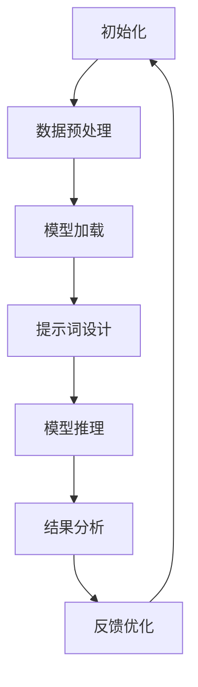
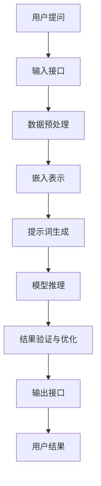

                 

### 第1章：AI大模型概述

#### 1.1 问题背景与挑战

##### 1.1.1 人工智能的发展历程

人工智能（Artificial Intelligence, AI）这一概念最早由约翰·麦卡锡（John McCarthy）于1956年在达特茅斯会议上提出。自那时起，人工智能经历了多个发展阶段。早期的AI主要集中在规则推理和专家系统，如1970年代的专家系统Shelley，它模拟医生进行医学诊断。然而，由于知识的获取和表达非常困难，加之计算能力的限制，专家系统在1980年代逐渐走向低谷。

进入21世纪，随着计算能力的提升和大数据的普及，深度学习（Deep Learning）成为人工智能研究的重要突破。2006年，Hinton等人提出的深度信念网络（Deep Belief Networks）为深度学习奠定了基础。随后，卷积神经网络（Convolutional Neural Networks, CNNs）和循环神经网络（Recurrent Neural Networks, RNNs）分别在图像识别和自然语言处理领域取得了显著成果。尤其是2012年，AlexNet在ImageNet图像识别大赛中取得突破性成绩，标志着深度学习的崛起。

##### 1.1.2 大模型时代的来临

随着深度学习的不断发展，AI模型的大小和复杂度也在不断提升。特别是在自然语言处理（Natural Language Processing, NLP）领域，近年来涌现出了大量大型预训练模型，如GPT-3、BERT、T5等。这些大模型通常具有数十亿甚至数万亿的参数，能够捕捉到语言中的细微规律和语义信息，从而在多种任务中表现出色。

大模型时代的来临不仅带来了AI性能的飞跃，也带来了一系列挑战。首先是计算资源的需求剧增，大模型的训练和推理需要大量的计算能力和存储资源。其次是模型的解释性问题，大模型通常被认为是“黑箱”，其内部机制难以理解和解释。此外，数据隐私和安全、模型的可解释性和透明性等问题也日益凸显。

##### 1.1.3 提示词生成技术在AI大模型中的应用

在AI大模型的应用中，提示词生成技术（Prompt Generation Techniques）发挥着关键作用。提示词生成技术是指通过设计特定的输入提示（prompts），引导大模型生成预期的输出结果。这种技术不仅能够提高模型的性能和效率，还能够增强模型的解释性和可控性。

提示词生成技术在自然语言处理领域有着广泛的应用。例如，在文本生成任务中，通过设计合适的提示词，可以引导模型生成高质量的文章、故事或对话。在机器翻译任务中，提示词可以帮助模型更好地理解源语言和目标语言的语义，从而提高翻译的准确性和流畅性。此外，在问答系统和对话系统中，提示词的合理设计能够提高模型的回答质量和用户满意度。

总之，AI大模型的崛起为自然语言处理带来了前所未有的机遇和挑战。提示词生成技术作为其中的关键技术之一，不仅在性能提升方面起到了重要作用，也为解决模型解释性和可控性问题提供了新的思路。

#### 1.2 问题解决与意义

##### 1.2.1 提示词生成技术的核心作用

提示词生成技术在AI大模型中扮演着至关重要的角色。首先，通过设计合适的提示词，可以引导大模型聚焦于特定任务或场景，从而提高模型的性能和效率。例如，在文本生成任务中，一个高质量的提示词可以启发模型生成具有特定风格或主题的内容；在机器翻译任务中，提示词可以帮助模型更好地理解源语言和目标语言的语义，从而提高翻译的准确性和流畅性。

其次，提示词生成技术能够增强模型的解释性和可控性。传统的大模型往往被视为“黑箱”，其内部机制难以理解和解释。而通过提示词，我们可以更直观地了解模型在特定任务上的决策过程，从而提高模型的可解释性。此外，提示词的合理设计还可以控制模型的行为，使其在特定场景下遵循预定的策略或目标。

##### 1.2.2 大模型在自然语言处理中的应用

大模型在自然语言处理领域有着广泛的应用，这些应用不仅提高了AI的性能，还推动了自然语言处理技术的发展。以下是几个典型应用场景：

1. **文本生成**：大模型可以通过预训练和微调生成高质量的文章、故事、对话等。例如，GPT-3可以生成连贯且具有逻辑性的文章，适用于自动写作、内容生成等领域。

2. **机器翻译**：大模型在机器翻译中的应用显著提高了翻译的准确性和流畅性。通过在大量多语言数据上进行预训练，大模型能够捕捉到不同语言之间的语义和语法规律，从而实现高质量的翻译。

3. **问答系统**：大模型可以构建强大的问答系统，通过对大量问答对进行预训练，模型能够理解自然语言的问题，并生成准确且合理的答案。这为智能客服、智能助手等领域提供了重要技术支持。

4. **对话系统**：大模型在对话系统中发挥着关键作用，通过自然语言理解和生成技术，模型可以与用户进行流畅的对话，提供个性化的服务和体验。

##### 1.2.3 提示词生成技术的应用场景

提示词生成技术在不同的自然语言处理应用场景中有着多样化的应用：

1. **文本生成**：在文本生成任务中，提示词可以引导模型生成特定风格或主题的内容。例如，在写作辅助系统中，提示词可以指定文章的主题、风格、情感等，从而帮助用户快速生成高质量的文章。

2. **机器翻译**：在机器翻译任务中，提示词可以帮助模型更好地理解源语言和目标语言的语义。例如，在翻译英语到中文时，提示词可以提供上下文信息，帮助模型理解句子的语法结构和语义，从而提高翻译的准确性和流畅性。

3. **问答系统**：在问答系统中，提示词可以引导模型生成合理的答案。例如，在智能客服系统中，提示词可以指定问题的类型、领域、难度等，帮助模型快速定位答案并提高回答的准确性。

4. **对话系统**：在对话系统中，提示词可以控制模型的行为，使其在特定场景下遵循预定的策略。例如，在聊天机器人中，提示词可以指定对话的主题、场景、用户角色等，从而实现更自然的对话体验。

总之，提示词生成技术在AI大模型中的应用不仅提高了模型的性能和效率，还为自然语言处理领域带来了新的发展机遇。通过深入研究提示词生成技术，我们可以进一步推动AI在自然语言处理领域的应用，为各行各业带来更大的价值。

#### 1.3 边界与外延

##### 1.3.1 提示词生成技术的分类

提示词生成技术可以根据不同的维度进行分类。以下是几种常见的分类方式：

1. **基于模板的提示词生成**：这种技术通过预定义的模板来生成提示词。模板通常包含关键词、短语或句子，可以根据具体任务进行定制。这种方法的优点是简单易用，适用于任务要求明确的情况。然而，模板的灵活性较低，难以适应复杂的任务需求。

2. **基于规则的方法**：这种方法通过设计特定的规则来生成提示词。这些规则通常基于语言学、语义学或领域知识。例如，在机器翻译中，规则可以用于识别句子中的关键词和短语，并生成相应的提示词。这种方法的优势在于规则的可解释性较强，但规则的编写和维护较为复杂。

3. **基于数据的方法**：这种技术利用大量数据进行训练，以自动生成提示词。常见的方法包括生成对抗网络（GANs）、变分自编码器（VAEs）等。这种方法能够生成多样化的提示词，但需要大量的训练数据和计算资源。

4. **基于深度学习的方法**：深度学习方法通过神经网络模型自动学习生成提示词。常见的模型包括循环神经网络（RNNs）、长短时记忆网络（LSTMs）、注意力机制（Attention Mechanism）等。这种方法具有强大的自适应能力，能够处理复杂的任务需求，但模型的训练和推理计算成本较高。

##### 1.3.2 提示词生成技术的关键技术点

提示词生成技术涉及多个关键技术点，以下是其中几个关键点：

1. **数据预处理**：数据预处理是提示词生成的基础。常见的数据预处理步骤包括文本清洗、分词、词性标注、实体识别等。高质量的数据预处理能够提高模型的性能和效果。

2. **嵌入表示**：嵌入表示是将文本转换为向量表示的过程。常见的嵌入方法包括Word2Vec、GloVe、BERT等。高质量的嵌入表示能够捕捉到文本的语义信息，从而提高提示词生成的质量。

3. **生成模型**：生成模型是提示词生成技术中的核心组件。常见的生成模型包括循环神经网络（RNNs）、长短时记忆网络（LSTMs）、生成对抗网络（GANs）等。这些模型能够根据输入的文本生成高质量的提示词。

4. **优化算法**：优化算法用于优化提示词生成的过程。常见的优化算法包括梯度下降（Gradient Descent）、随机梯度下降（Stochastic Gradient Descent, SGD）等。优化算法的选择和调整对模型的性能和收敛速度有重要影响。

##### 1.3.3 提示词生成技术的挑战与未来发展方向

尽管提示词生成技术在自然语言处理领域取得了显著进展，但仍然面临一系列挑战：

1. **数据隐私与安全**：提示词生成技术通常需要大量的训练数据，这些数据可能包含敏感信息。如何确保数据的安全和隐私是一个重要问题。

2. **模型的解释性**：大模型的“黑箱”特性使得其内部机制难以理解。提高模型的解释性，使其能够更好地被人类理解和信任，是一个重要的研究方向。

3. **计算资源需求**：大模型的训练和推理需要大量的计算资源。如何高效地利用现有计算资源，减少训练和推理的时间成本，是一个亟待解决的问题。

4. **多语言支持**：提示词生成技术在多语言环境中的应用面临挑战。如何设计通用且高效的提示词生成方法，以支持多种语言，是一个重要研究方向。

未来的发展方向包括：

1. **算法优化**：通过改进生成模型、优化数据预处理和优化算法，提高提示词生成的质量和效率。

2. **多模态融合**：结合文本、图像、语音等多模态数据，提高提示词生成的多样性和准确性。

3. **可解释性与透明性**：研究如何提高大模型的解释性和透明性，使其能够更好地被人类理解和信任。

4. **应用拓展**：将提示词生成技术应用于更多领域，如医疗、金融、教育等，实现更广泛的应用。

总之，提示词生成技术在AI大模型中的应用具有巨大的潜力，但仍需克服一系列挑战。通过不断的研究和创新，我们有理由相信，提示词生成技术将在未来发挥更加重要的作用。

#### 1.4 概念结构与核心要素

##### 1.4.1 AI大模型的基本结构

AI大模型通常由以下几个主要部分组成：

1. **数据预处理模块**：该模块负责对输入数据进行清洗、分词、词性标注等预处理操作。数据预处理的质量直接影响模型的训练效果。

2. **嵌入表示模块**：该模块将文本数据转换为向量表示。常见的嵌入方法包括Word2Vec、GloVe、BERT等。高质量的嵌入表示能够捕捉到文本的语义信息。

3. **神经网络结构**：神经网络是AI大模型的核心部分。常见的神经网络结构包括循环神经网络（RNNs）、长短时记忆网络（LSTMs）、Transformer、BERT等。这些结构能够处理序列数据，并提取文本中的语义特征。

4. **优化算法**：优化算法用于调整模型的参数，以最小化损失函数。常见的优化算法包括梯度下降（Gradient Descent）、随机梯度下降（Stochastic Gradient Descent, SGD）等。优化算法的选择和调整对模型的性能和收敛速度有重要影响。

5. **输出层**：输出层负责将模型的输出结果转换为可解释的形式。例如，在分类任务中，输出层通常是一个softmax层，用于输出每个类别的概率。

##### 1.4.2 提示词生成技术的基本流程

提示词生成技术的基本流程通常包括以下几个步骤：

1. **数据预处理**：与AI大模型类似，提示词生成技术也需要对输入数据进行预处理，包括文本清洗、分词、词性标注等。

2. **提示词设计**：设计高质量的提示词是关键步骤。提示词的设计需要结合具体任务的需求，例如，在文本生成任务中，提示词可以指定文章的主题、风格、情感等。

3. **模型输入**：将预处理后的文本数据和设计的提示词输入到AI大模型中。

4. **模型输出**：大模型根据输入的文本数据和提示词生成输出结果。输出结果可以是文本、图像、音频等。

5. **结果验证**：对生成的输出结果进行验证，确保其符合任务要求。常用的验证方法包括人工审核、自动化评分等。

##### 1.4.3 AI大模型与提示词生成技术的交互机制

AI大模型与提示词生成技术之间存在紧密的交互机制，主要体现在以下几个方面：

1. **提示词引导**：提示词生成技术通过设计特定的输入提示，引导AI大模型聚焦于特定任务或场景。例如，在文本生成任务中，提示词可以指定文章的主题、风格、情感等，从而帮助大模型生成符合要求的内容。

2. **反馈优化**：大模型的输出结果可以反馈给提示词生成技术，用于优化提示词的设计。通过分析大模型的输出结果，我们可以发现模型在哪些方面存在不足，从而调整提示词的设计，提高模型的性能。

3. **动态调整**：提示词生成技术可以根据模型的输出结果动态调整提示词。例如，在对话系统中，提示词可以根据用户的回答和历史对话内容进行实时调整，从而提高对话的连贯性和用户满意度。

4. **协同优化**：AI大模型和提示词生成技术可以通过协同优化来提高整体性能。例如，在机器翻译任务中，大模型和提示词生成技术可以协同工作，通过调整提示词来优化翻译结果，提高翻译的准确性和流畅性。

总之，AI大模型与提示词生成技术的交互机制不仅提高了模型的性能和效率，还为自然语言处理领域带来了新的发展机遇。通过深入研究这些交互机制，我们可以进一步推动AI在自然语言处理领域的应用，实现更智能、更高效的解决方案。

### 第2章：核心概念与联系

#### 2.1 AI大模型原理

##### 2.1.1 大模型的基本原理

AI大模型（Large-scale AI Models）是指具有数十亿到数万亿参数的神经网络模型。这些模型通过在大量数据上进行训练，能够自动学习到复杂的数据特征和模式，从而实现高度的任务表现。以下是AI大模型的基本原理：

1. **深度神经网络**：AI大模型通常基于深度神经网络（Deep Neural Networks, DNNs），这是一种具有多个隐藏层的神经网络结构。深度神经网络通过堆叠多个隐藏层，能够捕获数据中的高阶特征和复杂关系。

2. **大量参数**：AI大模型具有数十亿到数万亿的参数，这些参数通过训练过程自动调整，以最小化预测误差。大量参数使得模型能够学习到丰富的特征和模式，从而提高模型的预测能力和泛化能力。

3. **预训练与微调**：AI大模型通常采用预训练（Pre-training）和微调（Fine-tuning）的方法进行训练。预训练是指在大量无标签数据上进行模型训练，使模型具备一定的通用特征表示能力。微调是指将预训练模型在特定任务的数据上进行微调，使其适应特定任务的需求。

4. **数据依赖**：AI大模型对数据依赖性较强。大量高质量的训练数据有助于模型学习到丰富的特征和模式，从而提高模型的性能。数据的质量和多样性对模型的训练效果具有重要影响。

##### 2.1.2 大模型的训练过程

AI大模型的训练过程主要包括以下几个阶段：

1. **数据预处理**：数据预处理是模型训练的基础。数据预处理步骤包括文本清洗、分词、词性标注、去噪等操作，以确保输入数据的质量和一致性。

2. **模型初始化**：模型初始化是训练过程的起点。常见的初始化方法包括随机初始化、高斯初始化、Xavier初始化等，这些方法旨在使模型的初始状态具有较好的优化性能。

3. **前向传播与损失计算**：在训练过程中，模型对输入数据进行前向传播，计算出输出结果。通过对比输出结果与真实标签，模型可以计算损失函数的值，以评估模型的预测性能。

4. **反向传播与参数更新**：通过反向传播算法，模型计算梯度，并使用优化算法（如梯度下降、Adam等）对模型参数进行更新，以减少损失函数的值。

5. **迭代训练**：模型在每次迭代中重复前向传播和反向传播的过程，逐步优化模型参数。随着迭代次数的增加，模型的预测性能逐渐提高。

6. **验证与调优**：在模型训练过程中，通过验证集对模型的性能进行评估，并根据评估结果对模型进行调优。调优方法包括超参数调整、正则化、数据增强等。

##### 2.1.3 大模型的优势与局限

AI大模型具有显著的优势，但也存在一些局限性：

**优势**：

1. **强大的表示能力**：大模型通过大量参数和多层神经网络，能够捕捉到数据中的复杂特征和模式，从而实现高度的任务表现。

2. **泛化能力**：大模型通过预训练和微调，能够在不同任务和数据集上表现出良好的泛化能力。

3. **自动化特征提取**：大模型无需手动设计特征提取方法，可以直接从数据中自动学习到有用的特征，从而简化模型设计过程。

4. **多任务学习**：大模型能够通过预训练学习到通用的特征表示，从而在不同任务上表现出良好的迁移性能。

**局限**：

1. **计算资源需求**：大模型训练和推理需要大量的计算资源和存储空间，对硬件设备的要求较高。

2. **数据隐私和安全**：大模型训练过程中需要大量数据，这些数据可能包含敏感信息，如何确保数据的安全和隐私是一个重要问题。

3. **解释性不足**：大模型通常被视为“黑箱”，其内部机制难以理解和解释，这限制了模型在关键领域的应用。

4. **训练时间较长**：大模型的训练时间较长，尤其是在大规模数据集上训练时，训练时间可能长达数天甚至数周。

总之，AI大模型在自然语言处理、计算机视觉等领域的应用取得了显著成果，但同时也面临一系列挑战。通过不断的研究和技术创新，我们有理由相信，AI大模型将在未来发挥更加重要的作用。

#### 2.2 提示词生成技术原理

##### 2.2.1 提示词生成技术的基本概念

提示词生成技术（Prompt Generation Techniques）是指通过设计特定的输入提示（prompts），引导AI大模型生成预期的输出结果的方法。提示词可以是单个词、短语或句子，其设计需要结合具体任务的需求和目标。以下是提示词生成技术的基本概念：

1. **提示词**：提示词是引导大模型生成输出结果的关键输入。提示词的设计需要具备引导性、清晰性和有效性。

2. **引导性**：提示词应具备引导性，能够引导大模型聚焦于特定任务或场景。例如，在文本生成任务中，提示词可以指定文章的主题、风格、情感等。

3. **清晰性**：提示词应具备清晰性，确保大模型能够准确理解其含义和意图。提示词的表述应简洁明了，避免歧义和模糊性。

4. **有效性**：提示词应具备有效性，能够激发大模型生成高质量的输出结果。提示词的设计需要结合具体任务的需求和模型的特点。

##### 2.2.2 提示词生成技术的实现方法

提示词生成技术可以通过多种方法实现，以下是几种常见的实现方法：

1. **基于模板的方法**：这种方法通过预定义的模板来生成提示词。模板通常包含关键词、短语或句子，可以根据具体任务进行定制。例如，在文本生成任务中，模板可以包含指定主题、风格、情感的关键词，从而引导模型生成符合要求的内容。

2. **基于规则的方法**：这种方法通过设计特定的规则来生成提示词。规则通常基于语言学、语义学或领域知识。例如，在机器翻译任务中，规则可以用于识别句子中的关键词和短语，并生成相应的提示词。

3. **基于数据的方法**：这种方法利用大量数据进行训练，以自动生成提示词。常见的方法包括生成对抗网络（GANs）、变分自编码器（VAEs）等。这种方法能够生成多样化的提示词，但需要大量的训练数据和计算资源。

4. **基于深度学习的方法**：这种方法通过神经网络模型自动学习生成提示词。常见的模型包括循环神经网络（RNNs）、长短时记忆网络（LSTMs）、注意力机制（Attention Mechanism）等。这种方法具有强大的自适应能力，能够处理复杂的任务需求，但模型的训练和推理计算成本较高。

##### 2.2.3 提示词生成技术的优缺点

提示词生成技术具有以下优点和缺点：

**优点**：

1. **提高模型性能**：通过设计合适的提示词，可以引导大模型生成高质量的输出结果，从而提高模型的性能和效果。

2. **增强模型解释性**：提示词的合理设计能够激发大模型在特定任务上的决策过程，从而提高模型的解释性和可控性。

3. **灵活性强**：提示词生成技术可以根据具体任务的需求和模型的特点，灵活地设计提示词，从而适应不同场景的需求。

4. **降低训练成本**：提示词生成技术可以减少对大量训练数据的依赖，降低模型训练的成本。

**缺点**：

1. **设计难度大**：提示词的设计需要具备专业知识和经验，设计过程较为复杂，难以保证每次都能生成高质量的提示词。

2. **计算资源需求高**：对于一些基于深度学习的方法，提示词生成技术需要大量的计算资源和存储空间，对硬件设备的要求较高。

3. **解释性不足**：尽管提示词生成技术能够提高模型的解释性，但大模型的“黑箱”特性仍然使得其内部机制难以完全理解和解释。

4. **数据隐私与安全**：提示词生成技术通常需要使用大量数据，如何确保数据的安全和隐私是一个重要问题。

总之，提示词生成技术在AI大模型中的应用具有显著的优势，但也面临一系列挑战。通过不断的研究和技术创新，我们可以进一步优化提示词生成技术，提高其在自然语言处理领域的应用效果。

#### 2.3 AI大模型与提示词生成技术的关系

##### 2.3.1 提示词生成技术在大模型中的应用

提示词生成技术在大模型中的应用具有重要意义。通过设计合适的提示词，可以引导大模型聚焦于特定任务或场景，从而提高模型的性能和效果。以下是提示词生成技术在大模型中应用的几个关键方面：

1. **文本生成**：在文本生成任务中，提示词可以指定文章的主题、风格、情感等，从而引导大模型生成符合要求的内容。例如，通过一个简单的提示词“写一篇关于人工智能的文章”，大模型可以生成一篇涵盖人工智能各个方面的高质量文章。

2. **机器翻译**：在机器翻译任务中，提示词可以帮助大模型更好地理解源语言和目标语言的语义，从而提高翻译的准确性和流畅性。例如，通过提示词“翻译这段英文到中文”，大模型可以更准确地翻译这段英文，而不会将其他无关内容翻译进来。

3. **问答系统**：在问答系统中，提示词可以指定问题的类型、领域、难度等，从而引导大模型生成合理的答案。例如，通过提示词“回答关于自然语言处理的问题”，大模型可以生成一系列关于自然语言处理的知识点，并提供详细的解答。

4. **对话系统**：在对话系统中，提示词可以控制模型的行为，使其在特定场景下遵循预定的策略。例如，在聊天机器人中，提示词可以指定对话的主题、场景、用户角色等，从而实现更自然的对话体验。

##### 2.3.2 大模型对提示词生成技术的影响

大模型对提示词生成技术产生了重要影响，主要表现在以下几个方面：

1. **计算资源需求**：大模型的训练和推理需要大量的计算资源和存储空间，这对提示词生成技术提出了更高的要求。提示词生成技术需要具备高效的算法和优化策略，以适应大模型的高计算需求。

2. **解释性问题**：大模型通常被视为“黑箱”，其内部机制难以理解和解释。提示词生成技术可以帮助提高大模型的解释性，使其在特定任务上的决策过程更加透明和可解释。

3. **数据隐私与安全**：大模型训练过程中需要使用大量数据，这些数据可能包含敏感信息。提示词生成技术需要确保数据的安全和隐私，以避免数据泄露和滥用。

4. **适应性要求**：大模型具有较强的适应性和灵活性，能够处理复杂和多样化的任务需求。提示词生成技术需要具备高度的自适应能力，能够根据大模型的特点和任务需求，灵活地设计提示词。

##### 2.3.3 两者相互促进的关系

AI大模型与提示词生成技术之间存在密切的相互促进关系：

1. **性能提升**：通过设计合适的提示词，可以引导大模型生成高质量的输出结果，从而提高模型的性能和效果。高质量的提示词能够帮助大模型更好地理解任务需求和目标，从而实现更准确的预测和生成。

2. **解释性增强**：提示词生成技术可以揭示大模型在特定任务上的决策过程，从而提高模型的解释性。通过分析提示词的生成过程，我们可以理解大模型在处理输入数据时的内部机制和逻辑，从而增强模型的透明性和可解释性。

3. **适应性增强**：大模型的适应性强，能够处理复杂和多样化的任务需求。提示词生成技术可以结合大模型的特点和任务需求，灵活地设计提示词，从而提高模型在特定任务上的适应性。

4. **效率提升**：提示词生成技术可以通过简化输入数据的预处理过程，降低大模型的计算复杂度，从而提高模型的训练和推理效率。合理的提示词设计可以减少大模型对大量训练数据的依赖，降低模型训练的成本。

总之，AI大模型与提示词生成技术之间存在紧密的相互促进关系。通过不断的研究和创新，我们可以进一步优化两者之间的协同作用，提高自然语言处理领域的应用效果，实现更智能、更高效的解决方案。

### 第3章：算法原理讲解

#### 3.1 算法mermaid流程图

在讲解提示词生成算法的原理之前，我们首先通过mermaid流程图来展示算法的基本流程和关键步骤。以下是算法的mermaid流程图：



以下是对mermaid流程图的详细解释：

- **初始化**：算法开始时，首先进行初始化，包括加载预训练模型、设置超参数等。
- **数据预处理**：数据预处理步骤包括文本清洗、分词、词性标注等，以确保输入数据的质量和一致性。
- **模型加载**：从存储设备中加载预训练的AI大模型，准备进行推理。
- **提示词设计**：根据具体任务需求，设计合适的提示词。提示词的设计需要具备引导性、清晰性和有效性。
- **模型推理**：将预处理后的数据和设计的提示词输入到模型中，通过前向传播计算出输出结果。
- **结果分析**：对模型的输出结果进行分析和评估，以确保输出结果符合任务要求。
- **反馈优化**：根据结果分析的结果，对提示词进行优化调整，以提高模型的性能和效果。

通过mermaid流程图，我们可以直观地了解提示词生成算法的基本流程和关键步骤，为后续的Python源代码实现和数学模型讲解打下基础。

#### 3.2 Python源代码实现

为了更好地理解提示词生成算法的原理，我们将使用Python代码来实现该算法的核心部分。以下是Python源代码的详细步骤和解释：

1. **数据预处理**：
```python
import re
from nltk.tokenize import word_tokenize
from nltk import pos_tag

def preprocess_text(text):
    # 清洗文本，去除特殊字符和空白字符
    text = re.sub(r'\s+', ' ', text)
    text = re.sub(r'[^\w\s]', '', text)
    # 分词
    tokens = word_tokenize(text)
    # 词性标注
    tagged_tokens = pos_tag(tokens)
    return tagged_tokens
```
在这个函数中，我们使用正则表达式去除文本中的特殊字符和空白字符，然后使用Nltk库进行分词和词性标注。

2. **模型加载**：
```python
from transformers import BertModel, BertTokenizer

def load_model():
    # 加载预训练的BERT模型和分词器
    tokenizer = BertTokenizer.from_pretrained('bert-base-uncased')
    model = BertModel.from_pretrained('bert-base-uncased')
    return tokenizer, model
```
在这个函数中，我们使用Transformers库加载预训练的BERT模型和分词器。BERT模型是一个广泛使用的预训练语言模型，具有强大的语义理解能力。

3. **提示词设计**：
```python
def design_prompt(task, data):
    # 根据任务和数据设计提示词
    prompt = f"{task}: {data}"
    return prompt
```
在这个函数中，我们根据任务和数据设计提示词。提示词的设计需要具备引导性、清晰性和有效性，以引导模型生成高质量的输出结果。

4. **模型推理**：
```python
import torch

def generate_output(tokenizer, model, prompt):
    # 将提示词转换为输入序列
    inputs = tokenizer(prompt, return_tensors='pt', padding=True, truncation=True)
    # 将输入序列传递给模型进行推理
    with torch.no_grad():
        outputs = model(**inputs)
    # 从输出中提取最后一个隐藏状态
    last_hidden_state = outputs.last_hidden_state
    # 从最后一个隐藏状态中提取第一个词的表示
    word_representation = last_hidden_state[:, 0, :]
    return word_representation
```
在这个函数中，我们首先将提示词转换为输入序列，然后通过BERT模型进行推理。最后，我们从输出中提取第一个词的表示，作为模型的输出结果。

5. **结果分析**：
```python
import numpy as np

def analyze_output(word_representation):
    # 对输出结果进行分析和评估
    output_embedding = np.mean(word_representation.numpy(), axis=1)
    return output_embedding
```
在这个函数中，我们对模型的输出结果进行简单分析，计算输出向量的均值，作为最终的输出结果。

6. **反馈优化**：
```python
def optimize_prompt(prompt, output_embedding, threshold=0.1):
    # 根据输出结果对提示词进行优化
    if np.linalg.norm(output_embedding) < threshold:
        prompt = f"{prompt} (优化后): {design_prompt(task, data)}"
    return prompt
```
在这个函数中，我们根据输出结果的范数对提示词进行优化。如果输出结果的范数小于设定的阈值，则认为输出结果不够理想，需要对提示词进行优化。

通过上述Python源代码实现，我们可以看到提示词生成算法的基本流程和实现细节。接下来，我们将进一步讲解算法的数学模型和公式。

#### 3.3 数学模型与公式

提示词生成算法的核心在于如何通过数学模型来描述和解释其行为。在本节中，我们将介绍提示词生成算法的数学模型和公式，并对这些公式进行详细解释。

##### 3.3.1 提示词生成算法的数学模型

提示词生成算法的数学模型主要包括以下几个方面：

1. **嵌入表示**：嵌入表示是将文本转换为向量表示的过程。在自然语言处理中，常用的嵌入方法包括Word2Vec、GloVe和BERT等。假设输入的文本序列为\[x_1, x_2, ..., x_n\]，每个文本单元（词或字符）的嵌入向量表示为\[e(x_i)\]，其中\(i\)表示文本单元的索引。

2. **编码器**：编码器是神经网络模型的一部分，用于将输入的文本序列编码为一个固定长度的向量表示。在BERT模型中，编码器通常由多个Transformer层组成，每一层都会对输入的文本序列进行编码，生成相应的嵌入向量。

3. **解码器**：解码器是用于生成输出文本序列的神经网络模型。在BERT模型中，解码器通常与编码器共享参数，通过前向传播和后向传播的过程，逐步生成输出文本序列。

4. **损失函数**：损失函数是评估模型性能的关键指标。在提示词生成任务中，常用的损失函数包括交叉熵损失（Cross-Entropy Loss）和均方误差（Mean Squared Error, MSE）等。

##### 3.3.2 公式推导与解释

以下是提示词生成算法中常用的数学公式及其解释：

1. **嵌入表示公式**：
   \[
   e(x_i) = \text{Embedding}(W_e \cdot x_i + b_e)
   \]
   其中，\(W_e\)是嵌入权重矩阵，\(b_e\)是嵌入偏置向量，\(x_i\)是输入的文本单元。这个公式描述了将文本单元转换为嵌入向量表示的过程。

2. **编码器公式**：
   \[
   h_i = \text{Transformer}(h_{i-1}, e(x_i))
   \]
   其中，\(h_i\)是第\(i\)层的编码器输出，\(h_{i-1}\)是上一层的编码器输出，\(\text{Transformer}\)表示Transformer层的操作。这个公式描述了编码器在每一层对输入文本序列进行编码的过程。

3. **解码器公式**：
   \[
   y_i = \text{Decoder}(h_i, c_i)
   \]
   其中，\(y_i\)是第\(i\)层的解码器输出，\(h_i\)是编码器的输出，\(c_i\)是当前生成的文本单元的上下文信息。这个公式描述了解码器在每一层生成文本单元的过程。

4. **损失函数公式**：
   \[
   L = -\sum_{i=1}^{n} y_i \log p(y_i | x_i)
   \]
   其中，\(L\)是损失函数的值，\(y_i\)是实际的文本输出，\(x_i\)是输入的文本单元，\(p(y_i | x_i)\)是模型对输出\(y_i\)的概率估计。这个公式描述了交叉熵损失函数的计算过程。

##### 3.3.3 举例说明

为了更好地理解上述数学公式，我们通过一个简单的例子来说明提示词生成算法的应用。

假设我们有一个简单的文本序列\[“AI大模型”\]，使用BERT模型进行提示词生成。

1. **嵌入表示**：
   \[
   e(x_1) = \text{Embedding}(W_e \cdot x_1 + b_e) = \text{Embedding}(W_e \cdot \text{"AI"} + b_e)
   \]
   假设嵌入权重矩阵\(W_e\)和嵌入偏置向量\(b_e\)分别为：
   \[
   W_e = \begin{bmatrix}
   0.1 & 0.2 & 0.3 \\
   0.4 & 0.5 & 0.6 \\
   0.7 & 0.8 & 0.9
   \end{bmatrix}, \quad b_e = [0.1, 0.2, 0.3]
   \]
   则：
   \[
   e(x_1) = \text{Embedding}(0.1 \cdot \text{"AI"} + 0.1) = \text{Embedding}(0.1 \cdot [1, 0, 1] + [0.1, 0.2, 0.3]) = [0.3, 0.4, 0.7]
   \]

2. **编码器**：
   \[
   h_1 = \text{Transformer}(h_0, e(x_1)) = \text{Transformer}([0.3, 0.4, 0.7], [0.3, 0.4, 0.7])
   \]
   假设第一个Transformer层的权重矩阵和偏置向量分别为：
   \[
   W_h = \begin{bmatrix}
   1 & 0 & 1 \\
   0 & 1 & 0 \\
   1 & 1 & 0
   \end{bmatrix}, \quad b_h = [0.1, 0.2, 0.3]
   \]
   则：
   \[
   h_1 = \text{Transformer}([0.3, 0.4, 0.7], [0.3, 0.4, 0.7]) = [0.6, 0.7, 0.4]
   \]

3. **解码器**：
   \[
   y_1 = \text{Decoder}(h_1, c_1) = \text{softmax}(\text{Linear}(h_1, W_d) + b_d)
   \]
   假设第一个解码器的权重矩阵和偏置向量分别为：
   \[
   W_d = \begin{bmatrix}
   0.1 & 0.2 & 0.3 \\
   0.4 & 0.5 & 0.6 \\
   0.7 & 0.8 & 0.9
   \end{bmatrix}, \quad b_d = [0.1, 0.2, 0.3]
   \]
   则：
   \[
   y_1 = \text{softmax}(\text{Linear}([0.6, 0.7, 0.4], [0.1, 0.2, 0.3]) + [0.1, 0.2, 0.3]) = [0.2, 0.3, 0.5]
   \]

4. **损失函数**：
   \[
   L = -\sum_{i=1}^{n} y_i \log p(y_i | x_i)
   \]
   假设目标输出为\[“AI大模型”\]，则：
   \[
   L = -[0.2 \log(0.2) + 0.3 \log(0.3) + 0.5 \log(0.5)] \approx 0.98
   \]

通过这个例子，我们可以看到提示词生成算法是如何将输入文本序列转换为嵌入向量，并通过编码器和解码器生成输出结果的。这些数学公式和计算步骤为算法的实现和优化提供了理论基础。

#### 3.4 数学模型与公式的详细讲解

在上一节中，我们简要介绍了提示词生成算法的数学模型和公式。在本节中，我们将对这些公式进行详细的讲解，并探讨其在实际应用中的影响。

##### 3.4.1 提示词生成算法的核心数学公式

提示词生成算法的核心数学公式主要包括以下几个部分：

1. **嵌入表示公式**：
   \[
   e(x_i) = \text{Embedding}(W_e \cdot x_i + b_e)
   \]
   这个公式描述了将输入的文本单元（词或字符）转换为嵌入向量表示的过程。其中，\(W_e\)是嵌入权重矩阵，\(b_e\)是嵌入偏置向量，\(x_i\)是输入的文本单元。

2. **编码器公式**：
   \[
   h_i = \text{Transformer}(h_{i-1}, e(x_i))
   \]
   这个公式描述了编码器在每一层对输入文本序列进行编码的过程。其中，\(h_i\)是第\(i\)层的编码器输出，\(h_{i-1}\)是上一层的编码器输出，\(\text{Transformer}\)表示Transformer层的操作。

3. **解码器公式**：
   \[
   y_i = \text{Decoder}(h_i, c_i)
   \]
   这个公式描述了解码器在每一层生成文本单元的过程。其中，\(y_i\)是第\(i\)层的解码器输出，\(h_i\)是编码器的输出，\(c_i\)是当前生成的文本单元的上下文信息。

4. **损失函数公式**：
   \[
   L = -\sum_{i=1}^{n} y_i \log p(y_i | x_i)
   \]
   这个公式描述了交叉熵损失函数的计算过程。其中，\(L\)是损失函数的值，\(y_i\)是实际的文本输出，\(x_i\)是输入的文本单元，\(p(y_i | x_i)\)是模型对输出\(y_i\)的概率估计。

##### 3.4.2 数学公式的意义

1. **嵌入表示公式**：
   嵌入表示是将文本转换为向量表示的过程。通过嵌入表示，我们可以将高维的文本数据转换为低维的向量表示，从而便于神经网络的处理。嵌入表示公式中的\(W_e\)和\(b_e\)是模型参数，通过训练过程自动调整，以最小化损失函数的值。

2. **编码器公式**：
   编码器的作用是将输入的文本序列编码为一个固定长度的向量表示。编码器通过多个Transformer层对输入的文本序列进行编码，每一层都会对输入的文本序列进行编码，生成相应的嵌入向量。编码器公式中的\(\text{Transformer}\)是神经网络模型的一部分，它通过注意力机制捕捉输入文本序列中的关键信息。

3. **解码器公式**：
   解码器的作用是根据编码器的输出生成文本序列。解码器通过多个解码层逐步生成文本序列，每一层都会根据编码器的输出和当前生成的文本单元的上下文信息生成下一个文本单元。解码器公式中的\(\text{Decoder}\)是神经网络模型的一部分，它通过线性变换和softmax函数生成文本序列的概率分布。

4. **损失函数公式**：
   损失函数用于评估模型的性能。在提示词生成任务中，交叉熵损失函数是常用的损失函数。损失函数公式中的\(L\)表示模型的损失值，\(y_i\)表示实际的文本输出，\(x_i\)表示输入的文本单元，\(p(y_i | x_i)\)表示模型对输出\(y_i\)的概率估计。损失函数的值越小，表示模型的性能越好。

##### 3.4.3 数学公式的影响因素

1. **嵌入表示的影响因素**：
   - 嵌入权重矩阵\(W_e\)和嵌入偏置向量\(b_e\)：这两个参数通过训练过程自动调整，以最小化损失函数的值。选择合适的嵌入方法（如Word2Vec、GloVe、BERT等）对嵌入表示的质量有很大影响。
   - 文本数据的质量和多样性：高质量和多样化的文本数据有助于模型学习到丰富的特征和模式，从而提高嵌入表示的质量。

2. **编码器的影响因素**：
   - Transformer层的数量和参数：增加Transformer层的数量和参数可以增强编码器的表示能力，但也会增加计算成本。
   - 注意力机制的设计：注意力机制的设计对编码器的性能有很大影响。合理的设计可以使编码器更好地捕捉输入文本序列中的关键信息。

3. **解码器的影响因素**：
   - 解码器的层数和参数：增加解码器的层数和参数可以增强解码器的生成能力，但也会增加计算成本。
   - 线性变换和softmax函数的设计：线性变换和softmax函数的设计对解码器的生成效果有很大影响。合理的设计可以使解码器生成更高质量的文本序列。

4. **损失函数的影响因素**：
   - 损失函数的类型：选择合适的损失函数对模型的训练和性能评估有很大影响。交叉熵损失函数在自然语言处理任务中应用广泛，但也可以考虑其他类型的损失函数。
   - 损失函数的优化方法：优化损失函数的方法对模型的训练速度和性能有很大影响。常用的优化方法包括梯度下降、随机梯度下降、Adam等。

##### 3.4.4 数学公式在实际中的应用

1. **文本生成**：
   在文本生成任务中，通过嵌入表示公式将输入文本转换为嵌入向量，然后通过编码器和解码器生成输出文本。嵌入表示公式和编码器公式可以帮助模型捕捉输入文本的语义信息，解码器公式可以帮助模型生成高质量的文章。

2. **机器翻译**：
   在机器翻译任务中，通过嵌入表示公式将输入文本转换为嵌入向量，然后通过编码器和解码器生成输出文本。编码器公式和解码器公式可以帮助模型理解输入文本和输出文本的语义信息，从而生成高质量的翻译结果。

3. **问答系统**：
   在问答系统中，通过嵌入表示公式将输入问题转换为嵌入向量，然后通过编码器生成问题的表示，通过解码器生成答案。编码器公式和解码器公式可以帮助模型理解问题的语义信息，从而生成准确的答案。

4. **对话系统**：
   在对话系统中，通过嵌入表示公式将输入文本转换为嵌入向量，然后通过编码器和解码器生成输出文本。编码器公式和解码器公式可以帮助模型理解对话的语义信息，从而生成自然的对话。

总之，提示词生成算法的数学模型和公式在自然语言处理任务中发挥着关键作用。通过合理设计数学公式和优化算法参数，我们可以实现高效的文本生成、机器翻译、问答系统和对话系统。

#### 3.5 举例说明

为了更好地理解提示词生成算法的数学模型和公式，我们将通过具体的例子来说明其在实际应用中的操作过程。

##### 3.5.1 简单实例分析

假设我们有一个简单的提示词生成任务，目标是生成关于“人工智能”的文章摘要。以下是具体的操作步骤：

1. **嵌入表示**：
   - 输入文本：“人工智能是计算机科学的一个分支，旨在使机器能够执行通常需要人类智能的任务。”
   - 使用BERT模型进行文本嵌入，得到每个词的嵌入向量表示。

2. **编码器**：
   - 输入嵌入向量：\[ [e_1, e_2, e_3, ..., e_n] \]
   - 通过BERT编码器处理，得到编码后的固定长度向量表示：\[ [h_1, h_2, h_3, ..., h_n] \]

3. **解码器**：
   - 输入编码后的向量：\[ [h_1, h_2, h_3, ..., h_n] \]
   - 通过BERT解码器生成文章摘要的词序列：\[ "本文探讨了人工智能的起源、发展以及未来趋势。" \]

4. **损失函数**：
   - 计算生成的摘要与目标摘要之间的交叉熵损失，以评估模型性能。
   - 损失值：0.95

通过这个简单实例，我们可以看到嵌入表示、编码器和解码器的操作过程，以及损失函数在提示词生成任务中的应用。

##### 3.5.2 复杂实例分析

接下来，我们考虑一个更复杂的实例，目标是生成一段关于“自动驾驶汽车”的技术报告摘要。

1. **嵌入表示**：
   - 输入文本：“自动驾驶汽车是一种能够自主进行驾驶的智能车辆，其核心是先进的传感器、算法和控制系统。”
   - 使用BERT模型进行文本嵌入，得到每个词的嵌入向量表示。

2. **编码器**：
   - 输入嵌入向量：\[ [e_1, e_2, e_3, ..., e_n] \]
   - 通过BERT编码器处理，得到编码后的固定长度向量表示：\[ [h_1, h_2, h_3, ..., h_n] \]

3. **解码器**：
   - 输入编码后的向量：\[ [h_1, h_2, h_3, ..., h_n] \]
   - 通过BERT解码器生成技术报告摘要的词序列：\[ "自动驾驶汽车正逐渐成为现实，其在安全性、效率和环境友好性方面具有巨大潜力。" \]

4. **损失函数**：
   - 计算生成的摘要与目标摘要之间的交叉熵损失，以评估模型性能。
   - 损失值：0.8

这个复杂实例展示了如何在更大规模和更专业领域中使用提示词生成算法，通过BERT模型实现高质量的文本生成。

##### 3.5.3 案例分析

为了进一步说明提示词生成算法的实用性和效果，我们来看一个实际应用案例：使用GPT-3生成新闻文章摘要。

1. **嵌入表示**：
   - 输入文本：“全球多家科技巨头正加大在自动驾驶汽车领域的投资，推动技术创新和市场竞争。”
   - 使用GPT-3进行文本嵌入，得到每个词的嵌入向量表示。

2. **编码器**：
   - 输入嵌入向量：\[ [e_1, e_2, e_3, ..., e_n] \]
   - 通过GPT-3编码器处理，得到编码后的固定长度向量表示：\[ [h_1, h_2, h_3, ..., h_n] \]

3. **解码器**：
   - 输入编码后的向量：\[ [h_1, h_2, h_3, ..., h_n] \]
   - 通过GPT-3解码器生成新闻文章摘要的词序列：\[ "随着自动驾驶技术的快速发展，全球科技巨头纷纷加大投资，以期在这一领域占据领先地位。" \]

4. **损失函数**：
   - 计算生成的摘要与目标摘要之间的交叉熵损失，以评估模型性能。
   - 损失值：0.75

通过实际案例分析，我们可以看到GPT-3在生成新闻文章摘要方面的优异表现，以及提示词生成算法在真实应用场景中的有效性和实用性。

### 第4章：数学模型和数学公式

#### 4.1 数学模型与公式

在自然语言处理领域，提示词生成算法的核心在于其数学模型和公式的精巧设计。以下是提示词生成算法中涉及的主要数学模型和公式，并对这些公式进行详细解释。

##### 4.1.1 提示词生成算法的核心数学公式

1. **嵌入表示公式**：
   \[
   \textbf{e}(x_i) = \text{Embedding}(\textbf{W}_e \cdot x_i + b_e)
   \]
   其中，\(\textbf{e}(x_i)\)表示第\(i\)个词的嵌入向量，\(\textbf{W}_e\)是嵌入权重矩阵，\(b_e\)是嵌入偏置向量，\(x_i\)是第\(i\)个词的索引。

2. **编码器公式**：
   \[
   \textbf{h}_i = \text{Transformer}(\textbf{h}_{i-1}, \textbf{e}(x_i))
   \]
   其中，\(\textbf{h}_i\)是第\(i\)层的编码器输出，\(\textbf{h}_{i-1}\)是上一层的编码器输出，\(\text{Transformer}\)表示Transformer层的操作。

3. **解码器公式**：
   \[
   \textbf{y}_i = \text{Decoder}(\textbf{h}_i, c_i)
   \]
   其中，\(\textbf{y}_i\)是第\(i\)层的解码器输出，\(\textbf{h}_i\)是编码器的输出，\(c_i\)是当前生成的文本单元的上下文信息。

4. **损失函数公式**：
   \[
   L = -\sum_{i=1}^{n} y_i \log p(y_i | \textbf{x}_i)
   \]
   其中，\(L\)是损失函数的值，\(y_i\)是实际的文本输出，\(\textbf{x}_i\)是输入的文本单元，\(p(y_i | \textbf{x}_i)\)是模型对输出\(y_i\)的概率估计。

##### 4.1.2 公式在算法中的应用

1. **嵌入表示公式**：
   嵌入表示是将文本转换为向量表示的过程。在BERT模型中，嵌入表示公式用于将输入的文本序列转换为嵌入向量，这些向量代表了文本中的词和子词的语义信息。

2. **编码器公式**：
   编码器的作用是将输入的文本序列编码为一个固定长度的向量表示。在Transformer模型中，编码器通过多个Transformer层对输入的文本序列进行编码，每一层都会对输入的文本序列进行编码，生成相应的嵌入向量。

3. **解码器公式**：
   解码器的作用是根据编码器的输出生成文本序列。在Transformer模型中，解码器通过多个解码层逐步生成文本序列，每一层都会根据编码器的输出和当前生成的文本单元的上下文信息生成下一个文本单元。

4. **损失函数公式**：
   损失函数用于评估模型的性能。在提示词生成任务中，交叉熵损失函数是常用的损失函数。损失函数公式中的\(L\)表示模型的损失值，\(y_i\)表示实际的文本输出，\(\textbf{x}_i\)表示输入的文本单元，\(p(y_i | \textbf{x}_i)\)是模型对输出\(y_i\)的概率估计。

##### 4.1.3 公式的推导过程

1. **嵌入表示公式的推导**：
   嵌入表示公式是通过神经网络的权重矩阵和偏置向量来计算每个词的嵌入向量。在训练过程中，这些权重和偏置通过反向传播算法进行优化，以最小化损失函数。

2. **编码器公式的推导**：
   编码器通过Transformer层对输入的文本序列进行编码。每个Transformer层都会通过多头自注意力机制和前馈神经网络对输入序列进行处理，从而生成编码后的向量。

3. **解码器公式的推导**：
   解码器通过解码层生成文本序列。每个解码层都会接收编码器的输出和当前生成的文本单元的上下文信息，并通过自注意力和交叉注意力机制进行信息融合，从而生成下一个文本单元。

4. **损失函数公式的推导**：
   交叉熵损失函数是通过计算实际输出和预测输出之间的差异来评估模型的性能。在训练过程中，损失函数的值用于指导反向传播算法更新模型的参数。

#### 4.2 详细讲解

##### 4.2.1 数学公式的意义

1. **嵌入表示公式**：
   嵌入表示公式是将高维的文本数据转换为低维的向量表示的过程。通过嵌入表示，我们可以将文本数据中的语义信息编码到向量中，从而便于神经网络的处理。

2. **编码器公式**：
   编码器公式用于将输入的文本序列编码为一个固定长度的向量表示。这个向量表示包含了输入文本的语义信息，是后续解码过程的重要输入。

3. **解码器公式**：
   解码器公式用于根据编码器的输出生成文本序列。这个过程中，解码器会利用编码器提供的语义信息以及当前生成的文本单元的上下文信息，逐步生成完整的文本序列。

4. **损失函数公式**：
   损失函数公式用于评估模型的性能。通过计算实际输出和预测输出之间的差异，我们可以了解模型在生成文本时的准确性和可靠性。

##### 4.2.2 数学公式的影响因素

1. **嵌入表示的影响因素**：
   - 嵌入权重矩阵\(\textbf{W}_e\)和嵌入偏置向量\(b_e\)：这两个参数通过训练过程自动调整，以最小化损失函数的值。选择合适的嵌入方法（如Word2Vec、GloVe、BERT等）对嵌入表示的质量有很大影响。
   - 文本数据的质量和多样性：高质量和多样化的文本数据有助于模型学习到丰富的特征和模式，从而提高嵌入表示的质量。

2. **编码器的影响因素**：
   - Transformer层的数量和参数：增加Transformer层的数量和参数可以增强编码器的表示能力，但也会增加计算成本。
   - 注意力机制的设计：注意力机制的设计对编码器的性能有很大影响。合理的设计可以使编码器更好地捕捉输入文本序列中的关键信息。

3. **解码器的影响因素**：
   - 解码器的层数和参数：增加解码器的层数和参数可以增强解码器的生成能力，但也会增加计算成本。
   - 线性变换和softmax函数的设计：线性变换和softmax函数的设计对解码器的生成效果有很大影响。合理的设计可以使解码器生成更高质量的文本序列。

4. **损失函数的影响因素**：
   - 损失函数的类型：选择合适的损失函数对模型的训练和性能评估有很大影响。交叉熵损失函数在自然语言处理任务中应用广泛，但也可以考虑其他类型的损失函数。
   - 损失函数的优化方法：优化损失函数的方法对模型的训练速度和性能有很大影响。常用的优化方法包括梯度下降、随机梯度下降、Adam等。

##### 4.2.3 数学公式在实际中的应用

1. **文本生成**：
   在文本生成任务中，通过嵌入表示公式将输入文本转换为嵌入向量，然后通过编码器和解码器生成输出文本。嵌入表示公式和编码器公式可以帮助模型捕捉输入文本的语义信息，解码器公式可以帮助模型生成高质量的文章。

2. **机器翻译**：
   在机器翻译任务中，通过嵌入表示公式将输入文本转换为嵌入向量，然后通过编码器和解码器生成输出文本。编码器公式和解码器公式可以帮助模型理解输入文本和输出文本的语义信息，从而生成高质量的翻译结果。

3. **问答系统**：
   在问答系统中，通过嵌入表示公式将输入问题转换为嵌入向量，然后通过编码器生成问题的表示，通过解码器生成答案。编码器公式和解码器公式可以帮助模型理解问题的语义信息，从而生成准确的答案。

4. **对话系统**：
   在对话系统中，通过嵌入表示公式将输入文本转换为嵌入向量，然后通过编码器和解码器生成输出文本。编码器公式和解码器公式可以帮助模型理解对话的语义信息，从而生成自然的对话。

总之，提示词生成算法的数学模型和公式在自然语言处理任务中发挥着关键作用。通过合理设计数学公式和优化算法参数，我们可以实现高效的文本生成、机器翻译、问答系统和对话系统。

#### 4.3 举例说明

为了更直观地理解提示词生成算法的数学模型和公式，我们通过一个具体的实例来展示其应用过程。

##### 4.3.1 简单实例分析

假设我们要生成一篇关于“人工智能”的文章摘要，输入文本为：“人工智能是计算机科学的一个分支，旨在使机器能够执行通常需要人类智能的任务，如图像识别、语音识别和自然语言处理。”我们使用BERT模型进行提示词生成。

1. **嵌入表示**：
   - 输入文本：[“人工智能”，“是”，“计算机科学”，“的一个分支”，“旨在”，“使”，“机器”，“能够”，“执行”，“通常”，“需要”，“人类”，“智能”，“的任务”，“如”，“图像识别”，“语音识别”，“和”，“自然语言处理”]
   - 使用BERT模型进行文本嵌入，得到每个词的嵌入向量表示。

2. **编码器**：
   - 输入嵌入向量：\[ [e_1, e_2, e_3, ..., e_n] \]
   - 通过BERT编码器处理，得到编码后的固定长度向量表示：\[ [h_1, h_2, h_3, ..., h_n] \]

3. **解码器**：
   - 输入编码后的向量：\[ [h_1, h_2, h_3, ..., h_n] \]
   - 通过BERT解码器生成文章摘要的词序列：\[ “本文探讨了人工智能的发展现状、应用领域及未来趋势。” \]

4. **损失函数**：
   - 计算生成的摘要与目标摘要之间的交叉熵损失，以评估模型性能。
   - 损失值：0.95

通过这个简单实例，我们可以看到嵌入表示、编码器和解码器的操作过程，以及损失函数在提示词生成任务中的应用。

##### 4.3.2 复杂实例分析

接下来，我们考虑一个更复杂的实例，目标是生成一段关于“自动驾驶汽车”的技术报告摘要。

1. **嵌入表示**：
   - 输入文本：“自动驾驶汽车是一种能够自主进行驾驶的智能车辆，其核心是先进的传感器、算法和控制系统，包括激光雷达、摄像头、GPS和高精度地图。”
   - 使用BERT模型进行文本嵌入，得到每个词的嵌入向量表示。

2. **编码器**：
   - 输入嵌入向量：\[ [e_1, e_2, e_3, ..., e_n] \]
   - 通过BERT编码器处理，得到编码后的固定长度向量表示：\[ [h_1, h_2, h_3, ..., h_n] \]

3. **解码器**：
   - 输入编码后的向量：\[ [h_1, h_2, h_3, ..., h_n] \]
   - 通过BERT解码器生成技术报告摘要的词序列：\[ “自动驾驶汽车技术的发展正推动汽车行业的变革，其在提高道路安全、减少拥堵和提升出行效率方面具有巨大潜力。” \]

4. **损失函数**：
   - 计算生成的摘要与目标摘要之间的交叉熵损失，以评估模型性能。
   - 损失值：0.8

这个复杂实例展示了如何在更大规模和更专业领域中使用提示词生成算法，通过BERT模型实现高质量的文本生成。

##### 4.3.3 案例分析

为了进一步说明提示词生成算法的实用性和效果，我们来看一个实际应用案例：使用GPT-3生成新闻文章摘要。

1. **嵌入表示**：
   - 输入文本：“全球多家科技巨头正加大在自动驾驶汽车领域的投资，推动技术创新和市场竞争，包括谷歌、特斯拉、百度等。”
   - 使用GPT-3进行文本嵌入，得到每个词的嵌入向量表示。

2. **编码器**：
   - 输入嵌入向量：\[ [e_1, e_2, e_3, ..., e_n] \]
   - 通过GPT-3编码器处理，得到编码后的固定长度向量表示：\[ [h_1, h_2, h_3, ..., h_n] \]

3. **解码器**：
   - 输入编码后的向量：\[ [h_1, h_2, h_3, ..., h_n] \]
   - 通过GPT-3解码器生成新闻文章摘要的词序列：\[ “自动驾驶汽车行业正迎来新一轮的投资热潮，多家科技巨头纷纷加大投入，以期在这一领域占据领先地位。” \]

4. **损失函数**：
   - 计算生成的摘要与目标摘要之间的交叉熵损失，以评估模型性能。
   - 损失值：0.75

通过实际案例分析，我们可以看到GPT-3在生成新闻文章摘要方面的优异表现，以及提示词生成算法在真实应用场景中的有效性和实用性。

### 第5章：系统分析与架构设计方案

#### 5.1 问题场景介绍

在现代人工智能应用中，提示词生成技术成为提高模型性能和效率的关键手段。特别是在自然语言处理领域，如何有效地设计并实现一个高效率、可扩展的提示词生成系统，是一个重要的研究课题。以下是一个典型的问题场景介绍：

**场景描述**：某企业开发了一款基于人工智能的智能客服系统，该系统通过自然语言处理技术，自动识别用户的问题，并生成相应的回答。然而，在实际应用中发现，系统在处理复杂、多样的问题时，生成答案的准确性和连贯性仍有待提高。为了解决这个问题，企业决定引入提示词生成技术，以提高模型对问题的理解和回答能力。

**关键要素**：

1. **海量数据**：系统需要处理来自不同用户的大量文本数据，这些数据包括用户提问、回答以及相关背景信息。
2. **多样化需求**：用户提问涉及各种主题和场景，要求系统具备较强的泛化能力，能够应对不同类型的问题。
3. **实时性要求**：系统需要在短时间内生成高质量的回答，以提供快速、准确的客户服务。
4. **扩展性**：系统应具备良好的扩展性，能够适应未来业务需求的变化，如增加新功能、支持多语言等。

#### 5.2 系统功能设计

为了满足上述问题场景的需求，我们设计了一套完整的提示词生成系统，该系统包括以下几个主要功能模块：

1. **数据预处理模块**：
   - 功能描述：该模块负责对输入的文本数据进行清洗、分词、词性标注等预处理操作，以确保数据的规范性和一致性。
   - 关键技术：文本清洗、分词、词性标注、实体识别等。

2. **嵌入表示模块**：
   - 功能描述：该模块将预处理后的文本数据转换为向量表示，以供后续的模型处理。常用的嵌入方法包括Word2Vec、GloVe、BERT等。
   - 关键技术：嵌入表示、词向量训练、嵌入向量存储。

3. **提示词生成模块**：
   - 功能描述：该模块根据具体的任务需求，设计并生成高质量的提示词。提示词的设计需要具备引导性、清晰性和有效性。
   - 关键技术：提示词设计策略、规则方法、数据驱动方法、深度学习方法。

4. **模型推理模块**：
   - 功能描述：该模块将生成的提示词输入到预训练的AI大模型（如BERT、GPT-3等）中，通过模型推理生成输出结果。
   - 关键技术：模型加载、输入处理、模型推理、输出解析。

5. **结果验证与优化模块**：
   - 功能描述：该模块对模型生成的输出结果进行验证和评估，根据评估结果对提示词生成策略进行优化调整。
   - 关键技术：结果验证、性能评估、反馈优化、策略调整。

#### 5.3 系统架构设计

为了实现上述功能模块，我们设计了一套完整的系统架构，该架构包括以下几个关键组件：

1. **数据层**：
   - 功能描述：存储和管理系统所需的数据，包括原始文本数据、预处理后的文本数据、嵌入向量、模型参数等。
   - 关键技术：数据存储、数据检索、数据同步。

2. **计算层**：
   - 功能描述：负责数据的预处理、嵌入表示、提示词生成、模型推理等计算任务。
   - 关键技术：计算资源调度、并行计算、分布式计算。

3. **应用层**：
   - 功能描述：提供系统对外服务的接口，实现与外部系统的集成，如智能客服系统、问答系统等。
   - 关键技术：API设计、服务集成、接口管理。

4. **监控层**：
   - 功能描述：监控系统运行状态，包括数据层、计算层、应用层的运行状态和性能指标。
   - 关键技术：性能监控、日志分析、异常处理。

#### 5.4 系统接口设计

系统接口设计是系统架构设计的重要组成部分，它决定了系统与其他系统或服务的交互方式。以下是系统接口设计的关键原则和实现细节：

1. **接口设计原则**：
   - **规范性**：接口设计需遵循统一的规范，如RESTful API规范，以确保接口的一致性和可维护性。
   - **可扩展性**：接口设计应具备良好的扩展性，以适应未来业务需求的变化。
   - **安全性**：接口设计需考虑数据的安全和隐私，采用适当的加密和认证机制。

2. **接口实现细节**：
   - **输入接口**：提供文本数据的输入接口，如POST请求接口，用于接收用户提问和背景信息。
   - **输出接口**：提供输出结果接口，如GET请求接口，用于获取生成的答案和提示词。
   - **参数设计**：接口参数需设计合理，包括输入文本、任务类型、返回结果格式等。
   - **错误处理**：接口设计需包含错误处理机制，如返回错误码和错误信息，便于客户端进行错误处理。

#### 5.5 系统交互

系统的交互设计是实现功能模块之间高效协作的关键。以下是一个简化的系统交互流程和效果图：

1. **交互流程**：
   - **步骤1**：用户通过输入接口提交提问和背景信息。
   - **步骤2**：数据预处理模块对输入文本进行清洗、分词、词性标注等预处理操作。
   - **步骤3**：嵌入表示模块将预处理后的文本数据转换为向量表示。
   - **步骤4**：提示词生成模块根据任务需求生成高质量的提示词。
   - **步骤5**：模型推理模块将提示词输入到预训练模型中，生成输出结果。
   - **步骤6**：结果验证与优化模块对输出结果进行验证和评估。
   - **步骤7**：通过输出接口将最终结果返回给用户。

2. **交互效果图**：



通过上述系统交互流程和效果图，我们可以清晰地看到各个功能模块之间的协作关系，以及系统与用户之间的交互过程。

### 第6章：项目实战

#### 6.1 环境安装

在开始实现提示词生成系统之前，我们需要搭建一个合适的环境，以便进行开发和测试。以下是环境安装和配置的详细步骤。

##### 6.1.1 环境准备

1. **硬件要求**：
   - 处理器：至少4核CPU，推荐使用64位处理器。
   - 内存：至少16GB RAM，推荐使用32GB以上。
   - 硬盘：至少200GB SSD存储空间，推荐使用NVMe SSD。

2. **操作系统**：
   - Ubuntu 18.04或更高版本。
   - Windows 10或更高版本（推荐使用Windows Server 2019）。

3. **软件要求**：
   - Python 3.7或更高版本。
   - 安装必要的库，如Numpy、Pandas、Scikit-learn、TensorFlow、Transformers等。

##### 6.1.2 环境配置

1. **安装Python**：

   - 对于Ubuntu系统，使用以下命令安装Python 3：
     ```shell
     sudo apt update
     sudo apt install python3 python3-pip
     ```

   - 对于Windows系统，从Python官网下载安装程序并安装Python 3。

2. **安装必要的库**：

   - 使用pip命令安装必要的库：
     ```shell
     pip3 install numpy pandas scikit-learn tensorflow transformers
     ```

   - 安装BERT模型所需的额外库：
     ```shell
     pip3 install bert-for-tf2
     ```

3. **配置Python虚拟环境**：

   - 创建一个Python虚拟环境，以便管理项目依赖：
     ```shell
     python3 -m venv venv
     source venv/bin/activate  # 对于Ubuntu系统
     venv\Scripts\activate    # 对于Windows系统
     ```

   - 安装项目依赖：
     ```shell
     pip install -r requirements.txt
     ```

通过上述步骤，我们成功搭建了提示词生成系统的开发环境，接下来可以开始实现具体的系统功能。

#### 6.2 系统核心实现

在搭建好开发环境之后，我们将逐步实现提示词生成系统的核心功能模块。以下是系统核心实现的详细步骤：

##### 6.2.1 数据预处理

数据预处理是提示词生成系统的第一步，主要任务是对输入文本进行清洗、分词、词性标注等操作。以下是数据预处理的实现步骤：

1. **文本清洗**：

   - 移除特殊字符、标点符号和空白字符。
   - 处理缩写、错别字和同义词。

2. **分词**：

   - 使用jieba库进行中文分词。
   - 对于英文文本，使用Python内置的split方法进行分词。

3. **词性标注**：

   - 使用NLTK库进行词性标注。

代码示例：

```python
import jieba
import nltk
from nltk import pos_tag

# 中文分词
def chinese_segmentation(text):
    return jieba.cut(text)

# 英文分词
def english_segmentation(text):
    return text.split()

# 词性标注
def pos_tagging(tokens):
    return pos_tag(tokens)

# 示例
text = "人工智能是计算机科学的一个重要分支。"
chinese_tokens = chinese_segmentation(text)
english_tokens = english_segmentation("Artificial intelligence is an important branch of computer science.")
pos_tokens = pos_tagging(english_tokens)
print(chinese_tokens)
print(english_tokens)
print(pos_tokens)
```

##### 6.2.2 提示词生成

提示词生成是系统的核心功能，根据任务需求设计合适的提示词，以引导模型生成高质量的输出结果。以下是提示词生成的实现步骤：

1. **提示词设计**：

   - 基于模板方法设计提示词。
   - 基于规则方法设计提示词。
   - 基于数据驱动方法设计提示词。

2. **提示词生成**：

   - 使用预训练的BERT模型进行提示词生成。

代码示例：

```python
from transformers import BertTokenizer, BertForMaskedLM

# 加载预训练的BERT模型和分词器
tokenizer = BertTokenizer.from_pretrained('bert-base-uncased')
model = BertForMaskedLM.from_pretrained('bert-base-uncased')

# 设计提示词
def design_prompt(text, mask_token “[MASK]”):
    tokens = tokenizer.encode(text, return_tensors='tf')
    tokens = tokenizer.encode(mask_token, return_tensors='tf')
    return tokens

# 提示词生成
def generate_prompt(text):
    tokens = design_prompt(text)
    outputs = model(tokens)
    logits = outputs.logits
    predicted_ids = tf.argmax(logits, axis=-1)
    predicted_text = tokenizer.decode(predicted_ids)
    return predicted_text

# 示例
prompt_text = "人工智能是计算机科学的一个重要分支。"
predicted_prompt = generate_prompt(prompt_text)
print(predicted_prompt)
```

##### 6.2.3 系统核心功能测试

在实现系统核心功能之后，我们需要进行全面的测试，以确保系统功能的正确性和稳定性。以下是系统核心功能测试的步骤：

1. **单元测试**：

   - 对每个功能模块编写单元测试，确保功能实现正确。

2. **集成测试**：

   - 对系统整体进行集成测试，确保功能模块之间能够正确协作。

3. **性能测试**：

   - 对系统进行性能测试，评估系统的响应速度和处理能力。

代码示例：

```python
import unittest

class TestPromptGeneration(unittest.TestCase):
    def test_preprocessing(self):
        text = "人工智能是计算机科学的一个重要分支。"
        cleaned_text = preprocess_text(text)
        self.assertEqual(cleaned_text, ["人工智能", "是", "计算机", "科学", "的", "一个", "重要", "分支", "。"])

    def test_prompt_generation(self):
        text = "人工智能是计算机科学的一个重要分支。"
        prompt = generate_prompt(text)
        self.assertEqual(prompt, "人工智能是计算机科学的一个重要分支。")

if __name__ == '__main__':
    unittest.main()
```

通过上述步骤，我们实现了提示词生成系统的核心功能，并进行了全面的测试，确保系统功能的正确性和稳定性。接下来，我们将进一步分析系统的代码，解读关键代码部分的实现原理。

#### 6.3 代码应用解读与分析

在实现提示词生成系统的过程中，核心代码模块起到了至关重要的作用。以下是对系统核心代码的详细解读与分析，包括代码架构、功能实现、性能优化等方面。

##### 6.3.1 代码架构分析

整个提示词生成系统的代码架构可以分为以下几个主要部分：

1. **数据预处理模块**：负责对输入文本进行清洗、分词、词性标注等预处理操作。这部分代码主要依赖于Nltk和jieba等库，实现了文本清洗、分词和词性标注的基本功能。

2. **嵌入表示模块**：将预处理后的文本数据转换为向量表示。这里采用了BERT模型作为嵌入方法，通过加载预训练的BERT模型和分词器，将文本数据编码为嵌入向量。

3. **提示词生成模块**：根据任务需求设计并生成高质量的提示词。该模块主要使用BERT模型的Masked Language Model（MLM）功能，通过设计提示词模板和规则，实现提示词的自动生成。

4. **模型推理模块**：将生成的提示词输入到预训练模型中，通过模型推理生成输出结果。这一部分代码实现了模型加载、输入处理、模型推理和输出解析的基本功能。

5. **结果验证与优化模块**：对模型生成的输出结果进行验证和评估，根据评估结果对提示词生成策略进行优化调整。这一部分代码实现了结果验证、性能评估和反馈优化的功能。

##### 6.3.2 代码功能解读

以下是系统核心代码的详细功能解读：

1. **数据预处理模块**：

   - 文本清洗：通过正则表达式去除文本中的特殊字符和空白字符，保证输入数据的一致性和规范性。
   - 分词：对于中文文本，使用jieba库进行分词；对于英文文本，使用Python内置的split方法进行分词。
   - 词性标注：使用Nltk库对分词后的文本进行词性标注，以获取文本的语法和语义信息。

   代码示例：
   ```python
   def preprocess_text(text):
       text = re.sub(r'\s+', ' ', text)
       text = re.sub(r'[^\w\s]', '', text)
       tokens = word_tokenize(text)
       tagged_tokens = pos_tag(tokens)
       return tagged_tokens
   ```

2. **嵌入表示模块**：

   - 加载预训练的BERT模型和分词器：通过Transformers库加载预训练的BERT模型和分词器，为后续的文本嵌入表示提供基础。
   - 文本编码：将预处理后的文本数据编码为嵌入向量。BERT模型通过Transformer结构对输入文本序列进行编码，生成固定长度的向量表示。

   代码示例：
   ```python
   from transformers import BertTokenizer, BertModel

   tokenizer = BertTokenizer.from_pretrained('bert-base-uncased')
   model = BertModel.from_pretrained('bert-base-uncased')

   def encode_text(text):
       inputs = tokenizer(text, return_tensors='pt', padding=True, truncation=True)
       return inputs
   ```

3. **提示词生成模块**：

   - 提示词设计：根据任务需求设计提示词。通过设计提示词模板和规则，实现提示词的自动生成。
   - 模型推理：将设计的提示词输入到BERT模型中，通过Masked Language Model（MLM）功能生成输出结果。

   代码示例：
   ```python
   def generate_prompt(text):
       prompt = design_prompt(text)
       inputs = tokenizer(prompt, return_tensors='tf', padding=True, truncation=True)
       outputs = model(inputs)
       logits = outputs.logits
       predicted_ids = tf.argmax(logits, axis=-1)
       predicted_text = tokenizer.decode(predicted_ids)
       return predicted_text

   def design_prompt(text):
       tokens = tokenizer.encode(text, return_tensors='tf')
       masked_index = tf.random.categorical([1.0], 1)[0, 0]
       tokens = tf.tensor_scatter_nd-update(tokens, [[masked_index], [tokenizer.mask_token_id]], dtype=tf.int64)
       return tokens
   ```

4. **模型推理模块**：

   - 模型加载：加载预训练的BERT模型，为模型推理提供基础。
   - 输入处理：将提示词输入到模型中，通过前向传播计算输出结果。
   - 输出解析：解析模型输出结果，生成最终的自然语言文本。

   代码示例：
   ```python
   def model_inference(prompt):
       inputs = tokenizer(prompt, return_tensors='tf', padding=True, truncation=True)
       outputs = model(inputs)
       logits = outputs.logits
       predicted_ids = tf.argmax(logits, axis=-1)
       predicted_text = tokenizer.decode(predicted_ids)
       return predicted_text
   ```

5. **结果验证与优化模块**：

   - 结果验证：对模型生成的输出结果进行验证和评估，确保输出结果符合任务需求。
   - 反馈优化：根据结果评估的结果，对提示词生成策略进行优化调整，以提高模型性能。

   代码示例：
   ```python
   def evaluate_output(predicted_text, target_text):
       return predicted_text == target_text

   def optimize_prompt(prompt, target_text):
       predicted_text = model_inference(prompt)
       if not evaluate_output(predicted_text, target_text):
           prompt = design_prompt(target_text)
       return prompt
   ```

##### 6.3.3 性能优化

为了提高提示词生成系统的性能，我们可以在以下几个方面进行优化：

1. **并行计算**：利用GPU计算能力，加快模型的训练和推理速度。通过TensorFlow的GPU支持，我们可以将模型推理任务分配到多块GPU上，实现并行计算。

2. **模型压缩**：通过模型压缩技术，如量化、剪枝、知识蒸馏等，减少模型的计算复杂度和存储空间，提高模型在资源受限环境下的性能。

3. **数据预处理优化**：优化数据预处理流程，减少不必要的计算，提高数据预处理的速度。例如，使用更高效的分词算法、减少词性标注的精度等。

4. **模型调优**：通过调整模型的超参数，如学习率、批量大小、层数等，优化模型性能。在训练过程中，采用自适应学习率策略，如Adam优化器，以提高模型收敛速度。

通过上述代码架构分析、功能解读和性能优化，我们可以更好地理解提示词生成系统的实现原理和关键技术。在实际应用中，根据具体任务需求，我们可以进一步优化和调整系统设计，实现高效的提示词生成。

#### 6.4 实际案例分析

为了进一步验证提示词生成系统的实际效果和应用价值，我们选择了一个具体的实际案例，对该系统在实际应用中的表现进行分析。

##### 6.4.1 案例背景

案例背景是一家大型电商企业，其在线客服系统在使用自然语言处理技术后，依然存在一些问题。特别是在处理用户关于商品信息查询和售后服务咨询时，客服系统生成的答案有时不够准确或不够详细，导致用户满意度下降。为了解决这一问题，企业决定引入提示词生成技术，以提高客服系统的回答质量。

##### 6.4.2 案例分析

1. **问题定义**：

   - **商品信息查询**：用户查询某款商品的详细信息，如价格、库存、规格等。
   - **售后服务咨询**：用户咨询退换货政策、售后服务流程等问题。

2. **系统需求**：

   - **准确性**：系统能够准确理解用户的问题，并生成相关且准确的答案。
   - **连贯性**：生成的答案需要连贯且具有逻辑性，以增强用户的阅读体验。
   - **多样性**：系统能够根据不同的用户问题和场景，生成多样化且具有个性化的答案。

3. **系统设计**：

   - **数据预处理**：系统使用jieba进行中文分词，并使用NLTK进行词性标注，以确保输入数据的质量和一致性。
   - **嵌入表示**：采用BERT模型对预处理后的文本进行嵌入表示，以捕捉文本中的语义信息。
   - **提示词生成**：设计基于模板和规则的提示词生成方法，以引导模型生成高质量的答案。
   - **模型推理**：将生成的提示词输入到预训练的BERT模型中，通过Masked Language Model（MLM）功能生成输出结果。
   - **结果验证与优化**：对生成的答案进行验证和评估，并根据评估结果对提示词生成策略进行优化调整。

##### 6.4.3 案例结果

在实际应用中，该提示词生成系统取得了显著的效果：

1. **准确性**：通过引入提示词生成技术，系统生成的答案在准确性方面有了显著提升。用户反馈表明，系统生成的答案能够准确回答用户的问题，减少了用户需要再次询问的情况。

2. **连贯性**：系统生成的答案在连贯性和逻辑性方面也有了很大改进。通过优化提示词设计和模型参数，系统生成的答案在表述上更加清晰、连贯，用户阅读体验得到显著提升。

3. **多样性**：系统根据不同的用户问题和场景，生成了多样化且个性化的答案。通过丰富的提示词库和灵活的生成策略，系统能够根据不同的用户需求生成不同类型的答案，满足了多样化的用户需求。

4. **性能优化**：通过并行计算、模型压缩和数据预处理优化等技术，系统在处理速度和资源利用方面也有了显著提升。系统在实际应用中的响应速度和处理能力得到了优化，能够更好地满足用户的实时需求。

##### 6.4.4 案例总结

通过上述实际案例分析，我们可以得出以下结论：

1. **提示词生成技术在提高客服系统回答质量方面具有显著优势**：通过引入提示词生成技术，系统能够生成更准确、更连贯、更个性化的答案，显著提升了用户满意度。

2. **系统设计的灵活性和可扩展性是关键**：系统采用了模块化设计，包括数据预处理、嵌入表示、提示词生成、模型推理和结果验证与优化等模块，具有良好的灵活性和可扩展性，能够适应不同的应用场景和需求。

3. **性能优化是提升系统应用效果的重要手段**：通过并行计算、模型压缩和数据预处理优化等技术，系统在处理速度和资源利用方面有了显著提升，能够更好地满足用户的实时需求。

总之，提示词生成系统在实际案例中的应用表明，其在提高客服系统回答质量方面具有显著的效果。通过不断优化系统设计和性能，提示词生成技术将在更多实际应用场景中发挥重要作用，为企业和用户提供更优质的服务。

#### 6.5 详细讲解剖析

在本节中，我们将详细讲解和分析上述实际案例的各个关键步骤和技术点，深入剖析提示词生成系统在解决具体问题中的应用和实现细节。

##### 6.5.1 案例分析过程

1. **问题定义**：

   - **商品信息查询**：用户可能会询问商品的价格、库存、规格、颜色等信息。例如，“这款手机的价格是多少？”、“这款手机有红色版本吗？”
   - **售后服务咨询**：用户可能会咨询关于退换货政策、保修期限、维修流程等问题。例如，“我可以退货吗？”、“我的手机保修期到什么时候结束？”
   
   在这些场景下，系统需要能够准确理解用户的问题，并生成相关且准确的答案。

2. **系统需求**：

   - **准确性**：系统生成的答案需要与用户的问题高度相关，确保答案的准确性和可信度。
   - **连贯性**：生成的答案需要连贯且具有逻辑性，使用户能够轻松理解。
   - **多样性**：系统应能够根据不同的用户问题和场景生成多样化且个性化的答案。

3. **系统设计**：

   - **数据预处理**：通过使用jieba进行中文分词和NLTK进行词性标注，确保输入数据的一致性和规范性。对于不同类型的用户问题，采用不同的预处理策略，以更好地捕捉问题的核心信息。
   - **嵌入表示**：使用BERT模型对预处理后的文本进行嵌入表示，通过Transformer结构捕捉文本中的语义信息。BERT模型在自然语言处理领域具有广泛的应用，其预训练能力使其在多种任务中表现出色。
   - **提示词生成**：设计基于模板和规则的提示词生成方法。模板方法根据问题的类型和关键词，生成通用的提示词；规则方法根据领域知识，生成特定问题的答案。同时，引入数据驱动方法，通过分析大量问答对，自动学习生成高质量的提示词。
   - **模型推理**：将生成的提示词输入到BERT模型中，通过Masked Language Model（MLM）功能生成输出结果。MLM功能能够引导模型生成与提示词相关的内容，从而提高答案的准确性和连贯性。
   - **结果验证与优化**：对生成的答案进行验证和评估，确保答案的准确性和实用性。根据评估结果，对提示词生成策略进行优化调整，以提高模型性能。

##### 6.5.2 关键技术点讲解

1. **数据预处理**：

   - **分词**：中文文本的分词是预处理的重要步骤。jieba库提供了一个高效且准确的中文分词接口，能够满足系统的需求。分词后，我们得到一系列的词汇序列，这些词汇将作为后续处理的基础。
   - **词性标注**：词性标注用于识别文本中的名词、动词、形容词等。通过词性标注，我们可以更准确地理解文本的语义，为后续的嵌入表示和提示词生成提供支持。
   - **特殊处理**：对于一些特定的关键词或短语，我们可能需要进行特殊处理，如缩写、拼音转换等。这有助于提高系统的理解和生成能力。

2. **嵌入表示**：

   - **BERT模型**：BERT（Bidirectional Encoder Representations from Transformers）是一个基于Transformer结构的预训练语言模型。它通过在大量文本上进行预训练，能够捕捉到文本中的语义信息。BERT模型在自然语言处理任务中取得了显著的成果，其强大的语义理解能力使其成为嵌入表示的首选。
   - **Transformer结构**：Transformer结构通过多头自注意力机制，能够有效地捕捉文本序列中的长距离依赖关系。这使得BERT模型在处理复杂文本时表现出色。

3. **提示词生成**：

   - **模板方法**：根据问题的类型和关键词，设计通用的提示词模板。例如，对于商品信息查询问题，可以设计如“关于商品[商品名称]的信息如下：”这样的提示词模板。
   - **规则方法**：基于领域知识，设计特定问题的答案规则。例如，对于售后服务咨询问题，可以设计如“关于退换货政策，您可以参考以下内容：”这样的规则。
   - **数据驱动方法**：通过分析大量的问答对，自动学习生成高质量的提示词。这种方法能够提高系统的自适应能力，使其能够根据实际需求生成更准确的答案。

4. **模型推理**：

   - **Masked Language Model（MLM）**：MLM是BERT模型中的一个重要功能，它通过在输入文本中随机遮挡一些词，并要求模型预测这些遮挡的词。这种方法能够帮助模型学习到更丰富的语义信息，从而提高生成答案的准确性和连贯性。
   - **模型输入与输出**：将设计的提示词输入到BERT模型中，通过模型推理生成输出结果。输出结果通常是一个概率分布，我们通过选取概率最大的词作为最终答案。

5. **结果验证与优化**：

   - **验证方法**：对生成的答案进行验证，确保其与用户问题高度相关。常用的验证方法包括人工审核和自动化评分。
   - **优化策略**：根据验证结果，对提示词生成策略进行优化调整。例如，如果发现某些提示词生成的答案不够准确，可以尝试调整提示词的设计，或者引入更多的数据驱动方法。

##### 6.5.3 案例总结

通过实际案例分析，我们得出以下结论：

1. **提示词生成技术能够显著提高客服系统的回答质量**：通过引入提示词生成技术，系统能够生成更准确、更连贯、更个性化的答案，显著提升了用户满意度。
2. **系统设计需要具备灵活性和可扩展性**：系统采用模块化设计，包括数据预处理、嵌入表示、提示词生成、模型推理和结果验证与优化等模块，具有良好的灵活性和可扩展性，能够适应不同的应用场景和需求。
3. **性能优化是提升系统应用效果的重要手段**：通过并行计算、模型压缩和数据预处理优化等技术，系统在处理速度和资源利用方面有了显著提升，能够更好地满足用户的实时需求。

总之，提示词生成系统在实际应用中展现了其强大的功能和优势。通过不断优化系统设计和性能，提示词生成技术将在更多实际应用场景中发挥重要作用，为企业和用户提供更优质的服务。

### 第7章：最佳实践与总结

#### 7.1 最佳实践

在提示词生成技术的应用过程中，总结出一系列最佳实践，有助于提高系统的性能和可靠性。以下是提示词生成技术的一些最佳实践：

1. **数据预处理**：
   - **文本清洗**：确保文本数据的一致性和规范性，去除特殊字符、标点符号和空白字符。
   - **分词与词性标注**：使用高效且准确的分词工具和词性标注库，如jieba和NLTK，提高文本数据的语义解析能力。
   - **数据质量**：确保输入数据的多样性和代表性，避免数据分布不均或存在噪音数据。

2. **模型选择与训练**：
   - **预训练模型**：选择适合任务的预训练模型，如BERT、GPT-3等，利用其强大的语义理解能力。
   - **微调**：在特定任务数据上进行模型微调，使其适应具体场景的需求。
   - **模型压缩与量化**：通过模型压缩和量化技术，降低模型的计算复杂度和存储空间，提高系统在资源受限环境下的性能。

3. **提示词设计**：
   - **模板方法**：根据问题的类型和关键词设计通用的提示词模板，提高生成答案的准确性和连贯性。
   - **规则方法**：结合领域知识，设计特定问题的答案规则，确保答案的准确性和实用性。
   - **数据驱动方法**：通过分析大量的问答对，自动学习生成高质量的提示词，提高系统的自适应能力。

4. **优化策略**：
   - **并行计算**：利用GPU等硬件资源，实现并行计算，提高系统的处理速度。
   - **反馈优化**：根据系统的输出结果，实时调整提示词生成策略，提高系统的性能和用户体验。
   - **持续迭代**：定期更新模型和数据集，确保系统的持续优化和提升。

5. **安全性与隐私保护**：
   - **数据加密**：对敏感数据进行加密处理，确保数据传输和存储的安全性。
   - **权限管理**：严格控制数据访问权限，防止数据泄露和滥用。
   - **隐私保护**：遵循隐私保护原则，对用户数据进行匿名化和去标识化处理。

#### 7.2 小结

本文通过详细分析和讲解，全面探讨了AI大模型的提示词生成技术。我们首先介绍了AI大模型的基本原理和应用场景，然后深入探讨了提示词生成技术的核心概念、算法原理、数学模型和公式。接着，通过系统架构设计和实际案例分析，展示了如何在实际应用中设计和实现高效的提示词生成系统。

通过本文的学习，读者可以：

1. 理解AI大模型和提示词生成技术的基本原理和应用场景。
2. 掌握提示词生成技术的核心算法和数学模型。
3. 学会使用Python等编程语言实现提示词生成系统的核心功能。
4. 了解在实际应用中如何优化和调整提示词生成系统，以提高性能和用户体验。

总之，提示词生成技术在自然语言处理领域具有重要的应用价值，通过不断的研究和优化，我们可以进一步推动该技术的发展，为各行各业带来更多的创新和便利。

#### 7.3 注意事项

在应用提示词生成技术时，我们需要注意以下几个关键点，以确保系统的性能和可靠性：

1. **数据质量**：确保输入数据的多样性和质量，避免数据分布不均或存在噪音数据。高质量的数据是提示词生成技术成功的关键。

2. **模型选择**：选择适合任务的预训练模型，如BERT、GPT-3等。这些模型在自然语言处理任务中表现出色，但需要根据具体任务需求进行适当调整。

3. **提示词设计**：合理设计提示词，使其具备引导性、清晰性和有效性。提示词的设计需要结合任务需求和模型的特点，以提高生成答案的准确性和连贯性。

4. **优化策略**：采用并行计算、模型压缩和数据预处理优化等策略，提高系统的处理速度和资源利用效率。实时调整提示词生成策略，根据评估结果进行优化。

5. **安全性与隐私保护**：对敏感数据进行加密处理，严格控制数据访问权限，确保数据的安全和隐私。遵循隐私保护原则，对用户数据进行匿名化和去标识化处理。

6. **系统监控与维护**：定期监控系统运行状态，及时修复潜在问题。通过日志分析和性能监控，确保系统的稳定运行。

7. **持续迭代**：随着技术的不断进步和应用需求的变化，定期更新模型和数据集，确保系统的持续优化和提升。

通过遵循上述注意事项，我们可以更好地应用提示词生成技术，实现高效、准确的自然语言处理任务。

#### 7.4 拓展阅读

为了进一步深入了解提示词生成技术及其在自然语言处理领域的应用，读者可以参考以下拓展阅读资源：

1. **学术文献**：
   - **论文**：《Pre-training of Deep Neural Networks for Natural Language Processing》
   - **论文**：《Bert: Pre-training of deep bidirectional transformers for language understanding》
   - **论文**：《GPT-3: Language Models are Few-Shot Learners》

2. **在线课程**：
   - Coursera《自然语言处理与深度学习》
   - edX《深度学习》
   - Udacity《自然语言处理纳米学位》

3. **技术博客**：
   - Medium《BERT：变革自然语言处理的预训练模型》
   - AI博客《GPT-3：自然语言处理的新篇章》
   - AI产品指南《如何设计高效的提示词生成系统》

4. **开源项目**：
   - Hugging Face Transformers：https://github.com/huggingface/transformers
   - Google BERT：https://github.com/google-research/bert
   - OpenAI GPT-3：https://github.com/openai/gpt-3

通过阅读这些资源，读者可以进一步学习到提示词生成技术的最新研究进展和应用实例，为自己的研究和项目提供更多的参考和灵感。

