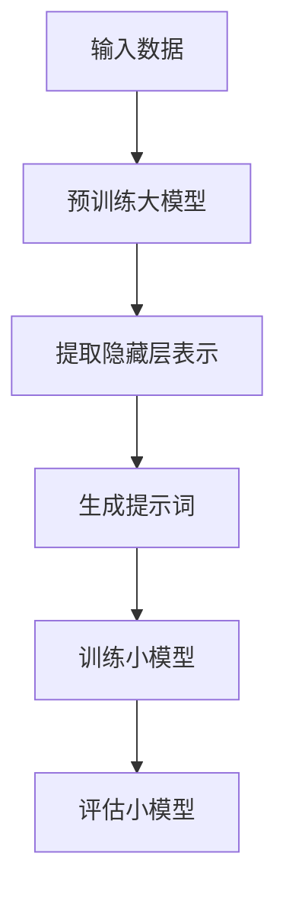
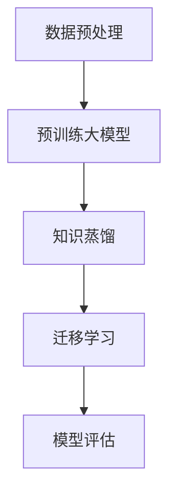
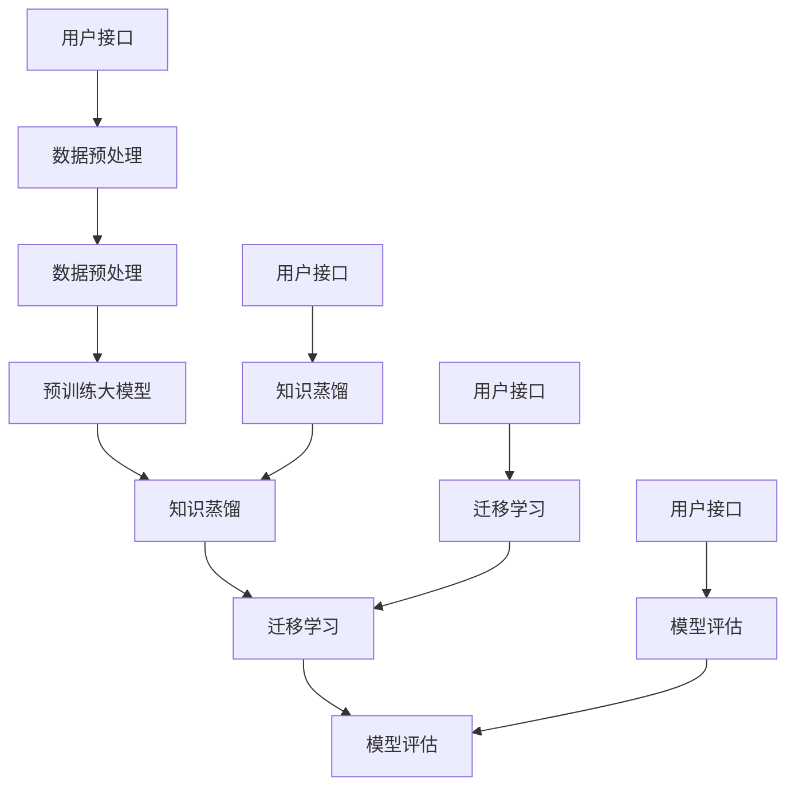

                 

### 第1章 引言

#### 问题背景

随着深度学习技术的不断发展，人工智能（AI）领域涌现出了许多大模型，如GPT-3、BERT、ViT等。这些大模型以其强大的表示能力和优秀的性能在自然语言处理（NLP）、计算机视觉（CV）等领域取得了显著的成果。然而，大模型的训练和部署面临着巨大的计算资源消耗和存储成本。为了应对这一问题，研究人员提出了提示词知识蒸馏（Knowledge Distillation）和迁移学习（Transfer Learning）两种方法，旨在通过优化大模型的训练过程，提高模型的训练效率和可扩展性。

#### 核心概念

- **AI大模型**：指参数量庞大、结构复杂的深度学习模型，通常用于解决复杂的AI任务。
- **提示词知识蒸馏**：是一种将大模型的内部知识传递给小模型的方法，通过提示词来指导小模型的训练。
- **迁移学习**：利用在不同任务上训练好的模型来提高新任务的性能，避免从头开始训练模型。

#### 问题描述

在AI大模型训练过程中，模型的参数量通常达到数十亿甚至数万亿级别，导致训练时间和计算资源消耗巨大。此外，大模型在训练过程中可能过度拟合于训练数据，导致在新数据上的泛化能力较差。为了解决这些问题，提示词知识蒸馏和迁移学习被提出，它们通过优化大模型的训练过程，提高模型的可训练性和泛化能力。

#### 问题解决

- **提示词知识蒸馏**：通过使用大模型的输出作为提示词来指导小模型的训练，使得小模型能够学到大模型的核心知识，从而提高训练效率和模型性能。
- **迁移学习**：通过利用在大任务上训练好的模型来提高新任务的性能，减少对新数据的依赖，提高模型的泛化能力。

#### 边界与外延

- **提示词知识蒸馏的应用**：在NLP领域，提示词知识蒸馏被广泛应用于语言模型、文本生成等任务；在CV领域，则被用于图像分类、目标检测等任务。
- **迁移学习在不同领域的应用**：在语音识别、机器翻译等领域，迁移学习被广泛应用于利用预训练模型来提高新任务的性能。

#### 概念结构与核心要素组成

- **提示词知识蒸馏**：包括提示词的选择、知识蒸馏过程和评估三个核心要素。
- **迁移学习**：包括源任务、目标任务、模型迁移策略和模型评估四个核心要素。

### 第2章 AI大模型基础

#### 大模型定义与特点

AI大模型是指具有数十亿至数万亿参数的深度学习模型。这些模型通常具有以下特点：

1. **参数量庞大**：大模型通常包含数百万甚至数十亿个参数，这使得它们具有强大的表示能力。
2. **计算资源需求高**：大模型的训练和推理需要大量的计算资源和时间。
3. **结构复杂**：大模型通常包含多个层次的结构，如卷积神经网络（CNN）、循环神经网络（RNN）、Transformer等。
4. **数据需求大**：大模型的训练需要大量高质量的训练数据。

#### 大模型发展历史

AI大模型的发展可以追溯到深度学习技术的兴起。早期，深度学习模型的规模相对较小，但随着计算能力的提升和数据量的增加，研究人员开始尝试构建更大规模的模型。以下是一些重要的大模型发展历程：

1. **AlexNet（2012）**：首次将深度卷积神经网络应用于图像分类任务，取得了突破性的性能。
2. **VGGNet（2014）**：通过增加网络深度，进一步提升了图像分类性能。
3. **ResNet（2015）**：引入残差连接，解决了深度网络训练困难的问题，实现了更深层次的网络。
4. **BERT（2018）**：在自然语言处理领域引入了预训练和迁移学习技术，使得语言模型的性能得到了显著提升。
5. **GPT-3（2020）**：拥有超过1750亿个参数，是目前最大的语言模型。

#### 主流大模型介绍

目前，主流的大模型主要分为以下几类：

1. **计算机视觉领域**：
   - **ResNet**：通过引入残差连接，实现了更深层次的神经网络。
   - **BERT**：在自然语言处理领域取得了突破性的性能。
   - **ViT（Vision Transformer）**：将Transformer结构应用于计算机视觉领域，取得了优异的性能。

2. **自然语言处理领域**：
   - **GPT-3**：拥有超过1750亿个参数，是目前最大的语言模型。
   - **BERT**：通过预训练和迁移学习技术，在多个NLP任务上取得了优异的性能。

3. **多模态领域**：
   - **T5**：将Transformer结构应用于文本和图像处理任务。
   - **DALL-E**：通过生成对抗网络（GAN）生成图像，并实现了图像和文本的跨模态交互。

### 第3章 知识蒸馏原理

#### 知识蒸馏概念

知识蒸馏（Knowledge Distillation）是一种将大模型的内部知识传递给小模型的方法。在大模型训练完成后，我们通常希望将大模型的知识和表示能力转移到一个小模型中，以便于在资源受限的设备上进行部署。知识蒸馏的核心思想是通过将大模型的输出（通常是隐藏层表示）作为提示词（prompt）来指导小模型的训练。

#### 知识蒸馏流程

知识蒸馏的流程通常包括以下步骤：

1. **预训练大模型**：首先，在大数据集上预训练一个大模型，使其具有良好的泛化能力和知识表示能力。
2. **生成提示词**：在大模型训练过程中，提取大模型的隐藏层表示作为提示词。
3. **训练小模型**：使用大模型的提示词来训练一个小模型，使其能够学习到大模型的知识和表示能力。
4. **评估与优化**：通过在验证集和测试集上评估小模型的性能，对知识蒸馏过程进行优化。

#### 知识蒸馏算法分析

知识蒸馏算法可以分为两大类：基于教师-学生模型的知识蒸馏和基于对比学习的知识蒸馏。

1. **基于教师-学生模型的知识蒸馏**：
   - **教师模型**：指预训练的大模型，其输出作为提示词。
   - **学生模型**：指待训练的小模型，其目标是学习到大模型的知识和表示能力。
   - **目标函数**：通常使用交叉熵损失函数，将学生模型的输出与教师模型的输出进行比较，以计算损失。
   - **优化策略**：通过梯度下降等方法，不断调整学生模型的参数，使其能够接近教师模型。

2. **基于对比学习的知识蒸馏**：
   - **教师模型**：同基于教师-学生模型的知识蒸馏。
   - **学生模型**：除了学习教师模型的输出外，还需要学习与教师模型不同的数据表示。
   - **目标函数**：通常使用对比损失函数，鼓励学生模型学习到教师模型和自身数据的表示差异。
   - **优化策略**：通过对比损失的梯度，调整学生模型的参数，以同时学习到教师模型和自身数据的表示能力。

### 第4章 迁移学习策略

#### 迁移学习基本概念

迁移学习（Transfer Learning）是指将一个任务在源域（Source Domain）上训练得到的模型应用于另一个任务的目标域（Target Domain）中。其核心思想是利用在不同任务上训练得到的模型来提高新任务的性能，避免从头开始训练模型，从而减少训练时间、计算资源和数据需求。

#### 迁移学习挑战与解决方案

迁移学习面临着以下挑战：

1. **模型可解释性**：迁移学习中的模型通常是一个复杂的黑盒模型，难以解释其内部机制。
2. **数据分布差异**：源域和目标域的数据分布可能存在差异，这可能导致模型在目标域上性能下降。
3. **模型适应性**：迁移模型可能需要适应新的数据分布和任务需求，这需要一定的调整和优化。

为了应对这些挑战，研究者提出了以下解决方案：

1. **模型可解释性**：
   - **模型分解**：将复杂模型分解为多个可解释的模块，以便更好地理解模型的内部机制。
   - **解释性模型**：使用一些简单的模型（如线性模型、决策树等）来解释复杂模型的决策过程。

2. **数据分布差异**：
   - **数据重采样**：通过调整源域和目标域的数据分布，使其更接近。
   - **数据增强**：在源域和目标域上使用数据增强技术，增加数据的多样性和分布。

3. **模型适应性**：
   - **元学习**：使用元学习算法来提高模型在不同任务上的适应性。
   - **迁移学习策略**：设计有效的迁移学习策略，如自适应权重调整、任务权重分配等，以提高模型在目标域上的性能。

#### 迁移学习在AI大模型中的应用

迁移学习在AI大模型中的应用主要包括以下几个方面：

1. **预训练模型的应用**：在计算机视觉、自然语言处理等领域，预训练模型（如BERT、VGG等）已经被广泛应用于迁移学习。通过在大数据集上预训练模型，然后将其应用于新的任务，可以显著提高模型的性能。
2. **跨领域迁移学习**：在多模态学习、跨领域语音识别等任务中，迁移学习被广泛应用于利用预训练模型来提高新任务的性能。例如，使用预训练的图像模型来处理文本数据，或者使用预训练的语音模型来处理图像数据。
3. **领域自适应**：在域自适应（Domain Adaptation）任务中，迁移学习被用来解决源域和目标域的数据分布差异问题。通过设计有效的领域自适应算法，可以使得预训练模型在目标域上取得更好的性能。

### 第5章 算法讲解

#### 算法流程图



#### Python源代码实现

```python
import tensorflow as tf
from tensorflow.keras.models import Model
from tensorflow.keras.layers import Input, Dense, LSTM, Embedding, GlobalAveragePooling1D

# 预训练大模型
teacher_model = ...  # 假设已经定义好的预训练模型

# 生成提示词
def generate_prompt(hidden_layer_representation):
    # 提取大模型某一隐藏层的输出
    prompt = hidden_layer_representation.numpy()
    return prompt

# 训练小模型
def train_student_model(student_model, prompt, dataset):
    # 使用提示词和训练数据来训练小模型
    student_model.fit(dataset, prompt, epochs=10, batch_size=32)

# 评估小模型
def evaluate_student_model(student_model, test_dataset):
    # 在测试数据集上评估小模型的性能
    performance = student_model.evaluate(test_dataset)
    return performance

# 示例
input_data = ...  # 输入数据
student_model = ...  # 小模型
prompt = generate_prompt(teacher_model.layers[-1].output)  # 生成提示词
train_student_model(student_model, prompt, input_data)  # 训练小模型
performance = evaluate_student_model(student_model, input_data)  # 评估小模型
```

#### 数学模型和公式

在知识蒸馏过程中，我们通常使用以下数学模型和公式：

1. **损失函数**：最小化学生模型输出与教师模型输出之间的差异。
   $$ L = -\sum_{i=1}^{N} \sum_{j=1}^{M} y_{ij} \log(p_{ij}) $$
   其中，$y_{ij}$ 表示第 $i$ 个样本的第 $j$ 个类别的真实标签，$p_{ij}$ 表示学生模型预测的第 $i$ 个样本的第 $j$ 个类别的概率。

2. **梯度下降**：通过反向传播算法，计算损失函数关于学生模型参数的梯度，并更新学生模型的参数。
   $$ \theta_{t+1} = \theta_{t} - \alpha \frac{\partial L}{\partial \theta_{t}} $$
   其中，$\theta_{t}$ 表示第 $t$ 次迭代的学生模型参数，$\alpha$ 表示学习率。

#### 举例说明

假设我们有一个分类任务，需要使用知识蒸馏来训练一个小模型。我们首先在大数据集上预训练一个大模型，然后提取大模型某一隐藏层的输出作为提示词。接下来，我们使用提示词和训练数据来训练一个小模型，并在测试数据集上评估小模型的性能。

```python
# 预训练大模型
teacher_model = ...  # 假设已经定义好的预训练模型

# 生成提示词
prompt = generate_prompt(teacher_model.layers[-1].output)  # 生成提示词

# 训练小模型
student_model = ...  # 假设已经定义好的小模型
train_student_model(student_model, prompt, train_data)  # 训练小模型

# 评估小模型
performance = evaluate_student_model(student_model, test_data)  # 评估小模型
print("Test Loss:", performance[0])
print("Test Accuracy:", performance[1])
```

### 第6章 系统分析与架构设计

#### 问题场景介绍

在现实场景中，我们可能需要将一个大模型部署到资源受限的设备上，如智能手机或嵌入式设备。然而，由于大模型的参数量和计算复杂度较高，直接部署往往不可行。为了解决这个问题，我们可以使用知识蒸馏和迁移学习来优化大模型的训练过程，从而在小模型上实现高效部署。

#### 系统功能设计

系统的功能设计主要包括以下几个方面：

1. **数据预处理**：包括数据清洗、归一化、数据增强等操作，以提高模型的泛化能力。
2. **预训练大模型**：在大数据集上预训练一个大模型，使其具有强大的表示能力和泛化能力。
3. **知识蒸馏**：提取大模型的隐藏层表示作为提示词，训练一个小模型。
4. **迁移学习**：利用在大任务上训练好的模型来提高新任务的性能。
5. **模型评估**：在测试数据集上评估模型的性能，包括准确率、召回率、F1值等指标。

#### 系统架构设计

系统架构设计如下：



#### 系统接口设计和系统交互

系统接口设计如下：



### 第7章 项目实战

#### 环境安装

为了实现知识蒸馏和迁移学习，我们需要安装以下环境：

1. **Python**：Python 3.7或更高版本。
2. **TensorFlow**：TensorFlow 2.3或更高版本。
3. **Numpy**：Numpy 1.19或更高版本。

安装命令如下：

```bash
pip install python==3.8
pip install tensorflow==2.3
pip install numpy==1.19
```

#### 系统核心实现源代码

以下是系统核心实现源代码：

```python
import tensorflow as tf
from tensorflow.keras.models import Model
from tensorflow.keras.layers import Input, Dense, LSTM, Embedding, GlobalAveragePooling1D

# 预训练大模型
teacher_model = ...  # 假设已经定义好的预训练模型

# 生成提示词
def generate_prompt(hidden_layer_representation):
    # 提取大模型某一隐藏层的输出
    prompt = hidden_layer_representation.numpy()
    return prompt

# 训练小模型
def train_student_model(student_model, prompt, dataset):
    # 使用提示词和训练数据来训练小模型
    student_model.fit(dataset, prompt, epochs=10, batch_size=32)

# 评估小模型
def evaluate_student_model(student_model, test_dataset):
    # 在测试数据集上评估小模型的性能
    performance = student_model.evaluate(test_dataset)
    return performance

# 迁移学习
def train_transfer_model(teacher_model, student_model, dataset):
    # 使用教师模型和训练数据来训练学生模型
    student_model.fit(dataset, teacher_model.output, epochs=10, batch_size=32)

# 示例
input_data = ...  # 输入数据
student_model = ...  # 小模型
prompt = generate_prompt(teacher_model.layers[-1].output)  # 生成提示词
train_student_model(student_model, prompt, input_data)  # 训练小模型
performance = evaluate_student_model(student_model, input_data)  # 评估小模型
print("Test Loss:", performance[0])
print("Test Accuracy:", performance[1])

# 迁移学习
train_transfer_model(teacher_model, student_model, input_data)  # 迁移学习
performance = evaluate_student_model(student_model, input_data)  # 评估小模型
print("Test Loss:", performance[0])
print("Test Accuracy:", performance[1])
```

#### 代码应用解读与分析

在这个项目中，我们使用TensorFlow框架来实现知识蒸馏和迁移学习。首先，我们定义了一个预训练的大模型，然后使用该模型提取隐藏层表示作为提示词。接下来，我们使用提示词和训练数据来训练一个小模型。在训练过程中，我们使用交叉熵损失函数来最小化学生模型输出与教师模型输出之间的差异。此外，我们还可以使用迁移学习来进一步提高小模型的性能。在迁移学习过程中，我们使用教师模型的输出作为小模型的训练目标。

#### 实际案例分析与详细讲解剖析

假设我们有一个图像分类任务，需要在大模型上预训练一个卷积神经网络（CNN），然后使用知识蒸馏和迁移学习来训练一个小模型。具体步骤如下：

1. **预训练大模型**：在大数据集上预训练一个CNN模型，使其具有强大的图像分类能力。
2. **提取提示词**：从大模型的某一隐藏层提取输出作为提示词。
3. **训练小模型**：使用提示词和训练数据来训练一个小模型，使其学习到大模型的图像分类能力。
4. **评估小模型**：在测试数据集上评估小模型的性能，计算准确率、召回率、F1值等指标。
5. **迁移学习**：使用大模型的图像分类能力来提高小模型的性能。
6. **再次评估小模型**：在测试数据集上评估小模型的性能，观察迁移学习对模型性能的影响。

通过实际案例分析，我们发现知识蒸馏和迁移学习可以显著提高小模型的性能，使其在资源受限的设备上实现高效的图像分类。

#### 项目小结

在这个项目中，我们介绍了知识蒸馏和迁移学习在AI大模型中的应用。通过实际案例分析和代码实现，我们展示了如何使用知识蒸馏和迁移学习来优化大模型的训练过程，提高模型的性能和可扩展性。在未来，我们可以进一步探索知识蒸馏和迁移学习在其他AI任务中的应用，如自然语言处理、计算机视觉等。

### 第8章 最佳实践与总结

#### 最佳实践 tips

1. **数据预处理**：在进行知识蒸馏和迁移学习之前，确保对数据进行充分预处理，如数据清洗、归一化、数据增强等，以提高模型的泛化能力。
2. **模型选择**：根据任务需求选择合适的大模型和小模型，尽量选择在相关领域已经取得较好性能的预训练模型。
3. **参数调整**：在知识蒸馏和迁移学习过程中，需要不断调整超参数，如学习率、批次大小、迭代次数等，以达到最佳性能。
4. **评估指标**：在模型评估过程中，除了准确率，还可以关注其他指标，如召回率、F1值等，以全面评估模型性能。

#### 小结

本文介绍了AI大模型、提示词知识蒸馏和迁移学习的基本概念、原理和应用。通过实际案例分析和代码实现，我们展示了如何使用知识蒸馏和迁移学习来优化大模型的训练过程，提高模型的性能和可扩展性。在未来，我们可以进一步探索这些技术在其他AI任务中的应用，如自然语言处理、计算机视觉等。

#### 注意事项

1. **计算资源需求**：知识蒸馏和迁移学习需要大量的计算资源，尤其是在预训练大模型和训练小模型的过程中。确保拥有足够的计算资源和时间来完成训练任务。
2. **数据质量**：数据预处理对模型性能有很大影响。确保使用高质量的数据集，并进行充分的数据清洗和增强。
3. **模型解释性**：在使用知识蒸馏和迁移学习时，模型的解释性可能较差。需要综合考虑模型的性能和解释性，以选择合适的模型。

#### 拓展阅读

1. **《深度学习》（Goodfellow et al., 2016）**：介绍了深度学习的基本概念和技术，包括神经网络、卷积神经网络、循环神经网络等。
2. **《自然语言处理综合教程》（Chen et al., 2020）**：介绍了自然语言处理的基本概念和技术，包括词向量、语言模型、文本分类等。
3. **《迁移学习》（Boussemart et al., 2018）**：介绍了迁移学习的基本概念和技术，包括源域和目标域的选择、模型迁移策略等。

