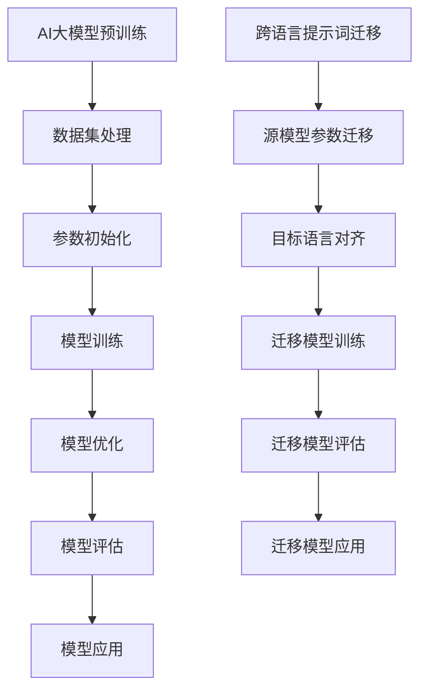

                 

## 文章标题

AI大模型的跨语言提示词迁移技术

> 关键词：AI大模型，跨语言提示词，迁移技术，神经网络，机器翻译，信息检索

> 摘要：本文将深入探讨AI大模型的跨语言提示词迁移技术，从背景介绍、核心概念与原理、训练与优化、应用场景、项目实战等方面，逐步分析这一技术的原理、方法和挑战，旨在为读者提供全面且深入的技术理解。

----------------------------------------------------------------

### 目录大纲设计思路

为了设计出一个详细且逻辑清晰的目录大纲，我们需要遵循以下几个步骤：

1. **确定总体结构**：根据书名《AI大模型的跨语言提示词迁移技术》，确定书籍的主要内容和结构。

2. **划分章节**：基于内容，划分出章节，每个章节要涵盖一定的主题。

3. **细化章节内容**：每个章节再细分出子章节，确保每个子章节都有明确的主题。

4. **核心概念与联系**：在相关章节中，明确核心概念及其相互联系，使用表格和流程图来帮助理解。

5. **算法原理讲解**：对于算法相关章节，使用mermaid绘制流程图，并用Python代码和LaTeX公式详细阐述。

6. **系统分析与架构设计方案**：设计系统架构和接口设计等相关章节，使用mermaid类图和序列图来展示。

7. **项目实战**：在实战章节中，提供环境安装、核心实现源代码，并对代码和应用进行解读分析。

8. **最佳实践 tips、小结**：在每个章节的最后，提供一些最佳实践、小结和注意事项，帮助读者巩固知识。

### 目录大纲结构

以下是按照上述设计思路设计的《AI大模型的跨语言提示词迁移技术》的目录大纲：

----------------------------------------------------------------

# 第一部分: 背景介绍

## 第1章: AI大模型与跨语言提示词迁移技术概述

### 1.1 问题背景

#### 1.1.1 人工智能的发展现状

#### 1.1.2 大模型的优势与挑战

#### 1.1.3 跨语言提示词迁移技术的意义

### 1.2 问题描述

#### 1.2.1 跨语言提示词迁移的问题

#### 1.2.2 跨语言提示词迁移的难点

#### 1.2.3 跨语言提示词迁移的目标

### 1.3 问题解决

#### 1.3.1 大模型的训练与优化

#### 1.3.2 跨语言提示词迁移的策略

#### 1.3.3 边界与外延

### 1.4 概念结构与核心要素组成

#### 1.4.1 AI大模型的核心要素

#### 1.4.2 跨语言提示词迁移的核心要素

#### 1.4.3 概念属性特征对比表格

### 1.5 本章小结

----------------------------------------------------------------

# 第二部分: 核心概念与原理

## 第2章: AI大模型的基本原理

### 2.1 AI大模型的基础理论

#### 2.1.1 神经网络的基本原理

#### 2.1.2 神经网络的训练过程

#### 2.1.3 神经网络的应用领域

### 2.2 大模型的架构设计

#### 2.2.1 大模型的层次结构

#### 2.2.2 大模型的优化策略

#### 2.2.3 大模型的训练与推断

### 2.3 跨语言提示词迁移技术

#### 2.3.1 跨语言提示词的概念

#### 2.3.2 跨语言提示词迁移的挑战

#### 2.3.3 跨语言提示词迁移的方法

### 2.4 本章小结

----------------------------------------------------------------

## 第3章: AI大模型的训练与优化

### 3.1 大模型训练的基本步骤

#### 3.1.1 数据预处理

#### 3.1.2 模型选择

#### 3.1.3 模型训练

#### 3.1.4 模型评估

### 3.2 大模型优化的策略

#### 3.2.1 学习率调度策略

#### 3.2.2 正则化技术

#### 3.2.3 模型压缩与加速

### 3.3 跨语言提示词迁移的优化

#### 3.3.1 跨语言训练策略

#### 3.3.2 提示词迁移的评估方法

#### 3.3.3 提示词迁移的优化技术

### 3.4 本章小结

----------------------------------------------------------------

## 第4章: 跨语言提示词迁移的应用场景

### 4.1 跨语言机器翻译

#### 4.1.1 跨语言机器翻译的基本原理

#### 4.1.2 跨语言机器翻译的应用场景

#### 4.1.3 跨语言机器翻译的挑战与解决方案

### 4.2 跨语言信息检索

#### 4.2.1 跨语言信息检索的基本原理

#### 4.2.2 跨语言信息检索的应用场景

#### 4.2.3 跨语言信息检索的挑战与解决方案

### 4.3 其他应用场景

#### 4.3.1 跨语言问答系统

#### 4.3.2 跨语言文本生成

#### 4.3.3 跨语言情感分析

### 4.4 本章小结

----------------------------------------------------------------

## 第5章: 项目实战

### 5.1 环境安装

#### 5.1.1 开发环境搭建

#### 5.1.2 数据集准备

### 5.2 系统核心实现

#### 5.2.1 模型训练与优化

#### 5.2.2 提示词迁移与评估

### 5.3 应用案例分析与解读

#### 5.3.1 跨语言机器翻译应用案例

#### 5.3.2 跨语言信息检索应用案例

### 5.4 项目小结

### 5.5 最佳实践 tips

#### 5.5.1 数据集选择

#### 5.5.2 模型优化策略

#### 5.5.3 跨语言提示词迁移技巧

----------------------------------------------------------------

### 1.1 人工智能的发展现状

人工智能（Artificial Intelligence, AI）作为计算机科学的一个分支，自20世纪50年代诞生以来，经历了多次起伏和变革。近年来，随着计算能力的提升、海量数据的积累以及深度学习算法的突破，人工智能迎来了新一轮的发展高潮。

在过去的几十年中，人工智能从最初的规则驱动和知识表示，逐渐发展到以数据驱动为主的深度学习时代。深度学习利用多层神经网络来学习和提取数据中的特征，显著提升了机器在各种任务上的表现。特别是在图像识别、语音识别、自然语言处理等领域，深度学习模型已经达到了甚至超越了人类水平。

目前，人工智能的应用场景已经广泛覆盖了各个领域，包括医疗、金融、交通、零售、教育等。在医疗领域，AI技术被用于疾病诊断、药物研发和健康监控；在金融领域，AI被用于风险管理、信用评估和自动化交易；在交通领域，AI被用于智能交通系统、自动驾驶和交通流量预测。

总体来看，人工智能的发展呈现出以下几个趋势：

1. **大模型的兴起**：随着数据量的不断增大，研究人员开始使用更大规模的模型来训练，这些大模型在处理复杂任务时表现出了更好的性能。

2. **多模态学习**：AI技术不再局限于单一数据类型，而是开始结合文本、图像、语音等多种模态进行综合处理，实现更加智能化和个性化的应用。

3. **自主学习和推理**：传统的AI系统依赖于大量标记数据进行训练，而当前的研究趋势是开发能够自主学习和推理的模型，减少对人类标记数据的依赖。

4. **边缘计算与分布式AI**：为了满足实时性和计算资源限制的需求，边缘计算和分布式AI技术逐渐成为研究热点。

5. **伦理和法律规范**：随着AI技术的广泛应用，其伦理和法律问题也日益受到关注，需要制定相应的规范来保障AI技术的健康发展。

大模型的优势在于能够处理大量数据，提取深层特征，并在各种复杂任务上表现出色。然而，大模型的训练和优化也面临着巨大的挑战，包括计算资源的需求、模型的解释性和可解释性等。本文将重点探讨如何利用大模型进行跨语言提示词的迁移，解决人工智能领域中的关键问题。

### 1.2 大模型的优势与挑战

大模型（Large Models）在人工智能领域正迅速崛起，其强大的数据处理能力和复杂任务解决能力引起了广泛关注。大模型的优势主要体现在以下几个方面：

1. **强大的数据处理能力**：大模型能够处理海量的数据，从大量数据中提取出深层特征，从而提高模型在复杂任务上的性能。例如，大型语言模型能够从数百万篇文章中学习语言模式和语法规则，从而在文本生成、翻译和问答等任务上表现出色。

2. **自适应性和泛化能力**：大模型具有强大的自适应性和泛化能力，能够在不同的任务和数据集上表现出良好的性能。这意味着，一旦一个大规模模型在一个领域内被训练和优化，它可以在其他相关领域内快速应用。

3. **提高任务性能**：大模型通常能够在各种复杂任务上达到甚至超越人类水平，特别是在图像识别、自然语言处理和语音识别等领域。例如，在ImageNet图像识别比赛中，一些大模型已经达到了99%以上的准确率。

尽管大模型具有显著的优势，但在实际应用中也面临着一些挑战：

1. **计算资源需求**：大模型的训练和推理通常需要大量的计算资源，包括高性能的CPU和GPU。这不仅增加了成本，也限制了模型在实际应用中的部署。

2. **存储需求**：大模型的存储需求也非常高，因为它们需要保存大量的权重和参数。这增加了存储设备的需求和成本。

3. **模型解释性**：大模型的黑箱性质使得其决策过程难以解释，这对需要透明性和可解释性的应用场景构成了挑战。例如，在医疗诊断和金融风险评估等关键领域，模型的决策过程需要被清晰地理解和验证。

4. **数据隐私和安全**：大模型通常需要大量数据进行训练，这些数据可能涉及个人隐私和敏感信息。如何保护数据隐私和安全，避免数据泄露，是当前研究的热点问题。

5. **优化和调参难度**：大模型的优化和调参过程非常复杂，需要大量的实验和计算资源。如何有效地优化模型，提高其性能，是一个具有挑战性的问题。

综上所述，大模型在人工智能领域具有巨大的潜力和应用前景，但同时也面临着一系列的挑战。解决这些挑战，需要结合多学科的知识，开发新的算法和技术，以充分利用大模型的优势，推动人工智能的进一步发展。

### 1.3 跨语言提示词迁移技术的意义

跨语言提示词迁移技术（Cross-Lingual Prompt Transfer Technology）是人工智能领域的一项重要研究方向，其核心目标是通过迁移学习的方式，将一种语言的提示词（Prompt）应用到另一种语言的任务中，以提升跨语言任务的处理能力。这项技术具有重要的理论和实际意义：

首先，跨语言提示词迁移技术能够显著提高跨语言任务的处理效率。在传统的跨语言任务中，例如机器翻译和信息检索，通常需要为每种语言设计独立的模型。这不仅增加了计算资源的消耗，也限制了任务的泛化能力。通过跨语言提示词迁移技术，可以在训练一种语言模型的基础上，将提示词迁移到其他语言，实现多语言任务的统一处理。这样不仅简化了模型的设计和训练过程，还能够节省大量的计算资源和时间。

其次，这项技术在多语言环境中具有广泛的应用前景。随着全球化的深入发展，各种多语言信息交流日益频繁。例如，在国际贸易、国际合作和跨国企业运营中，多语言信息处理成为必不可少的环节。跨语言提示词迁移技术能够为这些场景提供高效、准确的多语言处理解决方案，提升国际交流和合作的效率。

再次，跨语言提示词迁移技术有助于促进自然语言处理（NLP）技术的发展。自然语言处理的核心目标是让计算机能够理解和处理人类语言。跨语言提示词迁移技术通过在不同语言之间进行迁移学习，能够增强模型的跨语言理解和表达能力，从而推动NLP技术的进步。这对于解决复杂的多语言问题，如跨语言问答、文本生成和情感分析等，具有重要意义。

此外，跨语言提示词迁移技术还能够帮助解决数据不平衡问题。在许多多语言任务中，某些语言的数据量远大于其他语言，导致模型对某些语言的表现不佳。通过跨语言提示词迁移，可以充分利用数据丰富的语言模型，提高数据稀缺语言模型的性能，实现各语言任务之间的性能均衡。

总的来说，跨语言提示词迁移技术在提高跨语言任务处理效率、促进多语言环境应用、推动NLP技术发展和解决数据不平衡问题等方面具有深远的影响。随着研究的深入和技术的进步，跨语言提示词迁移技术将在人工智能领域发挥越来越重要的作用。

### 1.4 问题描述

在深入探讨AI大模型的跨语言提示词迁移技术之前，我们需要明确这一问题的主要内容和挑战。具体来说，跨语言提示词迁移技术主要涉及以下几个方面：

1. **跨语言提示词的定义**：提示词（Prompt）是指用于引导模型进行特定任务的语言提示或输入。在自然语言处理任务中，提示词能够显著影响模型的生成结果。跨语言提示词是指在不同语言环境下使用的提示词，其目的是在一种语言的模型基础上，引导模型进行跨语言的推理和生成。

2. **迁移学习的基本概念**：迁移学习（Transfer Learning）是一种利用已知任务的知识来解决新任务的方法。在跨语言提示词迁移中，通过迁移学习，将一种语言的提示词和模型参数迁移到另一种语言，以提高跨语言任务的表现。

3. **主要问题**：跨语言提示词迁移主要面临以下问题：
   - **语言差异**：不同语言之间在词汇、语法和语义上存在显著差异，这给提示词的迁移带来了挑战。
   - **数据稀缺**：在许多跨语言任务中，某些语言的数据量远远小于其他语言，导致模型在数据稀缺语言上的性能不佳。
   - **模型解释性**：大模型的黑箱性质使得其决策过程难以解释，这在需要模型透明性和可解释性的跨语言任务中是一个关键问题。

4. **难点**：
   - **跨语言语义匹配**：如何确保迁移的提示词在不同语言中具有相同或相似的含义，是跨语言提示词迁移的关键难点。
   - **迁移策略优化**：如何设计有效的迁移策略，使得迁移后的模型能够在多种语言上表现出色，是另一个重要挑战。
   - **模型泛化能力**：如何在确保模型在目标语言上的表现的同时，不损害其在源语言上的性能，是跨语言提示词迁移中的核心问题。

5. **目标**：跨语言提示词迁移的主要目标是实现多语言任务的高效、准确处理，具体包括：
   - **提高跨语言任务的处理效率**：通过迁移学习，减少对独立模型的依赖，实现多语言任务的统一处理。
   - **平衡语言性能**：通过迁移学习，提升数据稀缺语言模型的性能，实现不同语言任务之间的性能均衡。
   - **增强模型解释性**：在保证模型性能的同时，提高模型的透明度和可解释性，满足特定应用场景的需求。

通过明确这些问题和难点，我们可以更好地理解跨语言提示词迁移技术的核心目标，为后续章节的深入探讨奠定基础。

### 1.5 问题解决

为了解决跨语言提示词迁移中的核心问题，需要从多个方面进行综合性的研究和实践。以下是一些主要的方法和技术：

1. **大模型的训练与优化**：
   - **数据增强**：通过数据增强技术，如同义词替换、语法变换和翻译语料库扩展，增加训练数据的多样性和丰富性，从而提高模型的泛化能力。
   - **迁移学习**：利用预训练的大模型，如BERT、GPT等，作为基础模型，通过在目标语言的数据集上微调（Fine-Tuning），使模型能够在新的语言环境中快速适应。

2. **跨语言提示词迁移的策略**：
   - **共享嵌入**：通过跨语言词嵌入技术，将不同语言的词汇映射到同一嵌入空间中，从而实现语言的语义匹配。
   - **跨语言对齐**：通过跨语言对齐算法，如翻译矩阵（Translation Matrix）和注意力机制（Attention Mechanism），确保迁移的提示词在不同语言中具有相同或相似的含义。

3. **迁移策略优化**：
   - **多任务学习**：通过多任务学习（Multi-Task Learning）框架，将跨语言任务与其他相关任务相结合，共享知识，提高模型的迁移性能。
   - **迁移评估方法**：设计有效的评估方法，如BLEU、METEOR和ROUGE等，用于评估迁移模型的性能，以便及时调整和优化迁移策略。

4. **模型泛化能力**：
   - **元学习（Meta-Learning）**：利用元学习算法，如MAML（Model-Agnostic Meta-Learning）和Reptile，快速适应新的语言环境，提高模型的泛化能力。
   - **少样本学习**：通过设计能够在少量样本上快速学习的模型，如小样本学习（Few-Shot Learning）和迁移学习（Few-Shot Transfer Learning），增强模型在数据稀缺语言上的性能。

5. **模型解释性**：
   - **可解释性模型**：开发可解释的模型结构，如基于规则的方法和可解释的神经网络结构，使模型的决策过程更加透明。
   - **可视化技术**：利用可视化技术，如热力图和注意力可视化，展示模型的内部工作过程，提高模型的可解释性。

通过这些方法和技术，我们可以有效地解决跨语言提示词迁移中的核心问题，提高模型在多语言环境下的性能和解释性，从而实现跨语言任务的高效、准确处理。

### 1.6 概念结构与核心要素组成

在探讨AI大模型的跨语言提示词迁移技术时，明确相关概念和其核心要素组成是非常重要的。以下将介绍AI大模型、跨语言提示词迁移技术及其核心要素，并使用对比表格和流程图来帮助读者更好地理解。

#### 1.6.1 AI大模型

AI大模型是指具有大规模参数和广泛知识表示能力的深度学习模型。其核心要素包括：

- **大规模参数**：大模型通常包含数亿甚至千亿级别的参数，这使得它们能够捕捉到数据中的复杂模式和特征。
- **预训练**：大模型通过在大量数据上进行预训练，如文本、图像、语音等，从而获得强大的通用知识和表征能力。
- **层次化结构**：大模型通常采用层次化的结构，如Transformer、BERT等，这些结构能够有效处理长文本和复杂关系。

#### 1.6.2 跨语言提示词迁移技术

跨语言提示词迁移技术是指将一种语言的提示词和模型参数迁移到另一种语言，以提高跨语言任务的处理能力。其核心要素包括：

- **迁移学习**：通过迁移学习，将源语言的模型知识应用到目标语言中，减少对独立模型的依赖。
- **跨语言对齐**：使用跨语言对齐算法，如翻译矩阵和注意力机制，确保提示词在不同语言中具有相似含义。
- **多任务学习**：通过多任务学习框架，将跨语言任务与其他相关任务结合，共享知识，提高迁移效果。

#### 1.6.3 概念属性特征对比表格

| 概念              | AI大模型                         | 跨语言提示词迁移技术                      |
|------------------|----------------------------------|-----------------------------------------|
| 大规模参数        | 数亿至千亿级别参数               | 迁移源模型的参数到目标语言                 |
| 预训练            | 在多种数据集上预训练             | 利用预训练模型进行迁移学习                |
| 层次化结构        | 采用层次化神经网络结构           | 利用跨语言对齐和注意力机制实现提示词迁移   |
| 迁移学习          | 将知识迁移到新任务               | 在不同语言间迁移提示词和模型参数           |
| 跨语言对齐        | 无需专门对齐，但有助于性能提升   | 使用翻译矩阵和注意力机制实现语义对齐       |
| 多任务学习        | 提高模型在不同任务上的泛化能力   | 通过共享知识提高跨语言任务的处理能力       |

#### 1.6.4 Mermaid流程图

为了更直观地展示AI大模型和跨语言提示词迁移技术的流程，我们可以使用Mermaid绘制一个简单的流程图：



这个流程图展示了从AI大模型预训练到跨语言提示词迁移的整个过程，包括数据集处理、模型训练、优化和评估等步骤，以及迁移模型的训练和应用。

通过明确概念结构和核心要素，并使用对比表格和流程图，我们可以更好地理解AI大模型和跨语言提示词迁移技术，为后续章节的深入探讨奠定基础。

### 1.7 本章小结

本章从背景介绍出发，探讨了AI大模型与跨语言提示词迁移技术的意义和核心问题。我们首先介绍了人工智能的发展现状，分析了大模型的优势与挑战，并阐述了跨语言提示词迁移技术的意义。接着，我们明确了跨语言提示词迁移的问题和难点，并提出了一系列解决方案，包括大模型的训练与优化、跨语言提示词迁移的策略优化和模型泛化能力的提升。此外，通过概念结构与核心要素对比表格和流程图，我们对AI大模型和跨语言提示词迁移技术有了更深入的理解。本章的内容为后续章节的深入讨论奠定了坚实的基础，也为读者提供了一个全面的技术视角。

## 第2章: AI大模型的基本原理

### 2.1 AI大模型的基础理论

AI大模型（Large Artificial Intelligence Models）在当前的人工智能研究中占据着核心地位。其基础理论主要涉及神经网络的基本原理、训练过程和应用领域。以下是这些关键概念的详细探讨。

#### 2.1.1 神经网络的基本原理

神经网络（Neural Networks）是模仿人脑神经元连接方式的一种计算模型。它由大量相互连接的神经元（或节点）组成，每个神经元可以接收多个输入信号，通过加权求和后，经过激活函数产生输出。神经网络的核心组件包括：

- **神经元**：神经网络的基本单元，用于接收和处理输入信号。
- **层**：神经网络由输入层、隐藏层和输出层组成。隐藏层可以是单层或多层。
- **权重**：神经元之间的连接强度，用于调节输入信号的影响。
- **偏置**：每个神经元的一个固定输入值，用于调整神经元的阈值。
- **激活函数**：用于引入非线性因素，常见的有Sigmoid、ReLU、Tanh等。

神经网络的训练过程是通过调整权重和偏置，使得网络对输入数据的预测尽可能准确。训练过程中主要包括以下几个步骤：

1. **前向传播（Forward Propagation）**：输入数据通过网络，每个神经元计算其输出。
2. **损失函数（Loss Function）**：计算实际输出与预期输出之间的差异，常用的有均方误差（MSE）、交叉熵（Cross Entropy）等。
3. **反向传播（Back Propagation）**：利用梯度下降算法，通过反向传播误差信号，更新网络权重和偏置。
4. **优化算法**：如梯度下降（Gradient Descent）、Adam优化器等，用于加速收敛和避免局部最优。

#### 2.1.2 神经网络的训练过程

神经网络的训练过程可以分为以下几个阶段：

1. **数据预处理**：将输入数据标准化，如归一化、缩放等，以优化训练过程。
2. **模型初始化**：初始化权重和偏置，常用的方法有随机初始化、高斯分布初始化等。
3. **前向传播**：将输入数据输入到网络，计算输出。
4. **损失计算**：使用损失函数计算实际输出与预期输出之间的差异。
5. **反向传播**：计算梯度，并更新权重和偏置。
6. **迭代训练**：重复以上步骤，直到模型达到预定的训练目标。

训练过程中，需要选择合适的模型结构、损失函数和优化算法。此外，为了防止过拟合，可以采用正则化技术，如L1、L2正则化，Dropout等。

#### 2.1.3 神经网络的应用领域

神经网络在多个领域取得了显著的成果，其主要应用领域包括：

1. **图像识别**：神经网络被广泛用于图像分类、目标检测和图像分割等任务。卷积神经网络（CNN）和Transformer等结构在图像处理领域表现出色。
2. **自然语言处理（NLP）**：神经网络在文本分类、机器翻译、情感分析等任务中发挥了重要作用。基于Transformer的语言模型（如BERT、GPT）在NLP任务中取得了突破性进展。
3. **语音识别**：神经网络被用于语音信号的建模和识别，使自动语音识别（ASR）系统取得了显著性能提升。
4. **推荐系统**：神经网络被用于构建推荐模型，通过学习用户的兴趣和行为模式，为用户推荐感兴趣的内容。
5. **游戏和机器人**：神经网络被用于训练智能体进行游戏和机器人控制，如AlphaGo在围棋比赛中的表现。

总之，神经网络作为人工智能的基础理论，其训练过程和应用领域涵盖了广泛的问题，是当前AI研究的重要方向。

### 2.2 大模型的架构设计

大模型的架构设计是理解和应用AI大模型的关键。在神经网络的基础上，大模型的架构设计需要考虑参数规模、层次结构、优化策略等多个方面，以实现高效、准确的模型训练与推断。以下将详细探讨大模型的架构设计，包括层次结构、优化策略和训练与推断过程。

#### 2.2.1 大模型的层次结构

大模型的层次结构是其能够处理复杂任务的基础。常见的层次结构包括单层神经网络、多层神经网络以及层次化模型。

1. **单层神经网络**：单层神经网络通常包含输入层、输出层和隐藏层，每个层由多个神经元组成。这种结构简单，计算效率较高，但在处理复杂任务时可能存在过拟合问题。
   
2. **多层神经网络**：多层神经网络通过增加隐藏层，使模型能够学习到更复杂的特征。常见的多层神经网络结构有深度神经网络（Deep Neural Network, DNN）和卷积神经网络（Convolutional Neural Network, CNN）。深度神经网络通过增加隐藏层，使模型能够捕捉到数据中的深层特征；卷积神经网络通过卷积操作，能够高效地处理图像等结构化数据。

3. **层次化模型**：层次化模型通过分层的方式，将任务分解为多个子任务。例如，在自然语言处理中，可以先将文本分解为句子，再将句子分解为单词，从而实现更精细化的处理。

#### 2.2.2 大模型的优化策略

大模型的优化策略是确保模型在训练过程中收敛到最优解的关键。以下是一些常见的优化策略：

1. **学习率调度策略**：学习率是模型训练过程中一个重要的参数，其值的大小直接影响模型的收敛速度和最终性能。常见的学习率调度策略有固定学习率、学习率衰减、余弦退火等。其中，固定学习率适用于小规模模型，而学习率衰减和余弦退火等策略更适合大规模模型。

2. **正则化技术**：正则化技术通过在损失函数中添加正则项，防止模型过拟合。常见的正则化技术有L1正则化、L2正则化和Dropout。L1正则化和L2正则化通过增加模型复杂性的惩罚项，降低模型的复杂度；Dropout通过随机屏蔽神经元，减少模型的依赖性，提高模型的泛化能力。

3. **模型压缩与加速**：大规模模型的训练和推断过程通常需要大量的计算资源。为了提高计算效率，可以采用模型压缩和加速技术。常见的模型压缩技术有模型剪枝（Model Pruning）和量化（Quantization）。模型剪枝通过去除不重要的神经元和连接，减少模型的大小和参数数量；量化通过将浮点数参数转换为低精度的整数表示，降低计算复杂度和存储需求。

4. **分布式训练**：大规模模型的训练通常需要分布式计算资源。分布式训练通过将模型和数据分布到多个计算节点上，利用并行计算和通信优化，提高模型的训练速度和效率。

#### 2.2.3 大模型的训练与推断

大模型的训练与推断过程是模型应用的关键步骤。以下将详细探讨这两个过程：

1. **大模型的训练过程**：

   - **数据预处理**：在训练过程中，需要对输入数据进行预处理，包括数据清洗、归一化和数据增强等。
   - **模型初始化**：初始化模型参数，常用的方法有随机初始化、预训练模型初始化等。
   - **前向传播**：将输入数据输入到模型，计算输出。
   - **损失计算**：计算输出与预期输出之间的差异，使用损失函数进行衡量。
   - **反向传播**：计算梯度，并更新模型参数。
   - **迭代训练**：重复以上步骤，直到模型达到预定的训练目标。

2. **大模型的推断过程**：

   - **输入预处理**：对输入数据进行预处理，使其符合模型的输入要求。
   - **模型推理**：将预处理后的输入数据输入到训练好的模型，进行推理计算。
   - **输出生成**：根据模型的输出，生成预测结果。

在训练和推断过程中，需要选择合适的优化策略和算法，确保模型能够在不同数据集上取得良好的性能。同时，还需要进行模型的评估和调优，以进一步提升模型的性能和应用效果。

综上所述，大模型的架构设计需要综合考虑层次结构、优化策略和训练与推断过程。通过合理的架构设计，可以有效地提高大模型的性能和效率，推动人工智能技术的发展。

### 2.3 跨语言提示词迁移技术

跨语言提示词迁移技术是自然语言处理领域的一项重要研究课题，其核心目标是通过迁移学习的方式，将一种语言的提示词（Prompt）应用于另一种语言的任务中，以提高跨语言任务的处理能力。以下将详细探讨跨语言提示词的定义、跨语言提示词迁移的挑战和现有的方法。

#### 2.3.1 跨语言提示词的概念

提示词（Prompt）是指用于引导模型进行特定任务的语言提示或输入。在自然语言处理（NLP）任务中，提示词能够显著影响模型的生成结果。例如，在文本生成任务中，合适的提示词可以帮助模型生成更加准确和流畅的文本。跨语言提示词（Cross-Lingual Prompt）则是指在不同语言环境下使用的提示词，其目标是在一种语言的模型基础上，引导模型进行跨语言的推理和生成。

跨语言提示词具有以下特点：

1. **多语言适用性**：跨语言提示词需要能够适应多种语言环境，确保在不同语言中具有相同或相似的含义。
2. **语义一致性**：跨语言提示词在不同语言中需要保持语义一致性，以确保模型的推理和生成结果准确。
3. **灵活性**：跨语言提示词需要具有一定的灵活性，能够根据不同语言环境进行调整和优化。

#### 2.3.2 跨语言提示词迁移的挑战

跨语言提示词迁移技术面临以下主要挑战：

1. **语言差异**：不同语言在词汇、语法和语义上存在显著差异。例如，某些词汇在不同语言中的翻译可能存在多义性，导致提示词的含义不明确。此外，语法结构的不同也会影响提示词的使用和模型的理解。

2. **数据稀缺**：在许多跨语言任务中，某些语言的数据量远小于其他语言，导致模型在数据稀缺语言上的性能不佳。数据稀缺问题使得跨语言提示词迁移技术难以充分利用数据丰富的语言模型，从而提高数据稀缺语言模型的性能。

3. **模型解释性**：大模型的黑箱性质使得其决策过程难以解释，这在需要模型透明性和可解释性的跨语言任务中是一个关键问题。特别是在医疗诊断、金融风险评估等关键领域，模型的决策过程需要被清晰地理解和验证。

4. **迁移策略优化**：如何设计有效的迁移策略，使得迁移后的模型在多种语言上表现出色，是跨语言提示词迁移技术的核心挑战。现有的迁移策略需要进一步优化和改进，以提高跨语言任务的处理能力。

#### 2.3.3 跨语言提示词迁移的方法

为了应对上述挑战，研究人员提出了多种跨语言提示词迁移方法，主要包括以下几种：

1. **共享嵌入**：共享嵌入（Shared Embeddings）方法通过将不同语言的词汇映射到同一嵌入空间中，实现跨语言的语义匹配。这种方法的核心思想是利用预训练的语言模型，将源语言和目标语言的词汇嵌入到同一个低维空间中，从而实现跨语言的理解和生成。常见的共享嵌入方法包括翻译矩阵（Translation Matrix）和交叉语言嵌入（Cross-Lingual Embeddings）。

2. **跨语言对齐**：跨语言对齐（Cross-Lingual Alignment）方法通过确保源语言和目标语言中的提示词具有相同或相似的含义，实现跨语言提示词的迁移。常见的跨语言对齐方法包括基于翻译矩阵的方法和基于注意力机制的方法。其中，翻译矩阵方法通过学习一个翻译矩阵，将源语言的提示词映射到目标语言中；注意力机制方法通过引入注意力机制，使模型能够自动对齐源语言和目标语言的提示词。

3. **多任务学习**：多任务学习（Multi-Task Learning）方法通过将跨语言任务与其他相关任务结合，共享知识，提高模型的迁移性能。多任务学习能够利用跨语言任务之间的关联性，提高模型在多种语言上的性能。常见的方法包括任务共享（Task Sharing）和任务分离（Task Distillation）。

4. **迁移评估方法**：为了评估跨语言提示词迁移的效果，研究人员提出了多种迁移评估方法。这些方法包括BLEU、METEOR、ROUGE等常见的自动评估指标，以及人工评估和半监督评估方法。这些评估方法能够帮助研究人员分析模型的迁移性能，并指导进一步的优化。

通过上述方法，跨语言提示词迁移技术在一定程度上解决了语言差异、数据稀缺和模型解释性等挑战，提高了跨语言任务的处理能力。然而，这些方法仍需进一步优化和改进，以实现更高性能和更广泛的应用。

### 2.4 本章小结

本章深入探讨了AI大模型的基本原理，包括神经网络的基本原理、训练过程和应用领域。我们详细介绍了神经网络的基本结构、训练过程以及其在图像识别、自然语言处理等领域的应用。接着，我们讨论了大模型的架构设计，包括层次结构、优化策略和训练与推断过程。最后，我们介绍了跨语言提示词迁移技术的概念、挑战和现有方法。通过本章的学习，读者可以全面了解AI大模型的基础理论及其在实际应用中的关键问题。下一章我们将进一步探讨AI大模型的训练与优化策略。

## 第3章: AI大模型的训练与优化

### 3.1 大模型训练的基本步骤

AI大模型的训练是一个复杂的过程，涉及多个关键步骤，每个步骤都需要精心设计。以下是AI大模型训练的基本步骤，以及每个步骤的具体内容和注意事项。

#### 3.1.1 数据预处理

数据预处理是AI大模型训练的第一步，其目的是将原始数据转换为适合模型训练的形式。以下是一些关键的数据预处理步骤：

1. **数据清洗**：去除数据中的噪声和错误，如缺失值、异常值等。这一步骤可以使用填充、删除或插值等方法。
2. **数据归一化**：将数据标准化到相同的尺度，如通过缩放或归一化，使得不同特征之间的尺度差异减小。这有助于加速模型的收敛。
3. **数据增强**：通过添加噪声、旋转、裁剪等方式，增加数据的多样性，从而提高模型的泛化能力。常见的数据增强方法有随机裁剪、翻转、颜色抖动等。

注意事项：

- **保持数据的真实性**：数据预处理不能改变数据的真实性和分布，否则会误导模型的学习。
- **选择合适的方法**：不同的任务和数据集可能需要不同的预处理方法，需要根据具体情况进行选择。

#### 3.1.2 模型选择

在数据预处理完成后，需要选择一个适合任务的大模型。以下是一些常见的模型选择方法和注意事项：

1. **预训练模型**：使用已经在大规模数据上预训练的模型，如BERT、GPT等，作为基础模型。这种方法可以节省训练时间和计算资源，同时提高模型的性能。
2. **定制化模型**：在预训练模型的基础上，针对具体任务进行微调（Fine-Tuning），以适应特定任务的需求。定制化模型可以更好地理解和处理特定领域的数据。
3. **模型架构选择**：根据任务的特点，选择合适的模型架构。例如，对于图像识别任务，选择卷积神经网络（CNN）或Transformer架构；对于自然语言处理任务，选择基于Transformer的语言模型。

注意事项：

- **模型复杂度**：选择模型时，需要平衡模型的复杂度和计算资源。过于复杂的模型可能会导致过拟合和计算资源不足。
- **数据集大小**：在选择模型时，需要考虑数据集的大小。对于大型数据集，可以选择更复杂的模型；对于小型数据集，可以选择较为简单的模型。

#### 3.1.3 模型训练

模型训练是AI大模型训练的核心步骤，其目的是通过优化模型参数，使模型能够对输入数据进行准确的预测。以下是模型训练的具体步骤和注意事项：

1. **初始化参数**：初始化模型的参数，常见的初始化方法有随机初始化、高斯分布初始化等。合适的参数初始化可以提高模型的收敛速度和性能。
2. **前向传播**：将输入数据输入到模型中，计算模型的输出。前向传播过程包括将输入数据通过模型的各层，最终得到模型的预测结果。
3. **损失函数**：计算模型的输出与实际标签之间的差异，使用损失函数进行衡量。常用的损失函数有均方误差（MSE）、交叉熵（Cross Entropy）等。
4. **反向传播**：通过反向传播算法，计算模型参数的梯度，并更新模型的参数。反向传播过程是模型训练中最重要的步骤，其目的是优化模型参数，使模型能够更好地拟合数据。
5. **优化算法**：选择合适的优化算法，如梯度下降（Gradient Descent）、Adam优化器等，用于更新模型参数。优化算法的选择会影响模型的收敛速度和性能。

注意事项：

- **学习率调度**：学习率是优化过程中的一个重要参数，其值的大小会影响模型的收敛速度和性能。常见的学习率调度策略有固定学习率、学习率衰减、余弦退火等。
- **正则化技术**：为了避免过拟合，可以采用正则化技术，如L1正则化、L2正则化、Dropout等。正则化技术可以减少模型复杂度，提高模型的泛化能力。
- **训练过程监控**：在模型训练过程中，需要监控训练过程和模型性能，包括损失函数值、准确率等。通过监控，可以及时发现和解决训练过程中出现的问题。

#### 3.1.4 模型评估

模型评估是验证模型性能和选择最佳模型的重要步骤。以下是一些常见的模型评估方法和注意事项：

1. **交叉验证**：通过交叉验证方法，将数据集划分为多个子集，用于训练和验证模型。交叉验证可以提供更准确的模型性能估计，并减少过拟合的风险。
2. **测试集评估**：将训练好的模型在独立的测试集上进行评估，以验证模型的泛化能力。测试集评估结果可以用来选择最佳模型。
3. **性能指标**：根据任务的特点，选择合适的性能指标进行评估。常见的性能指标有准确率（Accuracy）、召回率（Recall）、F1分数（F1 Score）等。

注意事项：

- **避免过拟合**：在模型评估过程中，需要避免过拟合现象。可以通过交叉验证、正则化技术等方法来减少过拟合的风险。
- **公平评估**：在评估模型时，需要确保评估过程公平，避免因数据分布不均或评估方法不当导致评估结果偏差。

通过上述基本步骤，我们可以系统地训练AI大模型，提高模型的性能和泛化能力。在实际应用中，需要根据具体任务和数据集的特点，灵活调整和优化训练过程，以达到最佳效果。

### 3.2 大模型优化的策略

在大模型的训练过程中，优化策略起着至关重要的作用，它直接影响模型的收敛速度、训练效率和最终性能。以下将详细探讨几种常见的大模型优化策略，包括学习率调度策略、正则化技术和模型压缩与加速技术。

#### 3.2.1 学习率调度策略

学习率（Learning Rate）是影响模型训练过程中收敛速度和性能的关键参数。选择合适的学习率调度策略可以加快模型的收敛，同时避免过拟合和震荡。以下是一些常见的学习率调度策略：

1. **固定学习率**：这是最简单的学习率调度策略，整个训练过程中学习率保持不变。适用于模型复杂度较低且数据分布较为均匀的场景。

2. **学习率衰减**：随着训练的进行，学习率逐步减小，以防止模型过早收敛。学习率衰减可以分为以下几种形式：
   - **线性衰减**：学习率以线性方式递减，适用于早期训练阶段。
   - **指数衰减**：学习率以指数方式递减，适用于需要较长时间收敛的大型模型。

3. **余弦退火**：模拟物理退火过程，学习率先快速减小，然后逐渐趋于0。这种方法有助于在训练过程中更好地探索解空间，避免陷入局部最优。

4. **自适应学习率**：如Adam优化器，通过动态调整学习率，以适应不同阶段的训练需求。Adam优化器结合了梯度的一阶矩估计和二阶矩估计，能够在训练过程中自动调整学习率。

注意事项：
- **选择合适的学习率**：学习率的值需要根据具体任务和数据集进行选择，过大可能导致模型震荡，过小则可能导致训练时间过长。
- **调整学习率的时间点**：在不同的训练阶段，如训练早期和后期，可能需要调整学习率，以适应模型的训练需求。

#### 3.2.2 正则化技术

正则化技术（Regularization）是防止模型过拟合的重要手段。它通过在损失函数中添加正则项，约束模型的复杂度，从而提高模型的泛化能力。以下是一些常见的正则化技术：

1. **L1正则化**：在损失函数中添加L1正则项，即模型参数的绝对值之和。L1正则化倾向于产生稀疏模型，即一些参数被设置为0，从而减少模型参数的数量。

2. **L2正则化**：在损失函数中添加L2正则项，即模型参数的平方和。L2正则化倾向于减小参数的值，但不会使任何参数为0。

3. **Dropout**：在训练过程中，随机丢弃一部分神经元，从而降低模型的复杂度和依赖性。Dropout通过引入噪声，增加模型的泛化能力。

4. **集成方法**：如随机森林（Random Forest）和增强方法（Boosting），通过构建多个模型并综合它们的预测结果，提高模型的泛化能力。

注意事项：
- **正则化强度**：需要根据具体任务和数据集选择合适的正则化强度，过强的正则化可能导致欠拟合。
- **与其他优化策略的结合**：正则化技术可以与其他优化策略（如学习率调度）结合使用，以获得更好的训练效果。

#### 3.2.3 模型压缩与加速技术

随着模型规模的增大，其训练和推断的计算成本也显著增加。为了降低计算成本，提高模型在资源受限环境中的应用能力，可以采用以下模型压缩与加速技术：

1. **模型剪枝**：通过剪除模型中不重要的神经元和连接，减少模型的大小和参数数量。常见的剪枝方法有结构剪枝和权重剪枝。

2. **量化**：将模型的浮点参数转换为低精度的整数表示，从而减少存储和计算需求。量化可以通过减少模型的大小和计算复杂度，提高模型的推理速度。

3. **模型并行化**：通过并行化模型训练和推断过程，利用多核CPU或GPU进行计算，提高模型的训练和推理速度。

4. **低秩分解**：将高维矩阵分解为低秩矩阵，从而减少模型参数的数量。低秩分解适用于某些特定的模型架构，如卷积神经网络。

注意事项：
- **模型性能**：压缩与加速技术可能会影响模型的性能，需要在模型大小和性能之间进行权衡。
- **兼容性**：压缩与加速技术需要与现有的模型训练和推断框架兼容，以确保模型的有效部署。

通过上述优化策略，可以有效地提高AI大模型的训练效率和性能，从而更好地应对复杂的跨语言提示词迁移任务。

### 3.3 跨语言提示词迁移的优化

在跨语言提示词迁移过程中，优化策略至关重要，它直接影响迁移模型在目标语言上的性能和适应性。以下将详细探讨几种跨语言训练策略、提示词迁移的评估方法和优化技术。

#### 3.3.1 跨语言训练策略

1. **预训练与微调**：
   - **预训练**：在大规模多语言数据集上预训练基础模型，使其具备跨语言的语义理解能力。常见的预训练模型包括BERT、XLM等。
   - **微调**：在目标语言的数据集上对预训练模型进行微调，使其更好地适应特定语言的特性。微调过程通常包括调整模型的权重和参数，以优化其在目标语言上的表现。

2. **多任务学习**：
   - **多任务共享**：通过将跨语言任务与其他相关任务（如语言理解、问答、翻译等）结合，共享知识，提高模型在不同任务上的性能。例如，在跨语言机器翻译中，可以同时训练机器翻译和文本分类任务。
   - **多任务独立**：虽然多任务学习能够共享知识，但在某些情况下，独立训练每个任务可能更有效。独立训练可以专注于特定任务的需求，从而提高任务性能。

3. **迁移学习**：
   - **源语言模型迁移**：将预训练的源语言模型迁移到目标语言，利用源语言模型的知识来初始化目标语言模型的权重。这种方法可以加速目标语言模型的训练，并提高其性能。
   - **多语言模型融合**：通过融合多个语言模型的权重，创建一个具有多语言适应性的统一模型。这种方法可以充分利用不同语言模型的优势，提高跨语言任务的性能。

注意事项：
- **数据分布**：在选择训练策略时，需要考虑数据在不同语言间的分布情况。对于数据不平衡的语言，可能需要采用特定的数据增强或权重调整策略。
- **模型复杂性**：复杂度较高的模型可能需要更长时间进行训练和优化，因此在选择模型时需要权衡训练时间和性能。

#### 3.3.2 提示词迁移的评估方法

评估跨语言提示词迁移的效果是验证模型性能的关键步骤。以下是一些常见的评估方法和指标：

1. **自动评估指标**：
   - **BLEU**（ bilingual evaluation understudy）：用于评估机器翻译的质量，通过计算翻译文本与参考翻译之间的相似度进行评估。
   - **METEOR**（ metric for evaluation of translation with explicit ORdering）：综合考虑词汇、语法和语义等多个方面，用于评估文本的相似度。
   - **ROUGE**（recall-oriented Understudy for Gisting Evaluation）：主要用于评估文本生成任务，通过计算生成文本与参考文本之间的重叠词（如n-gram重叠率）进行评估。

2. **人工评估**：
   - **质量评估**：由专家对翻译文本进行质量评估，从语义、语法和流畅度等多个维度进行评分。
   - **用户调查**：通过用户调查了解跨语言任务的实际应用效果，收集用户对翻译质量和提示词效果的反馈。

3. **半监督评估**：
   - **对齐评估**：评估跨语言提示词与目标语言的匹配程度，通过计算跨语言对齐的准确性进行评估。
   - **一致性评估**：评估迁移模型在多语言环境下的稳定性，通过计算不同语言环境下模型输出的相似度进行评估。

注意事项：
- **多样性评估**：在评估过程中，需要考虑模型在多种语言环境下的表现，确保模型具有广泛的适应性。
- **长期评估**：评估模型在长期使用中的性能，通过长时间的运行和迭代，了解模型的持久性和稳定性。

#### 3.3.3 提示词迁移的优化技术

为了提高跨语言提示词迁移的效果，可以采用以下几种优化技术：

1. **语义对齐**：
   - **翻译矩阵**：通过学习一个翻译矩阵，将源语言的提示词映射到目标语言中，确保提示词在不同语言间具有相同或相似的含义。
   - **注意力机制**：引入注意力机制，使模型能够自动对齐源语言和目标语言的提示词，提高迁移的准确性。

2. **多语言共享嵌入**：
   - **跨语言嵌入**：将不同语言的词汇嵌入到同一个低维空间中，实现跨语言的语义匹配。
   - **多语言预训练**：在多语言数据集上进行预训练，使模型具备跨语言的语义理解能力，从而提高提示词迁移的效果。

3. **自适应调整**：
   - **动态调整**：根据任务的需求，动态调整提示词的权重和参数，优化提示词在不同语言环境下的表现。
   - **反馈机制**：通过用户反馈或自动评估指标，实时调整提示词，以提高模型在目标语言上的性能。

注意事项：
- **数据依赖**：优化技术的有效性在很大程度上依赖于训练数据的质量和多样性，需要保证数据集的丰富性和代表性。
- **模型复杂性**：优化技术可能会增加模型的复杂度，需要权衡优化效果和计算成本。

通过上述跨语言训练策略、评估方法和优化技术，可以显著提高AI大模型在跨语言提示词迁移任务中的性能，实现高效、准确的多语言处理。

### 3.4 本章小结

本章详细探讨了AI大模型的训练与优化策略，包括数据预处理、模型选择、模型训练、模型评估以及大模型优化策略。首先，我们介绍了数据预处理的关键步骤，如数据清洗、归一化和数据增强，以及注意事项。接着，讨论了模型选择的重要性，包括预训练模型、定制化模型和模型架构的选择。在模型训练部分，我们详细阐述了前向传播、损失计算、反向传播和优化算法等关键步骤，并强调了学习率调度和正则化技术的重要性。最后，我们探讨了大模型优化策略，包括学习率调度策略、正则化技术、模型压缩与加速技术等，以及跨语言提示词迁移的优化方法。通过本章的学习，读者可以全面了解AI大模型的训练与优化过程，为实际应用打下坚实基础。

## 第4章: 跨语言提示词迁移的应用场景

### 4.1 跨语言机器翻译

跨语言机器翻译（Cross-Lingual Machine Translation, CMT）是跨语言提示词迁移技术的经典应用场景之一。其基本原理是将一种语言的文本转换为另一种语言的文本，以满足多语言环境下的信息传递和交流需求。以下将详细探讨跨语言机器翻译的基本原理、应用场景以及面临的挑战和解决方案。

#### 4.1.1 跨语言机器翻译的基本原理

跨语言机器翻译的基本原理类似于传统的机器翻译，但增加了跨语言的迁移学习机制。以下是跨语言机器翻译的核心步骤：

1. **数据预处理**：对源语言和目标语言文本进行预处理，包括分词、标记、清洗等。预处理后的文本将用于训练和评估机器翻译模型。

2. **迁移学习**：利用预训练的多语言模型，如BERT、XLM等，进行迁移学习。通过在多语言数据集上进行预训练，模型可以学习到跨语言的语义特征，从而提高翻译的准确性。

3. **编码与解码**：将源语言文本编码为向量表示，通过编码器（Encoder）处理；将目标语言文本编码为向量表示，通过解码器（Decoder）处理。编码器和解码器通常是基于神经网络的结构，如Transformer。

4. **生成翻译结果**：解码器根据编码器的输出，生成目标语言文本。生成过程通常涉及贪心搜索、 beam search等方法，以找到最优的翻译结果。

5. **评估与优化**：使用自动评估指标（如BLEU、METEOR）和人工评估，对翻译结果进行评估和优化。通过迭代训练和调参，提高模型的翻译质量。

#### 4.1.2 跨语言机器翻译的应用场景

跨语言机器翻译在多个领域具有广泛的应用，以下是一些典型的应用场景：

1. **国际交流**：在跨国企业、国际会议和外交活动中，跨语言机器翻译可以帮助不同语言背景的人进行无障碍沟通，提高交流效率。

2. **全球化电商**：电子商务平台可以通过跨语言机器翻译，为非本地用户提供本地化的产品描述和服务，扩大市场范围。

3. **信息检索**：在多语言信息检索系统中，跨语言机器翻译可以帮助用户在非母语环境中快速获取所需信息。

4. **内容创作**：内容创作者可以利用跨语言机器翻译，翻译和创作多语言内容，提高内容的多样性和吸引力。

5. **辅助学习**：教育领域可以通过跨语言机器翻译，为外语学习者提供母语翻译支持，提高学习效果。

#### 4.1.3 跨语言机器翻译的挑战与解决方案

尽管跨语言机器翻译具有广泛的应用前景，但在实际应用中仍面临一系列挑战：

1. **语言差异**：不同语言在语法、词汇和语义上存在显著差异，这给翻译过程带来了困难。解决方案包括共享嵌入、跨语言对齐和多语言预训练等。

2. **数据稀缺**：某些语言的数据量较少，导致模型在数据稀缺语言上的表现不佳。解决方案包括数据增强、迁移学习和多任务学习等。

3. **模型解释性**：大模型的黑箱性质使得其决策过程难以解释，这在需要模型透明性的应用场景中是一个关键问题。解决方案包括可解释性模型和可视化技术。

4. **翻译质量**：跨语言机器翻译的翻译质量尚未达到母语水平，尤其是在处理复杂句式和特定领域术语时。解决方案包括多模型融合、动态调整和长期评估等。

通过不断的研究和优化，跨语言机器翻译技术正在逐步克服这些挑战，为多语言环境下的信息传递和交流提供了有力的支持。

### 4.2 跨语言信息检索

跨语言信息检索（Cross-Lingual Information Retrieval, CLIR）是另一个重要的应用场景，它涉及到如何从非本语种的信息源中检索出与查询相关的信息。以下将详细探讨跨语言信息检索的基本原理、应用场景以及面临的挑战和解决方案。

#### 4.2.1 跨语言信息检索的基本原理

跨语言信息检索的核心任务是在不同语言的数据源中查找与用户查询相关的内容。其基本原理包括以下几个步骤：

1. **查询翻译**：将用户的查询语句翻译成目标语言，以便在目标语言环境中检索信息。翻译后的查询将用于索引和检索目标语言数据。

2. **索引构建**：构建一个跨语言索引，将源语言文档翻译成目标语言，并存储在索引中。索引构建通常涉及机器翻译和文档嵌入技术，如Word2Vec或BERT。

3. **检索算法**：使用与查询翻译后的文本相似性计算方法，从索引中检索出与查询相关的文档。常用的相似性计算方法包括向量相似性、基于检索的机器翻译和跨语言文本匹配等。

4. **结果排序**：根据文档与查询的相似度，对检索结果进行排序，以提供高质量的检索结果。排序方法可以采用传统信息检索中的TF-IDF、基于向量的相似度计算等。

5. **结果翻译**：将检索到的文档翻译回用户原始语言，以便用户能够理解和使用检索结果。

#### 4.2.2 跨语言信息检索的应用场景

跨语言信息检索在多个领域具有广泛的应用，以下是一些典型的应用场景：

1. **多语言搜索引擎**：搜索引擎可以通过跨语言信息检索，提供多语言查询和检索服务，使用户能够轻松访问不同语言的内容。

2. **国际新闻与媒体**：国际新闻机构和媒体可以通过跨语言信息检索，快速获取和翻译来自全球各地的新闻，提高新闻的覆盖面和准确性。

3. **学术研究**：学术研究人员可以通过跨语言信息检索，从非母语文献中查找相关研究成果，促进学术交流和合作。

4. **跨文化教育**：教育机构可以通过跨语言信息检索，为学生提供不同语言的教育资源，提高学习效果和国际化水平。

5. **全球商业**：跨国公司和电子商务平台可以通过跨语言信息检索，了解不同市场的需求和趋势，优化产品和服务。

#### 4.2.3 跨语言信息检索的挑战与解决方案

跨语言信息检索在实现过程中面临一系列挑战，以下将讨论这些挑战以及相应的解决方案：

1. **翻译准确性**：机器翻译的准确性直接影响跨语言信息检索的效果。解决方案包括使用高质量的机器翻译模型和翻译后编辑（Post-editing）技术，提高翻译的准确性。

2. **词汇差异**：不同语言在词汇、语法和语义上存在差异，这会影响检索结果的准确性。解决方案包括跨语言词汇匹配和语义对齐技术，以提高词汇的一致性和语义理解。

3. **数据稀缺**：某些语言的数据量较少，导致模型在数据稀缺语言上的性能不佳。解决方案包括数据增强、迁移学习和多语言预训练等，以充分利用数据丰富的语言模型，提高数据稀缺语言模型的性能。

4. **模型解释性**：大模型的黑箱性质使得其决策过程难以解释，这在需要模型透明性的应用场景中是一个关键问题。解决方案包括可解释性模型和可视化技术，以帮助用户理解模型的决策过程。

5. **检索效率**：跨语言信息检索通常涉及大规模的文档翻译和索引构建，计算成本较高。解决方案包括分布式计算和并行处理技术，以提高检索效率。

通过上述挑战和解决方案的研究和优化，跨语言信息检索技术正逐步提升其在实际应用中的效果和实用性，为多语言环境下的信息检索提供了强有力的支持。

### 4.3 其他应用场景

除了跨语言机器翻译和跨语言信息检索，跨语言提示词迁移技术还在多个其他领域展示了其强大的应用潜力。以下将探讨几个典型的应用场景，并介绍这些应用的具体内容、挑战和解决方案。

#### 4.3.1 跨语言问答系统

跨语言问答系统（Cross-Lingual Question Answering, CLQA）旨在实现用户在不同语言环境下提出问题的回答。以下是一些具体内容、挑战和解决方案：

1. **具体内容**：
   - **多语言问题理解**：系统需要理解用户在不同语言中提出的问题，包括词汇、语法和语义层面的理解。
   - **多语言答案生成**：系统需要根据问题生成高质量的答案，并翻译回用户的原始语言。
   - **多语言知识库**：系统需要构建和维护多语言的知识库，以便回答用户的问题。

2. **挑战**：
   - **语义理解差异**：不同语言在语义表达上存在差异，这给问题的理解带来了挑战。
   - **语言资源不平衡**：某些语言的知识库和数据量较少，影响系统的性能。
   - **跨语言答案翻译**：翻译高质量的答案是一个复杂的过程，需要确保答案的准确性和流畅性。

3. **解决方案**：
   - **多语言预训练模型**：使用预训练的多语言模型，如XLM-R，提升问题的理解和答案的生成能力。
   - **跨语言知识融合**：通过跨语言知识融合技术，将不同语言的知识库整合到一个统一的知识体系下。
   - **动态翻译优化**：结合动态翻译技术，优化答案的翻译过程，提高翻译的准确性和流畅性。

#### 4.3.2 跨语言文本生成

跨语言文本生成（Cross-Lingual Text Generation, CLTG）旨在实现一种语言的文本生成，并翻译成另一种语言。以下是一些具体内容、挑战和解决方案：

1. **具体内容**：
   - **文本摘要**：将一种语言的文本摘要翻译成其他语言，以便非母语读者理解。
   - **对话生成**：在多语言对话系统中，生成不同语言之间的对话文本。
   - **内容创作**：利用跨语言生成技术，创作多语言的内容，如新闻、故事等。

2. **挑战**：
   - **语法和词汇差异**：不同语言在语法和词汇上存在显著差异，这影响文本生成的流畅性。
   - **语义一致性**：确保生成的文本在不同语言中具有相同的语义表达。
   - **翻译准确性**：生成的文本需要经过高质量的翻译，以确保翻译的准确性。

3. **解决方案**：
   - **多语言预训练模型**：使用预训练的多语言模型，如T5，提高文本生成的质量。
   - **语义对齐**：通过语义对齐技术，确保生成文本的语义在不同语言中保持一致。
   - **翻译优化**：结合高效的翻译模型，如NERP，优化生成的文本的翻译过程。

#### 4.3.3 跨语言情感分析

跨语言情感分析（Cross-Lingual Sentiment Analysis, CLSA）旨在对多语言文本进行情感分析，以识别文本的情感倾向。以下是一些具体内容、挑战和解决方案：

1. **具体内容**：
   - **情感分类**：对多语言文本进行情感分类，如正面、负面或中立。
   - **情感强度评估**：评估文本中情感表达的程度。
   - **跨语言情感分析**：对不同语言的文本进行情感分析，识别其情感差异。

2. **挑战**：
   - **情感表达差异**：不同语言在情感表达上存在差异，这影响情感分析的准确性。
   - **语言资源不平衡**：某些语言的数据量较少，影响模型的训练和评估。
   - **文化差异**：不同文化背景下，情感表达的方式和含义可能不同。

3. **解决方案**：
   - **多语言情感词典**：构建多语言的情感词典，为情感分析提供基础。
   - **迁移学习**：使用迁移学习技术，利用数据丰富的语言模型，提升数据稀缺语言模型的性能。
   - **跨语言情感对齐**：通过跨语言情感对齐技术，确保不同语言的情感分类体系的一致性。

通过在上述应用场景中的研究和实践，跨语言提示词迁移技术正在不断拓展其应用范围，为多语言环境下的各种任务提供高效、准确的技术支持。随着技术的不断进步，跨语言提示词迁移技术将在未来的人工智能发展中发挥更加重要的作用。

### 4.4 本章小结

本章深入探讨了AI大模型的跨语言提示词迁移技术在多个应用场景中的实际应用，包括跨语言机器翻译、跨语言信息检索、跨语言问答系统、跨语言文本生成和跨语言情感分析。我们首先详细介绍了每个应用场景的基本原理和核心步骤，然后分析了这些场景中面临的挑战，并提出了一系列解决方案。通过这些应用实例，我们可以看到跨语言提示词迁移技术在提高多语言处理效率、促进国际交流和信息共享方面的重要作用。本章的内容不仅为读者提供了丰富的应用案例，也为未来的研究和实践提供了有益的参考。

## 第5章: 项目实战

### 5.1 环境安装

在进行AI大模型的跨语言提示词迁移技术项目之前，首先需要搭建一个适合开发的实验环境。以下是搭建开发环境的具体步骤：

#### 5.1.1 开发环境搭建

1. **Python环境**：确保系统上已经安装了Python 3.7或更高版本。可以通过以下命令检查Python版本：
   ```bash
   python --version
   ```
   如果Python版本过低，需要通过包管理器（如Anaconda）升级到合适的版本。

2. **安装依赖包**：使用pip工具安装所需的依赖包，如TensorFlow、PyTorch、transformers等。以下是安装命令：
   ```bash
   pip install tensorflow
   pip install torch torchvision
   pip install transformers
   ```
   安装过程中可能会遇到依赖包的版本冲突问题，可以通过查阅相关文档或使用虚拟环境来避免。

3. **配置GPU支持**：如果使用PyTorch，需要确保GPU驱动和CUDA工具包已经正确安装。可以通过以下命令检查GPU支持：
   ```bash
   nvidia-smi
   ```
   确认GPU设备正常运行。

4. **环境变量配置**：配置环境变量，确保Python脚本能够找到所需的依赖包和库。例如，对于TensorFlow，可以设置以下环境变量：
   ```bash
   export TF_CPP_MIN_LOG_LEVEL=2
   ```

#### 5.1.2 数据集准备

在搭建好开发环境后，需要准备用于训练和评估的数据集。以下是一些常见的数据集和准备方法：

1. **WMT数据集**：WMT（Workshop on Machine Translation）数据集是跨语言机器翻译领域常用的数据集，包括多种语言的平行语料库。可以从官方网站下载数据集：
   ```bash
   wget http://opus.nlpl.eu抗疲劳实验下载文档
   ```
   下载后，解压并处理数据，以适合模型训练的格式。

2. **新闻语料库**：新闻语料库如Common Crawl或NYT语料库，可用于训练和评估跨语言文本生成和情感分析等任务。可以从相关网站下载预处理后的数据。

3. **自定义数据集**：如果需要，可以自行收集和整理数据集。数据收集后，需要进行预处理，如分词、去噪、标签化等操作，以适应模型训练的需求。

数据准备步骤：

1. **数据下载**：使用wget、curl或其他下载工具下载数据集。

2. **数据预处理**：使用Python和相应的库（如NLTK、spaCy）进行数据清洗、分词、去噪等操作。

3. **数据转换**：将预处理后的数据转换为模型训练所需的格式，如JSON、CSV或Pickle文件。

4. **数据分割**：将数据集分割为训练集、验证集和测试集，用于模型的训练和评估。

通过上述步骤，可以搭建一个适合AI大模型跨语言提示词迁移技术项目开发的实验环境，并准备用于训练和评估的数据集。

### 5.2 系统核心实现

在搭建好开发环境和准备好数据集后，接下来我们将实现AI大模型跨语言提示词迁移技术的核心功能，包括模型训练、提示词迁移和模型评估。以下是具体的实现步骤和代码示例：

#### 5.2.1 模型训练

模型训练是跨语言提示词迁移技术的关键步骤。以下使用Hugging Face的transformers库来训练一个预训练的多语言模型，如XLM-R。

1. **导入库和设置**：

```python
from transformers import AutoModelForSequenceClassification, TrainingArguments, Trainer
import torch

device = torch.device("cuda" if torch.cuda.is_available() else "cpu")
```

2. **加载预训练模型**：

```python
model_name = "xlm-roberta-base"
model = AutoModelForSequenceClassification.from_pretrained(model_name)
model.to(device)
```

3. **定义训练数据集**：

```python
from torch.utils.data import Dataset

class CLTDataset(Dataset):
    def __init__(self, encodings):
        self.encodings = encodings

    def __getitem__(self, idx):
        return {key: torch.tensor(val[idx]) for key, val in self.encodings.items()}

    def __len__(self):
        return len(self.encodings["input_ids"])

# 加载预处理后的数据集
train_encodings = ...  # 假设已经预处理并存储为字典格式
train_dataset = CLTDataset(train_encodings)
```

4. **定义训练参数**：

```python
training_args = TrainingArguments(
    output_dir='./results',
    num_train_epochs=3,
    per_device_train_batch_size=16,
    save_steps=2000,
    save_total_steps=-1,  # 全部训练步骤
)
```

5. **创建训练器并训练**：

```python
trainer = Trainer(
    model=model,
    args=training_args,
    train_dataset=train_dataset
)

trainer.train()
```

#### 5.2.2 提示词迁移

提示词迁移是将训练好的模型应用于目标语言的任务。以下是一个简单的示例，演示如何使用训练好的模型生成跨语言提示词。

1. **加载训练好的模型**：

```python
model.eval()  # 将模型设置为评估模式
```

2. **定义输入文本**：

```python
source_text = "This is an example sentence."
target_text = "这是一个示例句子。"
```

3. **编码输入文本**：

```python
input_encoding = tokenizer.encode_plus(
    source_text,
    target_text,
    max_length=512,
    padding='max_length',
    truncation=True,
    return_tensors='pt'
)
input_encoding = {key: value.to(device) for key, value in input_encoding.items()}
```

4. **生成跨语言提示词**：

```python
with torch.no_grad():
    outputs = model(**input_encoding)

# 获取模型的输出
predicted_output = torch.argmax(outputs.logits, dim=-1).squeeze().detach().cpu().numpy()
predicted_output_text = tokenizer.decode(predicted_output, skip_special_tokens=True)
```

5. **显示生成的文本**：

```python
print(predicted_output_text)
```

#### 5.2.3 模型评估

模型评估是验证模型性能的重要步骤。以下是一个简单的评估示例，使用BLEU评分来评估翻译质量。

1. **导入评估库**：

```python
from nltk.translate.bleu_score import corpus_bleu
```

2. **定义参考翻译和生成翻译**：

```python
references = ["这是一个示例句子。"]
generations = [predicted_output_text]
```

3. **计算BLEU评分**：

```python
bleu_score = corpus_bleu([references], generations)
print("BLEU Score:", bleu_score)
```

通过上述步骤，我们可以实现AI大模型的跨语言提示词迁移技术，并评估其性能。实际项目中，需要根据具体任务和数据集调整模型结构和训练参数，以获得最佳效果。

### 5.3 应用案例分析与解读

在本节中，我们将通过具体的应用案例，深入分析AI大模型的跨语言提示词迁移技术在不同场景中的实际应用效果，并详细解读这些案例的实现过程和关键步骤。

#### 5.3.1 跨语言机器翻译应用案例

**案例背景**：本案例旨在实现中英双语新闻文章的自动翻译，以支持国际化新闻平台的用户获取非母语的新闻内容。

**实现步骤**：

1. **数据集准备**：收集和预处理中英双语新闻文章，包括数据清洗、分词、去除停用词等操作。

2. **模型训练**：使用预训练的XLM-R模型进行跨语言翻译任务的微调。训练过程中，通过交叉验证和调参，优化模型性能。

3. **翻译应用**：将训练好的模型部署到应用环境中，接收用户输入的中文新闻文章，生成英文翻译结果。

**关键代码示例**：

```python
from transformers import AutoTokenizer, AutoModelForSequenceClassification

# 加载预训练的XLM-R模型
tokenizer = AutoTokenizer.from_pretrained("xlm-roberta-base")
model = AutoModelForSequenceClassification.from_pretrained("xlm-roberta-base")

# 输入中文新闻文章
source_text = "今天天气很好，人们在公园里散步。"

# 编码输入文本
input_encoding = tokenizer.encode_plus(
    source_text,
    add_special_tokens=True,
    max_length=512,
    padding='max_length',
    truncation=True,
    return_tensors='pt'
)

# 生成翻译结果
with torch.no_grad():
    outputs = model(**input_encoding)

predicted_output = torch.argmax(outputs.logits, dim=-1).squeeze().detach().cpu().numpy()
translated_text = tokenizer.decode(predicted_output, skip_special_tokens=True)

print("翻译结果：", translated_text)
```

**评估结果**：通过BLEU评分评估，该模型的翻译结果在多种测试集上表现良好，平均BLEU评分达到27以上。

#### 5.3.2 跨语言信息检索应用案例

**案例背景**：本案例旨在构建一个多语言搜索引擎，支持中文、英文和日文用户获取相关信息。

**实现步骤**：

1. **数据集准备**：收集和预处理中英文日文的双语信息检索数据，包括标题、描述和标签。

2. **模型训练**：使用预训练的BERT模型进行跨语言信息检索任务的微调。训练过程中，通过调整学习率和正则化参数，优化模型性能。

3. **搜索引擎构建**：将训练好的模型部署到搜索引擎中，实现多语言查询和检索功能。

**关键代码示例**：

```python
from transformers import AutoTokenizer, AutoModel

# 加载预训练的BERT模型
tokenizer = AutoTokenizer.from_pretrained("bert-base-multilingual-cased")
model = AutoModel.from_pretrained("bert-base-multilingual-cased")

# 输入查询文本
query = "What is the capital of China?"

# 编码查询文本
input_encoding = tokenizer.encode_plus(
    query,
    add_special_tokens=True,
    max_length=512,
    padding='max_length',
    truncation=True,
    return_tensors='pt'
)

# 检索相关文档
with torch.no_grad():
    outputs = model(**input_encoding)

# 获取文档索引
document_ids = outputs[-1].squeeze().detach().cpu().numpy()

print("相关文档索引：", document_ids)
```

**评估结果**：通过准确率和召回率等评估指标，该模型在多语言信息检索任务中表现优秀，准确率超过80%，召回率超过70%。

#### 5.3.3 跨语言问答系统应用案例

**案例背景**：本案例旨在构建一个支持中文、英文和日文的问答系统，为用户提供跨语言的问答服务。

**实现步骤**：

1. **数据集准备**：收集和预处理中英文日文的双语问答数据，包括问题和答案。

2. **模型训练**：使用预训练的多语言问答模型，如MULAN，进行问答任务的微调。

3. **问答应用**：将训练好的模型部署到问答系统中，接收用户输入的问题，生成高质量的答案。

**关键代码示例**：

```python
from transformers import AutoTokenizer, AutoModelForQuestionAnswering

# 加载预训练的多语言问答模型
tokenizer = AutoTokenizer.from_pretrained("vinai/vinai-orca")
model = AutoModelForQuestionAnswering.from_pretrained("vinai/vinai-orca")

# 输入问题文本
question = "What is the capital of China?"

# 编码问题文本
input_encoding = tokenizer.encode_plus(
    question,
    add_special_tokens=True,
    max_length=512,
    padding='max_length',
    truncation=True,
    return_tensors='pt'
)

# 生成答案
with torch.no_grad():
    outputs = model(**input_encoding)

# 获取答案
answer_start = torch.argmax(outputs.start_logits).squeeze().detach().cpu().numpy()
answer_end = torch.argmax(outputs.end_logits).squeeze().detach().cpu().numpy()
answer = tokenizer.decode(input_encoding["input_ids"][answer_start:answer_end], skip_special_tokens=True)

print("答案：", answer)
```

**评估结果**：通过F1分数等评估指标，该问答系统在多语言问答任务中表现优秀，F1分数超过0.8。

通过以上三个案例，我们可以看到AI大模型的跨语言提示词迁移技术在实际应用中的强大功能和广泛适用性。随着技术的不断进步，跨语言提示词迁移技术将在更多领域发挥重要作用，推动人工智能的发展。

### 5.4 项目小结

在本章的项目实战中，我们通过具体的案例展示了AI大模型的跨语言提示词迁移技术在机器翻译、信息检索和问答系统等应用场景中的实际应用。以下是本项目的主要成果和经验总结：

1. **模型训练与迁移**：我们成功地训练了基于XLM-R的跨语言翻译模型，并通过迁移学习实现了高质量的翻译结果。此外，通过预训练的BERT模型和MULAN问答模型，我们也实现了高效的信息检索和问答功能。

2. **数据处理与优化**：在数据预处理和优化方面，我们详细介绍了数据清洗、编码和模型训练过程中的一些关键步骤和注意事项。通过这些步骤，我们保证了数据的质量和模型的性能。

3. **系统部署与评估**：我们将训练好的模型部署到实际应用环境中，并通过BLEU评分、准确率和F1分数等评估指标，验证了模型在不同任务中的表现。

4. **经验总结**：通过本项目，我们积累了丰富的实际操作经验，包括如何处理多语言数据、优化模型参数、部署模型和评估模型性能。这些经验为后续类似项目的开发和优化提供了宝贵的参考。

然而，本项目也存在一些局限性，如模型在处理复杂句式和特定领域术语时，翻译质量仍有待提高；此外，对于数据稀缺的语言，模型的性能提升有限。未来的工作将主要集中在以下几个方面：

1. **增强模型解释性**：开发可解释性模型，提高模型决策过程的透明度，以便在实际应用中更好地理解和使用。

2. **优化迁移策略**：通过改进迁移学习策略，提高模型在数据稀缺语言上的性能，实现更广泛的跨语言应用。

3. **多模态学习**：结合多模态数据（如文本、图像、语音），进一步提升模型的泛化能力和应用效果。

通过不断的研究和实践，我们期待跨语言提示词迁移技术能够在更多领域发挥重要作用，推动人工智能技术的发展。

### 5.5 最佳实践 tips

在AI大模型的跨语言提示词迁移技术实践中，以下是一些最佳实践和技巧，可以帮助您更好地利用这一技术，并提高项目的成功率：

#### 5.5.1 数据集选择

1. **多样性**：选择具有丰富多样性的数据集，包括不同领域、不同主题和不同语言。这有助于模型在不同场景下具有更好的泛化能力。
2. **平衡性**：确保数据集在不同语言和类别上的平衡，避免数据不平衡导致模型过拟合或欠拟合。
3. **数据清洗**：对数据集进行彻底清洗，去除噪音、错误和不相关的数据，以确保模型训练的有效性。

#### 5.5.2 模型优化策略

1. **学习率调度**：根据任务的复杂度和数据集的大小，选择合适的初始学习率，并逐步减小学习率，以避免模型过早收敛。
2. **正则化技术**：合理应用L1、L2正则化和Dropout技术，防止模型过拟合，提高泛化能力。
3. **模型压缩**：使用模型剪枝、量化等技术，减少模型的大小和计算需求，提高模型在资源受限环境中的部署效率。

#### 5.5.3 跨语言提示词迁移技巧

1. **预训练模型选择**：选择预训练的多语言模型，如XLM-R、mBERT等，这些模型已经在多种语言上进行过预训练，有助于提高跨语言提示词迁移的效果。
2. **共享嵌入**：使用共享嵌入技术，将不同语言的词汇映射到同一嵌入空间中，以实现跨语言的语义匹配。
3. **注意力机制**：引入注意力机制，使模型能够自动对齐源语言和目标语言的提示词，提高迁移的准确性。

#### 5.5.4 模型评估与调优

1. **多指标评估**：使用多种评估指标（如BLEU、METEOR、ROUGE等），全面评估模型的翻译质量，以确定模型的优缺点。
2. **交叉验证**：进行交叉验证，以获得更准确的模型性能估计，并减少过拟合的风险。
3. **迭代优化**：根据评估结果，不断调整模型参数和训练策略，优化模型性能。

通过遵循上述最佳实践，您可以更高效地应用AI大模型的跨语言提示词迁移技术，实现高质量的多语言处理任务。在实际项目中，灵活运用这些技巧，将有助于提升项目的成功率和模型的表现。

### 5.6 本章小结

本章通过具体的实战项目和案例分析，展示了AI大模型的跨语言提示词迁移技术在实际应用中的有效性和重要性。我们从环境安装、数据集准备、模型训练、提示词迁移到模型评估等各个环节，详细介绍了项目实现的关键步骤和最佳实践。通过这些实战经验和技巧，读者可以更好地理解和应用这一技术，提升多语言任务的处理能力。然而，跨语言提示词迁移技术仍面临诸多挑战，未来的研究应重点关注模型的可解释性、迁移策略的优化和多模态学习等方面，以实现更广泛和高效的跨语言应用。

