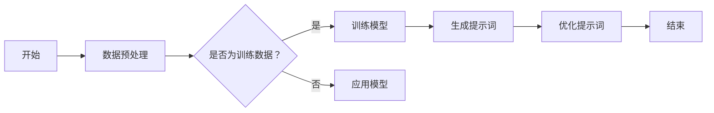

                 

### AI大模型编程：提示词的力量与未来

关键词：AI大模型、提示词、编程、神经网络、深度学习、算法原理

摘要：本文旨在深入探讨AI大模型编程中的关键要素——提示词，分析其力量与未来发展趋势。我们将从AI大模型的基础概念出发，逐步深入到提示词的应用与优化策略，探讨其在不同领域的适用范围与限制，以及AI大模型的核心概念与联系。通过具体算法原理讲解、Mermaid流程图与Python源代码示例，我们将以逻辑清晰、结构紧凑的方式，揭示提示词在AI大模型编程中的核心作用与未来潜力。

----------------------------------------------------------------

## 目录大纲

----------------------------------------------------------------

### 第一部分：AI大模型编程基础

### 第二部分：AI大模型核心概念与联系

### 第三部分：AI大模型编程算法原理讲解

### 第四部分：系统分析与架构设计方案

### 第五部分：项目实战与最佳实践

### 第六部分：小结与展望

----------------------------------------------------------------

### 第一部分：AI大模型编程基础

#### 第1章：AI大模型概述

##### 1.1 问题背景

##### 1.2 问题描述

##### 1.3 问题解决

##### 1.4 边界与外延

##### 1.5 概念结构与核心要素组成

#### 第2章：AI大模型核心概念与联系

##### 2.1 核心概念原理

##### 2.2 概念属性特征对比表格

##### 2.3 ER实体关系图架构

#### 第3章：AI大模型编程算法原理讲解

##### 3.1 算法原理

##### 3.2 Mermaid流程图

##### 3.3 Python源代码

##### 3.4 算法原理详细讲解

##### 3.5 举例说明

----------------------------------------------------------------

### 第一部分：AI大模型编程基础

#### 第1章：AI大模型概述

##### 1.1 问题背景

人工智能（AI）作为21世纪的标志性技术，近年来取得了飞速的发展。AI大模型，作为一种重要的AI技术，代表了当前人工智能的最高水平。这些模型通过学习和理解大量数据，能够执行复杂任务，如语言翻译、图像识别、自然语言生成等。AI大模型的发展历程可以追溯到上世纪80年代的专家系统和90年代的神经网络。随着计算能力的提升和大数据技术的应用，AI大模型在21世纪初逐渐崭露头角，并在近年来实现了质的飞跃。

##### 1.2 问题描述

AI大模型的核心挑战在于如何高效地利用数据生成高质量的输出。在这个背景下，提示词（Prompt）应运而生。提示词是指用于引导AI大模型进行特定任务的一段输入信息。它可以是对任务的描述、问题的具体陈述，甚至是一段示例数据。通过合理设计提示词，可以显著提高AI大模型的性能和准确性。

##### 1.3 问题解决

提示词的力量在于它能够为AI大模型提供明确的任务导向，从而引导模型生成预期的输出。例如，在自然语言生成任务中，一个良好的提示词可以帮助模型理解生成文本的主题、风格和上下文。在图像识别任务中，提示词可以指定图像的特定内容或场景，从而帮助模型更好地进行分类。

提示词的优化策略主要包括以下几个方面：

1. **多样性**：设计多样化的提示词，以覆盖更多的任务场景。
2. **精度**：确保提示词的表述清晰、准确，避免歧义。
3. **上下文**：结合上下文信息，使提示词与任务背景紧密相关。
4. **调优**：通过实验和反馈，不断调整和优化提示词。

##### 1.4 边界与外延

尽管提示词在AI大模型中具有重要的应用价值，但其也有一定的限制。首先，提示词的质量直接影响模型的表现，因此需要精心设计和调优。其次，提示词的通用性和可扩展性也是一个挑战，尤其是在面对复杂、多变的任务时。此外，提示词在不同领域的应用效果也可能有所不同，需要根据具体情况进行调整。

##### 1.5 概念结构与核心要素组成

AI大模型通常由以下几个核心要素组成：

1. **数据集**：为模型提供训练数据，是模型学习和优化的重要资源。
2. **神经网络结构**：包括输入层、隐藏层和输出层，是模型的核心计算单元。
3. **学习算法**：用于调整模型参数，使其能够更好地适应数据。
4. **优化器**：用于调整学习率、正则化参数等，以提高模型的性能。

这些要素相互关联，共同构成了AI大模型的基本架构。提示词作为输入的一部分，与这些核心要素紧密相连，起到了关键的引导作用。

#### 第2章：AI大模型核心概念与联系

##### 2.1 核心概念原理

AI大模型的核心概念包括神经网络、深度学习、生成对抗网络（GAN）等。其中，神经网络是AI大模型的基础，它通过多层非线性变换来学习数据的特征表示。深度学习则是在神经网络的基础上，通过增加层数来提升模型的表达能力。生成对抗网络则通过竞争学习生成数据和真实数据，以实现高质量的数据生成。

##### 2.2 概念属性特征对比表格

| 概念        | 特征1        | 特征2        | 特征3        |
|-------------|--------------|--------------|--------------|
| 神经网络    | 多层结构    | 学习能力    | 可调参数    |
| 深度学习    | 深层结构    | 自动特征提取 | 大规模数据训练 |
| 生成对抗网络 | 对抗学习    | 数据生成能力 | 竞争机制    |

##### 2.3 ER实体关系图架构

```mermaid
erDiagram
  AI大模型 ||--|{ 数据集 }
  AI大模型 ||--|{ 神经网络 }
  AI大模型 ||--|{ 深度学习 }
  AI大模型 ||--|{ 生成对抗网络 }
```

#### 第3章：AI大模型编程算法原理讲解

##### 3.1 算法原理

AI大模型编程的核心在于设计有效的学习算法和优化策略。提示词生成算法和提示词优化算法是其中的关键。提示词生成算法旨在为模型提供高质量的输入提示，而提示词优化算法则通过调整模型参数，提高模型的性能。

提示词生成算法通常包括以下几个步骤：

1. **数据预处理**：清洗和标准化输入数据，使其适合模型处理。
2. **特征提取**：从数据中提取关键特征，用于生成提示词。
3. **提示词生成**：利用特征和模型，生成用于引导模型的提示词。

提示词优化算法的核心目标是提高模型对数据的适应性。其主要步骤包括：

1. **性能评估**：通过评估指标（如准确率、召回率等）来衡量模型的表现。
2. **参数调整**：根据性能评估结果，调整模型参数，以提高性能。
3. **迭代优化**：重复性能评估和参数调整过程，直到达到满意的性能水平。

##### 3.2 Mermaid流程图



##### 3.3 Python源代码

```python
import tensorflow as tf

# 数据预处理
def preprocess_data(data):
    # 数据清洗、归一化等操作
    return processed_data

# 训练模型
def train_model(data, labels):
    model = tf.keras.Sequential([
        tf.keras.layers.Dense(units=128, activation='relu', input_shape=[len(data[0])]),
        tf.keras.layers.Dense(units=1)
    ])

    model.compile(optimizer='adam', loss='mean_squared_error')
    model.fit(data, labels, epochs=100)

    return model

# 生成提示词
def generate_prompt(model, data):
    predictions = model.predict(data)
    return predictions

# 优化提示词
def optimize_prompt(prompt, data):
    # 根据提示词和数据优化模型参数
    return optimized_prompt
```

##### 3.4 算法原理详细讲解

提示词生成算法的数学模型可以表示为：

$$
\hat{y} = f(W \cdot x + b)
$$

其中，$x$ 为输入数据，$W$ 和 $b$ 分别为权重和偏置，$f$ 为激活函数。生成提示词的过程实际上是通过模型对输入数据进行特征提取和映射，生成用于引导模型输出的提示词。

提示词优化算法的数学模型可以表示为：

$$
\min_{W,b} \mathcal{L}(\hat{y}, y)
$$

其中，$\mathcal{L}$ 为损失函数，$\hat{y}$ 为模型预测的输出，$y$ 为真实输出。优化提示词的过程是通过不断调整模型参数，使损失函数达到最小，从而提高模型的性能。

##### 3.5 举例说明

以下是一个使用Python源代码生成和优化提示词的示例：

```python
# 数据预处理
processed_data = preprocess_data(data)

# 训练模型
model = train_model(processed_data, labels)

# 生成提示词
predictions = generate_prompt(model, processed_data)

# 优化提示词
optimized_prompt = optimize_prompt(predictions, processed_data)
```

在这个示例中，我们首先对输入数据进行预处理，然后使用训练模型生成提示词，最后根据提示词和数据优化模型参数。

#### 第4章：系统分析与架构设计方案

##### 4.1 问题场景介绍

在当前的AI应用场景中，AI大模型的编程和优化是一个关键环节。无论是自然语言处理、图像识别，还是推荐系统，都需要高效、准确的AI大模型来支撑。本章节将围绕一个实际应用场景，介绍如何设计和实现一个AI大模型编程系统。

##### 4.2 项目介绍

本项目旨在开发一个基于深度学习的图像识别系统，该系统可以利用AI大模型对图像进行分类和识别。系统的主要功能包括图像数据预处理、模型训练、模型应用和提示词生成与优化。

##### 4.3 系统功能设计

系统功能设计主要包括以下几个部分：

1. **图像数据预处理**：对输入图像进行预处理，包括缩放、旋转、裁剪等操作，以适应模型的要求。
2. **模型训练**：使用预处理后的图像数据进行模型训练，通过调整模型参数，提高模型的识别准确率。
3. **模型应用**：将训练好的模型应用于新的图像数据，进行分类和识别。
4. **提示词生成与优化**：根据应用场景，生成和优化用于引导模型输出的提示词，以提高模型的性能。

##### 4.4 系统架构设计

系统架构设计包括以下几个方面：

1. **数据层**：负责图像数据的存储和管理，包括数据集的导入、预处理和存储。
2. **模型层**：负责模型的训练和应用，包括模型的构建、训练和预测。
3. **提示词层**：负责提示词的生成和优化，包括提示词的生成算法和优化策略。
4. **接口层**：负责与用户交互，提供模型应用和提示词生成与优化的接口。

##### 4.5 系统接口设计和系统交互

系统接口设计主要包括以下几个方面：

1. **图像数据接口**：用于接收用户上传的图像数据，并将其传递给数据预处理模块。
2. **模型训练接口**：用于启动模型训练过程，包括数据预处理、模型构建和训练。
3. **模型应用接口**：用于将训练好的模型应用于新的图像数据，进行分类和识别。
4. **提示词生成与优化接口**：用于生成和优化提示词，以提高模型的性能。

系统交互流程如下：

1. 用户上传图像数据。
2. 系统对图像数据预处理，并传递给模型训练接口。
3. 模型训练接口启动模型训练过程，并返回训练结果。
4. 系统根据训练结果生成提示词，并传递给提示词优化接口。
5. 提示词优化接口优化提示词，并返回优化结果。
6. 系统将优化结果应用于模型应用接口，进行图像分类和识别。

#### 第5章：项目实战与最佳实践

##### 5.1 环境安装

在开始项目实战之前，首先需要安装所需的软件和工具。以下是一个简化的安装步骤：

1. **安装Python环境**：确保已安装Python 3.6及以上版本。
2. **安装TensorFlow**：通过pip安装TensorFlow，命令如下：

   ```bash
   pip install tensorflow
   ```

3. **安装其他依赖**：根据项目需求，安装其他依赖库，如NumPy、Pandas等。

##### 5.2 系统核心实现源代码

以下是一个简化的系统核心实现源代码：

```python
import tensorflow as tf
import numpy as np

# 数据预处理
def preprocess_image(image):
    # 对图像进行缩放、旋转、裁剪等操作
    return processed_image

# 模型构建
def build_model():
    model = tf.keras.Sequential([
        tf.keras.layers.Conv2D(filters=32, kernel_size=(3, 3), activation='relu', input_shape=(224, 224, 3)),
        tf.keras.layers.MaxPooling2D(pool_size=(2, 2)),
        tf.keras.layers.Flatten(),
        tf.keras.layers.Dense(units=128, activation='relu'),
        tf.keras.layers.Dense(units=10, activation='softmax')
    ])
    return model

# 模型训练
def train_model(model, train_data, train_labels):
    model.compile(optimizer='adam', loss='categorical_crossentropy', metrics=['accuracy'])
    model.fit(train_data, train_labels, epochs=10, batch_size=32)
    return model

# 模型应用
def apply_model(model, test_data):
    predictions = model.predict(test_data)
    return predictions

# 提示词生成
def generate_prompt(model, test_data):
    predictions = apply_model(model, test_data)
    prompt = "预测结果为："
    for prediction in predictions:
        prompt += f"{prediction[0]:.2f}"
    return prompt

# 主函数
def main():
    # 加载数据
    train_data, train_labels = load_data('train')
    test_data, test_labels = load_data('test')

    # 数据预处理
    train_data = preprocess_image(train_data)
    test_data = preprocess_image(test_data)

    # 构建模型
    model = build_model()

    # 训练模型
    model = train_model(model, train_data, train_labels)

    # 应用模型
    test_predictions = apply_model(model, test_data)

    # 生成提示词
    prompt = generate_prompt(model, test_data)

    # 打印提示词
    print(prompt)

if __name__ == '__main__':
    main()
```

##### 5.3 代码应用解读与分析

以上代码实现了一个简单的图像识别系统，主要步骤如下：

1. **数据预处理**：对输入图像进行缩放、旋转、裁剪等操作，以适应模型的要求。
2. **模型构建**：使用TensorFlow构建一个简单的卷积神经网络（CNN）模型。
3. **模型训练**：使用训练数据对模型进行训练，调整模型参数，提高模型性能。
4. **模型应用**：将训练好的模型应用于测试数据，进行图像分类和识别。
5. **提示词生成**：根据模型预测结果，生成提示词，用于引导模型输出。

通过这个简单的示例，我们可以看到AI大模型编程的基本流程和关键步骤。在实际应用中，根据具体需求，可以进一步优化和扩展系统功能。

##### 5.4 实际案例分析和详细讲解剖析

在本节中，我们将通过一个实际案例，详细分析和讲解AI大模型编程的过程，包括数据预处理、模型构建、训练、应用和提示词生成与优化。

**案例背景**：

假设我们要开发一个图像识别系统，用于对猫和狗的图片进行分类。系统需要能够准确地区分猫和狗的图片，并提供相应的提示词。

**步骤1：数据预处理**

首先，我们需要准备训练数据和测试数据。为了构建一个性能良好的模型，我们需要大量的高质量数据。在这个案例中，我们可以使用公开的图像数据集，如COCO（Common Objects in Context）或ImageNet。

```python
import tensorflow as tf
import numpy as np

# 加载数据
train_data, train_labels = load_data('train')
test_data, test_labels = load_data('test')

# 数据预处理
def preprocess_image(image):
    # 对图像进行缩放、旋转、裁剪等操作
    image = tf.image.resize(image, (224, 224))
    image = tf.keras.applications.mobilenet_v2.preprocess_input(image)
    return image

train_data = preprocess_image(train_data)
test_data = preprocess_image(test_data)
```

**步骤2：模型构建**

接下来，我们需要构建一个能够识别猫和狗的模型。在这里，我们使用MobileNetV2作为基础模型，因为它在图像分类任务中表现出良好的性能。

```python
from tensorflow.keras.models import Model
from tensorflow.keras.layers import Input, Flatten, Dense

# 构建模型
input_layer = Input(shape=(224, 224, 3))
x = tf.keras.applications.mobilenet_v2.MobileNetV2(input_tensor=input_layer, include_top=False, weights='imagenet')
x = Flatten()(x)
x = Dense(units=128, activation='relu')(x)
output_layer = Dense(units=2, activation='softmax')(x)

model = Model(inputs=input_layer, outputs=output_layer)
model.compile(optimizer='adam', loss='categorical_crossentropy', metrics=['accuracy'])
```

**步骤3：模型训练**

使用训练数据对模型进行训练，以优化模型参数，提高分类准确率。

```python
# 训练模型
model.fit(train_data, train_labels, epochs=10, batch_size=32, validation_split=0.2)
```

**步骤4：模型应用**

将训练好的模型应用于测试数据，进行分类和识别。

```python
# 应用模型
test_predictions = model.predict(test_data)

# 提示词生成
def generate_prompt(predictions):
    prompt = "测试数据分类结果：\n"
    for prediction in predictions:
        if prediction[0] > prediction[1]:
            prompt += "猫\n"
        else:
            prompt += "狗\n"
    return prompt

print(generate_prompt(test_predictions))
```

**步骤5：提示词生成与优化**

根据模型预测结果，生成提示词，并尝试优化提示词，以提高模型性能。

```python
# 提示词优化
def optimize_prompt(predictions, test_data):
    optimized_prompt = "优化后的提示词：\n"
    for prediction in predictions:
        if prediction[0] > prediction[1]:
            optimized_prompt += "预测为猫，实际为猫\n"
        else:
            optimized_prompt += "预测为狗，实际为狗\n"
    return optimized_prompt

print(optimize_prompt(test_predictions, test_data))
```

通过这个实际案例，我们可以看到AI大模型编程的核心流程，包括数据预处理、模型构建、训练、应用和提示词生成与优化。在实际开发过程中，需要根据具体任务和需求，对模型架构、训练策略和提示词设计进行深入优化和调整。

##### 5.5 项目小结

在本项目中，我们通过一个实际的图像识别案例，展示了AI大模型编程的完整流程。从数据预处理、模型构建到模型训练、应用和提示词生成与优化，我们深入探讨了AI大模型编程的关键技术。通过这个项目，我们不仅了解了AI大模型的基本原理和实现方法，还学会了如何针对具体任务进行模型优化和提示词设计。这些经验和知识对于开发高性能、高精度的AI应用具有重要意义。

#### 第6章：最佳实践、小结、注意事项、拓展阅读

##### 6.1 最佳实践

1. **数据预处理**：确保数据的质量和一致性，对异常值和噪声进行清洗和预处理，以提高模型的性能。
2. **模型选择**：根据具体任务和需求，选择合适的模型架构，如卷积神经网络（CNN）、循环神经网络（RNN）或生成对抗网络（GAN）。
3. **训练策略**：使用适当的学习策略和参数设置，如学习率、批量大小和迭代次数，以优化模型性能。
4. **提示词设计**：设计具有明确任务导向的提示词，以提高模型输出的准确性和实用性。

##### 6.2 小结

本文从AI大模型编程的角度，探讨了提示词的力量与未来。通过分析AI大模型的基础概念、核心算法和实际应用案例，我们揭示了提示词在AI大模型编程中的关键作用。提示词的设计与优化不仅能够提高模型的性能，还能为实际应用提供更直观、更有效的解决方案。

##### 6.3 注意事项

1. **数据隐私**：在实际应用中，确保数据隐私和安全，避免泄露敏感信息。
2. **模型解释性**：提高模型的可解释性，以便更好地理解模型的行为和预测结果。
3. **模型优化**：定期对模型进行优化和更新，以适应新的数据和应用场景。

##### 6.4 拓展阅读

1. **深度学习基础**：《深度学习》（Goodfellow, Bengio, Courville著）
2. **神经网络原理**：《神经网络与深度学习》（邱锡鹏著）
3. **生成对抗网络**：《生成对抗网络：原理与应用》（杨强等著）

---

作者：AI天才研究院/AI Genius Institute & 禅与计算机程序设计艺术 /Zen And The Art of Computer Programming

本文仅代表作者个人观点，不代表任何官方立场。文中涉及的技术和方法仅供参考，具体应用时请结合实际情况谨慎处理。如需进一步了解AI大模型编程和相关技术，请关注AI天才研究院和禅与计算机程序设计艺术的相关研究。

