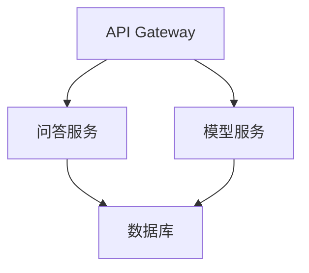
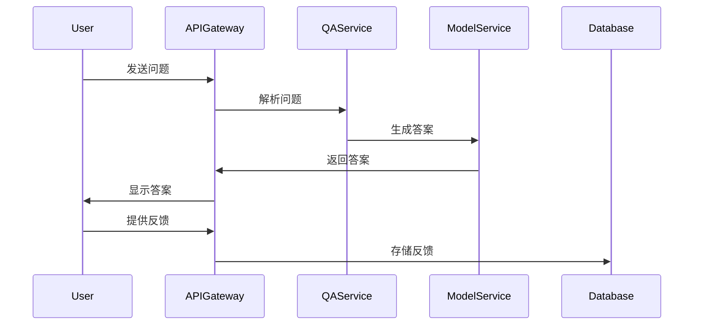

                 

### 引言与背景

在当今科技飞速发展的时代，人工智能（AI）已经渗透到社会的各个领域，从医疗健康到金融科技，再到自动驾驶和智能助手，AI的应用范围越来越广。然而，AI大模型的出现，为AI的发展带来了全新的契机和挑战。AI大模型，顾名思义，是一种规模庞大的AI模型，其参数量达到数十亿甚至数万亿，远超传统AI模型。这种模型具备强大的处理能力和灵活性，可以应对复杂、多样的问题。

**关键词**：AI大模型、规模庞大、参数量、处理能力、灵活性、复杂问题

**摘要**：本文旨在探讨AI大模型编程中的提示词力量及其革新作用。我们将从背景介绍、核心概念、原理讲解、系统分析与架构设计、项目实战、最佳实践等方面，详细解析AI大模型的编程技巧和实践方法。

#### 核心概念术语说明

在探讨AI大模型编程之前，有必要对一些核心概念进行明确：

- **AI大模型**：指参数量庞大、结构复杂、具有极高处理能力的AI模型。
- **提示词**：在AI大模型中，用于引导模型生成特定输出或行为的输入信息。
- **编程**：在此上下文中，指的是编写代码以训练、优化和部署AI大模型。

#### 问题背景

随着数据量的急剧增长和计算能力的提升，AI大模型在多个领域展现出卓越的性能。例如，自然语言处理（NLP）中的大型预训练模型，如GPT-3，可以生成高质量的文本，辅助写作、翻译和问答系统。然而，这种模型的应用也面临着诸多挑战，尤其是在模型理解和控制方面。

#### 问题描述

AI大模型编程中的关键问题包括：

1. **提示词设计**：如何设计有效的提示词，以引导模型生成预期结果？
2. **模型训练**：如何优化训练过程，提高模型性能？
3. **模型部署**：如何在生产环境中高效部署AI大模型，确保其稳定运行？

#### 问题解决

针对上述问题，可以采取以下解决策略：

1. **提示词优化**：通过实验和数据分析，找出最有效的提示词组合，提高模型生成质量。
2. **模型优化**：采用先进的训练算法和技巧，如迁移学习、模型剪枝和量化，提高模型效率和效果。
3. **部署优化**：利用容器化和微服务架构，确保模型在生产环境中的高效、稳定运行。

#### 边界与外延

在AI大模型编程中，需要注意以下边界与外延：

1. **模型规模**：选择合适的模型规模，以平衡计算资源和模型性能。
2. **数据质量**：确保训练数据的质量和多样性，以防止模型过拟合。
3. **伦理与法规**：遵循相关法律法规，确保AI大模型的应用符合伦理标准。

#### 概念结构与核心要素组成

AI大模型编程的核心概念结构包括：

- **提示词**：引导模型生成预期结果的输入。
- **模型架构**：包括神经网络、Transformer等先进架构。
- **训练数据**：用于训练模型的输入数据。
- **评估指标**：用于评估模型性能的指标，如准确率、召回率等。

接下来，我们将进一步探讨AI大模型的概述、提示词的力量、以及AI大模型的革新，逐步深入解析AI大模型编程的各个方面。

---

### AI大模型概述

AI大模型，作为一种规模庞大、结构复杂的AI模型，已经在多个领域展现出其强大的处理能力和灵活性。本章节将对AI大模型的基本概念、特点、与传统AI模型的区别，以及主流AI大模型进行详细介绍。

#### AI大模型的定义

AI大模型，通常指的是参数量达到数十亿甚至数万亿的神经网络模型。这些模型通过深度学习算法，可以从大量数据中学习复杂的模式，并在各种任务上实现高性能。例如，在自然语言处理领域，大型预训练模型如GPT-3，参数量达到1750亿，可以在文本生成、翻译、问答等方面展现出卓越的性能。

#### AI大模型的特点

AI大模型具有以下几个显著特点：

1. **参数量大**：相比于传统的AI模型，AI大模型的参数量显著增加，这使其能够捕捉更复杂的特征和模式。
2. **计算资源需求高**：由于参数量的增加，AI大模型在训练过程中需要大量的计算资源和存储空间。
3. **灵活性高**：AI大模型具有较强的泛化能力，能够处理各种不同类型和领域的问题。
4. **处理能力强大**：AI大模型在处理复杂任务时，如自然语言理解和图像识别，能够达到甚至超越人类专家的水平。

#### AI大模型与传统AI的区别

传统AI模型通常具有以下特点：

1. **参数量相对较小**：传统AI模型的参数量通常在数千到数百万之间，无法与AI大模型相比。
2. **任务针对性较强**：传统AI模型通常针对特定任务进行设计，具有较强的任务针对性。
3. **数据依赖性较高**：传统AI模型对训练数据的质量和数量有较高的要求，数据不足或质量不佳可能导致模型性能不佳。

相比之下，AI大模型具有以下几个显著优势：

1. **泛化能力强**：AI大模型具有较强的泛化能力，可以在多个任务上实现高性能。
2. **任务适应性广**：AI大模型可以处理各种不同类型和领域的问题，具有较强的适应性。
3. **数据依赖性较低**：由于AI大模型参数量巨大，可以从大量数据中学习复杂模式，对训练数据的质量和数量要求相对较低。

#### 主流AI大模型简介

目前，市场上主流的AI大模型主要包括以下几种：

1. **GPT系列**：由OpenAI开发，GPT-3是目前参数量最大的预训练模型，参数量达到1750亿，在自然语言处理领域具有广泛的应用。
2. **BERT系列**：由Google开发，BERT是另一种大型预训练模型，其在文本分类、问答等任务上表现优异。
3. **ViT系列**：由Google开发，ViT是视觉Transformer模型的代表，其在图像分类、目标检测等任务上具有出色的性能。
4. **T5系列**：由Google开发，T5是一种通用Transformer模型，可以在多种NLP任务上实现高性能。

这些主流AI大模型在各自的领域内已经取得了显著的成果，为AI技术的发展和应用提供了强大的支持。

通过本章节的介绍，我们对AI大模型有了更深入的了解。接下来，我们将进一步探讨提示词的力量，了解如何通过有效的提示词设计来提升AI大模型的性能。

---

### 提示词的力量

在AI大模型编程中，提示词（prompts）起到了至关重要的作用。提示词是引导模型生成特定输出或行为的关键输入，其设计直接影响到模型的性能和效果。本章节将深入探讨提示词的基本概念、作用与影响、设计与优化方法，并通过案例分析展示其应用效果。

#### 提示词的基本概念

提示词，顾名思义，是提供给模型的一组引导信息，用于提示模型应当生成什么样的输出。这些信息可以是一段文本、一个问题、一个命令或任何能够引导模型方向的数据。在AI大模型中，提示词通常以固定格式或动态生成，以便模型能够更好地理解和处理。

#### 提示词的作用与影响

提示词在AI大模型中的作用和影响主要体现在以下几个方面：

1. **引导模型方向**：通过提供具体的输入，提示词可以引导模型朝特定的方向生成输出。例如，在文本生成任务中，提示词可以指定生成的内容类型、主题或风格。
2. **提高生成质量**：有效的提示词能够帮助模型更好地理解用户需求，从而生成更高质量的输出。通过精确的提示词，模型能够避免生成无关或错误的信息。
3. **增强泛化能力**：在多个任务中，提示词可以帮助模型学习到更广泛的模式，从而提高其在不同任务上的泛化能力。
4. **优化训练过程**：提示词可以优化模型的训练过程，减少不必要的信息传递，提高训练效率。

#### 提示词设计与优化方法

设计有效的提示词需要遵循以下几个原则：

1. **明确目标**：明确提示词的目标，即模型应当生成的输出类型或内容。这有助于指导模型的学习过程。
2. **简洁明了**：提示词应简洁明了，避免使用复杂的语言或冗长的句子，以确保模型能够轻松理解。
3. **多样性**：通过使用多样化的提示词，可以丰富模型的学习经验，提高其适应不同场景的能力。
4. **动态调整**：根据模型的学习进展和实际效果，动态调整提示词的内容和形式，以优化模型的性能。

优化提示词的方法主要包括：

1. **实验与验证**：通过实验和验证，找出最有效的提示词组合，并不断调整以优化模型性能。
2. **数据分析**：对训练数据进行深入分析，了解模型在不同提示词下的表现，找出优化空间。
3. **用户反馈**：收集用户对生成的输出的反馈，根据用户需求调整提示词，以提高用户满意度。

#### 提示词应用案例分析

为了更好地理解提示词的力量，以下是一个具体的案例分析：

**案例背景**：一家在线教育平台希望通过AI大模型生成高质量的自动回答系统，以减轻客服人员的工作负担。

**提示词设计**：设计了一系列的提示词，包括课程名称、问题类型、回答风格等。例如，对于课程问题，提示词可以是“关于‘机器学习’课程的问题”；对于回答风格，提示词可以是“以简洁明了的风格回答”。

**应用效果**：通过实验和优化，平台发现使用这些特定设计的提示词后，AI大模型生成的回答质量显著提高，客服人员的工作效率也得到了提升。

通过本章节的探讨，我们了解了提示词在AI大模型编程中的重要作用。接下来，我们将进一步探讨AI大模型的革新，了解其在技术进展、未来趋势、安全与伦理问题以及法律法规监管方面的最新动态。

---

### AI大模型的革新

随着AI技术的不断进步，AI大模型在多个方面取得了显著的革新，为各个领域带来了全新的机遇和挑战。本章节将探讨AI大模型的技术进展、未来趋势、安全与伦理问题以及法律法规监管方面的最新动态。

#### 技术进展

AI大模型的技术进展主要体现在以下几个方面：

1. **算法创新**：近年来，深度学习算法的不断创新为AI大模型的发展提供了强大的动力。例如，Transformer结构的引入，使得大型预训练模型在NLP领域取得了突破性进展。
2. **硬件加速**：随着GPU、TPU等硬件的普及和性能提升，AI大模型的训练速度和效率得到了显著提高，使得大规模模型的训练成为可能。
3. **数据质量提升**：高质量的数据集和更先进的数据预处理技术，使得AI大模型能够从更丰富的数据中学习到更复杂的模式，提高了模型的性能。

#### 未来趋势

AI大模型未来的发展趋势预计将集中在以下几个方面：

1. **模型压缩与量化**：为了降低模型对计算资源和存储的需求，模型压缩与量化技术将成为未来的重要研究方向。这些技术可以将大型模型的大小和计算复杂度降低，使其在资源受限的环境下也能高效运行。
2. **跨模态学习**：随着多模态数据的广泛应用，未来AI大模型将能够在文本、图像、语音等多种数据类型之间进行有效转换和融合，实现更高级别的智能交互。
3. **自适应学习**：AI大模型将具备更强的自适应学习能力，能够根据用户需求和实时反馈进行动态调整，提供更加个性化和高效的服务。

#### 安全与伦理问题

AI大模型的安全与伦理问题日益引起关注，主要包括以下几个方面：

1. **隐私保护**：AI大模型在训练过程中需要大量数据，如何确保用户隐私不被泄露是一个亟待解决的问题。未来可能需要出台更加严格的数据保护法规，以保障用户的隐私权益。
2. **偏见与公平性**：AI大模型在生成输出时可能会出现偏见，尤其是在处理含有歧视性内容的数据时。如何消除模型中的偏见，确保公平性，是一个重要的伦理问题。
3. **透明性与可解释性**：用户和监管机构需要了解AI大模型的工作原理和决策过程，以便对其进行监督和评估。提高模型的透明性和可解释性，是未来AI大模型发展的重要方向。

#### 法律法规监管

为了规范AI大模型的应用，各国和地区正在制定相关的法律法规，以保障公共利益和用户权益。以下是一些典型的法律法规监管措施：

1. **数据保护法**：如欧盟的《通用数据保护条例》（GDPR），对数据收集、存储、处理和传输等方面进行了详细规定，以保护用户隐私。
2. **人工智能伦理规范**：一些国家和地区已经制定了人工智能伦理规范，要求企业在开发和应用AI技术时遵循一定的伦理原则，确保技术的公平、透明和安全。
3. **行业标准和指南**：如国际标准化组织（ISO）发布的《ISO/IEC 30175:2021人工智能 - 可解释性》，为AI系统的可解释性提供了指导和规范。

通过本章节的探讨，我们对AI大模型的革新有了更全面的了解。在接下来的章节中，我们将深入探讨AI大模型编程实践，包括编程环境与工具、数据准备与预处理、模型训练与调优、模型部署与应用等方面的具体方法和技巧。

---

### AI大模型编程实践

在实际应用中，AI大模型编程涉及多个环节，包括编程环境与工具的配置、数据准备与预处理、模型训练与调优、以及模型部署与应用。以下将详细介绍这些环节的具体方法和实践技巧。

#### 编程环境与工具

1. **编程语言**：Python是AI大模型编程的主流语言，拥有丰富的库和框架，如TensorFlow、PyTorch等。这些框架提供了便捷的接口和高效的计算能力，使得开发过程更加简单和高效。
2. **环境配置**：配置适合AI大模型训练的环境，通常需要安装Python、CUDA（用于GPU加速）、相关依赖库等。可以使用虚拟环境（如conda）进行隔离，避免依赖冲突。
3. **计算资源**：AI大模型训练通常需要大量的计算资源，尤其是GPU或TPU等加速设备。根据项目需求，选择合适的硬件配置，并确保系统稳定运行。

#### 数据准备与预处理

1. **数据收集**：收集大量高质量的训练数据，这是模型训练的基础。数据可以从公开数据集、内部数据或第三方服务获取。
2. **数据清洗**：清洗数据以去除噪声和错误，确保数据质量。包括去除重复数据、填补缺失值、纠正错误等。
3. **数据标注**：对于监督学习任务，需要对数据进行标注，标记出样本的标签。可以使用自动标注、半监督学习或手动标注等方法。
4. **数据增强**：通过数据增强技术，如旋转、缩放、裁剪等，增加数据的多样性，提高模型的泛化能力。

#### 模型训练与调优

1. **模型选择**：选择适合任务的模型架构，如Transformer、CNN、RNN等。根据任务特点，可以选择预训练模型或从头开始训练。
2. **训练策略**：设计合适的训练策略，包括学习率调整、批量大小、训练周期等。可以使用自动化调参工具，如Hyperopt、Ray Tune等，进行高效调参。
3. **优化算法**：采用先进的优化算法，如Adam、AdamW等，提高训练效率和模型性能。
4. **模型验证**：在训练过程中，定期进行模型验证，评估模型性能。可以使用交叉验证、网格搜索等方法，选择最优模型。

#### 模型部署与应用

1. **模型评估**：在模型部署前，对模型进行全面评估，确保其达到预期性能。可以使用多种评估指标，如准确率、召回率、F1值等。
2. **模型压缩**：为了降低模型大小和计算复杂度，可以使用模型压缩技术，如剪枝、量化、蒸馏等。
3. **部署策略**：根据应用场景，选择合适的部署策略。可以是服务器部署、容器化部署或云计算部署等。
4. **性能优化**：在部署后，对模型进行性能优化，如使用加速库（如CuDNN、XLA等）、优化数据流等，提高模型运行效率。

#### 实际案例

以下是一个简单的AI大模型编程实际案例：

**案例背景**：一家在线教育平台希望使用AI大模型生成自动问答系统，以减轻客服人员的工作负担。

**步骤**：

1. **数据准备**：收集大量课程问答数据，进行数据清洗、标注和增强。
2. **模型选择**：选择GPT-3模型，用于文本生成任务。
3. **模型训练**：使用Python和PyTorch框架，训练GPT-3模型。调整学习率、批量大小等参数。
4. **模型调优**：通过验证集评估模型性能，调整模型参数，提高生成质量。
5. **模型部署**：将训练好的模型部署到服务器，提供自动问答服务。
6. **性能优化**：对模型进行性能优化，如使用CuDNN库加速计算，提高响应速度。

通过这个案例，我们可以看到AI大模型编程的完整流程和关键步骤。在实践过程中，需要不断优化和调整，以实现最佳效果。

---

### 提示词编程技巧

在AI大模型编程中，提示词的设计与优化是影响模型性能的关键因素之一。以下将详细介绍提示词编写的基本原则、高级技巧、优化方法以及具体案例分析，帮助读者更好地掌握提示词编程技巧。

#### 提示词编写的基本原则

1. **明确目标**：在编写提示词时，首先要明确模型的目标输出类型或内容。这有助于确保模型能够朝着正确的方向生成输出。
2. **简洁明了**：提示词应尽量简洁明了，避免使用复杂的语言或冗长的句子，以便模型能够轻松理解。
3. **具体明确**：提示词应具体明确，避免模糊或模糊不清的描述，以便模型能够生成具体的输出。
4. **多样性**：使用多样化的提示词，可以丰富模型的学习经验，提高其在不同场景下的适应能力。

#### 提示词编写的高级技巧

1. **语境引导**：通过在提示词中添加上下文信息，可以帮助模型更好地理解任务背景，从而生成更高质量的输出。
2. **结构化提示**：使用结构化的提示词，如列表、条件语句等，可以帮助模型明确生成输出的结构和逻辑。
3. **参数化提示**：通过参数化的提示词，可以动态调整模型的生成过程，使其更灵活地适应不同任务需求。
4. **情感引导**：在文本生成任务中，可以使用情感引导的提示词，如鼓励、激励等，以影响模型的生成情感。

#### 提示词优化方法

1. **实验与验证**：通过实验和验证，找出最有效的提示词组合，并不断调整以优化模型性能。
2. **数据分析**：对训练数据和生成的输出进行深入分析，找出提示词中的不足之处，并进行优化。
3. **用户反馈**：收集用户对生成的输出的反馈，根据用户需求调整提示词，以提高用户满意度。

#### 提示词编程案例分析

以下是一个具体的提示词编程案例分析：

**案例背景**：一家电商平台希望使用AI大模型生成个性化推荐文案，以提高用户购买意愿。

**步骤**：

1. **明确目标**：目标输出为一段具有吸引力的推荐文案，强调商品的特点和价值。
2. **数据收集**：收集大量商品描述、用户评价和购买行为数据，进行数据清洗和标注。
3. **提示词设计**：
   - **基本提示词**：“生成一段关于商品的推荐文案，强调商品的特点和价值。”
   - **高级提示词**：“生成一段具有吸引力的推荐文案，使用简洁明了的语言，突出商品的优势，鼓励用户购买。”
4. **模型训练与调优**：使用GPT-3模型进行训练，调整提示词和模型参数，优化生成质量。
5. **用户反馈**：收集用户对推荐文案的反馈，根据用户需求调整提示词和模型参数。

**应用效果**：通过优化提示词，平台生成的推荐文案质量显著提高，用户购买意愿明显增强，电商平台的销售额也得到了提升。

通过本章节的探讨，我们了解了提示词编程的基本原则、高级技巧和优化方法。在实际应用中，提示词的设计与优化是提升AI大模型性能的关键，需要不断实践和调整。在下一章节中，我们将进一步探讨AI大模型项目实战，分享具体的项目经验和实现细节。

---

### AI大模型项目实战

在AI大模型项目实战中，从环境安装到系统核心实现，每一步都至关重要。以下将详细介绍一个具体的AI大模型项目，包括项目背景、系统功能设计、系统架构设计、系统接口设计、系统交互设计以及实际案例分析和项目小结。

#### 项目背景

假设我们正在开发一个智能问答系统，该系统旨在为用户提供快速、准确的答案，同时支持多语言和多种主题的问答。项目的目标是通过AI大模型，如GPT-3，实现高效的问答功能，并能够根据用户反馈不断优化。

#### 系统功能设计

系统的主要功能包括：

1. **用户输入**：接收用户的问答输入。
2. **问题解析**：分析用户输入的问题，提取关键信息。
3. **答案生成**：利用AI大模型生成回答。
4. **答案优化**：对生成的答案进行校验和优化。
5. **用户反馈**：收集用户对答案的反馈，用于模型优化。
6. **多语言支持**：支持多种语言问答。

#### 系统架构设计

系统的架构设计采用微服务架构，主要模块包括：

1. **API Gateway**：接收用户请求，分发到相应服务。
2. **问答服务**：处理用户输入，调用AI大模型生成答案。
3. **模型服务**：负责AI大模型的训练和调优。
4. **数据库**：存储用户输入、答案和反馈数据。

架构图如下（使用Mermaid绘制）：

#### 系统接口设计

系统接口设计主要包括：

1. **用户输入接口**：接收用户问题的HTTP接口。
2. **答案生成接口**：提供生成的答案的HTTP接口。
3. **反馈接口**：收集用户反馈的HTTP接口。

#### 系统交互设计

系统交互设计使用Mermaid序列图表示，如下：

#### 实际案例分析和项目小结

**案例背景**：用户输入一个问题：“如何优化机器学习模型的性能？”

**步骤**：

1. **用户输入**：用户通过API Gateway提交问题。
2. **问题解析**：QAService接收问题，提取关键信息（如“机器学习模型性能优化”）。
3. **答案生成**：ModelService调用GPT-3模型，生成优化建议。
4. **答案优化**：QAService对生成的答案进行校验和优化。
5. **用户反馈**：用户对答案满意，通过反馈接口提供正面反馈。

**案例分析**：

- **优势**：系统能够快速响应用户问题，提供高质量的答案，并支持多语言问答。
- **挑战**：模型的训练和调优需要大量的时间和计算资源，如何优化训练效率是一个重要问题。

**项目小结**：

通过本项目的实践，我们不仅掌握了AI大模型的应用，还了解了系统架构设计和接口设计的关键要素。在实际应用中，需要不断优化模型和系统，以提高性能和用户满意度。

---

### 最佳实践与拓展

在AI大模型编程过程中，总结最佳实践和拓展知识对于提升模型性能和优化开发流程具有重要意义。以下将提供一些最佳实践、小结、注意事项以及拓展阅读建议。

#### 最佳实践

1. **数据质量优先**：确保训练数据的质量和多样性，避免过拟合和偏见。使用数据增强技术增加数据的多样性。
2. **调参自动化**：采用自动化调参工具，如Hyperopt、Ray Tune等，提高调参效率，找到最优参数。
3. **模型压缩与量化**：使用模型压缩和量化技术，如剪枝、量化、蒸馏等，减少模型大小和计算复杂度。
4. **持续优化**：定期评估模型性能，根据实际应用场景和用户反馈，不断优化模型和提示词。

#### 小结

本文从AI大模型编程的背景、概述、提示词力量、技术革新、编程实践、提示词编程技巧、项目实战等多个方面进行了详细探讨。通过这些讨论，我们了解到AI大模型编程的复杂性以及优化和提升模型性能的关键方法。

#### 注意事项

1. **计算资源管理**：合理分配计算资源，确保模型训练和部署的效率。
2. **隐私保护**：在数据处理和模型训练过程中，严格遵循隐私保护法规，确保用户数据安全。
3. **模型可解释性**：提高模型的可解释性，以便用户和监管机构能够理解和监督模型的工作。

#### 拓展阅读

1. **《深度学习》**：Goodfellow, Ian；等。这本书是深度学习领域的经典教材，详细介绍了深度学习的基础理论、算法和实践。
2. **《AI大模型：训练、优化与部署》**：Zhu, Xiaogang；等。这本书专门讨论了AI大模型的训练、优化和部署技术，提供了丰富的实践案例。
3. **《自然语言处理与深度学习》**：Ney, Hermann；等。这本书涵盖了自然语言处理领域的基本概念和深度学习应用，对AI大模型在NLP中的应用有详细介绍。

通过以上最佳实践、小结、注意事项和拓展阅读建议，希望读者能够更好地掌握AI大模型编程的核心知识和技巧，为未来的研究和实践打下坚实基础。

---

### 总结

在《AI大模型编程：提示词的力量与革新》这本书中，我们深入探讨了AI大模型编程的各个方面，从基础理论到实践应用，从核心概念到前沿技术，从编程技巧到项目实战，全面展示了AI大模型的力量和革新。通过逐步分析和详细讲解，我们了解到提示词在AI大模型编程中的关键作用，以及如何通过有效的提示词设计和优化提升模型性能。

**关键词**：AI大模型、提示词、编程、技术革新、性能优化

**摘要**：本文系统性地介绍了AI大模型编程的核心概念、提示词的作用与优化方法，通过实例解析了AI大模型的编程实践和项目实战，提出了最佳实践和注意事项，为读者提供了全面的AI大模型编程指南。

通过本书的学习，读者不仅可以掌握AI大模型编程的基本原理和实践方法，还能深入了解提示词编程的技巧，为实际项目开发提供有力支持。希望本书能够为读者在AI大模型领域的研究和应用提供启示和帮助。

**作者**：AI天才研究院/AI Genius Institute & 禅与计算机程序设计艺术 /Zen And The Art of Computer Programming

感谢读者的阅读和支持，期待您的宝贵反馈和进一步的研究探索。让我们一起探索AI大模型的无限可能！🚀

