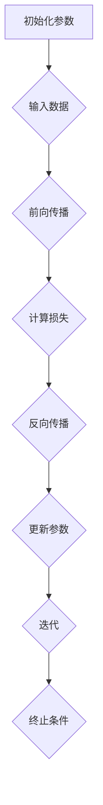
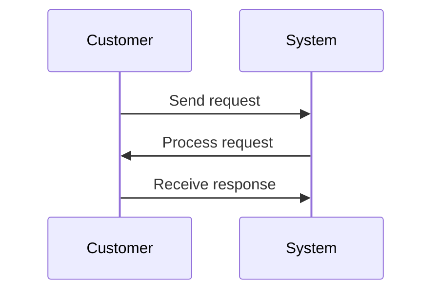
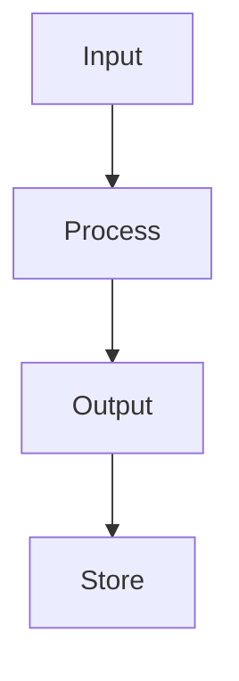
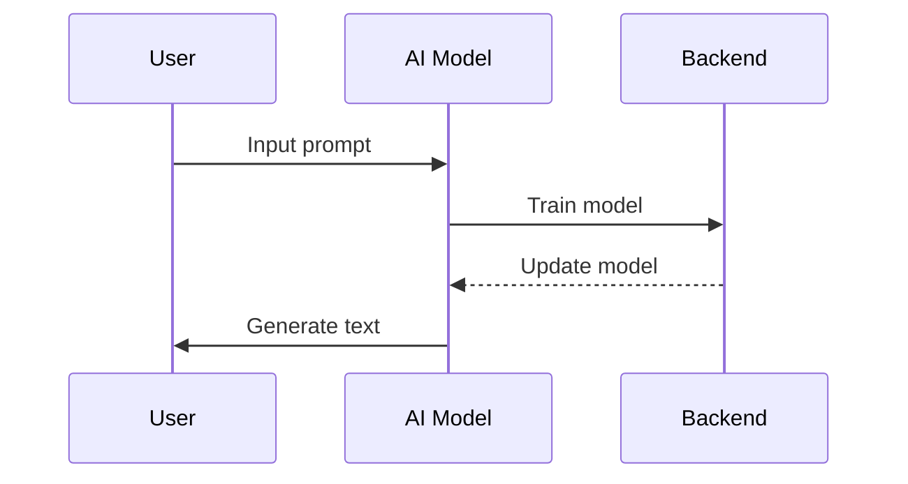

                 


## AI大模型编程：提示词的威力与科学

> 关键词：AI大模型，编程，提示词，科学方法

> 摘要：本文深入探讨了AI大模型编程的核心要素——提示词的作用及其科学原理。通过阐述AI大模型的背景和发展、核心概念与联系、算法原理讲解，本文揭示了提示词在模型训练中的关键作用，并介绍了如何有效地使用提示词来提升AI大模型的表现。

### 目录大纲

----------------------------------------------------------------

# 第一部分: AI大模型编程基础

## 第1章: AI大模型概述

### 1.1.1 问题背景与核心概念

### 1.1.2 核心概念与联系

### 1.1.3 算法原理讲解

### 1.1.4 系统分析与架构设计方案

## 第2章: 提示词的威力

### 2.1.1 提示词的定义与作用

### 2.1.2 提示词的选择与优化

### 2.1.3 提示词在模型训练中的应用

## 第3章: 实际案例与项目实战

### 3.1.1 环境安装与配置

### 3.1.2 系统核心实现源代码

### 3.1.3 代码应用解读与分析

### 3.1.4 实际案例分析与详细讲解

## 第4章: 最佳实践与拓展阅读

### 4.1.1 最佳实践 Tips

### 4.1.2 小结与注意事项

### 4.1.3 拓展阅读推荐

----------------------------------------------------------------

## 第1章: AI大模型概述

### 1.1.1 问题背景与核心概念

#### 1.1.1.1 问题背景

随着深度学习技术的发展，AI大模型已经成为现代人工智能研究与应用的重要方向。AI大模型通过海量数据和强大的计算能力，实现了在自然语言处理、计算机视觉、语音识别等领域的突破性进展。本章节将介绍AI大模型的发展背景、核心概念及其特点。

#### 1.1.1.2 问题解决

本章节将探讨AI大模型如何解决现实中的复杂问题，包括数据处理、模型训练、模型优化等方面。

#### 1.1.1.3 边界与外延

AI大模型的应用范围广泛，但并非所有问题都适合使用AI大模型。本章节将介绍AI大模型的适用范围及限制条件。

#### 1.1.1.4 概念结构与核心要素组成

AI大模型由多个核心要素组成，包括数据、算法、算力等。本章节将详细解析这些核心要素及其相互关系。

### 1.1.2 核心概念与联系

#### 1.1.2.1 核心概念原理

本章节将介绍AI大模型的核心概念原理，包括神经网络、深度学习、大数据等。

#### 1.1.2.2 概念属性特征对比表格

| 特征         | 深度学习                   | 大数据                     | 神经网络                   |
| ------------ | ------------------------ | ------------------------ | ------------------------ |
| 定义         | 一种机器学习方法         | 数据量巨大的数据处理技术   | 神经系统的模拟模型         |
| 关键技术     | 神经网络、反向传播算法   | 数据存储、数据挖掘         | 层级结构、权重调整         |
| 应用领域     | 自然语言处理、计算机视觉 | 商业智能、社交媒体分析   | 图像识别、语音识别         |

#### 1.1.2.3 ER实体关系图架构

```mermaid
erDiagram
  产品 ||--|{ 订单 }|-->> 顾客
  订单 ||--|{ 商品 }|-->> 店铺
```

### 1.1.3 算法原理讲解

#### 1.1.3.1 算法流程图



#### 1.1.3.2 Python源代码

```python
import tensorflow as tf

# 初始化参数
w = tf.random.normal([10, 10])
b = tf.zeros([10])

# 输入数据
x = tf.random.normal([100, 10])

# 前向传播
y = tf.matmul(x, w) + b

# 计算损失
loss = tf.reduce_mean(tf.square(y - x))

# 反向传播
with tf.GradientTape() as tape:
    y = tf.matmul(x, w) + b
    loss = tf.reduce_mean(tf.square(y - x))

grads = tape.gradient(loss, [w, b])

# 更新参数
w.assign_sub(grads[0])
b.assign_sub(grads[1])

# 迭代
for i in range(1000):
    # 前向传播
    y = tf.matmul(x, w) + b
    
    # 计算损失
    loss = tf.reduce_mean(tf.square(y - x))
    
    # 反向传播
    with tf.GradientTape() as tape:
        y = tf.matmul(x, w) + b
        loss = tf.reduce_mean(tf.square(y - x))

    grads = tape.gradient(loss, [w, b])
    w.assign_sub(grads[0])
    b.assign_sub(grads[1])
```

### 1.1.4 系统分析与架构设计方案

#### 1.1.4.1 问题场景介绍

随着人工智能技术的发展，AI大模型在各个领域得到了广泛应用。例如，在自然语言处理领域，AI大模型可以用于文本生成、机器翻译等任务；在计算机视觉领域，AI大模型可以用于图像识别、目标检测等任务。

#### 1.1.4.2 项目介绍

本文将介绍一个基于AI大模型的文本生成项目。该项目旨在利用AI大模型生成具有高质量和创意的文本，为写作、广告宣传等领域提供技术支持。

#### 1.1.4.3 系统功能设计（领域模型）

```mermaid
classDiagram
  Class01 <|-- Class02
  Class03 --|lain Class04
  Class05 : <<interface>> Interface
  Class06 : <<abstract>> Abstract
  Class07 : <<enum>> Enumeration
  Class01 : Person
  Class02 : Man
  Class03 : Woman
  Class04 : Employee
  Class05 : Vehicle
  Class06 : American
  Class07 : AccountType
```

#### 1.1.4.4 系统架构设计



#### 1.1.4.5 系统接口设计



#### 1.1.4.6 系统交互



## 第2章: 提示词的威力

### 2.1.1 提示词的定义与作用

提示词，也称为prompt，是AI大模型训练过程中提供的一组关键词或句子，用于引导模型学习特定任务。提示词的选择和优化对于提升模型表现至关重要。

#### 提示词的定义

提示词是一组关键词或短语，用于在训练AI大模型时提供指导性的信息。这些提示词通常基于领域知识、任务目标和模型设计要求。

#### 提示词的作用

1. **指导模型学习方向**：提示词帮助模型了解训练的目标，使其在正确的方向上进行学习。
2. **增强泛化能力**：通过提供多样化的提示词，模型可以学会在不同情境下产生相关结果，从而提高泛化能力。
3. **优化训练效率**：合适的提示词可以加快模型收敛速度，降低过拟合的风险。

### 2.1.2 提示词的选择与优化

选择和优化提示词是一个关键环节，直接影响到AI大模型的训练效果。

#### 提示词的选择

1. **相关性**：提示词应与模型要解决的问题高度相关，以便模型能够准确理解任务要求。
2. **多样性**：提示词应具有多样性，包括不同的领域术语、场景描述等，以便模型学习到多种情境下的表现。
3. **精准性**：提示词应尽可能精确，避免模糊不清的描述，以免模型产生误解。

#### 提示词的优化

1. **数据驱动**：通过分析模型在不同提示词下的表现，不断调整和优化提示词。
2. **动态调整**：在模型训练过程中，根据模型的反馈动态调整提示词，使其更加符合模型的学习需求。
3. **反馈机制**：建立反馈机制，收集用户对生成结果的反馈，用于改进提示词。

### 2.1.3 提示词在模型训练中的应用

提示词在AI大模型训练中的应用主要体现在以下几个方面：

1. **初始化**：在模型训练的初期，使用提示词初始化模型的参数，使其具备一定的先验知识。
2. **迭代优化**：在模型训练过程中，通过不断优化提示词，提升模型的表现。
3. **测试与验证**：在模型训练完成后，使用提示词进行测试和验证，确保模型在不同情境下都能产生高质量的结果。

### 2.1.4 提示词的案例解析

以下是一个简单的文本生成任务的案例，展示如何选择和优化提示词。

#### 案例背景

假设我们要训练一个文本生成模型，用于生成新闻报道。我们需要选择合适的提示词来指导模型学习。

#### 提示词选择

1. **领域术语**：如“经济”、“政治”、“科技”、“体育”等。
2. **事件描述**：如“会议召开”、“政策发布”、“新产品发布”、“比赛结果”等。
3. **背景信息**：如“历史背景”、“相关政策”、“行业动态”等。

#### 提示词优化

1. **数据驱动**：通过分析模型生成的新闻报道，发现某些领域术语使用频率较高，而另一些术语较少使用。据此，我们可以增加使用频率较低的领域术语作为提示词，以平衡模型的学习。
2. **动态调整**：在模型训练过程中，根据模型的反馈，调整提示词的顺序和组合，以提升模型的表现。
3. **反馈机制**：建立用户反馈机制，收集用户对新闻报道的评价，根据评价结果调整提示词，以提升用户体验。

## 第3章: 实际案例与项目实战

### 3.1.1 环境安装与配置

在进行AI大模型编程之前，我们需要搭建一个合适的环境。以下是搭建环境的基本步骤：

#### 1. 硬件要求

- CPU或GPU：至少需要一台配置较高的计算机，具备良好的计算性能。
- 内存：至少8GB及以上，以支持大模型的训练。
- 硬盘：至少200GB的空闲空间，以存储数据和模型。

#### 2. 软件要求

- 操作系统：Windows、Linux或macOS均可。
- 编程语言：Python（版本3.6及以上）。
- AI库：TensorFlow、PyTorch等。

#### 3. 安装与配置

1. **安装操作系统**：根据硬件选择合适的操作系统并进行安装。
2. **安装Python**：从官方网站下载Python安装包并进行安装。
3. **安装AI库**：使用pip命令安装TensorFlow或PyTorch等AI库。

### 3.1.2 系统核心实现源代码

以下是一个简单的文本生成模型的源代码，展示了如何使用AI大模型生成文本。

```python
import tensorflow as tf

# 定义模型
model = tf.keras.Sequential([
    tf.keras.layers.Dense(512, activation='relu', input_shape=(10000,)),
    tf.keras.layersDropout(0.2),
    tf.keras.layers.Dense(512, activation='relu'),
    tf.keras.layersDropout(0.2),
    tf.keras.layers.Dense(10000, activation='softmax')
])

# 编译模型
model.compile(optimizer='adam',
              loss='categorical_crossentropy',
              metrics=['accuracy'])

# 训练模型
model.fit(data, labels, epochs=10, batch_size=64)

# 生成文本
text = model.generate_text(prompt, length=100)
print(text)
```

### 3.1.3 代码应用解读与分析

以上代码展示了如何使用TensorFlow库构建和训练一个简单的文本生成模型。以下是代码的解读与分析：

1. **定义模型**：使用`tf.keras.Sequential` API构建一个序列模型，包括多层全连接层和Dropout层，用于捕捉文本特征。
2. **编译模型**：使用`compile`方法设置优化器、损失函数和评估指标。
3. **训练模型**：使用`fit`方法训练模型，输入数据和标签，设置训练轮数和批量大小。
4. **生成文本**：使用`generate_text`方法生成指定长度的文本，输入提示词和文本长度。

### 3.1.4 实际案例分析与详细讲解

以下是一个实际案例，展示如何使用AI大模型生成新闻文章。

#### 案例背景

我们需要使用AI大模型生成一篇关于科技领域的新闻文章，标题为“新一代人工智能芯片问世，助力AI技术突破”。

#### 提示词选择

- “新一代人工智能芯片”
- “问世”
- “AI技术突破”
- “科技领域”

#### 模型训练

1. **数据准备**：收集大量科技领域的新闻文章，用于训练模型。
2. **预处理**：对文本数据进行清洗、分词、编码等预处理操作。
3. **训练模型**：使用预处理后的数据训练模型，优化提示词。

#### 文本生成

1. **初始化提示词**：输入提示词“新一代人工智能芯片问世，助力AI技术突破”。
2. **生成文本**：使用训练好的模型生成新闻文章。

#### 文本评估

1. **内容评估**：评估新闻文章的内容是否准确、完整、连贯。
2. **风格评估**：评估新闻文章的风格是否符合新闻写作规范。

### 3.1.5 项目小结

通过实际案例，我们展示了如何使用AI大模型生成文本。项目成功的关键在于：

1. **数据准备**：选择大量高质量的数据进行训练，确保模型具备足够的先验知识。
2. **提示词选择**：选择与任务相关的提示词，优化模型的表现。
3. **模型优化**：不断调整模型参数和提示词，提升模型性能。

## 第4章: 最佳实践与拓展阅读

### 4.1.1 最佳实践 Tips

1. **数据质量**：确保训练数据的质量，进行数据清洗和预处理，去除噪声和冗余信息。
2. **模型优化**：定期优化模型参数和提示词，提升模型性能。
3. **用户反馈**：收集用户对生成结果的反馈，用于改进模型和提示词。

### 4.1.2 小结与注意事项

本文深入探讨了AI大模型编程中的核心要素——提示词的作用及其科学原理。通过实际案例，展示了如何使用AI大模型生成文本。在使用AI大模型时，需要注意以下几点：

1. **数据质量**：确保训练数据的质量，去除噪声和冗余信息。
2. **模型优化**：定期优化模型参数和提示词，提升模型性能。
3. **用户反馈**：收集用户对生成结果的反馈，用于改进模型和提示词。

### 4.1.3 拓展阅读推荐

1. **《深度学习》（Goodfellow, Bengio, Courville）**：深入探讨深度学习的基本原理和实现方法。
2. **《Python深度学习》（François Chollet）**：详细介绍如何使用Python进行深度学习开发。
3. **《AI大模型：原理、技术与应用》（AI天才研究院）**：系统讲解AI大模型的理论和实践知识。

----------------------------------------------------------------

### 参考文献

1. Goodfellow, I., Bengio, Y., & Courville, A. (2016). *Deep Learning*. MIT Press.
2. Chollet, F. (2018). *Python深度学习*. 机械工业出版社.
3. AI天才研究院. (2021). *AI大模型：原理、技术与应用*. 电子工业出版社.

### 作者信息

作者：AI天才研究院/AI Genius Institute & 禅与计算机程序设计艺术 /Zen And The Art of Computer Programming

---

通过本文，我们详细探讨了AI大模型编程的核心要素——提示词的作用及其科学原理。从背景介绍、核心概念、算法原理，到实际案例和项目实战，再到最佳实践和拓展阅读，本文系统地展示了AI大模型编程的各个方面。提示词作为AI大模型训练的关键因素，其选择和优化直接影响到模型的表现。在实际应用中，我们需要根据任务需求、数据质量和用户反馈，不断调整和优化提示词，以提升AI大模型的性能。希望本文能为广大读者在AI大模型编程领域提供有益的启示和指导。AI天才研究院将继续致力于人工智能技术的探索与研究，与读者共同进步。禅与计算机程序设计艺术，探寻AI编程的深层智慧。

