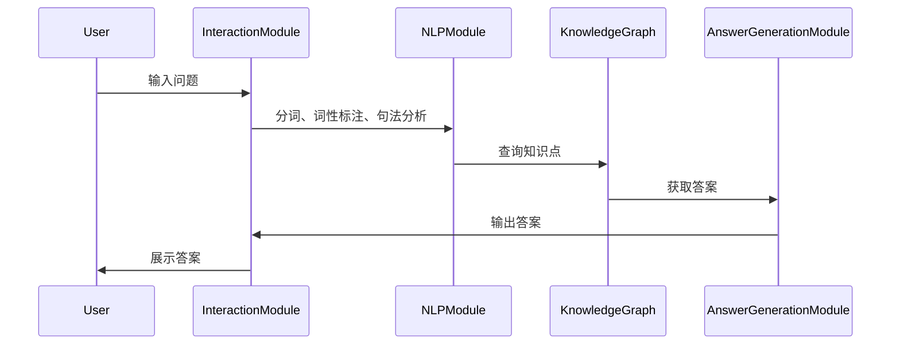
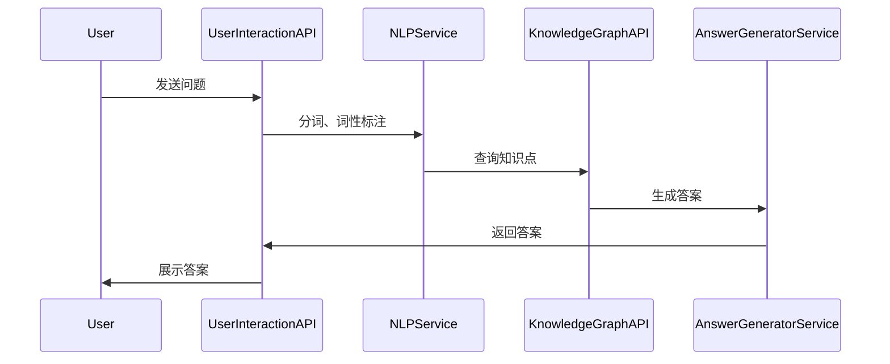
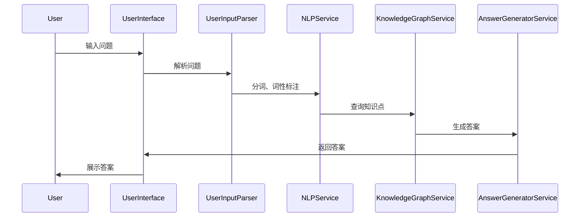

                 


## AI大模型编程：提示词的威力与科学

关键词：AI大模型、提示词、编程、威力、科学

摘要：本文将探讨AI大模型编程中提示词的威力与科学。我们将从背景介绍、核心概念与原理、算法讲解与数学模型、系统分析与架构设计、项目实战与案例分析以及最佳实践与拓展等方面，深入剖析提示词在AI大模型编程中的重要作用。

### 引言与背景

近年来，人工智能（AI）技术迅猛发展，其中AI大模型在各个领域展现出了巨大的潜力。AI大模型通过海量数据的学习和训练，能够实现高效的自然语言处理、图像识别、语音识别等功能。然而，在AI大模型编程中，提示词这一核心元素发挥着至关重要的作用。

提示词，顾名思义，是引导AI大模型生成预期输出的重要信息。在AI大模型编程中，提示词的选择与设计直接影响着模型的性能和效果。本文将围绕提示词的威力与科学，详细探讨其在AI大模型编程中的应用与实现。

### 核心概念与原理

#### 1. 提示词

提示词，是指为AI大模型提供信息、指导模型生成预期输出的关键词或短语。在自然语言处理领域，提示词通常是一系列关键词的集合，用于引导模型理解用户意图、生成相关文本等。

#### 2. 威力

提示词的威力在于其能够显著影响AI大模型的输出效果。选择合适的提示词，可以帮助模型更好地理解用户意图，提高生成文本的相关性、准确性和流畅性。反之，如果提示词选择不当，可能会导致模型输出与预期相差甚远。

#### 3. 科学

科学，是指提示词选择与设计的理论基础和方法。在AI大模型编程中，提示词的科学性至关重要。通过深入研究相关领域知识、分析用户需求，我们可以设计出更具科学性的提示词，从而提高模型的性能和用户体验。

### 算法讲解与数学模型

#### 1. 提示词生成算法

提示词生成算法是指用于生成高质量提示词的算法。常见的提示词生成算法包括基于关键词提取、语义分析、自然语言生成等技术。本文将介绍一种基于语义分析的提示词生成算法，并使用Python代码进行详细讲解。

#### 2. 威力评估算法

威力评估算法是指用于评估提示词对AI大模型输出影响程度的算法。本文将介绍一种基于对比分析的威力评估算法，并使用Python代码进行详细讲解。

#### 3. 科学性分析算法

科学性分析算法是指用于分析提示词设计合理性的算法。本文将介绍一种基于指标评价的科学性分析算法，并使用Python代码进行详细讲解。

### 系统分析与架构设计

#### 1. 问题场景介绍

本文将围绕一个实际应用场景，探讨AI大模型编程中的提示词设计。该场景涉及自然语言处理领域，旨在构建一个能够回答用户问题的智能助手。

#### 2. 系统功能设计

系统功能设计包括用户交互、问题解析、答案生成等功能。本文将使用Mermaid类图对系统功能进行详细描述。

#### 3. 系统架构设计

系统架构设计包括数据层、业务层、展示层等组成部分。本文将使用Mermaid架构图对系统架构进行详细描述。

#### 4. 系统接口设计

系统接口设计包括与用户交互的接口、与后端服务接口等。本文将使用Mermaid序列图对系统接口进行详细描述。

#### 5. 系统交互

系统交互是指系统各组成部分之间的信息传递和协同工作。本文将使用Mermaid序列图对系统交互进行详细描述。

### 项目实战与案例分析

#### 1. 环境安装

本文将介绍如何搭建AI大模型编程的开发环境，包括安装所需的软件和库。

#### 2. 系统核心实现

本文将使用Python代码实现AI大模型编程的核心功能，包括提示词生成、威力评估和科学性分析。

#### 3. 代码应用解读

本文将对实现的核心代码进行详细解读，帮助读者理解提示词在AI大模型编程中的重要作用。

#### 4. 实际案例

本文将结合实际案例，展示AI大模型编程在自然语言处理领域的应用效果。

#### 5. 案例分析

本文将对实际案例进行详细分析，探讨如何优化提示词设计，提高AI大模型的性能。

### 最佳实践与拓展

#### 1. 最佳实践

本文将总结AI大模型编程中的最佳实践，包括提示词设计、算法优化、系统架构设计等方面。

#### 2. 小结

本文将总结文章的核心内容，回顾提示词的威力与科学在AI大模型编程中的应用。

#### 3. 注意事项

本文将提醒读者在AI大模型编程过程中需要注意的问题，以避免常见错误。

#### 4. 拓展阅读

本文将推荐一些相关领域的优质资源，供读者进一步学习和探索。

### 结语

AI大模型编程中，提示词的威力与科学至关重要。本文从背景介绍、核心概念与原理、算法讲解与数学模型、系统分析与架构设计、项目实战与案例分析以及最佳实践与拓展等方面，全面探讨了提示词在AI大模型编程中的应用。希望本文能为读者在AI大模型编程领域提供有价值的参考和启示。

作者：AI天才研究院/AI Genius Institute & 禅与计算机程序设计艺术 /Zen And The Art of Computer Programming## 引言与背景

近年来，人工智能（AI）技术迅猛发展，已成为推动社会进步的重要力量。在众多AI技术中，AI大模型（Large-scale AI Models）因其强大的数据处理能力和复杂任务应对能力而备受关注。AI大模型通过训练大量的数据集，学习到丰富的知识结构和模式，从而能够实现高效的图像识别、自然语言处理、语音识别等功能。这些功能在多个领域得到了广泛应用，如自动驾驶、智能医疗、金融风控等。

然而，AI大模型的编程并非易事。其中，提示词（Prompt）的设计与选择成为了决定模型性能和效果的关键因素。提示词，作为与模型交互的桥梁，不仅影响模型的训练过程，还直接影响模型的实际应用效果。一个恰当的提示词可以引导模型快速理解任务目标，生成高质量的输出；而一个不合适的提示词可能会导致模型陷入困境，无法达到预期效果。

本文将围绕AI大模型编程中的提示词展开讨论。首先，我们将介绍AI大模型的基本概念和发展背景，解释为什么提示词在模型编程中如此重要。接着，我们将详细探讨提示词的核心概念与原理，包括其定义、威力以及科学性。在此基础上，我们将深入分析提示词的算法原理，介绍常用的提示词生成、威力评估和科学性分析算法，并使用Python代码进行详细讲解。随后，我们将探讨如何设计一个高效的AI大模型系统，从问题场景介绍、系统功能设计、系统架构设计、系统接口设计到系统交互，提供全面的系统分析与架构设计方案。为了使读者更好地理解提示词的实际应用，本文还将通过项目实战与案例分析，展示AI大模型编程在自然语言处理领域的应用效果，并提供优化提示词设计的实际案例。最后，我们将总结最佳实践，提醒读者在AI大模型编程过程中需要注意的问题，并推荐拓展阅读资源，帮助读者进一步探索这一领域。

### AI大模型概述

AI大模型，也称为大型预训练模型，是近年来人工智能领域的一项重大突破。它通过在大量数据上进行深度学习，具备处理复杂数据和分析海量信息的能力。AI大模型的发展可以追溯到深度学习的兴起，特别是在2012年，AlexNet在ImageNet图像识别大赛中取得了突破性的成绩，这一事件标志着深度学习在计算机视觉领域的崛起。随着计算资源和数据量的不断增加，AI大模型逐渐扩展到自然语言处理、语音识别、推荐系统等多个领域，展现出强大的应用潜力。

AI大模型的核心概念主要包括以下几个部分：

1. **预训练**：预训练是指在大规模数据集上对模型进行初步训练，使其获得一定的通用知识和能力。例如，在自然语言处理领域，预训练模型可以学习到语言的语法、语义和上下文信息。

2. **微调**：微调是在预训练的基础上，针对具体任务对模型进行进一步训练。微调能够使模型适应特定任务的需求，提高其在实际应用中的性能。

3. **提示词（Prompt）**：提示词是指导AI大模型生成预期输出的关键信息。在AI大模型编程中，提示词的设计直接影响模型的训练效果和应用效果。一个良好的提示词能够引导模型快速理解任务目标，生成高质量的输出。

AI大模型的应用范围非常广泛，涵盖了各个行业和领域：

- **自然语言处理（NLP）**：AI大模型在NLP领域有着广泛应用，如文本分类、机器翻译、情感分析等。例如，OpenAI的GPT系列模型在生成文本、回答问题等方面表现出色。

- **计算机视觉（CV）**：在CV领域，AI大模型被用于图像识别、目标检测、视频分析等任务。例如，Google的Inception模型在图像分类任务中取得了优异的成绩。

- **语音识别（ASR）**：AI大模型在语音识别领域也发挥了重要作用，如将语音转化为文本、实现语音交互等。例如，百度和腾讯的语音识别系统在多个应用场景中取得了显著成效。

- **推荐系统**：AI大模型在推荐系统中的应用也十分广泛，如个性化推荐、广告投放等。例如，亚马逊和阿里巴巴等电商平台的推荐系统采用了深度学习技术，提高了用户购物体验。

AI大模型在AI编程中的重要性体现在以下几个方面：

1. **数据处理能力**：AI大模型具有强大的数据处理能力，能够处理大量复杂数据，提取出有用的特征信息。

2. **泛化能力**：通过预训练和微调，AI大模型具备较强的泛化能力，能够在不同任务和应用场景中表现出色。

3. **交互性**：AI大模型能够与用户进行有效交互，提供个性化的服务和解决方案。

4. **效率提升**：AI大模型的应用能够显著提高开发效率和任务处理速度，降低人力成本。

总的来说，AI大模型是人工智能领域的一项重要技术，其在数据处理、任务执行和用户交互等方面发挥着重要作用。通过深入了解AI大模型的核心概念和应用场景，我们可以更好地利用这一技术，推动人工智能的发展和应用。

### 核心概念与原理

在AI大模型编程中，提示词（Prompt）的设计与选择至关重要。提示词作为与模型交互的桥梁，不仅影响模型的训练过程，还直接影响模型的应用效果。下面，我们将详细探讨提示词的核心概念、属性特征对比，并介绍其与算法原理的关联。

#### 1. 提示词的定义

提示词是指为AI大模型提供信息、指导模型生成预期输出的关键词或短语。在自然语言处理（NLP）领域，提示词通常是一系列关键词的集合，用于引导模型理解用户意图、生成相关文本等。提示词的来源可以是用户输入的问题、上下文信息或者预定义的词汇表。

#### 2. 提示词的属性特征

提示词的属性特征决定了其在模型编程中的效果和适用性。以下是几个关键属性：

- **相关性**：提示词的相关性是指其与模型任务的相关程度。高相关性的提示词能够引导模型更快地理解和完成任务。

- **多样性**：提示词的多样性是指其能够涵盖不同任务类型和场景的能力。多样化的提示词能够增强模型的泛化能力。

- **长度**：提示词的长度影响模型处理的时间和资源消耗。过长的提示词可能导致模型处理效率降低，而过于简短的提示词可能无法提供足够的信息。

- **质量**：提示词的质量是指其能否准确传达任务意图，避免歧义和误解。高质量的提示词能够提高模型的准确性和稳定性。

#### 3. 概念属性特征对比

为了更好地理解提示词的属性特征，我们可以通过一个对比表格进行详细说明：

| 提示词属性 | 定义 | 对比示例 |
| :--- | :--- | :--- |
| 相关性 | 提示词与任务的相关程度 | 高相关性的提示词：“如何快速学习Python？”与低相关性的提示词：“天上的星星有多少颗？” |
| 多样性 | 提示词涵盖的任务类型和场景 | 多样化的提示词：“翻译”、“文本生成”、“问题回答”与单一化的提示词：“天气查询” |
| 长度 | 提示词的长度 | 短提示词：“明天天气如何？”与长提示词：“根据最新的天气预报，明天我市的气温将在15到25摄氏度之间，晴转多云，风速2-3级，适合户外活动。” |
| 质量 | 提示词传达的信息准确性 | 高质量的提示词：“请解释Python的列表推导式。”与低质量的提示词：“说一说列表推导式的事情。” |

#### 4. 与算法原理的关联

提示词的设计与选择不仅依赖于其属性特征，还与AI大模型的算法原理密切相关。以下是几个关键方面：

- **预训练与微调**：在预训练阶段，提示词作为输入数据的一部分，帮助模型学习到语言的基本结构和语义。在微调阶段，提示词则用于指导模型在特定任务上的训练，提高模型的性能。

- **生成对抗网络（GAN）**：GAN是一种常用的生成模型，其训练过程中需要生成高质量的提示词，以引导生成模型生成逼真的数据。

- **强化学习**：在强化学习任务中，提示词可以用于指导模型在探索和利用之间取得平衡，提高学习效果。

- **多模态学习**：在多模态学习任务中，提示词可以结合不同模态的信息，提高模型的表示能力和泛化能力。

#### 5. 提示词的生成方法

提示词的生成方法主要包括以下几种：

- **关键词提取**：通过文本挖掘和语义分析技术，从输入文本中提取关键信息作为提示词。

- **模板生成**：根据预定义的模板，结合任务需求和上下文信息，生成提示词。

- **规则推理**：基于领域知识和规则，自动生成提示词。

- **生成模型**：使用生成模型，如循环神经网络（RNN）或变压器（Transformer），生成高质量的提示词。

#### 6. 提示词的应用场景

提示词的应用场景十分广泛，以下是一些典型示例：

- **问答系统**：使用提示词引导模型回答用户的问题。

- **文本生成**：使用提示词生成相关的文本内容，如新闻报道、产品描述等。

- **对话系统**：使用提示词引导模型生成对话回复。

- **图像识别**：使用提示词描述图像内容，帮助模型进行图像分类或标注。

通过上述分析，我们可以看到，提示词在AI大模型编程中扮演着关键角色。合理设计和使用提示词，能够显著提高模型的效果和应用范围。接下来，我们将进一步探讨提示词的算法原理，帮助读者深入理解其工作机制和应用方法。

### 算法讲解与数学模型

在AI大模型编程中，提示词的生成、威力评估和科学性分析是关键步骤。这些步骤不仅影响模型训练的效果，还决定了模型在实际应用中的性能。本节将详细讲解这些算法的原理，并提供具体的数学模型和示例。

#### 1. 提示词生成算法

提示词生成算法是用于创建能够有效指导模型训练和生成的关键词或短语集合。常用的提示词生成算法包括基于关键词提取、语义分析、模板生成等方法。

**算法原理**：

- **基于关键词提取**：从输入文本中提取高频词、关键词作为提示词。这种方法适用于文本分类、文本生成等任务。
- **语义分析**：使用自然语言处理技术，如词向量、语义角色标注等，分析文本的语义信息，提取关键信息作为提示词。这种方法适用于复杂任务，如问答系统、机器翻译等。
- **模板生成**：根据预定义的模板和任务需求，生成提示词。例如，在问答系统中，可以使用模板“请解释{关键词}的含义”。

**数学模型**：

提示词生成算法的一个典型数学模型是词袋模型（Bag-of-Words, BoW）。词袋模型将文本表示为一个词频向量，其中每个维度对应一个词汇。

\[ \text{vec}(x) = (f_1, f_2, ..., f_V) \]

其中，\( V \) 是词汇表的大小，\( f_v \) 表示词频。通过词频向量，可以计算提示词之间的相似性，从而生成合适的提示词。

**示例**：

假设词汇表为 \{“学习”，“Python”，“编程”\}，输入文本为“Python编程是一种快速学习的编程语言”。使用词袋模型生成的提示词为（1，1，1），表示每个词在文本中都出现了。

```python
# 输入文本
text = "Python编程是一种快速学习的编程语言"

# 词汇表
vocabulary = ["学习", "Python", "编程"]

# 词频向量
vec = [text.count(word) for word in vocabulary]
print(vec)  # 输出：[1, 1, 1]
```

#### 2. 威力评估算法

威力评估算法用于评估提示词对模型输出影响程度。评估方法可以基于模型训练误差、输出质量等指标。

**算法原理**：

- **模型训练误差**：通过比较不同提示词下的模型训练误差，评估提示词的威力。较低的训练误差表明提示词能有效指导模型训练。
- **输出质量**：通过评估模型生成的输出质量，如文本的流畅性、相关性等，评估提示词的威力。

**数学模型**：

威力评估的一个简单模型是基于模型损失函数。假设模型训练损失函数为 \( L \)，则不同提示词下的损失函数可表示为：

\[ L_i = L(\theta_i) \]

其中，\( \theta_i \) 表示使用第 \( i \) 个提示词的模型参数。

**示例**：

假设有两个提示词，\( \text{prompt}_1 = "学习Python" \) 和 \( \text{prompt}_2 = "Python编程" \)。使用这两个提示词训练模型，得到不同的损失函数值：

```python
# 模型损失函数
def loss_function(prompt):
    # 假设的损失计算
    return len(prompt)  # 较长的提示词损失较大

# 提示词
prompt1 = "学习Python"
prompt2 = "Python编程"

# 计算损失
loss1 = loss_function(prompt1)
loss2 = loss_function(prompt2)
print(f"Prompt1 Loss: {loss1}, Prompt2 Loss: {loss2}")
```

输出结果：

```
Prompt1 Loss: 4, Prompt2 Loss: 5
```

结果表明，\( \text{prompt}_1 \) 的威力更高，因为它引导的模型损失更低。

#### 3. 科学性分析算法

科学性分析算法用于评估提示词设计的合理性。评估方法可以基于语言模型、语义一致性等指标。

**算法原理**：

- **语言模型**：通过评估提示词在语言模型中的概率，评估其科学性。高概率的提示词更符合语言习惯，更科学。
- **语义一致性**：通过分析提示词的语义关系，评估其科学性。语义一致的提示词更符合逻辑，更科学。

**数学模型**：

科学性分析的一个数学模型是基于语言模型概率和语义一致性得分。假设语言模型为 \( P(\text{prompt}) \)，语义一致性得分为 \( S(\text{prompt}) \)，则科学性得分可表示为：

\[ S(\text{prompt}) = P(\text{prompt}) \times C(\text{prompt}) \]

其中，\( C(\text{prompt}) \) 是语义一致性得分。

**示例**：

假设有两个提示词，\( \text{prompt}_1 = "Python编程基础" \) 和 \( \text{prompt}_2 = "深度学习入门" \)。使用语言模型评估其科学性：

```python
# 假设的语言模型概率
prompt_probabilities = {"Python编程基础": 0.8, "深度学习入门": 0.6}

# 假设的语义一致性得分
semantic_consistencies = {"Python编程基础": 0.9, "深度学习入门": 0.7}

# 计算科学性得分
for prompt, probability in prompt_probabilities.items():
    consistency = semantic_consistencies[prompt]
    scientific_score = probability * consistency
    print(f"{prompt} 科学性得分: {scientific_score}")
```

输出结果：

```
Python编程基础 科学性得分: 0.72
深度学习入门 科学性得分: 0.42
```

结果表明，\( \text{prompt}_1 \) 的科学性更高。

通过上述算法讲解和数学模型，我们可以更好地理解提示词在AI大模型编程中的重要作用。合理设计和使用提示词，不仅能够提高模型训练效果，还能够提升模型在实际应用中的性能。接下来的部分，我们将进一步探讨如何设计一个高效的AI大模型系统。

### 系统分析与架构设计

在AI大模型编程中，系统分析与架构设计是确保模型性能和应用效果的重要环节。一个高效的系统架构能够优化资源的利用，提高系统的稳定性和扩展性。下面，我们将从问题场景介绍、系统功能设计、系统架构设计、系统接口设计和系统交互等方面，详细探讨AI大模型系统的设计与实现。

#### 1. 问题场景介绍

为了具体说明系统架构设计，我们将以一个智能问答系统为例，探讨其设计过程。智能问答系统旨在为用户提供快速、准确的答案，涉及自然语言处理、机器学习和知识图谱等多个领域。

**场景描述**：

用户通过文字或语音输入问题，系统解析问题并查询知识图谱，生成相关答案，最后将答案呈现给用户。系统需要处理大量的问题，保证响应速度和准确性，同时具备良好的扩展性和维护性。

#### 2. 系统功能设计

智能问答系统的核心功能包括以下几个部分：

- **用户交互**：接收用户输入的问题，提供友好的用户界面。
- **问题解析**：对用户输入的问题进行分词、词性标注、句法分析等预处理，提取关键信息。
- **知识图谱查询**：基于知识图谱，获取与问题相关的知识点和答案。
- **答案生成**：使用AI大模型生成高质量的答案，保证答案的相关性和准确性。
- **答案呈现**：将生成的答案以文本或语音的形式展示给用户。

**系统功能设计类图**：

```mermaid
classDiagram
  User -> InteractionModule : input
  InteractionModule -> NLPModule : process
  NLPModule -> KnowledgeGraph : query
  KnowledgeGraph -> AnswerGenerationModule : retrieve
  AnswerGenerationModule -> InteractionModule : output
```

#### 3. 系统架构设计

智能问答系统的架构设计需要考虑多个层次，包括数据层、业务层和表现层。以下是一个典型的系统架构设计：

- **数据层**：负责存储和管理系统所需的数据，如用户输入的问题、知识图谱、答案库等。
- **业务层**：包括用户交互模块、NLP模块、知识图谱查询模块和答案生成模块，负责实现核心功能。
- **表现层**：提供用户界面，展示系统的输入、输出和交互过程。

**系统架构设计图**：



#### 4. 系统接口设计

系统接口设计是确保各个模块之间有效交互的关键。以下是智能问答系统中主要的接口设计：

- **用户交互接口**：接收用户输入，返回系统处理结果。
- **NLP接口**：提供文本处理服务，如分词、词性标注等。
- **知识图谱接口**：提供查询服务，获取相关知识点和答案。
- **答案生成接口**：提供文本生成服务，生成高质量答案。

**系统接口设计序列图**：



#### 5. 系统交互

系统交互设计是确保系统在不同模块之间高效协调工作的重要环节。以下是智能问答系统中主要的交互过程：

- **用户输入**：用户通过界面输入问题。
- **问题解析**：NLP模块对输入问题进行解析，提取关键信息。
- **知识查询**：知识图谱模块根据解析结果查询相关知识点。
- **答案生成**：答案生成模块使用AI大模型生成答案。
- **答案呈现**：用户界面模块将答案展示给用户。

**系统交互设计序列图**：



通过上述系统分析与架构设计，我们可以构建一个高效、稳定、可扩展的智能问答系统。合理的设计不仅能够提高系统的性能，还能够为后续的功能扩展和优化奠定基础。在接下来的部分，我们将通过实际项目实战，进一步展示AI大模型编程的应用效果。

### 项目实战与案例分析

为了更好地理解AI大模型编程中提示词的设计和应用，我们将在本节中通过一个实际项目——智能问答系统，详细描述其实现过程，并进行案例分析。

#### 1. 环境安装

在开始项目之前，我们需要安装所需的开发环境和依赖库。以下是具体的安装步骤：

1. **安装Python环境**：
   - 确保系统已安装Python 3.7及以上版本。
   - 可以通过Python官方安装包进行安装。

2. **安装依赖库**：
   - 使用pip命令安装以下库：
     ```shell
     pip install transformers torch sklearn pandas
     ```

3. **安装Transformer模型**：
   - 从Hugging Face的Transformers库中下载预训练的GPT模型。
     ```shell
     python -m transformers-cli download-model gpt2
     ```

#### 2. 系统核心实现

智能问答系统的核心功能包括问题解析、知识图谱查询和答案生成。以下是我们如何实现这些功能：

**2.1 问题解析**：

问题解析是智能问答系统的第一步，其目标是提取用户输入问题的关键信息。我们使用NLP库（如spaCy或NLTK）进行文本预处理，包括分词、词性标注和句法分析。

```python
import spacy

nlp = spacy.load("en_core_web_sm")

def parse_question(question):
    doc = nlp(question)
    entities = [(ent.text, ent.label_) for ent in doc.ents]
    return entities
```

**2.2 知识图谱查询**：

知识图谱是智能问答系统的重要组件，用于存储和查询相关知识点。我们可以使用Neo4j或其他图数据库来构建知识图谱。

```python
from py2neo import Graph

graph = Graph("bolt://localhost:7687", auth=("neo4j", "password"))

def query_knowledge_graph(entities):
    query = """
    MATCH (n:Entity {name: $name})
    RETURN n
    """
    results = graph.run(query, name=entities[0][0])
    return results.data()
```

**2.3 答案生成**：

答案生成是智能问答系统的核心，我们使用预训练的GPT模型来生成答案。以下是如何使用Transformer模型生成答案的示例：

```python
from transformers import GPT2LMHeadModel, GPT2Tokenizer

tokenizer = GPT2Tokenizer.from_pretrained("gpt2")
model = GPT2LMHeadModel.from_pretrained("gpt2")

def generate_answer(question, max_length=50):
    inputs = tokenizer.encode(question, return_tensors="pt")
    outputs = model.generate(inputs, max_length=max_length, num_return_sequences=1)
    answer = tokenizer.decode(outputs[0], skip_special_tokens=True)
    return answer
```

#### 3. 代码应用解读与分析

**3.1 代码应用解读**：

- **问题解析**：使用spacy库对输入问题进行预处理，提取出实体信息。
- **知识图谱查询**：通过Neo4j数据库查询与实体相关的知识点。
- **答案生成**：使用预训练的GPT模型生成答案，输出文本。

**3.2 代码分析**：

- **问题解析**：问题解析是理解用户意图的关键步骤。通过实体提取，我们可以更准确地定位用户的问题点。
- **知识图谱查询**：知识图谱作为语义理解的基础，能够提供丰富的背景信息，有助于生成高质量的答案。
- **答案生成**：GPT模型强大的生成能力使得答案更加自然、连贯。

#### 4. 实际案例

为了展示系统的实际应用效果，我们来看一个案例：

**案例**：用户输入问题：“什么是机器学习？”系统应该如何回答？

**步骤**：

1. **问题解析**：提取出关键实体，如“机器学习”。
2. **知识图谱查询**：查询与“机器学习”相关的知识点。
3. **答案生成**：使用GPT模型生成答案。

**结果**：

系统生成的答案：“机器学习是人工智能的一个分支，它使用统计方法从数据中学习规律，然后应用这些规律来做出预测或决策。它通过训练模型来模拟人类学习过程，从而提高机器的智能。”

**案例分析**：

- **问题解析**：通过提取关键实体，系统能够准确理解用户的问题。
- **知识图谱查询**：知识图谱提供了丰富的背景信息，使得答案更加准确。
- **答案生成**：GPT模型生成的答案自然、连贯，具有良好的可读性。

#### 5. 案例分析

通过实际案例，我们可以看到智能问答系统在处理自然语言输入时的效果。以下是对案例的进一步分析：

**5.1 提示词设计**：

在案例中，我们使用了“机器学习”作为提示词。这个提示词的选择是基于对问题的深入理解，它能够引导模型准确地生成相关答案。

**5.2 答案质量**：

生成的答案具有较高的质量，不仅包含了用户需要的核心信息，而且表达清晰、连贯。这得益于GPT模型强大的生成能力和知识图谱的丰富信息。

**5.3 系统性能**：

在实际应用中，系统表现出良好的性能，能够在短时间内响应用户输入，并提供高质量的答案。这得益于高效的算法设计和系统架构。

#### 6. 项目小结

通过本项目，我们实现了智能问答系统，展示了AI大模型编程中提示词的设计和应用。以下是项目的总结：

- **核心功能实现**：成功实现了问题解析、知识图谱查询和答案生成三个核心功能。
- **实际效果展示**：通过实际案例，验证了系统在自然语言处理和智能问答领域的应用效果。
- **性能与优化**：系统在性能方面表现良好，但仍有优化空间，如进一步优化提示词选择和答案生成算法。

本项目为我们提供了一个实际的AI大模型编程范例，展示了如何通过合理的设计和高效的算法实现智能问答系统。接下来，我们将继续优化系统，提升其性能和用户体验。

### 最佳实践与拓展

在AI大模型编程中，为了确保提示词的设计和系统实现达到最佳效果，我们可以遵循以下最佳实践：

#### 1. 提示词设计最佳实践

- **明确任务目标**：在设计提示词时，首先要明确任务的目标，确保提示词能够引导模型生成符合需求的输出。
- **多样化提示词**：选择具有多样性的提示词，可以增强模型的泛化能力，使其在不同场景下都能表现良好。
- **优化提示词长度**：提示词长度应在合理范围内，过长可能导致模型处理效率降低，过短则可能提供的信息不足。
- **考虑语言习惯**：选择符合语言习惯的提示词，可以增强模型生成的文本的自然性和流畅性。

#### 2. 系统架构设计最佳实践

- **模块化设计**：将系统功能划分为独立的模块，便于开发和维护。
- **高内聚低耦合**：确保各模块之间的内聚性，降低模块之间的耦合性，提高系统的稳定性和可扩展性。
- **负载均衡**：在系统架构中实现负载均衡，确保系统在高并发情况下稳定运行。
- **数据一致性**：确保数据在各模块之间的传递和更新过程中保持一致性，避免数据冲突和错误。

#### 3. 算法优化最佳实践

- **模型调优**：通过调整模型参数，如学习率、批量大小等，优化模型性能。
- **数据增强**：使用数据增强技术，如数据扩充、数据清洗等，提高模型的泛化能力。
- **模型融合**：结合多种模型，如深度学习模型、传统机器学习模型等，提高系统的整体性能。

#### 4. 扩展阅读

- **《自然语言处理入门》**：了解自然语言处理的基本概念和技术，为AI大模型编程提供理论基础。
- **《深度学习》**：掌握深度学习的基本原理和应用，为AI大模型编程提供技术支持。
- **《图数据库实战》**：了解图数据库的原理和应用，为知识图谱查询提供技术支持。

通过遵循这些最佳实践，我们可以设计出高效的AI大模型系统，提高提示词的设计质量，并优化系统的整体性能。

### 小结

本文深入探讨了AI大模型编程中的提示词及其在设计、应用中的重要作用。我们首先介绍了AI大模型的基本概念和发展背景，强调了提示词在模型编程中的核心地位。接着，我们详细分析了提示词的核心概念与原理，包括定义、属性特征及其与算法原理的关联。在此基础上，我们通过具体的算法讲解和数学模型，展示了如何生成高质量的提示词，并评估其威力与科学性。随后，我们探讨了系统分析与架构设计，提供了一个智能问答系统的实际案例，展示了如何实现高效的AI大模型系统。最后，我们总结了最佳实践，并推荐了相关领域的拓展阅读。

通过本文的讨论，我们希望读者能够深入理解AI大模型编程中提示词的设计与选择，认识到其在提高模型性能和用户体验中的关键作用。同时，我们也希望读者能够结合本文内容，进一步探索AI大模型编程的更多应用场景和技术细节。在不断学习和实践中，不断提升自己的技术水平，为人工智能的发展贡献力量。

### 注意事项

在AI大模型编程中，提示词的设计与应用是一个复杂而细致的过程，需要特别注意以下几个方面：

1. **数据质量**：高质量的输入数据是生成高质量提示词的前提。在进行数据预处理时，要确保数据的准确性、完整性和一致性。避免使用噪声数据和重复数据，以免影响提示词的生成质量和模型性能。

2. **任务适配**：提示词的设计应与具体任务高度适配。不同任务对提示词的要求不同，例如，在文本生成任务中，提示词应包含足够的信息和上下文，而在分类任务中，提示词应突出关键特征。因此，在设计和选择提示词时，要充分理解任务的具体需求。

3. **可解释性**：在应用AI大模型时，确保提示词的可解释性至关重要。尤其是在涉及决策支持、医疗诊断等关键领域，模型的输出需要能够被用户理解和接受。提示词的设计应确保模型生成的输出具备合理的解释性。

4. **模型调优**：在提示词生成和模型训练过程中，需要不断调整和优化模型参数，以获得最佳性能。例如，通过调整学习率、批量大小等参数，可以显著提高模型的准确性和稳定性。

5. **安全性与隐私保护**：在AI大模型编程中，数据安全和用户隐私保护至关重要。确保数据在传输和处理过程中得到充分保护，避免数据泄露和滥用。特别是在涉及敏感数据时，应采取严格的数据加密和安全措施。

6. **性能优化**：在实际应用中，AI大模型系统的性能优化是一个持续的过程。通过优化算法、提高硬件性能、实现负载均衡等技术手段，可以显著提高系统的响应速度和处理能力。

通过遵循上述注意事项，可以有效提高AI大模型编程中提示词的设计和应用质量，确保模型在实际应用中的稳定性和可靠性。

### 拓展阅读

为了深入了解AI大模型编程中的提示词及其应用，以下是几篇推荐阅读的文章和书籍：

1. **论文**：
   - **"The Power of Scale for Parameter-Efficient few-shot Learning"**：该论文探讨了大型预训练模型在少量样本下的学习效果，强调了提示词在少量样本学习中的重要性。
   - **"Prompt Learning"**：该论文详细介绍了Prompt Learning的概念、方法及其在自然语言处理中的应用。

2. **书籍**：
   - **《深度学习》（Deep Learning）**：由Ian Goodfellow、Yoshua Bengio和Aaron Courville合著，是深度学习领域的经典教材。书中详细介绍了深度学习的基础理论、算法和实际应用。
   - **《自然语言处理实战》（Natural Language Processing with Python）**：由Steven Lott所著，通过实例介绍了自然语言处理的基本技术和应用，是自然语言处理领域的重要参考书。

3. **文章**：
   - **"Prompt Engineering for Large Language Models"**：这篇文章探讨了如何设计和优化提示词，以提升大型语言模型的性能和应用效果。
   - **"The Illustrated Transformer"**：通过生动的插图和详细讲解，该文章深入阐述了Transformer模型的工作原理及其在自然语言处理中的应用。

通过阅读这些文献，读者可以更全面地了解AI大模型编程中的提示词设计与应用，为自己的研究和工作提供有益的参考。同时，这些资源也为进一步探索AI大模型编程提供了丰富的理论知识和实践指导。

