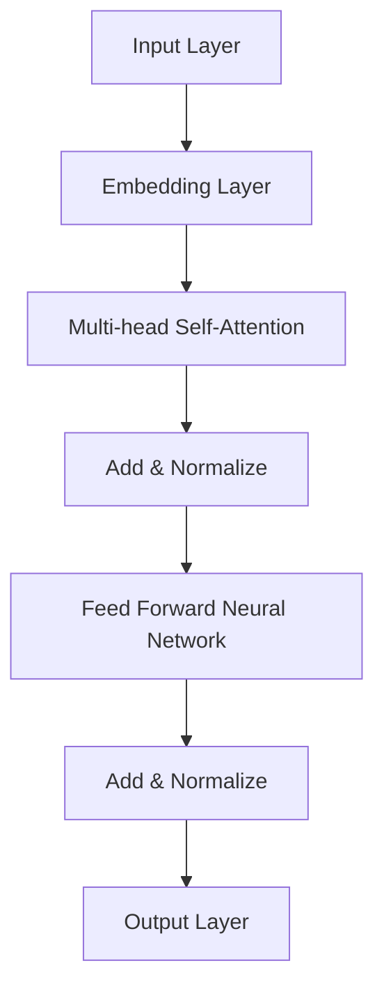

                 


### 1. Introduction to the Book

#### Article Title: AI 大模型编程：提示词的威力与艺术

#### Keywords: AI 大模型，编程，提示词，提示工程，人工智能，深度学习

#### Abstract:

The article delves into the world of AI 大模型 programming, focusing on the power and art of prompt engineering. It explores the fundamentals of AI 大 models, their underlying principles, and the techniques of prompt engineering. The aim is to provide a comprehensive guide that not only introduces the core concepts but also illustrates practical applications and advanced topics in the field.

### 2. Overview of AI 大 Models and Prompt Engineering

#### 2.1 The Background and Importance of AI 大 Models

AI 大模型，作为现代人工智能的核心组成部分，已经在多个领域展现出其强大的能力。从自然语言处理（NLP）到计算机视觉（CV），再到数据科学和数据分析，AI 大模型正迅速改变我们的生活方式和工作方式。它们能够处理复杂的任务，从生成高质量的文章到提供精准的图像识别，这些都是传统方法难以实现的。

#### 2.2 Basic Concepts and Terminology in AI 大 Models

AI 大模型通常指的是那些能够处理大规模数据、拥有数亿参数的深度学习模型。这些模型基于神经网络架构，如Transformer和BERT，通过大量的训练数据学习到数据中的模式和规律。关键术语包括：

- **神经网络（Neural Networks）**：模拟人脑神经网络结构的信息处理系统。
- **深度学习（Deep Learning）**：一种机器学习方法，通过多层神经网络来学习数据的复杂特征。
- **Transformer**：一种基于自注意力机制的神经网络结构，广泛应用于序列数据的处理。
- **BERT（Bidirectional Encoder Representations from Transformers）**：一种预训练语言表示模型，能够捕捉词义的上下文信息。

#### 2.3 Key Techniques and Prompts in AI 大 Models

在AI 大模型中，提示词（prompts）是关键。提示词是一种引导AI 大模型生成特定输出或执行特定任务的方法。有效的提示词设计能够显著提高模型的性能和响应质量。以下是几个关键的提示技术：

- **结构化提示**：通过提供明确的任务指令和数据结构，帮助模型更好地理解和处理任务。
- **示例引导**：通过提供示例，帮助模型学习特定的模式或任务。
- **反向反馈**：通过用户反馈来调整提示，不断优化模型的输出。

#### 2.4 The Role and Impact of Prompt Engineering

提示工程在AI 大模型的应用中起着至关重要的作用。一个良好的提示能够引导模型更好地理解任务需求，提高任务的完成质量和效率。同时，提示工程也是AI 大模型研究的一个重要方向，涉及到自然语言处理、机器学习、认知科学等多个领域。

#### 2.5 Summary

通过对AI 大模型和提示工程的概述，我们可以看到它们在现代人工智能中的重要性。接下来，我们将深入探讨AI 大模型的基本原理、提示词的构建技巧、以及在不同领域的应用。

### 3. Fundamentals of AI 大 Models

#### 3.1 Introduction to Neural Networks and Deep Learning

神经网络（Neural Networks）是模拟人脑神经元结构和功能的计算模型。在神经网络中，每个神经元都与其他神经元相连，并通过对输入信号的处理产生输出。神经网络的基本组成部分包括：

- **神经元**：信息处理单元，接受输入信号并产生输出。
- **权重**：表示神经元之间的连接强度。
- **激活函数**：用于决定神经元是否激活。

神经网络通过不断调整权重来学习输入和输出之间的关系，从而实现复杂的数据处理任务。

深度学习（Deep Learning）是神经网络的一种扩展，通过多层网络结构来学习数据的复杂特征。深度学习的关键优势在于其能够自动提取高层次的特征表示，这使得它在图像识别、语音识别等领域取得了显著的成功。

#### 3.2 Key Concepts in AI 大 Models: Neural Networks, Transformers, etc.

AI 大模型通常基于神经网络架构，如Transformer和Bert。Transformer模型是一种基于自注意力机制的深度学习模型，特别适用于序列数据的处理。其核心思想是通过计算序列中每个词与其他词之间的关联性来生成特征表示。

BERT（Bidirectional Encoder Representations from Transformers）是一种预训练语言表示模型，通过在双向序列中同时考虑每个词的前后文来学习词的语义表示。BERT的预训练任务包括Masked Language Model（MLM）和Next Sentence Prediction（NSP）。

#### 3.3 Mermaid Diagram of AI 大 Model Architecture

为了更好地理解AI 大模型的架构，我们可以使用Mermaid绘制其结构。以下是一个简化的Transformer模型架构的Mermaid图：



在这个图中，输入层（A）将文本数据转换为嵌入向量（B），然后通过多头自注意力机制（C）处理数据，并通过层归一化（D）和前馈神经网络（E）进行进一步处理，最后在输出层（G）生成结果。

#### 3.4 Understanding Latent-Directive Hazards

在AI 大模型的训练和应用过程中，存在一些潜在的风险和挑战，如Latent-Directive Hazards。Latent-Directive Hazards指的是模型可能对隐含的指令或指导产生不当的反应。

例如，一个语言模型可能会根据训练数据中的偏见产生歧视性输出。为了减少这些风险，研究人员提出了多种方法，如对抗性训练、数据清洗和模型解释性等。

#### 3.5 Summary

通过对AI 大模型的基本原理和关键概念的介绍，我们可以更好地理解这些模型的工作方式。接下来，我们将探讨提示词的构建技巧，以及如何通过有效的提示来优化模型的性能。

### 4. Practical Guide to Prompt Engineering

#### 4.1 The Structure and Characteristics of Effective Prompts

有效的提示词是AI 大模型成功应用的关键。一个有效的提示词应具备以下结构和特点：

- **清晰的任务描述**：明确告知模型要执行的任务，避免歧义和误解。
- **上下文信息**：提供相关的背景信息，帮助模型更好地理解任务需求。
- **明确的输出格式**：指定期望的输出格式或结构，以简化模型的处理过程。
- **反馈机制**：允许用户对模型的输出进行反馈，以便进行调整和优化。

#### 4.2 Techniques for Improving Prompt Quality

提升提示词的质量是提高AI 大模型性能的重要环节。以下是一些实用的技巧：

- **多样性和全面性**：使用多样化的提示词和示例，覆盖各种可能的任务场景。
- **逐步引导**：通过分步骤的提示，逐步引导模型理解复杂的任务。
- **用户参与**：鼓励用户参与提示的构建过程，以充分利用人类的知识和经验。
- **数据预处理**：对输入数据进行预处理，如去除无关信息、格式化数据等，以提高提示的质量。

#### 4.3 Prompt Evaluation and Optimization

评估和优化提示词是确保模型性能的关键步骤。以下是一些常用的方法：

- **自动评估**：使用自动评估指标，如BLEU、ROUGE等，对提示词的效果进行量化评估。
- **用户反馈**：收集用户反馈，了解提示词在实际应用中的表现和改进方向。
- **迭代优化**：根据评估结果和用户反馈，不断调整和优化提示词，以实现最佳性能。

#### 4.4 Case Studies of Successful Prompt Engineering

成功的提示词工程案例可以为我们提供宝贵的经验和启示。以下是一些典型的案例：

- **案例1：自然语言生成**：通过结构化的提示词，一个语言模型可以生成高质量的文章、报告等。
- **案例2：图像识别**：使用明确的提示词，可以帮助模型更好地识别和分类图像。
- **案例3：对话系统**：设计有效的提示词，可以使对话系统更自然、更准确地与用户交流。

#### 4.5 Summary

通过对提示词结构和特点的探讨，以及提升提示词质量和评估优化的方法，我们可以更有效地利用AI 大模型。接下来，我们将探讨AI 大模型在不同领域的实际应用。

### 5. AI 大 Model Applications in Various Fields

#### 5.1 AI 大 Models in Natural Language Processing

在自然语言处理（NLP）领域，AI 大模型如BERT和GPT-3已经展现出其强大的能力。它们可以用于文本分类、情感分析、机器翻译、问答系统等多个任务。通过结构化的提示词，这些模型能够生成高质量的自然语言文本，提高了信息提取和语义理解的能力。

#### 5.2 AI 大 Models in Computer Vision

在计算机视觉领域，AI 大模型如ResNet和Inception已经在图像分类、目标检测、图像生成等方面取得了显著成果。通过提示词，这些模型可以更好地理解图像内容，实现更精准的图像识别和标注。

#### 5.3 AI 大 Models in Data Science and Analytics

在数据科学和数据分析领域，AI 大模型可以用于数据清洗、特征提取、预测建模等任务。通过提示词，这些模型能够更好地处理复杂数据，提取有用信息，为决策提供支持。

#### 5.4 AI 大 Models in Education and E-commerce

在教育领域，AI 大模型可以用于智能辅导、课程生成、学生行为分析等。在电子商务领域，AI 大模型可以用于商品推荐、用户画像、欺诈检测等，提高了用户体验和商业效率。

#### 5.5 Summary

AI 大模型在各个领域的应用正在不断扩展，通过有效的提示词，这些模型能够更好地发挥其潜力。接下来，我们将探讨AI 大模型的先进技术和发展挑战。

### 6. Advanced Topics in AI 大 Models

#### 6.1 Fine-tuning AI 大 Models for Specific Tasks

对于特定的任务，微调（Fine-tuning）AI 大模型是一种常见且有效的策略。微调过程涉及在预训练模型的基础上，针对特定任务进行进一步的训练。这有助于模型更好地适应新的任务需求，提高任务完成质量。

#### 6.2 The Role of Transfer Learning in AI 大 Models

迁移学习（Transfer Learning）是AI 大模型的一个重要技术。通过利用预训练模型的知识，迁移学习可以显著减少对新数据的训练需求，提高模型的泛化能力。这对于处理数据稀缺或标注困难的任务尤为重要。

#### 6.3 The Challenges of AI 大 Model Interpretability

AI 大模型的解释性（Interpretability）是一个备受关注的挑战。由于这些模型通常由数亿甚至数十亿个参数组成，它们的内部工作机制非常复杂。解释性研究旨在揭示模型的决策过程，提高模型的可信度和透明度。

#### 6.4 Future Directions and Research Frontiers

未来的AI 大模型研究将朝着更高效、更智能、更可解释的方向发展。关键研究方向包括：更先进的神经网络架构、更有效的训练策略、更强大的模型解释性工具、以及跨领域的知识融合。

#### 6.5 Summary

AI 大模型的先进技术和发展挑战为我们提供了广阔的研究和应用前景。通过持续的创新和探索，我们将能够更好地发挥AI 大模型的能力，为各个领域带来更多价值。

### 7. Implementation and Optimization of AI 大 Models

#### 7.1 Hardware and Software Requirements for AI 大 Model Training

训练AI 大模型通常需要高性能的硬件和软件环境。常见的硬件配置包括高性能GPU和CPU，以及大量的内存和存储空间。软件方面，常用的框架如TensorFlow和PyTorch提供了丰富的工具和库，以支持AI 大模型的训练和优化。

#### 7.2 Data Preparation and Preprocessing

在训练AI 大模型之前，数据的准备和预处理是关键步骤。这包括数据清洗、格式化、标签化等操作。高质量的数据集是模型训练成功的基础，因此对数据进行严格的预处理是非常必要的。

#### 7.3 Training Process and Techniques

AI 大模型的训练过程通常涉及多个步骤，包括数据加载、模型构建、参数调整等。有效的训练技术如批量归一化、学习率调整、梯度裁剪等，有助于提高训练效率和模型性能。

#### 7.4 Optimization Strategies

优化AI 大模型的方法包括模型剪枝、量化、蒸馏等。模型剪枝可以减少模型的大小和计算复杂度，量化可以降低模型的存储和计算需求，而蒸馏则通过将知识从大型模型传递到小型模型来提高后者的性能。

#### 7.5 Case Study: Implementing a Language Model

以下是一个简单的语言模型实现案例，使用Python和TensorFlow框架：

```python
import tensorflow as tf

# Model parameters
vocab_size = 10000
embedding_dim = 256
num_layers = 3
hidden_size = 512
learning_rate = 0.001

# Model architecture
model = tf.keras.Sequential([
    tf.keras.layers.Embedding(vocab_size, embedding_dim),
    tf.keras.layers.LSTM(hidden_size, return_sequences=True),
    tf.keras.layers.LSTM(hidden_size),
    tf.keras.layers.Dense(vocab_size)
])

# Compile model
model.compile(optimizer=tf.keras.optimizers.Adam(learning_rate),
              loss=tf.keras.losses.SparseCategoricalCrossentropy(from_logits=True),
              metrics=['accuracy'])

# Train model
model.fit(dataset, epochs=10)
```

#### 7.6 Code Analysis and Explanation

上述代码实现了一个简单的语言模型，使用嵌入层（Embedding）将词汇映射到嵌入向量，然后通过两个LSTM层进行序列处理，最后通过全连接层（Dense）生成输出。编译模型时，使用Adam优化器和SparseCategoricalCrossentropy损失函数，以支持多分类问题。

#### 7.7 Summary

通过对AI 大模型的实现和优化策略的介绍，我们可以更好地理解和应用这些模型。接下来，我们将探讨最佳实践和注意事项。

### 8. Best Practices, Summary, and Notes

#### 8.1 Best Practices for Prompt Engineering

- **明确任务需求**：确保提示词清晰地传达任务目标，避免模糊和歧义。
- **多样化数据集**：使用多样化的数据集进行训练，以提高模型的泛化能力。
- **持续优化**：定期评估和调整提示词，以实现最佳性能。
- **用户参与**：鼓励用户参与提示的设计和反馈，以充分利用人类知识和经验。

#### 8.2 Summary of Key Points

- AI 大模型和提示词工程在人工智能领域具有重要作用。
- 提示词的设计和质量直接影响模型的性能和应用效果。
- 有效的提示词需要具备清晰的任务描述、上下文信息、明确的输出格式和反馈机制。
- AI 大模型在自然语言处理、计算机视觉、数据科学等多个领域有广泛应用。

#### 8.3 Notes for Readers

- 在实际应用中，根据具体任务需求设计合适的提示词。
- 关注最新研究进展和技术动态，以不断优化模型和应用。
- 注重数据质量和预处理，为模型训练提供坚实基础。
- 加强模型的可解释性和透明度，提高模型的可信度。

#### 8.4 Further Reading

- 《深度学习》（Ian Goodfellow, Yoshua Bengio, Aaron Courville） - 详细介绍了深度学习的基础理论和实践。
- 《自然语言处理与深度学习》（动动手，作者：阿斯顿·张） - 专注于自然语言处理领域的深度学习应用。
- 《AI大模型：变革的力量》（作者：未知） - 探讨了AI 大模型在各个领域的变革性影响。

### Conclusion

AI 大模型编程和提示词工程是现代人工智能的重要组成部分。通过深入研究和实践，我们可以更好地理解和利用这些模型，为各个领域带来创新和变革。本文从基础原理到实际应用，再到最佳实践，全面介绍了AI 大模型编程和提示词工程的核心内容。希望读者能够从中获得启发，不断探索和提升自己的技能。

### Author Information

**作者：AI天才研究院/AI Genius Institute & 禅与计算机程序设计艺术 /Zen And The Art of Computer Programming**

