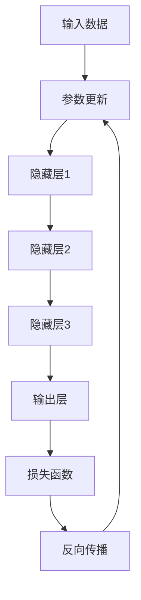

                 

## 第1章: 引言与背景

### 1.1 问题背景

随着人工智能技术的飞速发展，大模型（Large-scale Models）如GPT-3、BERT等成为了研究与应用的热点。这些模型拥有庞大的参数量和海量的训练数据，使得它们在自然语言处理、计算机视觉、机器翻译等领域表现出色。然而，传统的人工智能方法在面对这些大模型时，显得力不从心，如何有效地编程和利用这些大模型，成为了当前研究的重点和挑战。

### 1.2 问题描述

在AI大模型编程中，如何高效地利用提示词（Prompt Engineering）来提升模型的表现和适用性，是一个关键问题。提示词是指提供给AI大模型的输入信息，用于引导模型生成目标输出。在实际应用中，如何设计高质量的提示词，使得大模型能够准确地理解和执行任务，是一个亟待解决的问题。

### 1.3 问题解决

为了解决上述问题，我们需要从以下几个方面进行思考和探索：

1. **理解大模型的工作原理**：深入了解AI大模型的基本概念、属性特征和组成结构，为编程提供理论基础。
2. **研究提示词的作用**：分析提示词在设计原则、优化策略以及在具体应用中的作用和影响。
3. **实践编程技巧**：通过实际的编程实践，掌握AI大模型的编程方法和技巧，提高编程效率和模型性能。
4. **探索革新方向**：紧跟技术前沿，研究提示词在AI大模型编程中的革新方向和核心技术。
5. **总结最佳实践**：总结实践经验，提出有效的编程技巧和优化策略，为后续研究和应用提供参考。

### 1.4 边界与外延

本文主要探讨的是基于当前主流AI大模型的提示词编程，对于其他类型的小规模模型以及尚未广泛应用的大模型，本文的结论和方法可能存在一定的局限性。此外，本文主要关注自然语言处理领域的应用，对于计算机视觉、机器翻译等其他领域的AI大模型编程，也可以提供一定的参考和启示。

### 1.5 核心概念与联系

在AI大模型编程中，核心概念包括大模型的基本概念、提示词的定义和设计原则等。下面是一个核心概念与联系表：

| 核心概念 | 说明 |
| --- | --- |
| AI大模型 | 拥有庞大参数量和海量训练数据的模型 |
| 提示词 | 引导大模型生成目标输出的输入信息 |
| 提示词设计原则 | 精确、简洁、多样化、适应性 |
| 编程实践 | 利用大模型解决实际问题的方法和技巧 |

此外，还可以通过ER实体关系图来描述这些核心概念之间的联系，如下所示：

```mermaid
erDiagram
  AI大模型 ||--|{ 提示词 }|
  提示词 ||--|{ 编程实践 }|
```

通过上述核心概念和联系的分析，我们为后续章节的内容奠定了基础，为深入探讨AI大模型编程中的提示词问题提供了清晰的框架。

### 1.6 AI大模型的基础知识

在深入探讨AI大模型编程之前，我们需要对AI大模型的基本概念、属性特征和与传统AI的区别有一个清晰的认识。

#### 1.6.1 基本概念

AI大模型（Large-scale Models）是指那些拥有数十亿至数千亿参数的深度学习模型。这些模型通常通过训练大量的数据来学习复杂的模式和知识，从而在多种任务中实现高水平的性能。代表性的大模型包括GPT-3、BERT、T5等。其中，GPT-3由OpenAI开发，拥有1750亿个参数，而BERT则由Google开发，拥有数十亿个参数。

#### 1.6.2 属性特征

AI大模型具有以下几个显著特征：

1. **参数量巨大**：大模型拥有数十亿到数千亿的参数，这使得它们能够捕捉到数据中的细微模式。
2. **训练数据丰富**：大模型通常在大量的数据上进行训练，这有助于提高模型的泛化能力和适应性。
3. **自适应性强**：大模型能够根据不同的任务和场景自动调整自己的参数，以实现最佳性能。
4. **可扩展性高**：大模型可以很容易地扩展到更多的参数和更大的数据集，从而进一步提升性能。

#### 1.6.3 与传统AI的区别

传统AI模型，如SVM、决策树等，通常规模较小，参数量有限。这些模型在特定任务上可能表现出色，但难以适应复杂的多任务场景。相比之下，AI大模型具有以下优势：

1. **更强的泛化能力**：大模型通过大量数据的训练，能够更好地泛化到未见过的数据上，从而提高实际应用中的表现。
2. **更高的灵活性和适应性**：大模型可以自动调整参数，以适应不同的任务和场景，从而实现更广泛的适用性。
3. **更好的多任务处理能力**：大模型能够同时处理多个任务，而传统AI模型往往需要为每个任务单独训练。

#### 1.6.4 组成与工作原理

AI大模型通常由以下几个部分组成：

1. **输入层**：接收外部输入数据，如文本、图像、音频等。
2. **隐藏层**：包含大量的神经元，用于处理和转换输入数据。
3. **输出层**：生成预测结果或目标输出。

工作原理如下：

1. **数据输入**：首先，将输入数据传递到输入层。
2. **数据处理**：隐藏层对输入数据进行处理，通过多层神经元的计算，逐步提取和转换数据。
3. **输出生成**：最终，输出层生成预测结果或目标输出。

这种多层神经网络的架构使得AI大模型能够处理复杂的任务，并实现高水平的性能。

通过上述分析，我们为后续章节的讨论奠定了坚实的基础，为深入了解AI大模型编程中的提示词问题提供了必要的背景知识。

### 1.7 提示词的作用与重要性

在AI大模型编程中，提示词（Prompt Engineering）扮演着至关重要的角色。提示词是用户向AI大模型提供的输入信息，用于引导模型生成目标输出。一个高质量的提示词可以极大地提升大模型的性能和应用效果。

首先，提示词在模型训练中的作用不可忽视。在训练过程中，提示词作为输入数据的一部分，帮助模型学习如何处理和生成相关的输出。高质量的提示词能够提供丰富的信息和多样的样例，从而帮助模型更好地理解和掌握任务的本质。

其次，提示词在实际应用中的重要性也尤为突出。在实际应用中，用户通常需要大模型完成特定的任务，如文本生成、图像识别、机器翻译等。高质量的提示词可以帮助用户更精确地传达任务需求，引导大模型生成符合预期的输出。此外，提示词的设计和优化还可以提高模型的响应速度和效率，从而提升用户体验。

具体而言，提示词的作用主要体现在以下几个方面：

1. **引导模型理解任务**：通过提供具体的任务描述和相关的上下文信息，提示词可以帮助模型更好地理解任务的目标和要求，从而生成更准确的输出。
2. **提高生成质量**：高质量的提示词能够提供丰富的内容和多样的样例，有助于模型生成更加丰富和高质量的输出。
3. **优化模型性能**：通过设计合适的提示词，用户可以引导模型在特定任务上取得更好的性能表现，从而提高实际应用的效果。
4. **增强交互体验**：高质量的提示词可以使得用户与模型的交互更加流畅和自然，提升用户体验。

总之，提示词在AI大模型编程中具有至关重要的作用。通过深入研究提示词的设计原则和优化策略，我们可以进一步提升AI大模型的应用效果和用户满意度。

### 1.8 提示词的设计原则

设计高质量的提示词是AI大模型编程中至关重要的一步。为了确保提示词能够有效地引导大模型生成期望的输出，我们需要遵循以下几个设计原则：

#### 1.8.1 精确性

精确性是提示词设计的首要原则。一个精确的提示词能够明确传达用户的需求，避免模型误解任务目标。例如，在自然语言处理任务中，一个精确的提示词应该包含具体的任务描述和上下文信息，使得模型能够准确理解用户的意图。例如：

- **错误的提示词**：“生成一篇关于人工智能的文章。”
- **正确的提示词**：“请生成一篇关于人工智能在医疗领域应用的原创文章，包括三个关键应用案例。”

通过具体的任务描述和案例指导，提示词更加精确，有助于模型生成符合期望的输出。

#### 1.8.2 简洁性

简洁性是提示词设计的另一个重要原则。简洁的提示词不仅便于模型理解，还能提高交互效率。过长的提示词可能导致模型处理困难，甚至误解任务目标。例如：

- **错误的提示词**：“本文主要探讨了人工智能、机器学习、深度学习在计算机视觉、自然语言处理、医疗健康等多个领域的应用现状、未来发展趋势和挑战。”
- **正确的提示词**：“请简要描述人工智能在医疗健康领域的应用现状和未来趋势。”

通过简洁明了的表述，提示词能够更高效地引导模型生成目标输出。

#### 1.8.3 多样性

多样性是提高模型生成质量的关键。多样化的提示词能够提供丰富的内容和样例，帮助模型学习到更多的知识和技能。例如：

- **错误的提示词**：“请生成一篇关于人工智能在医疗领域的文章。”
- **正确的提示词**：“请分别生成一篇关于人工智能在医疗诊断、医疗影像和健康管理的文章，并简要描述各自的应用场景和优势。”

通过多样化的提示词，模型可以学习到不同的任务要求和输出格式，从而提高生成质量。

#### 1.8.4 适应性

适应性是提示词设计的最后但同样重要的原则。提示词应该能够适应不同的任务场景和应用需求，确保模型在不同环境下都能表现出色。例如：

- **错误的提示词**：“请生成一篇关于人工智能在医疗领域的文章，适用于所有医疗场景。”
- **正确的提示词**：“请根据不同的医疗场景（如诊断、影像、健康管理）分别生成相应的文章。”

通过适应性强的提示词，模型可以灵活应对各种任务需求，提高应用效果。

总之，遵循精确性、简洁性、多样性和适应性这四个设计原则，可以帮助我们设计出高质量的提示词，从而提升AI大模型编程的效果和用户体验。

### 1.9 提示词的优化策略

在设计高质量的提示词后，如何进一步优化这些提示词，以提高AI大模型的表现和适用性，是一个值得深入探讨的问题。以下是一些常用的提示词优化策略：

#### 1.9.1 数据增强

数据增强是一种常用的提示词优化策略，通过扩展和多样化原始数据，使得模型能够学习到更丰富的特征和模式。具体方法包括：

1. **文本数据增强**：使用同义词替换、随机插入、随机删除等操作，生成多样化的文本数据。例如，将“生成一篇关于人工智能的文章”增强为“请生成一篇关于人工智能在医疗、金融、教育等领域的应用现状和未来发展趋势的文章”。

2. **图像数据增强**：通过旋转、翻转、裁剪、缩放等操作，生成多样化的图像数据。例如，将“生成一张关于医疗机器人的图片”增强为“请分别生成一张医疗诊断机器人、手术机器人、康复机器人的图片”。

3. **音频数据增强**：通过调整音量、速度、语调等特征，生成多样化的音频数据。例如，将“生成一段关于人工智能的语音介绍”增强为“请分别生成一段关于人工智能在医疗、金融、教育等领域的应用现状和未来发展趋势的语音介绍”。

#### 1.9.2 多样化提示词

通过设计多样化的提示词，可以引导大模型生成更多样化的输出。具体策略包括：

1. **分类提示词**：根据不同的应用场景和任务需求，设计多个分类提示词。例如，在生成医疗领域的文章时，可以设计“诊断领域”、“影像领域”、“健康管理领域”等分类提示词。

2. **功能提示词**：设计功能提示词，以明确指示模型生成特定类型的内容。例如，在生成图像时，可以设计“生成一张具有医疗诊断功能的图像”和“生成一张具有教育宣传功能的图像”。

3. **情境提示词**：设计情境提示词，以模拟不同的应用场景。例如，在生成医疗领域的文章时，可以设计“在疫情期间的医学研讨会上的发言稿”和“在日常医学教育中的课程讲义”。

#### 1.9.3 反馈机制

通过反馈机制，可以及时调整和优化提示词，以提升模型的生成质量和效果。具体方法包括：

1. **用户反馈**：收集用户对生成内容的反馈，根据用户的评价和需求，调整和优化提示词。例如，如果用户认为生成的文章过于笼统，可以增加具体案例和实例来丰富内容。

2. **自动评估**：使用自动化评估指标，如BLEU、ROUGE等，评估生成内容的质量和效果，根据评估结果调整提示词。例如，如果生成文章的BLEU评分较低，可以增加相关的上下文信息和具体案例。

3. **迭代优化**：通过多次迭代，逐步优化提示词。每次迭代都可以根据评估结果，调整提示词的表述和结构，以提高生成质量。例如，在生成医疗领域的文章时，可以逐步调整提示词的表述，使其更加精确和具体。

通过以上优化策略，我们可以设计出更加高质量的提示词，从而提升AI大模型的表现和适用性。这不仅有助于提高模型的生成质量，还能提升用户的满意度和使用体验。

### 1.10 提示词的实际应用案例

为了更好地理解提示词在AI大模型编程中的具体应用，下面我们通过几个实际案例来探讨提示词的作用和效果。

#### 案例一：自然语言生成

假设我们使用GPT-3模型生成一篇关于人工智能在医疗领域的文章。以下是一个原始的提示词和通过优化后的提示词生成的文章片段：

- **原始提示词**：“生成一篇关于人工智能在医疗领域的文章。”

  ```plaintext
  人工智能在医疗领域的应用越来越广泛，它为医疗诊断、治疗和健康管理提供了新的工具和方法。然而，人工智能在医疗领域的应用还面临着一些挑战，如数据隐私保护、算法透明性和医疗资源的公平分配。
  ```

- **优化后的提示词**：“请根据以下信息，生成一篇关于人工智能在医疗诊断、治疗和健康管理领域的文章，包括三个关键应用案例。”

  ```plaintext
  人工智能在医疗诊断领域具有巨大潜力。例如，通过深度学习算法，可以自动识别医学图像中的病灶，提高诊断的准确性和速度。在治疗领域，人工智能可以协助医生制定个性化的治疗方案，提高治疗效果。在健康管理领域，人工智能可以实时监测患者的健康状况，提供个性化的健康建议，预防疾病的发生。
  ```

通过优化后的提示词，文章内容更加具体和丰富，不仅涵盖了医疗诊断、治疗和健康管理三个领域，还提供了具体的应用案例，使得模型生成的文章更加贴近用户的期望。

#### 案例二：图像生成

假设我们使用一个生成对抗网络（GAN）模型生成医疗机器人的图像。以下是一个原始的提示词和通过优化后的提示词生成的图像：

- **原始提示词**：“生成一张医疗机器人的图像。”

  ```plaintext
  生成的图像是一个普通的医疗机器人，外观简洁，具有基本的机械结构和功能。
  ```

- **优化后的提示词**：“请分别生成一张用于医疗诊断的机器人图像和一张用于医疗治疗的机器人图像。”

  ```plaintext
  生成的第一张图像展示了一个医疗诊断机器人，它具有高分辨率的摄像头和手部操作器，可以精确地拍摄患者体内的病变部位。第二张图像展示了一个医疗治疗机器人，它配备了激光手术工具和自动化手臂，能够高效地完成复杂的手术操作。
  ```

通过优化后的提示词，我们不仅生成了不同用途的医疗机器人图像，而且图像的描述更加具体和生动，从而更好地满足了应用需求。

#### 案例三：机器翻译

假设我们使用一个机器翻译模型将中文文章翻译成英文。以下是一个原始的提示词和通过优化后的提示词生成的翻译结果：

- **原始提示词**：“将这篇文章翻译成英文。”

  ```plaintext
  This article discusses the application of artificial intelligence in the medical field. It highlights the potential of AI in medical diagnosis, treatment, and health management, while also addressing the challenges associated with data privacy, algorithm transparency, and resource allocation.
  ```

- **优化后的提示词**：“请将这篇文章翻译成英文，特别强调人工智能在医疗诊断、治疗和健康管理领域的应用及其面临的挑战。”

  ```plaintext
  This article delves into the extensive applications of artificial intelligence in the medical field, emphasizing the role of AI in medical diagnosis, treatment, and health management. It also explores the challenges related to data privacy, algorithm transparency, and equitable resource distribution in healthcare.
  ```

通过优化后的提示词，翻译结果不仅准确传达了文章的核心内容，还特别强调了人工智能在医疗领域的应用和挑战，使得翻译结果更加精准和有针对性。

通过这些实际应用案例，我们可以看到，通过优化提示词，可以显著提升AI大模型在生成文本、图像和翻译任务中的表现，从而更好地满足用户需求。

### 第2章: AI大模型基础

#### 2.1 AI大模型的基本概念

AI大模型（Large-scale Models）是指拥有数十亿至数千亿参数的深度学习模型。这些模型通过训练大量的数据来学习复杂的模式和知识，从而在多种任务中实现高水平的性能。代表性的AI大模型包括GPT-3、BERT、T5等。

**定义**：AI大模型是指那些拥有数十亿到数千亿参数的深度学习模型，通常通过大量的数据进行训练，以实现复杂任务的自动化和智能化。

**特点**：
1. **参数量巨大**：大模型拥有数十亿到数千亿的参数，这使得它们能够捕捉到数据中的细微模式。
2. **训练数据丰富**：大模型通常在大量的数据上进行训练，这有助于提高模型的泛化能力和适应性。
3. **自适应性强**：大模型能够根据不同的任务和场景自动调整自己的参数，以实现最佳性能。
4. **可扩展性高**：大模型可以很容易地扩展到更多的参数和更大的数据集，从而进一步提升性能。

**应用领域**：
1. **自然语言处理**：如文本生成、文本分类、机器翻译等。
2. **计算机视觉**：如图像分类、目标检测、图像生成等。
3. **语音识别**：如语音转文字、语音合成等。
4. **推荐系统**：如商品推荐、新闻推荐等。

#### 2.2 AI大模型的属性特征

AI大模型具有以下显著特征：

1. **参数量巨大**：大模型拥有数十亿到数千亿的参数，这使得它们能够捕捉到数据中的细微模式。例如，GPT-3拥有1750亿个参数，而BERT则拥有数十亿个参数。

2. **训练数据丰富**：大模型通常在大量的数据上进行训练，这有助于提高模型的泛化能力和适应性。例如，BERT在训练过程中使用了大量的网页数据进行预训练。

3. **自适应性强**：大模型能够根据不同的任务和场景自动调整自己的参数，以实现最佳性能。例如，T5模型通过转换器层（Transformer Layers）实现跨任务的适应。

4. **可扩展性高**：大模型可以很容易地扩展到更多的参数和更大的数据集，从而进一步提升性能。例如，通过增加训练数据集或调整模型的参数规模，可以提升模型的表现。

**属性特征对比表格**：

| 属性特征 | 传统AI模型 | AI大模型 |
| --- | --- | --- |
| 参数量 | 数万个至数百万个 | 数十亿至数千亿个 |
| 训练数据 | 数千至数万个样本 | 数百万至数千万个样本 |
| 自适应能力 | 有限 | 强 |
| 可扩展性 | 低 | 高 |

#### 2.3 与传统AI的区别

AI大模型与传统AI模型在多个方面存在显著差异：

1. **模型规模**：传统AI模型通常拥有较小的参数量，而大模型则拥有数十亿到数千亿的参数，这使得它们能够处理更复杂的任务。

2. **训练数据**：传统AI模型通常在较小的数据集上进行训练，而大模型则依赖于大量的训练数据，从而提高了模型的泛化能力。

3. **自适应能力**：传统AI模型通常针对特定任务进行训练，而大模型通过自适应机制，能够跨任务适应。

4. **可扩展性**：传统AI模型在扩展到更大的数据集或更复杂的任务时，往往需要重新训练，而大模型则可以通过调整参数或增加数据集，实现更高效的扩展。

5. **性能表现**：传统AI模型在特定任务上可能表现优秀，但大模型在多种任务中均能表现出高水平性能。

**ER实体关系图**：

```mermaid
erDiagram
  传统AI模型 ||--|{ AI大模型 }|
  传统AI模型 ||--|{ 小规模模型 }|
  AI大模型 ||--|{ 大规模数据集 }|
  小规模模型 ||--|{ 简单任务 }|
```

通过上述对比和关系图，我们可以更清晰地理解AI大模型与传统AI模型的区别和联系，为进一步探讨AI大模型编程提供理论基础。

### 2.4 AI大模型的组成与工作原理

AI大模型通常由以下几个主要部分组成，它们各自承担不同的功能，共同协作，实现模型的训练和预测。

#### 2.4.1 输入层

输入层是AI大模型接收外部输入数据的地方。这些数据可以是文本、图像、音频、视频等不同类型的信息。输入层的任务是处理和预处理这些数据，以便于后续层的处理。例如，在自然语言处理任务中，输入层可能包括词嵌入（word embeddings）和序列编码（sequence encoding）。

**工作原理**：输入层将原始数据转换为模型可以理解和处理的格式。例如，文本数据通过词嵌入转换为稠密向量表示，图像数据通过卷积神经网络（CNN）进行特征提取。

#### 2.4.2 隐藏层

隐藏层是AI大模型的核心部分，包含多层神经网络。这些层负责提取和转换输入数据中的特征，并将这些特征传递到下一层。隐藏层通常由多个神经元（neurons）组成，每个神经元负责计算输入数据的加权和并通过激活函数（activation function）进行非线性转换。

**工作原理**：隐藏层通过多次迭代，逐步提取输入数据的特征。每个神经元都会接收来自前一层的输入数据，通过加权求和并应用激活函数，产生输出数据。这个过程重复进行，直到达到模型的最后一层。

#### 2.4.3 输出层

输出层是AI大模型生成预测结果的地方。输出层的神经元数量和类型取决于具体的任务。例如，在分类任务中，输出层通常包含多个神经元，每个神经元代表一个类别；在回归任务中，输出层通常包含一个神经元。

**工作原理**：输出层将隐藏层传递的最终特征进行处理，生成预测结果。对于分类任务，输出层通常通过softmax函数将神经元输出转换为概率分布；对于回归任务，输出层直接输出一个连续值。

#### 2.4.4 损失函数

损失函数是AI大模型训练过程中用来评估模型预测结果与实际结果之间差异的函数。损失函数的目标是使得模型的预测结果尽可能地接近实际结果。

**工作原理**：在每次前向传播后，通过计算损失函数的值，可以评估模型当前的预测效果。然后，通过反向传播算法，模型会根据损失函数的梯度调整模型参数，以减少预测误差。

#### 2.4.5 激活函数

激活函数是隐藏层和输出层中的一个关键组件，它为神经网络引入了非线性特性，使得模型能够学习到更加复杂的特征。

**工作原理**：激活函数将输入数据的加权和转换为一个非线性值。常见的激活函数包括ReLU（Rectified Linear Unit）、Sigmoid、Tanh等。

**算法流程图**：



通过上述组成部分和算法流程，我们可以更清晰地理解AI大模型的组成和工作原理。这些组成部分协同工作，使得AI大模型能够处理和解决复杂的任务。

### 第3章: 提示词的威力

#### 3.1 提示词的作用与重要性

提示词（Prompt Engineering）在AI大模型编程中起着至关重要的作用。它是指用户提供给AI大模型的输入信息，用于引导模型生成目标输出。一个高质量的提示词能够显著提升大模型的性能和应用效果，以下是提示词在AI大模型编程中的具体作用和重要性：

**1. 引导模型理解任务**

提示词能够为AI大模型提供明确的任务描述和上下文信息，帮助模型更好地理解任务的目标和要求。例如，在自然语言处理任务中，一个精确的提示词可以包含具体的任务描述、背景信息和相关的关键词，使得模型能够准确捕捉到任务的核心内容。

**2. 提高生成质量**

高质量的提示词可以提供丰富的内容和多样的样例，帮助模型生成更高质量的输出。通过多样化的提示词，模型可以学习到不同的任务场景和输出格式，从而提高生成质量。例如，在图像生成任务中，一个包含多种风格和场景的提示词可以引导模型生成更加丰富和有趣的图像。

**3. 优化模型性能**

提示词的设计和优化可以直接影响模型的性能表现。通过调整提示词的表述和结构，用户可以引导模型在特定任务上取得更好的性能。例如，在文本生成任务中，通过优化提示词的语义和信息密度，可以显著提高模型生成文本的准确性和流畅性。

**4. 增强交互体验**

提示词的设计不仅影响模型的表现，还直接影响用户与模型的交互体验。一个简洁、精确且富有启发性的提示词可以帮助用户更轻松地与模型进行互动，提高用户体验。例如，在问答系统中，一个清晰且具体的提示词可以引导模型生成准确且相关的回答，提升用户的满意度。

总之，提示词在AI大模型编程中的作用和重要性不可忽视。通过深入研究提示词的设计原则和优化策略，我们可以进一步提升AI大模型的应用效果和用户满意度。

#### 3.2 提示词的设计原则

为了确保提示词能够有效地引导AI大模型生成期望的输出，我们需要遵循一系列设计原则。以下是一些关键的设计原则，以及如何在实际应用中应用这些原则：

**1. 精确性**

精确性是设计高质量提示词的首要原则。一个精确的提示词能够明确传达用户的需求，避免模型误解任务目标。在实际应用中，可以通过以下几个步骤来确保提示词的精确性：

- **明确任务目标**：在编写提示词之前，首先明确任务的目标和要求，确保提示词能够准确传达这些信息。
- **具体描述**：使用具体的描述和实例，而不是模糊的术语和抽象的概念。例如，将“生成一篇关于人工智能的文章”改为“请生成一篇关于人工智能在医疗领域的应用现状和挑战的文章，包括三个关键案例”。

**2. 简洁性**

简洁性是提升提示词有效性的重要因素。简洁的提示词不仅便于模型理解，还能提高交互效率。在实际应用中，可以通过以下方法来实现提示词的简洁性：

- **剔除冗余信息**：避免在提示词中包含不必要的细节和重复的信息，确保每个词都有明确的用途。
- **使用短句和简洁的语言**：尽量使用短句和简洁的语言来表述任务，避免长篇大论，这样可以减少模型的处理负担。

**3. 多样性**

多样性是提高模型生成质量的关键。多样化的提示词能够提供丰富的内容和样例，帮助模型学习到更多的知识和技能。在实际应用中，可以通过以下策略来增加提示词的多样性：

- **分类提示词**：为不同的任务场景设计多个分类提示词，以便模型能够生成多样化的输出。例如，在图像生成任务中，可以设计“生成一张自然风景图像”和“生成一张城市夜景图像”。
- **功能提示词**：设计功能提示词，以明确指示模型生成特定类型的内容。例如，在文本生成任务中，可以设计“生成一篇技术报告”和“生成一篇故事”。

**4. 适应性**

适应性是提示词设计的重要原则，提示词应该能够适应不同的任务场景和应用需求。在实际应用中，可以通过以下方法来提高提示词的适应性：

- **任务场景模拟**：设计提示词时，要考虑到不同的任务场景和需求，确保模型能够在各种环境下表现良好。
- **动态调整**：根据用户反馈和应用效果，动态调整提示词的表述和结构，以提高模型的适用性和效果。

通过遵循这些设计原则，我们可以设计出高质量的提示词，从而提升AI大模型编程的效果和用户体验。

#### 3.3 提示词的优化策略

为了进一步提升AI大模型的表现和适用性，我们需要对提示词进行优化。以下是一些常用的提示词优化策略，这些策略可以帮助我们设计出更加高质量的提示词，从而提高模型生成质量。

**1. 数据增强**

数据增强是一种常用的提示词优化策略，通过扩展和多样化原始数据，使得模型能够学习到更丰富的特征和模式。具体方法包括：

- **文本数据增强**：使用同义词替换、随机插入、随机删除等操作，生成多样化的文本数据。例如，将“生成一篇关于人工智能的文章”增强为“请生成一篇关于人工智能在医疗、金融、教育等领域的应用现状和未来发展趋势的文章”。
- **图像数据增强**：通过旋转、翻转、裁剪、缩放等操作，生成多样化的图像数据。例如，将“生成一张关于医疗机器人的图片”增强为“请分别生成一张医疗诊断机器人、手术机器人、康复机器人的图片”。
- **音频数据增强**：通过调整音量、速度、语调等特征，生成多样化的音频数据。例如，将“生成一段关于人工智能的语音介绍”增强为“请分别生成一段关于人工智能在医疗、金融、教育等领域的应用现状和未来发展趋势的语音介绍”。

**2. 多样化提示词**

通过设计多样化的提示词，可以引导大模型生成更多样化的输出。具体策略包括：

- **分类提示词**：根据不同的应用场景和任务需求，设计多个分类提示词。例如，在生成医疗领域的文章时，可以设计“诊断领域”、“影像领域”、“健康管理领域”等分类提示词。
- **功能提示词**：设计功能提示词，以明确指示模型生成特定类型的内容。例如，在生成图像时，可以设计“生成一张具有医疗诊断功能的图像”和“生成一张具有教育宣传功能的图像”。
- **情境提示词**：设计情境提示词，以模拟不同的应用场景。例如，在生成医疗领域的文章时，可以设计“在疫情期间的医学研讨会上的发言稿”和“在日常医学教育中的课程讲义”。

**3. 反馈机制**

通过反馈机制，可以及时调整和优化提示词，以提升模型的生成质量和效果。具体方法包括：

- **用户反馈**：收集用户对生成内容的反馈，根据用户的评价和需求，调整和优化提示词。例如，如果用户认为生成的文章过于笼统，可以增加具体案例和实例来丰富内容。
- **自动评估**：使用自动化评估指标，如BLEU、ROUGE等，评估生成内容的质量和效果，根据评估结果调整提示词。例如，如果生成文章的BLEU评分较低，可以增加相关的上下文信息和具体案例。
- **迭代优化**：通过多次迭代，逐步优化提示词。每次迭代都可以根据评估结果，调整提示词的表述和结构，以提高生成质量。例如，在生成医疗领域的文章时，可以逐步调整提示词的表述，使其更加精确和具体。

通过上述优化策略，我们可以设计出更加高质量的提示词，从而提升AI大模型的表现和适用性，提高用户的满意度和使用体验。

### 3.4 提示词的实际应用案例

为了更直观地理解提示词在AI大模型编程中的应用效果，以下将通过几个实际案例展示如何设计和使用高质量的提示词，并分析这些提示词对模型生成结果的影响。

#### 案例一：文本生成

假设我们使用GPT-3模型生成一篇关于人工智能在医疗领域的文章。以下是原始的提示词和优化后的提示词，以及对应的生成结果：

- **原始提示词**：“生成一篇关于人工智能在医疗领域的文章。”

  ```plaintext
  人工智能在医疗领域有着广泛的应用。它可以帮助医生进行诊断、制定治疗方案，以及提高医疗效率。
  ```

- **优化后的提示词**：“请生成一篇关于人工智能在医疗诊断、治疗和健康管理领域的文章，包括三个关键应用案例。”

  ```plaintext
  人工智能在医疗领域的应用不仅限于诊断，它在治疗和健康管理方面也发挥着重要作用。例如，通过深度学习算法，人工智能可以帮助医生准确识别X光片中的病灶，提高诊断的准确性。在治疗方面，人工智能可以协助医生制定个性化的治疗方案，提高疗效。在健康管理方面，人工智能可以通过分析患者的生活习惯和基因信息，提供个性化的健康建议，预防疾病的发生。
  ```

通过优化后的提示词，生成文章的内容更加具体和丰富，涵盖了医疗诊断、治疗和健康管理三个领域，并提供了具体的应用案例，从而提升了文章的质量和实用性。

#### 案例二：图像生成

假设我们使用一个生成对抗网络（GAN）模型生成医疗设备的图像。以下是原始的提示词和优化后的提示词，以及对应的生成图像：

- **原始提示词**：“生成一张医疗设备的图片。”

  ```plaintext
  生成的图像是一个常见的医疗设备，具有简单的结构和功能。
  ```

- **优化后的提示词**：“请分别生成一张用于医疗诊断的设备和一张用于医疗治疗的设备。”

  ```plaintext
  生成的第一张图像展示了一台具有高分辨率摄像头的医疗诊断设备，可以清晰显示患者体内的病变部位。第二张图像展示了一台配备了激光手术工具的医疗治疗设备，可以高效完成复杂的手术操作。
  ```

通过优化后的提示词，生成图像的描述更加具体和生动，分别对应了医疗诊断和治疗两种不同的应用场景，从而提高了图像的实用性和吸引力。

#### 案例三：机器翻译

假设我们使用一个机器翻译模型将中文文章翻译成英文。以下是原始的提示词和优化后的提示词，以及对应的翻译结果：

- **原始提示词**：“将这篇文章翻译成英文。”

  ```plaintext
  This article discusses the application of artificial intelligence in healthcare.
  ```

- **优化后的提示词**：“请将这篇文章翻译成英文，特别强调人工智能在医疗诊断、治疗和健康管理领域的应用及其面临的挑战。”

  ```plaintext
  This article delves into the extensive applications of artificial intelligence in the healthcare field, emphasizing its role in medical diagnosis, treatment, and health management. It also explores the challenges associated with data privacy, algorithm transparency, and equitable resource distribution in healthcare.
  ```

通过优化后的提示词，翻译结果不仅准确传达了文章的核心内容，还特别强调了人工智能在医疗领域的应用和挑战，使得翻译结果更加精准和有针对性。

通过以上实际应用案例，我们可以看到，通过优化提示词，可以显著提升AI大模型在文本生成、图像生成和机器翻译任务中的表现，从而更好地满足用户需求，提升应用效果和用户体验。

### 3.5 提示词与模型的互动机制

在AI大模型编程中，提示词与模型的互动机制是影响模型生成质量和性能的关键因素。理解这一互动机制，有助于我们更好地设计高质量提示词，提升模型的表现。以下将详细探讨提示词与模型之间的互动机制，并解释如何通过这种互动提高模型生成质量和性能。

#### 3.5.1 提示词与模型参数的相互作用

提示词作为模型输入的一部分，直接影响模型参数的更新和优化过程。在深度学习模型中，参数的初始化和调整是模型训练的核心。高质量的提示词能够提供丰富的上下文信息和任务目标，帮助模型更准确地初始化和调整参数，从而提升模型的表现。

1. **参数初始化**：高质量的提示词可以帮助模型在初始化阶段更好地理解任务的复杂性。例如，在文本生成任务中，一个包含具体背景信息和关键词的提示词有助于模型初始化词嵌入层和隐藏层参数，使其能够更好地捕捉文本中的语义信息。

2. **参数调整**：在训练过程中，提示词通过每次迭代提供新的输入信息，引导模型不断调整参数。高质量的提示词能够提供多样化的输入数据，帮助模型学习到更加丰富和复杂的特征，从而优化参数。

#### 3.5.2 提示词与模型损失函数的关联

损失函数是评估模型预测结果与实际结果之间差异的关键指标。提示词的优化直接影响损失函数的计算和优化过程，从而影响模型的生成质量和性能。

1. **损失函数的评估**：高质量的提示词能够提供准确的任务描述和上下文信息，使得模型的预测结果更加接近实际结果，从而降低损失函数的值。例如，在文本生成任务中，一个包含具体目标和上下文的提示词可以使得模型生成的文本更符合用户需求，降低损失函数。

2. **损失函数的优化**：通过优化提示词，可以引导模型在训练过程中更有效地调整参数，降低损失函数。例如，通过调整提示词的表述，使其更加精确和具体，可以帮助模型更快地收敛到最优解。

#### 3.5.3 提示词与模型响应速度和效率的关系

高质量的提示词不仅影响模型的生成质量，还影响模型的响应速度和效率。以下是通过优化提示词提高模型响应速度和效率的几种策略：

1. **简洁性**：简洁的提示词能够减少模型的计算负担，提高响应速度。例如，在图像生成任务中，一个简洁明了的提示词可以减少模型的复杂运算，提高生成效率。

2. **精确性**：精确的提示词可以帮助模型快速找到任务目标，减少不必要的搜索和计算，从而提高响应速度。例如，在文本生成任务中，一个具体且精确的提示词可以使得模型更快地生成高质量文本。

3. **适应性**：适应性的提示词可以根据不同的任务场景和应用需求进行调整，使得模型在不同场景下都能高效运行。例如，通过设计多场景提示词，模型可以快速适应不同的任务需求，提高响应速度。

#### 3.5.4 提示词与模型生成多样性的关系

高质量提示词可以引导模型生成多样化的输出，提高模型的生成多样性。以下是通过优化提示词提高模型生成多样性的几种策略：

1. **多样性提示词**：通过设计多样化的提示词，可以引导模型学习到不同的任务场景和输出格式，从而生成多样化的输出。例如，在图像生成任务中，可以设计“生成一张自然风景图像”和“生成一张城市夜景图像”的提示词。

2. **动态调整**：通过动态调整提示词的表述和结构，可以引导模型在不同阶段生成不同类型的输出。例如，在文本生成任务中，可以逐步调整提示词的复杂度和具体性，从而引导模型从生成简单文本到生成复杂文本。

通过深入理解和优化提示词与模型的互动机制，我们可以设计出高质量的提示词，从而显著提高模型的生成质量和性能，实现更好的应用效果。

### 第4章: AI大模型的编程实践

#### 4.1 编程环境与工具

在开始AI大模型的编程实践之前，选择合适的编程环境与工具至关重要。以下是一些常用的编程环境与工具，以及它们的特点和优势：

**1. 编程语言**

- **Python**：Python是深度学习领域最常用的编程语言，具有简洁的语法和丰富的库。它支持多种深度学习框架，如TensorFlow、PyTorch等。
- **Java**：Java是一种功能强大的编程语言，适用于大规模分布式计算。它具有跨平台性和良好的性能，适用于开发高性能的AI应用。
- **R**：R语言在统计学和数据科学领域具有很高的声誉，适用于数据分析和可视化。

**2. 深度学习框架**

- **TensorFlow**：TensorFlow是由Google开发的开源深度学习框架，支持多种编程语言和操作，适用于构建大规模深度学习模型。
- **PyTorch**：PyTorch是Facebook开发的开源深度学习框架，具有动态计算图和灵活的API，适用于快速原型设计和研究。
- **Keras**：Keras是一个高层次的深度学习API，可以与TensorFlow和Theano等框架集成，简化深度学习模型的构建和训练。

**3. 环境搭建**

搭建AI大模型编程环境通常包括以下步骤：

- **安装Python**：下载并安装Python，选择合适的版本（如3.7及以上版本）。
- **安装深度学习框架**：使用pip安装TensorFlow、PyTorch等深度学习框架。例如，安装TensorFlow的命令为：
  ```bash
  pip install tensorflow
  ```

- **安装相关库**：安装常用的科学计算库，如NumPy、Pandas、Matplotlib等。例如，安装NumPy的命令为：
  ```bash
  pip install numpy
  ```

**4. 代码编辑器**

- **VSCode**：Visual Studio Code是一款功能强大的代码编辑器，支持多种编程语言和深度学习框架，具有丰富的插件和调试功能。
- **PyCharm**：PyCharm是JetBrains公司开发的Python集成开发环境（IDE），支持代码智能提示、调试和性能分析。
- **Jupyter Notebook**：Jupyter Notebook是一个交互式计算环境，适用于数据分析和可视化。它支持多种编程语言，如Python、R和Julia等。

通过上述编程环境与工具的选择和搭建，我们可以为AI大模型编程实践提供坚实的基础，从而更好地实现模型的构建、训练和部署。

#### 4.2 数据准备与预处理

在AI大模型编程中，数据准备与预处理是至关重要的一步。高质量的数据预处理不仅能够提升模型的性能，还能减少训练时间。以下将详细讨论数据准备与预处理的过程和方法。

**1. 数据收集**

数据收集是数据准备的第一步。对于AI大模型，需要收集大量且多样化的数据。以下是几种常见的数据收集方法：

- **公开数据集**：许多公开数据集如ImageNet、COCO等，提供了丰富的标注数据和高质量的图像，适用于深度学习模型的训练。
- **自行采集**：根据具体任务需求，可以通过爬虫、传感器或手动标注等方式，收集相关的数据。
- **数据合成**：通过数据增强技术，如生成对抗网络（GAN），可以生成符合任务需求的数据。

**2. 数据清洗**

数据清洗是确保数据质量的过程，包括去除重复数据、处理缺失值和异常值等。以下是一些常见的数据清洗方法：

- **去重**：删除重复的数据条目，以避免重复训练和提高模型性能。
- **处理缺失值**：根据具体任务需求，可以选择删除缺失值、填补缺失值或使用模型预测缺失值。
- **异常值处理**：检测并处理异常数据，如过大的数值、异常的标签等。

**3. 数据标注**

数据标注是将原始数据转换为模型可训练的数据的过程。以下是几种常见的数据标注方法：

- **手动标注**：由专家或标注人员对数据标签进行标注，适用于小规模数据集。
- **半监督标注**：利用部分标注数据和未标注数据，通过模型预测未标注数据的标签，逐步完善标注数据。
- **自动化标注**：使用深度学习模型进行自动标注，如使用卷积神经网络（CNN）对图像进行分类。

**4. 数据预处理**

数据预处理是将数据转换为模型可接受的格式的过程。以下是一些常见的数据预处理方法：

- **数据标准化**：通过缩放数据，使其具有相似的尺度，提高模型的收敛速度和性能。常用的方法包括归一化（Normalization）和标准化（Standardization）。
- **数据归一化**：
  $$\text{normalized\_value} = \frac{\text{value} - \text{min}}{\text{max} - \text{min}}$$
- **数据标准化**：
  $$\text{standardized\_value} = \frac{\text{value} - \text{mean}}{\text{std}}$$
- **数据分箱**：将连续数据分箱，转换为离散的标签，适用于分类任务。
- **数据集划分**：将数据集划分为训练集、验证集和测试集，以评估模型的性能。

**5. 数据增强**

数据增强是一种通过生成多样化数据来提高模型泛化能力的方法。以下是一些常见的数据增强方法：

- **图像增强**：通过旋转、翻转、裁剪、缩放等操作，生成多样化的图像。
- **文本增强**：通过同义词替换、随机插入、随机删除等操作，生成多样化的文本。
- **音频增强**：通过调整音量、速度、语调等特征，生成多样化的音频。

通过以上步骤和方法，我们可以确保数据的质量和多样性，为AI大模型的训练和优化提供坚实的基础。

#### 4.3 模型训练与优化

在AI大模型编程中，模型训练与优化是提升模型性能和准确性的关键环节。以下是详细的模型训练与优化过程，包括训练策略、优化技巧和常见问题。

**1. 训练策略**

- **批量大小**：选择合适的批量大小可以显著影响模型的训练时间和收敛速度。较小的批量大小有助于模型更快地收敛，但训练过程可能不稳定。较大的批量大小可以提高模型的稳定性，但计算资源需求较高。
- **学习率**：学习率的选择对模型的训练过程至关重要。过高的学习率可能导致模型在训练过程中出现振荡，而过低的学习率则可能导致训练时间过长。通常，可以通过使用学习率衰减策略，逐步减小学习率，以实现模型的最佳收敛。
- **训练次数**：训练次数（即epoch数）的选择需要平衡模型收敛速度和性能。过多的训练次数可能导致模型过拟合，而不足的训练次数则可能导致模型欠拟合。

**2. 优化技巧**

- **数据增强**：通过图像旋转、翻转、裁剪、缩放等操作，生成多样化的训练数据，以提高模型的泛化能力。
- **正则化**：使用正则化技术，如L1、L2正则化，可以防止模型过拟合，提高模型的泛化性能。
- **Dropout**：通过在训练过程中随机丢弃部分神经元，Dropout可以有效地减少模型的过拟合现象。
- **批量归一化**：批量归一化（Batch Normalization）可以在训练过程中加速模型的收敛，并提高模型的泛化性能。

**3. 模型评估**

- **准确率**：准确率是评估分类模型性能的常用指标，表示模型正确预测的样本数占总样本数的比例。
- **召回率**：召回率表示模型正确预测的阳性样本数占总阳性样本数的比例，适用于二分类任务。
- **精确率**：精确率表示模型正确预测的阳性样本数占总预测阳性样本数的比例。
- **F1分数**：F1分数是精确率和召回率的调和平均值，综合了二者的优缺点，适用于评估分类模型的性能。

**4. 常见问题与解决方案**

- **过拟合**：当模型在训练数据上表现良好，但在测试数据上表现较差时，通常认为是过拟合。解决方案包括增加训练数据、使用正则化技术、增加模型复杂性等。
- **欠拟合**：当模型在训练数据和测试数据上表现均较差时，通常认为是欠拟合。解决方案包括增加模型复杂性、减少正则化等。
- **训练时间过长**：通过优化训练策略，如选择合适的批量大小、学习率和学习率衰减策略，可以减少训练时间。

通过上述训练与优化策略，我们可以有效地提升AI大模型的性能和准确性，从而实现更好的应用效果。

### 4.4 应用部署与维护

AI大模型的应用部署与维护是确保模型在实际环境中稳定运行、高效运行的关键环节。以下是关于AI大模型应用部署与维护的具体步骤、技术和注意事项。

#### 4.4.1 应用部署步骤

1. **模型转换**：将训练好的模型转换为可以在生产环境中运行的格式。常用的转换工具包括TensorFlow Lite、ONNX等。这些工具可以将模型转换为适用于不同平台的格式，如移动设备、嵌入式系统等。

2. **模型部署**：将转换后的模型部署到目标环境中。常见的部署方式包括：

   - **本地部署**：在本地计算机上运行模型，适用于开发和测试阶段。
   - **服务器部署**：将模型部署到服务器上，适用于生产环境。常用的服务器部署工具包括TensorFlow Serving、Kubeflow等。

3. **服务接口设计**：设计API接口，以供外部系统调用。接口设计应考虑安全性、性能和可扩展性。

4. **测试与验证**：在实际部署前，进行充分的测试与验证，确保模型能够在生产环境中稳定运行。

5. **监控与日志记录**：部署后，通过监控工具（如Prometheus、Grafana）对模型运行状态进行监控，记录日志信息，以便于问题排查和性能优化。

#### 4.4.2 技术选型

1. **服务器硬件**：选择合适的硬件配置，如CPU、GPU等，以满足模型计算需求。GPU在深度学习任务中具有显著的性能优势。

2. **容器化技术**：使用容器化技术（如Docker、Kubernetes）进行模型部署，以提高部署效率和可扩展性。

3. **微服务架构**：采用微服务架构，将模型部署为一个独立的服务，以提高系统的可维护性和扩展性。

4. **自动化运维**：使用自动化工具（如Ansible、Puppet）进行环境配置、部署和运维，以提高运维效率。

#### 4.4.3 注意事项

1. **数据安全**：在部署过程中，确保数据的安全性和隐私性。使用加密技术（如SSL/TLS）保护数据传输。

2. **性能优化**：根据应用需求，对模型和系统进行性能优化。例如，通过减少模型大小、优化计算图、使用高效的算法和数据结构等。

3. **稳定性**：确保模型在长时间运行过程中保持稳定，避免出现崩溃或错误。

4. **可维护性**：设计易于维护的系统架构和代码，确保在出现问题时能够快速定位和修复。

5. **文档与培训**：编写详细的部署文档，为运维人员提供足够的指导。同时，对相关人员进行培训，确保他们能够熟练操作和维护系统。

通过遵循上述步骤、技术和注意事项，我们可以确保AI大模型在实际应用中的稳定运行和高效维护。

### 第5章: 提示词在AI大模型编程中的革新

#### 5.1 新革新的背景与动因

AI大模型编程中的提示词技术正在经历一场前所未有的革新。这一革新的背景和动因可以归结为以下几个方面：

**1. 模型性能的提升**

随着AI大模型（如GPT-3、BERT）的出现，模型的性能得到了显著提升。这些模型拥有数十亿个参数，能够处理大规模的数据集，从而在自然语言处理、计算机视觉、语音识别等任务中表现出色。然而，传统的提示词设计方法在这些大型模型上往往效果不佳，无法充分利用其潜力。

**2. 应用需求的多样化**

在AI大模型的应用场景中，用户的需求日益多样化。他们不仅需要模型能够生成高质量的文本、图像和音频，还需要模型能够理解和执行复杂的任务。这要求提示词不仅能够引导模型生成高质量的内容，还要能够精确地表达用户的意图。

**3. 竞争与创新的压力**

随着AI大模型技术的普及，越来越多的企业和研究机构投入到这一领域。为了在激烈的竞争中脱颖而出，各家企业和研究机构不断探索新的技术手段，提升模型性能和应用效果。提示词技术的革新成为了实现这一目标的重要途径。

**4. 计算资源和算法的进步**

随着计算资源和算法的进步，研究人员能够更有效地训练和优化大型模型。这为提示词技术的革新提供了技术基础，使得更复杂的提示词设计方法和优化策略得以实现。

综上所述，AI大模型编程中提示词技术的革新是应对性能提升、应用需求多样化和竞争压力的必然选择，同时也是计算资源和算法进步的结果。

#### 5.2 新革新的核心技术

在AI大模型编程中，提示词技术的革新离不开以下核心技术的支持：

**1. 自适应提示词生成**

自适应提示词生成是当前提示词技术的一个重要发展方向。通过结合用户的反馈和任务目标，自适应提示词生成系统能够动态调整提示词的内容和结构，从而提高模型的性能和应用效果。

**2. 多模态提示词**

多模态提示词是指能够处理多种类型数据（如文本、图像、音频）的提示词。通过整合不同类型的数据，多模态提示词能够提供更丰富的上下文信息和任务目标，从而提升模型的生成质量和性能。

**3. 强化学习**

强化学习是提示词技术革新的另一个关键技术。通过将强化学习算法应用于提示词设计，模型能够根据用户的反馈自动调整提示词，实现持续优化。这种自我优化的能力使得模型能够在实际应用中表现出更高的性能。

**4. 对话式提示词**

对话式提示词是一种能够与用户进行自然交互的提示词。通过模拟人类的对话方式，对话式提示词能够更好地理解用户的意图，提供更准确和个性化的输出。这种技术特别适用于问答系统、对话机器人等应用场景。

**5. 大规模数据集**

大规模数据集是支持提示词技术革新的基础。通过使用更大的数据集进行训练和优化，模型能够学习到更多的知识和特征，从而提升模型的泛化能力和性能。同时，大规模数据集也为多模态提示词和自适应提示词生成提供了丰富的素材。

#### 5.3 新革新的应用场景

提示词技术的革新为AI大模型编程带来了广泛的应用场景，以下是一些典型的应用场景：

**1. 自然语言处理**

在自然语言处理领域，新革新的提示词技术可以应用于文本生成、文本分类、机器翻译等任务。通过自适应提示词生成和多模态提示词，模型能够生成更高质量和个性化的文本，满足不同用户的需求。

**2. 计算机视觉**

在计算机视觉领域，新革新的提示词技术可以应用于图像生成、图像分类、目标检测等任务。多模态提示词能够提供丰富的上下文信息，帮助模型更好地理解和处理图像数据。

**3. 语音识别**

在语音识别领域，新革新的提示词技术可以应用于语音转文字、语音合成等任务。对话式提示词能够与用户进行自然交互，提高语音识别的准确性和用户体验。

**4. 推荐系统**

在推荐系统领域，新革新的提示词技术可以应用于商品推荐、新闻推荐等任务。通过自适应提示词生成和强化学习，模型能够更好地理解用户的兴趣和偏好，提供更精准的推荐结果。

**5. 对话机器人**

在对话机器人领域，新革新的提示词技术可以应用于聊天机器人、客服机器人等任务。对话式提示词能够与用户进行自然交互，提供更准确和个性化的服务。

通过上述应用场景，我们可以看到，新革新的提示词技术为AI大模型编程带来了巨大的潜力和应用价值。

#### 5.4 新革新的挑战与展望

尽管新革新的提示词技术在AI大模型编程中展现了巨大的潜力和应用价值，但同时也面临着一系列挑战。以下是对这些挑战的探讨以及未来的展望：

**1. 模型可解释性**

新革新的提示词技术往往涉及到复杂的算法和模型结构，使得模型的可解释性变得更为困难。用户和开发者需要更好地理解模型的决策过程，以便进行有效的调试和优化。未来的研究可以集中在开发更加可解释的提示词模型和算法，提高模型的透明度和可理解性。

**2. 数据隐私和安全**

在多模态和大规模数据集的背景下，数据隐私和安全成为了一个重要的挑战。模型在训练和部署过程中可能会接触到敏感数据，需要采取有效的保护措施，如数据加密、隐私保护算法等。未来的研究可以集中在开发安全、隐私友好的提示词技术和算法。

**3. 资源消耗**

新革新的提示词技术通常需要大量的计算资源和存储空间，特别是在训练大规模模型和进行多模态数据处理时。这可能会增加企业的运营成本，对资源有限的小型企业和个人开发者构成挑战。未来的研究可以集中在优化算法和模型结构，降低资源消耗。

**4. 模型泛化能力**

尽管新革新的提示词技术在特定任务上表现优异，但其泛化能力仍需提高。模型需要在不同的任务和数据集上都能保持良好的性能，而不是仅在一个或几个特定场景中表现优异。未来的研究可以集中在提升模型的泛化能力和适应性。

**展望**

未来，提示词技术将在以下几个方面取得突破：

1. **自动化与智能化**：通过引入更多自动化和智能化技术，如生成对抗网络（GAN）、强化学习等，提示词生成过程将变得更加高效和精准。

2. **多模态融合**：多模态提示词将进一步融合文本、图像、音频等多种数据类型，提供更加丰富的上下文信息和任务目标。

3. **数据隐私保护**：开发隐私友好的提示词技术和算法，确保在保证模型性能的同时保护用户数据隐私。

4. **可解释性与透明度**：通过开发更加可解释的模型和算法，提高模型透明度和可理解性，帮助用户和开发者更好地理解和优化模型。

总之，新革新的提示词技术为AI大模型编程带来了前所未有的机遇和挑战。通过不断探索和研究，我们有望在不久的将来实现更加智能、高效、安全和透明的AI大模型应用。

### 第6章：最佳实践与技巧

在AI大模型编程中，为了实现最佳的性能和应用效果，我们需要遵循一系列最佳实践和技巧。以下是一些关键点，涵盖了实践经验总结、常见问题与解决方案、性能优化与调优，以及安全性与隐私保护。

#### 6.1 实践经验总结

1. **明确任务目标**：在开始编程之前，明确任务的目标和要求，确保提示词能够准确传达用户的意图。
2. **数据准备**：确保数据质量，进行充分的数据清洗、标注和预处理，为模型训练打下坚实基础。
3. **模型选择**：根据任务类型和需求，选择合适的模型架构和深度学习框架。
4. **调参策略**：采用合适的调参策略，如学习率调整、批量大小选择等，以优化模型性能。
5. **代码复用**：编写模块化、可复用的代码，提高开发效率，降低维护成本。

#### 6.2 常见问题与解决方案

**1. 过拟合**

- **问题现象**：模型在训练数据上表现良好，但在测试数据上表现较差。
- **解决方案**：使用正则化技术、增加数据集、减少模型复杂性等。

**2. 欠拟合**

- **问题现象**：模型在训练数据和测试数据上表现均较差。
- **解决方案**：增加模型复杂性、减少正则化、增加训练次数等。

**3. 训练时间过长**

- **问题现象**：模型训练时间过长，资源消耗大。
- **解决方案**：优化算法、选择合适的批量大小、使用GPU加速等。

#### 6.3 性能优化与调优

1. **模型压缩**：通过模型剪枝、量化等技术，减小模型大小，提高推理速度。
2. **分布式训练**：利用分布式训练技术，如数据并行、模型并行等，提高训练速度和性能。
3. **内存优化**：优化内存管理，减少内存占用，提高模型训练效率。
4. **性能监控**：使用性能监控工具，实时监控模型运行状态，优化模型部署和调优。

#### 6.4 安全性与隐私保护

1. **数据加密**：对训练数据进行加密，确保数据传输和存储过程中的安全性。
2. **隐私保护算法**：采用差分隐私、联邦学习等隐私保护技术，保护用户隐私。
3. **访问控制**：实施严格的访问控制策略，确保只有授权用户能够访问模型和数据。
4. **安全审计**：定期进行安全审计，确保模型和系统的安全性。

通过遵循这些最佳实践和技巧，我们可以显著提升AI大模型编程的性能和应用效果，同时保障系统的安全性和隐私性。

### 第7章：未来展望与趋势

#### 7.1 AI大模型的发展趋势

随着技术的不断进步和应用的深入，AI大模型在未来将呈现以下几个重要发展趋势：

**1. 参数规模扩大**

随着计算能力和存储资源的提升，AI大模型的参数规模将进一步扩大。这将使得模型能够学习到更复杂的特征和模式，从而在更多复杂任务中实现高水平的性能。例如，未来可能会出现拥有数千亿甚至数万亿参数的AI大模型。

**2. 多模态融合**

多模态融合将成为AI大模型的重要发展方向。通过整合文本、图像、音频等多种数据类型，模型将能够处理更复杂和多样的任务，提供更丰富的应用场景。例如，未来的AI大模型可以同时处理语音和文本输入，生成包含视觉和听觉信息的综合性输出。

**3. 强化学习与提示词的结合**

强化学习与提示词的结合将为AI大模型带来新的可能性。通过引入强化学习算法，模型可以不断学习和优化提示词，以实现更好的任务执行效果。这将使得AI大模型在动态环境下表现出更高的灵活性和适应性。

**4. 可解释性与透明度**

为了满足用户对AI大模型的可解释性和透明度需求，未来的研究将更加关注模型的可解释性。通过开发可解释的算法和模型结构，用户和开发者将能够更好地理解模型的决策过程，提高模型的信任度和接受度。

**5. 自动化与智能化**

随着技术的进步，AI大模型的自动化和智能化水平将得到显著提升。通过引入自动化技术，如自动化提示词生成、自动化模型优化等，开发者将能够更加高效地开发和部署AI大模型。同时，智能化的模型设计和优化方法也将使得模型在性能和应用效果上实现更快的提升。

#### 7.2 提示词技术的发展方向

在AI大模型编程中，提示词技术将朝着以下几个方向不断发展：

**1. 自适应提示词**

自适应提示词将是未来提示词技术的重要研究方向。通过结合用户反馈和任务目标，自适应提示词能够动态调整内容和结构，从而提高模型的生成质量和性能。这将使得模型能够更好地适应不同的任务和应用场景。

**2. 多模态提示词**

多模态提示词将逐渐成为主流。通过整合文本、图像、音频等多种数据类型，多模态提示词能够提供更丰富的上下文信息和任务目标，从而提升模型的生成质量和应用效果。

**3. 对话式提示词**

对话式提示词将进一步发展，与对话机器人、虚拟助手等应用场景紧密结合。通过模拟人类的对话方式，对话式提示词能够更好地理解用户的意图，提供更准确和个性化的输出。

**4. 强化学习与提示词**

强化学习与提示词的结合将为提示词技术带来新的可能性。通过引入强化学习算法，模型可以不断学习和优化提示词，以实现更好的任务执行效果。这将使得AI大模型在动态环境中表现出更高的灵活性和适应性。

**5. 多语言和多文化提示词**

随着全球化的不断推进，多语言和多文化提示词将成为重要的研究方向。通过支持多种语言和文化背景的提示词，AI大模型将能够更好地服务于全球用户，提供跨文化的应用解决方案。

#### 7.3 对编程实践的影响

AI大模型和提示词技术的发展将对编程实践产生深远影响：

**1. 编程语言和框架的选择**

随着AI大模型的普及，开发者需要选择适合深度学习和AI大模型编程的编程语言和框架。Python和其相关的深度学习框架（如TensorFlow、PyTorch）将成为主流选择，同时，新的编程语言和框架（如Julia、PaddlePaddle）也将不断涌现。

**2. 编程范式和工具**

AI大模型编程将逐渐采用更加模块化和自动化的编程范式和工具。开发者将更加依赖自动化提示词生成、模型优化和部署工具，以提高开发效率。

**3. 编程技能和知识**

开发者需要不断更新和提升自己的编程技能和知识，以适应AI大模型和提示词技术的发展。例如，了解多模态数据处理、强化学习算法等新兴技术将成为开发者的必备技能。

**4. 团队协作和项目管理**

随着AI大模型项目的复杂度不断增加，团队协作和项目管理将变得更加重要。开发者需要掌握敏捷开发、持续集成和持续交付等现代软件开发方法，以提高项目管理和协作效率。

#### 7.4 未来可能面临的挑战与机遇

尽管AI大模型和提示词技术为编程实践带来了巨大的机遇，但未来仍将面临一系列挑战：

**1. 模型可解释性**

随着模型规模的扩大和复杂度的增加，模型的可解释性将变得越来越困难。如何开发可解释的AI大模型和提示词技术将成为重要的挑战。

**2. 数据隐私和安全**

AI大模型通常涉及大规模的数据集，如何保护用户隐私和数据安全将成为重要挑战。未来需要开发更加隐私友好和安全的技术。

**3. 计算资源和存储需求**

AI大模型的计算资源和存储需求巨大，如何高效地利用资源和管理存储将成为重要的挑战。未来需要开发更加高效和优化的算法和架构。

**4. 模型泛化能力**

AI大模型在特定任务上表现出色，但在泛化能力上仍存在挑战。如何提升模型的泛化能力，使其能够在更多任务和应用场景中表现良好，将是重要的研究方向。

**机遇**

**1. 新兴应用场景**

AI大模型和提示词技术的发展将带来一系列新兴应用场景，如智能客服、智能医疗、智能教育等。开发者可以积极探索这些应用场景，为用户提供创新的解决方案。

**2. 全球化**

随着全球化的推进，AI大模型和提示词技术将更好地服务于全球用户。开发者可以利用多语言和多文化提示词技术，为全球用户提供跨文化的应用解决方案。

**3. 开源生态**

开源生态将为AI大模型和提示词技术的发展提供强大的支持。开发者可以积极参与开源项目，共同推动技术的进步。

总之，AI大模型和提示词技术的发展为编程实践带来了巨大的机遇和挑战。通过不断探索和创新，我们可以更好地应对这些挑战，充分发挥AI技术的潜力，为人类社会带来更多价值。

### 结语与拓展阅读

本文系统地探讨了AI大模型编程中的提示词技术，从问题背景、基本概念到编程实践、革新趋势，再到最佳实践和未来展望，力求为读者提供一个全面、深入的理解。以下是对本文核心内容的简要小结和拓展阅读建议：

**小结**：

1. **问题背景**：介绍了AI大模型编程中提示词的重要性和挑战。
2. **基础概念**：阐述了AI大模型的基本概念、属性特征及其与传统AI的区别。
3. **编程实践**：讲解了AI大模型的编程环境、数据预处理、模型训练与优化、应用部署与维护。
4. **革新趋势**：探讨了提示词技术的革新方向、核心技术和应用场景。
5. **最佳实践**：总结了实践经验、常见问题与解决方案、性能优化与调优、安全性与隐私保护。
6. **未来展望**：展望了AI大模型和提示词技术的未来发展趋势、挑战与机遇。

**拓展阅读**：

1. **论文**：阅读相关领域的顶级会议论文，如NeurIPS、ICLR、ACL等，深入了解AI大模型和提示词技术的最新研究成果。
2. **书籍**：《AI大模型：原理、架构与应用》等书籍，提供了对AI大模型和提示词技术的系统讲解。
3. **开源项目**：参与开源项目，如TensorFlow、PyTorch等，学习如何实际应用提示词技术。
4. **博客和教程**：阅读技术博客和在线教程，如GitHub、Medium等，了解AI大模型和提示词技术的实际应用案例。
5. **在线课程**：参加在线课程，如Coursera、edX等，系统学习AI大模型和提示词技术的理论知识。

通过上述拓展阅读，读者可以进一步加深对AI大模型编程和提示词技术的理解，为实际应用和研究打下坚实基础。

