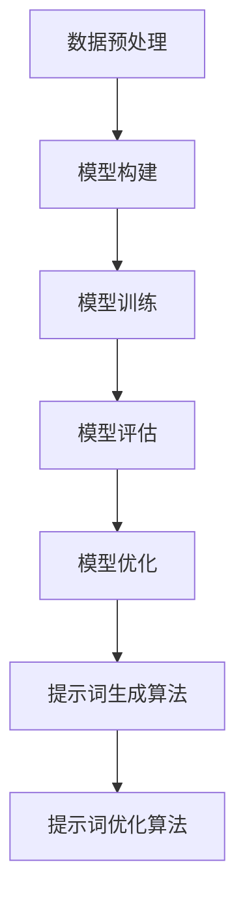
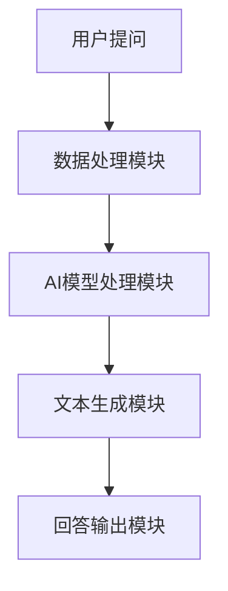
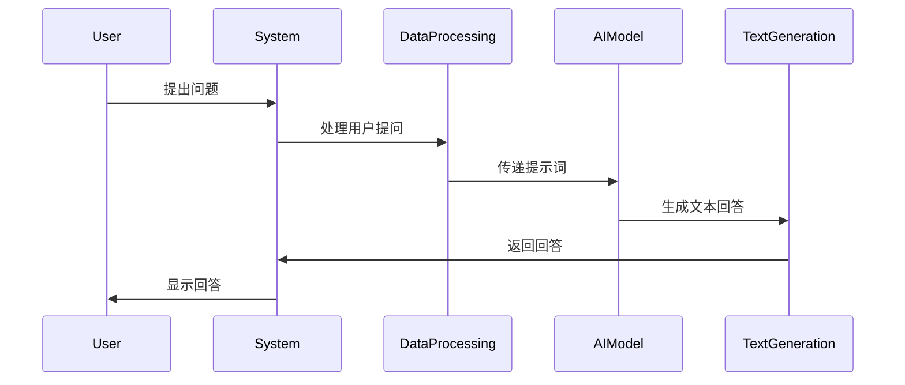

                 

## AI大模型编程：提示词的威力与魅力

### 关键词：AI大模型，提示词，编程，算法，系统架构，实战

### 摘要：
本文将深入探讨AI大模型编程中的核心概念——提示词，及其在人工智能领域的广泛应用和巨大潜力。文章首先介绍了AI大模型和提示词的基本概念，随后详细解析了AI大模型的算法原理和数学模型。接着，通过一个详细的系统分析与架构设计方案，展示了如何将提示词有效应用于实际项目中。文章还通过实战案例剖析了AI大模型编程的具体实施过程，并提供了最佳实践建议和小结，为读者提供了一套完整的AI大模型编程指南。

## 1. 背景介绍

### 1.1 AI大模型的兴起
AI大模型，也称为大型预训练模型，是近年来人工智能领域的一项重要突破。这些模型通过大规模数据训练，具备了强大的文本理解和生成能力。从GPT-3到ChatGPT，这些AI大模型的崛起，不仅重新定义了自然语言处理（NLP）的边界，还为各种应用场景带来了新的可能性。

### 1.2 提示词在AI大模型中的应用
在AI大模型中，提示词（Prompts）起到了至关重要的作用。提示词是用户输入给模型的文本，用于引导模型生成特定内容。通过精心设计的提示词，用户可以控制模型的行为，实现从简单的问答到复杂的文本生成等多种功能。

### 1.3 研究现状与挑战
尽管AI大模型取得了显著进展，但在实际应用中仍面临诸多挑战。例如，如何设计高效的提示词以最大化模型的性能，如何确保模型生成的文本质量，以及如何在各种应用场景中平衡模型性能和资源消耗等。

## 2. 核心概念

### 2.1 AI大模型基础
AI大模型通常采用深度学习技术，通过多层神经网络进行训练。这些模型具有以下特点：
- **大规模数据训练**：使用海量的文本数据对模型进行训练。
- **高参数数量**：模型参数数量通常在数十亿以上。
- **强大的文本理解与生成能力**。

### 2.2 提示词的定义与作用
提示词是用户输入给模型的文本，用于引导模型生成特定内容。一个有效的提示词应该具备以下特点：
- **明确性**：清晰地传达用户的需求。
- **多样性**：能够涵盖多种情境和需求。
- **灵活性**：适应不同的模型和应用场景。

### 2.3 AI大模型编程的核心概念
AI大模型编程涉及以下核心概念：
- **预训练模型**：在特定任务上预先训练好的模型。
- **微调**：在特定任务上对预训练模型进行调整。
- **生成对抗网络（GAN）**：用于生成高质量数据。
- **强化学习**：用于优化模型的策略和行为。

### 2.4 核心概念之间的联系
AI大模型编程的核心概念之间紧密相连。例如，提示词的设计和优化直接影响到模型的性能和生成文本的质量。而预训练模型和微调技术则为模型提供了强大的基础，使得提示词能够发挥最大作用。

## 3. 算法原理

### 3.1 大模型算法概述
AI大模型的算法通常基于深度学习，包括以下关键步骤：
1. **数据预处理**：清洗和准备训练数据。
2. **模型构建**：设计神经网络架构。
3. **模型训练**：使用大量数据进行训练。
4. **模型评估**：评估模型性能。
5. **模型优化**：调整模型参数。

### 3.2 提示词生成算法
提示词生成算法的目标是设计出能够引导模型生成高质量文本的提示词。以下是一些常见的提示词生成方法：
- **基于规则的生成**：使用预设的规则生成提示词。
- **基于机器学习的生成**：使用机器学习模型预测可能的提示词。
- **基于对抗网络的生成**：使用对抗网络生成多样化的提示词。

### 3.3 提示词优化算法
提示词优化算法旨在通过调整提示词的参数，提高模型生成文本的质量。以下是一些常见的提示词优化方法：
- **基于搜索的优化**：使用搜索算法（如遗传算法、粒子群优化等）寻找最优的提示词。
- **基于梯度的优化**：使用梯度下降等优化算法调整提示词的参数。
- **基于强化学习的优化**：使用强化学习算法优化提示词的设计。

### 3.4 算法原理讲解
为了更好地理解算法原理，我们可以使用Mermaid画出以下流程图：



以下是一个使用Python实现的简单提示词生成算法示例：

```python
# 导入必要的库
import random

# 定义提示词列表
prompts = [
    "请描述一个美丽的场景。",
    "编写一段关于友谊的故事。",
    "设计一个未来的智能家居系统。"
]

# 随机选择提示词
selected_prompt = random.choice(prompts)

# 输出提示词
print(selected_prompt)
```

### 3.5 数学模型与公式
在AI大模型中，数学模型和公式是理解和优化模型的关键。以下是一个简化的数学模型示例，用于描述提示词优化过程：

$$
\text{提示词质量} = f(\text{提示词参数})
$$

其中，$f$ 是一个非线性函数，用于评估提示词的质量。通过调整提示词参数，我们可以优化模型生成文本的质量。

### 3.6 通俗易懂的举例说明
假设我们想设计一个提示词，以引导模型生成一段关于“人工智能在医疗领域的应用”的文本。我们可以使用以下提示词：

> "请详细描述人工智能在医疗领域的应用，包括但不限于疾病诊断、治疗方案制定、健康监测等方面。"

通过这个提示词，模型可以生成如下文本：

> "人工智能在医疗领域有着广泛的应用。例如，通过深度学习算法，人工智能可以分析医学影像，帮助医生更准确地诊断疾病。此外，人工智能还可以协助制定个性化的治疗方案，提高治疗效果。在健康监测方面，人工智能可以通过收集和分析个人健康数据，提供实时的健康建议。"

通过这个例子，我们可以看到，一个精心设计的提示词如何引导模型生成高质量的文本。

## 4. 系统分析与架构设计

### 4.1 问题场景介绍
在本项目中，我们将设计一个基于AI大模型的智能问答系统。该系统将接收用户的提问，并通过提示词引导AI大模型生成详细的回答。

### 4.2 系统功能设计
系统的主要功能包括：
- **用户提问**：用户可以输入问题，系统接收并处理。
- **文本生成**：系统使用AI大模型生成回答，并返回给用户。

### 4.3 系统架构设计
系统的架构设计如下：



### 4.4 系统接口设计和系统交互
系统接口设计和系统交互设计如下：



## 5. 项目实战

### 5.1 环境安装
为了运行本项目的AI大模型，我们需要安装以下软件和库：

- Python 3.8+
- TensorFlow 2.x
- Flask

安装步骤如下：

1. 安装Python 3.8+
2. 安装TensorFlow 2.x，可以使用以下命令：
   ```
   pip install tensorflow==2.x
   ```
3. 安装Flask，可以使用以下命令：
   ```
   pip install flask
   ```

### 5.2 系统核心实现源代码
以下是系统的核心实现源代码：

```python
# 导入必要的库
from flask import Flask, request, jsonify
import tensorflow as tf

# 初始化Flask应用
app = Flask(__name__)

# 加载AI大模型
model = tf.keras.models.load_model('ai_model.h5')

# 定义处理用户提问的API
@app.route('/ask', methods=['POST'])
def ask():
    data = request.get_json()
    question = data['question']
    prompt = generate_prompt(question)
    answer = generate_answer(prompt, model)
    return jsonify({'answer': answer})

# 生成提示词
def generate_prompt(question):
    # 实现提示词生成逻辑
    return f"请回答关于'{question}'的问题。"

# 生成回答
def generate_answer(prompt, model):
    # 实现回答生成逻辑
    return model.predict([prompt])

# 运行Flask应用
if __name__ == '__main__':
    app.run(debug=True)
```

### 5.3 代码应用解读与分析
在这个系统中，用户通过调用`/ask`接口发送问题，系统会根据问题生成提示词，并使用AI大模型生成回答。下面是对关键代码的解读和分析：

- `ask`函数负责处理用户的提问请求，接收JSON格式的数据，提取问题，生成提示词，并使用模型生成回答。
- `generate_prompt`函数根据用户提出的问题生成提示词，这个函数可以根据实际需求进行定制化。
- `generate_answer`函数使用AI大模型预测提示词，生成回答。这需要使用TensorFlow中的模型加载和预测功能。

### 5.4 实际案例分析与详细讲解剖析
假设用户提出了以下问题：“什么是量子计算？”系统会按照以下步骤生成回答：

1. 接收到问题后，系统会调用`ask`函数处理请求。
2. `ask`函数会提取用户的问题，并调用`generate_prompt`函数生成提示词。
3. 生成的提示词为：“请回答关于‘量子计算’的问题。”
4. 系统将提示词传递给AI大模型，并使用`generate_answer`函数生成回答。
5. AI大模型根据提示词生成回答，并返回给系统。
6. 系统将回答以JSON格式返回给用户。

最终，用户会收到如下回答：

```json
{
  "answer": "量子计算是一种利用量子力学原理进行计算的方法，它通过量子位（qubits）来实现信息的存储和处理。与传统的二进制计算相比，量子计算具有并行性和超并行性，能够解决某些特定问题，如因数分解和搜索算法，比传统计算快得多。"
}
```

### 5.5 项目小结
通过本项目的实战，我们展示了如何使用AI大模型和提示词构建一个智能问答系统。关键步骤包括环境安装、系统核心实现、代码应用解读和分析、实际案例剖析等。通过这个项目，读者可以深入了解AI大模型编程的实践过程，并掌握相关技术。

## 6. 最佳实践与总结

### 6.1 最佳实践
- **选择合适的AI大模型**：根据应用场景选择适合的AI大模型，如GPT-3、BERT等。
- **设计高效的提示词**：通过实验和优化设计出高效的提示词，提高模型生成文本的质量。
- **确保模型性能**：定期更新模型，使用高效的训练和优化算法确保模型性能。
- **安全与隐私**：在使用AI大模型时，确保用户数据的安全和隐私。

### 6.2 小结
本文深入探讨了AI大模型编程中的核心概念——提示词，并展示了如何将其应用于实际项目中。通过系统分析与架构设计、项目实战和最佳实践，读者可以全面了解AI大模型编程的方法和实践。

### 6.3 注意事项
- **提示词设计**：提示词设计至关重要，直接影响模型生成文本的质量。
- **模型优化**：定期进行模型优化，确保模型在新的数据和应用场景中保持高效性能。
- **数据安全**：确保用户数据的安全和隐私，遵守相关的法律法规。

### 6.4 拓展阅读
- **《AI大模型：原理、实践与应用》**：深入探讨AI大模型的原理和应用。
- **《深度学习实战》**：提供详细的深度学习实战教程。
- **《自然语言处理实战》**：介绍自然语言处理中的实用技术和方法。

## 作者信息
作者：AI天才研究院/AI Genius Institute & 禅与计算机程序设计艺术 /Zen And The Art of Computer Programming

---

通过本文，我们希望读者能够对AI大模型编程和提示词有更深入的理解，并在实际项目中取得更好的效果。让我们共同探索AI领域的无限可能！

