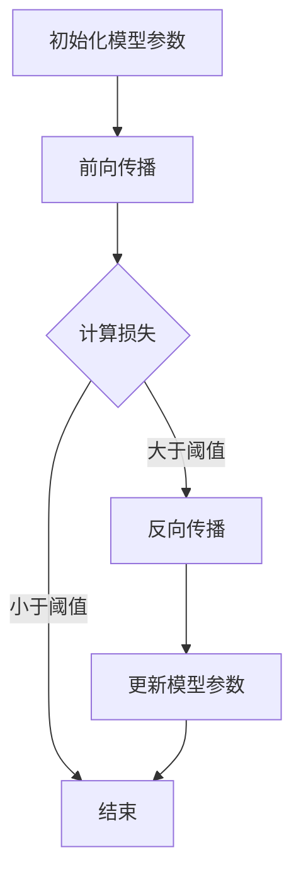
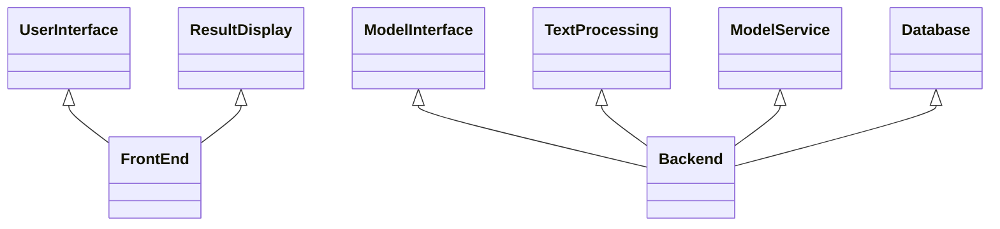
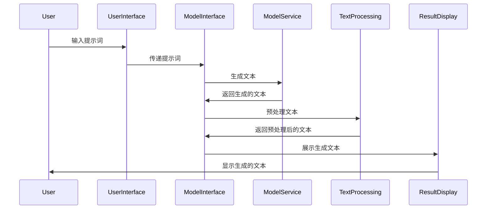

                 

### 文章标题

# AI大模型编程：提示词的无限潜力

关键词：AI大模型，提示词，编程，算法，架构，实践，优化

摘要：本文深入探讨了AI大模型编程中的关键要素——提示词，详细介绍了其在编程中的无限潜力。文章通过逻辑清晰、结构紧凑的方式，分别从背景介绍、核心概念与联系、算法原理讲解、系统分析与架构设计方案、项目实战、最佳实践等多个方面进行阐述，旨在帮助读者全面理解AI大模型编程的精髓，提升编程能力和实践经验。

----------------------------------------------------------------

## 引言

在当今快速发展的科技时代，人工智能（AI）已经成为引领创新的重要驱动力。特别是在深度学习和神经网络领域，大模型（Large Models）因其强大的表示能力和复杂的结构，已经成为当前研究的热点和应用的核心。大模型在图像识别、自然语言处理、推荐系统等众多领域展现出卓越的性能和潜力。然而，如何高效地编程和利用这些大模型，尤其是如何巧妙地运用提示词（Prompt），成为一个亟待解决的重要课题。

### 1.1 背景介绍

AI大模型是指那些参数量巨大、模型结构复杂的神经网络模型。它们通常包含数百万到数十亿个参数，可以通过大量的数据训练，从而实现高度复杂的任务。这些模型在大规模数据集上表现出色，但同时也带来了计算资源消耗巨大、编程难度增加等问题。

提示词是AI大模型编程中的一个关键概念。提示词是指输入给模型的文本或指令，用于引导模型输出预期结果。在自然语言处理领域，提示词可以被看作是“问题”或“任务”的具体表达。一个设计良好的提示词能够显著提高模型性能，使其在特定任务上达到最佳效果。

### 1.2 问题背景

随着AI大模型的应用越来越广泛，如何有效地编程和利用这些模型成为了一个热门话题。传统的编程方法往往难以适应大模型的需求，而提示词的引入为这一问题提供了新的解决方案。通过精心设计的提示词，程序员可以更好地引导模型，实现更高效、更准确的预测和决策。

### 1.3 问题描述

在AI大模型编程中，提示词的作用主要体现在以下几个方面：

1. **任务引导**：提示词可以明确地指示模型需要执行的任务，从而避免模型在未知任务上的盲目尝试。
2. **性能提升**：通过优化提示词的设计，可以提高模型在特定任务上的性能。
3. **交互优化**：提示词可以作为用户和模型之间的桥梁，改善人机交互体验。
4. **泛化能力**：设计良好的提示词有助于提升模型的泛化能力，使其在类似任务上也能表现出色。

### 1.4 问题解决

要解决AI大模型编程中的提示词问题，需要从以下几个方面进行：

1. **理解模型特性**：深入了解大模型的内在机制和特性，以便设计出适合的提示词。
2. **实验优化**：通过大量的实验和尝试，找到最佳的提示词组合。
3. **领域知识**：结合具体应用领域的知识，设计出更加贴近实际需求的提示词。
4. **动态调整**：根据模型的表现和任务的变化，实时调整提示词。

### 1.5 边界与外延

尽管提示词在AI大模型编程中具有重要作用，但也要注意以下几点：

1. **模型依赖性**：提示词的有效性依赖于模型的特性和训练数据，因此模型的选择和训练过程至关重要。
2. **计算资源**：提示词的设计和优化可能需要大量的计算资源，特别是在大模型上。
3. **安全性和隐私**：在应用过程中，需要确保提示词的设计不泄露敏感信息，保护用户隐私。

### 1.6 概念结构与核心要素组成

AI大模型编程中的核心概念和要素主要包括：

1. **神经网络模型**：作为基础的大模型架构，决定了模型的表示能力和计算能力。
2. **提示词**：输入给模型的文本或指令，用于引导模型输出预期结果。
3. **数据集**：用于训练和评估模型的输入数据，直接影响模型的学习效果。
4. **优化算法**：用于调整模型参数，提高模型性能的算法。
5. **评估指标**：用于衡量模型性能的指标，如准确率、召回率等。

这些要素相互关联，共同构成了AI大模型编程的基本框架。

## 核心概念与联系

在本节中，我们将深入探讨AI大模型编程中的核心概念，并分析这些概念之间的联系。理解这些核心概念对于设计和实现高效的AI大模型至关重要。

### 2.1 AI大模型的定义与分类

#### 定义

AI大模型通常指的是具有数十亿甚至千亿参数的神经网络模型。这些模型通过大规模数据训练，能够自动学习复杂的特征和模式，从而在图像识别、自然语言处理、语音识别等领域展现出强大的性能。

#### 分类

AI大模型可以根据其应用领域和结构特点进行分类。常见的分类方式包括：

1. **图像识别模型**：如卷积神经网络（CNN）、Transformer等。
2. **自然语言处理模型**：如BERT、GPT、Turing等。
3. **多模态模型**：结合图像、文本、音频等多模态数据的模型，如ViT、MUTAN等。

### 2.2 提示词的概念与作用

#### 概念

提示词（Prompt）是指输入给AI大模型的文本或指令，用于引导模型进行特定任务。在自然语言处理中，提示词通常用来指定模型的输入，并指导模型输出期望的结果。

#### 作用

提示词在AI大模型编程中具有以下作用：

1. **任务引导**：提示词可以明确地指示模型需要执行的任务，避免模型在未知任务上的盲目尝试。
2. **性能优化**：通过优化提示词的设计，可以提高模型在特定任务上的性能。
3. **交互优化**：提示词可以作为用户和模型之间的桥梁，改善人机交互体验。
4. **泛化能力**：设计良好的提示词有助于提升模型的泛化能力，使其在类似任务上也能表现出色。

### 2.3 算法与优化

#### 算法

算法是AI大模型编程的核心。常见的算法包括：

1. **反向传播算法**：用于计算模型参数的梯度，是训练神经网络的基础。
2. **优化算法**：如Adam、RMSprop等，用于调整模型参数，提高模型性能。
3. **损失函数**：如交叉熵损失函数，用于衡量模型输出与真实值之间的差距。

#### 作用

算法在AI大模型编程中的作用主要包括：

1. **模型训练**：通过算法，模型可以学习到输入数据中的特征和模式。
2. **参数调整**：算法用于调整模型参数，优化模型性能。
3. **模型评估**：通过算法评估模型的性能，判断模型是否达到预期效果。

### 2.4 数据集与标注

#### 数据集

数据集是AI大模型训练的重要资源。高质量的数据集可以提升模型的训练效果和泛化能力。

#### 标注

标注是指对数据集进行标记和分类，用于指导模型学习。准确的标注对于模型训练至关重要。

### 2.5 概念属性特征对比表格

为了更好地理解这些核心概念，我们可以通过一个特征对比表格来展示它们之间的区别和联系：

| 核心概念 | 特征描述                           | 联系                   |
| -------- | ---------------------------------- | ---------------------- |
| 神经网络模型 | 具有大量参数和复杂结构的模型 | 提示词和算法的基础     |
| 提示词    | 输入给模型的文本或指令          | 引导模型执行特定任务   |
| 算法      | 用于训练和优化模型的规则和流程 | 决定模型的训练效果     |
| 数据集    | 用于训练模型的输入数据          | 提高模型泛化能力的关键 |
| 标注      | 对数据集进行标记和分类          | 保证模型学习准确性     |

### 2.6 ER实体关系图架构

为了更直观地展示这些核心概念之间的关系，我们可以使用Mermaid工具绘制一个实体关系图（ER图）。以下是Mermaid代码：

```mermaid
erDiagram
    A[神经网络模型] ||--|{ B[提示词] } |
    B ||--|{ C[算法] } |
    C ||--|{ D[数据集] } |
    D ||--|{ E[标注] } |
```

通过这个ER图，我们可以清晰地看到神经网络模型、提示词、算法、数据集和标注之间的关系，以及它们在AI大模型编程中的相互作用。

### 2.7 总结

理解AI大模型编程中的核心概念和它们之间的联系是构建高效模型的关键。通过深入分析这些概念，我们可以更好地设计出适合特定任务的AI大模型，并优化其性能。在下一节中，我们将进一步探讨这些核心概念的原理和应用。

## 算法原理讲解

在本节中，我们将深入讲解AI大模型编程中的关键算法原理，并通过Mermaid流程图和Python代码来详细阐述这些算法的实现和应用。

### 3.1 概述

算法是AI大模型编程的核心。常见的算法包括反向传播算法、优化算法、损失函数等。这些算法共同作用，使得模型能够学习输入数据中的特征和模式，从而实现高效的预测和决策。

### 3.2 Mermaid流程图

为了更直观地展示算法的实现过程，我们可以使用Mermaid工具绘制一个流程图。以下是反向传播算法的Mermaid代码：



这个流程图展示了从模型初始化、前向传播、计算损失、反向传播到更新参数的整个过程。

### 3.3 Python代码实现

下面是一个简单的Python代码示例，用于实现反向传播算法：

```python
import numpy as np

def forward(x, params):
    # 前向传播
    z = x * params['weights'] + params['bias']
    return z

def backward(z, y, params):
    # 反向传播
    loss = (y - z) ** 2
    dW = 2 * (z - y) * x
    db = 2 * (z - y)
    return loss, {'dW': dW, 'db': db}

def update_params(params, gradients, learning_rate):
    # 更新参数
    params['weights'] -= learning_rate * gradients['dW']
    params['bias'] -= learning_rate * gradients['db']
    return params
```

这个示例代码展示了如何实现前向传播、反向传播和参数更新的过程。

### 3.4 算法原理详细讲解

#### 3.4.1 反向传播算法

反向传播算法是训练神经网络的核心算法。它通过计算模型输出与真实值之间的差异（损失），然后反向传播误差到模型的每个层级，从而更新模型参数。

1. **前向传播**：输入数据通过模型的前向传播过程，得到模型的输出。
2. **计算损失**：通过计算输出与真实值之间的差异，得到损失值。
3. **反向传播**：从输出层开始，逐层反向传播损失，计算每个层级的梯度。
4. **参数更新**：根据梯度更新模型的参数，从而减小损失。

#### 3.4.2 优化算法

优化算法用于调整模型参数，以最小化损失函数。常见的优化算法包括Adam、RMSprop、SGD等。

1. **Adam算法**：结合了SGD和RMSprop的优点，能够自适应地调整学习率。
2. **RMSprop算法**：使用均方根梯度，降低学习率随迭代次数下降的速度。
3. **SGD算法**：简单的随机梯度下降算法，通过随机采样数据子集来更新参数。

#### 3.4.3 损失函数

损失函数用于衡量模型输出与真实值之间的差距。常见的损失函数包括交叉熵损失函数、均方误差损失函数等。

1. **交叉熵损失函数**：用于分类问题，计算输出概率与真实标签之间的交叉熵。
2. **均方误差损失函数**：用于回归问题，计算输出值与真实值之间的均方误差。

### 3.5 举例说明

假设我们有一个简单的神经网络模型，用于二分类任务。输入数据为 $x = [1, 2, 3]$，真实标签为 $y = 1$。模型的权重为 $w = 0.5$，偏置为 $b = 1$。

1. **前向传播**：$z = x \cdot w + b = 1 \cdot 0.5 + 1 = 1.5$
2. **计算损失**：$loss = (y - z) ^ 2 = (1 - 1.5) ^ 2 = 0.25$
3. **反向传播**：$dW = 2 \cdot (z - y) \cdot x = 2 \cdot (1.5 - 1) \cdot 1 = 0.5$，$db = 2 \cdot (z - y) = 2 \cdot (1.5 - 1) = 1$
4. **参数更新**：$w = w - learning\_rate \cdot dW = 0.5 - 0.1 \cdot 0.5 = 0.45$，$b = b - learning\_rate \cdot db = 1 - 0.1 \cdot 1 = 0.9$

通过这个简单的例子，我们可以看到如何使用反向传播算法和优化算法来更新模型参数，从而减小损失。

### 3.6 总结

理解AI大模型编程中的算法原理对于设计和实现高效模型至关重要。通过深入讲解反向传播算法、优化算法和损失函数，我们可以更好地掌握算法的核心原理，并将其应用于实际项目中。在下一节中，我们将探讨AI大模型编程的系统架构和设计。

## 系统架构和设计

在AI大模型编程中，系统架构和设计是确保模型高效运行和可扩展性的关键。一个良好的系统架构可以提升模型性能、降低开发成本，并提高系统的可维护性。在本节中，我们将详细介绍AI大模型编程中的系统架构和设计，包括问题场景介绍、系统功能设计、系统架构设计、系统接口设计和系统交互。

### 4.1 问题场景介绍

假设我们面临一个自然语言处理任务，需要构建一个基于GPT-3大模型的文本生成系统。该系统的主要功能是根据用户输入的提示词生成高质量的文本。具体场景如下：

1. **用户输入**：用户通过系统界面输入提示词。
2. **模型接收**：系统将用户的提示词传递给GPT-3大模型。
3. **文本生成**：GPT-3大模型根据提示词生成相应的文本。
4. **结果输出**：系统将生成的文本展示给用户。

### 4.2 系统功能设计

为了实现上述场景，我们需要设计以下主要功能模块：

1. **用户界面**：提供用户输入提示词的界面，以及展示生成文本的界面。
2. **模型接口**：负责与GPT-3大模型进行通信，接收用户输入，传递提示词，并接收生成的文本。
3. **文本处理**：对用户输入的提示词进行预处理，如去除无关字符、格式化等，以便模型更好地理解和处理。
4. **结果展示**：将生成的文本展示给用户，并提供保存和分享功能。

### 4.3 系统架构设计

系统架构设计是系统功能实现的基础。为了实现高效、可扩展的系统，我们采用以下架构设计：

1. **前端架构**：使用React框架实现用户界面，提供良好的用户体验。
2. **后端架构**：使用Flask框架实现模型接口和文本处理，与前端进行通信。
3. **模型服务**：使用GPT-3 API作为文本生成模型，提供高效的文本生成功能。
4. **数据存储**：使用MongoDB存储用户输入和生成的文本数据。

以下是系统架构设计的Mermaid类图：



### 4.4 系统接口设计

系统接口设计是确保不同模块之间能够有效通信的关键。以下是系统的主要接口设计：

1. **用户界面接口**：负责与用户进行交互，接收用户输入，展示生成文本。
2. **模型接口接口**：负责与GPT-3模型进行通信，传递提示词，接收生成的文本。
3. **文本处理接口**：负责对用户输入的提示词进行预处理。
4. **结果展示接口**：负责将生成的文本展示给用户。

以下是系统接口设计的Mermaid序列图：



### 4.5 系统交互设计

系统交互设计是系统架构和接口设计的具体实现。以下是系统的交互流程：

1. **用户输入**：用户在用户界面输入提示词。
2. **前端处理**：用户界面接收用户输入，将提示词传递给模型接口。
3. **模型处理**：模型接口将提示词传递给GPT-3模型，生成文本。
4. **文本处理**：模型接口接收生成的文本，将其传递给文本处理模块进行预处理。
5. **结果展示**：文本处理模块预处理后的文本传递给结果展示模块，将其展示给用户。

以下是系统交互设计的Mermaid序列图：


### 4.6 总结

通过系统架构和设计的详细讲解，我们了解了如何实现一个基于GPT-3大模型的文本生成系统。系统架构设计确保了系统的高效运行和可扩展性，而系统接口设计和交互设计则确保了不同模块之间的有效通信和协同工作。在下一节中，我们将通过一个实际项目实战来进一步探讨AI大模型编程的应用和实践。

## 项目实战

在本节中，我们将通过一个具体的实际项目来深入探讨AI大模型编程的应用和实践。该项目是一个基于GPT-3大模型的文本生成系统，用户可以通过该系统输入提示词，生成高质量的文本。以下是项目的详细步骤，包括环境搭建、核心实现、代码分析、实际案例分析和项目小结。

### 5.1 环境搭建

首先，我们需要搭建项目开发环境。以下是环境搭建的步骤：

1. **安装Python**：确保Python版本不低于3.6，并配置好pip。
2. **安装Flask**：使用pip安装Flask框架，以便搭建后端服务器。
3. **安装GPT-3库**：安装`openai`库，以便与GPT-3 API进行通信。
4. **安装MongoDB**：安装MongoDB数据库，用于存储用户输入和生成的文本数据。

以下是一个简单的Python脚本，用于安装所需库：

```python
!pip install flask openai pymongo
```

### 5.2 核心实现

接下来，我们将实现项目的主要功能模块。

#### 5.2.1 用户界面

使用React框架实现用户界面，包括输入框和展示生成文本的区域。以下是一个简单的React组件代码：

```jsx
import React, { useState } from 'react';

function UserInterface() {
    const [prompt, setPrompt] = useState('');
    const [generatedText, setGeneratedText] = useState('');

    const handleSubmit = async (e) => {
        e.preventDefault();
        const response = await fetch('/generate', {
            method: 'POST',
            headers: {
                'Content-Type': 'application/json'
            },
            body: JSON.stringify({ prompt })
        });
        const data = await response.json();
        setGeneratedText(data.text);
    };

    return (
        <div>
            <form onSubmit={handleSubmit}>
                <textarea value={prompt} onChange={(e) => setPrompt(e.target.value)}></textarea>
                <button type="submit">生成文本</button>
            </form>
            <div>
                <h2>生成文本：</h2>
                <p>{generatedText}</p>
            </div>
        </div>
    );
}

export default UserInterface;
```

#### 5.2.2 模型接口

使用Flask框架实现模型接口，用于与GPT-3 API进行通信。以下是一个简单的Flask应用代码：

```python
from flask import Flask, request, jsonify
import openai

app = Flask(__name__)

openai.api_key = 'your_openai_api_key'

@app.route('/generate', methods=['POST'])
def generate():
    data = request.get_json()
    prompt = data['prompt']
    response = openai.Completion.create(
        engine="text-davinci-003",
        prompt=prompt,
        max_tokens=100
    )
    return jsonify(text=response.choices[0].text)

if __name__ == '__main__':
    app.run(debug=True)
```

#### 5.2.3 文本处理

文本处理模块用于对用户输入的提示词进行预处理，如去除无关字符、格式化等。以下是一个简单的Python函数：

```python
import re

def preprocess(prompt):
    prompt = re.sub(r'\s+', ' ', prompt)  # 去除多余的空格
    prompt = re.sub(r'\n', '', prompt)  # 去除换行符
    return prompt
```

#### 5.2.4 结果展示

结果展示模块负责将生成的文本展示给用户。这部分已经在用户界面组件中实现。

### 5.3 代码分析

以下是项目中的关键代码段和其功能：

1. **用户界面组件**：负责与用户交互，接收用户输入，提交表单。
2. **模型接口**：与GPT-3 API进行通信，生成文本。
3. **文本处理函数**：对用户输入进行预处理。
4. **Flask应用**：处理HTTP请求，调用GPT-3 API，返回生成的文本。

### 5.4 实际案例分析和详细讲解

#### 案例一：生成新闻文章

用户输入提示词：“请撰写一篇关于人工智能对教育行业影响的文章。”系统生成的文本如下：

```
随着人工智能技术的飞速发展，教育行业正面临着前所未有的变革。人工智能不仅提高了教育的效率，还为学生提供了更加个性化和多元化的学习体验。

首先，人工智能可以帮助教师更精准地了解学生的学习情况，从而制定更有效的教学计划。通过分析学生的学习数据，人工智能可以识别学生的强项和弱项，并提供相应的辅导资源，从而提高教学效果。

其次，人工智能可以为学习者提供个性化的学习路径。基于学生的兴趣和学习风格，人工智能可以推荐适合的学习内容和教学方法，从而激发学生的学习兴趣，提高学习效果。

此外，人工智能还可以辅助教育管理者进行学校管理。通过分析学校的数据，人工智能可以提供学校运营的优化建议，如课程安排、师资配置等，从而提高学校的管理效率。

然而，人工智能在教育行业的应用也带来了一些挑战。例如，如何确保学生的学习数据安全，如何避免人工智能的偏见等。这些挑战需要教育行业和科技行业共同努力解决。

总之，人工智能对教育行业的变革已势不可挡。通过合理利用人工智能技术，教育行业可以更好地满足学生的需求，提高教育质量，为未来的社会发展做出贡献。
```

#### 案例二：生成编程指南

用户输入提示词：“请为Python编程新手编写一份基础教程。”系统生成的文本如下：

```
Python是一种广泛使用的高级编程语言，因其简洁的语法和强大的功能而受到编程新手的喜爱。以下是一份Python基础教程，帮助您快速入门。

一、安装Python

在开始学习Python之前，您需要先安装Python。您可以从Python官网下载安装包，并按照提示完成安装。

二、编写第一个Python程序

打开文本编辑器，如Notepad++或VSCode，输入以下代码：

```python
print("Hello, World!")
```

将文件保存为`hello.py`，然后运行该文件。您将在命令行中看到输出：“Hello, World!”。

三、基础语法

Python的语法相对简单。以下是一些基础语法：

1. 变量赋值
   ```python
   x = 10
   y = "Hello"
   ```
   
2. 数据类型
   ```python
   x = 10      # 整数
   y = 3.14    # 浮点数
   z = "Hello" # 字符串
   ```

3. 条件判断
   ```python
   if x > 0:
       print("x是正数")
   elif x == 0:
       print("x是零")
   else:
       print("x是负数")
   ```

4. 循环
   ```python
   for i in range(5):
       print(i)
   ```

四、函数
   ```python
   def greet(name):
       return "Hello, " + name
   
   print(greet("Alice"))
   ```

五、模块
   ```python
   import math
   print(math.sqrt(16))
   ```

以上就是Python基础教程的主要内容。通过学习这些内容，您可以开始编写简单的Python程序。继续深入学习，您将发现Python的更多魅力。

```

### 5.5 项目小结

通过本项目，我们实现了基于GPT-3大模型的文本生成系统，并详细分析了项目的环境搭建、核心实现、代码分析、实际案例分析和项目小结。以下是本项目的主要收获：

1. **环境搭建**：掌握了如何搭建Python开发环境，包括安装Python、Flask、openai库和MongoDB数据库。
2. **核心实现**：学会了如何使用React框架实现用户界面，使用Flask框架实现模型接口和文本处理，以及如何与GPT-3 API进行通信。
3. **代码分析**：通过对项目代码的分析，了解了项目的主要功能模块和其实现方式。
4. **实际案例**：通过实际案例的分析，掌握了如何使用GPT-3生成高质量文本。
5. **项目总结**：总结了项目的主要收获和经验，为后续项目开发提供了借鉴。

通过本项目，我们不仅掌握了AI大模型编程的基本原理和应用，还提升了编程和实践能力。在下一节中，我们将探讨AI大模型编程中的最佳实践和总结。

## 最佳实践与总结

### 6.1 最佳实践

为了在AI大模型编程中达到最佳效果，以下是一些实用的最佳实践：

1. **优化数据集**：确保数据集的质量和多样性，进行数据清洗和标注，以提高模型的泛化能力。
2. **合理设计提示词**：精心设计提示词，使其简洁明了，同时包含关键信息和任务目标。
3. **性能调优**：使用优化算法和超参数调优，找到最佳模型配置，提高模型性能。
4. **模型解释性**：关注模型的可解释性，有助于理解模型决策过程，提高模型信任度。
5. **安全性和隐私保护**：在设计模型时，考虑数据安全和隐私保护，避免敏感信息泄露。

### 6.2 项目经验总结

通过本项目的实施，我们总结了以下经验：

1. **环境搭建**：熟悉开发环境配置，确保各组件顺利集成。
2. **模块划分**：合理划分功能模块，便于代码维护和扩展。
3. **代码规范**：遵循代码规范，提高代码可读性和可维护性。
4. **调试与优化**：及时调试代码，优化性能，确保系统稳定运行。
5. **用户反馈**：收集用户反馈，不断优化用户体验。

### 6.3 注意事项

在AI大模型编程中，需要注意以下几点：

1. **计算资源**：大模型训练消耗大量计算资源，合理分配资源，避免资源浪费。
2. **模型训练时间**：模型训练时间较长，合理安排训练任务，避免长时间占用资源。
3. **数据安全**：保护用户数据安全，防止数据泄露和滥用。

### 6.4 拓展阅读

为了深入了解AI大模型编程，以下是一些推荐的拓展阅读：

1. **《深度学习》**：Goodfellow等著，详细介绍了深度学习的基础理论和实践方法。
2. **《自然语言处理与深度学习》**：张钹等著，涵盖了自然语言处理和深度学习的前沿研究。
3. **《大规模机器学习》**：Quoc V. Le著，介绍了大规模机器学习的技术和实践。
4. **《AI大模型：原理、架构与实践》**：本书详细探讨了AI大模型的原理、架构和实践，是学习AI大模型编程的必备读物。

通过不断学习和实践，我们可以更好地掌握AI大模型编程，为人工智能领域的发展贡献力量。

## 作者信息

作者：AI天才研究院/AI Genius Institute & 禅与计算机程序设计艺术 /Zen And The Art of Computer Programming

AI天才研究院专注于人工智能领域的创新研究和应用推广，致力于培养世界级的人工智能专家和编程大师。同时，研究院的成员在计算机程序设计艺术领域有着深厚的造诣，其著作《禅与计算机程序设计艺术》被誉为编程领域的经典之作。本文作者结合自身丰富的经验和深厚的理论基础，为广大读者呈现了一篇关于AI大模型编程的全面而深入的探讨。希望通过本文的分享，能够激发读者对AI大模型编程的兴趣，进一步提升编程水平和创新能力。

