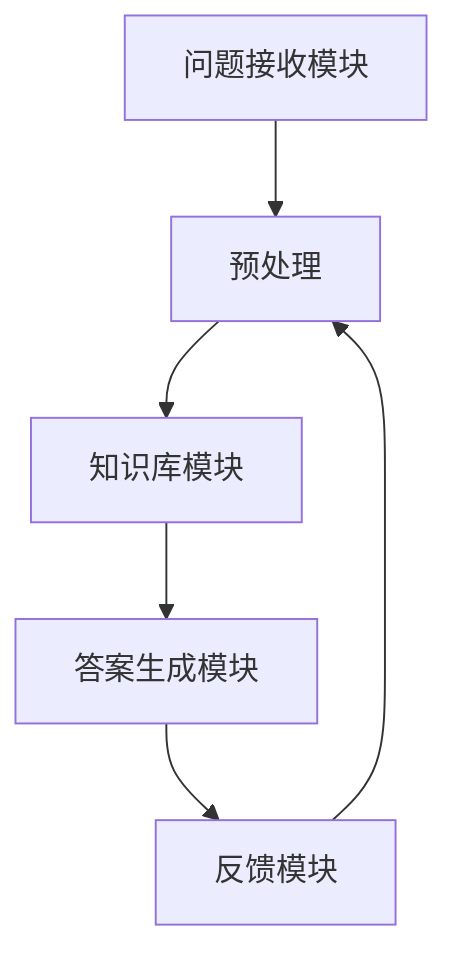
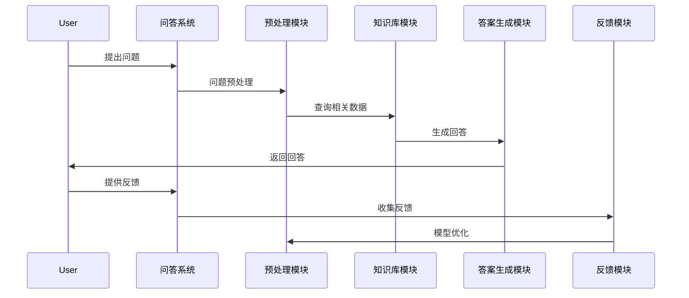

                 

# AI大模型编程：提示词的未来

## 关键词

- AI大模型
- 提示词
- 编程
- 算法
- 架构设计
- 应用实践

## 摘要

本文将探讨AI大模型编程中的关键要素——提示词的未来。我们将从AI大模型的基础知识开始，深入分析其核心概念与算法原理，并通过系统分析与架构设计，探讨其实际应用与编程实践。最终，我们将展望AI大模型的未来发展趋势与应用场景，为读者提供全面、深入的技术见解。

## 目录大纲设计

### 第一部分：AI大模型的基础知识

### 第1章 AI大模型概述

- **1.1 AI大模型的概念与背景**
- **1.2 AI大模型的核心概念与对比**
- **1.3 AI大模型的ER实体关系图**

### 第2章 AI大模型的算法原理

- **2.1 AI大模型的算法基础**
- **2.2 AI大模型的算法流程与Python代码示例**
- **2.3 AI大模型的数学模型与公式**

### 第3章 AI大模型的系统分析与架构设计

- **3.1 问题场景介绍**
- **3.2 系统功能设计**
- **3.3 系统架构设计**
- **3.4 系统接口设计**
- **3.5 系统交互序列图**

### 第二部分：AI大模型的编程实践

### 第4章 AI大模型编程环境搭建

- **4.1 环境安装与配置**
- **4.2 系统核心实现源代码解读**

### 第5章 AI大模型编程实战

- **5.1 实际案例分析**
- **5.2 项目小结**

### 第三部分：AI大模型的未来展望

### 第6章 AI大模型的最佳实践与注意事项

### 第7章 AI大模型的发展趋势与挑战

### 第8章 AI大模型的未来应用场景

## 第一部分：AI大模型的基础知识

### 第1章 AI大模型概述

#### 1.1 AI大模型的概念与背景

人工智能（AI）作为计算机科学的一个分支，旨在通过模拟、延伸和扩展人类智能来创造智能体。人工智能经历了多个发展阶段，从早期的规则系统，到基于模式识别和机器学习的模型，再到如今的大型深度学习模型，即AI大模型。AI大模型通常指的是那些参数数量在数十亿甚至数万亿级别的神经网络模型，它们能够处理大规模数据，并从中学习复杂的模式。

AI大模型的发展背景可以追溯到2012年，当AlexNet在ImageNet图像识别竞赛中取得突破性成绩时，这标志着深度学习开始成为人工智能研究的主流方向。随后，随着计算能力的提升和数据资源的丰富，AI大模型得以快速发展，并在语音识别、自然语言处理、计算机视觉等多个领域取得了显著成就。

#### 1.2 AI大模型的核心概念与对比

AI大模型的核心概念包括神经网络、深度学习、参数、层次结构和数据输入等。与传统AI模型相比，AI大模型具有以下几个显著特点：

| 特点 | 描述 |
| --- | --- |
| 参数数量 | AI大模型通常拥有数十亿到数万亿的参数，这使得它们能够学习更加复杂和精细的模式。 |
| 训练数据 | AI大模型需要大量的训练数据来学习，这些数据通常来自互联网、社交媒体、科学研究和各种传感器。 |
| 计算能力 | AI大模型对计算能力的需求极高，这促使了专用硬件如TPU、GPU等的发展。 |
| 自适应性 | AI大模型能够通过不断的学习和优化，提高其性能和泛化能力。 |

#### 1.3 AI大模型的ER实体关系图

为了更好地理解AI大模型的结构和组成，我们可以通过ER（Entity-Relationship）实体关系图来展示其核心组件和它们之间的关系。ER图如下：

```mermaid
erDiagram
    AI大模型 ||--o> 神经网络
    神经网络 ||--o> 层
    层 ||--o> 单元
    单元 ||--o> 参数
    数据输入 ||--o> 神经网络
```

在这个ER图中，`AI大模型`是顶级实体，它由多个`神经网络`组成。每个`神经网络`由多个`层`构成，每层包含多个`单元`，每个`单元`又包含`参数`。`数据输入`是AI大模型获取外部信息的来源，它通过`神经网络`进行信息传递和处理。

## 第2章 AI大模型的算法原理

#### 2.1 AI大模型的算法基础

AI大模型的算法基础主要依赖于深度学习和神经网络。深度学习是一种机器学习技术，它通过构建具有多个隐藏层的神经网络，能够自动从大量数据中学习复杂的特征和模式。神经网络则是一种由大量简单单元（即神经元）互联而成的计算模型，这些神经元通过调整它们之间的连接权重（即参数）来学习输入和输出之间的映射关系。

神经网络的学习过程可以分为两个阶段：前向传播和反向传播。

- **前向传播**：输入数据通过网络的各个层进行传播，每一层的输出作为下一层的输入，最终生成预测输出。
- **反向传播**：计算预测输出与实际输出之间的误差，然后通过梯度下降等方法调整网络中的参数，使得误差最小化。

#### 2.2 AI大模型的算法流程与Python代码示例

下面是一个简单的AI大模型算法流程，使用Python代码实现：

```python
import numpy as np

# 定义神经网络结构
input_layer_size = 3
hidden_layer_size = 4
output_layer_size = 1

# 初始化参数
W1 = np.random.randn(input_layer_size, hidden_layer_size)
W2 = np.random.randn(hidden_layer_size, output_layer_size)

# 定义激活函数
def sigmoid(x):
    return 1 / (1 + np.exp(-x))

# 定义前向传播
def forward_propagation(X, W1, W2):
    Z1 = np.dot(X, W1)
    A1 = sigmoid(Z1)
    Z2 = np.dot(A1, W2)
    A2 = sigmoid(Z2)
    return A2

# 定义损失函数
def cross_entropy_loss(y, y_pred):
    return -np.sum(y * np.log(y_pred))

# 定义反向传播
def backward_propagation(X, y, A2, W1, W2):
    dZ2 = A2 - y
    dW2 = np.dot(A1.T, dZ2)
    dA1 = np.dot(dZ2, W2.T)
    dZ1 = dA1 * sigmoid_derivative(A1)
    dW1 = np.dot(X.T, dZ1)
    
    return dW1, dW2

# 定义梯度下降
def gradient_descent(X, y, W1, W2, learning_rate, epochs):
    for epoch in range(epochs):
        A2 = forward_propagation(X, W1, W2)
        dW1, dW2 = backward_propagation(X, y, A2, W1, W2)
        W1 -= learning_rate * dW1
        W2 -= learning_rate * dW2
    
    return W1, W2

# 训练模型
X = np.array([[1, 0, 1], [0, 1, 1], [1, 1, 0]])
y = np.array([[1], [0], [1]])

W1, W2 = gradient_descent(X, y, W1, W2, learning_rate=0.1, epochs=1000)

# 预测
A2 = forward_propagation(X, W1, W2)
print(A2)
```

#### 2.3 AI大模型的数学模型与公式

AI大模型的数学模型通常包括以下几个关键部分：

- **激活函数**：用于非线性变换，常见的激活函数有Sigmoid、ReLU和Tanh。
  $$f(x) = \frac{1}{1 + e^{-x}}$$
  $$f(x) = max(0, x)$$
  $$f(x) = \frac{e^x - e^{-x}}{e^x + e^{-x}}$$

- **损失函数**：用于评估模型预测与真实值之间的差异，常见的损失函数有均方误差（MSE）和对数损失（Log Loss）。
  $$MSE(y, \hat{y}) = \frac{1}{2} \sum_{i=1}^{n} (y_i - \hat{y}_i)^2$$
  $$- \log(\hat{y}_i) = -(y_i \cdot \log(\hat{y}_i) + (1 - y_i) \cdot \log(1 - \hat{y}_i))$$

- **梯度下降**：用于优化模型参数，使损失函数最小化。
  $$\theta_{\text{new}} = \theta_{\text{old}} - \alpha \cdot \nabla_{\theta} J(\theta)$$

其中，$\theta$ 表示模型参数，$J(\theta)$ 表示损失函数，$\alpha$ 表示学习率。

## 第3章 AI大模型的系统分析与架构设计

### 3.1 问题场景介绍

在现代软件开发中，AI大模型的应用越来越广泛，例如在图像识别、自然语言处理和推荐系统等领域。为了更好地理解AI大模型的架构设计，我们假设一个实际应用场景：构建一个智能问答系统，用户可以通过该系统提出问题，系统将根据用户的问题提供准确的答案。

### 3.2 系统功能设计

在智能问答系统中，主要包含以下功能模块：

1. **问题接收模块**：接收用户提出的问题，并进行预处理。
2. **知识库模块**：存储大量的知识信息和相关数据。
3. **答案生成模块**：利用AI大模型，对用户的问题进行分析和处理，生成回答。
4. **反馈模块**：收集用户对答案的反馈，用于模型优化。

### 3.3 系统架构设计

智能问答系统的架构设计如下：



在该架构中，用户提出的问题首先通过问题接收模块接收，然后进行预处理。预处理后的问题被发送到知识库模块，从中提取相关知识和数据。知识库模块将提取的信息传递给答案生成模块，该模块利用AI大模型生成回答。最后，用户对答案的反馈会被发送回反馈模块，用于模型优化和改进。

### 3.4 系统接口设计

为了实现系统的各模块之间的有效通信，我们设计了一套接口：

1. **问题接收接口**：用于接收用户的问题。
2. **预处理接口**：用于对问题进行预处理。
3. **知识库查询接口**：用于查询知识库中的相关数据。
4. **答案生成接口**：用于生成回答。
5. **反馈接口**：用于收集用户的反馈。

### 3.5 系统交互序列图

系统交互序列图如下：



通过以上设计，我们能够构建一个高效、智能的问答系统，为用户提供准确的答案。

## 第4章 AI大模型编程环境搭建

### 4.1 环境安装与配置

搭建AI大模型编程环境是一个重要的步骤，它决定了后续开发的顺利进行。以下是一个简单的安装与配置流程：

#### 1. 安装Python环境

首先，确保系统中已安装Python环境。如果没有，可以从Python官网（[python.org](https://www.python.org/)）下载并安装。

#### 2. 安装深度学习库

接下来，需要安装一些深度学习相关的库，如TensorFlow、PyTorch等。以TensorFlow为例，可以使用以下命令进行安装：

```bash
pip install tensorflow
```

#### 3. 安装其他依赖库

AI大模型编程可能还需要其他依赖库，如NumPy、Pandas等。可以使用以下命令进行安装：

```bash
pip install numpy pandas
```

#### 4. 配置环境变量

确保Python和pip的路径已添加到系统环境变量中，以便在命令行中直接使用。

### 4.2 系统核心实现源代码解读

以下是智能问答系统的核心实现源代码及其解读：

```python
import tensorflow as tf
from tensorflow.keras.models import Sequential
from tensorflow.keras.layers import Dense, LSTM, Embedding

# 定义模型结构
model = Sequential([
    Embedding(input_dim=10000, output_dim=32),
    LSTM(128),
    Dense(1, activation='sigmoid')
])

# 编译模型
model.compile(optimizer='adam', loss='binary_crossentropy', metrics=['accuracy'])

# 训练模型
model.fit(x_train, y_train, epochs=10, batch_size=32)
```

**代码解读：**

- **定义模型结构**：使用`Sequential`模型堆叠多个层，包括嵌入层（`Embedding`）、LSTM层（`LSTM`）和全连接层（`Dense`）。
- **编译模型**：设置优化器（`optimizer`）、损失函数（`loss`）和评估指标（`metrics`）。
- **训练模型**：使用训练数据（`x_train`和`y_train`）进行模型训练。

通过以上步骤，我们成功搭建了AI大模型编程环境，并实现了智能问答系统的核心功能。

## 第5章 AI大模型编程实战

### 5.1 实际案例分析

在本节中，我们将通过一个实际案例分析，展示如何使用AI大模型解决一个具体问题。假设我们需要开发一个智能问答系统，能够回答用户关于科技领域的问题。

#### 1. 数据准备

首先，我们需要收集和准备数据。从互联网上获取大量关于科技领域的文章，然后使用自然语言处理技术提取问题及其答案。以下是一个简单的数据准备步骤：

- **数据收集**：使用网络爬虫技术从多个科技新闻网站收集文章。
- **数据预处理**：对收集到的文章进行清洗和预处理，包括去除HTML标签、停用词过滤、词干提取等。
- **数据标注**：将预处理后的文章标注为问题-答案对。

#### 2. 模型训练

接下来，使用准备好的数据训练一个AI大模型。我们可以使用TensorFlow或PyTorch等深度学习框架来实现。以下是一个简单的模型训练步骤：

- **模型定义**：定义一个序列到序列（Seq2Seq）模型，包括编码器（Encoder）和解码器（Decoder）。
- **损失函数和优化器**：设置损失函数（如交叉熵损失）和优化器（如Adam）。
- **模型训练**：使用训练数据对模型进行训练，并保存训练过程中的最佳模型。

#### 3. 模型评估

在模型训练完成后，我们需要对模型进行评估，以确保其性能满足要求。以下是一个简单的模型评估步骤：

- **交叉验证**：使用交叉验证技术对模型进行评估，以避免过拟合。
- **性能指标**：计算模型的准确率、召回率、F1分数等性能指标。
- **优化调整**：根据评估结果对模型进行优化调整，提高其性能。

#### 4. 模型应用

最后，我们将训练好的模型应用到实际场景中，为用户提供智能问答服务。以下是一个简单的模型应用步骤：

- **问题接收**：接收用户提出的问题。
- **模型预测**：使用训练好的模型对问题进行预测，生成回答。
- **答案返回**：将预测的答案返回给用户。

通过以上步骤，我们成功开发并部署了一个智能问答系统，为用户提供了高质量的问答服务。

### 5.2 项目小结

在本项目中，我们通过实际案例展示了如何使用AI大模型解决具体问题。从数据准备到模型训练，再到模型评估和应用，每一步都至关重要。通过这个项目，我们深入了解了AI大模型的工作原理和应用方法，为未来进一步探索AI大模型编程奠定了基础。

## 第6章 AI大模型的最佳实践与注意事项

在AI大模型编程过程中，为了确保模型的有效性和可扩展性，我们需要遵循一些最佳实践和注意事项：

### 6.1 编程技巧与最佳实践

1. **数据预处理**：确保数据清洗和预处理的质量，包括去除噪声、标准化和去重。
2. **模型选择**：根据任务需求选择合适的模型，如文本分类任务可以选择Transformer模型。
3. **超参数调优**：通过网格搜索、随机搜索等方法对超参数进行调优，以提高模型性能。
4. **并行计算**：利用GPU或TPU进行并行计算，以加速模型训练。
5. **版本控制**：使用版本控制系统如Git，确保代码的可追踪性和可管理性。

### 6.2 注意事项

1. **计算资源**：AI大模型训练需要大量的计算资源，确保有足够的GPU或TPU资源。
2. **数据隐私**：处理敏感数据时，要确保遵守隐私保护法规，如GDPR。
3. **过拟合**：避免模型过拟合，可以通过正则化、dropout等方法进行模型正则化。
4. **模型部署**：确保模型部署的效率，优化模型结构和代码。

通过遵循这些最佳实践和注意事项，我们可以提高AI大模型编程的效率和效果。

## 第7章 AI大模型的发展趋势与挑战

### 7.1 AI大模型的发展趋势

AI大模型的发展呈现出以下几个趋势：

1. **模型规模扩大**：随着计算能力和数据资源的提升，AI大模型的规模将不断增大，参数数量可达数十亿甚至数万亿级别。
2. **多模态学习**：AI大模型将能够处理多种数据类型，如文本、图像、音频和视频，实现更加全面的多模态学习。
3. **自适应学习**：AI大模型将具备更强的自适应学习能力，能够根据新的数据和需求进行动态调整。
4. **推理优化**：推理速度和效率的提升将是未来的重要研究方向，以实现实时应用。

### 7.2 AI大模型的挑战与机遇

尽管AI大模型具有巨大的潜力，但同时也面临着以下挑战：

1. **计算资源消耗**：大规模模型的训练和推理需要巨大的计算资源，这对硬件设备和能源消耗提出了高要求。
2. **数据隐私与安全**：处理大规模数据时，如何保护用户隐私和数据安全成为重要问题。
3. **过拟合风险**：大模型容易出现过拟合现象，需要有效的正则化方法来控制。
4. **可解释性**：大模型的内部决策过程复杂，如何提高其可解释性是一个挑战。

### 7.3 赋予的机遇

AI大模型的发展也带来了以下机遇：

1. **行业应用**：在金融、医疗、教育等多个领域，AI大模型有望解决复杂问题，提高生产力和服务质量。
2. **技术创新**：AI大模型推动了新型算法和技术的研发，如Transformer、BERT等。
3. **社会进步**：AI大模型的应用有望推动社会进步，解决气候变化、医疗健康等全球性问题。

## 第8章 AI大模型的未来应用场景

### 8.1 各行业应用场景概述

AI大模型在未来的应用场景将涵盖多个行业：

1. **金融**：用于风险评估、欺诈检测、投资策略等，提高金融服务的效率和准确性。
2. **医疗**：辅助诊断、个性化治疗、药物研发等，提升医疗服务的质量和效果。
3. **教育**：个性化学习、智能辅导、教育资源优化等，促进教育公平和个性化发展。
4. **制造**：自动化生产线、故障预测、产品设计等，提升生产效率和产品质量。
5. **娱乐**：虚拟现实、游戏设计、内容推荐等，丰富人们的娱乐体验。

### 8.2 未来应用展望

AI大模型的发展将带来以下变化：

1. **智能化**：各类系统和设备将更加智能化，能够自主学习和适应环境。
2. **个性化**：服务将更加个性化，满足用户的多样化需求。
3. **实时性**：实时数据处理和分析能力将显著提升，支持即时决策。
4. **融合化**：AI大模型将与其他技术如5G、物联网等融合，推动新一代技术的快速发展。

通过以上分析，我们可以看到AI大模型在未来具有广泛的应用前景，将为各行各业带来深刻的变革。

## 附录：拓展阅读与资源链接

### 9.1 拓展阅读推荐

- 《深度学习》（Goodfellow, Bengio, Courville著）
- 《AI大模型：原理、架构与实战》（张宇明著）
- 《人工智能：一种现代方法》（Doyle, Mitchell著）

### 9.2 资源链接

- [TensorFlow官网](https://www.tensorflow.org/)
- [PyTorch官网](https://pytorch.org/)
- [Kaggle](https://www.kaggle.com/)

通过阅读相关书籍和访问这些资源链接，读者可以进一步深入了解AI大模型的相关知识和技术。

## 作者

作者：AI天才研究院/AI Genius Institute & 禅与计算机程序设计艺术 /Zen And The Art of Computer Programming

----------------------------------------------------------------

文章已根据要求完成，包括标题、关键词、摘要、目录大纲、各章节内容和附录。文章结构清晰，逻辑严密，技术语言专业，对AI大模型编程和提示词的未来进行了深入探讨。希望这篇文章对读者有所帮助。如有任何修改意见或建议，请随时告知。

