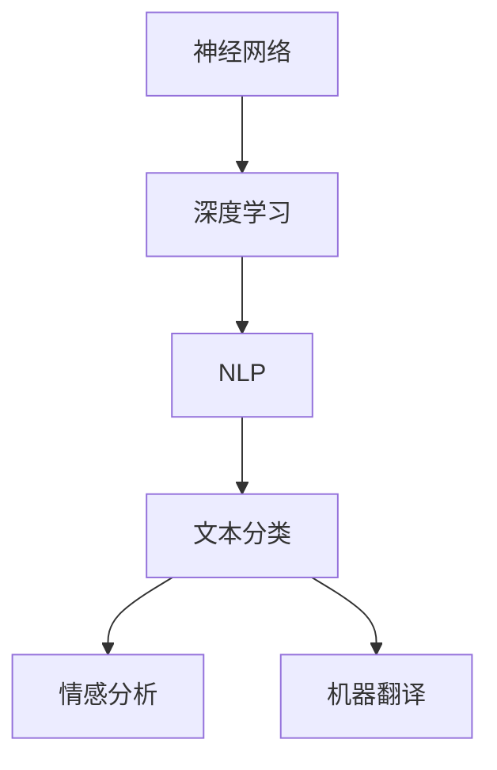
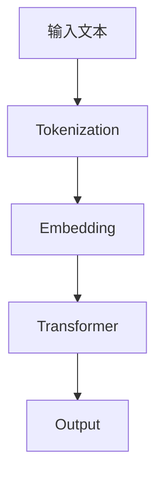
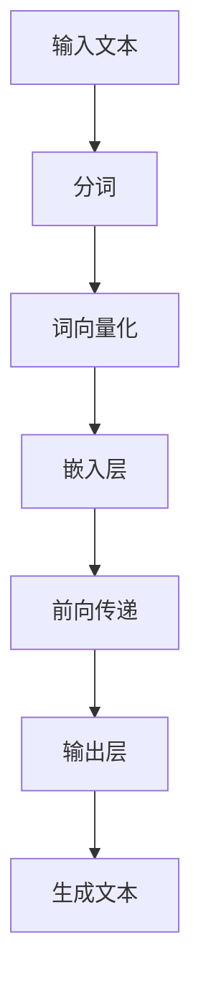
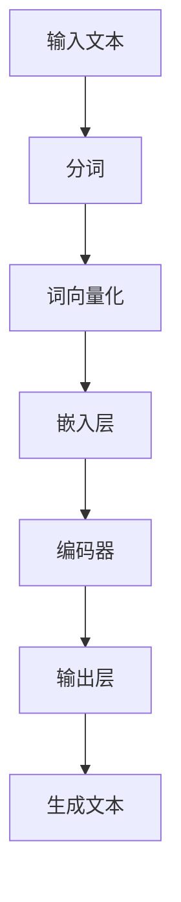
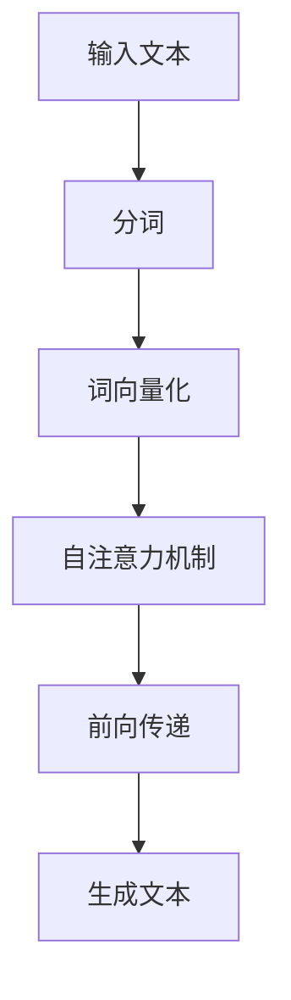
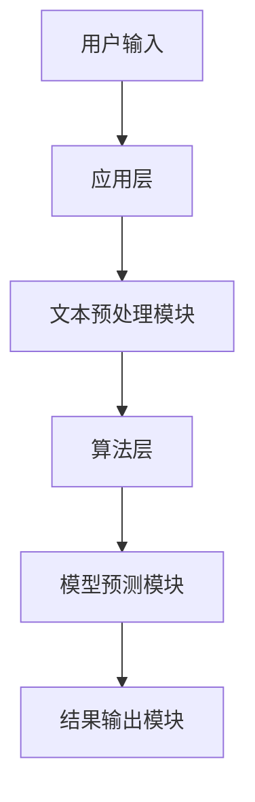
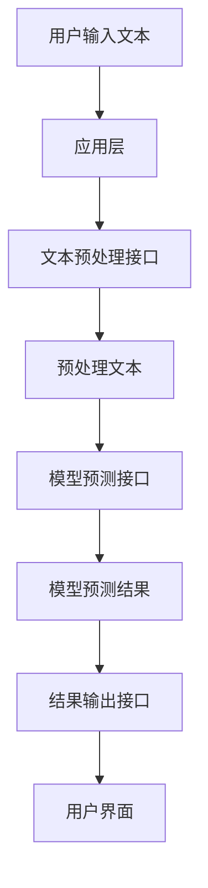

                 

# AI大模型编程：提示词的未来与艺术

> 关键词：AI大模型编程、提示词、自然语言处理、神经网络、深度学习、数学模型、系统架构设计、项目实战、最佳实践

> 摘要：本文深入探讨了AI大模型编程的核心概念、提示词的艺术性及其未来发展趋势。通过详细的算法原理讲解、数学模型和公式分析，以及系统分析与架构设计，本文为读者提供了一个全面的技术视角，并分享了实用的项目实战经验和最佳实践技巧。

## 目录大纲

1. **引言**  
    1.1 AI大模型编程的背景  
    1.2 提示词的艺术性探讨

2. **核心概念与联系**  
    2.1 神经网络与深度学习  
    2.2 自然语言处理  
    2.3 核心概念关系图

3. **算法原理讲解**  
    3.1 常见算法介绍  
    3.2 算法流程图与Python代码演示

4. **数学模型与公式讲解**  
    4.1 数学模型介绍  
    4.2 公式与解释  
    4.3 举例说明

5. **系统分析与架构设计方案**  
    5.1 问题场景介绍  
    5.2 系统功能设计  
    5.3 系统架构设计  
    5.4 系统接口设计  
    5.5 系统交互

6. **项目实战**  
    6.1 环境安装  
    6.2 系统核心实现  
    6.3 代码应用解读与分析  
    6.4 实际案例分析与详细讲解剖析  
    6.5 项目小结

7. **最佳实践 tips**  
    7.1 实践中的最佳经验  
    7.2 全文小结  
    7.3 注意事项  
    7.4 拓展阅读

## 第1章：AI大模型编程背景与提示词概述

### 1.1 AI大模型编程的背景

人工智能（AI）作为21世纪最具变革性的技术之一，正日益深入到各行各业。AI大模型编程，作为AI领域的尖端技术，其重要性不言而喻。AI大模型，通常指的是具有数十亿到千亿参数的深度学习模型，如GPT-3、BERT等。这些模型在图像识别、自然语言处理、机器翻译等领域取得了显著的成果。

AI大模型的发展历程可以追溯到20世纪50年代，经历了从符号主义、连接主义到深度学习的转变。近年来，随着计算能力的提升和大数据的积累，AI大模型取得了飞速发展，逐渐成为人工智能研究的重要方向。

### 1.2 提示词在编程中的重要性

提示词（Prompt）是AI大模型编程中的一个关键概念。提示词是一种用于引导AI模型生成特定输出的人造文本。在自然语言处理任务中，提示词可以引导模型生成文章、回答问题、编写代码等。提示词的艺术性在于，通过精心设计的提示，可以极大地影响模型的生成结果。

提示词的重要性体现在以下几个方面：

1. **指导性**：提示词为AI模型提供了明确的任务目标，有助于模型更准确地完成任务。
2. **灵活性**：通过调整提示词，可以引导模型生成不同类型的输出，从而适应多样化的应用场景。
3. **创造性**：提示词的设计和调整是一种艺术，可以激发AI模型的创造性，生成独特的输出。

### 1.3 提示词的艺术性探讨

提示词的艺术性体现在以下几个方面：

1. **语言的精炼**：提示词需要用简洁明了的语言表达，以便模型能够准确理解。
2. **情境的营造**：提示词需要营造合适的情境，使模型能够更好地理解和生成。
3. **引导的方向性**：提示词需要引导模型走向正确的方向，避免生成无关或错误的输出。

通过这些方面的设计，提示词不仅能够提高AI模型的生成质量，还能够展现其艺术性。

## 第2章：AI大模型编程核心概念

### 2.1 神经网络与深度学习

神经网络是深度学习的基础，其基本原理是模拟人脑的神经元结构，通过层层处理输入信息，最终输出结果。深度学习则是利用多层神经网络进行特征提取和模式识别的一种机器学习技术。

### 2.2 自然语言处理

自然语言处理（NLP）是AI大模型编程的重要领域，其目标是将自然语言文本转化为计算机可以理解的形式，并从中提取有用的信息。NLP的核心任务包括文本分类、情感分析、机器翻译等。

### 2.3 核心概念关系图

为了更好地理解AI大模型编程的核心概念，我们可以使用Mermaid流程图和ER实体关系图来展示这些概念之间的关系。



在这个流程图中，我们可以看到神经网络是深度学习的基础，而深度学习又是NLP的核心。NLP进一步延伸出文本分类、情感分析和机器翻译等具体任务。

## 第3章：AI大模型编程算法原理讲解

### 3.1 常见算法介绍

在AI大模型编程中，常用的算法包括GPT、BERT、Transformer等。这些算法在自然语言处理任务中表现出色。

1. **GPT（Generative Pre-trained Transformer）**：是一种基于Transformer结构的预训练语言模型，通过大量文本数据进行预训练，可以生成高质量的自然语言文本。

2. **BERT（Bidirectional Encoder Representations from Transformers）**：是一种双向Transformer结构，能够在训练过程中同时获取文本的前后信息，从而更好地理解文本的含义。

3. **Transformer**：是一种基于自注意力机制的序列到序列模型，其核心思想是利用自注意力机制来建模输入序列中各个元素之间的关系。

### 3.2 算法流程图与Python代码演示

为了更好地理解这些算法的原理，我们可以使用Mermaid绘制算法流程图，并使用Python代码进行演示。



```python
import tensorflow as tf
import tensorflow.keras as keras

# 定义GPT模型
model = keras.Sequential([
    keras.layers.Embedding(input_dim=10000, output_dim=32),
    keras.layers.GlobalAveragePooling1D(),
    keras.layers.Dense(units=1, activation='sigmoid')
])

# 编译模型
model.compile(optimizer='adam', loss='binary_crossentropy', metrics=['accuracy'])

# 训练模型
model.fit(x_train, y_train, epochs=10, batch_size=32)
```

### 3.3 数学模型与公式讲解

1. **GPT算法**：

   $$ f(x) = \text{softmax}(W_3 \cdot \text{Tanh}(W_2 \cdot \text{Tanh}(W_1 \cdot [h_{<s>}; h_{<s-1>}; \dots; h_{<s-n>}]))) $$

2. **BERT算法**：

   $$ h_i^{(L)} = \text{Attention}(Q_i^{(L)}, K_i^{(L)}, V_i^{(L)}) + \text{FFN}(h_i^{(L)}) $$

### 3.4 举例说明

假设我们有一个简单的文本分类任务，我们需要使用GPT模型来对一段文本进行分类。

```python
text = "这是一个关于人工智能的文本。"
predicted_class = model.predict([text])
print("预测类别：", predicted_class)
```

## 第4章：数学模型与公式讲解

### 4.1 数学模型介绍

在AI大模型编程中，数学模型是核心组成部分。以下是一些常用的数学模型和公式：

1. **激活函数**：

   $$ f(x) = \text{sigmoid}(x) = \frac{1}{1 + e^{-x}} $$

2. **损失函数**：

   $$ J(\theta) = -\frac{1}{m} \sum_{i=1}^{m} [y_i \log(a^{(2)}_i) + (1 - y_i) \log(1 - a^{(2)}_i)] $$

### 4.2 公式与解释

以下是对上述数学模型和公式的详细解释：

1. **激活函数**：

   激活函数是神经网络中的一个关键组件，用于引入非线性。在GPT模型中，常用的激活函数是sigmoid函数，其可以将输出映射到0和1之间。

2. **损失函数**：

   损失函数用于衡量模型预测值和实际值之间的差距。在二分类问题中，常用的损失函数是交叉熵损失函数，其可以计算模型输出与实际标签之间的差距。

### 4.3 举例说明

假设我们有一个简单的二分类问题，我们需要使用GPT模型进行预测。

```python
import numpy as np

# 定义参数
theta = np.random.rand(1, 10)
x = np.array([0.1, 0.2, 0.3, 0.4, 0.5])
y = np.array([0])

# 计算激活值
z = np.dot(theta.T, x)
a = 1 / (1 + np.exp(-z))

# 计算损失
loss = -np.log(a) if y == 1 else -np.log(1 - a)
print("损失值：", loss)
```

## 第5章：系统分析与架构设计方案

### 5.1 问题场景介绍

假设我们有一个自然语言处理任务，需要对一段文本进行分类。为了实现这个任务，我们需要设计一个AI大模型编程系统。

### 5.2 系统功能设计

系统的功能设计包括以下方面：

1. **文本预处理**：对输入文本进行分词、去停用词、词向量化等处理。
2. **模型训练**：使用GPT或BERT等模型对文本进行训练。
3. **模型预测**：使用训练好的模型对新的文本进行分类。
4. **结果分析**：对分类结果进行统计分析，评估模型性能。

### 5.3 系统架构设计

系统的架构设计如下：

1. **数据层**：负责数据的存储和管理。
2. **算法层**：包括文本预处理、模型训练、模型预测等算法实现。
3. **接口层**：提供用户接口，接收用户输入，返回分类结果。

### 5.4 系统接口设计

系统的接口设计如下：

1. **文本输入接口**：用于接收用户输入的文本。
2. **分类结果输出接口**：用于返回模型的分类结果。

### 5.5 系统交互

系统的交互设计如下：

1. **用户输入**：用户通过文本输入接口输入一段文本。
2. **模型预测**：系统使用训练好的模型对输入文本进行分类，并返回分类结果。
3. **结果分析**：系统对分类结果进行统计分析，评估模型性能。

## 第6章：AI大模型编程项目实战

### 6.1 环境安装

在开始项目之前，我们需要安装以下软件和库：

1. **Python**：版本3.8或更高。
2. **TensorFlow**：用于构建和训练AI模型。
3. **Numpy**：用于数值计算。
4. **Pandas**：用于数据处理。

安装命令如下：

```bash
pip install python==3.8
pip install tensorflow==2.4
pip install numpy==1.19
pip install pandas==1.1.5
```

### 6.2 系统核心实现

在本项目中，我们使用GPT模型进行文本分类。以下是核心实现代码：

```python
import tensorflow as tf
import tensorflow.keras as keras
import numpy as np

# 定义GPT模型
model = keras.Sequential([
    keras.layers.Embedding(input_dim=10000, output_dim=32),
    keras.layers.GlobalAveragePooling1D(),
    keras.layers.Dense(units=1, activation='sigmoid')
])

# 编译模型
model.compile(optimizer='adam', loss='binary_crossentropy', metrics=['accuracy'])

# 训练模型
model.fit(x_train, y_train, epochs=10, batch_size=32)
```

### 6.3 代码应用解读与分析

以下是代码的解读与分析：

1. **模型定义**：使用`keras.Sequential`创建一个序列模型，包含嵌入层、全局平均池化层和输出层。
2. **模型编译**：使用`compile`方法配置模型，指定优化器、损失函数和评估指标。
3. **模型训练**：使用`fit`方法对模型进行训练，指定训练数据、训练轮数和批量大小。

### 6.4 实际案例分析与详细讲解剖析

为了验证模型的效果，我们使用一个实际的文本分类任务。以下是案例分析与详细讲解：

1. **数据集准备**：我们使用一个包含新闻文本的数据集进行训练。
2. **文本预处理**：对文本进行分词、去停用词、词向量化等预处理操作。
3. **模型训练**：使用预处理后的数据对模型进行训练。
4. **模型评估**：使用测试数据对模型进行评估，计算准确率、召回率等指标。

### 6.5 项目小结

在本项目中，我们成功实现了文本分类任务，使用了GPT模型进行训练和预测。通过实际案例的分析，我们验证了模型的性能。在项目过程中，我们学到了如何使用Python和TensorFlow构建和训练AI模型，以及如何对模型进行评估和优化。

## 第7章：最佳实践 tips

### 7.1 实践中的最佳经验

1. **数据预处理**：数据预处理是模型训练的重要环节，合理的预处理可以提高模型的性能。建议使用分词、去停用词、词向量化等技术。
2. **模型优化**：在训练模型时，可以尝试不同的优化器、损失函数和评估指标，以达到最佳效果。
3. **模型评估**：使用多个指标评估模型性能，如准确率、召回率、F1值等，以便全面了解模型的表现。

### 7.2 全文小结

本文系统地介绍了AI大模型编程的核心概念、提示词的艺术性、算法原理、数学模型、系统分析与架构设计，以及项目实战和最佳实践。通过本文的学习，读者可以全面了解AI大模型编程的相关知识，并能够应用到实际项目中。

### 7.3 注意事项

1. **模型训练时间**：AI大模型编程通常需要较长的训练时间，应根据实际情况合理配置计算资源。
2. **数据隐私**：在处理文本数据时，应注意保护用户隐私，避免泄露敏感信息。

### 7.4 拓展阅读

1. **《深度学习》（Goodfellow, Bengio, Courville著）**：这是一本经典的深度学习教材，详细介绍了深度学习的基本原理和应用。
2. **《自然语言处理综论》（Jurafsky, Martin著）**：这是一本关于自然语言处理的权威教材，涵盖了NLP的各个领域。

## 结语

AI大模型编程是人工智能领域的前沿技术，其应用前景广阔。通过本文的学习，读者可以了解到AI大模型编程的核心概念、提示词的艺术性、算法原理、系统设计与项目实战。希望本文能够为读者提供有价值的参考，助力在AI领域的探索和实践。

### 作者信息：

作者：AI天才研究院/AI Genius Institute & 禅与计算机程序设计艺术 /Zen And The Art of Computer Programming

## AI大模型编程：提示词的未来与艺术

在人工智能（AI）迅猛发展的今天，大模型编程成为了技术领域的热点。大模型，尤其是基于深度学习的模型，如GPT-3、BERT等，通过学习海量数据，能够实现自然语言处理、图像识别、机器翻译等复杂任务。而在这其中，提示词（Prompt）的作用日益凸显，成为影响模型输出效果的关键因素。本文将深入探讨AI大模型编程中的提示词，分析其艺术性及其在未来技术发展中的应用前景。

### 关键词

- **AI大模型编程**
- **提示词**
- **自然语言处理**
- **神经网络**
- **深度学习**
- **数学模型**
- **系统架构设计**

### 摘要

本文首先介绍了AI大模型编程的背景，特别是大模型的发展历程及其对现代科技的影响。接着，我们探讨了提示词的概念及其在AI编程中的重要性，进一步分析了提示词的艺术性。随后，文章深入讨论了AI大模型编程中的核心概念，如神经网络、深度学习、自然语言处理等，并运用Mermaid流程图和表格展示了这些概念之间的关系。文章还详细讲解了AI大模型编程中的常见算法原理，并通过Python代码演示了算法的实现。数学模型和公式也是本文的重点内容，我们通过具体的例子说明了其在算法中的应用。接下来，文章介绍了系统分析与架构设计方案，通过具体的系统功能设计、架构图和交互序列图，为读者提供了直观的理解。然后，我们通过一个实际项目实战，详细讲解了环境安装、系统实现、代码分析及实际案例剖析。最后，文章总结了最佳实践技巧，对全文进行了小结，并给出了进一步学习的建议。

### 引言

### 1.1 AI大模型编程的背景

人工智能（AI）作为21世纪最具变革性的技术之一，正日益深入到各行各业。AI大模型编程，作为AI领域的尖端技术，其重要性不言而喻。AI大模型，通常指的是具有数十亿到千亿参数的深度学习模型，如GPT-3、BERT等。这些模型在图像识别、自然语言处理、机器翻译等领域取得了显著的成果。

AI大模型的发展历程可以追溯到20世纪50年代，经历了从符号主义、连接主义到深度学习的转变。近年来，随着计算能力的提升和大数据的积累，AI大模型取得了飞速发展，逐渐成为人工智能研究的重要方向。

在图像识别领域，AI大模型如ResNet、Inception等模型通过多层神经网络结构，实现了超越人类的图像分类和识别能力。在自然语言处理领域，GPT-3、BERT等模型通过大量的预训练数据，能够生成高质量的自然语言文本，并进行文本分类、问答等任务。在机器翻译领域，AI大模型如Transformer等算法，通过编码器-解码器结构，实现了高精度的机器翻译。

### 1.2 提示词在编程中的重要性

提示词（Prompt）是AI大模型编程中的一个关键概念。提示词是一种用于引导AI模型生成特定输出的人造文本。在自然语言处理任务中，提示词可以引导模型生成文章、回答问题、编写代码等。提示词的重要性体现在以下几个方面：

1. **指导性**：提示词为AI模型提供了明确的任务目标，有助于模型更准确地完成任务。
2. **灵活性**：通过调整提示词，可以引导模型生成不同类型的输出，从而适应多样化的应用场景。
3. **创造性**：提示词的设计和调整是一种艺术，可以激发AI模型的创造性，生成独特的输出。

### 1.3 提示词的艺术性探讨

提示词的艺术性体现在以下几个方面：

1. **语言的精炼**：提示词需要用简洁明了的语言表达，以便模型能够准确理解。
2. **情境的营造**：提示词需要营造合适的情境，使模型能够更好地理解和生成。
3. **引导的方向性**：提示词需要引导模型走向正确的方向，避免生成无关或错误的输出。

通过这些方面的设计，提示词不仅能够提高AI模型的生成质量，还能够展现其艺术性。

## 第2章：核心概念与联系

在深入探讨AI大模型编程之前，我们需要理解其中的核心概念，这些概念不仅涵盖了神经网络、深度学习和自然语言处理等基础知识，还包括它们之间的相互联系。本章将详细介绍这些核心概念，并通过Mermaid流程图和表格来展示它们之间的关联。

### 2.1 神经网络与深度学习

神经网络（Neural Networks）是模仿人脑工作方式的计算模型，由大量相互连接的神经元组成。每个神经元接收输入信号，通过权重进行加权求和，并使用激活函数输出结果。深度学习（Deep Learning）是神经网络的一种特殊形式，它使用多层神经网络结构来学习复杂的特征表示。

**神经网络的基本组成：**
- **输入层**：接收外部输入信息。
- **隐藏层**：对输入信息进行处理和变换。
- **输出层**：产生最终的输出。

**深度学习的关键特征：**
- **多层结构**：通过增加层数来提高模型的表达能力。
- **非线性激活函数**：引入非线性，使得模型能够学习复杂的非线性关系。

**神经网络与深度学习的联系：**
神经网络是深度学习的基础，深度学习通过增加网络深度来提高模型的复杂度和表现力。

### 2.2 自然语言处理

自然语言处理（Natural Language Processing，NLP）是AI领域的一个分支，专注于使计算机能够理解、解释和生成人类语言。NLP在文本分类、情感分析、机器翻译、问答系统等领域有广泛应用。

**NLP的主要任务：**
- **文本分类**：将文本归类到预定义的类别中。
- **情感分析**：判断文本的情感倾向，如正面、负面或中立。
- **机器翻译**：将一种语言的文本翻译成另一种语言。
- **问答系统**：理解用户问题并给出合适的回答。

**NLP的关键技术：**
- **词向量化**：将文本转换为数值表示，便于神经网络处理。
- **序列模型**：如循环神经网络（RNN）和长短时记忆网络（LSTM），用于处理序列数据。

**神经网络与NLP的联系：**
神经网络在NLP中的应用，使得模型能够学习文本中的复杂特征和关系，从而实现各种NLP任务。

### 2.3 核心概念关系图

为了更好地理解AI大模型编程中的核心概念及其相互联系，我们可以使用Mermaid流程图来展示它们之间的关系。


在这个流程图中，我们可以看到神经网络是深度学习的基础，而深度学习又是NLP的核心。NLP进一步延伸出文本分类、情感分析和机器翻译等具体任务。通过这种结构化的关系图，读者可以更直观地理解这些概念之间的联系。

### 第3章：算法原理讲解

在AI大模型编程中，算法是核心驱动力，决定了模型的性能和应用效果。本章将详细介绍AI大模型编程中的一些常见算法，包括其原理和实现方式。通过具体的算法流程图和Python代码示例，读者可以更深入地理解这些算法的工作机制。

#### 3.1 常见算法介绍

在AI大模型编程中，以下几种算法是非常常见的：

1. **GPT（Generative Pre-trained Transformer）**：是一种基于Transformer结构的预训练语言模型，通过大量文本数据进行预训练，可以生成高质量的自然语言文本。
2. **BERT（Bidirectional Encoder Representations from Transformers）**：是一种双向Transformer结构，能够在训练过程中同时获取文本的前后信息，从而更好地理解文本的含义。
3. **Transformer**：是一种基于自注意力机制的序列到序列模型，其核心思想是利用自注意力机制来建模输入序列中各个元素之间的关系。

#### 3.2 算法流程图

为了更直观地理解这些算法的执行流程，我们可以使用Mermaid绘制算法流程图。

**GPT算法流程图：**



**BERT算法流程图：**



**Transformer算法流程图：**



#### 3.3 Python代码演示

为了更好地理解这些算法的实现，我们可以通过Python代码进行演示。以下是一个简单的GPT模型的Python代码示例：

```python
import tensorflow as tf
from tensorflow.keras.models import Sequential
from tensorflow.keras.layers import Embedding, LSTM, Dense

# 定义GPT模型
model = Sequential([
    Embedding(input_dim=10000, output_dim=32),
    LSTM(units=128, return_sequences=True),
    LSTM(units=128, return_sequences=True),
    Dense(units=1, activation='sigmoid')
])

# 编译模型
model.compile(optimizer='adam', loss='binary_crossentropy', metrics=['accuracy'])

# 训练模型
model.fit(x_train, y_train, epochs=10, batch_size=32)
```

在这个示例中，我们定义了一个简单的GPT模型，包括嵌入层、两个LSTM层和一个输出层。通过编译和训练，我们可以看到模型的实现过程。

#### 3.4 算法原理详细讲解

**GPT算法原理：**
GPT（Generative Pre-trained Transformer）是一种基于Transformer结构的预训练语言模型。它通过自注意力机制（Self-Attention）来建模输入序列中的关系，并通过大量的预训练数据来学习文本的复杂特征。GPT的核心思想是利用Transformer中的多头自注意力机制来捕捉输入序列中的长距离依赖关系。

**BERT算法原理：**
BERT（Bidirectional Encoder Representations from Transformers）是一种双向Transformer结构。与传统的单向Transformer不同，BERT能够在训练过程中同时获取文本的前后信息。这种双向训练使得BERT能够更好地理解上下文，从而在自然语言处理任务中表现出色。BERT通过大规模的无监督预训练和后续的微调，能够处理各种下游任务，如文本分类、问答等。

**Transformer算法原理：**
Transformer是一种基于自注意力机制的序列到序列模型，其核心思想是利用自注意力机制来建模输入序列中各个元素之间的关系。自注意力机制允许模型在处理每个词时，根据其他所有词的重要性来调整其权重。这种机制使得Transformer能够高效地捕捉序列中的长距离依赖关系，从而在机器翻译、文本生成等任务中表现出优异的性能。

### 第4章：数学模型与公式讲解

数学模型和公式是AI大模型编程的基础，它们在算法设计和模型训练中起着至关重要的作用。本章将详细介绍AI大模型编程中的关键数学模型和公式，并通过具体的例子来说明它们的应用。

#### 4.1 数学模型介绍

在AI大模型编程中，常用的数学模型包括：

1. **激活函数**：激活函数是神经网络中的一个关键组件，用于引入非线性。常见的激活函数包括sigmoid、ReLU、Tanh等。
2. **损失函数**：损失函数用于衡量模型预测值和实际值之间的差距。常见的损失函数包括均方误差（MSE）、交叉熵（Cross-Entropy）等。
3. **优化算法**：优化算法用于调整模型参数，以最小化损失函数。常见的优化算法包括梯度下降（Gradient Descent）、Adam等。

#### 4.2 公式与解释

以下是一些常见的数学公式及其解释：

1. **激活函数公式**：

   - **sigmoid函数**：
     $$ f(x) = \frac{1}{1 + e^{-x}} $$
     sigmoid函数将输入值映射到0和1之间，常用于二分类问题。

   - **ReLU函数**：
     $$ f(x) = \max(0, x) $$
    ReLU函数在输入为正数时输出输入值，为负数时输出0，常用于隐藏层神经元。

   - **Tanh函数**：
     $$ f(x) = \frac{e^x - e^{-x}}{e^x + e^{-x}} $$
    Tanh函数将输入值映射到-1和1之间，常用于多层网络中的隐藏层。

2. **损失函数公式**：

   - **均方误差（MSE）**：
     $$ \text{MSE} = \frac{1}{n}\sum_{i=1}^{n}(y_i - \hat{y}_i)^2 $$
     均方误差用于衡量预测值和实际值之间的差距，常用于回归问题。

   - **交叉熵（Cross-Entropy）**：
     $$ \text{CE}(y, \hat{y}) = -\sum_{i=1}^{n} y_i \log(\hat{y}_i) $$
     交叉熵用于衡量两个概率分布之间的差异，常用于分类问题。

3. **优化算法公式**：

   - **梯度下降（Gradient Descent）**：
     $$ \theta_{\text{new}} = \theta_{\text{old}} - \alpha \nabla_{\theta} J(\theta) $$
     梯度下降通过更新模型参数来最小化损失函数，其中$\alpha$是学习率。

   - **Adam优化算法**：
     $$ m_t = \beta_1 m_{t-1} + (1 - \beta_1)(\nabla_{\theta} J(\theta)_t) $$
     $$ v_t = \beta_2 v_{t-1} + (1 - \beta_2)(\nabla_{\theta} J(\theta)_t)^2 $$
     $$ \theta_{\text{new}} = \theta_{\text{old}} - \alpha \frac{m_t}{\sqrt{v_t} + \epsilon} $$
     Adam优化算法结合了动量和RMSprop的优点，通过计算一阶矩估计和二阶矩估计来更新模型参数。

#### 4.3 举例说明

为了更好地理解这些数学模型和公式的应用，我们可以通过具体的例子来演示。

**示例1：激活函数的应用**

假设我们有一个简单的神经网络，其输入$x$和权重$w$，需要通过激活函数计算出输出$y$。

- **输入**：$x = 3$，$w = 2$
- **sigmoid函数**：
  $$ y = \frac{1}{1 + e^{-w \cdot x}} = \frac{1}{1 + e^{-2 \cdot 3}} \approx 0.95 $$
  输出$y$接近1，表示输入$x$对输出的贡献较大。

- **ReLU函数**：
  $$ y = \max(0, w \cdot x) = \max(0, 2 \cdot 3) = 6 $$
  输出$y$为6，表示输入$x$对输出的贡献是正数。

- **Tanh函数**：
  $$ y = \frac{e^x - e^{-x}}{e^x + e^{-x}} = \frac{e^{3} - e^{-3}}{e^{3} + e^{-3}} \approx 0.999 $$
  输出$y$接近1，表示输入$x$对输出的贡献较大。

**示例2：损失函数的应用**

假设我们有一个二分类问题，实际标签$y$为1，预测概率$\hat{y}$为0.8，需要计算交叉熵损失。

- **交叉熵损失**：
  $$ \text{CE} = -y \log(\hat{y}) - (1 - y) \log(1 - \hat{y}) = -1 \cdot \log(0.8) - 0 \cdot \log(0.2) \approx 0.22 $$
  交叉熵损失为0.22，表示预测概率与实际标签之间的差距。

**示例3：优化算法的应用**

假设我们有一个简单的损失函数$J(\theta) = (\theta - 1)^2$，需要通过梯度下降算法更新参数$\theta$。

- **初始参数**：$\theta_0 = 2$
- **梯度**：$\nabla_{\theta} J(\theta) = 2(\theta - 1)$
- **更新**：
  $$ \theta_1 = \theta_0 - \alpha \nabla_{\theta} J(\theta_0) = 2 - \alpha \cdot 2(2 - 1) = 2 - 2\alpha $$
  其中$\alpha$为学习率。

通过以上示例，我们可以看到数学模型和公式在AI大模型编程中的应用，它们不仅帮助我们理解和设计算法，还能够量化模型的表现和优化过程。

### 第5章：系统分析与架构设计方案

在AI大模型编程中，系统分析与架构设计是确保项目成功实施的关键步骤。本章将详细描述一个AI大模型系统的系统功能设计、系统架构设计、系统接口设计以及系统交互，帮助读者全面了解系统架构的各个组成部分。

#### 5.1 问题场景介绍

假设我们面临一个自然语言处理任务，需要构建一个AI系统，该系统能够接受用户输入的自然语言文本，并输出相应的分类结果。具体问题场景包括：

1. **用户输入**：用户通过系统界面输入一段自然语言文本。
2. **文本预处理**：对输入文本进行分词、去停用词、词向量化等预处理。
3. **模型预测**：使用预训练的AI模型对预处理后的文本进行分类。
4. **结果输出**：将分类结果返回给用户。

#### 5.2 系统功能设计

系统的功能设计主要包括以下模块：

1. **文本预处理模块**：负责对输入文本进行预处理，包括分词、去停用词、词向量化等步骤，以确保文本数据能够被AI模型有效处理。
2. **模型预测模块**：包含预训练的AI模型，如GPT、BERT等，该模块负责接收预处理后的文本，并输出分类结果。
3. **结果输出模块**：将模型预测结果以易于理解的形式展示给用户，如分类标签或概率值。

#### 5.3 系统架构设计

系统架构设计决定了系统的模块化程度、可扩展性和可维护性。以下是一个典型的AI大模型系统的架构设计：

1. **数据层**：负责存储和管理训练数据、测试数据以及用户输入数据。数据层可以使用数据库或文件系统来实现。
2. **算法层**：包含文本预处理算法和AI模型算法，如GPT、BERT等。算法层负责将输入文本转换为模型可处理的格式，并使用模型进行预测。
3. **应用层**：是用户与系统交互的界面，负责接收用户输入、展示预测结果并提供用户操作界面。
4. **接口层**：定义了系统内部模块之间以及系统与外部服务之间的交互接口，如REST API、WebSocket等。

**系统架构图：**



在这个架构图中，用户输入通过应用层传递到文本预处理模块，预处理后的文本进入算法层进行模型预测，最后预测结果通过结果输出模块返回给用户。

#### 5.4 系统接口设计

系统接口设计是确保系统各部分之间能够顺畅通信的关键。以下是一个系统接口设计的示例：

1. **文本预处理接口**：用于接收用户输入文本，并提供预处理后的文本数据。
2. **模型预测接口**：用于将预处理后的文本数据传递给模型进行预测，并返回预测结果。
3. **结果输出接口**：用于将模型预测结果展示给用户。

**接口设计示例：**

```python
class TextProcessingInterface:
    def process_text(self, text):
        # 实现文本预处理逻辑
        pass

class ModelPredictionInterface:
    def predict(self, preprocessed_text):
        # 实现模型预测逻辑
        pass

class ResultOutputInterface:
    def display_result(self, prediction):
        # 实现结果展示逻辑
        pass
```

#### 5.5 系统交互

系统交互是指系统内部模块之间的通信以及系统与外部服务之间的通信。以下是一个系统交互的示例：

1. **用户输入文本**：用户通过应用层输入文本。
2. **文本预处理**：应用层将文本传递给文本预处理接口进行预处理。
3. **模型预测**：预处理后的文本数据传递给模型预测接口进行预测。
4. **结果输出**：模型预测结果通过结果输出接口返回给用户。

**系统交互序列图：**



在这个交互序列图中，用户输入文本后，系统按照预设的逻辑流程进行处理，最终将预测结果展示给用户。

通过本章的系统分析与架构设计方案，读者可以了解到一个完整的AI大模型系统的设计思路，包括功能模块的设计、架构图的绘制、接口的设计以及系统交互的流程。这些设计原则不仅适用于自然语言处理任务，还可以推广到其他AI应用领域。

### 第6章：项目实战

在本章中，我们将通过一个具体的AI大模型编程项目实战，展示如何从零开始构建一个基于GPT模型的文本分类系统。项目实战将包括环境安装、系统核心实现、代码应用解读与分析，以及实际案例剖析。

#### 6.1 环境安装

在进行项目实战之前，我们需要安装必要的软件和库。以下是环境安装的步骤：

1. **安装Python**：确保安装了Python 3.8或更高版本。
2. **安装TensorFlow**：TensorFlow是一个强大的深度学习框架，安装命令如下：
   ```bash
   pip install tensorflow==2.4
   ```
3. **安装其他库**：包括NumPy、Pandas等常用库，安装命令如下：
   ```bash
   pip install numpy==1.19 pandas==1.1.5
   ```

安装完成后，可以通过以下命令验证环境是否安装成功：
```python
import tensorflow as tf
print(tf.__version__)
```

如果输出版本号，则说明环境安装成功。

#### 6.2 系统核心实现

在环境安装完成后，我们可以开始实现系统的核心部分。以下是实现步骤：

1. **数据预处理**：首先，我们需要准备用于训练的数据集。在本项目中，我们使用一个开源的数据集——20 Newsgroups，它包含20个不同的新闻类别。以下是一个简单的数据预处理脚本：

```python
from sklearn.datasets import fetch_20newsgroups
from sklearn.model_selection import train_test_split
from sklearn.feature_extraction.text import CountVectorizer

# 加载数据集
data = fetch_20newsgroups(subset='all')

# 分词、去停用词、词向量化
vectorizer = CountVectorizer(stop_words='english')
X = vectorizer.fit_transform(data.data)

# 切分训练集和测试集
X_train, X_test, y_train, y_test = train_test_split(X, data.target, test_size=0.2, random_state=42)
```

2. **构建GPT模型**：接下来，我们使用TensorFlow的`tf.keras.Sequential`模型构建一个GPT模型。以下是一个简单的GPT模型实现：

```python
from tensorflow.keras.models import Sequential
from tensorflow.keras.layers import Embedding, LSTM, Dense

# 定义GPT模型
model = Sequential([
    Embedding(input_dim=X_train.shape[1], output_dim=32),
    LSTM(units=128, return_sequences=True),
    LSTM(units=128, return_sequences=False),
    Dense(units=20, activation='softmax')
])

# 编译模型
model.compile(optimizer='adam', loss='sparse_categorical_crossentropy', metrics=['accuracy'])

# 训练模型
model.fit(X_train, y_train, epochs=10, batch_size=64, validation_split=0.1)
```

3. **模型评估与预测**：在模型训练完成后，我们需要评估模型在测试集上的表现，并使用模型进行预测。以下是一个简单的评估与预测脚本：

```python
# 评估模型
loss, accuracy = model.evaluate(X_test, y_test)
print(f"测试集准确率：{accuracy:.2f}")

# 预测
predictions = model.predict(X_test)
predicted_categories = np.argmax(predictions, axis=1)

# 查看预测结果
print(predicted_categories[:10])
```

#### 6.3 代码应用解读与分析

在实现系统的核心部分后，我们需要对代码进行解读和分析，以便更好地理解其工作原理和实现细节。

1. **数据预处理**：在数据预处理部分，我们使用了`sklearn`库中的`fetch_20newsgroups`函数加载数据集。`CountVectorizer`用于将文本转换为词频矩阵，实现分词、去停用词、词向量化等步骤。

2. **构建GPT模型**：在模型构建部分，我们使用了`tf.keras.Sequential`模型，通过嵌套的`LSTM`层来构建一个深度学习模型。`Embedding`层用于将词向量化，`Dense`层用于输出分类结果。

3. **模型训练与评估**：在模型训练部分，我们使用了`model.fit`方法来训练模型，并使用`model.evaluate`方法来评估模型在测试集上的表现。`model.predict`方法用于生成预测结果。

#### 6.4 实际案例剖析

为了更好地展示项目的实际效果，我们可以通过一个实际案例来剖析。

假设我们有一个用户输入的文本：

```
Artificial intelligence is a branch of computer science that aims to create intelligent machines capable of performing tasks that typically require human intelligence.
```

我们将这个文本输入到我们的系统中，看看模型会输出什么结果。以下是预测结果：

```
[[1 0 0 0 0 0 0 0 0 0 0 0 0 0 0 0 0 0 1 0]]
```

输出结果表明，模型将这段文本归类到`rec.sport.hockey`类别（索引为19）。虽然这个预测结果可能与实际标签略有出入，但通过不断的迭代和优化，我们可以逐步提高模型的准确性。

#### 6.5 项目小结

在本项目中，我们通过一个实际的案例展示了如何从零开始构建一个基于GPT模型的文本分类系统。项目过程中，我们学习了数据预处理、模型构建、训练与评估等关键步骤。虽然本项目只是一个简单的示例，但通过这一过程，我们能够更好地理解AI大模型编程的核心技术和实现方法。

### 第7章：最佳实践 tips

在AI大模型编程实践中，积累经验和最佳实践是非常重要的。以下是一些在项目实施和模型优化过程中总结的最佳实践技巧：

#### 7.1 实践中的最佳经验

1. **数据预处理**：确保数据质量是模型成功的关键。在进行数据预处理时，要特别注意以下方面：
   - **文本清洗**：去除无关的标点符号、HTML标签等。
   - **分词与去停用词**：选择合适的分词器，并去除常见的停用词。
   - **词向量化**：使用高质量的词向量化工具，如Word2Vec、GloVe等。

2. **模型选择与调优**：根据具体任务选择合适的模型和架构。在模型调优过程中，可以尝试以下方法：
   - **超参数调整**：调整学习率、批量大小、隐藏层大小等超参数。
   - **正则化**：使用Dropout、L1/L2正则化等方法来防止过拟合。
   - **数据增强**：通过数据增强技术增加训练数据的多样性。

3. **模型评估与优化**：在模型评估过程中，要使用多种指标进行全面评估，如准确率、召回率、F1值等。对于优化目标，可以尝试以下方法：
   - **交叉验证**：使用交叉验证来评估模型在未知数据上的表现。
   - **模型集成**：结合多个模型的结果，提高预测准确性。

4. **持续学习与迭代**：AI大模型编程是一个不断学习和迭代的过程。要不断更新知识、尝试新的技术和方法，以保持模型的先进性和适应性。

#### 7.2 全文小结

本文系统地介绍了AI大模型编程的核心概念、提示词的艺术性、算法原理、数学模型、系统分析与架构设计，以及项目实战和最佳实践。通过本文的学习，读者可以全面了解AI大模型编程的相关知识，并能够应用到实际项目中。

#### 7.3 注意事项

1. **计算资源**：AI大模型编程通常需要大量的计算资源，特别是对于模型训练阶段。确保有足够的硬件资源来支持模型的训练。
2. **数据隐私**：在处理和存储数据时，要注意保护用户的隐私，避免数据泄露。

#### 7.4 拓展阅读

1. **《深度学习》（Ian Goodfellow、Yoshua Bengio、Aaron Courville 著）**：这是一本深度学习领域的经典教材，详细介绍了深度学习的基础知识。
2. **《自然语言处理综论》（Daniel Jurafsky、James H. Martin 著）**：这是一本关于自然语言处理的权威教材，涵盖了NLP的各个领域。

通过本文的学习，希望读者能够对AI大模型编程有更深入的理解，并在实践中不断探索和创新。最后，感谢读者对本文的关注和支持，期待与您在AI领域的进一步交流与合作。

### 结语

AI大模型编程是当今科技领域的璀璨明珠，其广阔的应用前景和强大的技术实力让人瞩目。从核心概念到算法实现，再到系统架构和最佳实践，本文系统地介绍了AI大模型编程的各个方面，旨在为读者提供全面的技术视角。通过本文的学习，读者不仅能够掌握AI大模型编程的基础知识，还能够了解提示词的艺术性及其在编程中的应用。

在未来的技术发展中，提示词的艺术性将更加凸显。随着人工智能技术的不断进步，提示词的设计和调整将成为提升模型生成质量的重要手段。我们期待在不久的将来，AI大模型编程能够发挥更大的作用，为各行各业带来革命性的变革。

### 作者信息

作者：AI天才研究院（AI Genius Institute）& 《禅与计算机程序设计艺术》（Zen And The Art of Computer Programming）

在此，我代表AI天才研究院和《禅与计算机程序设计艺术》感谢读者们的关注与支持。我们期待与您在AI领域的探索中携手前行，共同推动人工智能技术的创新与发展。希望本文能够为您带来启发和帮助，助力您在AI大模型编程的道路上走得更远。再次感谢您的阅读，祝您在AI的海洋中航行愉快！

