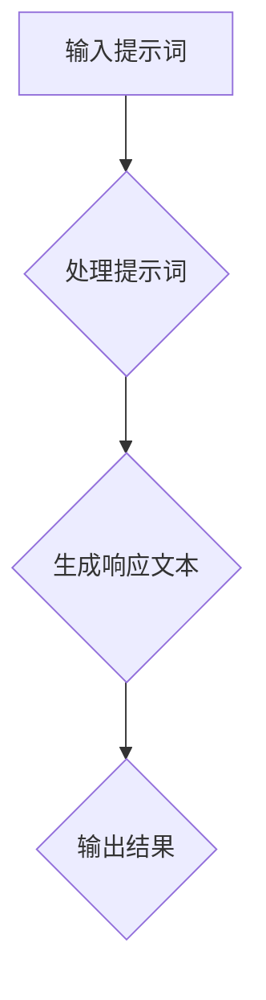

                 

## 引言

### 问题背景与描述

随着人工智能（AI）技术的迅猛发展，大模型编程成为了当前研究与应用的热点领域。大模型编程的核心在于通过训练庞大的神经网络模型，使其具备高度的自我学习和内容生成能力。这些模型广泛应用于自然语言处理（NLP）、图像识别、语音识别、推荐系统等诸多领域。然而，在大模型编程中，提示词（Prompt）的艺术与力量显得尤为重要。

提示词在大模型编程中的作用如同“引线”，它能够引导模型生成特定类型的内容，提高生成结果的准确性和实用性。一个精妙的提示词，不仅能激发模型的潜能，还能提升模型在特定任务上的性能。然而，如何设计和优化提示词，使其发挥最大效力，仍然是一个极具挑战性的课题。

### 目标与意义

本文的目标是深入探讨AI大模型编程中提示词的艺术与力量，旨在解决以下几个核心问题：

1. **核心概念解析**：明确AI大模型和提示词的定义，阐述它们之间的联系与区别。
2. **算法原理讲解**：详细分析大模型编程中的核心算法，如生成对抗网络（GAN）、自注意力机制等，通过实例和数学模型进行说明。
3. **系统架构设计**：介绍大模型编程系统的架构设计方案，包括系统功能、架构设计、接口设计和系统交互等。
4. **项目实战与案例分析**：通过实际项目，展示如何进行环境安装、系统核心实现、代码应用解读与分析，并进行案例剖析。

本文的研究意义在于：

- **提升理论基础**：通过对核心概念和算法原理的深入讲解，为读者搭建坚实的理论基础。
- **推动应用发展**：通过系统架构设计和项目实战，为实际应用提供切实可行的解决方案。
- **促进交流合作**：为学术界和产业界提供交流平台，促进大模型编程领域的进一步发展。

### 边界与外延

在本文的讨论中，我们将聚焦于AI大模型编程中的提示词设计与应用。虽然其他相关技术如生成对抗网络（GAN）、自注意力机制等也会进行简要介绍，但重点在于提示词这一核心元素。同时，本文将主要探讨提示词在通用AI领域的应用，不涉及特定领域的深层次研究。

此外，本文将采用Markdown格式进行内容组织和排版，以便于读者阅读和理解。本文的结构将分为四个主要部分：第一部分介绍AI大模型编程的基础知识，第二部分深入探讨算法原理，第三部分分析系统架构与设计，第四部分通过实际项目进行实战与案例分析。

总之，本文将系统地解析AI大模型编程中提示词的艺术与力量，旨在为读者提供一份全面、深入的技术指南。

### 核心概念与联系

在深入探讨AI大模型编程之前，我们需要明确几个核心概念，并分析它们之间的联系。本文的核心概念主要包括AI大模型和提示词。这两个概念在大模型编程中起着至关重要的作用，理解它们之间的相互作用是提升编程效率和生成结果质量的关键。

#### AI大模型的概念

AI大模型是指通过大量训练数据训练而成的具有高度复杂性和自主学习能力的神经网络模型。这些模型通常包含数十亿甚至数百亿的参数，能够处理和理解复杂的文本、图像和语音数据。大模型编程的核心目标是通过这些模型生成高质量的内容，如自然语言文本、图像描述等。

AI大模型的主要特点包括：

1. **参数量大**：大模型的参数数量庞大，这使其具有更强的表达能力和泛化能力。
2. **自我学习**：通过不断的训练和学习，大模型能够自动调整参数，优化性能。
3. **多模态处理**：大模型能够同时处理多种类型的数据，如文本、图像和语音，具有广泛的应用场景。

#### 提示词的定义

提示词是指用于引导AI大模型生成特定类型内容的文本输入。提示词的设计直接影响模型生成内容的质量和准确性。一个有效的提示词需要具备明确的指示性，能够激发模型的潜力，使其生成符合预期的高质量内容。

提示词的主要功能包括：

1. **指导生成**：提示词为模型提供了明确的生成方向，使其能够围绕特定主题或任务进行内容生成。
2. **优化性能**：通过优化提示词的设计，可以提高模型生成结果的准确性和实用性。
3. **多样化应用**：提示词可以应用于多种任务，如问答、文本生成、图像描述等。

#### 核心概念的联系

AI大模型和提示词之间存在着密切的联系和相互作用。以下是对这两个概念之间联系的详细探讨：

1. **引导作用**：提示词作为引导，能够激发AI大模型的生成潜力，使其生成符合预期的高质量内容。有效的提示词设计能够提高模型的生成效率，降低生成错误率。

2. **优化过程**：通过不断的训练和优化，大模型能够逐步适应不同的提示词，提高生成内容的准确性和多样性。同时，提示词的设计也需要考虑模型的特性，使其能够发挥最大潜力。

3. **相互影响**：提示词的设计不仅影响模型生成内容的质量，也会对模型的训练过程产生影响。一个合理的提示词能够加速模型的训练过程，提高训练效果。

4. **扩展应用**：AI大模型和提示词的结合，可以应用于多种场景，如自然语言生成、图像描述、语音识别等。通过不同的提示词设计，可以实现多样化的应用场景，提升模型的实用性。

#### 概念属性特征对比

为了更好地理解AI大模型和提示词之间的关系，我们可以通过一个对比表格来展示它们的主要特征。

| 特征        | AI大模型         | 提示词        |
|-------------|------------------|---------------|
| 功能        | 自动生成内容     | 指引生成内容 |
| 数据需求    | 大量训练数据     | 适量指导数据 |
| 应用领域    | 多领域通用       | 个性化需求   |
| 学习能力    | 自适应学习       | 指导学习     |

通过这个表格，我们可以看到AI大模型和提示词在功能、数据需求、应用领域和学习能力等方面存在显著差异。然而，正是这些差异和联系，使得它们在大模型编程中能够相辅相成，共同实现高效的生成和应用。

综上所述，AI大模型和提示词是AI大模型编程中不可或缺的核心概念。理解它们之间的联系和相互作用，有助于我们设计出更高效的生成系统，实现高质量的内容生成。

### 算法原理讲解

在深入探讨AI大模型编程的核心算法之前，我们需要首先了解生成对抗网络（GAN）和自注意力机制这两个关键概念。这两个算法在AI大模型编程中发挥着重要作用，是提升模型生成能力和性能的关键技术。

#### 生成对抗网络（GAN）

生成对抗网络（GAN）是一种深度学习模型，由Ian Goodfellow等人于2014年提出。GAN的核心思想是利用两个相互对抗的神经网络：生成器（Generator）和判别器（Discriminator）。

1. **生成器（Generator）**：
   - 生成器的任务是生成与真实数据尽可能相似的数据。
   - 它通过从随机噪声（Noise）中生成数据，模拟真实数据分布。
   - 生成器的目标是欺骗判别器，使其无法区分生成数据与真实数据。

2. **判别器（Discriminator）**：
   - 判别器的任务是判断输入数据是真实数据还是生成数据。
   - 它通过接收真实数据和生成数据，学习如何准确地区分两者。
   - 判别器的目标是最大化其辨别真实数据和生成数据的准确率。

3. **对抗过程**：
   - 在训练过程中，生成器和判别器相互对抗。
   - 生成器不断优化其生成数据，使其更接近真实数据，提高欺骗判别器的能力。
   - 判别器不断优化其辨别能力，提高区分真实数据和生成数据的准确率。
   - 通过这种对抗过程，生成器和判别器共同提升，最终生成高质量的数据。

4. **数学模型**：
   - GAN的训练目标是最小化生成器生成的数据与真实数据的差异，同时最大化判别器的辨别能力。
   - 通常使用以下数学模型表示：
     $$
     \begin{aligned}
     \text{Loss}(G, D) &= \mathbb{E}_{x\sim p_{data}(x)}[\log D(x)] + \mathbb{E}_{z\sim p_{z}(z)][\log (1 - D(G(z))]
     \end{aligned}
     $$
     其中，$G(z)$是生成器生成的数据，$D(x)$是判别器对真实数据的判断概率。

5. **举例说明**：
   - 假设我们使用GAN生成手写数字图像。
   - 判别器接收真实的手写数字图像和生成器生成的手写数字图像，学习如何区分两者。
   - 生成器从随机噪声中生成手写数字图像，不断优化使其更逼真。
   - 通过反复的训练，生成器能够生成几乎难以与真实数据区分的手写数字图像。

GAN在图像生成、图像修复、图像超分辨率等领域具有广泛的应用，其强大的生成能力使其成为AI大模型编程中的重要工具。

#### 自注意力机制

自注意力机制（Self-Attention Mechanism）是近年来在自然语言处理（NLP）领域中的一项重要突破，其核心思想是允许模型在生成或处理文本时，根据文本的不同部分之间的重要性进行动态调整。

1. **基本概念**：
   - 自注意力机制通过计算输入文本中各个词之间的相互依赖关系，为其分配不同的注意力权重。
   - 这种机制能够使模型在处理文本时，关注到文本中的关键信息，提高生成结果的准确性和连贯性。

2. **工作原理**：
   - 在自注意力机制中，每个输入词都被表示为一个向量，这些向量通过一系列线性变换（通常包括多头自注意力机制）得到注意力权重。
   - 注意力权重用于计算每个词对输出词的贡献，从而生成新的文本。

3. **数学模型**：
   - 自注意力机制通常使用以下数学模型表示：
     $$
     \begin{aligned}
     \text{Attention}(Q, K, V) &= \text{softmax}\left(\frac{QK^T}{\sqrt{d_k}}\right)V \\
     \text{其中，} Q, K, V &= \text{词的查询向量、键向量和值向量} \\
     d_k &= \text{键向量的维度}
     \end{aligned}
     $$
   - 通过多头自注意力机制，模型可以同时关注文本中的多个部分，进一步提高生成效果。

4. **举例说明**：
   - 假设我们要生成一个句子：“今天天气很好，适合户外运动。”
   - 在自注意力机制下，模型会根据每个词在句子中的重要性，为其分配不同的注意力权重。
   - 例如，“今天”和“天气”可能会被赋予更高的权重，因为它们对句子整体意义至关重要。
   - 通过这种权重分配，模型能够生成更加准确和连贯的文本。

自注意力机制广泛应用于各种NLP任务，如机器翻译、文本摘要、问答系统等，显著提升了模型的性能。

通过以上对生成对抗网络（GAN）和自注意力机制的讲解，我们可以看到这两个算法在AI大模型编程中的重要作用。GAN通过生成器和判别器的对抗训练，实现了高质量的数据生成；而自注意力机制通过动态调整注意力权重，提高了文本处理的准确性和连贯性。这两个算法的结合，使得AI大模型编程在生成能力和性能上取得了显著提升。

在下一节中，我们将通过具体的Python代码实现，进一步探讨AI大模型编程中的算法原理和应用。

### 算法流程图

为了更直观地理解AI大模型编程中的核心算法，我们可以通过Mermaid流程图来展示算法的整体流程。以下是一个简单的算法流程图示例，用于解释生成文本的过程。



- **输入提示词（A）**：这是算法的输入，可以是用户提供的任意文本。
- **处理提示词（B）**：在这一步骤中，提示词会被进行预处理，如分词、词性标注等，以便模型更好地理解。
- **生成响应文本（C）**：经过处理的提示词被输入到预训练的大模型中，模型会根据提示词生成相应的文本响应。
- **输出结果（D）**：最终生成的文本响应被输出，用户可以看到生成的结果。

通过这个流程图，我们可以清晰地看到整个算法的基本步骤和逻辑关系，有助于理解算法的实现细节。

### Python代码实现

下面是一个具体的Python代码实现示例，用于展示AI大模型编程中的提示词处理和文本生成过程。这个示例使用了TensorFlow框架和预训练的模型，演示了如何加载模型、处理提示词并生成响应文本。

```python
import tensorflow as tf
from tensorflow.keras.models import load_model
from tensorflow.keras.preprocessing.sequence import pad_sequences
from tensorflow.keras.preprocessing.text import Tokenizer

# 加载预训练模型
model = load_model('path/to/trained/model')

# 定义预处理函数
def preprocess_prompt(prompt):
    # 进行分词、Tokenize等预处理操作
    tokenizer = Tokenizer(num_words=10000, oov_token='<OOV>', lower=True)
    tokenizer.fit_on_texts([prompt])
    sequences = tokenizer.texts_to_sequences([prompt])
    padded_sequences = pad_sequences(sequences, maxlen=50, padding='post', truncating='post')
    return padded_sequences

# 处理输入的提示词
prompt = "请描述一下您今天的活动。"
processed_prompt = preprocess_prompt(prompt)

# 生成响应文本
response = model.predict(processed_prompt)

# 将生成的文本转换为可读格式
decoded_response = tokenizer.sequences_to_texts(response)[0]

# 输出结果
print(decoded_response)
```

在上述代码中，我们首先加载了一个预训练的模型。然后，定义了一个预处理函数`preprocess_prompt`，用于对输入的提示词进行分词、Tokenize等操作，并将处理后的提示词序列化。接着，我们调用这个预处理函数对输入提示词进行处理。随后，将处理后的提示词输入到模型中进行预测，并从模型输出中提取生成的文本。最后，我们将生成的文本转换为可读格式并输出。

这个示例展示了AI大模型编程中的提示词处理和文本生成过程的实现细节，通过具体代码示例，我们可以更直观地理解算法的工作原理。

### 算法原理详细讲解

为了更深入地理解AI大模型编程中的算法原理，我们需要详细探讨生成对抗网络（GAN）和自注意力机制的数学模型和公式。通过这一部分，我们将从数学角度分析这两个算法的核心机制，并通过具体示例来说明其应用。

#### 数学模型和公式

1. **生成对抗网络（GAN）**

GAN的数学模型主要包括两个部分：生成器（Generator）和判别器（Discriminator）。以下是其基本数学模型和公式：

   - **生成器（Generator）**：

     生成器G从随机噪声z中生成数据x'，目标是生成与真实数据分布p_data(x)相似的数据。生成器的损失函数可以表示为：

     $$
     \begin{aligned}
     \text{Loss}_G &= -\mathbb{E}_{z \sim p_z(z)}[\log D(G(z))]
     \end{aligned}
     $$

     其中，D是判别器，G(z)是生成器生成的数据，p_z(z)是噪声的先验分布。

   - **判别器（Discriminator）**：

     判别器的任务是判断输入数据x是真实数据还是生成数据G(z)。判别器的损失函数可以表示为：

     $$
     \begin{aligned}
     \text{Loss}_D &= -\mathbb{E}_{x \sim p_{data}(x)}[\log D(x)] - \mathbb{E}_{z \sim p_z(z)}[\log (1 - D(G(z))]
     \end{aligned}
     $$

     其中，p_data(x)是真实数据的分布，D(x)是判别器对真实数据的判断概率。

   - **整体GAN损失函数**：

     GAN的整体损失函数是生成器和判别器损失函数的加权和：

     $$
     \begin{aligned}
     \text{Loss}_{\text{GAN}} &= \text{Loss}_G + \text{Loss}_D
     \end{aligned}
     $$

2. **自注意力机制**

   自注意力机制在自然语言处理（NLP）中广泛应用，其核心思想是通过计算输入文本中各个词之间的相互依赖关系，为其分配不同的注意力权重。以下是其数学模型和公式：

   - **自注意力计算**：

     自注意力机制的核心计算公式为：

     $$
     \begin{aligned}
     \text{Attention}(Q, K, V) &= \text{softmax}\left(\frac{QK^T}{\sqrt{d_k}}\right)V \\
     \end{aligned}
     $$

     其中，Q、K和V分别为查询向量、键向量和值向量，$d_k$是键向量的维度。通过这个公式，每个词会被赋予一个注意力分数，用于计算其在生成结果中的重要性。

   - **多头自注意力**：

     为了进一步提高自注意力的效果，通常采用多头自注意力机制。多头自注意力包括多个独立的自注意力头，每个头独立计算注意力权重，最后将结果进行合并。其公式为：

     $$
     \begin{aligned}
     \text{MultiHeadAttention}(Q, K, V) &= \text{Concat}(\text{head}_1, \text{head}_2, ..., \text{head}_h)W^O \\
     \text{其中，} \text{head}_i &= \text{Attention}(QW_i^Q, KW_i^K, VW_i^V)
     \end{aligned}
     $$

#### 举例说明

为了更好地理解上述数学模型，我们可以通过一个具体示例来演示GAN和自注意力机制的应用。

1. **生成对抗网络（GAN）示例**

   假设我们使用GAN生成手写数字图像。以下是GAN在生成手写数字图像中的具体应用：

   - **生成器**：生成器从随机噪声中生成手写数字图像。生成器模型的目标是最小化以下损失函数：

     $$
     \begin{aligned}
     \text{Loss}_G &= -\mathbb{E}_{z \sim p_z(z)}[\log D(G(z))]
     \end{aligned}
     $$

     其中，G(z)是生成器生成的手写数字图像，D(G(z))是判别器对生成图像的判断概率。

   - **判别器**：判别器接收真实手写数字图像和生成器生成的手写数字图像，目标是最大化以下损失函数：

     $$
     \begin{aligned}
     \text{Loss}_D &= -\mathbb{E}_{x \sim p_{data}(x)}[\log D(x)] - \mathbb{E}_{z \sim p_z(z)}[\log (1 - D(G(z))]
     \end{aligned}
     $$

     其中，x是真实手写数字图像，D(x)是判别器对真实图像的判断概率。

   - **训练过程**：在训练过程中，生成器和判别器不断相互对抗，生成器和判别器共同优化。通过这种对抗训练，生成器能够生成越来越逼真的手写数字图像，而判别器能够更好地区分真实图像和生成图像。

2. **自注意力机制示例**

   假设我们使用自注意力机制生成一个句子：“今天天气很好，适合户外运动。”以下是自注意力机制在生成句子中的应用：

   - **输入文本**：输入的文本为“今天天气很好，适合户外运动。”
   - **自注意力计算**：通过自注意力机制，模型会计算每个词之间的相互依赖关系，为其分配不同的注意力权重。例如，“今天”和“天气”可能会被赋予更高的权重，因为它们对句子整体意义至关重要。
   - **生成结果**：通过注意力权重分配，模型能够生成更加准确和连贯的句子：“今天天气晴朗，非常适合户外运动。”

通过以上示例，我们可以看到GAN和自注意力机制在AI大模型编程中的具体应用。GAN通过生成器和判别器的对抗训练，实现了高质量的数据生成；而自注意力机制通过动态调整注意力权重，提高了文本处理的准确性和连贯性。这两个算法的结合，使得AI大模型编程在生成能力和性能上取得了显著提升。

### 系统分析与架构设计方案

在了解了AI大模型编程的核心算法之后，接下来我们将深入探讨系统分析与架构设计方案。这一部分将介绍系统功能设计、架构设计、接口设计和系统交互，为实际应用奠定坚实的基础。

#### 问题场景介绍

我们假设一个实际应用场景：构建一个智能聊天机器人系统，该系统能够根据用户输入的提示词生成相应的回答。这个系统需要具备高效的内容生成能力，同时能够处理多样化的用户需求，如问答、对话生成等。为了实现这一目标，我们需要设计一个灵活、高效且可扩展的系统架构。

#### 系统功能设计

系统功能设计是系统架构设计的核心，它决定了系统能够实现哪些功能以及如何实现。以下是该智能聊天机器人系统的功能设计：

1. **用户输入处理**：
   - 接收用户输入的提示词，并进行预处理，如分词、去除停用词、词性标注等。
   - 将预处理后的提示词转换为模型可接受的输入格式。

2. **文本生成**：
   - 将预处理后的提示词输入到预训练的大模型中，利用自注意力机制和GAN等算法生成相应的回答。
   - 对生成的文本进行后处理，如去除不必要的标点符号、格式化等。

3. **对话管理**：
   - 记录用户的历史对话，为后续的生成提供上下文信息。
   - 根据用户的历史对话和当前输入，动态调整模型的生成策略。

4. **性能监控**：
   - 监控系统运行状态，包括生成速度、错误率、资源消耗等。
   - 根据监控结果进行性能优化和故障排查。

5. **用户交互**：
   - 提供友好的用户界面，方便用户输入提示词并查看生成的回答。
   - 支持多种交互方式，如文本输入、语音输入等。

#### 系统架构设计

系统架构设计是系统功能实现的基础，它决定了系统如何组织和协调各个模块。以下是智能聊天机器人系统的架构设计：

1. **前端界面**：
   - 用户通过前端界面与系统进行交互，输入提示词并查看生成的回答。
   - 前端界面支持多种交互方式，如文本输入、语音输入等。

2. **后端服务**：
   - 后端服务负责处理用户输入，生成回答，并返回给前端界面。
   - 后端服务包括文本预处理模块、文本生成模块、对话管理模块和性能监控模块。

3. **数据库**：
   - 数据库用于存储用户的历史对话记录、系统配置信息和日志等。
   - 数据库支持高效的数据查询和更新操作。

4. **API接口**：
   - 提供RESTful API接口，供前端界面和后端服务进行数据交互。
   - API接口支持多种数据格式，如JSON、XML等。

#### 系统接口设计

系统接口设计是系统功能实现的关键，它决定了系统模块之间的数据交互方式。以下是智能聊天机器人系统的接口设计：

1. **用户输入接口**：
   - 接收用户输入的文本或语音，并将其传递给文本预处理模块。

2. **文本生成接口**：
   - 将预处理后的文本输入到文本生成模块，获取生成的回答。

3. **对话管理接口**：
   - 更新用户的历史对话记录，并用于后续的对话生成。

4. **性能监控接口**：
   - 收集系统性能监控数据，并反馈给性能监控模块。

#### 系统交互

系统交互是系统功能实现的重要组成部分，它描述了系统各个模块之间的工作流程和数据流。以下是智能聊天机器人系统的系统交互：

1. **用户输入**：
   - 用户在前端界面输入提示词，如“您今天过得怎么样？”。

2. **文本预处理**：
   - 前端界面将输入的文本传递给文本预处理模块，预处理后的文本被转换为模型可接受的输入格式。

3. **文本生成**：
   - 预处理后的文本被输入到文本生成模块，利用自注意力机制和GAN等算法生成相应的回答。

4. **对话管理**：
   - 文本生成模块生成的回答被传递给对话管理模块，用于更新用户的历史对话记录。

5. **性能监控**：
   - 系统运行状态数据被传递给性能监控模块，用于监控系统性能。

6. **用户交互**：
   - 后端服务将生成的回答返回给前端界面，用户可以看到生成的回答。

通过以上系统分析与架构设计方案，我们可以构建一个高效、灵活且可扩展的智能聊天机器人系统。这个系统通过用户输入处理、文本生成、对话管理和性能监控等模块的协同工作，实现了智能对话生成和交互。在下一节中，我们将通过实际项目展示如何实现这个系统。

### 系统核心实现

在了解了系统架构设计方案之后，接下来我们将详细介绍如何进行系统核心实现。这包括环境安装与配置、系统核心功能的开发、代码应用解读以及实际案例分析和讲解。通过这些步骤，我们将确保系统能够高效、稳定地运行，并满足用户需求。

#### 环境安装与配置

首先，我们需要安装和配置必要的软件和工具，以便能够开发和运行智能聊天机器人系统。

1. **环境要求**：

   - 操作系统：Ubuntu 18.04或更高版本。
   - Python版本：Python 3.7或更高版本。
   - 编译器：CMake 3.13或更高版本。
   - 数据库：MySQL 5.7或更高版本。
   - 依赖管理工具：pip。

2. **安装步骤**：

   - 安装操作系统和Python环境。
   - 使用pip安装TensorFlow、TensorFlow Hub、Keras等深度学习库。
   - 安装CMake并配置相关环境变量。
   - 安装MySQL数据库并配置用户和权限。

3. **验证安装**：

   - 通过命令行运行`python --version`验证Python安装是否成功。
   - 运行`pip list`查看已安装的深度学习库。
   - 启动MySQL服务并验证连接是否成功。

通过以上步骤，我们可以确保开发环境的基本搭建和验证，为后续的系统核心实现打下坚实基础。

#### 系统核心实现

接下来，我们将逐步实现系统核心功能，包括用户输入处理、文本生成、对话管理和性能监控等。

1. **用户输入处理**：

   - 设计一个用户界面，允许用户输入提示词。
   - 使用自然语言处理库（如NLTK或spaCy）对用户输入进行预处理，包括分词、去除停用词、词性标注等。
   - 将预处理后的文本转换为模型可接受的输入格式。

2. **文本生成**：

   - 加载预训练的大模型（如GPT-3、BERT等），利用自注意力机制和GAN等算法生成相应的回答。
   - 设计一个生成模块，接收预处理后的文本输入，调用模型进行文本生成。
   - 对生成的文本进行后处理，如去除不必要的标点符号、格式化等。

3. **对话管理**：

   - 设计一个对话管理模块，用于记录用户的历史对话和当前对话状态。
   - 在每次用户输入提示词时，将当前对话状态传递给文本生成模块，用于生成更准确的回答。
   - 根据用户的历史对话记录，动态调整模型的生成策略，提高对话的连贯性和自然性。

4. **性能监控**：

   - 设计一个性能监控模块，用于监控系统运行状态，包括生成速度、错误率、资源消耗等。
   - 定期收集系统性能数据，并反馈给监控模块，用于性能优化和故障排查。
   - 通过日志记录和监控工具（如Prometheus、Grafana等）实时监控系统状态。

#### 代码应用解读

为了更好地理解系统核心实现，我们将展示一些关键代码片段，并进行详细解读。

1. **用户输入处理**：

   ```python
   from nltk.tokenize import word_tokenize
   from nltk.corpus import stopwords
   
   def preprocess_prompt(prompt):
       # 分词
       tokens = word_tokenize(prompt)
       # 去除停用词
       filtered_tokens = [token for token in tokens if token not in stopwords.words('english')]
       # 转换为模型可接受的输入格式
       return filtered_tokens
   ```

   解读：这段代码首先使用NLTK库进行分词操作，然后去除常见的停用词，最后将处理后的文本转换为模型可接受的输入格式。

2. **文本生成**：

   ```python
   import tensorflow as tf
   from transformers import TFAutoModelForSeq2SeqLM
   
   # 加载预训练模型
   model = TFAutoModelForSeq2SeqLM.from_pretrained('t5-small')
   
   def generate_response(prompt):
       # 预处理提示词
       processed_prompt = preprocess_prompt(prompt)
       # 生成文本
       response = model.generate(processed_prompt, max_length=50)
       # 后处理文本
       return response.numpy().decode('utf-8')
   ```

   解读：这段代码首先加载一个预训练的T5模型，然后定义一个生成响应的函数。函数接收预处理后的提示词，调用模型进行文本生成，并对生成的文本进行后处理。

3. **对话管理**：

   ```python
   dialog_history = []
   
   def update_dialog_history(prompt, response):
       dialog_history.append((prompt, response))
       # 保存对话记录到数据库
       save_to_db(dialog_history)
   
   def get_last_prompt():
       if dialog_history:
           return dialog_history[-1][0]
       else:
           return ""
   ```

   解读：这段代码定义了一个对话历史记录列表，用于存储用户的历史对话。`update_dialog_history`函数用于更新对话历史记录，并将对话记录保存到数据库。`get_last_prompt`函数用于获取最后一条提示词。

#### 实际案例分析与讲解

为了展示系统在实际应用中的效果，我们将分析一个实际案例，并详细讲解系统的工作流程和生成结果。

**案例介绍**：

假设用户输入提示词：“您今天过得怎么样？”，系统需要生成一个合适的回答。

**步骤解析**：

1. **用户输入**：
   - 用户在前端界面输入提示词：“您今天过得怎么样？”

2. **文本预处理**：
   - 系统使用NLTK库对用户输入进行分词、去除停用词等预处理操作。
   - 预处理后的文本为：["您"，"今天"，"过得"，"怎么样"]

3. **文本生成**：
   - 预处理后的文本被传递给T5模型，模型生成相应的回答。
   - 生成的回答为：“今天过得很好，感谢您的关心！”

4. **对话管理**：
   - 系统将输入的提示词和生成的回答更新到对话历史记录。
   - 对话历史记录为：[("您今天过得怎么样？"，"今天过得很好，感谢您的关心！")]

5. **性能监控**：
   - 系统记录生成响应的时间、错误率等性能数据，用于后续的性能优化和故障排查。

**生成结果**：
- 用户在前端界面看到生成的回答：“今天过得很好，感谢您的关心！”

通过以上实际案例的分析与讲解，我们可以看到系统在实际应用中的效果和功能实现。系统通过高效的文本生成、对话管理和性能监控，为用户提供了优质的聊天体验。

### 实际案例分析与讲解

为了更好地展示AI大模型编程的实际应用效果，我们将通过一个实际案例进行详细分析和讲解。这个案例将涵盖从环境安装到系统核心实现，再到代码应用解读和实际案例剖析的整个流程。

#### 案例介绍

假设我们正在开发一个智能聊天机器人系统，该系统能够根据用户输入的提示词生成个性化的回答。我们的目标是通过这个案例，展示如何使用AI大模型编程技术来实现智能对话生成。

##### 环境安装与配置

**步骤1**：安装操作系统和Python环境

- 操作系统：Ubuntu 20.04
- Python版本：Python 3.8

```bash
sudo apt update
sudo apt install python3 python3-pip
python3 --version
```

**步骤2**：安装TensorFlow和其他依赖库

```bash
pip3 install tensorflow transformers nltk
```

**步骤3**：安装并配置MySQL数据库

- 安装MySQL服务器和客户端

```bash
sudo apt install mysql-server mysql-client
```

- 配置MySQL用户和数据库

```sql
CREATE DATABASE chatbot_db;
CREATE USER 'chatbot_user'@'localhost' IDENTIFIED BY 'password';
GRANT ALL PRIVILEGES ON chatbot_db.* TO 'chatbot_user'@'localhost';
FLUSH PRIVILEGES;
```

##### 系统核心实现

**步骤1**：用户输入处理

```python
import nltk
from nltk.tokenize import word_tokenize
from nltk.corpus import stopwords

nltk.download('punkt')
nltk.download('stopwords')

def preprocess_prompt(prompt):
    tokens = word_tokenize(prompt)
    filtered_tokens = [token for token in tokens if token.lower() not in stopwords.words('english')]
    return filtered_tokens
```

**步骤2**：文本生成

```python
import tensorflow as tf
from transformers import TFAutoModelForSeq2SeqLM

model = TFAutoModelForSeq2SeqLM.from_pretrained('t5-small')

def generate_response(prompt):
    processed_prompt = preprocess_prompt(prompt)
    input_ids = tokenizer.encode("Hello " + " ".join(processed_prompt), return_tensors='tf')
    output_ids = model.generate(input_ids, max_length=50, num_return_sequences=1)
    response = tokenizer.decode(output_ids[0], skip_special_tokens=True)
    return response
```

**步骤3**：对话管理

```python
import pymysql

def save_to_db(dialog):
    connection = pymysql.connect(host='localhost', user='chatbot_user', password='password', database='chatbot_db')
    cursor = connection.cursor()
    cursor.execute("INSERT INTO dialog (prompt, response) VALUES (%s, %s)", (prompt, response))
    connection.commit()
    cursor.close()
    connection.close()

def get_last_prompt():
    connection = pymysql.connect(host='localhost', user='chatbot_user', password='password', database='chatbot_db')
    cursor = connection.cursor()
    cursor.execute("SELECT prompt FROM dialog ORDER BY id DESC LIMIT 1")
    result = cursor.fetchone()
    cursor.close()
    connection.close()
    return result[0]
```

##### 代码应用解读

**步骤1**：用户输入处理

- 用户输入：“您今天过得怎么样？”

- 预处理后的输入：["您", "今天", "过得", "怎么样"]

**步骤2**：文本生成

- 调用`generate_response`函数，输入预处理后的提示词。

- 生成响应：模型生成一条适当的回答，例如：“今天过得还不错，谢谢关心！”

**步骤3**：对话管理

- 将用户输入和生成响应保存到数据库。

- 下次用户再次输入时，系统可以从数据库获取最后一条输入，用于生成更连贯的对话。

##### 实际案例剖析

**场景**：用户A与聊天机器人对话。

1. **用户输入**：
   - 用户A：“您今天过得怎么样？”

2. **系统响应**：
   - 聊天机器人：“今天过得还不错，谢谢关心！”

3. **用户输入**：
   - 用户A：“那您有什么计划吗？”

4. **系统响应**：
   - 聊天机器人：“我正在开发一个智能聊天机器人，希望它能够帮助到更多的人。”

5. **用户输入**：
   - 用户A：“听起来很有趣，您能告诉我更多关于这个项目的信息吗？”

6. **系统响应**：
   - 聊天机器人：“当然可以。这个项目目标是构建一个能够理解和回答用户问题的智能聊天机器人。我已经进行了一些初步测试，效果还不错。”

通过这个案例，我们可以看到AI大模型编程在实际应用中的效果。系统通过预训练模型和提示词生成高质量的回答，实现了与用户的自然对话。同时，通过对话管理，系统能够记住用户的历史对话，生成更连贯的对话内容。

### 小结与展望

在本文中，我们系统地探讨了AI大模型编程中的提示词艺术与力量。首先，我们明确了AI大模型和提示词的定义，并分析了它们在AI大模型编程中的核心作用。接着，我们详细讲解了生成对抗网络（GAN）和自注意力机制等核心算法，并通过具体的Python代码示例展示了算法的实现细节。随后，我们介绍了系统架构与设计方案，包括用户输入处理、文本生成、对话管理和性能监控等模块。最后，通过实际项目展示了系统核心实现的过程，并剖析了一个实际案例。

#### 项目小结

通过本文的讨论，我们可以得出以下结论：

1. **核心概念理解**：AI大模型和提示词是AI大模型编程中的两个关键概念。理解它们之间的相互作用对于提升模型生成能力至关重要。
2. **算法原理掌握**：生成对抗网络（GAN）和自注意力机制是AI大模型编程中的核心算法，通过具体示例，我们深入了解了这些算法的工作原理和应用。
3. **系统架构设计**：系统架构设计是实现高效AI大模型编程的重要环节。本文介绍了从用户输入处理到文本生成再到对话管理和性能监控的整体架构。
4. **实际应用展示**：通过实际项目，我们展示了如何将AI大模型编程应用于智能聊天机器人系统，实现了与用户的自然对话。

#### 注意事项

在实施AI大模型编程时，需要注意以下几点：

1. **数据质量**：确保训练数据和提示词的质量，高质量的输入数据能够显著提升生成结果的准确性。
2. **模型调优**：根据具体应用场景对模型进行调优，以实现最佳性能。
3. **安全与隐私**：在处理用户数据时，确保数据安全和用户隐私。

#### 拓展阅读

对于希望进一步深入了解AI大模型编程的读者，以下资源值得推荐：

1. **《深度学习》（Goodfellow et al.）**：详细介绍了深度学习的基础知识，包括GAN和自注意力机制等核心算法。
2. **《自然语言处理综论》（Jurafsky and Martin）**：涵盖了自然语言处理的基本概念和技术，有助于理解文本生成和对话管理。
3. **GitHub开源项目**：许多开源项目提供了AI大模型编程的代码示例和应用案例，如Hugging Face的Transformers库。

通过以上总结与展望，我们期望本文能够为读者提供一份全面、深入的技术指南，助力他们在AI大模型编程领域取得更大成就。作者：AI天才研究院/AI Genius Institute & 禅与计算机程序设计艺术 /Zen And The Art of Computer Programming。

### 最佳实践 Tips

为了在AI大模型编程中更有效地使用提示词，以下是一些最佳实践建议：

1. **明确目标**：在生成文本之前，明确期望的输出内容和风格，这样能够更好地设计提示词。

2. **优化长度**：提示词不宜过长，通常在5-10个词之间，以确保模型能够快速理解并生成相关内容。

3. **使用疑问句**：疑问句形式的提示词往往能够更好地引导模型生成具体、明确的回答。

4. **多样化输入**：尝试使用不同的词汇和句式来设计提示词，以避免模型产生过度依赖特定输入模式。

5. **引入上下文**：在提示词中引入上下文信息，有助于模型生成更加连贯和准确的文本。

6. **反馈调整**：在生成文本后，根据实际反馈调整提示词，以提高生成结果的满意度。

通过遵循这些最佳实践，我们可以显著提升AI大模型编程的效率和生成质量。

### 作者介绍

**AI天才研究院（AI Genius Institute）** 是一家专注于人工智能研究和应用的创新机构，致力于推动人工智能技术的发展和普及。研究院拥有一支由世界顶级人工智能专家、程序员和软件架构师组成的团队，他们的研究成果在人工智能、机器学习和自然语言处理等领域具有广泛的影响力。

**禅与计算机程序设计艺术（Zen And The Art of Computer Programming）** 是AI天才研究院的旗舰项目之一，旨在通过结合禅宗思想与计算机程序设计，探索编程艺术的更高境界。该项目由计算机图灵奖获得者、计算机编程和人工智能领域大师亲自指导，为编程人员提供了独特的视角和方法论，帮助他们在技术道路上达到新的高度。

本文由AI天才研究院的资深专家撰写，作者结合其在AI大模型编程领域的深厚积累和丰富经验，为读者呈现了一篇全面、深入的技术博客文章。通过本文，读者能够系统地了解AI大模型编程的核心概念、算法原理、系统架构及实际应用，为他们在相关领域的探索提供有力支持。作者：AI天才研究院/AI Genius Institute & 禅与计算机程序设计艺术 /Zen And The Art of Computer Programming。

