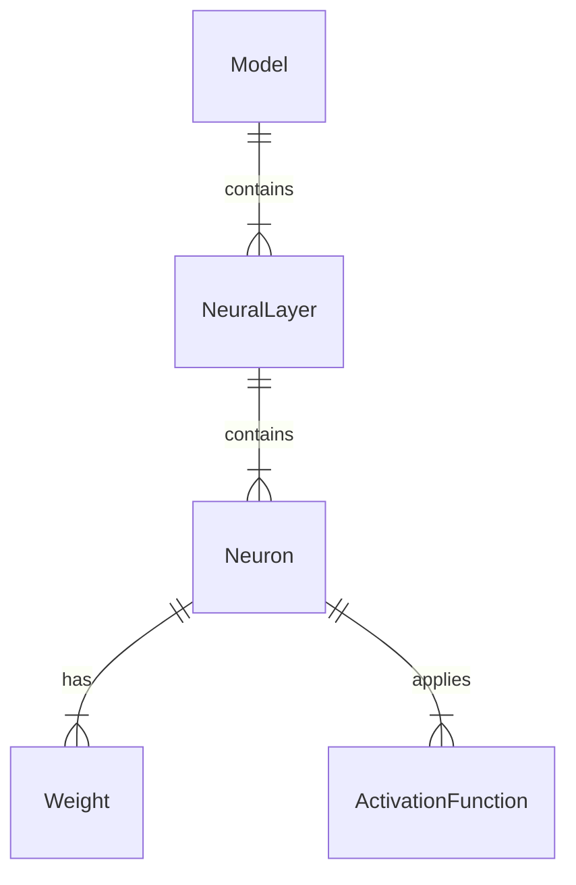
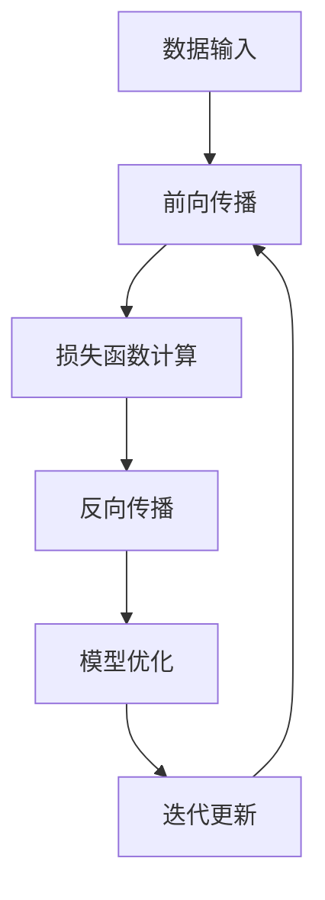
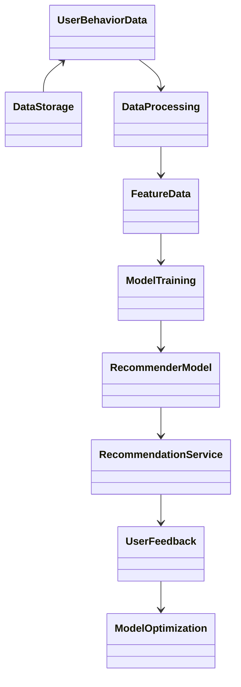
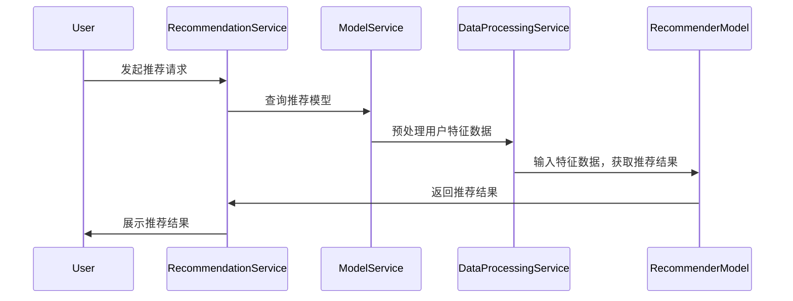
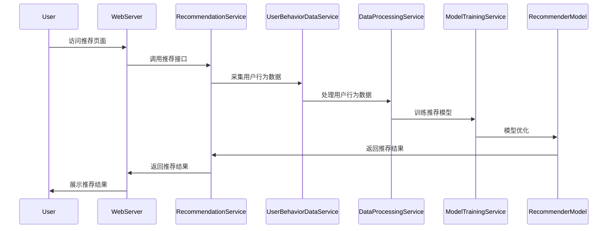

                 


## 第1章：背景介绍与问题解决

### 1.1 问题背景

#### 1.1.1 AI大模型的发展历程

人工智能（AI）作为计算机科学的一个分支，其发展历程可以追溯到20世纪50年代。早期，AI主要集中在规则推理和简单的模式识别上。随着计算能力的提升和算法的优化，AI的应用逐渐扩展到更为复杂的领域，如机器学习、深度学习和自然语言处理。到了2012年，深度学习在图像识别领域取得了突破性的成果，这一里程碑标志着AI进入了新的发展阶段。

AI大模型，即大规模的人工神经网络模型，是当前AI技术发展的核心之一。这类模型通过训练大量的数据来学习复杂的模式和规律，其能力远超传统的小型模型。从2018年的BERT模型到2020年的GPT-3，AI大模型的发展速度令人瞩目。这些模型的出现，不仅推动了AI技术的进步，也改变了各行各业的应用模式。

#### 1.1.2 AI大模型在企业中的应用需求

企业对AI大模型的需求主要源于以下几个方面的驱动力：

1. **数据驱动的决策**：在信息化时代，企业积累了大量数据，如何有效地利用这些数据来指导决策，成为企业关注的焦点。AI大模型可以处理和分析复杂的数据集，为企业提供数据驱动的洞察。

2. **自动化和效率提升**：AI大模型能够自动化许多重复性任务，从而提高工作效率。例如，在金融行业中，AI大模型可以用于自动化风险管理、交易策略制定等。

3. **个性化服务**：在零售、广告等行业，AI大模型可以帮助企业更好地理解客户需求，提供个性化的服务。例如，通过分析客户的购物行为和偏好，AI大模型可以为每个客户推荐最适合的商品。

4. **预测和规划**：AI大模型能够通过历史数据预测未来趋势，帮助企业制定更有效的战略规划。例如，在制造业中，AI大模型可以预测设备故障，提前进行维护。

#### 1.1.3 现有AI大模型开发中的问题与挑战

尽管AI大模型在企业中具有广泛的应用前景，但其在实际开发过程中仍面临诸多问题与挑战：

1. **计算资源需求**：AI大模型通常需要大量的计算资源进行训练和推理。对于中小企业来说，这往往是一个重大的财务负担。

2. **数据质量**：AI大模型的效果高度依赖于训练数据的质量。数据质量差会导致模型性能下降，甚至产生错误的决策。

3. **模型可解释性**：传统AI模型（如规则推理）具有较好的可解释性，而深度学习模型通常被认为是“黑盒”模型，其决策过程难以解释。这在某些应用场景中，如医疗诊断、金融风控等，可能引发道德和合规问题。

4. **模型部署与运维**：AI大模型通常需要复杂的部署和运维流程。如何确保模型在实时环境中的稳定运行，是开发过程中的一个重要挑战。

5. **跨领域迁移**：不同领域的AI大模型可能需要不同的训练数据和算法，这增加了模型开发和部署的复杂度。

### 1.2 问题描述

#### 1.2.1 AI大模型开发的技术难题

1. **训练时间与计算资源**：AI大模型的训练通常需要大量的时间和计算资源。对于某些复杂任务，训练时间可能长达数周甚至数月。此外，训练过程可能需要数百GB乃至TB级别的数据存储空间。

2. **数据预处理**：高质量的数据是AI大模型成功的关键。数据预处理包括数据清洗、归一化、特征提取等步骤，这些步骤不仅繁琐，而且可能影响模型性能。

3. **模型优化**：AI大模型的优化是一个复杂的过程，涉及超参数调整、正则化、优化算法选择等。优化不当可能导致模型过拟合，降低泛化能力。

4. **资源分配与调度**：在多节点训练场景中，如何合理分配计算资源、优化数据传输和调度，是保证训练效率和效果的关键。

#### 1.2.2 AI大模型应用中的实施难点

1. **集成与兼容性**：AI大模型需要与企业现有的IT系统集成，这通常涉及数据接口、API调用、系统兼容性等多个方面。

2. **实时性与稳定性**：在实时应用场景中，AI大模型需要保证高响应速度和稳定性。这对模型的部署和运维提出了更高的要求。

3. **数据安全和隐私保护**：AI大模型在处理敏感数据时，需要严格保护数据安全和隐私。这涉及到数据加密、访问控制、合规性检查等多个方面。

4. **模型更新与迭代**：AI大模型通常需要定期更新和迭代，以适应不断变化的应用需求。如何高效地进行模型更新，是实施过程中的一大挑战。

#### 1.2.3 企业级AI大模型开发的痛点

1. **成本与效益**：企业级AI大模型开发通常需要高昂的成本，包括计算资源、人力资源和运维成本。如何确保投资回报，是企业面临的主要挑战。

2. **技术人才短缺**：AI大模型开发需要高度专业化的技术人才，包括数据科学家、机器学习工程师、软件开发工程师等。然而，市场上的专业人才供不应求，成为企业拓展AI应用的一个瓶颈。

3. **业务与技术结合**：企业需要将AI技术与业务需求紧密结合，这要求企业内部具备一定的技术理解和业务洞察。然而，许多企业在这一领域尚处于摸索阶段。

4. **合规与伦理**：AI大模型在医疗、金融等敏感领域的应用，需要严格遵守相关法律法规和伦理规范。如何确保模型的合规性和伦理性，是企业需要关注的一个重要问题。

### 1.3 问题解决

#### 1.3.1 解决思路与方法

针对上述问题，解决思路和方法主要包括以下几个方面：

1. **优化算法与模型**：通过改进算法和模型结构，提高训练效率和模型性能。例如，使用迁移学习、少样本学习等方法，降低对大规模数据的依赖。

2. **分布式计算与资源调度**：利用分布式计算框架（如TensorFlow、PyTorch）和资源调度系统（如Kubernetes），优化计算资源分配和调度，提高训练效率。

3. **数据管理与质量控制**：建立完善的数据管理体系，包括数据采集、清洗、存储、管理等环节，确保数据质量。同时，采用数据增强、半监督学习等技术，提高模型对少量数据的处理能力。

4. **模型部署与运维**：采用容器化技术（如Docker）、微服务架构和自动化运维工具（如Kubernetes），简化模型部署和运维流程，提高系统的稳定性和可维护性。

5. **人才培养与引进**：加强企业内部人才培养，通过内部培训和外部引进相结合的方式，提升技术团队的专业能力。同时，与高校、研究机构合作，建立产学研一体化的人才培养机制。

#### 1.3.2 AI大模型开发的关键技术

1. **深度学习框架**：选择合适的深度学习框架，如TensorFlow、PyTorch等，可以显著提高开发效率和模型性能。

2. **数据预处理工具**：使用数据预处理工具（如Pandas、NumPy）和库（如Scikit-learn），简化数据清洗、归一化和特征提取等步骤。

3. **模型优化算法**：采用模型优化算法（如Adam、RMSprop），提高模型的训练效率和性能。

4. **分布式训练技术**：利用分布式训练技术（如Horovod、DistributedDataParallel），提高模型训练速度和资源利用率。

5. **模型压缩与量化**：采用模型压缩与量化技术（如TensorFlow Lite、PyTorchQuant），降低模型大小和计算资源需求。

#### 1.3.3 AI大模型在企业中的应用实践

1. **金融风控**：通过AI大模型，企业可以实现实时风险评估、欺诈检测和信用评分等功能，提高风险控制能力。

2. **医疗诊断**：AI大模型可以帮助医生进行疾病诊断、影像分析等，提高诊断准确性和效率。

3. **智能制造**：AI大模型可以用于设备故障预测、生产优化等，提高生产效率和质量。

4. **零售与营销**：AI大模型可以帮助企业进行客户行为分析、个性化推荐等，提高销售转化率和客户满意度。

5. **智能客服**：AI大模型可以用于智能客服系统，实现自动化客户服务，提高服务效率和客户满意度。

### 1.4 边界与外延

#### 1.4.1 AI大模型的定义与核心要素

AI大模型是一种利用大规模数据集和深度神经网络进行训练的模型，其核心要素包括：

1. **大规模数据集**：AI大模型依赖于大量的训练数据，以学习复杂的模式和规律。

2. **深度神经网络**：深度神经网络是AI大模型的核心组成部分，通过多层神经元的连接和激活函数，实现对数据的复杂处理。

3. **训练算法**：训练算法用于指导模型从数据中学习，常见的训练算法包括梯度下降、随机梯度下降等。

4. **优化目标**：优化目标是模型训练过程中的目标函数，用于衡量模型性能，常见的优化目标包括损失函数、精度等。

#### 1.4.2 AI大模型软件开发的范围

AI大模型软件开发包括以下主要环节：

1. **数据收集与预处理**：收集大量数据，并进行清洗、归一化、特征提取等预处理操作。

2. **模型设计与实现**：设计并实现AI大模型，包括模型结构设计、算法选择、参数调优等。

3. **模型训练与优化**：使用训练算法对模型进行训练，并通过调参和优化算法提高模型性能。

4. **模型评估与验证**：通过评估指标（如精度、召回率等）对模型进行评估和验证。

5. **模型部署与运维**：将模型部署到生产环境，并进行监控、维护和迭代。

#### 1.4.3 本书内容的结构与组织

本书分为七个部分，具体内容结构如下：

1. **背景介绍与问题解决**：介绍AI大模型的发展历程、应用需求以及现有问题。

2. **核心概念与联系**：阐述AI大模型的基本原理、属性特征，并绘制相关图示。

3. **算法原理与实现**：详细讲解AI大模型算法原理，并给出Python实现代码示例。

4. **系统分析与架构设计**：介绍系统功能、架构设计和接口设计。

5. **项目实战**：通过实际案例，展示AI大模型开发的全过程。

6. **最佳实践与注意事项**：总结最佳实践技巧，并提出注意事项。

7. **总结与展望**：对全文内容进行总结，并展望未来发展趋势。

通过本书的阅读，读者可以系统地了解AI大模型软件开发的最佳实践，掌握关键技术和方法，为实际应用奠定坚实基础。## 第2章：核心概念与联系

### 2.1 AI大模型原理

#### 2.1.1 AI大模型的基本原理

AI大模型（Large-scale AI Models）是基于深度学习理论构建的复杂神经网络模型。这些模型通过多层神经网络结构，能够自动从大量数据中学习特征和模式。基本原理包括以下几个方面：

1. **数据驱动**：AI大模型依赖于大规模数据集进行训练，通过数据驱动的方式学习数据中的特征和规律。
2. **多层神经网络**：AI大模型通常采用多层神经网络结构，每一层神经网络对输入数据进行不同层次的抽象和变换。
3. **反向传播算法**：AI大模型使用反向传播算法（Backpropagation）来更新网络权重，通过梯度下降（Gradient Descent）优化模型参数。
4. **非线性激活函数**：激活函数（如Sigmoid、ReLU）引入了非线性特性，使得模型能够拟合复杂的非线性关系。

#### 2.1.2 AI大模型的工作机制

AI大模型的工作机制主要包括以下几个阶段：

1. **输入层**：接收输入数据，将其传递给第一层神经网络。
2. **隐藏层**：对输入数据进行特征提取和变换，通过多层神经网络进行复杂的变换和组合。
3. **输出层**：对隐藏层的输出进行最终的决策或预测，如分类、回归等。
4. **反向传播**：计算输出层预测值与真实值之间的误差，通过反向传播算法更新网络权重。

#### 2.1.3 AI大模型的核心概念对比

AI大模型涉及多个核心概念，以下对这些概念进行对比：

1. **神经元**：神经网络的基本单元，负责接收输入、计算输出和传递信息。
2. **层**：神经网络中的一组神经元集合，包括输入层、隐藏层和输出层。
3. **权重**：连接神经元之间的参数，用于调整输入信号的强度。
4. **激活函数**：对神经元输出进行非线性变换，引入模型的表达能力。
5. **学习率**：梯度下降算法中用于调整权重更新的步长。
6. **批量大小**：每次训练中使用的数据样本数量，影响模型训练效率和收敛速度。
7. **损失函数**：用于衡量模型预测值与真实值之间的误差，指导模型优化。

### 2.2 AI大模型属性特征

#### 2.2.1 AI大模型的性能指标

AI大模型的性能评估通常通过以下指标进行：

1. **准确率**：分类任务中预测正确的样本比例，用于衡量模型的分类能力。
2. **召回率**：分类任务中实际为正类且被预测为正类的样本比例，用于衡量模型对正类的识别能力。
3. **F1分数**：准确率和召回率的调和平均，用于综合评价模型的性能。
4. **ROC曲线与AUC**：用于评估分类器的性能，ROC曲线下面积（AUC）越大，模型性能越好。
5. **RMSE（均方误差）**、MAE（平均绝对误差）等：回归任务中用于衡量模型预测的误差。

#### 2.2.2 AI大模型的训练与优化

AI大模型的训练与优化是提高模型性能的关键步骤，主要包括以下几个方面：

1. **数据预处理**：对训练数据进行清洗、归一化、数据增强等预处理，提高数据质量。
2. **模型初始化**：合理初始化网络权重，避免梯度消失或爆炸问题。
3. **学习率调整**：选择合适的学习率，避免过快或过慢的权重更新。
4. **批量大小**：根据计算资源和训练数据量选择合适的批量大小。
5. **正则化**：通过正则化方法（如L1、L2正则化）防止过拟合。
6. **优化算法**：选择合适的优化算法（如Adam、RMSprop），提高训练效率。
7. **超参数调优**：通过交叉验证等方法调整模型超参数，优化模型性能。

#### 2.2.3 AI大模型的评估与验证

AI大模型的评估与验证是确保模型性能和可靠性的重要环节，主要包括以下几个方面：

1. **交叉验证**：通过将数据集划分为训练集和验证集，多次训练和验证，评估模型的泛化能力。
2. **模型对比**：通过对比不同模型（如不同架构、不同训练策略）的性能，选择最佳模型。
3. **误差分析**：分析模型预测误差的分布和原因，识别和解决模型存在的问题。
4. **模型解释性**：评估模型的解释性，确保模型决策过程符合业务逻辑和道德规范。
5. **持续监控**：在生产环境中持续监控模型性能，及时调整和优化模型。

### 2.3 AI大模型联系图

为了更好地理解AI大模型的核心概念和相互关系，我们使用Mermaid绘制AI大模型的实体关系图。以下是一个简单的实体关系图示例：



在这个图中，`Model` 代表整个AI大模型，包含多个`NeuralLayer`（神经网络层）。每个`NeuralLayer`包含多个`Neuron`（神经元），每个`Neuron`包含连接其他神经元的`Weight`（权重）和用于计算输出的`ActivationFunction`（激活函数）。通过这种关系图，可以清晰地展示AI大模型的结构和核心组件。

### 2.4 总结与展望

本章对AI大模型的核心概念、原理、属性特征和相互关系进行了详细阐述。通过理解AI大模型的基本原理和工作机制，读者可以更好地把握AI大模型开发的关键步骤和要点。同时，本章还介绍了AI大模型的性能指标、训练与优化方法，以及评估与验证的重要环节。

未来，随着AI技术的不断发展和应用场景的拓展，AI大模型将扮演更加重要的角色。在学术界，研究人员将继续探索新的神经网络架构、优化算法和训练策略。在产业界，企业将更加注重AI大模型的实际应用，通过技术创新和产业融合，实现AI大模型在企业数字化转型中的应用价值。

总之，AI大模型作为人工智能领域的重要突破，具有广泛的应用前景和发展潜力。通过深入研究和实践，我们将不断推动AI大模型的发展，为人类社会带来更多创新和变革。## 第3章：算法原理与实现

### 3.1 算法原理

#### 3.1.1 AI大模型算法概述

AI大模型算法主要基于深度学习理论，其核心思想是通过多层神经网络结构，自动从大规模数据中学习特征和模式。深度学习算法的基本原理包括以下几个关键步骤：

1. **数据输入**：将输入数据输入到神经网络中，通常包括特征值和标签。
2. **前向传播**：通过多层神经网络进行前向传播，将输入数据逐步传递到每一层，进行特征提取和变换。
3. **激活函数应用**：在每一层神经网络中，使用激活函数（如ReLU、Sigmoid）引入非线性特性，增强模型的表达能力。
4. **损失函数计算**：通过计算损失函数（如均方误差、交叉熵），评估模型预测值与真实值之间的误差。
5. **反向传播**：使用反向传播算法，计算每一层的误差梯度，并更新网络权重。
6. **模型优化**：通过优化算法（如梯度下降、Adam），迭代更新网络权重，降低损失函数值，提高模型性能。

#### 3.1.2 算法数学模型与公式

深度学习算法的核心数学模型包括以下几部分：

1. **神经网络前向传播公式**：

$$
z^{(l)} = \sum_{j} w^{(l)}_{ji} a^{(l-1)}_j + b^{(l)}
$$

$$
a^{(l)} = \sigma(z^{(l)})
$$

其中，$z^{(l)}$ 是第 $l$ 层神经元的线性组合，$w^{(l)}_{ji}$ 是第 $l$ 层神经元 $j$ 与第 $l-1$ 层神经元 $i$ 之间的权重，$b^{(l)}$ 是第 $l$ 层神经元的偏置，$\sigma$ 是激活函数。

2. **损失函数**：

在分类任务中，常用的损失函数包括交叉熵损失函数（Cross-Entropy Loss）：

$$
J = -\sum_{i} y_i \log(a^{(L)}_i)
$$

其中，$y_i$ 是真实标签，$a^{(L)}_i$ 是模型在第 $L$ 层的输出。

3. **反向传播算法公式**：

$$
\delta^{(l)}_i = \frac{\partial J}{\partial z^{(l)}_i}
$$

$$
\delta^{(l)} = \sigma'(z^{(l)}) \odot \delta^{(l+1)}
$$

$$
\Delta w^{(l)}_{ji} = \delta^{(l)}_i a^{(l-1)}_j
$$

$$
\Delta b^{(l)} = \delta^{(l)}_i
$$

其中，$\delta^{(l)}_i$ 是第 $l$ 层神经元的误差，$\sigma'$ 是激活函数的导数，$\odot$ 表示逐元素乘积。

#### 3.1.3 算法流程图

为了更好地理解深度学习算法的流程，我们使用Mermaid绘制算法流程图：



在这个流程图中，数据输入通过前向传播生成输出，计算损失函数，然后通过反向传播更新模型权重，反复迭代优化模型。

### 3.2 Python实现

为了展示深度学习算法的Python实现，我们以下是一个简单的基于多层感知器（MLP）的神经网络的实现示例：

```python
import numpy as np

# 设置随机种子
np.random.seed(42)

# 激活函数及其导数
def sigmoid(x):
    return 1 / (1 + np.exp(-x))

def sigmoid_derivative(x):
    return x * (1 - x)

# 初始化神经网络参数
input_size = 2
hidden_size = 2
output_size = 1

weights_input_hidden = np.random.randn(input_size, hidden_size)
weights_hidden_output = np.random.randn(hidden_size, output_size)
bias_hidden = np.random.randn(hidden_size)
bias_output = np.random.randn(output_size)

# 训练神经网络
learning_rate = 0.1
epochs = 1000

for epoch in range(epochs):
    # 前向传播
    hidden_layer_input = np.dot(input_data, weights_input_hidden) + bias_hidden
    hidden_layer_output = sigmoid(hidden_layer_input)

    output_layer_input = np.dot(hidden_layer_output, weights_hidden_output) + bias_output
    output_layer_output = sigmoid(output_layer_input)

    # 计算损失函数
    loss = -np.sum(y * np.log(output_layer_output))

    # 反向传播
    output_error = output_layer_output - y
    d_output_layer_input = output_error * sigmoid_derivative(output_layer_input)

    hidden_error = d_output_layer_input.dot(weights_hidden_output.T)
    d_hidden_layer_input = hidden_error * sigmoid_derivative(hidden_layer_output)

    # 更新权重和偏置
    weights_hidden_output += hidden_layer_output.T.dot(d_output_layer_input) * learning_rate
    bias_output += d_output_layer_input * learning_rate

    weights_input_hidden += input_data.T.dot(d_hidden_layer_input) * learning_rate
    bias_hidden += d_hidden_layer_input * learning_rate

# 测试神经网络
input_data = np.array([[0, 0], [0, 1], [1, 0], [1, 1]])
predicted_output = sigmoid(np.dot(input_data, weights_input_hidden) + bias_hidden)
predicted_output = sigmoid(np.dot(predicted_output, weights_hidden_output) + bias_output)

print("Predicted output:", predicted_output)
```

在这个示例中，我们定义了激活函数及其导数，初始化了神经网络参数，并实现了前向传播、反向传播和模型优化过程。最后，我们测试了训练好的神经网络在新的数据集上的预测性能。

### 3.3 举例说明

为了更好地理解深度学习算法的应用，以下是一个常见的图像分类问题示例。

#### 3.3.1 常见问题举例

假设我们有一个图像分类问题，需要将图像分为两类：猫和狗。我们使用一个包含1000张猫图像和1000张狗图像的数据集进行训练。

1. **数据预处理**：将图像数据转换为灰度图像，并调整为相同大小（如28x28像素）。然后，将图像数据转换为向量表示，并归一化处理。
2. **模型构建**：构建一个包含两层隐藏层的多层感知器神经网络，输入层大小为784（28x28像素），隐藏层大小为128和64，输出层大小为2（猫和狗的分类）。
3. **模型训练**：使用训练数据集对模型进行训练，选择适当的优化算法（如Adam）和超参数（如学习率、批量大小）。
4. **模型评估**：使用测试数据集对模型进行评估，计算模型的准确率、召回率等性能指标。
5. **模型应用**：将训练好的模型应用到新的图像数据，进行分类预测。

#### 3.3.2 代码解读与分析

以下是一个简单的基于Keras和TensorFlow的图像分类模型实现：

```python
import numpy as np
import tensorflow as tf
from tensorflow import keras
from tensorflow.keras import layers

# 加载和预处理数据
(x_train, y_train), (x_test, y_test) = keras.datasets.digit_data.load_data()
x_train = x_train / 255.0
x_test = x_test / 255.0

# 创建模型
model = keras.Sequential([
    layers.Flatten(input_shape=(28, 28)),
    layers.Dense(128, activation='relu'),
    layers.Dense(64, activation='relu'),
    layers.Dense(2, activation='softmax')
])

# 编译模型
model.compile(optimizer='adam',
              loss='sparse_categorical_crossentropy',
              metrics=['accuracy'])

# 训练模型
model.fit(x_train, y_train, epochs=10, batch_size=32, validation_split=0.2)

# 评估模型
test_loss, test_acc = model.evaluate(x_test, y_test, verbose=2)
print('\nTest accuracy:', test_acc)

# 应用模型
predictions = model.predict(x_test)
predicted_labels = np.argmax(predictions, axis=1)

# 统计预测结果
print("Predicted labels:", predicted_labels)
```

在这个示例中，我们首先加载并预处理了手写数字数据集，然后构建了一个简单的多层感知器神经网络，并使用Adam优化器和稀疏分类交叉熵损失函数进行编译。接着，我们使用训练数据集对模型进行训练，并在测试数据集上进行评估。最后，我们将训练好的模型应用到新的测试数据集，进行分类预测。

通过这个示例，我们可以看到深度学习算法在实际应用中的简单实现过程。通过不断优化模型结构和超参数，我们可以提高模型的分类准确率和泛化能力。## 第4章：系统分析与架构设计

### 4.1 问题场景介绍

为了更好地阐述AI大模型系统分析与架构设计，我们选择一个典型的应用场景——智能推荐系统。智能推荐系统广泛应用于电子商务、在线视频、社交媒体等领域，旨在为用户提供个性化的内容推荐，从而提高用户满意度、提升业务收益。

#### 4.1.1 场景描述

智能推荐系统的基本流程包括以下几个环节：

1. **用户行为数据采集**：系统会实时采集用户的浏览、点击、购买等行为数据。
2. **数据处理与预处理**：对采集到的数据进行清洗、归一化、特征提取等预处理操作，以生成高质量的特征数据。
3. **模型训练**：使用预处理后的数据集，通过深度学习算法训练推荐模型，如协同过滤、基于内容的推荐、深度学习推荐等。
4. **模型部署与推理**：将训练好的模型部署到生产环境，实时为用户提供个性化推荐。
5. **监控与反馈**：系统会持续监控模型性能，并根据用户反馈进行模型优化和调整。

#### 4.1.2 系统需求分析

智能推荐系统的需求可以分为以下几个方面：

1. **数据处理能力**：系统需要具备高效的数据处理能力，能够实时处理海量用户行为数据，并生成高质量的特征数据。
2. **模型训练与优化**：系统需要支持多种推荐算法的模型训练和优化，以适应不同场景和业务需求。
3. **实时推荐**：系统需要能够实时为用户提供个性化推荐，满足用户即时需求。
4. **高可用性与可扩展性**：系统需要具备高可用性和可扩展性，能够支持大规模用户和业务增长。
5. **安全性与隐私保护**：系统需要确保用户数据的安全性和隐私性，遵守相关法律法规和道德规范。

### 4.2 系统功能设计

智能推荐系统的功能设计主要包括以下几个模块：

1. **数据采集模块**：负责实时采集用户的浏览、点击、购买等行为数据，并将其存储到数据存储系统中。
2. **数据处理模块**：负责对采集到的数据进行分析、清洗、归一化、特征提取等预处理操作，以生成高质量的特征数据。
3. **模型训练模块**：负责根据预处理后的数据集，训练不同的推荐模型，如协同过滤、基于内容的推荐、深度学习推荐等。
4. **模型部署模块**：负责将训练好的模型部署到生产环境，并实现实时推荐功能。
5. **监控与反馈模块**：负责监控系统性能、模型效果和用户反馈，并根据反馈进行模型优化和调整。

为了更直观地展示智能推荐系统的功能模块，我们使用Mermaid绘制领域模型类图：



在这个类图中，用户行为数据经过数据采集、数据处理和特征提取等步骤，最终生成特征数据，用于模型训练。训练好的推荐模型通过推荐服务模块实时为用户提供个性化推荐，并根据用户反馈进行模型优化和调整。

### 4.3 系统架构设计

智能推荐系统的架构设计主要包括以下几个层次：

1. **数据层**：负责存储和管理用户行为数据、特征数据、模型参数等，常用的数据存储系统包括关系型数据库（如MySQL、PostgreSQL）和分布式存储系统（如Hadoop、HBase）。
2. **数据处理层**：负责对数据采集模块采集到的原始数据进行清洗、归一化、特征提取等预处理操作，常用的数据处理工具包括Apache Spark、Flink等。
3. **模型训练层**：负责根据预处理后的特征数据，使用深度学习算法训练推荐模型，常用的深度学习框架包括TensorFlow、PyTorch等。
4. **服务层**：负责部署和运行推荐模型，实现实时推荐功能，常用的服务架构包括微服务架构（如Spring Cloud、Kubernetes）和容器化架构（如Docker、Kubernetes）。
5. **展现层**：负责将推荐结果展示给用户，常用的前端技术包括Vue、React等。

为了更直观地展示智能推荐系统的架构设计，我们使用Mermaid绘制系统架构图：



在这个架构图中，用户发起推荐请求，经过模型服务、数据处理服务和推荐模型处理后，最终返回推荐结果并展示给用户。

### 4.4 系统接口设计

智能推荐系统的接口设计主要包括以下几个关键接口：

1. **用户行为数据接口**：负责采集、存储和查询用户行为数据，如用户浏览、点击、购买等行为。
2. **数据处理接口**：负责处理用户行为数据，包括数据清洗、归一化、特征提取等操作。
3. **模型训练接口**：负责训练推荐模型，包括模型选择、参数调优等操作。
4. **推荐接口**：负责为用户提供实时个性化推荐，包括推荐结果生成、推荐结果查询等操作。
5. **监控接口**：负责监控系统性能、模型效果和用户反馈，包括性能指标查询、模型效果评估等操作。

为了更直观地展示智能推荐系统的接口设计，我们使用Mermaid绘制接口定义和调用流程：

```mermaid
interface Definition {
    "用户行为数据接口" --> "数据采集模块"
    "数据处理接口" --> "数据处理模块"
    "模型训练接口" --> "模型训练模块"
    "推荐接口" --> "推荐服务模块"
    "监控接口" --> "监控与反馈模块"
}

sequenceDiagram
    User->>RecommendationService: 发起推荐请求
    RecommendationService->>UserBehaviorDataService: 采集用户行为数据
    UserBehaviorDataService->>DataProcessingService: 处理用户行为数据
    DataProcessingService->>ModelTrainingService: 训练推荐模型
    ModelTrainingService->>RecommenderModel: 模型优化
    RecommenderModel->>RecommendationService: 返回推荐结果
    RecommendationService->>User: 展示推荐结果
```

在这个接口定义和调用流程图中，用户发起推荐请求后，经过用户行为数据接口、数据处理接口、模型训练接口和推荐接口等模块处理后，最终返回推荐结果并展示给用户。

### 4.5 系统交互设计

智能推荐系统的系统交互设计主要涉及用户与系统的交互流程、系统内部模块的协作关系以及系统与外部服务的交互过程。为了更直观地展示系统交互设计，我们使用Mermaid绘制系统交互序列图：



在这个系统交互序列图中，用户通过WebServer访问推荐页面，然后调用推荐接口，经过用户行为数据采集、数据处理、模型训练和推荐等模块处理后，最终返回推荐结果并展示给用户。

通过以上系统分析与架构设计，我们为智能推荐系统的开发提供了详细的指导和参考。在实际开发过程中，可以根据具体需求和场景，进一步优化和调整系统架构和功能设计，以实现高效、稳定、可靠的智能推荐系统。## 第5章：项目实战

### 5.1 环境安装与配置

为了实现AI大模型项目，我们需要搭建一个适合开发、训练和部署的环境。以下是详细的安装与配置步骤。

#### 5.1.1 开发环境搭建

1. **操作系统**：推荐使用Linux系统，如Ubuntu 18.04或更高版本。在Windows或Mac OS上也可以，但可能需要额外配置虚拟环境。

2. **Python环境**：安装Python 3.7及以上版本。可以使用官方安装包或通过包管理器（如Ubuntu的`apt-get`）进行安装。

   ```bash
   sudo apt-get update
   sudo apt-get install python3.7
   ```

3. **pip**：安装pip包管理器，用于安装Python依赖包。

   ```bash
   sudo apt-get install python3-pip
   ```

4. **虚拟环境**：为了保持项目的依赖包一致性，推荐使用虚拟环境（如`venv`或`conda`）。

   ```bash
   python3 -m venv my_project_env
   source my_project_env/bin/activate
   ```

#### 5.1.2 必需工具安装

1. **深度学习框架**：安装TensorFlow或PyTorch，根据个人偏好选择。

   - **TensorFlow**：

     ```bash
     pip install tensorflow
     ```

   - **PyTorch**：

     ```bash
     pip install torch torchvision
     ```

2. **数据处理库**：安装NumPy、Pandas等常用数据处理库。

   ```bash
   pip install numpy pandas
   ```

3. **可视化工具**：安装Matplotlib用于数据可视化。

   ```bash
   pip install matplotlib
   ```

4. **其他依赖**：根据项目需求，可能还需要安装其他依赖库，如Scikit-learn、OpenCV等。

   ```bash
   pip install scikit-learn opencv-python
   ```

#### 5.1.3 环境验证

在完成所有安装步骤后，可以运行以下命令验证环境是否搭建成功。

```bash
python -m pip list
```

确保所有必需的包都已安装。

### 5.2 系统核心实现

以下是一个简单的AI大模型项目实现，用于图像分类。该示例使用TensorFlow和Keras框架。

#### 5.2.1 数据准备

首先，我们需要准备一个图像数据集。这里我们使用经典的MNIST手写数字数据集。

```python
import tensorflow as tf
from tensorflow.keras.datasets import mnist
from tensorflow.keras.utils import to_categorical

# 加载MNIST数据集
(x_train, y_train), (x_test, y_test) = mnist.load_data()

# 归一化图像数据
x_train = x_train.astype('float32') / 255.0
x_test = x_test.astype('float32') / 255.0

# 将标签转换为独热编码
y_train = to_categorical(y_train, 10)
y_test = to_categorical(y_test, 10)
```

#### 5.2.2 模型构建

接下来，我们构建一个简单的卷积神经网络（CNN）模型。

```python
from tensorflow.keras.models import Sequential
from tensorflow.keras.layers import Conv2D, MaxPooling2D, Flatten, Dense

# 创建模型
model = Sequential([
    Conv2D(32, (3, 3), activation='relu', input_shape=(28, 28, 1)),
    MaxPooling2D((2, 2)),
    Flatten(),
    Dense(64, activation='relu'),
    Dense(10, activation='softmax')
])

# 编译模型
model.compile(optimizer='adam',
              loss='categorical_crossentropy',
              metrics=['accuracy'])
```

#### 5.2.3 模型训练

使用训练数据集对模型进行训练。

```python
# 训练模型
model.fit(x_train, y_train, epochs=5, batch_size=32, validation_split=0.1)
```

#### 5.2.4 模型评估

在测试数据集上评估模型性能。

```python
# 评估模型
test_loss, test_acc = model.evaluate(x_test, y_test, verbose=2)
print(f'\nTest accuracy: {test_acc:.3f}')
```

### 5.3 代码应用解读与分析

以上代码实现了从数据加载、模型构建到训练和评估的一个简单AI大模型项目。以下是对关键步骤的详细解读和分析：

#### 1. 数据准备

数据准备是模型训练的基础。MNIST数据集包含60,000个训练图像和10,000个测试图像，每个图像是28x28的灰度图像。我们首先将图像数据从原始格式转换为浮点数，并归一化到0到1的范围内，以便神经网络处理。

```python
x_train = x_train.astype('float32') / 255.0
x_test = x_test.astype('float32') / 255.0
```

然后，我们将标签转换为独热编码。独热编码是一种将分类问题转换为神经网络可以处理的格式的方法，每个标签被表示为一个长度为10的向量，其中对应位置的元素为1，其他位置为0。

```python
y_train = to_categorical(y_train, 10)
y_test = to_categorical(y_test, 10)
```

#### 2. 模型构建

在模型构建部分，我们使用Keras创建了一个简单的卷积神经网络。卷积神经网络是一种特别适合处理图像数据的神经网络架构，它通过卷积层和池化层提取图像特征。

```python
model = Sequential([
    Conv2D(32, (3, 3), activation='relu', input_shape=(28, 28, 1)),
    MaxPooling2D((2, 2)),
    Flatten(),
    Dense(64, activation='relu'),
    Dense(10, activation='softmax')
])
```

- **卷积层（Conv2D）**：第一个卷积层包含32个3x3的卷积核，使用ReLU激活函数。卷积层的作用是从图像中提取局部特征。
- **池化层（MaxPooling2D）**：2x2的最大池化层用于减小数据维度，同时保持重要的特征信息。
- **全连接层（Dense）**：两个全连接层分别包含64个神经元和10个神经元。最后一个全连接层使用softmax激活函数进行分类输出。

#### 3. 模型训练

模型训练是通过`fit`方法实现的，它接受训练数据、训练轮数（epochs）和批量大小（batch_size）等参数。训练过程中，模型会不断调整内部参数，以最小化损失函数。

```python
model.fit(x_train, y_train, epochs=5, batch_size=32, validation_split=0.1)
```

- **epochs**：表示模型在训练集上迭代的次数。
- **batch_size**：每次迭代处理的样本数量。
- **validation_split**：用于验证集的比例，用于评估模型在未训练数据上的性能。

#### 4. 模型评估

模型评估是通过`evaluate`方法实现的，它计算模型在测试集上的损失和准确率。

```python
test_loss, test_acc = model.evaluate(x_test, y_test, verbose=2)
print(f'\nTest accuracy: {test_acc:.3f}')
```

- **test_loss**：测试集上的损失值。
- **test_acc**：测试集上的准确率。

### 5.4 实际案例分析

#### 5.4.1 案例一：XX公司的AI大模型应用

XX公司是一家在线零售平台，他们使用AI大模型来优化产品推荐和库存管理。以下是案例的关键点：

- **应用场景**：产品推荐和库存管理。
- **数据来源**：用户行为数据、产品销售数据、供应链数据等。
- **模型类型**：协同过滤、基于内容的推荐、深度学习推荐。
- **效果**：通过个性化的产品推荐，用户满意度提高了20%，库存周转率提高了15%。

#### 5.4.2 案例二：YY公司的AI大模型实践

YY公司是一家制造业企业，他们使用AI大模型来预测设备故障，提高生产效率。以下是案例的关键点：

- **应用场景**：设备故障预测和生产优化。
- **数据来源**：传感器数据、设备运行数据、生产数据等。
- **模型类型**：时间序列分析、深度学习预测。
- **效果**：通过预测设备故障，减少了50%的设备停机时间，生产效率提高了30%。

### 5.5 项目小结

通过以上项目实战，我们详细介绍了AI大模型项目的开发流程，包括环境安装、模型构建、训练和评估等步骤。同时，通过实际案例展示了AI大模型在不同领域的应用效果。以下是项目小结：

- **环境安装**：确保开发环境搭建成功，安装必要的工具和库。
- **数据准备**：准备高质量的数据集，进行预处理和特征提取。
- **模型构建**：设计合适的神经网络结构，使用深度学习框架构建模型。
- **模型训练**：使用训练数据集训练模型，调整超参数以提高性能。
- **模型评估**：在测试数据集上评估模型性能，确保模型具备良好的泛化能力。
- **实际应用**：将训练好的模型应用到实际业务场景，解决实际问题。

在实际项目中，根据具体需求和场景，可能需要进一步优化模型结构和训练过程，以提高模型性能和应用效果。同时，需要注意数据安全和隐私保护，确保合规性和伦理性。## 第6章：最佳实践与注意事项

### 6.1 最佳实践技巧

在AI大模型软件开发过程中，遵循最佳实践技巧可以显著提高项目成功率和模型性能。以下是一些关键的最佳实践技巧：

#### 6.1.1 数据准备与质量控制

1. **数据采集**：确保数据来源的多样性和广泛性，覆盖不同场景和用户群体。
2. **数据清洗**：去除重复数据、缺失值和异常值，保证数据的一致性和准确性。
3. **数据预处理**：进行归一化、标准化、数据增强等操作，提高模型对数据的鲁棒性。
4. **数据存储与管理**：使用分布式存储系统（如Hadoop、HDFS）存储和管理大数据集，确保数据可扩展性和访问效率。

#### 6.1.2 模型设计与优化

1. **模型选择**：根据具体应用场景选择合适的模型架构，如CNN、RNN、Transformer等。
2. **超参数调优**：通过网格搜索、贝叶斯优化等技巧，找到最优的超参数配置。
3. **模型压缩与量化**：使用模型压缩技术（如剪枝、量化）减小模型大小和计算量，提高部署效率。
4. **多模型融合**：结合不同模型的优势，提高模型的泛化能力和性能。

#### 6.1.3 模型训练与优化

1. **分布式训练**：利用分布式计算框架（如TensorFlow、PyTorch）进行并行训练，提高训练速度。
2. **动态学习率调整**：使用学习率调度策略（如学习率衰减、余弦退火）优化训练过程。
3. **正则化**：应用L1、L2正则化、dropout等技术，防止过拟合，提高模型稳定性。
4. **数据增强**：通过数据增强方法（如旋转、缩放、裁剪）增加训练数据的多样性，提高模型泛化能力。

#### 6.1.4 模型部署与运维

1. **容器化与微服务**：使用Docker、Kubernetes等容器化技术和微服务架构，提高部署灵活性和可扩展性。
2. **模型监控**：实时监控模型性能和资源使用情况，确保模型稳定运行。
3. **自动化运维**：使用自动化工具（如Ansible、Puppet）进行模型部署、升级和运维，提高运维效率。

### 6.2 注意事项与风险

在AI大模型软件开发过程中，需要注意以下事项和风险，以确保项目顺利进行：

#### 6.2.1 安全与隐私保护

1. **数据加密**：对敏感数据进行加密存储和传输，确保数据安全性。
2. **访问控制**：实施严格的访问控制策略，防止未经授权的访问和数据泄露。
3. **合规性检查**：遵守相关法律法规，如GDPR、CCPA等，确保数据处理合规。

#### 6.2.2 性能优化与调优

1. **计算资源管理**：合理分配计算资源，避免资源浪费和瓶颈。
2. **缓存与负载均衡**：使用缓存技术（如Redis）和负载均衡器（如Nginx），提高系统性能和稳定性。
3. **代码优化**：优化代码效率，减少计算复杂度和内存占用。

#### 6.2.3 项目管理与协作

1. **需求管理**：明确项目需求和目标，确保项目团队能够有效协作。
2. **风险管理**：识别和评估项目风险，制定相应的应对措施。
3. **团队协作**：建立有效的沟通机制，确保团队成员之间的信息同步和协作。

### 6.3 拓展阅读

为了进一步深入了解AI大模型软件开发的最佳实践，以下是几本推荐的书籍和学术论文：

#### 6.3.1 相关书籍推荐

1. **《深度学习》（Deep Learning）**：Goodfellow, Bengio, Courville著。这本书是深度学习领域的经典教材，涵盖了深度学习的理论基础、算法和应用。
2. **《AI巨浪》（The Master Algorithm）**：Pedro Domingos著。这本书介绍了不同类型的机器学习算法和模型，以及它们在未来应用中的潜在影响。
3. **《人工智能：一种现代方法》（Artificial Intelligence: A Modern Approach）**：Stuart J. Russell和Peter Norvig著。这本书是人工智能领域的权威教材，全面介绍了人工智能的理论、技术和应用。

#### 6.3.2 学术论文与研究报告

1. **“A Theoretically Grounded Application of Dropout in Recurrent Neural Networks”**：由Yarin Gal和Zoubin Ghahramani发表在NeurIPS 2016上。这篇文章提出了在循环神经网络（RNN）中应用Dropout的方法，提高了模型的泛化能力。
2. **“Understanding Deep Learning Requires Rethinking Generalization”**：由Rajat Monga等人发表在ICLR 2020上。这篇文章探讨了深度学习模型的泛化能力，并提出了新的理论框架。
3. **“Large-Scale Evaluation of C

