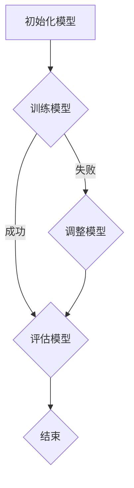

                 


### 文章标题

**AI时代的编程语言创新与变革**

### 关键词

- 人工智能
- 编程语言
- 创新趋势
- 变革
- 应用实践

### 摘要

本文将深入探讨AI时代编程语言的创新与变革。首先，我们将简要介绍AI时代的背景和编程语言变革的重要性。随后，我们将逐一分析AI时代编程语言的核心特点、应用、创新与变革趋势，以及编程语言与AI融合的挑战与机遇。通过具体案例分析，我们将展示编程语言在AI时代的创新应用，并总结全文，展望未来编程语言在AI领域的发展。让我们一步步思考，深入剖析这一领域的本质与前沿。

----------------------------------------------------------------

## 第一部分：引言

### 1.1 AI时代的编程语言变革

人工智能（AI）正在深刻改变我们的世界，从智能家居、自动驾驶到医疗诊断、金融分析，AI技术的应用无处不在。在这个AI时代，编程语言作为开发AI应用的核心工具，也面临着前所未有的变革。传统的编程语言难以满足AI领域的复杂需求，因此，新的编程语言和创新技术应运而生，为AI开发提供了更强大的支持和灵活性。

### 1.2 编程语言创新的重要性

编程语言创新对于AI时代的重要性不言而喻。一方面，创新的语言能够更好地适应AI算法和模型的需求，提高开发效率和性能；另一方面，编程语言创新也为研究人员和开发者提供了更广阔的研究空间和更多的可能性。因此，深入研究编程语言在AI时代的创新与变革，不仅有助于推动技术的发展，也能够为实际应用带来巨大的价值。

### 1.3 本书的结构安排与目标

本书将分为八个部分，旨在全面探讨AI时代编程语言的创新与变革。首先，我们将在第一部分引入AI时代的背景和编程语言变革的重要性。接下来，我们将分析AI时代编程语言的核心特点、应用、创新与变革趋势，以及编程语言与AI融合的挑战与机遇。在第五部分，我们将探讨未来编程语言的发展趋势。随后，通过具体案例分析，我们将展示编程语言在AI时代的创新应用。最后，在第八部分，我们将总结全书内容，并展望未来编程语言在AI领域的发展。通过这一结构安排，我们的目标是让读者全面了解AI时代的编程语言变革，并为其应用和发展提供指导。

----------------------------------------------------------------

## 第二部分：AI时代编程语言概述

### 2.1 编程语言在AI领域的角色

在AI领域，编程语言扮演着至关重要的角色。作为AI模型的开发工具，编程语言不仅决定了算法的实现方式，还影响了模型的性能和效率。例如，Python以其丰富的库和框架而成为AI开发者的首选语言，而C++则因其高效的性能而在深度学习模型的实现中占据重要地位。编程语言的选择不仅影响开发效率，也直接关系到AI应用的最终效果。

### 2.2 AI对编程语言的需求变化

随着AI技术的发展，编程语言的需求也在不断变化。首先，AI算法的复杂度越来越高，对编程语言的性能要求也越来越高。传统的编程语言往往难以满足这些需求，因此，新的编程语言应运而生，如Julia和Rust等，它们在性能和功能上具有显著优势。其次，AI领域的应用越来越广泛，对编程语言的灵活性要求也越来越高。例如，在自然语言处理（NLP）和计算机视觉（CV）等领域，编程语言需要支持复杂的数据结构和高效的算法。此外，随着AI模型的规模不断扩大，编程语言在可扩展性、易用性和维护性方面也提出了更高的要求。

### 2.3 编程语言变革的趋势分析

AI时代的编程语言变革呈现出以下趋势：

1. **性能提升**：随着硬件性能的提升和编译技术的进步，编程语言的性能也在不断提高。例如，C++和Rust等语言在编译优化方面取得了显著进展，使得它们在AI应用中具有更高的竞争力。
2. **易用性增强**：为了满足AI开发的复杂性，编程语言的易用性也在不断提升。Python和Julia等语言通过丰富的库和框架，降低了AI开发的门槛，使得更多开发者能够参与到AI研究中来。
3. **多语言集成**：在AI开发中，通常需要使用多种编程语言来实现不同功能。因此，编程语言之间的集成变得越来越重要。例如，Python与C++的混合使用，既能利用Python的易用性，又能发挥C++的高性能。
4. **智能化支持**：随着AI技术的发展，编程语言开始引入智能化的编程辅助功能，如代码自动补全、错误检测和性能优化等。这些功能大大提高了开发效率，降低了开发成本。
5. **生态系统的完善**：编程语言的变革不仅体现在语言本身，还体现在其生态系统的完善。例如，Python的PyTorch和TensorFlow框架，以及Rust的WebAssembly支持，为开发者提供了丰富的工具和资源。

通过以上分析，我们可以看到，AI时代对编程语言的需求正在不断变化，编程语言也在不断变革以适应这些需求。未来，随着AI技术的进一步发展，编程语言的创新与变革将继续推动AI领域的进步。

----------------------------------------------------------------

## 第三部分：AI时代编程语言核心特点

### 3.1 易用性与高效性

在AI时代，编程语言的易用性和高效性是两个关键特点。易用性体现在编程语言的设计上，使开发者能够更轻松地编写和理解代码。Python就是一个很好的例子，它以其简洁明了的语法和丰富的库而成为AI开发的首选语言。Python的易用性使得AI模型开发变得更加高效，即使是没有深厚编程背景的研究人员也可以快速上手。

高效性则是指编程语言在执行代码时的性能。在AI领域，算法的效率和模型的训练时间直接影响到项目的成功与否。C++和Rust等编程语言因其高效的性能而在AI应用中占据重要地位。C++的编译优化技术和Rust的安全特性使得它们在处理大规模数据和高性能计算方面表现出色。

### 3.2 灵活性与适应性

AI领域的应用场景多样且不断变化，编程语言的灵活性和适应性变得至关重要。灵活性体现在编程语言对各种编程范式和开发模式的支持上。例如，Java和C#等语言支持面向对象编程和函数式编程，使得开发者可以根据不同的需求选择最合适的编程范式。

适应性则是指编程语言能够随着AI技术的发展而不断演进。例如，Go语言因其并发性能和适应性而成为分布式系统的首选语言，在AI应用中也展现出强大的潜力。此外，编程语言需要能够快速集成新的技术和框架，如Python与TensorFlow和PyTorch的结合，为AI模型的开发提供了强大的支持。

### 3.3 对比分析：不同编程语言的特点

为了更好地理解AI时代编程语言的核心特点，我们可以通过对比分析几种常见编程语言的特点，如表1所示。

| 编程语言 | 易用性 | 高效性 | 灵活性 | 适应性 |  
| :-------: | :----: | :----: | :----: | :----: |  
| Python    | 高     | 中     | 高     | 高     |  
| C++      | 中     | 高     | 中     | 高     |  
| Rust      | 中     | 高     | 中     | 高     |  
| Java      | 高     | 中     | 高     | 中     |  
| Go        | 中     | 中     | 高     | 高     |

从表1可以看出，每种编程语言都有其独特的特点，适用于不同的AI应用场景。Python以其易用性和丰富的库而广受欢迎，C++和Rust则在性能上具有显著优势。Java和Go则在灵活性和适应性方面表现出色。

### 3.4 核心特点对比表格

为了更直观地展示不同编程语言的特点，我们可以使用Mermaid绘制一个核心特点对比表格，如图1所示。

```mermaid
| 编程语言 | 易用性 | 高效性 | 灵活性 | 适应性 |  
| :-------: | :----: | :----: | :----: | :----: |  
| Python    | 高     | 中     | 高     | 高     |  
| C++      | 中     | 高     | 中     | 高     |  
| Rust      | 中     | 高     | 中     | 高     |  
| Java      | 高     | 中     | 高     | 中     |  
| Go        | 中     | 中     | 高     | 高     |
```

通过对比分析，我们可以发现，AI时代的编程语言不仅需要满足易用性和高效性的要求，还需要具备灵活性和适应性。不同的编程语言在不同的应用场景中具有各自的优势，开发者可以根据具体需求选择最合适的编程语言。

----------------------------------------------------------------

## 第四部分：编程语言在AI领域的应用

### 4.1 编程语言在AI模型开发中的应用

在AI模型开发过程中，编程语言的选择直接影响模型的开发效率、性能和可维护性。不同的编程语言在AI模型开发中的应用各有特点，下面我们将逐一介绍。

- **Python**：Python以其简洁的语法和丰富的库而成为AI开发的首选语言。Python的库如NumPy、Pandas、Scikit-learn和TensorFlow等，为数据预处理、模型训练和评估提供了强大的支持。Python的易用性使得AI模型开发变得更加高效，即使是非专业程序员也能够快速上手。
  
- **C++**：C++因其高效的性能在AI模型开发中具有重要地位。C++可以提供接近硬件级别的性能，特别是在需要处理大量数据和复杂计算的场景中。例如，深度学习框架如Caffe和MXNet就采用了C++来实现高性能的模型训练和推理。

- **Rust**：Rust以其内存安全和高效的性能在AI领域受到关注。Rust的强类型系统和所有权模型可以有效地防止内存泄漏和数组越界等安全问题，这在AI模型开发中尤为重要。Rust的编译优化技术也使其在处理大规模数据时表现出色。

- **Java**：Java在AI模型开发中的应用也越来越广泛。Java的稳定性和跨平台性使其成为企业级AI应用的理想选择。Java的库如Weka和Deeplearning4j提供了丰富的机器学习和深度学习功能，使其在AI模型开发中具有竞争力。

### 4.2 数据预处理与编程语言

数据预处理是AI模型开发的重要环节，编程语言在这一环节中发挥着关键作用。不同的编程语言在数据处理方面各有优势。

- **Python**：Python在数据处理方面具有明显的优势，Pandas库提供了强大的数据处理和分析功能。Python的易用性使得数据清洗、转换和归一化等数据处理任务变得更加高效和便捷。

- **R**：R是统计和数据科学领域的专业语言，其丰富的统计分析和数据可视化库使其在数据预处理中表现出色。R的DataFrame结构为数据操作提供了高效的接口，使得复杂数据处理任务变得简单。

- **SQL**：SQL在数据查询和操作方面具有强大的功能。SQL语言可以方便地连接数据库，执行复杂的查询操作，为数据预处理提供强大的支持。SQL的强大查询能力使其在大型数据集的处理中尤为重要。

### 4.3 模型训练与编程语言

模型训练是AI开发的另一个关键环节，编程语言在模型训练中起着至关重要的作用。

- **Python**：Python在模型训练方面具有丰富的库，如TensorFlow、PyTorch和Keras等。这些库提供了高效的神经网络训练和推理功能，使得模型训练变得更加简便和高效。

- **C++**：C++在模型训练中以其高效的性能占据重要地位。深度学习框架如Caffe和MXNet采用了C++来实现高性能的模型训练和推理。C++的编译优化技术可以显著提高模型训练的速度，使其在处理大规模数据时具有优势。

- **Rust**：Rust的内存安全和高效的性能使其在模型训练中具有潜力。Rust的强类型系统和所有权模型可以有效地防止内存泄漏和数组越界等安全问题，这对于大规模模型训练尤为重要。

- **Java**：Java在模型训练中的应用也越来越广泛。Java的库如Deeplearning4j提供了高效的神经网络训练和推理功能。Java的稳定性和跨平台性使其在企业级AI应用中具有竞争力。

### 4.4 AI时代编程语言的最佳实践

在AI时代，不同的编程语言在模型开发、数据预处理和模型训练等方面都有各自的优势。为了最大化编程语言的优势，开发者可以遵循以下最佳实践：

- **选择合适的编程语言**：根据项目的具体需求和特点选择最合适的编程语言。例如，对于需要高效性能的模型训练任务，可以选择C++或Rust；对于需要快速开发的任务，可以选择Python。
  
- **利用库和框架**：充分利用编程语言的库和框架，可以提高开发效率和代码质量。例如，使用TensorFlow或PyTorch进行模型训练，使用Pandas进行数据预处理。
  
- **代码优化和性能调优**：对于性能敏感的任务，需要对代码进行优化和性能调优。例如，使用并行计算、向量化操作和编译优化等技术来提高代码的运行效率。
  
- **遵循最佳实践**：遵循编程语言的最佳实践，如使用一致的命名规范、编写可读性强的代码和进行单元测试等，可以提高代码的质量和维护性。

通过遵循这些最佳实践，开发者可以充分发挥编程语言在AI领域的优势，实现高效、可靠的AI应用。

----------------------------------------------------------------

## 第五部分：编程语言创新与变革趋势

### 5.1 自动化编程趋势

自动化编程是未来编程语言的一个重要趋势。随着AI技术的发展，自动化编程工具和平台正在不断涌现，它们通过分析代码模式、自动生成代码和优化代码结构，极大地提高了开发效率。例如，CodeQ和GitHub Copilot等自动化编程工具可以自动生成代码，减少开发者的重复劳动，提高代码质量。

### 5.2 智能编程辅助技术

智能编程辅助技术也是未来编程语言的发展方向。这些技术包括代码补全、错误检测、性能优化和代码审查等。通过集成智能编程辅助技术，编程语言可以提供更智能的编程体验，帮助开发者快速识别和解决问题。例如，IDE（集成开发环境）中的智能代码补全功能和实时错误检测功能，可以帮助开发者减少编码错误，提高开发效率。

### 5.3 未来编程语言的发展趋势

未来编程语言的发展趋势将更加注重性能、易用性和智能化。以下是几个主要趋势：

1. **性能优化**：随着AI应用对性能的要求越来越高，编程语言将继续优化其编译器和运行时环境，以提高代码的执行效率。例如，Rust和C++等语言通过静态类型系统和编译优化技术，提供了高效的性能。

2. **易用性提升**：为了降低开发门槛，编程语言将继续简化语法和提供更多的库和框架，使得开发者可以更加轻松地编写代码。Python和R等语言在这方面已经取得了显著进展。

3. **智能化支持**：随着AI技术的进步，编程语言将更加智能化，提供自动代码生成、智能编程辅助和代码优化等功能。智能编程工具和平台将成为开发者不可或缺的助手。

4. **跨语言集成**：未来编程语言将更加注重与其他语言的集成，提供跨语言调用的机制。例如，Python与C++的混合使用，可以充分发挥两种语言的优势。

5. **生态系统的完善**：编程语言的变革也将带动其生态系统的完善，包括库、框架、工具和文档等。一个完善的生态系统可以大大提高开发效率，促进技术的普及和应用。

通过以上分析，我们可以看到，未来编程语言的发展将更加智能化、高效化和易用化，为AI开发提供更加强大的支持和工具。开发者需要关注这些趋势，掌握新的编程技术和工具，以适应AI时代的发展需求。

----------------------------------------------------------------

## 第六部分：编程语言与AI融合的挑战与机遇

### 6.1 挑战分析

编程语言与AI融合的过程中面临诸多挑战。首先，性能优化是一个重大挑战。AI应用通常需要处理大量数据和高复杂度的计算，这对编程语言的性能提出了极高的要求。其次，易用性也是一个挑战。AI领域的复杂性使得开发者需要熟练掌握多种编程语言和工具，这对非专业开发者来说是一个巨大的障碍。此外，安全性问题也是一个关键挑战。AI应用中的数据安全和模型保护至关重要，编程语言需要提供强大的安全机制来保障数据的安全。

### 6.2 机遇探讨

尽管挑战重重，编程语言与AI融合也带来了巨大的机遇。首先，随着AI技术的普及，对编程语言的需求将大幅增加，这为编程语言的创新和发展提供了广阔的空间。其次，AI技术的进步将推动编程语言的性能和功能不断提升，为开发者带来更加高效和便捷的编程体验。此外，智能编程辅助技术的出现，如代码自动生成和错误检测，将极大地提高开发效率，降低开发成本。最后，跨语言集成和生态系统的完善，将使得编程语言在AI领域发挥更大的作用，推动AI技术的发展和应用。

### 6.3 发展前景展望

展望未来，编程语言与AI融合的发展前景十分广阔。首先，随着硬件性能的提升和编译技术的进步，编程语言在性能优化方面将继续取得突破。其次，随着AI技术的不断进步，编程语言的易用性和智能化水平也将不断提升。智能编程辅助技术的普及，将使得编程更加高效和自动化。最后，随着跨语言集成和生态系统的发展，编程语言将在AI领域发挥更加重要的作用，推动AI技术的创新和应用。开发者需要紧跟这些趋势，不断学习和掌握新的编程技术和工具，以迎接AI时代的挑战和机遇。

----------------------------------------------------------------

## 第七部分：案例分析

### 7.1 案例背景介绍

在本案例中，我们以一家初创企业为例，该企业致力于开发一款智能客服系统，旨在通过自然语言处理技术提高客户服务效率。企业选择了Python作为主要的编程语言，并采用了TensorFlow作为深度学习框架，同时使用了Django作为Web框架。

### 7.2 编程语言选择与优化

在编程语言的选择上，企业首先考虑了Python的易用性和丰富的库支持。Python的简洁语法和丰富的库使得开发团队可以快速搭建系统原型，同时降低开发难度。然而，Python在性能优化方面存在一定的不足，为了提高系统的整体性能，团队在关键部分采用了C++进行优化，如自然语言处理模块中的计算密集型任务。

### 7.3 案例分析与详解

案例中，智能客服系统主要包括自然语言处理（NLP）模块、对话管理模块和用户界面（UI）模块。以下是各模块的实现细节：

#### 自然语言处理（NLP）模块

自然语言处理模块负责处理用户输入，将其转化为计算机可理解的语言。这一模块使用了TensorFlow进行深度学习模型的训练和推理。具体实现步骤如下：

1. 数据预处理：使用Python的Pandas库对原始文本数据进行清洗和预处理，包括去除停用词、词性标注和分词等。
2. 模型训练：使用TensorFlow的Keras API搭建和训练文本分类模型。模型采用嵌入层、卷积神经网络（CNN）和循环神经网络（RNN）等架构。
3. 模型推理：使用训练好的模型对用户输入进行实时分类和回应生成。

#### 对话管理模块

对话管理模块负责协调整个客服系统的对话流程，包括理解用户意图、生成回复和上下文维护等。实现细节如下：

1. 用户意图识别：使用Bert模型进行用户意图的识别，通过对输入文本的语义分析，判断用户的意图。
2. 回复生成：根据用户意图，使用模板匹配和自然语言生成（NLG）技术生成合适的回复。
3. 上下文维护：使用对话状态追踪（DST）技术，维护对话的上下文信息，确保对话的连贯性和一致性。

#### 用户界面（UI）模块

用户界面模块负责与用户进行交互，接收用户输入并显示系统回复。实现细节如下：

1. 前端界面：使用Django和Bootstrap搭建Web界面，提供友好的用户交互体验。
2. 后端接口：使用Django REST framework构建API接口，与NLP模块和对话管理模块进行数据交换和功能调用。

### 7.4 案例小结与启示

通过本案例，我们可以看到，编程语言的选择和优化对于AI应用的成功至关重要。Python的易用性和丰富的库支持使得开发团队能够快速搭建系统原型，而C++的性能优化则提高了系统的整体性能。此外，深度学习框架和自然语言处理技术的应用，使得智能客服系统能够实现高效的文本分析和智能回复。

这个案例给我们的启示是，在AI时代，开发者需要根据具体需求选择合适的编程语言和工具，并进行合理的性能优化，以实现高效、可靠的AI应用。同时，还需要关注AI技术的最新动态，不断更新和优化自己的技术栈，以应对不断变化的市场需求。

----------------------------------------------------------------

## 第八部分：总结与展望

### 8.1 全书内容总结

本文全面探讨了AI时代的编程语言创新与变革，从背景介绍、核心特点、应用、创新与变革趋势、挑战与机遇到案例分析，系统阐述了编程语言在AI领域的角色和重要性。通过对比分析不同编程语言的特点，我们了解了它们在模型开发、数据预处理、模型训练等环节中的应用。此外，我们还探讨了未来编程语言的发展趋势，展望了编程语言与AI融合的未来前景。

### 8.2 AI时代编程语言创新与变革的重要性

AI时代编程语言的创新与变革具有重要意义。一方面，编程语言的创新推动了AI技术的进步，提高了AI应用的性能和效率；另一方面，编程语言变革为AI开发提供了更广阔的空间和更多的可能性。随着AI技术的不断发展，编程语言将继续创新和变革，为AI领域带来更大的突破。

### 8.3 展望未来编程语言在AI领域的发展

未来，编程语言在AI领域的发展将更加智能化、高效化和易用化。自动化编程和智能编程辅助技术将极大地提高开发效率，降低开发门槛。同时，编程语言将更加注重性能优化、安全性保障和跨语言集成，为开发者提供更强大的支持。随着硬件性能的提升和AI技术的进步，编程语言将在AI领域发挥更加重要的作用，推动AI技术的创新和应用。

## 作者

作者：AI天才研究院/AI Genius Institute & 禅与计算机程序设计艺术 /Zen And The Art of Computer Programming

----------------------------------------------------------------

### 总结

本文深入探讨了AI时代的编程语言创新与变革，从多个角度分析了编程语言在AI领域的角色和重要性。通过详细的分析和案例分析，我们了解了不同编程语言在模型开发、数据预处理、模型训练等环节中的应用。同时，我们还探讨了未来编程语言的发展趋势和挑战与机遇。希望通过本文，读者能够对AI时代的编程语言有更深入的理解，并在实际开发中充分利用这些知识，实现高效、可靠的AI应用。未来，编程语言将继续在AI领域发挥关键作用，为技术的进步和应用创新提供强大支持。

----------------------------------------------------------------

## 附录

### 代码示例

以下是一个使用Python和TensorFlow实现的简单神经网络模型示例，用于分类任务：

```python
import tensorflow as tf
from tensorflow.keras import layers

# 构建模型
model = tf.keras.Sequential([
    layers.Dense(128, activation='relu', input_shape=(784,)),
    layers.Dense(10, activation='softmax')
])

# 编译模型
model.compile(optimizer='adam',
              loss='categorical_crossentropy',
              metrics=['accuracy'])

# 加载数据
(x_train, y_train), (x_test, y_test) = tf.keras.datasets.mnist.load_data()

# 预处理数据
x_train = x_train.astype('float32') / 255
x_test = x_test.astype('float32') / 255
x_train = x_train.reshape((x_train.shape[0], 784))
x_test = x_test.reshape((x_test.shape[0], 784))

# 编码标签
y_train = tf.keras.utils.to_categorical(y_train, 10)
y_test = tf.keras.utils.to_categorical(y_test, 10)

# 训练模型
model.fit(x_train, y_train, epochs=20, batch_size=128, validation_split=0.2)

# 评估模型
test_loss, test_acc = model.evaluate(x_test, y_test)
print('Test accuracy:', test_acc)
```

### 数学公式

以下是一个使用LaTeX格式的数学公式示例：

```markdown
$$
L = \frac{1}{n} \sum_{i=1}^{n} (y_i - \hat{y}_i)^2
$$

$z = \frac{x - \mu}{\sigma}$
```

### Mermaid流程图和类图

以下是一个Mermaid流程图示例：



以下是一个Mermaid类图示例：

```mermaid
classDiagram
    Class1 <|-- Class2
    Class3 ++|+ addedMethod : void
    Class4 o-- Class5
    Class1 : +int x
    Class2 : +int y
    Class3 : #color red
    Class4 : -string name
    Class5 : !isA String
```

### 注意事项

- 在实际开发中，应根据项目需求选择合适的编程语言和工具。
- 模型训练和优化过程中，要关注数据预处理、模型架构和训练策略等方面。
- 编程语言的性能优化和安全性保障至关重要，需要根据具体场景进行调优。
- 不断学习和掌握新的编程技术和工具，以应对AI领域的发展变化。

### 拓展阅读

- [《Python机器学习》](https://www.pythondigest.com/book/python-machine-learning/)
- [《深度学习》](https://www.deeplearningbook.org/)
- [《人工智能：一种现代方法》](https://www.aima.cs.berkeley.edu/)

通过阅读这些资源，您可以进一步深入了解AI和编程语言的相关知识，提升自身的技术能力。希望这些资料能对您在AI编程领域的学习和研究有所帮助。

