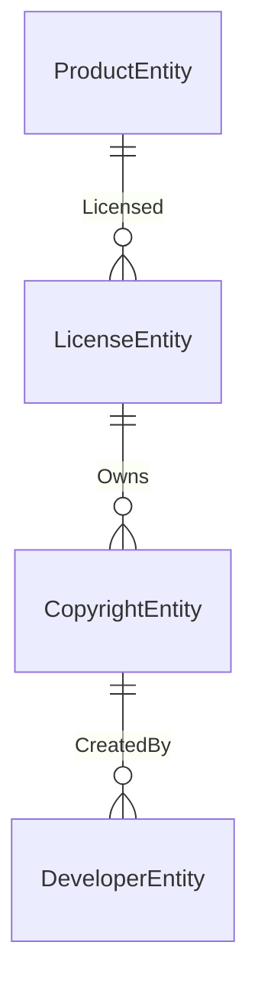
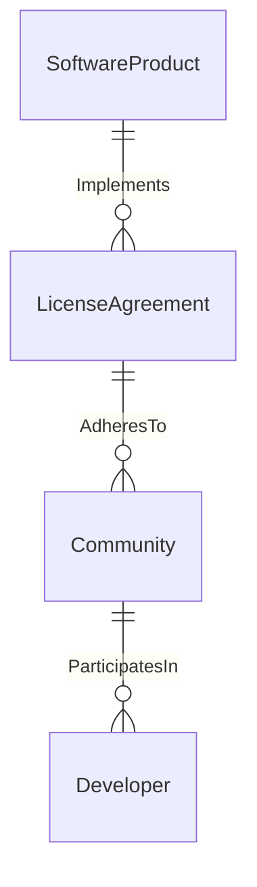
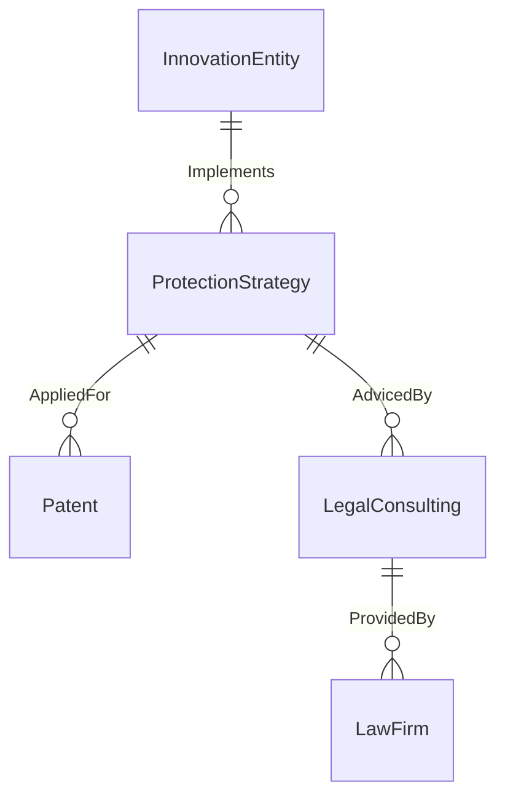
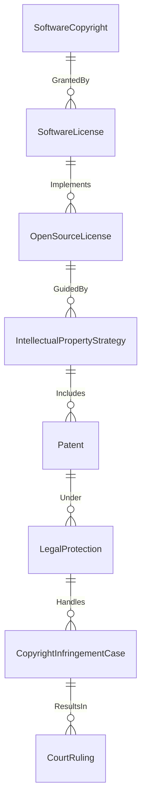

                 

### 第1章 引言

### 1.1 问题的背景

#### 1.1.1 AI时代软件许可与知识产权的重要性

在当今这个信息爆炸、技术飞速发展的时代，人工智能（AI）已经成为推动社会进步的重要力量。随着AI技术的不断成熟和应用，软件的复杂度也在迅速增加，软件成为企业创新和竞争力的核心资产。软件许可与知识产权作为管理软件资产的手段，其重要性日益凸显。

首先，软件许可直接关系到软件的使用权、复制权、修改权等关键权利的分配，这对于企业的商业模式、盈利模式具有决定性影响。特别是在AI时代，软件的功能和性能往往依赖于大量的数据训练和算法优化，这使得软件的价值变得更为复杂和难以评估。

其次，知识产权保护对于鼓励创新、保护创作者权益至关重要。在AI时代，许多创新成果都是基于大量先前的研究成果和开源软件的，如何合理界定知识产权归属、保障各方权益成为了一个亟待解决的问题。

#### 1.1.2 AI技术迅猛发展的挑战

AI技术的发展带来了诸多挑战，特别是在软件许可和知识产权方面。以下是一些主要挑战：

1. **技术迭代速度加快**：AI技术更新换代迅速，使得软件的生命周期缩短，传统的软件许可协议和知识产权管理方式难以适应。

2. **版权纠纷增多**：随着AI技术的发展，AI系统可以自主生成内容，如何界定这些内容的版权归属成为了一个新的法律问题。

3. **开源软件的合规性**：开源软件在AI开发中占据了重要地位，如何确保开源软件的合规使用，避免潜在的法律风险，成为企业必须面对的挑战。

4. **数据隐私和安全问题**：AI系统在训练和运行过程中需要大量数据，如何保护数据隐私、防止数据泄露，是AI时代知识产权保护的重要一环。

#### 1.1.3 本书的目的和结构

本书旨在深入探讨AI时代软件许可与知识产权面临的新挑战，提供系统的解决方案和最佳实践。全书共分为六个章节，结构如下：

- **第1章 引言**：介绍AI时代软件许可与知识产权的重要性，概述面临的主要挑战，并阐述本书的目的和结构。

- **第2章 核心概念与联系**：介绍AI时代软件许可与知识产权的核心概念，包括软件版权、开源许可、知识产权保护策略等，并分析各概念之间的联系。

- **第3章 AI时代软件许可协议**：详细讨论AI时代软件许可协议的类型、特点和应用，包括闭源许可、开源许可、专有许可等。

- **第4章 数据隐私与知识产权保护**：分析数据隐私问题，介绍数据隐私保护措施，探讨数据隐私与知识产权保护的平衡关系。

- **第5章 AI自主生成内容的版权问题**：探讨AI自主生成内容的版权归属问题，分析不同法律体系对此问题的看法和处理方式。

- **第6章 知识产权管理策略与最佳实践**：介绍知识产权管理的基本策略，分享最佳实践，总结本书的主要观点和结论。

通过本书的深入探讨，希望能够为读者提供一套系统的、可操作的解决方案，帮助企业和个人在AI时代更好地管理和保护软件知识产权。

### 1.2 问题描述

#### 1.2.1 AI时代软件许可与知识产权面临的主要问题

在AI时代，软件许可与知识产权管理面临诸多新的挑战。这些问题不仅影响企业的商业运营，也对个人的创新成果产生深远影响。以下是一些主要问题：

1. **技术迅速迭代带来的版权纠纷**：AI技术的发展使得软件更新换代的速度加快，这给版权保护带来了新的难题。例如，一个AI系统可能在短时间内经过多次迭代，每次迭代都可能涉及新的知识产权，如何合理界定每次迭代中的版权归属成为一个棘手的问题。

2. **数据隐私和安全问题**：AI系统通常需要大量数据进行训练和优化，如何保护这些数据隐私，防止数据泄露，是一个亟待解决的问题。数据隐私与知识产权保护之间的平衡关系也变得尤为重要。

3. **开源软件的合规性**：开源软件在AI开发中占据重要地位，但如何确保开源软件的合规使用，避免潜在的法律风险，是企业必须面对的挑战。特别是在AI时代，开源软件可能包含多种许可协议，如何正确理解和应用这些协议，确保软件合规，是一个复杂的问题。

4. **AI自主生成内容的版权归属**：随着AI技术的发展，AI系统可以自主生成各种内容，包括文本、图像、音频等。如何确定这些内容的版权归属，如何保护创作者权益，是AI时代版权法律领域的一个新兴问题。

5. **知识产权保护与国际法律冲突**：不同国家和地区对知识产权保护的法律规定和执行力度存在差异，这使得企业在全球范围内进行软件许可和知识产权管理时面临法律冲突和不确定性。

#### 1.2.2 企业和个人面临的影响

对于企业来说，AI时代的软件许可与知识产权管理具有重要意义。首先，合理的管理可以帮助企业避免因版权纠纷而承担的巨额法律费用和商业风险。其次，有效的知识产权保护可以激励企业进行技术创新，保护其核心竞争力。最后，企业需要适应全球化的法律环境，确保在不同国家和地区开展业务时遵循当地的法律规定。

对于个人开发者来说，AI时代的软件许可与知识产权管理同样至关重要。个人开发者需要了解不同类型的许可协议，确保自己的软件在使用时不会侵犯他人的知识产权。同时，个人开发者也需要关注数据隐私保护，避免因数据泄露而损害自身权益。

总之，AI时代的软件许可与知识产权管理不仅关乎企业利益，也关系到个人创新者的权益。只有通过深入了解和有效管理，才能在AI时代充分发挥软件知识产权的价值，促进技术创新和产业发展。

### 1.3 问题解决

#### 1.3.1 完善相关法律法规

为了应对AI时代软件许可与知识产权管理的新挑战，完善相关法律法规是至关重要的一步。首先，需要制定一套全面、系统的知识产权法律体系，明确AI时代软件和内容的版权归属、许可使用等关键问题。例如，可以借鉴国际上的先进经验，制定专门的AI知识产权法律条款，确保法律框架的适应性和前瞻性。

其次，应加强法律法规的执行力度，提高侵权行为的处罚力度，确保法律的有效实施。此外，还可以建立知识产权纠纷的快速解决机制，降低企业和个人在版权纠纷中的成本和时间。

#### 1.3.2 提升技术防范措施

在软件许可和知识产权保护中，技术手段是不可或缺的一部分。首先，可以采用加密技术对软件代码和数据进行加密，确保未经授权的使用和访问难以实现。例如，可以使用区块链技术来记录软件的版权信息和许可使用情况，提供透明的证据链。

其次，应开发智能合约来管理软件许可，确保许可协议的自动执行和不可篡改性。智能合约可以减少人为干预，提高许可管理的效率和公正性。

#### 1.3.3 加强知识产权管理和教育

有效的知识产权管理需要企业和个人具备专业的知识和技能。因此，加强知识产权管理和教育至关重要。首先，可以通过培训课程、研讨会等形式，提高企业员工和开发者的知识产权意识，使其了解最新的法律动态和最佳实践。

其次，应建立企业内部的知识产权管理制度，明确知识产权管理的流程和责任，确保知识产权的全面保护。此外，企业还可以与专业机构合作，进行知识产权风险评估和战略规划，提高知识产权管理的专业水平。

#### 1.3.4 建立全球协作机制

在全球化背景下，不同国家和地区对知识产权保护的法律规定和执行力度存在差异，这使得企业在全球范围内进行软件许可和知识产权管理时面临法律冲突和不确定性。因此，建立全球协作机制至关重要。

首先，可以推动国际间的法律合作，加强知识产权保护的协调和一致性。例如，通过国际组织如世界知识产权组织（WIPO）等，推动制定全球统一的知识产权法律标准。

其次，企业可以通过建立国际法律顾问团队，了解和应对不同国家和地区的知识产权法律环境，确保全球业务的合规性。

总之，通过完善法律法规、提升技术防范措施、加强知识产权管理和教育、建立全球协作机制，可以有效应对AI时代软件许可与知识产权管理的新挑战，为企业和个人在AI时代的发展提供坚实的保障。

### 1.4 边界与外延

在探讨AI时代软件许可与知识产权的核心概念时，理解这些概念在不同情境下的边界和外延是至关重要的。以下是几个关键概念及其边界与外延的详细分析。

#### 软件版权

**边界**：软件版权通常指的是对计算机程序的原创性表达提供法律保护。其边界主要取决于法律体系，例如，在美国，版权保护覆盖从源代码到可执行代码的转化。

**外延**：软件版权的保护范围包括源代码和对象代码，以及与程序相关的文档和用户界面设计。随着AI技术的发展，版权的外延还可能扩展到AI生成的算法和训练模型。

#### 开源许可

**边界**：开源许可是一系列允许用户自由使用、研究、修改和分发软件的协议。其边界主要体现在许可协议的具体条款上，例如，是否允许商业使用、是否要求用户对修改进行披露等。

**外延**：开源许可的外延广泛，可以涵盖从完全自由的开源协议（如GPL）到相对宽松的许可协议（如MIT）。随着AI技术的应用，开源许可还可能扩展到AI模型的训练数据和算法改进。

#### 知识产权保护策略

**边界**：知识产权保护策略的边界涉及保护手段的选择和应用范围。例如，企业可以选择通过专利、版权、商标等多种手段进行保护。

**外延**：知识产权保护策略的外延包括前期的研发保护、中期的许可管理以及后期的维权行动。在AI时代，随着技术的发展，知识产权保护策略的外延还可能扩展到数据隐私保护、AI算法的知识产权保护等。

#### 概念结构与核心要素组成

要全面理解AI时代软件许可与知识产权的核心概念，需要分析其概念结构与核心要素组成。以下是对核心概念的结构和要素组成的详细说明。

1. **软件版权**：
   - **要素**：原创性表达、程序代码、文档、用户界面设计等。
   - **结构**：法律体系框架、版权条款、司法实践。

2. **开源许可**：
   - **要素**：许可协议、许可条款、许可对象、使用范围等。
   - **结构**：许可协议类型、社区贡献机制、许可适用场景。

3. **知识产权保护策略**：
   - **要素**：保护手段、保护范围、保护流程等。
   - **结构**：风险评估、专利布局、法律咨询、许可管理。

通过上述分析，我们可以看到，AI时代软件许可与知识产权的核心概念具有明确的边界和外延，且其概念结构与核心要素组成复杂多样。这些概念在AI时代的具体应用中，需要结合实际情况进行灵活调整和优化，以应对不断变化的技术和法律环境。

### 1.5 概念结构与核心要素组成

#### 软件版权

**定义**：软件版权是指对计算机程序的原创性表达提供法律保护的权利。

**核心概念原理**：
- **原创性表达**：软件版权保护基于程序代码的独特性和创新性，不同于功能性的描述或命令。
- **法律保护**：软件版权在法律上受到保护，未经授权的复制、分发、修改等行为都可能构成侵权。

**概念属性特征对比表格**

| 特征           | 软件版权             | 版权法规                     | 开源许可                  |
| -------------- | ------------------- | --------------------------- | ------------------------ |
| **保护范围**   | 程序代码和文档       | 法律规定保护范围             | 开源协议规定范围          |
| **保护方式**   | 法律诉讼、侵权赔偿   | 法律执行和制裁               | 开源协议合规性检查        |
| **使用条件**   | 未经授权不可使用     | 法律许可条件                | 协议条款规定条件         |
| **更新频率**   | 较低，更新需重新注册 | 法律变更频率可能较高         | 协议变更需社区同意        |

**ER实体关系图架构**

在上述ER图架构中，`ProductEntity`（软件产品）与`LicenseEntity`（许可）之间存在“Licensed”关系，表示软件产品的许可情况。`LicenseEntity`与`CopyrightEntity`之间存在“Owns”关系，表示许可的所有权。`CopyrightEntity`与`DeveloperEntity`之间存在“CreatedBy”关系，表示版权的创建者。

#### 开源许可

**定义**：开源许可是一系列允许用户自由使用、研究、修改和分发软件的协议。

**核心概念原理**：
- **自由使用**：用户可以在不违反许可协议的前提下，自由使用开源软件。
- **研究**：用户可以对开源软件进行研究和分析，探索其功能和技术。
- **修改和分发**：用户可以根据开源许可协议，修改开源软件，并将其重新分发。

**概念属性特征对比表格**

| 特征           | 软件版权             | 版权法规                     | 开源许可                  |
| -------------- | ------------------- | --------------------------- | ------------------------ |
| **保护范围**   | 程序代码和文档       | 法律规定保护范围             | 开源协议规定范围          |
| **保护方式**   | 法律诉讼、侵权赔偿   | 法律执行和制裁               | 协议条款合规性检查        |
| **使用条件**   | 未经授权不可使用     | 法律许可条件                | 协议条款规定条件         |
| **更新频率**   | 较低，更新需重新注册 | 法律变更频率可能较高         | 协议变更需社区同意        |

**ER实体关系图架构**

在上述ER图架构中，`SoftwareProduct`（软件产品）与`LicenseAgreement`（许可协议）之间存在“Implements”关系，表示软件产品遵循的许可协议。`LicenseAgreement`与`Community`（开源社区）之间存在“AdheresTo”关系，表示协议的社区共识。`Community`与`Developer`（开发者）之间存在“ParticipatesIn”关系，表示开发者在社区中的参与。

#### 知识产权保护策略

**定义**：知识产权保护策略是指企业或个人为了保护其创新成果和权益所采取的一系列措施。

**核心概念原理**：
- **风险评估**：对潜在的风险进行评估，制定相应的保护措施。
- **专利布局**：通过申请专利来保护技术创新，防止他人侵权。
- **法律咨询**：借助专业法律机构的帮助，确保知识产权的有效保护。
- **许可管理**：通过许可协议来管理和分配软件的使用权。

**概念属性特征对比表格**

| 特征           | 软件版权             | 版权法规                     | 开源许可                  | 知识产权保护策略         |
| -------------- | ------------------- | --------------------------- | ------------------------ | ------------------------ |
| **保护范围**   | 法律规定的版权范围   | 法律规定保护范围             | 开源协议规定范围          | 创新成果和权益的保护范围 |
| **保护方式**   | 法律诉讼、侵权赔偿   | 法律执行和制裁               | 协议条款合规性检查        | 多层次、多手段保护       |
| **使用条件**   | 法律许可条件         | 法律许可条件                | 协议条款规定条件         | 风险评估和许可管理       |
| **更新频率**   | 法律变更频率可能较高 | 法律变更频率可能较高         | 协议变更需社区同意        | 定期评估和更新           |

**ER实体关系图架构**

在上述ER图架构中，`InnovationEntity`（创新实体）与`ProtectionStrategy`（保护策略）之间存在“Implements”关系，表示创新实体实施的保护策略。`ProtectionStrategy`与`Patent`（专利）之间存在“AppliedFor”关系，表示申请的专利。`ProtectionStrategy`与`LegalConsulting`（法律咨询）之间存在“AdvicedBy”关系，表示法律咨询。`LegalConsulting`与`LawFirm`（律师事务所）之间存在“ProvidedBy”关系，表示法律咨询由律师事务所提供。

通过上述分析，我们可以看到，AI时代软件许可与知识产权的核心概念具有明确的定义、核心原理和结构。理解这些概念的结构和要素组成，对于在实际应用中有效管理和保护软件知识产权至关重要。

## 第2章 核心概念与联系

### 2.1 核心概念原理

在AI时代，软件许可与知识产权管理涉及多个核心概念，包括软件版权、开源许可和知识产权保护策略。理解这些核心概念的基本原理对于有效管理知识产权至关重要。

#### 软件版权

**定义**：软件版权是指对计算机程序的原创性表达提供法律保护的权利。

**核心原理**：
- **原创性**：软件版权保护基于程序代码的独特性和创新性。法律通常要求程序具有原创性和表达性，而非功能性的描述或命令。
- **法律保护**：软件版权在法律上受到保护，未经授权的复制、分发、修改等行为都可能构成侵权。版权持有人可以通过法律手段维护其权益，包括提起诉讼和寻求赔偿。

**示例**：
假设一位开发者编写了一个创新的AI算法，并将其编码成软件。这个软件的源代码和文档都属于原创性表达，从而受到软件版权保护。任何未经授权的复制、修改或分发行为都可能侵犯版权。

#### 开源许可

**定义**：开源许可是一系列允许用户自由使用、研究、修改和分发软件的协议。

**核心原理**：
- **自由使用**：用户可以在不违反许可协议的前提下，自由使用开源软件。这意味着用户可以自由下载、安装和使用开源软件，而不需要支付费用。
- **研究和修改**：用户可以对开源软件进行研究和分析，探索其功能和技术。根据不同的开源许可协议，用户可能有权修改软件代码，并根据需要重新分发。
- **分发**：用户可以在遵守开源许可协议的条件下，自由分发开源软件。这意味着用户可以将开源软件与自己的项目结合，并公开分享。

**示例**：
假设一个开源项目遵循GPL（GNU通用公共许可证）协议。根据GPL协议，用户可以自由下载、使用、修改和分发该软件，但必须以相同的方式向他人提供源代码。任何商业使用也必须遵循这一原则。

#### 知识产权保护策略

**定义**：知识产权保护策略是指企业或个人为了保护其创新成果和权益所采取的一系列措施。

**核心原理**：
- **风险评估**：对潜在的风险进行评估，识别可能侵犯知识产权的行为，并制定相应的防范措施。
- **专利布局**：通过申请专利来保护技术创新，防止他人侵权。专利申请通常涉及新颖性、创造性和实用性的评估。
- **法律咨询**：借助专业法律机构的帮助，确保知识产权的有效保护。法律咨询可能包括合同起草、许可协议审查和侵权诉讼等。
- **许可管理**：通过许可协议来管理和分配软件的使用权。企业可以制定内部许可管理政策，确保软件在内部和外部的合规使用。

**示例**：
假设一家企业开发了一种创新的AI算法，并通过专利申请来保护其知识产权。企业还与法律顾问合作，制定一系列许可协议，确保在销售软件和服务时符合法律要求，并能够有效保护其权益。

通过理解上述核心概念的基本原理，企业和个人可以更好地制定知识产权保护策略，确保其创新成果得到有效的保护。这些核心概念相互关联，共同构成了AI时代软件许可与知识产权管理的理论基础。

### 2.2 概念属性特征对比表格

在讨论AI时代软件许可与知识产权的核心概念时，对比不同概念在属性特征上的异同有助于更清晰地理解其应用场景和限制。以下是一个对比表格，展示了软件版权、开源许可和知识产权保护策略在关键属性特征上的差异。

| **特征** | **软件版权** | **开源许可** | **知识产权保护策略** |
| --- | --- | --- | --- |
| **保护范围** | 法律规定的版权范围，包括源代码、文档和用户界面 | 开源协议规定的范围，通常包括源代码和修改后的代码 | 创新成果和权益的保护范围，包括专利、版权、商标等 |
| **保护方式** | 法律诉讼、侵权赔偿、版权登记 | 协议条款合规性检查、社区贡献机制 | 法律咨询、专利布局、许可管理、维权行动 |
| **使用条件** | 法律许可条件，如未经授权不可使用 | 协议条款规定条件，如自由使用但需遵守协议 | 风险评估结果、许可协议条款、内部管理政策 |
| **更新频率** | 法律变更频率可能较高，如法律修订需更新 | 协议变更需社区同意，如协议版本更新需社区投票 | 定期评估和更新，如根据市场和技术变化调整策略 |
| **灵活性** | 较高，根据法律变化和司法实践调整 | 中等，受开源社区和许可协议限制 | 高，根据企业战略和技术发展灵活调整 |

通过这个对比表格，我们可以看到：
- **保护范围**上，软件版权主要依赖于法律规定，而开源许可和知识产权保护策略则更加灵活，可以根据协议和企业需求进行调整。
- **保护方式**上，软件版权通常通过法律手段进行维权，而开源许可主要依赖于协议的合规性检查，知识产权保护策略则结合了法律和商业手段。
- **使用条件**上，软件版权受法律许可条件约束，开源许可受协议条款限制，知识产权保护策略则基于风险评估和许可协议。
- **更新频率**上，软件版权可能受法律变化影响较大，开源许可和知识产权保护策略则需要根据市场和技术的变化进行更新。
- **灵活性**上，知识产权保护策略最为灵活，可以根据企业战略和技术发展进行调整。

这些属性特征的对比，有助于企业在AI时代制定更加科学和有效的知识产权保护策略。

### 2.3 ER实体关系图架构

为了更好地理解AI时代软件许可与知识产权的核心概念及其相互关系，我们可以使用ER（实体关系）图来展示各个实体之间的联系。以下是一个基于Mermaid的ER图，用于说明软件版权、开源许可和知识产权保护策略之间的实体关系。

在这个ER图中：
- **SoftwareCopyright**（软件版权）表示对计算机程序的法律保护，与**SoftwareLicense**（软件许可）之间存在“GrantedBy”关系，表明软件版权是许可的依据。
- **SoftwareLicense**（软件许可）与**OpenSourceLicense**（开源许可）之间存在“Implements”关系，表明软件许可可以是开源许可的一种形式。
- **OpenSourceLicense**（开源许可）与**IntellectualPropertyStrategy**（知识产权保护策略）之间存在“GuidedBy”关系，表示开源许可是知识产权保护策略的一部分。
- **IntellectualPropertyStrategy**（知识产权保护策略）包括**Patent**（专利），它们之间存在“Includes”关系，表明知识产权保护策略可能包括申请和持有专利。
- **Patent**（专利）与**LegalProtection**（法律保护）之间存在“Under”关系，表明专利是法律保护的一部分。
- **LegalProtection**（法律保护）与**CopyrightInfringementCase**（版权侵权案件）之间存在“Handles”关系，表明法律保护机构负责处理版权侵权案件。
- **CopyrightInfringementCase**（版权侵权案件）与**CourtRuling**（法院判决）之间存在“ResultsIn”关系，表明侵权案件的结果可能导致法院判决。

通过这个ER图，我们可以清晰地看到软件版权、开源许可和知识产权保护策略之间的相互联系和作用，从而更好地理解和应用这些概念。

## 第3章 AI时代软件许可协议

### 3.1 软件许可协议概述

软件许可协议是软件开发商与用户之间关于软件使用、分发和修改的法律文件，它明确规定了用户在获得和使用软件时所享有的权利和应承担的义务。在AI时代，软件许可协议的重要性愈发凸显，因为它直接关系到AI系统开发、部署和商业应用的法律合规性。本节将介绍软件许可协议的基本概念、主要类型及其在AI时代的应用。

#### 基本概念

**软件许可协议**（Software License Agreement，简称SLA）通常包括以下关键要素：

1. **许可范围**：明确许可软件的使用范围，包括用途、地域和用户数量等。
2. **许可权限**：规定用户是否可以复制、分发、修改软件，以及这些行为的具体条件。
3. **版权声明**：声明软件的版权归属，确保用户在合法范围内使用软件。
4. **责任与免责**：明确双方在软件使用过程中可能承担的责任和免责条款。
5. **争议解决**：规定在发生争议时的解决方式，如仲裁或法律诉讼。

#### 主要类型

软件许可协议有多种类型，每种类型都有其特定的应用场景和法律特点。以下是几种常见的软件许可协议类型：

1. **闭源许可协议**（Closed Source License）
   - **定义**：闭源许可协议是一种限制性较强的许可协议，通常不允许用户复制、修改或分发软件。
   - **适用场景**：闭源许可协议适用于那些希望严格控制软件使用的商业软件，如企业级应用和专有软件。
   - **法律特点**：闭源许可协议通常包含严格的版权声明和责任条款，用户在使用软件时需要遵守特定的限制条件。

2. **开源许可协议**（Open Source License）
   - **定义**：开源许可协议是一种允许用户自由使用、研究、修改和分发软件的许可协议。
   - **适用场景**：开源许可协议适用于希望促进技术创新和社区协作的软件项目，如开源操作系统、编程工具和AI框架。
   - **法律特点**：开源许可协议通常包含一些基本条款，如要求用户在修改和分发软件时提供源代码，以确保社区的透明度和可追溯性。

3. **专有许可协议**（Proprietary License）
   - **定义**：专有许可协议是一种介于闭源许可和开源许可之间的许可协议，它允许用户在特定条件下使用软件，但通常不允许修改或重新分发。
   - **适用场景**：专有许可协议适用于那些希望部分开放软件源代码，同时保持对核心商业逻辑的控制。
   - **法律特点**：专有许可协议通常提供灵活的使用条件，用户可以根据具体需求选择不同的许可方式。

#### 在AI时代的应用

在AI时代，软件许可协议的应用场景变得更加复杂和多样化，主要原因如下：

1. **AI系统复杂性**：AI系统通常涉及大量数据训练和算法优化，这使得软件许可协议需要明确涉及数据的版权和许可使用问题。
2. **跨平台部署**：AI系统可能需要在不同的操作系统、硬件环境和云计算平台上部署，这使得软件许可协议需要适应各种技术环境。
3. **商业模型创新**：AI技术的商业化带来了新的商业模式，如AI即服务（AIaaS）、AI授权使用等，这要求软件许可协议具备适应性和灵活性。

在AI时代，常见的软件许可协议应用包括：

1. **AI系统开发**：软件开发商与AI研究人员合作，通过开源许可协议促进AI算法和模型的共享和改进。
2. **AI产品销售**：企业通过专有许可协议销售AI软件产品，确保用户在合法范围内使用和部署。
3. **AI服务合同**：服务提供商与客户签订AI服务合同，明确AI服务的使用范围、权限和责任。

总之，AI时代的软件许可协议在管理和保护软件知识产权、促进技术创新和商业应用方面发挥着关键作用。理解和应用这些协议，不仅有助于企业合规经营，还能有效保护其创新成果。

### 3.2 开源许可协议详解

开源许可协议是一系列允许用户自由使用、研究、修改和分发软件的协议。在AI时代，开源许可协议在促进技术创新、推动社区协作方面具有重要作用。本文将详细讨论几种常见的开源许可协议，包括GPL（GNU通用公共许可证）、MIT（麻省理工学院许可证）和BSD（伯克利软件分销许可证），并分析它们在AI时代的适用性和优势。

#### GPL（GNU通用公共许可证）

**定义**：GPL是最为著名的开源许可协议之一，由自由软件基金会（FSF）制定。GPL的核心原则是“自由”，用户可以自由使用、复制、修改和分发软件，但必须以相同的方式向他人提供源代码。

**适用性**：GPL适用于那些希望确保其软件源代码完全开放的场景，如开源操作系统、编程工具和AI框架。由于其严格的版权保护要求，GPL在大型开源项目中广泛使用。

**优势**：
1. **保护源代码开放**：GPL确保用户在修改和分发软件时必须提供源代码，从而保持社区的透明度和可追溯性。
2. **促进社区协作**：GPL鼓励用户参与开源项目的改进和优化，从而推动技术创新和知识共享。
3. **法律保护**：GPL具有明确的法律效力，可以有效防止他人未经授权的商业使用和侵权行为。

**示例**：许多著名的开源项目，如Linux内核、MySQL数据库和Apache Web服务器，都采用了GPL许可协议。

#### MIT（麻省理工学院许可证）

**定义**：MIT许可证是由麻省理工学院制定的一种宽松的开源许可协议。MIT许可证允许用户自由使用、复制、修改和分发软件，但无需提供源代码。

**适用性**：MIT许可证适用于那些希望保持软件灵活性，同时允许商业使用的场景。由于其宽松的许可条件，MIT许可证在商业软件和开源项目中都有广泛应用。

**优势**：
1. **使用灵活**：MIT许可证不要求用户提供源代码，用户可以自由选择是否公开修改后的软件。
2. **商业友好**：MIT许可证允许商业用途，对企业开发和使用开源软件提供了更大的灵活性。
3. **易于理解**：MIT许可证的条款简洁明了，易于用户理解和遵守。

**示例**：许多知名的开源项目和商业软件，如Python编程语言、JavaScript库和GitHub平台，都采用了MIT许可证。

#### BSD（伯克利软件分销许可证）

**定义**：BSD许可证是由伯克利软件分销许可证（BSD）制定的一种宽松的开源许可协议。BSD许可证允许用户自由使用、复制、修改和分发软件，但只需保留原始版权声明和免责声明。

**适用性**：BSD许可证适用于那些希望保留部分商业控制权，同时允许社区协作的场景。由于其宽松的许可条件，BSD许可证在开源社区和商业软件中都有广泛应用。

**优势**：
1. **使用自由**：BSD许可证不要求用户提供源代码，也不限制商业使用，用户可以在保持灵活性同时遵守基本的版权声明。
2. **社区友好**：BSD许可证允许社区参与软件的改进和分发，促进技术创新。
3. **简化许可流程**：BSD许可证条款简单，易于用户理解和遵守。

**示例**：许多知名的操作系统、开源项目和商业软件，如FreeBSD、NetBSD和许多开源网络协议，都采用了BSD许可证。

#### 适用性和优势对比

在AI时代，不同开源许可协议的适用性和优势各有不同，以下是对几种常见开源许可协议的对比：

| **许可协议** | **适用性** | **优势** |
| --- | --- | --- |
| **GPL** | 希望确保源代码完全开放的场景 | 1. 保护源代码开放 2. 促进社区协作 3. 法律保护 |
| **MIT** | 希望保持软件灵活性，同时允许商业使用的场景 | 1. 使用灵活 2. 商业友好 3. 易于理解 |
| **BSD** | 希望保留部分商业控制权，同时允许社区协作的场景 | 1. 使用自由 2. 社区友好 3. 简化许可流程 |

总之，不同的开源许可协议在AI时代都有其特定的应用场景和优势。企业应根据其商业需求和项目特点选择合适的许可协议，以促进技术创新和商业应用。

### 3.3 闭源许可协议与专有许可协议

闭源许可协议和专有许可协议是软件许可中的两种不同类型，它们分别适用于不同的商业和技术需求。以下将详细探讨这两种许可协议的特点、应用场景以及它们在AI时代的局限性。

#### 闭源许可协议

**定义**：闭源许可协议（Closed Source License）是一种限制性较强的许可协议，它通常不允许用户复制、修改或分发软件。闭源许可协议的目的是确保软件开发商对其创新成果和商业逻辑保持完全控制。

**特点**：
1. **保密性**：闭源许可协议通常要求用户不得公开软件的源代码，确保软件的商业机密不被泄露。
2. **独占性**：闭源许可协议通常为单一用户或企业提供独占的使用权，其他用户无法获取或使用相同软件。
3. **严格的使用条件**：闭源许可协议通常包含严格的使用条件，例如限制软件的使用范围、用户数量和用途。

**应用场景**：闭源许可协议适用于以下场景：
- **企业级应用**：企业需要使用专有的、高度定制化的软件解决方案，以确保其业务的竞争优势。
- **专有软件产品**：软件开发公司将其软件产品作为商业产品销售，通过闭源许可协议保护其知识产权和商业利益。
- **高度机密项目**：涉及国家安全或商业机密的项目，需要严格控制软件的访问和使用权限。

**在AI时代的局限性**：
1. **技术共享受限**：闭源许可协议限制了用户对软件的修改和分发，这可能导致技术共享和创新受阻。
2. **用户依赖度高**：用户在闭源许可协议下依赖软件开发商的技术支持和服务，可能增加使用风险和成本。
3. **难以适应快速迭代**：AI技术更新迭代速度极快，闭源许可协议可能难以适应这种快速变化的环境，导致软件更新和部署困难。

#### 专有许可协议

**定义**：专有许可协议（Proprietary License）是一种介于闭源许可和开源许可之间的许可协议。它允许用户在特定条件下使用软件，但通常不允许修改或重新分发。专有许可协议为用户提供了部分使用灵活性，同时保持软件开发商对核心商业逻辑的控制。

**特点**：
1. **部分开放性**：专有许可协议允许用户在特定条件下使用软件，但需遵守一定的限制条件。
2. **定制化许可**：软件开发商可以根据用户需求提供定制化的许可条件，如使用范围、用户数量和用途等。
3. **版权保护**：专有许可协议通常包含严格的版权保护条款，确保用户在合法范围内使用软件。

**应用场景**：专有许可协议适用于以下场景：
- **商业合作**：企业之间通过专有许可协议共享软件技术，同时保持对核心商业逻辑的控制。
- **软件授权**：软件开发商将其软件产品授权给其他企业使用，确保其商业利益不受侵犯。
- **定制化解决方案**：企业需要使用高度定制化的软件解决方案，但希望保留部分商业控制权。

**在AI时代的局限性**：
1. **灵活性不足**：专有许可协议通常较为僵化，难以适应快速变化的技术需求和市场环境。
2. **技术透明度低**：专有许可协议限制了用户对软件的修改和透明度，可能影响技术的改进和创新。
3. **合规风险**：不同国家和地区对知识产权保护的法律规定存在差异，专有许可协议可能面临合规风险。

综上所述，闭源许可协议和专有许可协议在AI时代具有其特定的应用场景和局限性。企业应根据自身需求和技术环境，选择合适的许可协议，以实现技术创新和商业利益的最大化。

### 4.1 数据隐私问题

在AI时代，数据隐私问题变得尤为突出。AI系统的核心依赖于大量数据的训练和优化，这些数据通常涉及个人隐私信息，如姓名、地址、身份证号码、生物特征等。以下将详细分析AI时代数据隐私面临的主要问题。

#### 数据收集过程中的隐私泄露风险

1. **过度收集**：在AI系统的开发和应用过程中，可能存在过度收集数据的问题。例如，某些应用程序会收集用户不必要的个人信息，如地理位置、通话记录等，从而增加隐私泄露的风险。

2. **未经授权的数据共享**：在数据共享和合作的过程中，未经用户明确同意，可能将数据泄露给第三方。这可能导致个人隐私信息的广泛传播，增加隐私泄露的风险。

3. **数据泄露**：在数据存储和传输过程中，由于技术漏洞、管理不善等原因，可能导致数据泄露。例如，黑客攻击、数据泄露事件等都可能导致大量用户隐私信息被窃取。

#### 数据存储和使用过程中的隐私泄露风险

1. **数据滥用**：在数据存储和使用过程中，数据管理者可能滥用用户数据，进行非法盈利或商业交易。例如，将用户数据出售给广告商或用于其他商业目的，从而侵犯用户隐私。

2. **数据丢失**：在数据存储过程中，由于硬件故障、软件错误等原因，可能导致数据丢失。数据丢失不仅影响业务的正常运行，还可能导致用户隐私信息无法恢复。

3. **数据篡改**：在数据存储和使用过程中，可能存在数据被篡改的风险。例如，黑客可以通过恶意攻击修改数据，导致数据真实性和完整性受到威胁。

#### 数据跨境传输的隐私泄露风险

1. **跨境数据传输法规差异**：不同国家和地区对数据隐私保护的法律法规存在差异，可能导致数据跨境传输时面临合规风险。例如，某些国家对用户数据跨境传输有严格限制，而另一些国家则相对宽松。

2. **数据主权问题**：在数据跨境传输过程中，可能涉及数据主权问题。例如，用户数据在传输到其他国家时，可能受到当地法律和监管机构的管辖，从而增加隐私泄露的风险。

3. **数据安全标准差异**：不同国家和地区的数据安全标准可能不同，可能导致在数据跨境传输过程中，数据安全无法得到充分保障。

综上所述，AI时代数据隐私问题面临的主要挑战包括数据收集过程中的过度收集和未经授权的数据共享、数据存储和使用过程中的数据滥用和数据丢失、数据跨境传输中的法规差异和数据主权问题等。这些问题不仅影响用户的隐私权益，也对企业的声誉和业务发展构成潜在威胁。因此，在AI时代，必须采取有效的数据隐私保护措施，确保用户数据的安全和隐私。

### 4.2 数据隐私保护措施

为了应对AI时代数据隐私面临的各种挑战，企业和开发者需要采取一系列有效的数据隐私保护措施。以下将介绍几种常见的保护措施，包括加密技术、数据匿名化、访问控制和数据生命周期管理等。

#### 加密技术

**加密技术的基本原理**：加密技术通过将数据转换成密文，以防止未经授权的访问。常见的加密算法包括对称加密（如AES）和非对称加密（如RSA）。对称加密使用相同的密钥进行加密和解密，而非对称加密使用公钥和私钥对数据进行加密和解密。

**具体应用**：
1. **数据存储**：在数据存储阶段，可以使用加密技术对敏感数据进行加密，确保数据在存储设备上无法被未授权用户读取。
2. **数据传输**：在数据传输过程中，可以使用传输层安全协议（如TLS/SSL）对数据进行加密，确保数据在网络传输过程中不会被窃听或篡改。

**优点**：加密技术能够有效地保护数据在存储和传输过程中的安全性，防止数据泄露和未经授权的访问。

**局限性**：加密技术虽然能够提供强大的保护，但密钥管理是关键挑战，密钥的泄露可能导致数据完全暴露。此外，加密技术对计算资源有一定的要求，可能影响系统的性能。

#### 数据匿名化

**匿名化的基本原理**：数据匿名化通过删除或更改数据中的可识别信息，使数据无法直接关联到特定个体。常见的匿名化技术包括数据扰动、数据混淆和数据屏蔽。

**具体应用**：
1. **数据存储**：在数据存储之前，可以对敏感信息进行匿名化处理，确保数据在数据库中无法被直接识别。
2. **数据分析**：在数据分析过程中，可以对数据进行匿名化处理，以保护用户隐私，同时进行有效的数据挖掘和统计分析。

**优点**：数据匿名化能够在不牺牲数据可用性的前提下，保护用户隐私，确保数据在共享和分析过程中的安全性。

**局限性**：匿名化技术可能影响数据的准确性，特别是在需要进行精确分析和关联分析时，匿名化处理可能导致数据失真。此外，匿名化技术难以完全消除隐私风险，仍需结合其他保护措施。

#### 访问控制

**访问控制的基本原理**：访问控制通过限制用户对数据和系统的访问权限，确保数据在存储、处理和使用过程中仅被授权用户访问。

**具体应用**：
1. **身份认证**：使用身份认证技术，如密码、双因素认证（2FA）等，确保只有经过验证的用户才能访问系统和数据。
2. **权限管理**：通过设置用户权限，确保用户仅能访问其所需的最低权限数据，避免权限过大的用户滥用数据。

**优点**：访问控制能够有效防止未经授权的访问和数据泄露，确保数据的安全和隐私。

**局限性**：访问控制需要全面的管理和监控，否则可能导致权限失控，反而增加安全风险。此外，访问控制无法防止内部人员滥用权限，仍需结合其他安全措施。

#### 数据生命周期管理

**数据生命周期管理的基本原理**：数据生命周期管理是一种系统化的方法，用于管理数据的整个生命周期，从数据创建、存储、处理到数据销毁。

**具体应用**：
1. **数据分类**：根据数据的重要性和敏感性，对数据进行分类，制定不同的保护策略。
2. **数据审计**：定期进行数据审计，确保数据的合规性和安全性。
3. **数据销毁**：按照规定的时间表和数据销毁策略，对不再需要的敏感数据进行安全销毁。

**优点**：数据生命周期管理能够确保数据在生命周期内的安全和合规，防止数据泄露和滥用。

**局限性**：数据生命周期管理需要投入大量的时间和资源进行规划和实施，否则可能无法达到预期的效果。

综上所述，数据隐私保护措施包括加密技术、数据匿名化、访问控制和数据生命周期管理等多种手段。这些措施可以相互补充，形成多层次、多角度的数据隐私保护体系，有效应对AI时代数据隐私面临的各种挑战。企业在制定数据隐私保护策略时，应根据自身业务需求和技术环境，选择合适的保护措施，确保数据的安全和隐私。

### 4.3 知识产权保护与数据隐私

在AI时代，知识产权保护与数据隐私之间存在着复杂而微妙的关系。一方面，知识产权保护有助于激励创新、保护创作者权益；另一方面，数据隐私保护旨在确保个人隐私不被侵犯。如何在保护知识产权的同时维护数据隐私，成为企业和个人面临的重要课题。

#### 数据隐私保护的重要性

数据隐私保护的重要性在于它关乎用户的信任和企业的声誉。随着AI技术的广泛应用，个人数据被大量收集、存储和使用。这些数据一旦泄露，不仅可能导致用户隐私受损，还可能引发严重的法律和商业风险。因此，加强数据隐私保护是保障用户权益的必要手段。

#### 知识产权保护的影响

知识产权保护则旨在鼓励创新，保障创作者的权益。在AI时代，许多创新成果依赖于大量的数据和复杂的算法，知识产权保护对于激励技术研发、推动产业发展具有重要意义。然而，知识产权保护措施可能涉及对数据的访问和使用限制，这在一定程度上可能影响数据隐私的保护。

#### 平衡关系与解决方案

1. **明确法律框架**：各国需要建立健全的数据隐私保护法律框架，同时明确知识产权保护的相关规定。通过法律手段，确保在保护知识产权的同时，不损害数据隐私。

2. **技术手段**：采用先进的技术手段，如数据加密、数据匿名化和访问控制，可以在保护知识产权的同时，确保数据隐私。例如，通过数据加密，可以确保数据在传输和存储过程中的安全性，而数据匿名化可以降低数据泄露的风险。

3. **数据生命周期管理**：企业应建立完善的数据生命周期管理机制，从数据收集、存储、处理到销毁，全程监控和管理数据，确保数据在整个生命周期内得到有效保护。

4. **透明度和用户同意**：企业在使用数据时，应确保透明度，明确告知用户数据的使用目的和范围，并获取用户明确同意。这不仅可以提高用户信任，还能在法律上为数据使用提供合法依据。

5. **多方合作**：知识产权保护与数据隐私保护不仅是企业的责任，也需要政府、学术界和公众的共同努力。各方应通过合作，建立有效的数据隐私保护体系，确保在保护知识产权的同时，维护用户数据隐私。

总之，在AI时代，知识产权保护与数据隐私保护之间存在一定的冲突，但通过合理的法律框架、技术手段和合作机制，可以找到平衡点，确保在推动技术创新的同时，维护数据隐私，实现可持续发展。

### 5.1 AI自主生成内容概述

在AI时代，随着生成对抗网络（GANs）、自然语言处理（NLP）和深度学习等技术的不断发展，AI系统逐渐具备了自主生成内容的能力。AI自主生成内容是指通过AI算法自动生成的文本、图像、音频、视频等，其广泛的应用领域包括内容创作、娱乐、教育、医疗等。本文将详细探讨AI自主生成内容的定义、类型及其在AI时代的应用。

#### 定义

AI自主生成内容（AI-generated content）是指利用人工智能技术，如神经网络、机器学习和深度学习，对大量数据进行训练和分析后，自主生成具有创意性和原创性的内容。AI自主生成内容的关键在于其自主性，即不依赖于人类干预，而是通过算法自动生成。

#### 类型

1. **文本生成**：文本生成是AI自主生成内容的一个重要类型，常见应用包括自动写作、机器翻译、聊天机器人等。例如，GPT-3等大型语言模型可以生成高质量的文章、新闻报道和对话。

2. **图像生成**：图像生成技术利用生成对抗网络（GANs）等算法，可以生成逼真的图像和艺术作品。例如，DeepArt等应用可以利用神经网络生成模仿某位艺术家的风格的新图像。

3. **音频生成**：音频生成技术可以生成音乐、语音和其他音频内容。例如，利用WaveNet等算法，可以生成高质量的人声和音乐旋律。

4. **视频生成**：视频生成技术通过将图像和音频内容结合，生成动态的视频内容。例如，可以利用视频生成算法生成电影预告片、视频广告等。

5. **数据生成**：AI系统还可以生成模拟数据，用于训练其他模型或进行数据增强。例如，合成数据可以用于训练自动驾驶汽车的视觉系统。

#### 在AI时代的应用

1. **内容创作**：AI自主生成内容在内容创作领域具有广泛的应用，如新闻写作、文章撰写、广告创意等。AI可以快速生成大量的高质量内容，提高内容生产的效率。

2. **个性化服务**：AI自主生成内容可以根据用户的需求和行为，生成个性化的内容和推荐。例如，电商平台可以根据用户的购物历史和偏好，生成个性化的产品推荐。

3. **娱乐产业**：在娱乐产业，AI自主生成内容可以用于电影和视频的特效制作、游戏剧情生成等。例如，电影《模拟玩家》中，AI系统可以自动生成电影的剧本和剧情。

4. **教育和培训**：AI自主生成内容可以用于教育和培训领域，生成个性化的教学材料和学习计划。例如，AI可以生成模拟考试题、辅导材料和学生报告。

5. **医疗领域**：在医疗领域，AI自主生成内容可以用于生成医学图像、疾病诊断报告等。例如，AI可以生成基于患者数据的个性化治疗方案和健康建议。

总之，AI自主生成内容在AI时代具有广泛的应用前景。通过不断优化算法和模型，AI自主生成内容将能够生成越来越高质量和多样化的内容，为各行各业带来创新和变革。

### 5.2 AI自主生成内容的版权归属

AI自主生成内容的版权归属问题是AI时代的一个新兴且具有争议性的法律问题。随着AI技术的发展，AI系统自主生成的文本、图像、音频和视频等内容的版权归属逐渐引起了广泛关注。不同法律体系和司法判例对此问题有着不同的看法和处理方式。以下将详细分析AI自主生成内容版权归属的法律冲突和解决方案。

#### 法律冲突

1. **版权法的基本原则**：版权法的基本原则是“原创性表达”，即作品必须具有独创性才能获得版权保护。然而，AI系统生成的作品是否满足原创性标准，目前法律体系尚未有统一规定。

2. **创作主体问题**：版权的归属通常基于作品的创作主体。在AI生成内容的情况下，创作主体是AI本身还是其开发者，这是法律冲突的核心问题。

3. **创作者权益保护**：AI生成内容可能涉及多个创作者的权益，包括算法开发者、数据提供者等。如何平衡不同创作者之间的权益，成为法律冲突的另一个重要方面。

#### 不同法律体系的看法

1. **美国法律体系**：在美国，法院对AI生成内容的版权归属问题持较为谨慎的态度。一些判例认为，AI系统生成的作品不一定满足原创性标准，因此不能获得版权保护。例如，2018年加州北区地方法院在判例中认为，AI生成的艺术作品不满足原创性标准，不能获得版权保护。

2. **欧洲法律体系**：在欧洲，一些国家如德国和法国对AI生成内容的版权归属问题持较为开放的态度。他们认为，AI系统生成的作品可以满足原创性标准，可以获得版权保护。例如，德国联邦法院在2021年的一项判决中认为，AI生成的艺术作品满足原创性标准，应获得版权保护。

3. **中国法律体系**：在中国，目前对AI生成内容的版权归属问题尚未有明确的司法解释。但根据《中华人民共和国著作权法》的相关规定，如果AI系统生成的作品满足原创性标准，应获得版权保护。

#### 解决方案

1. **明确法律界定**：为了解决AI生成内容版权归属的法律冲突，各国应制定明确的法律规定，明确AI生成内容的原创性标准和版权归属原则。

2. **创作者权益平衡**：在处理AI生成内容的版权归属时，需要平衡不同创作者的权益，确保算法开发者、数据提供者和AI系统所有者之间的权益得到公平对待。

3. **采用技术手段**：通过技术手段，如区块链和智能合约，可以实现对AI生成内容的版权管理和保护。例如，利用区块链技术记录AI生成内容的版权信息，确保版权的透明和可追溯。

4. **国际协作**：在全球化背景下，各国应加强国际合作，推动制定全球统一的AI生成内容版权法律标准，以解决法律冲突和不确定性。

总之，AI自主生成内容的版权归属问题在法律体系之间存在冲突，但通过明确法律界定、平衡创作者权益、采用技术手段和国际协作，可以找到有效的解决方案，确保在AI时代对AI生成内容的版权得到合理保护。

### 5.3 AI自主生成内容的许可与管理

在AI时代，AI自主生成内容的许可与管理变得尤为复杂和重要。这不仅涉及版权法的合规性，还涉及如何确保AI生成内容的合法使用和有效管理。以下将介绍AI自主生成内容的许可协议类型、管理策略以及版权归属问题。

#### 许可协议类型

1. **专有许可协议**：专有许可协议是一种限制性较强的许可协议，它通常不允许用户对AI生成内容进行修改、分发或再创作。这种协议适用于那些希望对AI生成内容进行严格控制的企业和机构。

2. **开源许可协议**：开源许可协议允许用户自由使用、研究、修改和分发AI生成内容，但通常要求用户对修改和再创作进行披露。常见的开源许可协议包括GPL、MIT和BSD等。开源许可协议适用于那些希望促进创新和知识共享的场合。

3. **商业许可协议**：商业许可协议是一种介于专有许可和开源许可之间的许可协议，它允许用户在特定条件下使用AI生成内容，如商业用途、修改和分发等。商业许可协议通常提供更灵活的使用条件，以适应不同企业的需求。

#### 管理策略

1. **版权声明和归属明确**：在AI生成内容的管理过程中，首先需要明确版权声明和归属。这包括明确AI生成内容的版权持有人和许可使用条件，以确保内容的合法使用。

2. **智能合约应用**：利用智能合约技术，可以实现AI生成内容的自动化许可和管理。智能合约可以根据预定义的条款自动执行许可协议，确保许可使用的透明和不可篡改。

3. **数据隐私保护**：在管理AI生成内容时，需要考虑数据隐私保护。特别是当AI生成内容涉及个人数据时，需要采取加密、匿名化等技术手段，确保数据隐私不被泄露。

4. **知识产权保护**：对AI生成内容进行知识产权保护，包括版权、商标和专利等，以确保创作者的权益得到保障。

#### 版权归属问题

1. **AI作为创作者**：在版权法中，通常认为人类是作品创作者。然而，随着AI技术的发展，AI是否可以作为创作者，尤其是版权法的原创性标准如何适用，成为一个新的法律问题。

2. **算法开发者的权益**：AI生成内容通常涉及算法开发者的知识产权。算法开发者应确保其开发的算法不被未经授权的使用，并采取相应的版权保护措施。

3. **数据提供者的权益**：当AI生成内容依赖于外部数据时，数据提供者的权益也应得到保护。例如，如果AI生成的内容基于开源数据集，数据提供者有权要求对其贡献的数据进行适当的引用和认可。

总之，AI自主生成内容的许可与管理涉及多种许可协议类型和管理策略，同时需要解决版权归属问题。通过明确版权声明、采用智能合约、保护数据隐私和知识产权，可以在AI时代实现对AI生成内容的有效管理和保护。

### 6.1 知识产权管理策略

知识产权（Intellectual Property，简称IP）管理是企业创新和竞争力的重要组成部分。在AI时代，随着AI技术的迅猛发展，知识产权管理变得更为复杂和关键。以下将介绍知识产权管理的基本策略，包括知识产权规划、风险评估、许可管理、维权等，并探讨这些策略在AI时代的应用和挑战。

#### 知识产权规划

知识产权规划是知识产权管理的第一步，它涉及制定知识产权战略、明确知识产权目标以及规划知识产权获取和保护的具体措施。

1. **知识产权战略**：企业需要根据其业务发展目标和市场定位，制定全面的知识产权战略。战略应包括知识产权的获取、保护、运用和转移等方面，以支持企业的长期发展。

2. **明确知识产权目标**：企业应明确其在各个发展阶段的具体知识产权目标，如研发阶段的目标是获取专利，应用阶段的目标是保护商标和著作权等。

3. **规划知识产权获取和保护措施**：企业应根据知识产权战略，规划具体的获取和保护措施，如专利申请、商标注册、著作权登记等。

#### 风险评估

知识产权风险评估是识别和管理知识产权潜在风险的重要环节。在AI时代，知识产权风险评估尤为重要，因为AI技术涉及大量的数据、算法和模型，这些都有可能成为知识产权风险点。

1. **识别潜在风险**：企业应识别可能影响其知识产权安全的内部和外部风险，如技术泄露、侵权行为、市场变化等。

2. **评估风险影响**：对识别出的风险进行影响评估，确定其对企业业务和竞争力的潜在影响。

3. **制定风险管理计划**：根据风险评估结果，制定具体的风险管理计划，包括风险预防措施、应急响应计划等。

#### 许可管理

知识产权许可管理是企业在AI时代获取商业利益的重要途径。有效的许可管理可以确保企业合理利用自身知识产权，同时防止侵权行为。

1. **许可策略制定**：企业应根据其业务需求和战略目标，制定灵活的许可策略，如独占许可、非独占许可、交叉许可等。

2. **许可协议审查**：在签订许可协议前，企业应仔细审查协议条款，确保其符合企业利益和法律法规要求。

3. **许可监控和合规性检查**：企业应定期监控许可使用情况，确保被许可方遵守许可协议的条款，防止潜在侵权行为。

#### 维权

知识产权维权是企业保护自身知识产权权益的重要手段。在AI时代，维权变得更加复杂和多样化。

1. **维权策略制定**：企业应根据其知识产权的特点和潜在侵权风险，制定具体的维权策略，如诉讼、调解、和解等。

2. **维权案件管理**：企业应建立完善的维权案件管理流程，包括案件立案、调查取证、诉讼策略制定、法律诉讼等。

3. **维权资源投入**：企业应投入足够的资源和人力进行知识产权维权，确保维权工作高效、有序进行。

#### AI时代的应用和挑战

在AI时代，知识产权管理面临以下应用和挑战：

1. **数据隐私和知识产权保护的平衡**：在AI应用中，数据隐私和知识产权保护之间存在一定的冲突。企业需要制定有效的策略，在保护数据隐私的同时，确保知识产权得到充分保护。

2. **AI生成内容的版权归属**：随着AI技术的发展，AI生成内容的版权归属问题日益突出。企业需要密切关注相关法律法规的变化，制定相应的版权保护策略。

3. **全球法律环境的差异**：不同国家和地区的知识产权法律体系和执行力度存在差异。企业需要在全球范围内开展知识产权管理工作，确保在不同市场环境中遵守当地法律法规。

4. **技术创新速度加快**：AI技术更新换代速度极快，知识产权管理需要具备快速响应和适应能力。企业需要建立灵活的知识产权管理体系，以适应技术变革和市场变化。

总之，在AI时代，知识产权管理策略需要结合AI技术发展的特点，制定全面、系统的知识产权规划、风险评估、许可管理和维权策略。通过有效的知识产权管理，企业可以保护其创新成果，提升核心竞争力，实现可持续发展。

### 6.2 最佳实践

在AI时代，知识产权管理需要不断优化和改进，以应对快速变化的技术环境和法律挑战。以下是一些最佳实践，这些实践可以为企业提供有效的知识产权管理策略，确保其在AI领域的创新和商业利益得到充分保护。

#### 1. 制定全面的知识产权战略

企业首先需要制定一个全面的知识产权战略，明确知识产权管理的目标和方向。战略应包括专利布局、版权保护、商标注册等多个方面，并确保与企业的长期发展目标相一致。通过战略规划，企业可以系统性地获取、保护和运用知识产权。

#### 2. 建立专业的知识产权团队

企业应建立一个由法律、技术和市场专业人员组成的知识产权团队。这个团队负责监测技术趋势、评估知识产权风险、制定许可策略以及应对知识产权纠纷。专业团队的建立可以确保知识产权管理的专业性和高效性。

#### 3. 实施严格的知识产权审计

定期进行知识产权审计，确保企业已登记的知识产权处于有效状态，及时发现和解决潜在的问题。审计范围应包括专利、商标、著作权等，同时审查许可协议和合同，确保所有知识产权的使用和转让都符合法律规定。

#### 4. 利用技术手段进行知识产权保护

利用先进的加密技术、区块链和智能合约等手段，增强知识产权保护的有效性。例如，通过区块链技术记录知识产权的创建、转让和许可信息，确保知识产权的可追溯性和不可篡改性。

#### 5. 加强全球知识产权保护

在全球范围内进行知识产权布局，确保企业在不同国家和地区的知识产权得到有效保护。与全球法律团队合作，了解各国知识产权法律差异，制定统一的知识产权保护策略，以应对国际市场的法律挑战。

#### 6. 培养知识产权意识和文化

在企业内部培养知识产权意识和文化，提高员工对知识产权保护的认识和重视。通过培训、研讨会和内部沟通，确保员工了解知识产权的重要性，知道如何在日常工作中遵守相关法律法规。

#### 7. 强化数据隐私保护

在AI应用中，数据隐私保护与知识产权保护密切相关。企业需要建立完善的数据隐私保护策略，确保在收集、存储、处理和使用数据时符合相关法律法规，防止数据泄露和滥用。

#### 8. 建立快速响应机制

在知识产权管理和保护中，建立快速响应机制至关重要。企业应建立应急响应小组，一旦发现侵权行为或知识产权纠纷，能够迅速采取行动，确保合法权益得到维护。

#### 9. 与合作伙伴建立知识产权合作机制

与合作伙伴建立明确的知识产权合作机制，明确各方在项目中的知识产权权益和责任，确保合作项目的知识产权得到有效保护。

#### 10. 不断学习和适应

知识产权管理是一个动态过程，需要不断学习和适应新的技术和法律环境。企业应定期评估知识产权管理策略的有效性，根据技术进步和法律变化进行调整。

通过以上最佳实践，企业可以在AI时代有效地管理和保护其知识产权，确保在激烈的市场竞争中保持领先地位，实现可持续的商业发展。

### 6.3 小结

本文系统地探讨了AI时代软件许可与知识产权面临的新挑战，并提出了相应的解决方案和最佳实践。通过分析软件许可协议的类型、数据隐私与知识产权保护、AI自主生成内容的版权问题以及知识产权管理策略，我们明确了以下几个核心观点：

1. **软件许可协议的多样性**：闭源许可、开源许可和专有许可协议在AI时代各有其适用性和优势。企业应根据具体需求选择合适的许可协议，以实现技术创新和商业利益的最大化。

2. **数据隐私与知识产权的平衡**：在AI应用中，数据隐私和知识产权保护之间存在一定的冲突。有效的解决方案需要通过法律框架、技术手段和透明度管理来平衡两者。

3. **AI自主生成内容的版权归属**：随着AI技术的发展，AI生成内容的版权归属成为一个新的法律问题。需要明确版权归属原则，保护创作者权益，同时也需要平衡用户权益。

4. **知识产权管理的复杂性**：在AI时代，知识产权管理需要面对技术迭代快、全球法律环境差异等问题。企业需要建立全面、系统的知识产权管理策略，以应对复杂的法律和技术环境。

展望未来，AI时代软件许可与知识产权将朝着更加智能、透明和全球化的方向发展。随着技术的不断进步和法律环境的完善，企业将需要更加灵活和创新的知识产权管理策略，以保持竞争力。同时，全球协作和国际标准的制定也将对知识产权管理产生深远影响。

### 附录：相关法律法规与资料索引

为了帮助读者进一步了解AI时代软件许可与知识产权的相关法律法规和最佳实践，以下列出了一些重要的法律法规、国际标准、行业报告和参考书籍。

#### 法律法规

1. **中华人民共和国著作权法**
   - 链接：[http://www.npc.gov.cn/eng/FLGZ/FLXX/201412/t20141228_2160179.htrnl](http://www.npc.gov.cn/eng/FLGZ/FLXX/201412/t20141228_2160179.htm)
   - 介绍：中国关于著作权保护的基本法律。

2. **美国版权法（Copyright Act of 1976）**
   - 链接：[https://www.copyright.gov/title17/](https://www.copyright.gov/title17/)
   - 介绍：美国关于著作权保护的基本法律。

3. **欧盟通用数据保护条例（GDPR）**
   - 链接：[https://ec.europa.eu/justice/article-29/structure/data-protection-tools/2018-reform-eu-general-data-protection-regulation-gdpr_en](https://ec.europa.eu/justice/article-29/structure/data-protection-tools/2018-reform-eu-general-data-protection-regulation-gdpr_en)
   - 介绍：欧盟关于数据隐私保护的重要法规。

4. **世界知识产权组织（WIPO）法律数据库**
   - 链接：[https://www.wipo.int/export/sites/www/wipoips/data/db/en/](https://www.wipo.int/export/sites/www/wipoips/data/db/en/)
   - 介绍：世界知识产权组织提供的世界范围内知识产权法律法规数据库。

#### 国际标准

1. **ISO/IEC 27001：信息安全管理**
   - 链接：[https://www.iso.org/standard/71079.html](https://www.iso.org/standard/71079.html)
   - 介绍：国际标准化组织关于信息安全管理的标准。

2. **ISO/IEC 29134：数据隐私**
   - 链接：[https://www.iso.org/standard/626725.html](https://www.iso.org/standard/626725.html)
   - 介绍：国际标准化组织关于数据隐私保护的标准。

#### 行业报告

1. **国际数据公司（IDC）：《2021全球人工智能市场指南》**
   - 链接：[https://www.idc.com/getdocument.jsp?containerId=IDC_PDF_B2296886](https://www.idc.com/getdocument.jsp?containerId=IDC_PDF_B2296886)
   - 介绍：IDC发布的关于全球人工智能市场的详细报告。

2. **牛津大学：《AI，人类与未来》**
   - 链接：[https://www.oxfordmartin.ox.ac.uk/ai-futures/](https://www.oxfordmartin.ox.ac.uk/ai-futures/)
   - 介绍：牛津大学关于人工智能未来发展的研究报告。

#### 参考书籍

1. **《人工智能伦理学》**，作者：艾琳·玛格丽特·亨特
   - 链接：[https://www.amazon.com/Artificial-Intelligence-Ethics-Understanding-Conversations/dp/0470668698](https://www.amazon.com/Artificial-Intelligence-Ethics-Understanding-Conversations/dp/0470668698)
   - 介绍：一本关于人工智能伦理学的综合性书籍。

2. **《人工智能：一种现代的方法》**，作者：斯图尔特·罗素和彼得·诺维格
   - 链接：[https://www.amazon.com/Artificial-Intelligence-Modern-Approach-3rd/dp/0262033847](https://www.amazon.com/Artificial-Intelligence-Modern-Approach-3rd/dp/0262033847)
   - 介绍：一本全面介绍人工智能理论和应用的经典教材。

3. **《人工智能时代：法律、伦理和社会》**，作者：马克·拉姆伯格
   - 链接：[https://www.amazon.com/AI-Age-Law-Ethics-Society/dp/0190622813](https://www.amazon.com/AI-Age-Law-Ethics-Society/dp/0190622813)
   - 介绍：一本探讨人工智能时代法律、伦理和社会影响的书籍。

通过参考这些法律法规、国际标准、行业报告和参考书籍，读者可以更深入地了解AI时代软件许可与知识产权的相关知识，为实际应用提供有力的支持和指导。作者：AI天才研究院/AI Genius Institute & 禅与计算机程序设计艺术 /Zen And The Art of Computer Programming

