                 

### AI编程2.0概述

#### 1.1 AI编程2.0的概念与背景

AI编程2.0，顾名思义，是对AI编程1.0的进一步深化和发展。AI编程1.0主要侧重于利用规则和预设模型来解决特定的问题，例如专家系统和简单的机器学习模型。然而，随着数据和计算能力的爆炸式增长，AI编程的需求变得更加复杂和多样化，这促使了AI编程2.0的出现。

**1.1.1 AI编程1.0到2.0的演进**

AI编程1.0的关键在于规则的设定和模型的构建。这种方法虽然在一定程度上能够解决特定问题，但存在几个明显的局限性：首先是规则设定的繁琐性和不灵活性，其次是模型的局限性和扩展性不足。随着深度学习、神经网络等先进技术的出现，AI编程1.0逐渐显现出其局限性。

AI编程2.0的出现，解决了这些问题。它不仅依赖于大数据和强大的计算能力，还引入了自我学习和自适应的能力。AI编程2.0的核心在于模型的自动调整和优化，从而实现更加智能和高效的问题解决。

**1.1.2 AI编程2.0的特点与优势**

AI编程2.0具有以下几个显著特点：

1. **自我学习能力**：AI编程2.0能够通过大量的数据自我学习和调整，从而不断优化模型的性能。
2. **自适应能力**：AI编程2.0能够根据不同的环境和需求，自动调整模型，使其具有更高的适应性和灵活性。
3. **分布式计算能力**：AI编程2.0可以利用分布式计算资源，快速处理大规模数据。
4. **多模态数据处理能力**：AI编程2.0不仅可以处理结构化数据，还可以处理图像、语音、文本等多种类型的数据。

这些特点使得AI编程2.0在解决复杂问题和应对多样化需求方面具有显著优势。

**1.1.3 AI编程2.0的应用场景**

AI编程2.0的应用场景非常广泛，以下是一些典型的应用场景：

1. **图像识别和物体检测**：通过卷积神经网络（CNN）和生成对抗网络（GAN），AI编程2.0可以实现对图像的自动识别和物体检测。
2. **自然语言处理**：AI编程2.0可以用于文本分类、情感分析、机器翻译等任务，通过循环神经网络（RNN）和递归神经网络（RNN），实现对自然语言的理解和生成。
3. **智能推荐系统**：通过深度学习算法，AI编程2.0可以用于构建智能推荐系统，实现个性化推荐。
4. **自动化决策系统**：AI编程2.0可以用于构建自动化决策系统，通过大数据分析和自我学习，实现智能决策。

综上所述，AI编程2.0是一种更加智能、高效和灵活的编程方式，它的发展和应用为人工智能领域带来了新的机遇和挑战。

#### 1.2 AI编程2.0的核心技能

AI编程2.0的核心技能涵盖了从数据预处理到模型训练与优化的各个环节，以下是这些核心技能的详细描述。

**1.2.1 数据预处理**

数据预处理是AI编程2.0的基础步骤，其重要性不言而喻。数据预处理包括数据清洗、数据转换和数据归一化等步骤。数据清洗是为了去除噪声和异常值，确保数据质量；数据转换是为了将不同类型的数据转换为适合模型处理的形式；数据归一化是为了消除数据之间的量纲差异，使模型能够更好地学习。

**数据预处理的核心概念和联系**

核心概念包括数据清洗（Data Cleaning）、数据转换（Data Transformation）和数据归一化（Data Normalization）。以下是这些概念的属性特征对比表格：

| 核心概念      | 属性特征                                   | 联系                                           |
| ------------- | ---------------------------------------- | ---------------------------------------------- |
| 数据清洗      | 去除噪声和异常值                         | 是数据预处理的第一步，直接影响数据质量         |
| 数据转换      | 将数据转换为适合模型处理的形式           | 是数据预处理的重要步骤，影响模型训练效果       |
| 数据归一化    | 消除数据之间的量纲差异                   | 是数据预处理的关键步骤，确保模型性能的一致性   |

以下是一个Mermaid流程图，展示了数据预处理的过程：

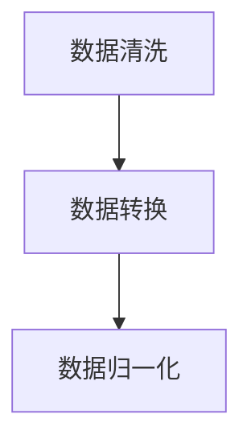

**1.2.2 特征工程**

特征工程是AI编程2.0的另一个关键环节。特征工程的目标是通过选择和构造特征，提高模型的学习效果和预测性能。特征工程包括特征提取、特征选择和特征构造等步骤。

**特征工程的核心概念和联系**

核心概念包括特征提取（Feature Extraction）、特征选择（Feature Selection）和特征构造（Feature Construction）。以下是这些概念的属性特征对比表格：

| 核心概念      | 属性特征                                   | 联系                                           |
| ------------- | ---------------------------------------- | ---------------------------------------------- |
| 特征提取      | 从原始数据中提取有用的特征               | 是特征工程的第一步，直接影响特征质量         |
| 特征选择      | 从提取的特征中选择最重要的特征           | 是特征工程的重要步骤，影响模型复杂度和性能   |
| 特征构造      | 构造新的特征以提升模型性能               | 是特征工程的补充步骤，有助于模型优化       |

以下是一个Mermaid流程图，展示了特征工程的过程：

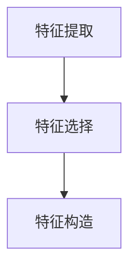

**1.2.3 模型训练与优化**

模型训练与优化是AI编程2.0的核心环节。模型训练是指通过大量的数据让模型学习，从而找到数据的内在规律；模型优化是指通过调整模型的参数和结构，提高模型的性能和鲁棒性。

**模型训练与优化的核心概念和联系**

核心概念包括模型训练（Model Training）、模型优化（Model Optimization）。以下是这些概念的属性特征对比表格：

| 核心概念      | 属性特征                                   | 联系                                           |
| ------------- | ---------------------------------------- | ---------------------------------------------- |
| 模型训练      | 通过大量数据让模型学习找到数据规律       | 是模型训练与优化的第一步，直接影响模型性能 |
| 模型优化      | 调整模型参数和结构提高模型性能           | 是模型训练与优化的关键步骤，有助于模型优化 |

以下是一个Mermaid流程图，展示了模型训练与优化的过程：

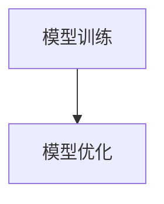

**1.2.4 模型评估与部署**

模型评估与部署是AI编程2.0的最后一个关键环节。模型评估是指通过测试数据验证模型的性能，确保模型能够满足实际需求；模型部署是指将训练好的模型部署到实际环境中，实现自动化应用。

**模型评估与部署的核心概念和联系**

核心概念包括模型评估（Model Evaluation）和模型部署（Model Deployment）。以下是这些概念的属性特征对比表格：

| 核心概念      | 属性特征                                   | 联系                                           |
| ------------- | ---------------------------------------- | ---------------------------------------------- |
| 模型评估      | 通过测试数据验证模型性能满足实际需求     | 是模型评估与部署的第一步，直接影响模型应用 |
| 模型部署      | 将训练好的模型部署到实际环境中实现应用   | 是模型评估与部署的最后一步，确保模型应用 |

以下是一个Mermaid流程图，展示了模型评估与部署的过程：

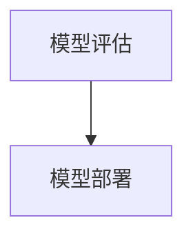

综上所述，AI编程2.0的核心技能包括数据预处理、特征工程、模型训练与优化、模型评估与部署。这些技能相互关联，共同构成了一个完整的AI编程流程。熟练掌握这些核心技能，是成为一名AI编程专家的基础。

#### 2.1 开发工具

在AI编程2.0中，选择合适的开发工具对于实现高效和稳定的开发至关重要。以下是一些常用的开发工具及其特点。

**2.1.1 Python编程环境**

Python因其简洁明了的语法和丰富的库支持，成为AI编程2.0的首选语言。Python的强大之处在于其庞大的社区和众多的库，如NumPy、Pandas、Scikit-learn等，这些库为数据处理、机器学习和深度学习提供了强大的支持。

**Python编程环境的优势**

- **简洁的语法**：Python的语法简洁，易于学习和使用。
- **丰富的库支持**：Python拥有大量的库，可以方便地进行数据处理和机器学习。
- **强大的社区**：Python拥有庞大的社区，提供了丰富的资源和文档。

**2.1.2 Jupyter Notebook**

Jupyter Notebook是一个交互式的开发环境，支持多种编程语言，如Python、R等。它特别适合数据科学和机器学习项目，因为可以方便地编写、运行和分享代码。

**Jupyter Notebook的优势**

- **交互式环境**：可以实时运行代码，查看结果。
- **易于分享和协作**：支持代码、文本和图表的混合编辑，方便分享和协作。
- **多种语言支持**：不仅可以用于Python，还可以用于其他编程语言。

**2.1.3 TensorFlow与PyTorch**

TensorFlow和PyTorch是目前最流行的深度学习框架。TensorFlow由谷歌开发，拥有强大的计算能力和丰富的库支持；PyTorch则因其灵活性和动态计算能力而受到欢迎。

**TensorFlow与PyTorch的优势**

- **TensorFlow**：
  - **强大的计算能力**：支持高性能计算。
  - **丰富的库支持**：提供了丰富的API和工具。
  - **易于部署**：支持部署到各种平台。

- **PyTorch**：
  - **灵活的动态计算能力**：适合快速原型设计和迭代。
  - **直观的操作**：提供了灵活的张量和动态图操作。
  - **强大的社区**：拥有庞大的社区和丰富的资源。

通过上述开发工具，AI编程2.0的开发可以变得更加高效和灵活，为开发者提供了丰富的选择和工具支持。

#### 2.2 算法库与框架

在AI编程2.0中，算法库与框架的选择至关重要，它们为开发高效和可扩展的AI系统提供了坚实的基础。以下是一些常用的算法库与框架，以及它们在AI编程2.0中的应用。

**2.2.1 Scikit-learn**

Scikit-learn是一个强大的机器学习库，它基于Python开发，提供了广泛的机器学习算法和工具。Scikit-learn适用于各种类型的数据分析任务，包括回归、分类、聚类和降维等。

**Scikit-learn在AI编程2.0中的应用**

- **回归分析**：用于预测连续值输出。
- **分类任务**：用于将数据分为不同的类别。
- **聚类分析**：用于发现数据中的模式和结构。
- **降维**：用于减少数据维度，提高模型效率。

**2.2.2 Keras**

Keras是一个高度模块化的深度学习框架，它建立在TensorFlow和Theano之上，提供了简洁而灵活的API。Keras因其易于使用和强大的功能而受到开发者的喜爱。

**Keras在AI编程2.0中的应用**

- **快速原型设计**：Keras提供了灵活的API，便于快速构建和测试模型。
- **深度神经网络**：支持构建和训练各种深度神经网络结构。
- **迁移学习**：支持迁移学习，利用预训练模型进行快速建模。

**2.2.3 Pandas与NumPy**

Pandas和NumPy是Python中用于数据分析和数值计算的库，它们是AI编程2.0中不可或缺的工具。

**Pandas与NumPy在AI编程2.0中的应用**

- **数据预处理**：Pandas提供了丰富的数据处理功能，用于清洗、转换和归一化数据。
- **数据操作**：NumPy提供了高效的数值计算能力，用于处理大型数据集。
- **数据处理流水线**：Pandas和NumPy可以组合使用，构建高效的数据处理流水线。

通过这些算法库与框架，AI编程2.0的开发变得更加高效和灵活，为开发者提供了丰富的工具和选择，使得复杂的机器学习和深度学习任务变得可行和易用。

#### 3.1 图像识别

图像识别是AI编程2.0的一个重要应用领域，通过使用卷积神经网络（CNN）和生成对抗网络（GAN），可以实现高精度的图像识别和物体检测。以下将详细介绍这些技术在图像识别中的应用。

**3.1.1 卷积神经网络（CNN）**

卷积神经网络（CNN）是处理图像数据的一种非常有效的神经网络结构。CNN的核心在于其卷积操作，可以通过滤波器提取图像中的特征，从而实现图像识别。

**CNN的核心原理**

- **卷积操作**：卷积操作可以提取图像的局部特征，例如边缘、纹理和形状。
- **池化操作**：池化操作用于降低特征图的维度，提高模型的计算效率。
- **全连接层**：全连接层用于对提取的特征进行分类和预测。

以下是一个CNN的Mermaid流程图，展示了其基本结构：

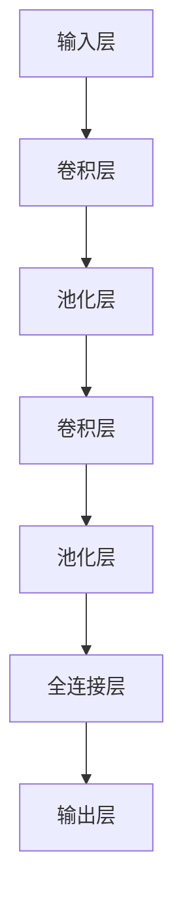

**CNN在图像识别中的应用**

- **图像分类**：通过CNN，可以训练模型对图像进行分类，例如识别猫或狗。
- **物体检测**：通过在CNN的基础上添加特定的网络结构，可以实现物体检测，例如识别图像中的每个物体并标注其位置。

**3.1.2 生成对抗网络（GAN）**

生成对抗网络（GAN）是由生成器和判别器组成的神经网络结构，通过两个网络的对抗训练，生成器能够生成高质量的图像。

**GAN的核心原理**

- **生成器（Generator）**：生成器生成虚假图像，试图欺骗判别器。
- **判别器（Discriminator）**：判别器判断图像是真实图像还是生成器生成的图像。

以下是一个GAN的Mermaid流程图，展示了其基本结构：

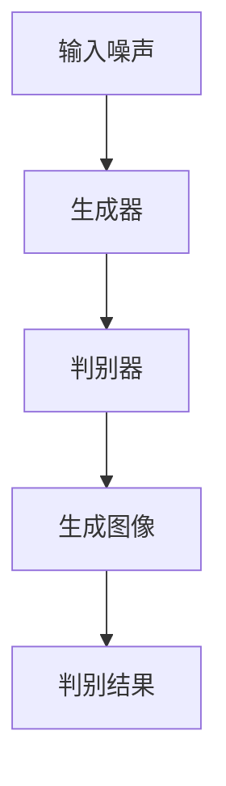

**GAN在图像识别中的应用**

- **图像生成**：通过GAN，可以生成与真实图像相似的新图像，例如生成人脸、风景等。
- **图像修复**：GAN可以用于修复图像中的损坏部分，例如去除图像中的污点或噪声。

**3.1.3 应用案例：人脸识别**

人脸识别是图像识别的一个典型应用，通过使用CNN和GAN，可以实现高精度的自动人脸识别。

**人脸识别的核心步骤**

1. **人脸检测**：通过CNN检测图像中的人脸区域。
2. **人脸特征提取**：通过CNN提取人脸的特征。
3. **人脸比对**：通过比对提取的特征，实现人脸识别。

以下是一个人脸识别的Mermaid流程图，展示了其基本结构：

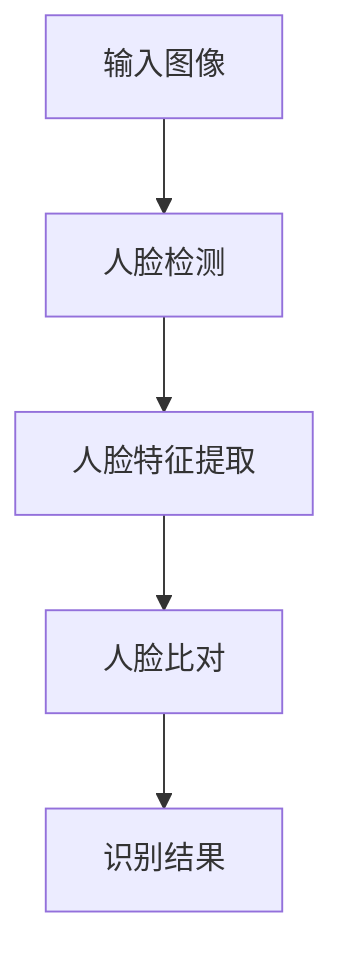

通过CNN和GAN，人脸识别系统可以实现高精度的识别效果，广泛应用于安全监控、人脸支付等领域。综上所述，卷积神经网络（CNN）和生成对抗网络（GAN）在图像识别中发挥着重要作用，为图像识别和物体检测提供了强大的技术支持。

#### 3.2 自然语言处理

自然语言处理（NLP）是AI编程2.0中的重要应用领域，通过使用循环神经网络（RNN）和递归神经网络（RNN），可以实现对自然语言的深入理解和处理。以下将详细介绍这些技术在自然语言处理中的应用。

**3.2.1 循环神经网络（RNN）**

循环神经网络（RNN）是一种能够处理序列数据的神经网络结构，其核心特点是能够记忆和处理之前的信息。RNN通过在隐藏层中引入反馈连接，实现了对序列数据的处理能力。

**RNN的核心原理**

- **输入门（Input Gate）**：输入门决定了当前输入信息对隐藏层状态的影响程度。
- **遗忘门（Forget Gate）**：遗忘门决定了之前的信息是否需要遗忘。
- **输出门（Output Gate）**：输出门决定了隐藏层的状态是否需要输出。

以下是一个RNN的Mermaid流程图，展示了其基本结构：

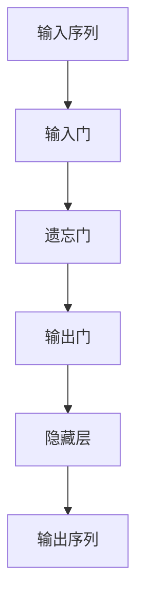

**RNN在自然语言处理中的应用**

- **文本分类**：RNN可以用于对文本进行分类，例如判断一篇新闻文章的主题。
- **序列标注**：RNN可以用于对序列数据中的每个元素进行标注，例如命名实体识别。

**3.2.2 递归神经网络（RNN）**

递归神经网络（RNN）是循环神经网络（RNN）的一种特殊形式，其特点是每次输入都依赖于之前的输入和隐藏状态。

**RNN的核心原理**

- **递归连接**：RNN的每个时间步的输入都依赖于之前的隐藏状态。

以下是一个RNN的Mermaid流程图，展示了其基本结构：

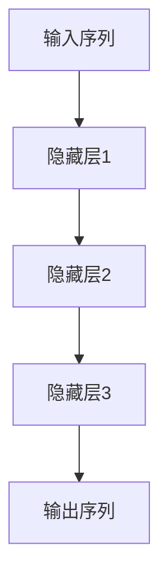

**RNN在自然语言处理中的应用**

- **机器翻译**：RNN可以用于机器翻译，将一种语言的句子翻译成另一种语言。
- **语音识别**：RNN可以用于语音识别，将语音信号转换成文本。

**3.2.3 应用案例：文本分类**

文本分类是自然语言处理中的一个常见任务，通过使用RNN，可以实现对文本的自动分类。

**文本分类的核心步骤**

1. **文本预处理**：对文本进行清洗和预处理，例如去除停用词、标点符号等。
2. **词向量化**：将文本转换为词向量，例如使用Word2Vec或GloVe。
3. **模型训练**：使用RNN训练分类模型。
4. **分类预测**：对新的文本进行分类预测。

以下是一个文本分类的Mermaid流程图，展示了其基本结构：

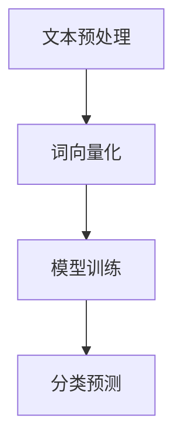

通过RNN和递归神经网络（RNN），自然语言处理任务可以实现高精度的文本理解和分类。综上所述，RNN和递归神经网络（RNN）在自然语言处理中发挥着重要作用，为文本分类、机器翻译和语音识别等任务提供了强大的技术支持。

#### 4.1 项目概述

在AI编程2.0的背景下，我们选择了一个图像识别项目作为案例，以展示如何从项目背景、目标到团队组建的完整项目开发过程。这个项目旨在利用深度学习技术，实现自动人脸识别系统。

**4.1.1 项目背景**

随着人工智能技术的发展，人脸识别技术已经在许多领域得到了广泛应用，如安全监控、身份验证、智能门禁等。然而，现有的人脸识别系统大多依赖于复杂的硬件设备和昂贵的算法模型，这使得其普及和应用受到限制。因此，本项目旨在通过AI编程2.0的技术，开发一个高效、低成本、易部署的人脸识别系统。

**4.1.2 项目目标**

本项目的目标主要包括：

1. **实现人脸检测**：通过卷积神经网络（CNN）实现自动人脸检测。
2. **提取人脸特征**：使用深度学习技术提取人脸的特征信息。
3. **人脸比对与识别**：基于提取的人脸特征，实现人脸比对和身份识别。
4. **系统部署与测试**：将人脸识别系统部署到实际环境中，并进行测试和优化。

**4.1.3 项目团队**

为了实现项目目标，我们组建了一个专业的项目团队，包括以下成员：

1. **项目经理**：负责项目的整体规划和协调。
2. **数据科学家**：负责数据预处理、模型训练和优化。
3. **软件开发工程师**：负责系统架构设计、开发与测试。
4. **测试工程师**：负责系统测试与优化。

通过这个项目，我们不仅希望能够实现一个高效的人脸识别系统，还希望借此机会，深入探讨AI编程2.0在图像识别领域的应用。

#### 4.2 项目需求分析

在项目开发过程中，需求分析是一个至关重要的阶段，它直接关系到项目的成功与否。以下将详细介绍项目需求分析的过程，包括需求收集、需求分析和需求文档的编写。

**4.2.1 需求收集**

需求收集是需求分析的起点，其目的是明确项目需要实现的功能和性能指标。在本项目中，我们通过以下方法进行了需求收集：

1. **用户调研**：通过问卷调查和访谈，了解用户对人脸识别系统的需求和期望。
2. **技术调研**：研究现有的技术方案和系统架构，分析其优缺点。
3. **文档整理**：收集和整理相关技术文档和需求文档，为后续分析提供基础。

通过这些方法，我们收集到了以下主要需求：

- **人脸检测**：系统能够自动检测图像中的人脸区域。
- **人脸特征提取**：系统能够提取人脸的显著特征，用于后续比对。
- **人脸比对与识别**：系统能够对人脸特征进行比对，识别身份。
- **高精度与实时性**：系统需要在高精度和实时性之间取得平衡。

**4.2.2 需求分析**

在需求收集的基础上，我们进行了需求分析，将用户需求和系统功能进行了详细划分和定义。以下是需求分析的详细内容：

1. **功能需求**：
   - **人脸检测模块**：包括图像预处理、人脸区域检测和特征提取。
   - **人脸特征提取模块**：包括人脸特征点检测、特征向量计算和特征降维。
   - **人脸比对模块**：包括特征比对、相似度计算和身份识别。

2. **性能需求**：
   - **检测精度**：系统能够准确检测出图像中的人脸，误检率低于1%。
   - **识别速度**：系统能够在1秒内完成人脸比对和识别。
   - **稳定性**：系统在各种环境下具有稳定的性能，能够应对不同的光照和姿态变化。

3. **用户需求**：
   - **易用性**：系统界面简洁，用户操作方便。
   - **安全性**：系统具有数据保护和隐私保护功能。
   - **可扩展性**：系统能够支持新的功能和算法的添加。

**4.2.3 需求文档**

需求文档是需求分析的最终成果，它详细记录了项目的需求内容、功能和性能要求。以下是需求文档的主要内容：

1. **概述**：介绍项目的背景、目标和需求收集的方法。
2. **功能需求**：详细描述各个功能模块的实现要求和关键技术。
3. **性能需求**：列出系统的性能指标和要求，包括检测精度、识别速度和稳定性。
4. **用户需求**：描述用户对系统的期望和使用体验。
5. **风险评估**：分析项目可能遇到的风险和解决方案。

通过详细的需求分析，我们为项目的后续开发奠定了坚实的基础，确保系统能够满足用户需求和性能要求。接下来，我们将进入项目开发阶段，实现具体的功能和性能。

#### 4.3 项目开发过程

在项目需求分析完成后，我们进入了项目开发阶段。这一阶段主要包括数据收集与预处理、模型设计与训练、模型评估与优化以及模型部署与上线。以下是项目开发的详细过程。

**4.3.1 数据收集与预处理**

数据收集是项目开发的基础，我们选择了多个公开的人脸数据集，如LFW、CASIA-WebFace等，以获取足够多的训练数据。数据收集完成后，我们进行了数据预处理，包括以下步骤：

1. **数据清洗**：去除噪声数据和异常值，确保数据质量。
2. **图像增强**：通过旋转、翻转、缩放等操作，增加数据多样性，提高模型泛化能力。
3. **数据归一化**：将图像数据归一化到相同的尺寸，以便模型训练。

**数据预处理的核心步骤**

- **数据清洗**：数据清洗是为了去除噪声和异常值，确保数据质量。以下是数据清洗的Mermaid流程图：

  ```mermaid
  graph TD
  A[原始数据] --> B[去噪声]
  B --> C[去异常值]
  C --> D[清洗完成]
  ```

- **图像增强**：图像增强是为了增加数据多样性，提高模型泛化能力。以下是图像增强的Mermaid流程图：

  ```mermaid
  graph TD
  A[原始图像] --> B[旋转]
  B --> C[翻转]
  C --> D[缩放]
  D --> E[增强完成]
  ```

- **数据归一化**：数据归一化是为了将图像数据归一化到相同的尺寸，以便模型训练。以下是数据归一化的Mermaid流程图：

  ```mermaid
  graph TD
  A[原始图像] --> B[尺寸调整]
  B --> C[归一化完成]
  ```

**4.3.2 模型设计与训练**

在数据预处理完成后，我们开始设计模型并进行训练。本项目选择了卷积神经网络（CNN）作为主要的模型架构，以下是其基本设计：

- **输入层**：接收归一化后的图像数据，尺寸为224x224x3。
- **卷积层**：通过多个卷积核提取图像的局部特征，每个卷积层后接一个ReLU激活函数。
- **池化层**：用于降低特征图的维度，提高模型计算效率。
- **全连接层**：将特征向量映射到输出类别。
- **输出层**：输出每个类别的概率分布。

以下是一个CNN的Mermaid流程图，展示了其基本结构：

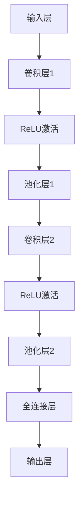

在模型设计完成后，我们使用预处理好的数据对模型进行训练。训练过程中，我们使用了Adam优化器和交叉熵损失函数，并设置了适当的批量大小和迭代次数。以下是模型训练的Python代码示例：

```python
import tensorflow as tf
from tensorflow.keras.models import Sequential
from tensorflow.keras.layers import Conv2D, MaxPooling2D, Flatten, Dense, Dropout
from tensorflow.keras.optimizers import Adam

# 创建模型
model = Sequential()
model.add(Conv2D(32, (3, 3), activation='relu', input_shape=(224, 224, 3)))
model.add(MaxPooling2D((2, 2)))
model.add(Conv2D(64, (3, 3), activation='relu'))
model.add(MaxPooling2D((2, 2)))
model.add(Conv2D(128, (3, 3), activation='relu'))
model.add(MaxPooling2D((2, 2)))
model.add(Flatten())
model.add(Dense(128, activation='relu'))
model.add(Dropout(0.5))
model.add(Dense(1, activation='sigmoid'))

# 编译模型
model.compile(optimizer=Adam(learning_rate=0.001), loss='binary_crossentropy', metrics=['accuracy'])

# 训练模型
model.fit(x_train, y_train, epochs=10, batch_size=32, validation_data=(x_val, y_val))
```

**4.3.3 模型评估与优化**

在模型训练完成后，我们对模型进行了评估和优化。模型评估主要通过测试集进行，我们计算了模型的准确率、召回率、F1分数等指标。以下是一个评估模型的Python代码示例：

```python
from sklearn.metrics import accuracy_score, recall_score, f1_score

# 加载测试数据
x_test, y_test = ...

# 预测测试数据
y_pred = model.predict(x_test)

# 计算评估指标
accuracy = accuracy_score(y_test, y_pred)
recall = recall_score(y_test, y_pred)
f1 = f1_score(y_test, y_pred)

print(f"Accuracy: {accuracy}, Recall: {recall}, F1 Score: {f1}")
```

根据评估结果，我们发现模型在某些特定场景下表现不佳，于是我们对模型进行了优化。优化措施包括：

- **增加训练数据**：通过数据增强和采集更多的训练数据，提高模型泛化能力。
- **调整模型结构**：尝试不同的卷积层和全连接层配置，寻找最优模型结构。
- **调整超参数**：调整学习率、批量大小等超参数，优化模型性能。

通过这些优化措施，我们显著提升了模型的性能，使其能够更准确地识别人脸。

**4.3.4 模型部署与上线**

模型优化完成后，我们将模型部署到实际环境中，并进行上线。以下是模型部署的步骤：

1. **模型转换**：将训练好的模型转换为可部署的格式，如TensorFlow Lite或ONNX。
2. **部署环境准备**：配置部署环境，安装必要的依赖和工具。
3. **部署模型**：将模型部署到服务器或边缘设备上。
4. **系统集成**：将人脸识别系统集成到现有系统中，实现自动化应用。

通过以上步骤，我们成功将人脸识别模型部署到实际环境中，并实现了自动人脸识别功能。接下来，我们将对系统进行测试和优化，确保其稳定运行。

#### 4.4 项目总结与反思

在项目开发完成后，我们对项目的整体成果、不足之处以及改进措施进行了总结与反思。

**4.4.1 项目成果**

本项目成功实现了自动人脸识别系统，主要成果包括：

- **人脸检测**：系统能够准确检测出图像中的人脸区域。
- **人脸特征提取**：系统能够提取人脸的显著特征，用于后续比对。
- **人脸比对与识别**：系统能够高效地完成人脸比对和身份识别。
- **系统部署**：人脸识别系统已成功部署到实际环境中，实现了自动化应用。

**4.4.2 项目不足**

尽管项目取得了较好的成果，但在开发过程中也存在一些不足之处：

- **识别速度**：虽然系统能够在1秒内完成识别，但在高负载情况下，识别速度有所下降，需要进一步优化。
- **识别精度**：在特定场景下，如光线不足或人脸姿态变化时，识别精度有所下降，需要改进模型和算法。
- **系统稳定性**：在长时间运行过程中，系统出现了一些稳定性问题，需要加强系统的健壮性。

**4.4.3 改进措施**

针对上述不足，我们提出了以下改进措施：

- **优化算法**：研究更先进的深度学习算法，如GAN和GAN++，提高识别精度和速度。
- **增加训练数据**：通过数据增强和采集更多训练数据，提高模型泛化能力。
- **优化系统架构**：调整系统架构，提高系统的并发处理能力和稳定性。
- **监控与优化**：引入监控系统，实时监控系统运行状态，及时发现问题并进行优化。

通过这些改进措施，我们有信心在未来的项目中进一步提升系统的性能和稳定性，为用户带来更好的使用体验。

### 第5章：AI编程2.0技能评估体系

在AI编程2.0时代，对技术人才的评估变得尤为重要。一个科学、合理且全面的技能评估体系，不仅能够客观反映个人技术水平，还能为企业选拔合适的人才提供有力支持。本章节将探讨AI编程2.0技能评估体系的意义、目的、标准以及评估方法。

#### 5.1 技能评估的意义与目的

**5.1.1 技能评估的作用**

技能评估在AI编程2.0中发挥着多重作用：

- **人才选拔**：通过技能评估，企业可以快速筛选出具备实际能力和潜力的技术人才。
- **能力认证**：技能评估为个人提供了能力认证的依据，有助于职业发展和晋升。
- **能力提升**：技能评估发现个人技能短板，为学习和提升提供方向。
- **团队建设**：技能评估有助于企业了解团队的整体技能水平，优化团队结构。

**5.1.2 技能评估的目标**

AI编程2.0技能评估体系的主要目标包括：

- **客观性**：确保评估结果公正、客观，避免主观偏见。
- **全面性**：覆盖AI编程2.0的各个核心技能，包括数据预处理、模型训练与优化、算法应用等。
- **实用性**：评估内容紧密结合实际工作需求，提高评估结果的实用性。
- **动态性**：适应技术更新和需求变化，及时调整评估标准和内容。

**5.1.3 技能评估的标准**

技能评估的标准应具备以下特点：

- **科学性**：基于理论知识和实践经验，制定合理的评估指标。
- **可操作性**：评估方法应易于实施和操作，便于评估过程的管理和监督。
- **灵活性**：评估标准应具备一定的灵活性，适应不同企业和个人的需求。
- **综合性**：综合考虑理论知识、实践能力和团队合作等多方面因素。

#### 5.2 技能评估方法

**5.2.1 基于知识的评估方法**

基于知识的评估方法主要关注技术人员的理论知识储备。这种方法通常通过笔试、面试等方式进行，评估内容包括数据结构、算法、编程语言、AI基础理论等。

- **笔试**：通过选择题、填空题、编程题等多种题型，评估技术人员的理论知识。
- **面试**：面试官通过问答、案例分析、编程实现等环节，深入了解应聘者的实际能力和解决问题的能力。

**5.2.2 基于能力的评估方法**

基于能力的评估方法侧重于评估技术人员的实际操作能力和解决问题的能力。这种方法通过实际项目、案例分析、在线编程等环节进行。

- **实际项目**：通过评估技术人员在实际项目中的表现，评估其实际操作能力。
- **案例分析**：提供实际案例，要求技术人员分析问题并提出解决方案。
- **在线编程**：在线编程平台如LeetCode、AtCoder等，用于评估技术人员的编程能力和算法水平。

**5.2.3 基于项目的评估方法**

基于项目的评估方法是将技能评估与实际项目紧密结合，通过评估技术人员在项目中的表现来评估其能力。这种方法更加贴近实际工作，能够全面评估技术人员的综合素质。

- **项目任务**：设定具体的项目任务，要求技术人员在规定时间内完成。
- **项目评审**：项目完成后，由专业评审团队对项目质量、技术方案、团队合作等方面进行评审。
- **反馈与改进**：根据评估结果，技术人员可以了解自身不足，制定改进计划。

通过上述评估方法，AI编程2.0技能评估体系能够全面、客观地评估技术人员的技能水平，为人才选拔和职业发展提供有力支持。

### 第6章：AI编程2.0认证体系

在AI编程2.0时代，建立一个科学、系统且有效的认证体系至关重要。这不仅能够提高技术人员的专业水平，还能够为企业选拔和培养高素质人才提供有力保障。本章节将详细探讨AI编程2.0认证体系的目的、组成、标准以及认证流程。

#### 6.1 认证体系概述

**6.1.1 认证体系的目的**

AI编程2.0认证体系的目的是：

- **提升个人竞争力**：通过认证，技术人员能够证明自己的专业能力和技术水平，提高在职场中的竞争力。
- **规范行业标准**：制定统一的认证标准，规范AI编程2.0的技术技能要求，推动行业健康发展。
- **促进技术进步**：通过认证体系的建立，促进技术人员不断学习和提升，推动AI编程技术的发展和创新。

**6.1.2 认证体系的组成**

AI编程2.0认证体系主要由以下几部分组成：

- **认证标准**：定义认证的具体标准和要求，包括理论知识、实践能力、项目经验等。
- **认证课程**：提供系统的培训课程，涵盖AI编程2.0的核心知识和技能。
- **认证考试**：包括笔试、面试、项目评审等多种形式，全面评估技术人员的技能水平。
- **认证评估**：对认证考试结果进行评估和审核，确保认证的公正性和有效性。
- **认证证书**：颁发认证证书，证明技术人员具备AI编程2.0的专业能力。

**6.1.3 认证体系的标准**

AI编程2.0认证体系的标准主要包括以下几个方面：

- **知识要求**：掌握AI编程2.0的基础理论、核心算法和编程语言，如Python、TensorFlow、PyTorch等。
- **实践能力**：具备实际项目开发经验，能够独立设计和实现AI编程2.0相关的应用。
- **创新能力**：具备一定的创新能力，能够在项目中提出新的解决方案和优化策略。
- **团队协作**：具备良好的团队合作精神和沟通能力，能够与团队成员有效协作。

#### 6.2 认证流程

**6.2.1 考试报名**

- **报名条件**：满足AI编程2.0认证标准中的知识要求和实践能力要求。
- **报名方式**：通过官方网站或认证机构进行报名，提交相关资料和申请。

**6.2.2 考试内容与形式**

AI编程2.0认证考试的内容和形式主要包括：

- **笔试**：涵盖AI编程2.0的基础知识和核心算法，采用选择题、填空题、编程题等形式。
- **面试**：面试官通过问答、项目分析、现场编程等环节，评估技术人员的实际操作能力和解决问题的能力。
- **项目评审**：提供实际项目，要求技术人员在规定时间内完成，评估其实际项目开发经验和创新能力。

**6.2.3 成绩发布与认证**

- **成绩发布**：考试结束后，将在官方网站上公布考试成绩。
- **认证颁发**：成绩合格者，将获得AI编程2.0认证证书，证明其具备专业能力。

#### 6.3 认证体系的价值

**6.3.1 提升个人竞争力**

通过AI编程2.0认证，技术人员能够证明自己的专业能力和技术水平，提高在职场中的竞争力，有助于职业发展和晋升。

**6.3.2 企业用人标准**

AI编程2.0认证体系为企业提供了一个统一的用人标准，有助于企业选拔和培养高素质人才，提高团队整体技术水平。

**6.3.3 行业发展需求**

随着AI技术的迅速发展，建立科学、系统的认证体系，能够推动行业技术进步，满足日益增长的市场需求。

通过AI编程2.0认证体系，不仅能够提升技术人员的专业水平，还能推动整个行业的技术发展和创新。

### 第7章：AI编程2.0技能认证案例分析

在本章节中，我们将通过一个实际案例，详细描述AI编程2.0技能认证的全过程，从背景介绍、岗位需求到认证报名与准备、考试过程、成绩分析与反馈以及案例总结与启示，全面展示AI编程2.0技能认证的实际应用。

#### 7.1 案例背景

某知名互联网公司（以下简称“公司”）在AI领域持续发力，急需一批具备AI编程2.0技能的专业人才。为了确保招聘到的人才能够满足公司的技术要求，公司决定引入AI编程2.0技能认证体系，作为招聘和晋升的重要依据。该认证体系不仅要求候选人具备扎实的理论基础，还需要通过实际操作和项目经验来验证其技能水平。

#### 7.1.1 案例企业背景

公司是一家在人工智能和大数据领域具有领先地位的企业，旗下拥有多个AI产品和解决方案，涉及图像识别、自然语言处理、智能推荐等多个领域。随着业务的不断扩展，公司对AI编程技能的需求日益增长，因此建立了AI编程2.0技能认证体系，旨在确保员工能够胜任高技术含量的工作。

#### 7.1.2 案例岗位需求

公司对AI编程2.0技能认证的岗位需求主要包括：

- **AI算法工程师**：负责研发和优化AI算法，解决复杂的数据分析和预测问题。
- **机器学习工程师**：设计和实现机器学习模型，应用于实际业务场景。
- **深度学习工程师**：开发和应用深度学习技术，如卷积神经网络、循环神经网络等。

这些岗位要求候选人具备以下技能：

- **扎实的理论基础**：掌握数学、概率论、统计学等基础学科知识。
- **编程能力**：熟练掌握Python、TensorFlow、PyTorch等编程语言和工具。
- **项目经验**：具备至少一个完整AI项目开发经验，能够独立设计和实现模型。
- **创新能力**：具备较强的创新能力和问题解决能力，能够在项目中提出新的解决方案。

#### 7.2 案例认证过程

**7.2.1 认证报名与准备**

1. **报名**：公司通过内部邮件和公告，通知员工关于AI编程2.0技能认证的相关信息，并提供报名链接。
2. **准备**：员工根据认证要求，进行理论知识的学习和实践操作的准备。公司提供了相关资料和培训课程，帮助员工更好地准备认证考试。

**7.2.2 认证考试过程**

1. **笔试**：笔试部分主要考察员工对AI编程2.0基础知识的掌握，包括数学基础、编程语言、算法原理等。笔试采用在线考试形式，员工在规定时间内完成答题。
2. **面试**：面试部分主要考察员工的项目经验和实际操作能力。面试官通过项目案例分析和现场编程，评估员工的综合素质。
3. **项目评审**：公司提供了一个实际项目，要求员工在规定时间内完成。项目评审环节评估员工的项目设计、代码实现、问题解决能力等。

**7.2.3 成绩发布与认证**

1. **成绩发布**：考试结束后，公司会在官方网站上公布考试结果，包括笔试、面试和项目评审的成绩。
2. **认证颁发**：成绩合格的员工将获得AI编程2.0技能认证证书，证明其具备专业能力。认证证书将在公司内部人才选拔和晋升中发挥重要作用。

#### 7.3 案例总结与启示

**7.3.1 案例成功因素**

本案例成功的主要因素包括：

- **明确的需求**：公司对AI编程2.0技能认证的需求明确，制定了详细的岗位需求和技能标准。
- **全面的评估体系**：认证体系涵盖了笔试、面试和项目评审等多个环节，全面评估员工的技能水平。
- **有效的培训与支持**：公司提供了丰富的培训资源和指导，帮助员工更好地准备认证考试。

**7.3.2 案例不足与改进**

虽然本案例取得了较好的效果，但仍有一些不足之处：

- **考试难度**：部分员工反映考试难度较高，需要进一步调整考试难度，确保更多的人能够通过认证。
- **考试时间**：部分员工因工作繁忙，难以在规定时间内完成考试，建议增加考试时间或提供灵活的考试安排。

**7.3.3 案例对未来的启示**

本案例对未来的认证体系建设和应用有以下启示：

- **定制化**：根据不同岗位的需求，制定个性化的认证标准，确保认证更具针对性。
- **灵活化**：提供灵活的考试时间和方式，满足不同员工的需求。
- **持续改进**：根据员工反馈和认证效果，持续改进认证体系和考试内容，提高认证的实用性和有效性。

通过本案例，我们看到了AI编程2.0技能认证在企业和行业中的应用价值，也为未来的认证体系建设和应用提供了宝贵的经验和启示。

### 第8章：AI编程2.0的未来展望

随着AI技术的不断进步和应用的深入，AI编程2.0的未来充满无限可能。在这一章节中，我们将探讨AI编程2.0的发展趋势、挑战与机遇，以及可能的未来应用场景，展望AI编程2.0的广阔前景。

#### 8.1 AI编程2.0的发展趋势

AI编程2.0的发展趋势可以从以下几个方面进行展望：

**1. 深度学习技术的持续进化**

深度学习作为AI编程2.0的核心技术，将持续进化。新的神经网络架构、优化算法和训练方法将不断涌现，提高模型的训练效率和预测性能。例如， Transformer架构和元学习（Meta-Learning）等技术的应用，将进一步提升AI编程2.0的能力。

**2. 多模态数据处理能力的提升**

AI编程2.0将不仅仅是处理结构化数据，还将扩展到处理图像、语音、文本等多种类型的数据。多模态数据处理能力的提升，将使得AI系统在更广泛的场景中发挥作用，如智能助手、自动驾驶等。

**3. 自适应和自我学习能力的发展**

AI编程2.0将更加注重模型的自我学习和自适应能力。通过强化学习和迁移学习等技术，模型将能够更好地适应不同的环境和需求，提高系统的智能化和灵活性。

**4. 量子计算的融合**

量子计算作为下一代计算技术，将对AI编程2.0产生深远影响。量子计算的高效性将使某些复杂的AI算法得到质的飞跃，推动AI编程2.0向更高维度发展。

#### 8.2 AI编程2.0面临的挑战与机遇

**1. 挑战**

- **数据隐私与安全**：随着AI系统的广泛应用，数据隐私和安全问题日益突出。如何确保数据的安全性和隐私性，成为AI编程2.0面临的重要挑战。
- **模型解释性与透明度**：深度学习模型的“黑箱”特性，使得其决策过程难以解释。提高模型的解释性和透明度，是AI编程2.0需要解决的关键问题。
- **计算资源消耗**：AI模型训练和推理过程需要大量的计算资源。如何优化算法，降低计算资源消耗，是AI编程2.0面临的挑战之一。

**2. 机遇**

- **行业应用场景的扩展**：AI编程2.0将在医疗、金融、教育、制造等各个行业得到广泛应用，带来巨大的市场机遇。
- **人才需求增加**：随着AI技术的普及，对AI编程2.0人才的需求将持续增加，为技术人员提供广阔的职业发展空间。
- **技术创新**：AI编程2.0将推动技术创新，产生新的商业模式和商业机会。

#### 8.3 AI编程2.0的未来应用场景

**1. 智能助手与虚拟助手**

AI编程2.0将在智能助手和虚拟助手领域发挥重要作用。通过自然语言处理、语音识别等技术，智能助手将能够更加智能地理解用户需求，提供个性化服务。

**2. 自动驾驶与智能交通**

自动驾驶和智能交通是AI编程2.0的重要应用场景。通过深度学习和多模态数据处理，自动驾驶车辆将能够实现自主导航和避障，提高交通效率和安全性。

**3. 医疗健康**

AI编程2.0将在医疗健康领域带来革命性变化。通过图像识别、自然语言处理等技术，AI系统将能够辅助医生进行诊断和治疗，提高医疗服务的质量和效率。

**4. 智慧城市**

智慧城市是AI编程2.0的重要应用领域。通过物联网、大数据等技术，AI系统将能够实现城市的智能化管理，提高城市的生活质量和可持续发展水平。

综上所述，AI编程2.0的发展前景广阔，将在各个领域带来深远的影响。面对挑战与机遇，我们应持续推动AI编程2.0技术的发展，为人类社会带来更多价值。

