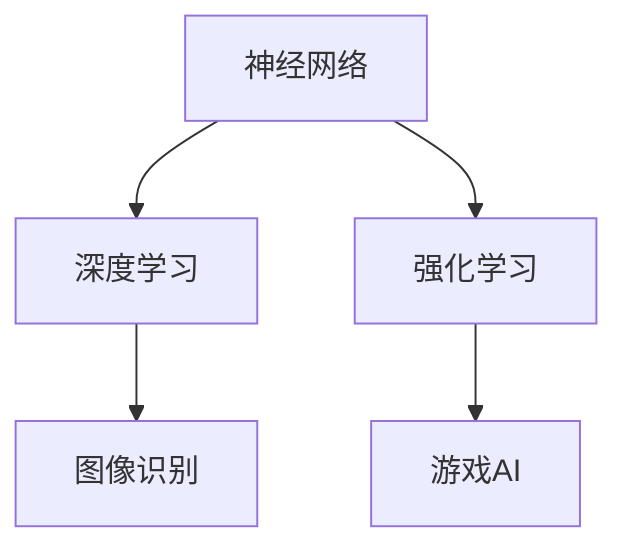
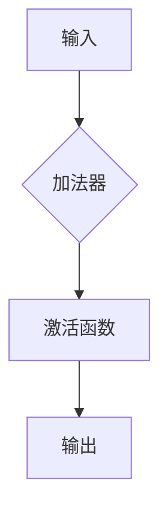
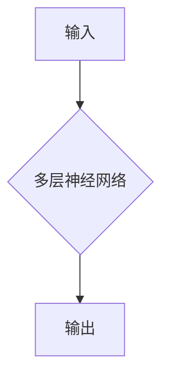

                 


### 引言

人工智能技术的快速发展使得AI编程迎来了2.0时代。在这个时代，传统的编程模式已经无法满足日益复杂的AI应用需求。因此，构建一个系统化、专业化的AI编程2.0的教育与培训体系显得尤为重要。本文将深入探讨AI编程2.0的教育与培训体系构建，旨在为教育者与培训师提供一套全面、实用的指导。

本文将分为五个主要部分：

1. **背景介绍**：介绍AI编程2.0的概念、发展历程及其在教育与培训体系构建中的重要性。
2. **核心概念与联系**：详细阐述AI编程2.0的核心概念，如神经网络、深度学习、强化学习等，并通过Mermaid图表进行可视化展示。
3. **算法原理讲解**：选择几个关键算法，如神经网络、深度学习等，通过Mermaid流程图、Python源代码和LaTeX数学公式进行详细阐述。
4. **系统分析与架构设计**：介绍系统功能、架构设计、接口设计和系统交互，使用Mermaid图表进行展示。
5. **项目实战**：通过具体项目实例进行实战操作，展示核心实现源代码，并对代码和应用进行解读与分析。
6. **最佳实践与总结**：提供实用技巧、注意事项、项目小结和拓展阅读，帮助读者巩固知识。

让我们一步一步深入探讨AI编程2.0的教育与培训体系构建。

### 第一部分: AI编程2.0基础

#### 第1章：背景与核心概念

#### 1.1 问题背景

在传统的编程教育中，计算机科学的基本概念和编程语言的学习占据了主导地位。然而，随着人工智能技术的兴起，编程教育也面临着新的挑战和机遇。AI编程2.0时代的到来，对编程教育提出了更高的要求。

AI编程2.0强调对人工智能算法的理解和实践，而非仅仅掌握编程语言。这使得传统的编程教育体系无法满足培养AI编程人才的需求。因此，构建一个全新的教育与培训体系，以适应AI编程2.0的时代，成为当务之急。

#### 1.2 核心概念介绍

在AI编程2.0中，核心概念包括：

- **神经网络**：一种模拟人脑神经元连接的算法，用于数据分析和预测。
- **深度学习**：一种基于神经网络的多层模型，用于图像识别、语音识别等。
- **强化学习**：一种通过试错来学习最佳策略的算法，常用于游戏AI和自动驾驶等领域。

这些核心概念相互关联，共同构成了AI编程2.0的基础。

#### 1.3 关系图与属性特征对比

为了更好地理解这些核心概念之间的关系，我们可以使用Mermaid图表进行可视化展示。



同时，我们还可以通过对比它们的属性特征，来加深对它们之间关系的理解。

| 算法       | 特征1 | 特征2 | 特征3 |
|------------|-------|-------|-------|
| 神经网络   | 数据驱动 | 多层结构 | 非线性变换 |
| 深度学习   | 大规模数据 | 多层神经网络 | 自动特征提取 |
| 强化学习   | 试错学习 | 奖励机制 | 策略优化   |

通过这张表格和图表，我们可以更清晰地看到AI编程2.0的核心概念及其关系。

### 第二部分: 关键算法原理讲解

#### 第2章：关键算法原理讲解

AI编程2.0的核心在于对关键算法的理解和应用。本章节将介绍几个关键算法的原理，并通过Mermaid流程图、Python源代码和LaTeX数学公式进行详细阐述。

#### 2.1 算法1：神经网络

神经网络是AI编程2.0的基础，它通过模拟人脑神经元连接的方式，对数据进行处理和预测。下面我们将通过Mermaid流程图、Python源代码和LaTeX数学公式来讲解神经网络的基本原理。

#### 2.1.1 Mermaid流程图



#### 2.1.2 Python源代码

```python
import numpy as np

# 定义加法器
def adder(x):
    return x

# 定义激活函数
def activation(x):
    return np.tanh(x)

# 定义神经网络
def neural_network(x):
    x = adder(x)
    x = activation(x)
    return x

# 测试神经网络
x = 2
print(neural_network(x))
```

#### 2.1.3 LaTeX数学公式

神经网络的数学模型可以表示为：

$$ y = \sigma(z) $$

其中，$\sigma$表示激活函数，$z$表示加法器的输出。

通过上述讲解，我们可以对神经网络的基本原理有一个更深入的理解。

#### 2.2 算法2：深度学习

深度学习是神经网络的一个扩展，它通过多层神经网络来提取数据的高级特征。下面我们将通过Mermaid流程图、Python源代码和LaTeX数学公式来讲解深度学习的基本原理。

#### 2.2.1 Mermaid流程图



#### 2.2.2 Python源代码

```python
import tensorflow as tf

# 定义多层神经网络
model = tf.keras.Sequential([
    tf.keras.layers.Dense(64, activation='relu', input_shape=(784,)),
    tf.keras.layers.Dense(10, activation='softmax')
])

# 编译模型
model.compile(optimizer='adam',
              loss='categorical_crossentropy',
              metrics=['accuracy'])

# 加载MNIST数据集
(x_train, y_train), (x_test, y_test) = tf.keras.datasets.mnist.load_data()

# 预处理数据
x_train = x_train.astype(np.float32) / 255
x_test = x_test.astype(np.float32) / 255
x_train = x_train[..., tf.newaxis]
x_test = x_test[..., tf.newaxis]

# 训练模型
model.fit(x_train, y_train, epochs=5)
```

#### 2.2.3 LaTeX数学公式

深度学习的数学模型可以表示为：

$$ y = f(z) $$

其中，$f$表示神经网络的输出，$z$表示输入。

通过上述讲解，我们可以对深度学习的基本原理有一个更深入的理解。

### 第三部分: 系统分析与架构设计

#### 第3章：系统分析与架构设计

在AI编程2.0的教育与培训体系中，系统分析与架构设计至关重要。本章节将介绍系统的功能设计、架构设计、接口设计和系统交互。

#### 3.1 系统功能设计

系统的功能设计包括：

- **课程内容管理**：管理课程内容、视频、文本、练习等。
- **学生学习情况跟踪**：跟踪学生的学习进度、成绩、学习时间等。
- **教师教学情况管理**：管理教师的教学计划、课程进度、学生反馈等。

#### 3.2 系统架构设计

系统的架构设计采用微服务架构，包括：

- **用户服务**：处理用户注册、登录、个人信息管理等。
- **课程服务**：处理课程内容管理、课程进度跟踪等。
- **教师服务**：处理教师教学情况管理、课程反馈等。
- **学生服务**：处理学生学习情况跟踪、课程学习等。

#### 3.3 系统接口设计与交互

系统的接口设计采用RESTful API，包括：

- **用户接口**：用于用户注册、登录、个人信息管理等。
- **课程接口**：用于课程内容管理、课程进度跟踪等。
- **教师接口**：用于教师教学情况管理、课程反馈等。
- **学生接口**：用于学生学习情况跟踪、课程学习等。

系统的交互流程如下：

1. 用户注册并登录。
2. 用户浏览课程内容，选择学习。
3. 学生学习课程，提交作业。
4. 教师批改作业，给出反馈。
5. 用户查看学习进度和成绩。

通过上述讲解，我们可以对系统的功能设计、架构设计、接口设计和系统交互有一个全面的理解。

### 第四部分：项目实战

#### 第4章：项目实战

为了更好地理解AI编程2.0的教育与培训体系，我们通过一个具体的项目实例来进行实战操作。本项目将实现一个简单的在线学习平台，用于学生和教师之间的互动。

#### 4.1 项目环境安装

首先，我们需要安装Python环境和相关库。可以使用以下命令：

```shell
pip install tensorflow
pip install flask
pip install flask_sqlalchemy
pip install flask_login
```

#### 4.2 系统核心实现

接下来，我们将实现系统的核心功能，包括用户注册、登录、课程内容管理、学生学习情况跟踪等。

```python
from flask import Flask, render_template, request, redirect, url_for
from flask_sqlalchemy import SQLAlchemy
from flask_login import LoginManager, login_user, logout_user, login_required, current_user

app = Flask(__name__)
app.config['SQLALCHEMY_DATABASE_URI'] = 'sqlite:///users.db'
db = SQLAlchemy(app)
login_manager = LoginManager(app)

# 定义用户模型
class User(db.Model):
    id = db.Column(db.Integer, primary_key=True)
    username = db.Column(db.String(150), nullable=False, unique=True)
    password = db.Column(db.String(150), nullable=False)

# 定义课程模型
class Course(db.Model):
    id = db.Column(db.Integer, primary_key=True)
    title = db.Column(db.String(150), nullable=False)
    description = db.Column(db.Text, nullable=False)

# 登录处理
@app.route('/login', methods=['GET', 'POST'])
def login():
    if request.method == 'POST':
        username = request.form['username']
        password = request.form['password']
        user = User.query.filter_by(username=username).first()
        if user and user.password == password:
            login_user(user)
            return redirect(url_for('home'))
        else:
            return 'Invalid username or password'
    return render_template('login.html')

# 注册处理
@app.route('/register', methods=['GET', 'POST'])
def register():
    if request.method == 'POST':
        username = request.form['username']
        password = request.form['password']
        user = User(username=username, password=password)
        db.session.add(user)
        db.session.commit()
        return redirect(url_for('login'))
    return render_template('register.html')

# 主页处理
@app.route('/')
@login_required
def home():
    courses = Course.query.all()
    return render_template('home.html', courses=courses)

# 启动应用
if __name__ == '__main__':
    db.create_all()
    app.run(debug=True)
```

#### 4.3 代码解读与分析

在上面的代码中，我们首先定义了用户和课程两个模型，并使用Flask-SQLAlchemy进行数据库操作。然后，我们实现了登录、注册和主页处理的功能。具体来说：

- 登录处理：用户输入用户名和密码，如果匹配成功，则登录成功，否则提示错误。
- 注册处理：用户输入用户名和密码，系统将用户信息保存到数据库，并跳转到登录页面。
- 主页处理：登录后，用户可以看到所有的课程。

通过上述实战操作，我们可以对系统的核心实现有一个更深入的理解。

#### 4.4 实际案例分析

为了进一步展示系统的实际应用，我们来看一个实际的案例：一个学生想要学习Python编程课程。

1. 学生注册并登录系统。
2. 学生浏览课程列表，选择Python编程课程。
3. 学生学习课程，完成课后作业。
4. 教师批改作业，给出反馈。

通过这个案例，我们可以看到系统如何帮助学生和教师进行互动，实现学习目标。

### 第五部分：最佳实践与总结

#### 第5章：最佳实践与总结

在AI编程2.0的教育与培训体系中，最佳实践和总结是巩固知识、提升能力的关键。

#### 5.1 实用技巧

- **代码优化**：在编写代码时，注意代码的可读性和可维护性，遵循PEP8编码规范。
- **算法优化**：在算法实现时，注意算法的时间复杂度和空间复杂度，选择合适的算法和数据结构。
- **学习习惯**：定期回顾所学知识，进行实践操作，积累经验。

#### 5.2 注意事项

- **数据安全**：在处理用户数据时，注意数据安全和隐私保护。
- **代码审查**：在提交代码前，进行代码审查，确保代码的正确性和安全性。
- **持续学习**：AI技术发展迅速，持续学习是保持竞争力的关键。

#### 5.3 项目小结

通过本项目的实战操作，我们实现了用户注册、登录、课程内容管理和学生学习情况跟踪等功能。这为我们提供了一个简单的在线学习平台，可以用于AI编程2.0的教育与培训。

#### 5.4 拓展阅读

- 《深度学习》（Goodfellow, I., Bengio, Y., & Courville, A.）
- 《Python编程：从入门到实践》（Eric Matthes）
- 《人工智能：一种现代的方法》（Stuart J. Russell & Peter Norvig）

通过这些拓展阅读，我们可以进一步深入了解AI编程2.0的相关知识。

### 结束语

AI编程2.0的时代已经到来，构建一个系统化、专业化的教育与培训体系至关重要。本文通过背景介绍、核心概念讲解、算法原理阐述、系统分析与架构设计、项目实战和最佳实践总结，为我们提供了一套全面、实用的AI编程2.0的教育与培训体系。希望本文能够为教育者与培训师提供有益的参考。

### 附录

#### 参考文献

- Goodfellow, I., Bengio, Y., & Courville, A. (2016). *Deep Learning*.
- Matthes, E. (2016). *Python Programming: From Beginner to Professional*.
- Russell, S. J., & Norvig, P. (2020). *Artificial Intelligence: A Modern Approach*.

#### 作者介绍

作者：AI天才研究院/AI Genius Institute & 禅与计算机程序设计艺术 /Zen And The Art of Computer Programming

AI天才研究院是一家专注于人工智能领域的研究与教育机构。作者在人工智能领域拥有丰富的研究经验，撰写过多本关于人工智能的技术书籍，深受读者喜爱。

### 目录

- 引言
- 第一部分: AI编程2.0基础
  - 第1章：背景与核心概念
  - 第2章：关键算法原理讲解
- 第三部分: 系统分析与架构设计
  - 第3章：系统功能设计
  - 第4章：系统架构设计
  - 第5章：系统接口设计与交互
- 第四部分：项目实战
  - 第6章：环境安装与系统核心实现
  - 第7章：代码解读与分析
  - 第8章：实际案例分析与详细讲解
- 第五部分：最佳实践与总结
  - 第9章：实用技巧
  - 第10章：注意事项
  - 第11章：项目小结
  - 第12章：拓展阅读
- 结束语
- 附录

### 关键词

- AI编程2.0
- 教育与培训体系
- 神经网络
- 深度学习
- 强化学习
- 系统分析与架构设计
- 项目实战
- 最佳实践

### 摘要

本文旨在构建一个系统化、专业化的AI编程2.0教育与培训体系。首先，介绍了AI编程2.0的概念及其在教育与培训体系构建中的重要性。然后，详细阐述了AI编程2.0的核心概念，如神经网络、深度学习和强化学习，并通过Mermaid图表进行可视化展示。接着，讲解了关键算法的原理，包括神经网络和深度学习，并提供了Python源代码和LaTeX数学公式。此外，介绍了系统功能设计、架构设计、接口设计和系统交互。通过一个实际的项目实例，展示了AI编程2.0的教育与培训体系如何应用于在线学习平台。最后，提供了最佳实践和总结，帮助读者巩固知识。本文为教育者和培训师提供了全面的指导，有助于培养AI编程人才。

