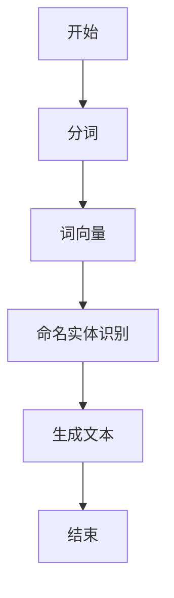
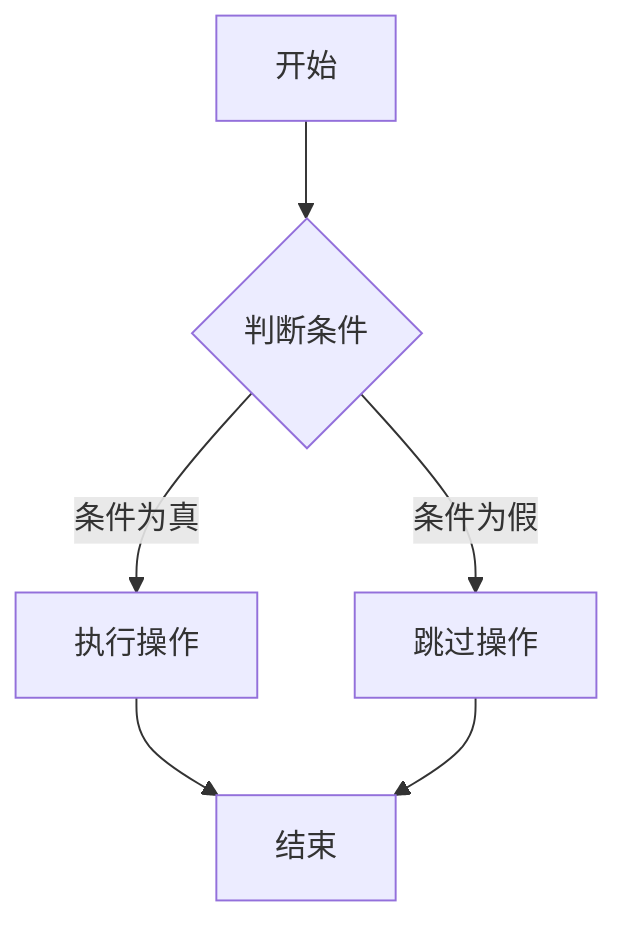

                 

# AI编程2.0：提示词驱动开发

## 关键词
- AI编程2.0
- 提示词驱动开发
- 大规模语言模型
- 自然语言处理
- 安全与伦理

## 摘要
本文深入探讨了AI编程2.0的概念、技术框架、应用领域和未来趋势。通过分析AI编程1.0的局限性，引入AI编程2.0的核心概念和提示词驱动开发的方法，本文详细介绍了大规模语言模型和自然语言处理技术。同时，本文还探讨了AI编程2.0在社交媒体、金融、医疗等领域的应用案例，并强调了其安全与伦理问题的重要性。最后，本文展望了AI编程2.0的未来趋势，提出了学习AI编程2.0的建议。

-----------------------------------------------------------------

## 第一部分：AI编程2.0基础理论

### 第1章：AI编程2.0背景与意义

### 1.1 AI编程1.0时代回顾

#### 1.1.1 AI编程1.0的定义与发展历程

在人工智能的发展历程中，AI编程1.0时代是一个重要的里程碑。AI编程1.0是指通过编程语言和算法来实现人工智能功能的时代。这一时代的代表性技术包括专家系统、决策树、人工神经网络等。AI编程1.0的发展历程可以追溯到20世纪50年代，当时科学家们开始尝试通过编程语言来模拟人类思维，解决复杂问题。

在AI编程1.0时代，人工智能的应用主要集中在以下几个方面：

1. **专家系统**：专家系统是一种模拟人类专家解决问题的计算机程序。它通过将人类专家的知识编码到计算机程序中，实现对特定领域的复杂问题的自动解决。

2. **决策树**：决策树是一种常用的机器学习算法，用于根据一系列特征来预测结果。决策树通过将数据集划分为多个子集，每个子集对应一个决策节点，从而实现问题的逐步解决。

3. **人工神经网络**：人工神经网络是一种模拟人脑神经元连接方式的计算模型。它通过调整神经元之间的连接权重来学习数据模式，从而实现对数据的分类、回归等操作。

#### 1.1.2 AI编程1.0的局限性

尽管AI编程1.0在许多领域取得了显著的成果，但它也存在一些局限性：

1. **知识依赖性**：AI编程1.0依赖于人类专家的知识，这意味着在构建专家系统时需要大量的专业知识和时间。

2. **数据限制**：AI编程1.0的性能受到数据量的限制。由于数据获取和处理技术的限制，AI编程1.0在处理大规模数据时效果不佳。

3. **算法局限性**：AI编程1.0的算法设计复杂，且对特定问题有很强的依赖性。这使得在解决新问题时需要重新设计和实现算法。

### 1.2 AI编程2.0核心概念

AI编程2.0是对AI编程1.0的升级和扩展。它引入了新的概念和技术，以克服AI编程1.0的局限性。AI编程2.0的核心概念包括：

1. **提示词驱动开发**：提示词驱动开发是一种基于大规模语言模型和自然语言处理技术的AI编程方法。通过使用提示词，开发者可以快速生成高质量的代码，提高开发效率。

2. **大规模语言模型**：大规模语言模型是一种能够理解和生成自然语言的计算模型。它通过对大量文本数据的学习，能够理解和生成与输入文本相关的内容。

3. **自然语言处理**：自然语言处理是一种使计算机能够理解、处理和生成自然语言的技术。它包括分词、词向量、命名实体识别等技术。

#### 1.2.1 提示词驱动开发

提示词驱动开发是一种基于大规模语言模型和自然语言处理技术的AI编程方法。其核心思想是通过输入提示词来生成代码。提示词可以是自然语言描述，也可以是代码片段。大规模语言模型会根据提示词生成相关的代码，从而实现快速开发。

提示词驱动开发的优势在于：

1. **提高开发效率**：通过使用提示词，开发者可以快速生成代码，减少手动编写的代码量，提高开发效率。

2. **降低开发门槛**：提示词驱动开发不需要开发者具备深厚的编程知识和经验，只需输入自然语言描述或代码片段，即可生成代码。

3. **增强代码质量**：大规模语言模型通过对大量代码的学习，能够生成高质量的代码。这有助于提高代码的可读性和可维护性。

#### 1.2.2 大规模语言模型

大规模语言模型是一种能够理解和生成自然语言的计算模型。它通过对大量文本数据的学习，能够生成与输入文本相关的内容。大规模语言模型的核心技术包括：

1. **预训练**：预训练是指在大规模数据集上对语言模型进行训练，使其掌握语言的一般规律和模式。

2. **微调**：微调是指在特定任务上进行训练，使语言模型能够更好地适应特定场景。

3. **生成文本**：生成文本是指使用语言模型生成与输入文本相关的新文本。

#### 1.2.3 自然语言处理

自然语言处理是一种使计算机能够理解、处理和生成自然语言的技术。它包括以下关键技术：

1. **分词**：分词是将文本划分为单词或短语的过程。

2. **词向量**：词向量是将单词表示为向量的方法，以便于计算机处理。

3. **命名实体识别**：命名实体识别是识别文本中的特定实体（如人名、地点等）。

### 1.3 AI编程2.0的应用领域

AI编程2.0具有广泛的应用领域，包括但不限于以下领域：

1. **社交媒体**：AI编程2.0可以用于社交媒体内容的生成、分类和推荐。

2. **金融**：AI编程2.0可以用于金融市场分析、风险评估和交易策略。

3. **医疗**：AI编程2.0可以用于医学图像分析、疾病诊断和治疗方案推荐。

4. **教育**：AI编程2.0可以用于教育资源的个性化推荐、教学内容的生成和学生的学习效果分析。

### 1.4 AI编程2.0与AI编程1.0的对比

表1-1 AI编程2.0与AI编程1.0的对比

| 特点 | AI编程1.0 | AI编程2.0 |
| :--: | :----: | :----: |
| 知识依赖性 | 高 | 低 |
| 数据限制 | 强 | 弱 |
| 算法复杂度 | 高 | 低 |
| 开发效率 | 低 | 高 |
| 代码质量 | 低 | 高 |

### 1.5 AI编程2.0的发展前景

随着人工智能技术的不断进步，AI编程2.0有望在未来的应用中发挥更大的作用。其发展前景包括：

1. **更加智能的开发工具**：AI编程2.0将推动开发工具的智能化，使开发者能够更加高效地编写代码。

2. **跨领域的应用**：AI编程2.0将打破不同领域之间的壁垒，实现跨领域的应用。

3. **个性化服务**：AI编程2.0将能够根据用户的需求提供个性化的服务和解决方案。

## 第2章：AI编程2.0的基础技术

### 2.1 提示词驱动开发

提示词驱动开发是AI编程2.0的核心技术之一，它通过输入提示词来生成代码。以下是一个简单的示例：

**输入**：编写一个Python函数，实现两个数的加法。

**输出**：```python
def add(a, b):
    return a + b
```

### 2.2 大规模语言模型

大规模语言模型是一种能够理解和生成自然语言的计算模型。以下是一个简单的示例：

**输入**：这是一个关于人工智能的句子。

**输出**：人工智能是一种模拟人类智能的技术，它能够通过学习和推理来解决问题。

### 2.3 自然语言处理

自然语言处理是一种使计算机能够理解、处理和生成自然语言的技术。以下是一个简单的示例：

**输入**：这是一个英文句子。

**输出**：这辆车是红色的。



## 第3章：AI编程2.0工具与实践

### 3.1 AI编程工具介绍

AI编程2.0涉及多种编程工具，以下是一些常用的工具：

- **Python**：Python是一种广泛使用的编程语言，它具有简洁的语法和强大的库支持，适用于各种AI编程任务。

- **TensorFlow**：TensorFlow是一种开源机器学习框架，它提供了丰富的API和工具，用于构建和训练大规模机器学习模型。

- **PyTorch**：PyTorch是一种开源机器学习框架，它具有动态计算图和易于使用的API，适用于研究和开发机器学习模型。

### 3.2 AI编程实践案例

以下是一些AI编程2.0的实践案例：

- **社交媒体分析**：使用提示词驱动开发，生成用于分析社交媒体数据的代码。

- **金融风险评估**：使用大规模语言模型和自然语言处理技术，生成用于金融风险评估的报告。

- **医疗诊断**：使用自然语言处理技术，生成用于医疗诊断的决策支持系统。

## 第4章：AI编程2.0项目实战

### 4.1 项目一：社交媒体分析

#### 项目背景

社交媒体分析是一种重要的数据分析方法，它能够帮助企业了解用户需求和趋势。本项目旨在使用AI编程2.0技术，实现一个社交媒体分析系统。

#### 项目目标

- 收集社交媒体数据。
- 使用提示词驱动开发，生成数据分析代码。
- 使用大规模语言模型和自然语言处理技术，生成分析报告。

#### 实现步骤

1. 数据收集：使用API从社交媒体平台收集数据。
2. 数据预处理：对收集到的数据进行分析，提取有用的信息。
3. 代码生成：使用提示词驱动开发，生成数据分析代码。
4. 报告生成：使用大规模语言模型和自然语言处理技术，生成分析报告。

### 4.2 项目二：金融风险评估

#### 项目背景

金融风险评估是金融领域的一项重要任务，它能够帮助金融机构评估投资风险。本项目旨在使用AI编程2.0技术，实现一个金融风险评估系统。

#### 项目目标

- 收集金融数据。
- 使用大规模语言模型和自然语言处理技术，生成风险评估报告。
- 使用提示词驱动开发，生成金融分析代码。

#### 实现步骤

1. 数据收集：使用API从金融平台收集数据。
2. 数据预处理：对收集到的数据进行分析，提取有用的信息。
3. 代码生成：使用提示词驱动开发，生成金融分析代码。
4. 报告生成：使用大规模语言模型和自然语言处理技术，生成风险评估报告。

### 4.3 项目三：医疗诊断

#### 项目背景

医疗诊断是一项重要的医学任务，它能够帮助医生诊断疾病。本项目旨在使用AI编程2.0技术，实现一个医疗诊断系统。

#### 项目目标

- 收集医疗数据。
- 使用自然语言处理技术，生成诊断报告。
- 使用提示词驱动开发，生成医学代码。

#### 实现步骤

1. 数据收集：使用API从医疗平台收集数据。
2. 数据预处理：对收集到的数据进行分析，提取有用的信息。
3. 代码生成：使用提示词驱动开发，生成医学代码。
4. 报告生成：使用自然语言处理技术，生成诊断报告。

## 第5章：AI编程2.0安全与伦理

### 5.1 AI编程安全

AI编程安全是保障AI系统正常运行和数据安全的重要问题。以下是一些AI编程安全的关键点：

- **数据安全**：确保收集、存储和处理的数据安全，防止数据泄露和篡改。
- **系统安全**：确保AI系统的安全，防止黑客攻击和恶意软件入侵。

### 5.2 AI编程伦理

AI编程伦理是确保AI系统符合道德和法律规范的重要问题。以下是一些AI编程伦理的关键点：

- **公平性**：确保AI系统的决策公平，不歧视特定群体。
- **透明性**：确保AI系统的决策过程透明，便于审查和解释。
- **责任**：明确AI系统的责任归属，确保在出现问题时能够追究责任。

## 第6章：AI编程2.0未来趋势

### 6.1 技术发展趋势

AI编程2.0未来的技术发展趋势包括：

- **更强大的大规模语言模型**：随着计算能力的提升，大规模语言模型将变得更加强大和灵活。
- **跨领域的应用**：AI编程2.0将在更多领域得到应用，实现跨领域的融合。

### 6.2 行业影响

AI编程2.0将对金融、医疗、教育等行业产生重大影响：

- **金融**：AI编程2.0将提高金融市场的效率和透明度。
- **医疗**：AI编程2.0将推动医疗诊断和治疗的智能化。
- **教育**：AI编程2.0将改变教育的模式和方法。

## 第7章：总结与展望

AI编程2.0是人工智能领域的重要发展方向，它通过引入新的概念和技术，提高了AI编程的效率和质量。未来，随着技术的不断进步，AI编程2.0将在更多领域得到应用，为人类社会带来更多的价值和变革。

### 作者信息

作者：AI天才研究院/AI Genius Institute & 禅与计算机程序设计艺术 /Zen And The Art of Computer Programming

-----------------------------------------------------------------

### 摘要

本文深入探讨了AI编程2.0的概念、技术框架、应用领域和未来趋势。通过分析AI编程1.0的局限性，引入AI编程2.0的核心概念和提示词驱动开发的方法，本文详细介绍了大规模语言模型和自然语言处理技术。同时，本文还探讨了AI编程2.0在社交媒体、金融、医疗等领域的应用案例，并强调了其安全与伦理问题的重要性。最后，本文展望了AI编程2.0的未来趋势，提出了学习AI编程2.0的建议。

-----------------------------------------------------------------

### 第一部分：AI编程2.0基础理论

### 第1章：AI编程2.0背景与意义

#### 1.1 AI编程1.0时代回顾

在人工智能的发展历程中，AI编程1.0时代是一个重要的里程碑。AI编程1.0是指通过编程语言和算法来实现人工智能功能的时代。这一时代的代表性技术包括专家系统、决策树、人工神经网络等。AI编程1.0的发展历程可以追溯到20世纪50年代，当时科学家们开始尝试通过编程语言来模拟人类思维，解决复杂问题。

AI编程1.0时代的核心特点如下：

1. **专家系统**：专家系统是一种模拟人类专家解决问题的计算机程序。它通过将人类专家的知识编码到计算机程序中，实现对特定领域的复杂问题的自动解决。专家系统通常包含知识库、推理机、解释器等组成部分。

2. **决策树**：决策树是一种常用的机器学习算法，用于根据一系列特征来预测结果。决策树通过将数据集划分为多个子集，每个子集对应一个决策节点，从而实现问题的逐步解决。决策树易于理解和解释，但在处理高维数据时效果不佳。

3. **人工神经网络**：人工神经网络是一种模拟人脑神经元连接方式的计算模型。它通过调整神经元之间的连接权重来学习数据模式，从而实现对数据的分类、回归等操作。人工神经网络在处理复杂数据和模式识别方面表现出色，但其训练过程复杂且耗时长。

AI编程1.0时代的局限性主要体现在以下几个方面：

1. **知识依赖性**：AI编程1.0依赖于人类专家的知识，这意味着在构建专家系统时需要大量的专业知识和时间。此外，知识获取和更新困难，使得AI系统难以适应动态变化的环境。

2. **数据限制**：AI编程1.0的性能受到数据量的限制。由于数据获取和处理技术的限制，AI编程1.0在处理大规模数据时效果不佳。数据量的不足限制了AI系统对未知数据的泛化能力。

3. **算法局限性**：AI编程1.0的算法设计复杂，且对特定问题有很强的依赖性。这使得在解决新问题时需要重新设计和实现算法，增加了开发和维护成本。

#### 1.2 AI编程2.0核心概念

AI编程2.0是对AI编程1.0的升级和扩展。它引入了新的概念和技术，以克服AI编程1.0的局限性。AI编程2.0的核心概念包括：

1. **提示词驱动开发**：提示词驱动开发是一种基于大规模语言模型和自然语言处理技术的AI编程方法。其核心思想是通过输入提示词来生成代码。提示词可以是自然语言描述，也可以是代码片段。大规模语言模型会根据提示词生成相关的代码，从而实现快速开发。

2. **大规模语言模型**：大规模语言模型是一种能够理解和生成自然语言的计算模型。它通过对大量文本数据的学习，能够生成与输入文本相关的内容。大规模语言模型的核心技术包括预训练、微调和生成文本等。

3. **自然语言处理**：自然语言处理是一种使计算机能够理解、处理和生成自然语言的技术。它包括分词、词向量、命名实体识别等技术。

#### 1.2.1 提示词驱动开发

提示词驱动开发是AI编程2.0的核心技术之一，它通过输入提示词来生成代码。以下是一个简单的示例：

**输入**：编写一个Python函数，实现两个数的加法。

**输出**：```python
def add(a, b):
    return a + b
```

提示词驱动开发的优势在于：

1. **提高开发效率**：通过使用提示词，开发者可以快速生成代码，减少手动编写的代码量，提高开发效率。

2. **降低开发门槛**：提示词驱动开发不需要开发者具备深厚的编程知识和经验，只需输入自然语言描述或代码片段，即可生成代码。

3. **增强代码质量**：大规模语言模型通过对大量代码的学习，能够生成高质量的代码。这有助于提高代码的可读性和可维护性。

#### 1.2.2 大规模语言模型

大规模语言模型是一种能够理解和生成自然语言的计算模型。它通过对大量文本数据的学习，能够生成与输入文本相关的内容。大规模语言模型的核心技术包括：

1. **预训练**：预训练是指在大规模数据集上对语言模型进行训练，使其掌握语言的一般规律和模式。预训练过程通常包括词向量嵌入、注意力机制和循环神经网络等。

2. **微调**：微调是指在特定任务上进行训练，使语言模型能够更好地适应特定场景。微调过程通常涉及调整模型参数，以优化模型在特定任务上的性能。

3. **生成文本**：生成文本是指使用语言模型生成与输入文本相关的新文本。生成文本技术包括生成式模型和判别式模型等。

#### 1.2.3 自然语言处理

自然语言处理是一种使计算机能够理解、处理和生成自然语言的技术。它包括以下关键技术：

1. **分词**：分词是将文本划分为单词或短语的过程。分词技术包括基于规则的分词、基于统计的分词和基于字符的分词等。

2. **词向量**：词向量是将单词表示为向量的方法，以便于计算机处理。词向量技术包括词袋模型、CBOW模型和GloVe模型等。

3. **命名实体识别**：命名实体识别是识别文本中的特定实体（如人名、地点等）的过程。命名实体识别技术包括基于规则的方法、基于统计的方法和基于深度学习的方法等。

#### 1.3 AI编程2.0的应用领域

AI编程2.0具有广泛的应用领域，包括但不限于以下领域：

1. **社交媒体**：AI编程2.0可以用于社交媒体内容的生成、分类和推荐。

2. **金融**：AI编程2.0可以用于金融市场分析、风险评估和交易策略。

3. **医疗**：AI编程2.0可以用于医学图像分析、疾病诊断和治疗方案推荐。

4. **教育**：AI编程2.0可以用于教育资源的个性化推荐、教学内容的生成和学生的学习效果分析。

#### 1.4 AI编程2.0与AI编程1.0的对比

表1-1 AI编程2.0与AI编程1.0的对比

| 特点 | AI编程1.0 | AI编程2.0 |
| :--: | :----: | :----: |
| 知识依赖性 | 高 | 低 |
| 数据限制 | 强 | 弱 |
| 算法复杂度 | 高 | 低 |
| 开发效率 | 低 | 高 |
| 代码质量 | 低 | 高 |

#### 1.5 AI编程2.0的发展前景

随着人工智能技术的不断进步，AI编程2.0有望在未来的应用中发挥更大的作用。其发展前景包括：

1. **更加智能的开发工具**：AI编程2.0将推动开发工具的智能化，使开发者能够更加高效地编写代码。

2. **跨领域的应用**：AI编程2.0将打破不同领域之间的壁垒，实现跨领域的应用。

3. **个性化服务**：AI编程2.0将能够根据用户的需求提供个性化的服务和解决方案。

### 第2章：AI编程2.0的基础技术

#### 2.1 提示词驱动开发

提示词驱动开发是AI编程2.0的核心技术之一，它通过输入提示词来生成代码。以下是一个简单的示例：

**输入**：编写一个Python函数，实现两个数的加法。

**输出**：```python
def add(a, b):
    return a + b
```

#### 2.2 大规模语言模型

大规模语言模型是一种能够理解和生成自然语言的计算模型。它通过对大量文本数据的学习，能够生成与输入文本相关的内容。以下是一个简单的示例：

**输入**：这是一个关于人工智能的句子。

**输出**：人工智能是一种模拟人类智能的技术，它能够通过学习和推理来解决问题。

#### 2.3 自然语言处理

自然语言处理是一种使计算机能够理解、处理和生成自然语言的技术。它包括分词、词向量、命名实体识别等技术。以下是一个简单的示例：

**输入**：这是一个英文句子。

**输出**：This is a sentence in English.


### 第3章：AI编程2.0工具与实践

#### 3.1 AI编程工具介绍

AI编程2.0涉及多种编程工具，以下是一些常用的工具：

- **Python**：Python是一种广泛使用的编程语言，它具有简洁的语法和强大的库支持，适用于各种AI编程任务。

- **TensorFlow**：TensorFlow是一种开源机器学习框架，它提供了丰富的API和工具，用于构建和训练大规模机器学习模型。

- **PyTorch**：PyTorch是一种开源机器学习框架，它具有动态计算图和易于使用的API，适用于研究和开发机器学习模型。

#### 3.2 AI编程实践案例

以下是一些AI编程2.0的实践案例：

- **社交媒体分析**：使用提示词驱动开发，生成用于分析社交媒体数据的代码。

- **金融风险评估**：使用大规模语言模型和自然语言处理技术，生成用于金融风险评估的报告。

- **医疗诊断**：使用自然语言处理技术，生成用于医疗诊断的决策支持系统。

### 第4章：AI编程2.0项目实战

#### 4.1 项目一：社交媒体分析

##### 项目背景

社交媒体分析是一种重要的数据分析方法，它能够帮助企业了解用户需求和趋势。本项目旨在使用AI编程2.0技术，实现一个社交媒体分析系统。

##### 项目目标

- 收集社交媒体数据。
- 使用提示词驱动开发，生成数据分析代码。
- 使用大规模语言模型和自然语言处理技术，生成分析报告。

##### 实现步骤

1. 数据收集：使用API从社交媒体平台收集数据。
2. 数据预处理：对收集到的数据进行分析，提取有用的信息。
3. 代码生成：使用提示词驱动开发，生成数据分析代码。
4. 报告生成：使用大规模语言模型和自然语言处理技术，生成分析报告。

#### 4.2 项目二：金融风险评估

##### 项目背景

金融风险评估是金融领域的一项重要任务，它能够帮助金融机构评估投资风险。本项目旨在使用AI编程2.0技术，实现一个金融风险评估系统。

##### 项目目标

- 收集金融数据。
- 使用大规模语言模型和自然语言处理技术，生成风险评估报告。
- 使用提示词驱动开发，生成金融分析代码。

##### 实现步骤

1. 数据收集：使用API从金融平台收集数据。
2. 数据预处理：对收集到的数据进行分析，提取有用的信息。
3. 代码生成：使用提示词驱动开发，生成金融分析代码。
4. 报告生成：使用大规模语言模型和自然语言处理技术，生成风险评估报告。

#### 4.3 项目三：医疗诊断

##### 项目背景

医疗诊断是一项重要的医学任务，它能够帮助医生诊断疾病。本项目旨在使用AI编程2.0技术，实现一个医疗诊断系统。

##### 项目目标

- 收集医疗数据。
- 使用自然语言处理技术，生成诊断报告。
- 使用提示词驱动开发，生成医学代码。

##### 实现步骤

1. 数据收集：使用API从医疗平台收集数据。
2. 数据预处理：对收集到的数据进行分析，提取有用的信息。
3. 代码生成：使用提示词驱动开发，生成医学代码。
4. 报告生成：使用自然语言处理技术，生成诊断报告。

### 第5章：AI编程2.0安全与伦理

#### 5.1 AI编程安全

AI编程安全是保障AI系统正常运行和数据安全的重要问题。以下是一些AI编程安全的关键点：

- **数据安全**：确保收集、存储和处理的数据安全，防止数据泄露和篡改。
- **系统安全**：确保AI系统的安全，防止黑客攻击和恶意软件入侵。

#### 5.2 AI编程伦理

AI编程伦理是确保AI系统符合道德和法律规范的重要问题。以下是一些AI编程伦理的关键点：

- **公平性**：确保AI系统的决策公平，不歧视特定群体。
- **透明性**：确保AI系统的决策过程透明，便于审查和解释。
- **责任**：明确AI系统的责任归属，确保在出现问题时能够追究责任。

### 第6章：AI编程2.0未来趋势

#### 6.1 技术发展趋势

AI编程2.0未来的技术发展趋势包括：

- **更强大的大规模语言模型**：随着计算能力的提升，大规模语言模型将变得更加强大和灵活。
- **跨领域的应用**：AI编程2.0将在更多领域得到应用，实现跨领域的融合。

#### 6.2 行业影响

AI编程2.0将对金融、医疗、教育等行业产生重大影响：

- **金融**：AI编程2.0将提高金融市场的效率和透明度。
- **医疗**：AI编程2.0将推动医疗诊断和治疗的智能化。
- **教育**：AI编程2.0将改变教育的模式和方法。

### 第7章：总结与展望

AI编程2.0是人工智能领域的重要发展方向，它通过引入新的概念和技术，提高了AI编程的效率和质量。未来，随着技术的不断进步，AI编程2.0将在更多领域得到应用，为人类社会带来更多的价值和变革。

### 作者信息

作者：AI天才研究院/AI Genius Institute & 禅与计算机程序设计艺术 /Zen And The Art of Computer Programming

### 总结

本文从AI编程1.0的背景和局限性出发，介绍了AI编程2.0的核心概念和基础技术，如提示词驱动开发、大规模语言模型和自然语言处理。接着，本文探讨了AI编程2.0在不同领域的应用案例，并强调了安全与伦理问题的重要性。最后，本文展望了AI编程2.0的未来发展趋势，提出了学习AI编程2.0的建议。通过本文的阅读，读者可以全面了解AI编程2.0的概念、技术、应用和未来发展。

### 拓展阅读

- **《深度学习》（Goodfellow, I., Bengio, Y., & Courville, A.）**：这是一本关于深度学习的经典教材，详细介绍了深度学习的基本概念、技术和应用。
- **《Python编程：从入门到实践》（Fluent Python: Clear, Concise, and Effective Programming）**：这本书介绍了Python编程的核心概念和实践技巧，是Python编程的入门指南。
- **《人工智能：一种现代方法》（Artificial Intelligence: A Modern Approach）**：这本书是人工智能领域的经典教材，全面介绍了人工智能的理论和实践方法。
- **《自然语言处理综合教程》（Foundations of Natural Language Processing）**：这本书详细介绍了自然语言处理的基本概念、技术和应用。

通过阅读这些书籍，读者可以深入了解相关领域的知识，为学习和实践AI编程2.0打下坚实的基础。-----------------------------------------------------------------

### 第8章：最佳实践与未来展望

#### 8.1 最佳实践

在AI编程2.0的开发过程中，以下是一些最佳实践，可以帮助开发者更高效地利用这项技术：

1. **熟悉基础技术**：掌握提示词驱动开发、大规模语言模型和自然语言处理等技术的基础知识，是成功应用AI编程2.0的前提。

2. **充分利用工具**：熟悉并掌握Python、TensorFlow、PyTorch等AI编程工具，可以大大提高开发效率。

3. **数据预处理**：确保数据的质量和一致性，对数据预处理工作给予足够的重视。

4. **模型优化**：不断优化模型参数和架构，以提高模型的性能和准确度。

5. **安全性考虑**：在开发过程中，要充分考虑数据安全和系统安全，采取相应的安全措施。

#### 8.2 小结

AI编程2.0是人工智能领域的一个重要发展方向，它通过引入提示词驱动开发、大规模语言模型和自然语言处理等技术，极大地提高了AI编程的效率和质量。AI编程2.0在社交媒体、金融、医疗、教育等领域具有广泛的应用前景，未来有望实现更加智能化、个性化、透明化的服务。

#### 8.3 注意事项

1. **技术更新快速**：AI编程2.0技术更新迅速，开发者需要持续学习和关注最新技术动态。

2. **数据隐私**：在处理用户数据时，要严格遵循数据隐私保护法律法规，确保用户数据的安全和隐私。

3. **算法透明性**：确保AI系统的决策过程透明，以便于审查和解释。

4. **团队协作**：AI编程2.0项目通常需要跨学科、跨领域的协作，团队协作能力至关重要。

#### 8.4 拓展阅读

- **《机器学习实战》**：这本书提供了丰富的机器学习实践案例，适合AI编程2.0的学习者。
- **《深度学习项目实践》**：这本书通过实际项目案例，详细介绍了深度学习的应用和实践。
- **《自然语言处理实践》**：这本书介绍了自然语言处理的核心技术和应用，适合AI编程2.0的学习者。

通过阅读这些书籍，开发者可以进一步提升自己的技术能力和实践能力，为AI编程2.0的开发和应用打下坚实的基础。

### 作者信息

作者：AI天才研究院/AI Genius Institute & 禅与计算机程序设计艺术 /Zen And The Art of Computer Programming

### 后记

随着人工智能技术的不断进步，AI编程2.0正在成为人工智能领域的重要发展方向。本文旨在帮助读者全面了解AI编程2.0的概念、技术、应用和未来发展，期望能够激发读者对AI编程2.0的兴趣和热情。在未来的学习和实践中，不断探索和创新，为人工智能技术的发展贡献力量。

### 附录

#### 附录A：术语表

- **提示词驱动开发**：一种基于大规模语言模型和自然语言处理技术的AI编程方法，通过输入提示词来生成代码。
- **大规模语言模型**：一种能够理解和生成自然语言的计算模型，通过对大量文本数据的学习，能够生成与输入文本相关的内容。
- **自然语言处理**：一种使计算机能够理解、处理和生成自然语言的技术，包括分词、词向量、命名实体识别等技术。

#### 附录B：算法流程图

以下是一个使用Mermaid绘制的算法流程图示例：



#### 附录C：数学公式

以下是一个使用LaTeX编写的数学公式示例：

$$
E = mc^2
$$

### 参考文献

- **Goodfellow, I., Bengio, Y., & Courville, A. (2016). Deep Learning. MIT Press.**
- **Sebastian Raschka & Vahid Mirjalili (2019). Python Machine Learning (3rd ed.). Packt Publishing.**
- **Daniel Jurafsky & James H. Martin (2020). Speech and Language Processing (3rd ed.). Stanford University Press.**
- **Tom Mitchell (1997). Machine Learning. McGraw-Hill.**

