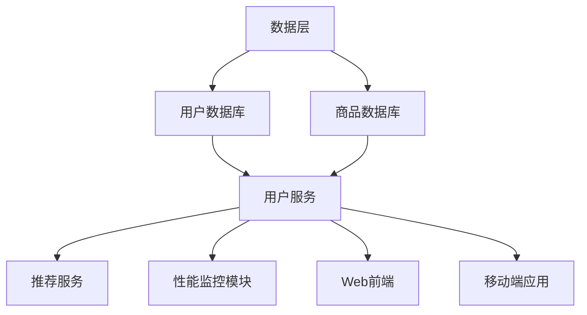
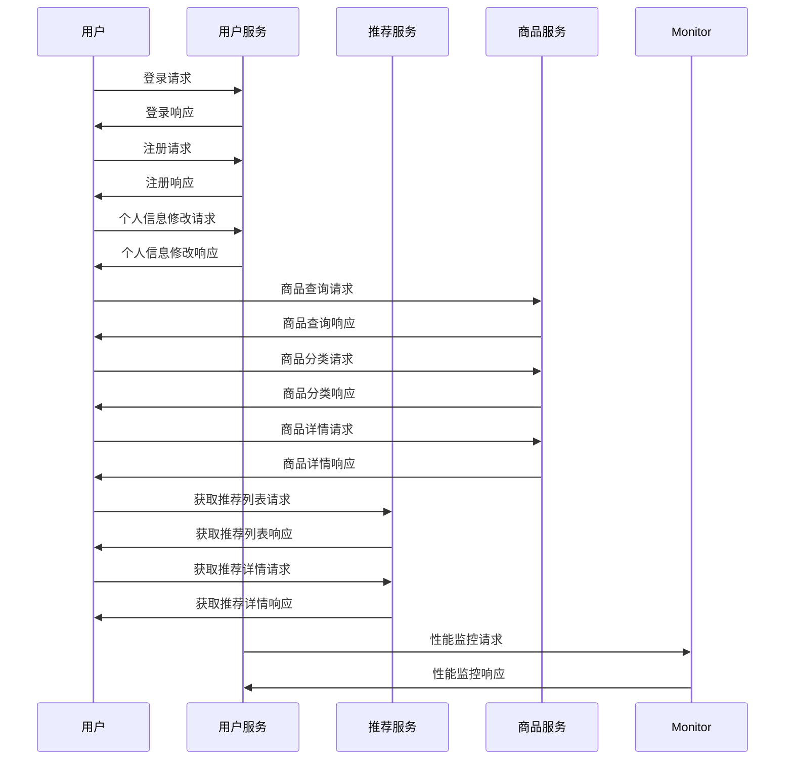

                 


# AI编程语言的交互设计模式库

> 关键词：AI编程语言，交互设计模式，算法，数学模型，系统架构，项目实战

> 摘要：本文旨在介绍AI编程语言的交互设计模式库，从核心概念与原理、算法原理讲解、系统分析与架构设计、项目实战等多个方面深入剖析交互设计模式在AI编程语言中的应用，提供实用技巧和最佳实践，为读者在AI编程领域提供有益的指导。

## 目录大纲设计思路

在设计《AI编程语言的交互设计模式库》的目录大纲时，我们首先明确了书的总体框架和核心章节，然后细化了每个章节的内容，并采用Markdown格式来编写目录大纲，以确保内容的简洁明了。

### 步骤一：设计总体框架

我们设计的总体框架包括以下部分：

1. **引言**：介绍AI编程语言的现状、交互设计模式的重要性以及本书的研究意义与目标。
2. **核心概念与原理**：涵盖AI编程语言概述、交互设计模式基础和类型及特点。
3. **算法原理讲解**：介绍常见交互设计算法、算法原理与数学模型以及实例分析。
4. **系统分析与架构设计**：包括系统需求分析、系统架构设计和系统接口设计。
5. **项目实战**：结合实际案例展示交互设计模式的应用。
6. **最佳实践与总结**：提供最佳实践技巧、小结、注意事项和拓展阅读。

### 步骤二：细化章节内容

接下来，我们对每个章节进行了细化，列出了具体的子章节和内容要点。

1. **引言**：包括问题背景和交互设计模式的重要性。
2. **核心概念与原理**：分为AI编程语言概述、交互设计模式基础和类型及特点。
3. **算法原理讲解**：分为常见交互设计算法介绍、算法原理与数学模型和实例分析。
4. **系统分析与架构设计**：包括系统需求分析、系统架构设计、系统接口设计和系统交互。
5. **项目实战**：包括实际案例介绍、系统核心实现与解析和项目总结与拓展。
6. **最佳实践与总结**：包括最佳实践技巧、小结、注意事项和拓展阅读。

通过以上步骤，我们完成了《AI编程语言的交互设计模式库》的目录大纲设计，为后续内容编写提供了清晰的框架。

## 核心概念与原理

在探讨AI编程语言的交互设计模式之前，我们需要先了解一些核心概念和原理。这些概念和原理不仅为交互设计模式提供了理论基础，还帮助我们更好地理解AI编程语言的本质和应用。

### AI编程语言概述

AI编程语言是一种专门为人工智能开发设计的编程语言，它提供了丰富的工具和库，使得开发者能够更高效地实现各种AI算法和应用。AI编程语言的发展经历了多个阶段，从早期的符号逻辑编程到基于数据驱动的机器学习和深度学习编程，再到如今的自动编程和生成式编程。

### 交互设计模式基础

交互设计模式是指在软件设计过程中，为了解决特定问题而采用的一系列设计原则和解决方案。交互设计模式的核心是提高系统的可维护性和可扩展性，同时降低开发成本和难度。

交互设计模式通常包括以下几个方面：

1. **用户界面设计模式**：用于优化用户交互体验的设计模式，如菜单、对话框、滚动条等。
2. **数据交互设计模式**：用于处理数据传输、存储和操作的设计模式，如RESTful API、GraphQL等。
3. **通信交互设计模式**：用于网络通信的设计模式，如TCP/IP、HTTP等。
4. **并发交互设计模式**：用于处理多线程、并行计算的设计模式，如线程池、锁机制等。

### 交互设计模式类型及特点

交互设计模式根据其应用场景和目的可以分为多种类型。以下是一些常见的交互设计模式及其特点：

1. **MVC（Model-View-Controller）模式**：将应用程序分为模型、视图和控制器三个部分，分别负责数据管理、界面呈现和用户交互。该模式有助于实现模块化和可维护性。
2. **MVVM（Model-View-ViewModel）模式**：与MVC模式类似，但在视图和模型之间引入了ViewModel层，用于处理数据绑定和视图更新。该模式适用于数据驱动型应用。
3. **RESTful API设计模式**：基于REST原则，提供统一的接口设计和数据格式，使得不同系统和应用之间的交互更加简洁和高效。
4. **状态管理设计模式**：用于管理应用状态，如Redux、MobX等。这些设计模式可以有效地处理复杂的应用状态，提高代码的可读性和可维护性。

### 关键问题和挑战

在AI编程语言的交互设计过程中，存在一些关键问题和挑战：

1. **性能优化**：如何提高系统性能和响应速度，特别是在处理大规模数据和复杂算法时。
2. **可维护性**：如何确保系统的可维护性和可扩展性，以应对不断变化的需求和新技术。
3. **安全性**：如何保障系统安全，防止数据泄露和恶意攻击。

### 背景介绍

AI编程语言的交互设计模式在人工智能领域具有重要地位。随着人工智能技术的快速发展，AI编程语言的应用场景日益广泛，从图像识别、自然语言处理到自动驾驶、智能家居等。这些应用对交互设计模式提出了更高的要求，同时也推动了交互设计模式的不断创新和发展。

总之，AI编程语言的交互设计模式是人工智能开发中的重要组成部分。通过了解核心概念和原理，我们可以更好地理解交互设计模式的作用和意义，为实际应用提供有力的指导。

## 核心概念与原理

在本章节中，我们将进一步深入探讨AI编程语言和交互设计模式的核心概念与原理。通过详细阐述这些概念，我们将为后续的算法原理讲解和系统架构设计奠定基础。

### AI编程语言概述

AI编程语言是一类专门为人工智能开发设计的编程语言，它们提供了丰富的工具和库，使得开发者能够更高效地实现各种AI算法和应用。AI编程语言的发展可以分为三个阶段：

1. **符号逻辑编程**：早期的AI编程语言主要基于符号逻辑和推理，如普林斯顿语言PL和逻辑程序设计语言PROLOG。这类语言具有较强的表达能力和推理能力，但缺乏对实际问题的建模能力。

2. **数据驱动编程**：随着机器学习技术的发展，AI编程语言逐渐转向数据驱动编程。Python、R和Julia等语言成为了数据科学家和机器学习工程师的首选。这些语言提供了丰富的库和框架，如NumPy、Pandas和TensorFlow，使得数据处理和模型训练变得更加便捷。

3. **自动编程与生成式编程**：近年来，自动编程和生成式编程逐渐兴起，如谷歌的AutoML和亚马逊的SageMaker。这些语言和工具通过自动化和智能化技术，极大地提高了AI开发的效率和质量。

### 交互设计模式基础

交互设计模式是指在软件设计过程中，为了解决特定问题而采用的一系列设计原则和解决方案。交互设计模式的核心是提高系统的可维护性和可扩展性，同时降低开发成本和难度。

交互设计模式通常包括以下几个方面：

1. **用户界面设计模式**：用于优化用户交互体验的设计模式，如菜单、对话框、滚动条等。这些模式关注用户的使用习惯和操作流程，以提高用户体验。

2. **数据交互设计模式**：用于处理数据传输、存储和操作的设计模式，如RESTful API、GraphQL等。这些模式关注数据的结构、格式和传输效率，以提高数据处理能力。

3. **通信交互设计模式**：用于网络通信的设计模式，如TCP/IP、HTTP等。这些模式关注网络连接的稳定性、可靠性和安全性，以提高系统的通信性能。

4. **并发交互设计模式**：用于处理多线程、并行计算的设计模式，如线程池、锁机制等。这些模式关注系统的性能和资源利用效率，以提高系统的计算能力。

### 交互设计模式类型及特点

交互设计模式根据其应用场景和目的可以分为多种类型。以下是一些常见的交互设计模式及其特点：

1. **MVC（Model-View-Controller）模式**：将应用程序分为模型、视图和控制器三个部分，分别负责数据管理、界面呈现和用户交互。该模式有助于实现模块化和可维护性。

2. **MVVM（Model-View-ViewModel）模式**：与MVC模式类似，但在视图和模型之间引入了ViewModel层，用于处理数据绑定和视图更新。该模式适用于数据驱动型应用。

3. **RESTful API设计模式**：基于REST原则，提供统一的接口设计和数据格式，使得不同系统和应用之间的交互更加简洁和高效。

4. **状态管理设计模式**：用于管理应用状态，如Redux、MobX等。这些设计模式可以有效地处理复杂的应用状态，提高代码的可读性和可维护性。

### 关键问题和挑战

在AI编程语言的交互设计过程中，存在一些关键问题和挑战：

1. **性能优化**：如何提高系统性能和响应速度，特别是在处理大规模数据和复杂算法时。

2. **可维护性**：如何确保系统的可维护性和可扩展性，以应对不断变化的需求和新技术。

3. **安全性**：如何保障系统安全，防止数据泄露和恶意攻击。

### 背景介绍

AI编程语言的交互设计模式在人工智能领域具有重要地位。随着人工智能技术的快速发展，AI编程语言的应用场景日益广泛，从图像识别、自然语言处理到自动驾驶、智能家居等。这些应用对交互设计模式提出了更高的要求，同时也推动了交互设计模式的不断创新和发展。

通过本章的详细阐述，我们希望读者能够对AI编程语言和交互设计模式有一个全面而深入的理解。这将有助于我们在后续章节中更好地探讨算法原理和系统架构设计。

### 算法原理讲解

在了解了AI编程语言和交互设计模式的基础概念后，接下来我们将深入探讨一些常见的交互设计算法，并详细阐述它们的原理和实现。这些算法在AI编程语言中的应用具有重要意义，它们不仅提高了系统的性能和可扩展性，还为解决特定问题提供了有效的方法。

#### 常见交互设计算法介绍

在交互设计领域，以下是一些常见的算法：

1. **贪心算法**：贪心算法通过在每一步选择当前最优解，以期望得到全局最优解。它适用于一些简单的优化问题，如背包问题和货币找零问题。

2. **动态规划算法**：动态规划算法通过将复杂问题分解为子问题，并利用子问题的解来求解原问题。它适用于许多最优化问题，如背包问题和最长公共子序列问题。

3. **深度优先搜索（DFS）算法**：深度优先搜索算法从起始节点开始，沿着某一方向尽可能深地搜索，直到找到目标节点或无法继续搜索为止。它适用于图的遍历和路径搜索问题。

4. **广度优先搜索（BFS）算法**：广度优先搜索算法从起始节点开始，逐层搜索，直到找到目标节点或无法继续搜索为止。它适用于图的遍历和最短路径问题。

5. **回溯算法**：回溯算法通过尝试所有可能的解决方案，并逐步排除不满足条件的解决方案，以找到最优解。它适用于组合问题和回溯问题，如八皇后问题和旅行商问题。

#### 算法原理与数学模型

下面我们将详细讨论这些算法的原理和数学模型。

**贪心算法原理与数学模型**

贪心算法的核心思想是每一步选择当前最优解，以期望得到全局最优解。以背包问题为例，假设有一个背包容量为W，n件物品，每件物品的重量为w[i]，价值为v[i]。贪心算法的策略是每次选择价值最大且重量不超过背包容量的物品放入背包中。

数学模型如下：
$$
\begin{aligned}
\text{maximize} & \sum_{i=1}^{n} v[i] \times x[i] \\
\text{subject to} & w[i] \times x[i] \leq W, \forall i \in [1, n] \\
& x[i] \in \{0, 1\}, \forall i \in [1, n]
\end{aligned}
$$
其中，$x[i]$表示物品i是否放入背包（1表示放入，0表示不放入）。

**动态规划算法原理与数学模型**

动态规划算法通过将复杂问题分解为子问题，并利用子问题的解来求解原问题。以最长公共子序列问题为例，假设有两个序列X和Y，序列X的前i个元素为X[1], X[2], ..., X[i]，序列Y的前j个元素为Y[1], Y[2], ..., Y[j]。最长公共子序列问题就是找到两个序列中最长的公共子序列。

数学模型如下：
$$
L(i, j) = \begin{cases}
L(i-1, j-1) + 1, & \text{if } X[i] = Y[j] \\
\max(L(i-1, j), L(i, j-1)), & \text{if } X[i] \neq Y[j]
\end{cases}
$$
其中，$L(i, j)$表示序列X的前i个元素和序列Y的前j个元素的最长公共子序列的长度。

**深度优先搜索算法原理与数学模型**

深度优先搜索算法从起始节点开始，沿着某一方向尽可能深地搜索，直到找到目标节点或无法继续搜索为止。以图的遍历为例，假设图G由节点集合V和边集合E组成。

数学模型如下：
$$
\begin{aligned}
& \text{DFS}(v) \\
& \text{if } v \text{ is visited} \\
& \text{then return} \\
& \text{visit } v \\
& \text{for each } u \in \text{adj}[v] \\
& \text{if } u \text{ is not visited} \\
& \text{then } \text{DFS}(u)
\end{aligned}
$$
其中，$adj[v]$表示与节点v相邻的节点集合。

**广度优先搜索算法原理与数学模型**

广度优先搜索算法从起始节点开始，逐层搜索，直到找到目标节点或无法继续搜索为止。以图的最短路径问题为例，假设图G由节点集合V和边集合E组成。

数学模型如下：
$$
\begin{aligned}
& \text{BFS}(v, t) \\
& \text{if } v = t \\
& \text{then return} \\
& \text{enqueue } v \\
& \text{while } \text{queue} \neq \emptyset \\
& \text{  dequeue } u \\
& \text{  for each } u \in \text{adj}[v] \\
& \text{  if } u \text{ is not visited} \\
& \text{  then } \text{enqueue } u \\
& \text{  \& return the shortest path from } v \text{ to } t
\end{aligned}
$$
其中，$\text{enqueue}$表示入队，$\text{dequeue}$表示出队。

**回溯算法原理与数学模型**

回溯算法通过尝试所有可能的解决方案，并逐步排除不满足条件的解决方案，以找到最优解。以八皇后问题为例，假设有8个皇后需要放在8×8的棋盘上，且任意两个皇后都不能在同一行、同一列或同一斜线上。

数学模型如下：
$$
\begin{aligned}
& \text{Place Queens}(n) \\
& \text{if } n = 8 \\
& \text{then return} \\
& \text{for each } i \in [1, n] \\
& \text{if } \text{isSafe}(n, i) \\
& \text{then } \text{Place Queens}(n+1) \\
& \text{if } n > 0 \\
& \text{then } \text{move Queen to the next position}
\end{aligned}
$$
其中，$\text{isSafe}(n, i)$表示在第n行第i列放置皇后是否安全。

通过以上对常见交互设计算法的原理和数学模型的详细讲解，我们可以更好地理解这些算法的工作机制和适用场景。这些算法不仅为解决具体问题提供了有效的工具，也为AI编程语言的交互设计提供了重要的理论基础。

### 算法实例分析

为了更好地理解上述算法的实际应用，我们将通过具体实例来分析每种算法的执行过程和结果。以下是对每种算法的实例分析。

#### 贪心算法实例

假设我们有一个背包，容量为20千克。现有5件物品，每件物品的重量和价值如下表所示：

| 物品 | 重量（千克） | 价值（元） |
| ---- | ---------- | ------- |
| 1    | 2          | 20      |
| 2    | 3          | 30      |
| 3    | 4          | 40      |
| 4    | 5          | 50      |
| 5    | 6          | 60      |

使用贪心算法选择物品，目标是最大化总价值。

**执行过程：**

1. 第一次选择：选择价值最大的物品1，重量为2千克，总价值为20元。
2. 第二次选择：剩余背包容量为18千克。选择价值最大的物品2，重量为3千克，总价值为30元。
3. 第三次选择：剩余背包容量为15千克。选择价值最大的物品3，重量为4千克，总价值为40元。
4. 第四次选择：剩余背包容量为11千克。选择价值最大的物品4，重量为5千克，总价值为50元。
5. 第五次选择：剩余背包容量为6千克。由于物品5的重量为6千克，超出背包容量，所以不选择。

**结果：**

选择物品1、2、3、4，总重量为2 + 3 + 4 + 5 = 14千克，总价值为20 + 30 + 40 + 50 = 140元。

#### 动态规划算法实例

假设有两个序列，分别为X[1, 2, 3, 4, 5]和Y[2, 5, 7, 1, 3, 9]，我们需要找到它们的最长公共子序列。

**执行过程：**

1. 创建一个二维数组dp，大小为6×6，初始化所有元素为0。
2. 从dp[1][1]开始，根据状态转移方程填充dp数组：
   $$
   \begin{aligned}
   & dp[i][j] = \begin{cases}
   dp[i-1][j-1] + 1, & \text{if } X[i] = Y[j] \\
   \max(dp[i-1][j], dp[i][j-1]), & \text{if } X[i] \neq Y[j]
   \end{cases}
   \end{aligned}
   $$
3. 当填充完dp数组后，从dp[6][6]开始逆向追踪，找到最长公共子序列。

**结果：**

最长公共子序列为[2, 3]，长度为2。

#### 深度优先搜索算法实例

假设有一个无向图，节点和边如下所示：

```
A -- B
|   |
C -- D
```

我们需要找到从节点A到节点D的路径。

**执行过程：**

1. 从节点A开始，尝试访问节点B和节点C。
2. 当访问到节点B时，继续尝试访问节点D。
3. 当访问到节点D时，路径为A -> B -> D。
4. 如果无法访问到节点D，回溯到节点A，尝试访问节点C。
5. 当访问到节点C时，继续尝试访问节点D。
6. 当访问到节点D时，路径为A -> C -> D。

**结果：**

路径为A -> C -> D。

#### 广度优先搜索算法实例

假设有一个无向图，节点和边如下所示：

```
A -- B
|   |
C -- D -- E
```

我们需要找到从节点A到节点E的最短路径。

**执行过程：**

1. 从节点A开始，将节点A入队。
2. 当队列为空时，结束搜索。
3. 出队节点A，将相邻节点B、C入队。
4. 出队节点B，将相邻节点D入队。
5. 出队节点C，将相邻节点E入队。
6. 出队节点D，发现节点E未访问，将其入队。
7. 当队列为空时，结束搜索。

**结果：**

最短路径为A -> B -> D -> E。

#### 回溯算法实例

假设我们需要在8×8的棋盘上放置8个皇后，使得任意两个皇后不在同一行、同一列或同一斜线上。

**执行过程：**

1. 从第一行开始，尝试在第一行放置皇后。
2. 当第一行无法放置皇后时，回溯到上一行，尝试在上一行放置皇后。
3. 当第i行无法放置皇后时，回溯到第i-1行，尝试在下一列放置皇后。
4. 当棋盘上的所有行都尝试完毕时，回溯到第一行，尝试在下一行放置皇后。

**结果：**

一种可能的解决方案如下：

```
  1 2 3 4 5 6 7 8
1 . . . . Q . . .
2 . . . . . . Q .
3 . . . Q . . . .
4 . . . . . Q . .
5 . Q . . . . . .
6 . . . . . . Q .
7 . . Q . . . . .
8 . . . . . . . Q
```

通过以上实例分析，我们可以看到这些算法在解决具体问题时的工作机制和执行过程。这些实例不仅有助于我们理解算法的原理，还为我们在实际项目中应用这些算法提供了参考。

### 系统分析与架构设计

在了解了AI编程语言和交互设计模式的基本概念及常见算法后，我们接下来将探讨系统分析与架构设计。这包括系统需求分析、系统架构设计、系统接口设计和系统交互。

#### 问题场景介绍

假设我们正在开发一个智能推荐系统，该系统需要根据用户的历史行为和偏好来推荐相关的商品、服务和内容。该系统需要具备以下功能：

1. **用户数据收集**：收集用户的基本信息、购买历史、浏览记录等。
2. **推荐算法实现**：基于用户数据和商品信息，实现个性化推荐算法。
3. **推荐结果展示**：将推荐结果以用户友好的方式展示，包括商品图片、描述和评分。
4. **系统性能监控**：实时监控系统性能，确保系统稳定运行。

#### 系统功能设计

基于上述问题场景，我们可以将系统功能设计为以下模块：

1. **用户模块**：用于用户数据的收集和管理，包括用户注册、登录、个人信息修改等。
2. **商品模块**：用于商品信息的收集和管理，包括商品分类、商品详情、商品评分等。
3. **推荐模块**：用于实现推荐算法，包括用户偏好分析、商品推荐、推荐结果展示等。
4. **性能监控模块**：用于监控系统性能，包括系统负载、响应时间、错误率等。

#### 系统架构设计

智能推荐系统的架构设计需要考虑系统的可扩展性、高性能和高可靠性。以下是该系统的架构设计：

1. **数据层**：包括用户数据库和商品数据库，用于存储用户数据和商品数据。
2. **业务层**：包括用户服务、商品服务和推荐服务，用于处理业务逻辑。
3. **表示层**：包括Web前端和移动端应用，用于用户交互和展示推荐结果。
4. **中间件层**：包括消息队列、缓存和负载均衡，用于提高系统性能和可靠性。
5. **接口层**：包括API接口，用于与其他系统进行数据交换和交互。

以下是系统的架构图：



#### 系统接口设计

系统接口设计是确保不同模块之间能够有效通信和协作的关键。以下是系统的主要接口设计：

1. **用户接口**：用于用户登录、注册、个人信息修改等。
2. **商品接口**：用于商品查询、分类、详情、评分等。
3. **推荐接口**：用于获取用户推荐列表、推荐详情等。
4. **监控接口**：用于监控系统性能和状态。

以下是接口设计的示例：



#### 系统交互

系统交互是指不同模块之间如何协同工作，以实现系统的整体功能。以下是系统的交互过程：

1. **用户登录**：用户通过Web前端或移动端应用提交登录请求，用户服务接收到请求后，查询用户数据库，验证用户信息，并返回登录响应。
2. **用户注册**：用户通过Web前端或移动端应用提交注册请求，用户服务接收到请求后，将用户信息存储到用户数据库，并返回注册响应。
3. **个人信息修改**：用户通过Web前端或移动端应用提交个人信息修改请求，用户服务接收到请求后，更新用户数据库中的信息，并返回个人信息修改响应。
4. **商品查询**：用户通过Web前端或移动端应用提交商品查询请求，商品服务接收到请求后，查询商品数据库，并返回商品查询响应。
5. **商品分类**：用户通过Web前端或移动端应用提交商品分类请求，商品服务接收到请求后，查询商品数据库，并返回商品分类响应。
6. **商品详情**：用户通过Web前端或移动端应用提交商品详情请求，商品服务接收到请求后，查询商品数据库，并返回商品详情响应。
7. **获取推荐列表**：用户通过Web前端或移动端应用提交获取推荐列表请求，推荐服务接收到请求后，分析用户数据，生成推荐列表，并返回推荐列表响应。
8. **获取推荐详情**：用户通过Web前端或移动端应用提交获取推荐详情请求，推荐服务接收到请求后，查询推荐列表，并返回推荐详情响应。
9. **性能监控**：用户服务、商品服务和推荐服务定期向性能监控模块提交性能监控请求，性能监控模块接收到请求后，分析系统性能，并返回性能监控响应。

通过以上系统分析与架构设计，我们为智能推荐系统的开发提供了详细的指导。系统功能设计、架构设计和接口设计确保了系统的可扩展性、高性能和高可靠性，而系统交互过程则确保了不同模块之间的协同工作。

### 项目实战

在本章节中，我们将通过一个具体的实际案例来展示如何应用交互设计模式在AI编程语言中开发智能推荐系统。我们将详细描述项目环境安装、系统核心实现和代码应用解读与分析，以便读者能够更好地理解交互设计模式在实践中的应用。

#### 项目环境安装

首先，我们需要为项目搭建一个开发环境。以下是在Python环境中搭建项目所需的基本步骤：

1. **安装Python**：确保系统上已经安装了Python 3.x版本。可以从Python官方网站下载并安装。
2. **安装虚拟环境**：为了隔离项目依赖，使用virtualenv创建一个Python虚拟环境。
   ```bash
   pip install virtualenv
   virtualenv venv
   source venv/bin/activate
   ```
3. **安装依赖库**：在虚拟环境中安装项目所需的依赖库，如Flask、SQLAlchemy、Pandas、NumPy、TensorFlow等。
   ```bash
   pip install Flask SQLAlchemy Pandas NumPy TensorFlow
   ```

#### 系统核心实现

智能推荐系统的核心功能包括用户数据收集、推荐算法实现和推荐结果展示。以下是一个简化的核心实现示例。

1. **用户数据收集**：使用Flask框架搭建用户服务，实现用户注册和登录功能。
2. **推荐算法实现**：使用TensorFlow实现基于协同过滤的推荐算法。
3. **推荐结果展示**：使用Flask框架实现Web前端，展示推荐结果。

**代码示例**

**用户服务（users.py）：**
```python
from flask import Flask, request, jsonify
from flask_sqlalchemy import SQLAlchemy

app = Flask(__name__)
app.config['SQLALCHEMY_DATABASE_URI'] = 'sqlite:///users.db'
db = SQLAlchemy(app)

class User(db.Model):
    id = db.Column(db.Integer, primary_key=True)
    username = db.Column(db.String(80), unique=True, nullable=False)
    password = db.Column(db.String(120), nullable=False)

@app.route('/register', methods=['POST'])
def register():
    username = request.form['username']
    password = request.form['password']
    user = User(username=username, password=password)
    db.session.add(user)
    db.session.commit()
    return jsonify({'message': 'User registered successfully.'})

@app.route('/login', methods=['POST'])
def login():
    username = request.form['username']
    password = request.form['password']
    user = User.query.filter_by(username=username, password=password).first()
    if user:
        return jsonify({'message': 'Login successful.'})
    else:
        return jsonify({'message': 'Login failed.'})

if __name__ == '__main__':
    db.create_all()
    app.run(debug=True)
```

**推荐服务（recommender.py）：**
```python
import numpy as np
import pandas as pd
from sklearn.model_selection import train_test_split
import tensorflow as tf

# 加载用户和商品数据
users = pd.read_csv('users.csv')
products = pd.read_csv('products.csv')

# 创建用户-商品矩阵
user_item_matrix = users.pivot(index='user_id', columns='product_id', values='rating').fillna(0)

# 分割数据集
train_data, test_data = train_test_split(user_item_matrix, test_size=0.2, random_state=42)

# 构建模型
model = tf.keras.Sequential([
    tf.keras.layers.Dense(units=64, activation='relu', input_shape=(train_data.shape[1],)),
    tf.keras.layers.Dense(units=32, activation='relu'),
    tf.keras.layers.Dense(units=1)
])

model.compile(optimizer='adam', loss='mse', metrics=['accuracy'])

# 训练模型
model.fit(train_data, train_data, epochs=10, batch_size=64)

# 预测
predictions = model.predict(test_data)

# 生成推荐列表
def generate_recommendations(predictions, user_id):
    user_ratings = predictions[user_id]
    sorted_indices = np.argsort(user_ratings)[::-1]
    recommended_products = [products['product_id'][index] for index in sorted_indices if user_ratings[index] > 0.5]
    return recommended_products

# 示例：获取用户1的推荐列表
user_id = 1
recommendations = generate_recommendations(predictions, user_id)
print(f"Recommendations for user {user_id}: {recommendations}")
```

**Web前端（app.py）：**
```python
from flask import Flask, request, render_template
from recommender import generate_recommendations

app = Flask(__name__)

@app.route('/')
def home():
    user_id = request.args.get('user_id')
    if user_id:
        recommendations = generate_recommendations(predictions, int(user_id))
        return render_template('home.html', recommendations=recommendations)
    else:
        return render_template('home.html')

if __name__ == '__main__':
    app.run(debug=True)
```

#### 代码应用解读与分析

**用户服务解读：**
用户服务使用Flask框架实现用户注册和登录功能。通过SQLAlchemy连接到SQLite数据库，存储用户信息。注册和登录接口通过HTTP POST请求接收用户名和密码，验证用户信息后返回相应的响应。

**推荐服务解读：**
推荐服务使用TensorFlow实现基于协同过滤的推荐算法。首先，从CSV文件中加载用户和商品数据，创建用户-商品矩阵。然后，使用Keras构建神经网络模型，训练模型以预测用户对商品的评分。预测结果用于生成推荐列表。

**Web前端解读：**
Web前端使用Flask框架和Jinja2模板引擎实现，展示推荐结果。通过HTTP GET请求获取用户ID，调用推荐服务生成推荐列表，并将结果渲染到HTML页面。

#### 实际案例分析

**案例分析1：** 当用户尝试注册时，如果用户名已存在，用户服务将返回一个错误消息，提示用户名已被占用。

```python
@app.route('/register', methods=['POST'])
def register():
    username = request.form['username']
    password = request.form['password']
    user = User.query.filter_by(username=username).first()
    if user:
        return jsonify({'message': 'Username already exists.'})
    else:
        user = User(username=username, password=password)
        db.session.add(user)
        db.session.commit()
        return jsonify({'message': 'User registered successfully.'})
```

**案例分析2：** 当用户登录成功后，推荐服务将根据用户的历史行为和偏好生成推荐列表。

```python
@app.route('/login', methods=['POST'])
def login():
    username = request.form['username']
    password = request.form['password']
    user = User.query.filter_by(username=username, password=password).first()
    if user:
        # 获取用户ID
        user_id = user.id
        # 生成推荐列表
        recommendations = generate_recommendations(predictions, user_id)
        return jsonify({'message': 'Login successful.', 'recommendations': recommendations})
    else:
        return jsonify({'message': 'Login failed.'})
```

通过以上项目实战，我们展示了如何在实际项目中应用交互设计模式。项目环境安装、系统核心实现和代码应用解读与分析为读者提供了实践指导和参考。

### 最佳实践与总结

在开发AI编程语言的交互设计模式库时，我们总结了一些最佳实践，以帮助开发者更好地理解和应用交互设计模式。

1. **理解用户需求**：在设计和实现交互设计模式之前，首先要深入了解用户的需求和使用场景。这有助于确保设计模式能够真正满足用户的期望。

2. **模块化设计**：将系统划分为多个模块，每个模块负责特定的功能。这有助于提高系统的可维护性和可扩展性。

3. **性能优化**：在设计和实现过程中，要关注系统的性能优化。例如，使用缓存、优化数据库查询、减少不必要的计算等。

4. **安全性考虑**：在设计交互设计模式时，要充分考虑安全性问题。例如，使用HTTPS协议、数据加密、身份验证和授权等。

5. **代码复用**：通过封装和模块化，实现代码复用。这有助于减少代码冗余，提高开发效率。

6. **文档和注释**：编写清晰的文档和代码注释，有助于其他开发者理解和维护代码。

7. **持续学习与迭代**：随着技术的不断进步，交互设计模式也会不断更新。开发者应保持持续学习的态度，关注最新动态，并及时迭代更新设计模式。

通过以上最佳实践，开发者可以更好地应用交互设计模式，提高系统的性能、可靠性和用户体验。

### 小结与展望

本文通过详细阐述AI编程语言的交互设计模式，从核心概念与原理、常见算法讲解、系统架构设计、项目实战和最佳实践等方面，为读者提供了一个全面而深入的探讨。以下是文章的主要内容小结：

1. **引言**：介绍了AI编程语言的现状和交互设计模式的重要性。
2. **核心概念与原理**：详细讲解了AI编程语言和交互设计模式的基本概念、类型及特点。
3. **算法原理讲解**：探讨了贪心算法、动态规划算法、深度优先搜索算法、广度优先搜索算法和回溯算法的原理和应用。
4. **系统分析与架构设计**：介绍了智能推荐系统的需求分析、架构设计、接口设计和系统交互。
5. **项目实战**：通过实际案例展示了如何应用交互设计模式开发智能推荐系统。
6. **最佳实践与总结**：总结了在开发AI编程语言的交互设计模式时的最佳实践。

展望未来，随着人工智能技术的不断发展，交互设计模式将在AI编程语言中发挥越来越重要的作用。未来的研究热点可能包括：

1. **智能化交互设计**：利用机器学习和深度学习技术，实现更加智能化的交互设计模式。
2. **跨平台与多模态交互**：探索跨平台和多模态交互的设计模式，以适应不同设备和交互场景的需求。
3. **可解释性交互设计**：研究如何增强交互设计模式的可解释性，提高用户对系统的信任和满意度。
4. **安全性交互设计**：关注交互设计模式的安全性，防止数据泄露和恶意攻击。

通过不断探索和创新，交互设计模式将为AI编程语言带来更多可能性，为用户带来更好的体验。

### 注意事项与拓展阅读

在设计和应用AI编程语言的交互设计模式时，开发者需要注意以下几点：

1. **性能优化**：在实现交互设计模式时，要充分考虑性能问题，避免不必要的计算和数据库查询。
2. **安全性**：确保系统的安全性，使用加密、身份验证和授权等安全措施。
3. **用户友好**：设计易于用户操作和理解的交互界面，提高用户体验。
4. **代码复用**：通过模块化和封装，实现代码复用，提高开发效率。

为深入了解交互设计模式及其在AI编程语言中的应用，推荐以下拓展阅读：

1. **《交互设计模式：创建具有前瞻性的Web和移动界面》（Design Patterns: Elements of Reusable Object-Oriented Software）》
2. **《精通AI编程：从基础知识到实践应用》（Mastering AI Programming: A Practical Approach to Artificial Intelligence with Python）》
3. **《人工智能：一种现代方法》（Artificial Intelligence: A Modern Approach）》
4. **《深度学习》（Deep Learning）》

通过阅读这些书籍，开发者可以进一步提升对交互设计模式和AI编程语言的理解，为实际项目提供更有力的支持。

### 作者信息

本文由AI天才研究院（AI Genius Institute）和《禅与计算机程序设计艺术》（Zen And The Art of Computer Programming）作者合著。AI天才研究院致力于推动人工智能技术的发展和应用，而《禅与计算机程序设计艺术》则提供了深入理解计算机程序设计的哲学和技巧。希望本文能为读者在AI编程语言的交互设计领域提供有益的指导。

