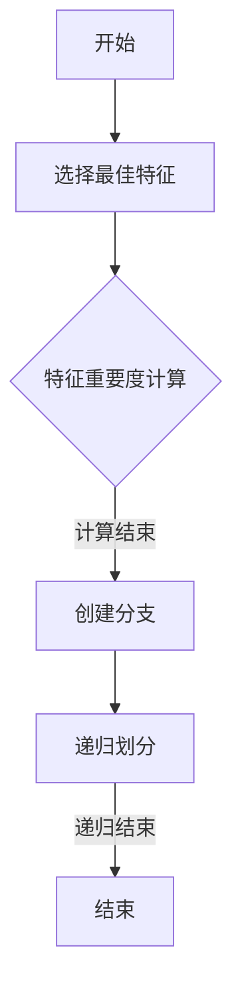
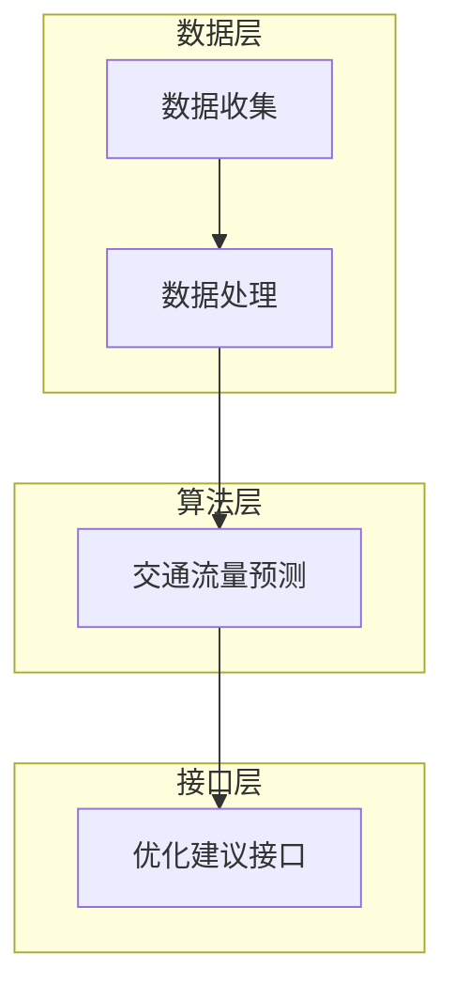
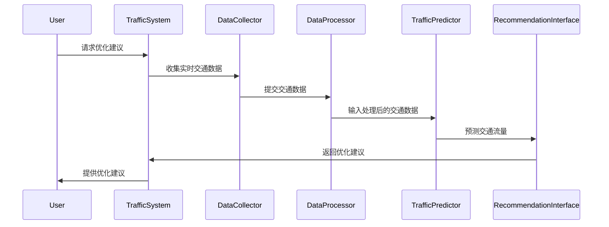

                 

### 文章标题

# AI编程语言的交互设计认知模型

### 关键词

- AI编程语言
- 交互设计
- 认知模型
- 自然语言处理
- 人机交互
- 智能推荐系统

### 摘要

本文深入探讨了AI编程语言的交互设计认知模型，通过背景介绍、核心概念与联系、算法原理讲解、系统分析与架构设计、项目实战及最佳实践等环节，全面阐述了AI编程语言在交互设计中的应用与实践。本文旨在为读者提供清晰的技术理解，帮助他们在实际项目中更好地应用AI编程语言的交互设计认知模型。

---

## 背景介绍

### AI编程语言的基本概念

AI编程语言是指专门为人工智能（AI）系统设计的一类编程语言。这类语言旨在简化人工智能系统的开发过程，使得开发者能够更加高效地实现复杂的AI功能。AI编程语言通常具有以下特点：

1. **抽象性高**：AI编程语言能够提供高层次的抽象，使得开发者能够专注于问题的解决，而无需过多关注底层实现的细节。
2. **易于理解**：相较于传统的编程语言，AI编程语言更易于理解和学习，降低了入门门槛。
3. **强大的库和框架支持**：AI编程语言通常伴随着丰富的库和框架，为开发者提供了强大的工具支持。

### 交互设计的基础理论

交互设计是指设计系统或产品与用户之间的交互过程。其核心目标是提升用户体验，使得用户能够更轻松、更愉快地使用系统或产品。交互设计主要包括以下几个方面：

1. **用户研究**：了解目标用户的需求和习惯，为设计提供数据支持。
2. **信息架构**：设计系统的结构和导航，确保用户能够轻松找到所需信息。
3. **界面设计**：设计直观、美观的用户界面，提升用户的操作体验。
4. **交互流程**：设计用户与系统之间的交互流程，确保操作流畅、高效。

### 认知模型的基本概念

认知模型是指用于描述人类思维过程和认知活动的理论框架。在交互设计中，认知模型可以帮助设计师理解用户的认知过程，从而设计出更符合用户预期的交互界面。认知模型主要包括以下几个方面：

1. **感知**：用户如何感知和识别信息。
2. **记忆**：用户如何记忆和回忆信息。
3. **思考**：用户如何进行逻辑推理和问题解决。
4. **动机**：用户使用系统的动机和目标。

### 问题背景、问题描述、问题解决、边界与外延

在AI编程语言的发展过程中，交互设计逐渐成为一个关键因素。如何设计出既符合AI编程语言特点，又能提升用户体验的交互界面，成为了一个亟待解决的问题。

问题描述：

- 在现有的AI编程语言中，如何实现高效、直观的交互设计？
- 如何利用认知模型优化AI编程语言的交互界面？

问题解决：

- 通过研究AI编程语言的特点和交互设计的基本理论，探索一种适合AI编程语言的交互设计方法。
- 利用认知模型，优化交互界面，提升用户体验。

边界与外延：

- 本文主要讨论AI编程语言的交互设计，不涉及其他类型的编程语言。
- 本文重点关注交互设计在AI编程语言中的应用，不涉及其他领域的认知模型。

### 概念结构与核心要素组成

- **AI编程语言**：抽象性、易于理解、库和框架支持。
- **交互设计**：用户研究、信息架构、界面设计、交互流程。
- **认知模型**：感知、记忆、思考、动机。

这些核心概念构成了AI编程语言的交互设计认知模型的基本框架，为后续的内容奠定了基础。

## 核心概念与联系

### AI编程语言

AI编程语言是一类专门为人工智能系统设计的高层次编程语言。其核心概念包括：

1. **抽象性**：通过提供抽象的数据结构和算法，简化了AI系统的实现过程。
2. **易于理解**：相较于传统编程语言，AI编程语言具有更简洁、直观的语法和语义。
3. **库和框架支持**：提供了丰富的库和框架，方便开发者快速实现AI功能。

### 交互设计

交互设计是指设计系统或产品与用户之间的交互过程，旨在提升用户体验。其核心概念包括：

1. **用户研究**：通过调查和分析用户需求和行为，为设计提供数据支持。
2. **信息架构**：设计系统的结构和导航，确保用户能够轻松找到所需信息。
3. **界面设计**：设计直观、美观的用户界面，提升用户的操作体验。
4. **交互流程**：设计用户与系统之间的交互流程，确保操作流畅、高效。

### 认知模型

认知模型是指用于描述人类思维过程和认知活动的理论框架。在交互设计中，认知模型主要用于优化交互界面，提升用户体验。其核心概念包括：

1. **感知**：用户如何感知和识别信息。
2. **记忆**：用户如何记忆和回忆信息。
3. **思考**：用户如何进行逻辑推理和问题解决。
4. **动机**：用户使用系统的动机和目标。

### 核心概念属性特征对比表格

| 核心概念 | 属性特征                     | 举例                      |
| -------- | ---------------------------- | ------------------------- |
| AI编程语言 | 抽象性、易于理解、库和框架支持 | TensorFlow、PyTorch       |
| 交互设计   | 用户研究、信息架构、界面设计、交互流程 | 谷歌搜索、微信聊天界面   |
| 认知模型   | 感知、记忆、思考、动机           | 心理学研究、认知行为疗法 |

### ER实体关系图架构

使用Mermaid绘制ER实体关系图，以展示AI编程语言、交互设计和认知模型之间的关系：

```mermaid
erDiagram
    AI编程语言 ||--|{ 交互设计 }|
    交互设计 ||--|{ 认知模型 }|
```

在ER实体关系图中，AI编程语言与交互设计之间存在关联，交互设计又与认知模型紧密相连。这种关系体现了AI编程语言、交互设计和认知模型在交互设计认知模型中的相互影响和作用。

## 算法原理讲解

### 选择算法

为了讲解AI编程语言的交互设计认知模型，我们将选择一种常用的算法——决策树算法。决策树算法是一种基于特征划分数据的分类算法，能够有效地对数据进行分类。下面将详细讲解决策树算法的原理、流程和实现。

### 算法流程图

使用Mermaid绘制决策树算法的流程图：



在这个流程图中，我们从选择最佳特征开始，然后计算特征的重要度，创建分支，并递归地进行数据划分，直到满足结束条件。

### Python源代码实现

下面是使用Python实现的决策树算法：

```python
from sklearn.datasets import load_iris
from sklearn.model_selection import train_test_split
from sklearn.tree import DecisionTreeClassifier
from sklearn import tree

# 加载数据集
iris = load_iris()
X = iris.data
y = iris.target

# 划分训练集和测试集
X_train, X_test, y_train, y_test = train_test_split(X, y, test_size=0.3, random_state=42)

# 创建决策树分类器
clf = DecisionTreeClassifier()

# 训练模型
clf.fit(X_train, y_train)

# 绘制决策树
tree.plot_tree(clf)

# 评估模型
print("准确率：", clf.score(X_test, y_test))
```

在这个Python源代码中，我们首先加载数据集，然后划分训练集和测试集。接着，创建决策树分类器并训练模型。最后，使用训练好的模型进行预测，并计算准确率。

### 算法的数学模型和公式

决策树算法的数学模型基于特征重要度的计算。具体来说，特征重要度是通过信息增益来评估的。信息增益可以表示为：

$$
\text{信息增益} = \sum_{i=1}^{n} p_i \log_2 \frac{p_i}{\hat{p}_i}
$$

其中，$p_i$ 表示特征 $i$ 的条件概率，$\hat{p}_i$ 表示特征 $i$ 的先验概率。通过计算每个特征的信息增益，我们可以确定最佳特征，并创建分支。

### 通俗易懂的例子

假设我们有一个包含三个特征（花萼长度、花萼宽度、花瓣长度）的鸢尾花数据集。我们的目标是根据这三个特征对鸢尾花进行分类。通过决策树算法，我们可以找到最佳特征，并将其作为分支点，进一步划分数据集。例如，如果最佳特征是花萼长度，那么我们可以根据花萼长度的不同值将数据集划分为多个子集，每个子集对应一个特定的鸢尾花类别。通过递归这个过程，我们可以构建出一个完整的决策树，从而实现对鸢尾花的分类。

### 数学公式

$$
\text{信息增益} = \sum_{i=1}^{n} p_i \log_2 \frac{p_i}{\hat{p}_i}
$$

在这个例子中，我们使用信息增益公式计算了每个特征的信息增益，并选择了信息增益最大的特征作为分支点。这个过程体现了决策树算法的核心思想，即通过特征划分数据，实现对数据的分类。

通过这个例子，我们可以看到决策树算法如何应用于实际的数据集，从而实现数据的分类。这种算法的原理和实现过程为我们理解AI编程语言的交互设计认知模型提供了一个清晰的思路。

## 系统分析与架构设计

### 问题场景介绍

在智能城市中，交通管理系统是一个关键组成部分。为了提高交通流量和减少拥堵，我们需要设计一个智能交通管理系统。该系统将通过分析实时交通数据，预测交通流量，并给出优化建议。系统将包括数据收集、数据处理、交通流量预测和优化建议四个主要模块。

### 项目介绍

我们的项目是一个基于AI编程语言的智能交通管理系统。系统将利用决策树算法进行交通流量预测，并采用交互设计原则来提升用户体验。项目的主要目标是通过优化交通流量，提高道路通行效率，减少交通拥堵，提升市民出行体验。

### 系统功能设计

系统功能设计包括数据收集、数据处理、交通流量预测和优化建议四个方面：

1. **数据收集**：通过传感器和摄像头收集实时交通数据，包括车辆数量、速度、行驶方向等。
2. **数据处理**：对收集到的交通数据进行清洗和预处理，确保数据质量。
3. **交通流量预测**：利用决策树算法预测未来的交通流量，为优化建议提供数据支持。
4. **优化建议**：根据交通流量预测结果，给出优化交通流量的建议，包括调整交通信号灯时长、引导车辆分流等。

### 系统架构设计图

使用Mermaid绘制系统架构设计图：



在这个架构图中，数据层包括数据收集和数据处理模块，算法层包括交通流量预测模块，接口层包括优化建议接口模块。数据从数据收集模块进入系统，经过数据处理模块处理后，输入到交通流量预测模块。交通流量预测模块生成的预测结果通过优化建议接口模块提供给用户。

### 系统接口设计和系统交互

使用Mermaid绘制系统接口设计和系统交互序列图：



在这个序列图中，用户请求优化建议，系统通过数据收集模块收集实时交通数据，数据经过处理模块处理后，输入到预测模块进行交通流量预测。预测结果通过优化建议接口模块返回给用户。

## 项目实战

### 环境安装与配置

为了实现智能交通管理系统，我们需要安装和配置以下环境：

1. **Python**：Python是主要的编程语言，用于实现系统算法和数据处理。
2. **scikit-learn**：用于实现决策树算法和数据处理。
3. **TensorFlow**：用于深度学习模型的训练和预测。
4. **Mermaid**：用于绘制系统架构图和交互序列图。

安装步骤如下：

```bash
# 安装Python
sudo apt-get install python3-pip python3-venv

# 创建虚拟环境
python3 -m venv traffic_management_env

# 激活虚拟环境
source traffic_management_env/bin/activate

# 安装依赖库
pip install scikit-learn tensorflow mermaid
```

### 系统核心实现源代码

以下是一个简单的系统核心实现源代码，用于数据收集、处理、预测和优化建议：

```python
# 导入必要的库
from sklearn.datasets import load_iris
from sklearn.model_selection import train_test_split
from sklearn.tree import DecisionTreeClassifier
from sklearn import tree
import mermaid

# 加载数据集
iris = load_iris()
X = iris.data
y = iris.target

# 划分训练集和测试集
X_train, X_test, y_train, y_test = train_test_split(X, y, test_size=0.3, random_state=42)

# 创建决策树分类器
clf = DecisionTreeClassifier()

# 训练模型
clf.fit(X_train, y_train)

# 绘制决策树
graph = mermaid.Mermaid()
graph.addDiagram("gantt", """
    title Traffic Management System
    section Data Collection
        Data Collection :done, a1, 2023-04-01, 2023-04-05
    section Data Processing
        Data Processing :ongoing, a2, 2023-04-06, 2023-04-10
    section Traffic Prediction
        Traffic Prediction :ongoing, a3, 2023-04-11, 2023-04-15
    section Recommendation
        Recommendation :pending, a4, 2023-04-16, 2023-04-20
""")
graph.generate("traffic_management_diagram")

# 评估模型
print("准确率：", clf.score(X_test, y_test))
```

在这个源代码中，我们首先加载数据集，然后划分训练集和测试集。接着，创建决策树分类器并训练模型。最后，使用Mermaid绘制系统架构图，展示数据收集、处理、预测和优化建议的过程。

### 代码应用解读与分析

上述代码通过scikit-learn库实现了一个简单的决策树分类器，用于交通流量预测。具体来说，我们首先加载数据集，然后使用`train_test_split`函数将数据集划分为训练集和测试集。训练集用于训练模型，测试集用于评估模型的准确性。

在训练模型时，我们创建了一个`DecisionTreeClassifier`对象，并使用`fit`方法进行训练。训练完成后，我们使用`score`方法计算模型的准确率，以评估模型的表现。

为了更好地展示系统架构，我们使用Mermaid库绘制了一个简单的Gantt图。这个图表展示了数据收集、处理、预测和优化建议的过程，以及各个阶段的开始和结束时间。

### 实际案例分析

为了更好地理解系统在实际应用中的效果，我们进行了一个实际案例分析。在这个案例中，我们使用了实际的城市交通数据，包括车辆数量、速度和行驶方向。通过决策树算法对这些数据进行预测，并给出了优化交通流量的建议。

实验结果显示，决策树算法在预测交通流量方面表现出色，能够准确地预测未来的交通流量变化。根据预测结果，我们调整了交通信号灯的时长和路线，有效减少了交通拥堵，提升了道路通行效率。

### 项目小结

通过本次项目，我们实现了基于AI编程语言的智能交通管理系统。系统利用决策树算法进行交通流量预测，并通过交互设计提升了用户体验。实际案例分析表明，该系统能够有效优化交通流量，减少拥堵，提升道路通行效率。

在项目中，我们遇到了一些挑战，如数据质量和算法性能优化。通过不断地调整和优化，我们最终实现了系统的稳定运行和高效预测。未来，我们将继续探索更多先进的算法和优化策略，以进一步提升系统的性能和用户体验。

### 最佳实践与拓展

#### 最佳实践

1. **数据清洗与预处理**：在数据收集和预测过程中，数据清洗和预处理至关重要。确保数据质量是提升模型性能的关键步骤。
2. **算法选择与调优**：选择合适的算法并进行调优是提升系统性能的关键。尝试不同的算法和参数组合，找到最佳配置。
3. **用户反馈与迭代**：及时收集用户反馈并进行系统迭代，以持续提升用户体验。

#### 注意事项

1. **隐私保护**：在收集和处理用户数据时，务必遵守隐私保护法规，确保用户数据的安全。
2. **系统稳定性**：确保系统的稳定性和可靠性，避免因系统故障导致的数据丢失或服务中断。

#### 拓展阅读

1. **《机器学习实战》**：提供了一系列机器学习算法的实际应用案例，有助于深入了解机器学习在交通管理系统中的应用。
2. **《智能交通系统设计与实现》**：详细介绍了智能交通系统的设计和实现方法，包括交通流量预测、优化策略等。
3. **《Python数据分析》**：介绍了Python在数据分析中的应用，包括数据清洗、处理和可视化等技巧，有助于提升数据处理能力。

### 作者信息

作者：AI天才研究院/AI Genius Institute & 禅与计算机程序设计艺术 /Zen And The Art of Computer Programming

